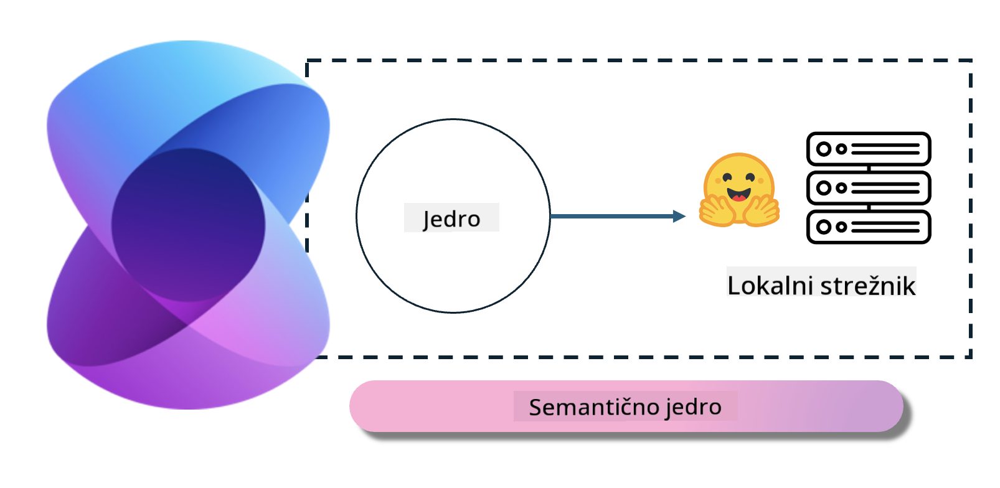

<!--
CO_OP_TRANSLATOR_METADATA:
{
  "original_hash": "bcf5dd7031db0031abdb9dd0c05ba118",
  "translation_date": "2025-05-09T12:09:57+00:00",
  "source_file": "md/01.Introduction/03/Local_Server_Inference.md",
  "language_code": "sl"
}
-->
# **Inference Phi-3 na lokalnem strežniku**

Phi-3 lahko namestimo na lokalni strežnik. Uporabniki lahko izberejo rešitve [Ollama](https://ollama.com) ali [LM Studio](https://llamaedge.com), lahko pa napišejo tudi svojo kodo. Phi-3-jeve lokalne storitve lahko povežete prek [Semantic Kernel](https://github.com/microsoft/semantic-kernel?WT.mc_id=aiml-138114-kinfeylo) ali [Langchain](https://www.langchain.com/), da ustvarite aplikacije Copilot.

## **Uporaba Semantic Kernel za dostop do Phi-3-mini**

V aplikaciji Copilot ustvarjamo aplikacije preko Semantic Kernel / LangChain. Ta vrsta aplikacijskega ogrodja je običajno združljiva z Azure OpenAI Service / OpenAI modeli, prav tako pa podpira odprtokodne modele na Hugging Face in lokalne modele. Kaj storiti, če želimo uporabiti Semantic Kernel za dostop do Phi-3-mini? Kot primer uporabimo .NET, ki ga lahko združimo z Hugging Face Connectorjem v Semantic Kernel. Privzeto se poveže z model id na Hugging Face (prvič ko ga uporabite, se model prenese z Hugging Face, kar traja nekaj časa). Povežete se lahko tudi na zgrajeno lokalno storitev. Priporočamo slednjo možnost, saj omogoča večjo samostojnost, še posebej v poslovnih aplikacijah.

Iz slike je razvidno, da dostop do lokalnih storitev prek Semantic Kernel enostavno poveže samostojno zgrajeni strežnik modela Phi-3-mini. Tukaj je rezultat zagona:

***Sample Code*** https://github.com/kinfey/Phi3MiniSamples/tree/main/semantickernel

**Omejitev odgovornosti**:  
Ta dokument je bil preveden z uporabo AI prevajalske storitve [Co-op Translator](https://github.com/Azure/co-op-translator). Čeprav si prizadevamo za natančnost, vas prosimo, da upoštevate, da avtomatizirani prevodi lahko vsebujejo napake ali netočnosti. Izvirni dokument v njegovem izvirnem jeziku velja za avtoritativni vir. Za kritične informacije priporočamo strokovni človeški prevod. Za morebitne nesporazume ali napačne interpretacije, ki izhajajo iz uporabe tega prevoda, ne odgovarjamo.