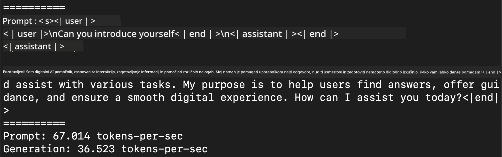
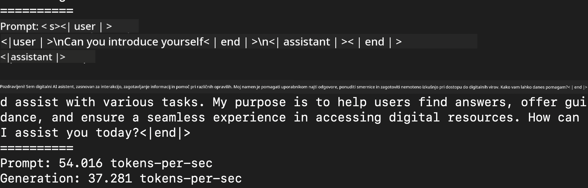
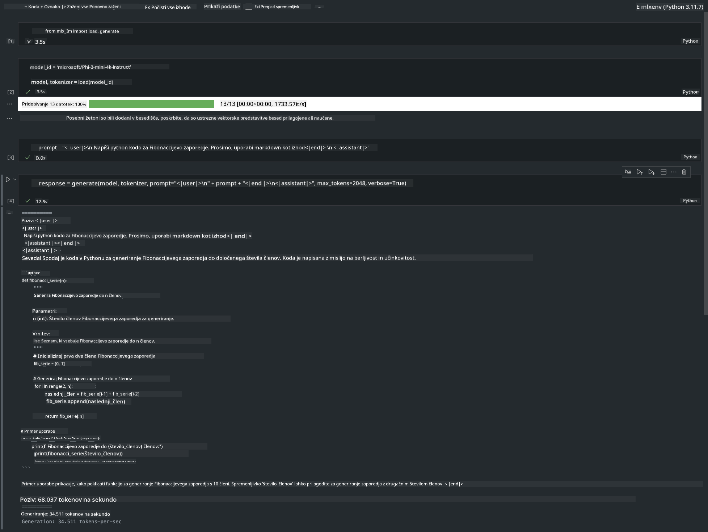

<!--
CO_OP_TRANSLATOR_METADATA:
{
  "original_hash": "dcb656f3d206fc4968e236deec5d4384",
  "translation_date": "2025-05-09T12:21:01+00:00",
  "source_file": "md/01.Introduction/03/MLX_Inference.md",
  "language_code": "sl"
}
-->
# **Inference Phi-3 z Apple MLX Framework**

## **Kaj je MLX Framework**

MLX je ogrodje za delo z matrikami namenjeno raziskavam strojnega učenja na Apple silikonu, ki ga je razvilo Apple machine learning research.

MLX so zasnovali raziskovalci strojnega učenja za raziskovalce strojnega učenja. Ogrodje je uporabniku prijazno, a hkrati učinkovito za učenje in uporabo modelov. Sam dizajn ogrodja je tudi konceptualno preprost. Cilj je omogočiti raziskovalcem enostavno razširjanje in izboljševanje MLX, da bodo lahko hitro preizkušali nove ideje.

Veliki jezikovni modeli (LLM) se lahko pospešijo na napravah Apple Silicon z MLX, modele pa je mogoče zelo priročno zagnati lokalno.

## **Uporaba MLX za inferenco Phi-3-mini**

### **1. Nastavitev MLX okolja**

1. Python 3.11.x  
2. Namestite MLX knjižnico


```bash

pip install mlx-lm

```

### **2. Zagon Phi-3-mini v Terminalu z MLX**


```bash

python -m mlx_lm.generate --model microsoft/Phi-3-mini-4k-instruct --max-token 2048 --prompt  "<|user|>\nCan you introduce yourself<|end|>\n<|assistant|>"

```

Rezultat (moje okolje je Apple M1 Max, 64GB) je



### **3. Kvantizacija Phi-3-mini z MLX v Terminalu**


```bash

python -m mlx_lm.convert --hf-path microsoft/Phi-3-mini-4k-instruct

```

***Note：*** Model lahko kvantiziramo z mlx_lm.convert, privzeta kvantizacija je INT4. Ta primer kvantizira Phi-3-mini v INT4.

Model lahko kvantiziramo z mlx_lm.convert, privzeta kvantizacija je INT4. V tem primeru kvantiziramo Phi-3-mini v INT4. Po kvantizaciji bo shranjen v privzeti imenik ./mlx_model

Model kvantiziran z MLX lahko preizkusimo iz terminala


```bash

python -m mlx_lm.generate --model ./mlx_model/ --max-token 2048 --prompt  "<|user|>\nCan you introduce yourself<|end|>\n<|assistant|>"

```

Rezultat je




### **4. Zagon Phi-3-mini z MLX v Jupyter Notebooku**




***Note:*** Prosimo, preberite ta primer [kliknite tukaj](../../../../../code/03.Inference/MLX/MLX_DEMO.ipynb)


## **Viri**

1. Več o Apple MLX Framework [https://ml-explore.github.io](https://ml-explore.github.io/mlx/build/html/index.html)

2. Apple MLX GitHub Repo [https://github.com/ml-explore](https://github.com/ml-explore)

**Omejitev odgovornosti**:  
Ta dokument je bil preveden z uporabo AI prevajalske storitve [Co-op Translator](https://github.com/Azure/co-op-translator). Čeprav si prizadevamo za natančnost, vas opozarjamo, da avtomatizirani prevodi lahko vsebujejo napake ali netočnosti. Izvirni dokument v njegovem izvorni jezik je treba upoštevati kot avtoritativni vir. Za ključne informacije priporočamo strokovni človeški prevod. Za morebitne nesporazume ali napačne interpretacije, ki izhajajo iz uporabe tega prevoda, ne odgovarjamo.