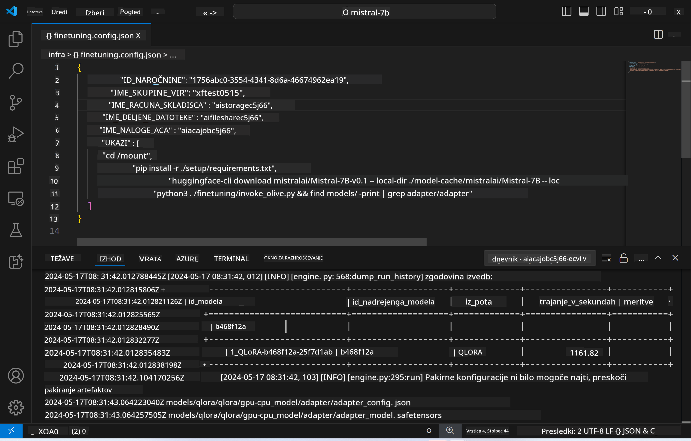
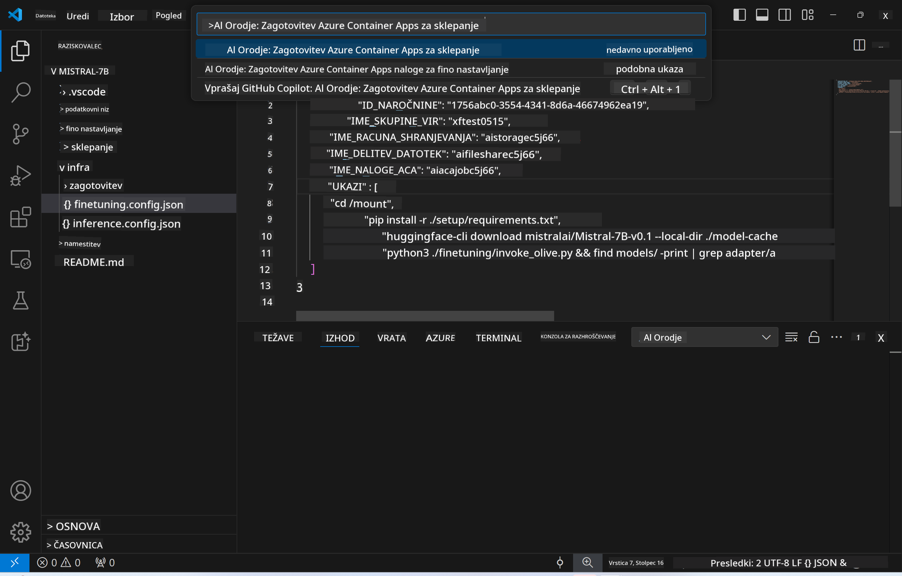
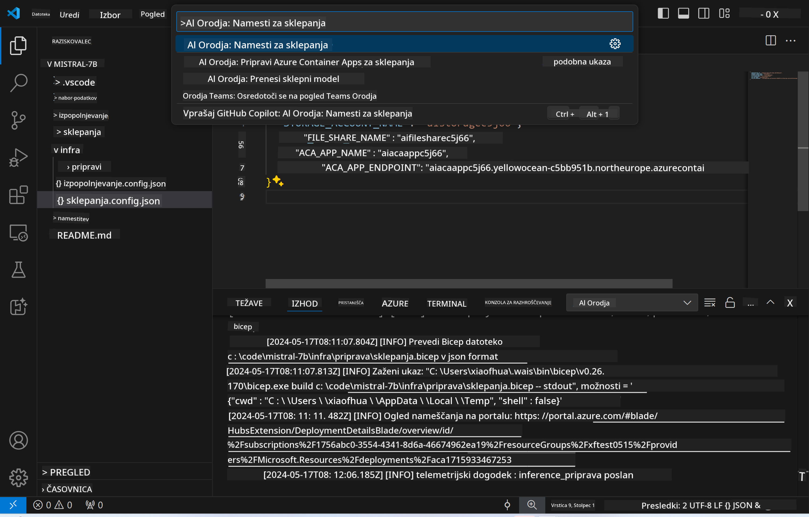
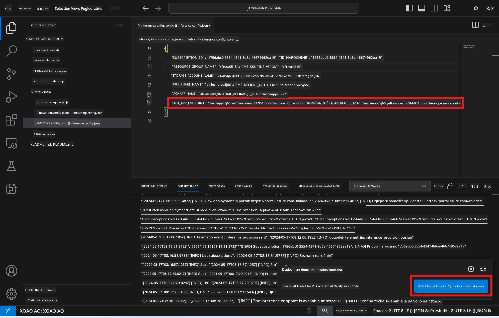

<!--
CO_OP_TRANSLATOR_METADATA:
{
  "original_hash": "a54cd3d65b6963e4e8ce21e143c3ab04",
  "translation_date": "2025-05-09T12:48:20+00:00",
  "source_file": "md/01.Introduction/03/Remote_Interence.md",
  "language_code": "sl"
}
-->
# Remote Inferencing with the fine-tuned model

After training the adapters in the remote environment, use a simple Gradio app to interact with the model.



### Provision Azure Resources
Set up the Azure Resources for remote inference by running the `AI Toolkit: Provision Azure Container Apps for inference` command from the command palette. During setup, you'll be prompted to select your Azure Subscription and resource group.  

   
By default, the subscription and resource group for inference should match those used during fine-tuning. The inference will use the same Azure Container App Environment and access the model and adapter stored in Azure Files, created during the fine-tuning step. 

## Using AI Toolkit 

### Deployment for Inference  
If you want to update the inference code or reload the inference model, run the `AI Toolkit: Deploy for inference` command. This syncs your latest code with ACA and restarts the replica.  



Once deployment finishes successfully, the model is ready for evaluation via this endpoint.

### Accessing the Inference API

Access the inference API by clicking the "*Go to Inference Endpoint*" button in the VSCode notification. Alternatively, find the web API endpoint under `ACA_APP_ENDPOINT` in `./infra/inference.config.json` and in the output panel.



> **Note:** The inference endpoint may take a few minutes before it becomes fully operational.

## Inference Components Included in the Template
 
| Folder | Contents |
| ------ |--------- |
| `infra` | Contains all necessary configurations for remote operations. |
| `infra/provision/inference.parameters.json` | Holds parameters for the bicep templates, used to provision Azure resources for inference. |
| `infra/provision/inference.bicep` | Contains templates for provisioning Azure resources for inference. |
| `infra/inference.config.json` | The configuration file generated by the `AI Toolkit: Provision Azure Container Apps for inference` command. It serves as input for other remote command palettes. |

### Using AI Toolkit to configure Azure Resource Provision
Set up the [AI Toolkit](https://marketplace.visualstudio.com/items?itemName=ms-windows-ai-studio.windows-ai-studio)

Provision Azure Container Apps for inference using ` command.

You can find configuration parameters in `./infra/provision/inference.parameters.json` file. Here are the details:
| Parameter | Description |
| --------- |------------ |
| `defaultCommands` | This is the commands to initiate a web API. |
| `maximumInstanceCount` | This parameter sets the maximum capacity of GPU instances. |
| `location` | This is the location where Azure resources are provisioned. The default value is the same as the chosen resource group's location. |
| `storageAccountName`, `fileShareName` `acaEnvironmentName`, `acaEnvironmentStorageName`, `acaAppName`,  `acaLogAnalyticsName` | These parameters are used to name the Azure resources for provision. By default, they will be same to the fine-tuning resource name. You can input a new, unused resource name to create your own custom-named resources, or you can input the name of an already existing Azure resource if you'd prefer to use that. For details, refer to the section [Using existing Azure Resources](../../../../../md/01.Introduction/03). |

### Using Existing Azure Resources

By default, the inference provision use the same Azure Container App Environment, Storage Account, Azure File Share, and Azure Log Analytics that were used for fine-tuning. A separate Azure Container App is created solely for the inference API. 

If you have customized the Azure resources during the fine-tuning step or want to use your own existing Azure resources for inference, specify their names in the `./infra/inference.parameters.json` file. Then run the `AI Toolkit: Provision Azure Container Apps for inference` command from the command palette. This will update any specified resources and create any missing ones.

For example, if you already have an Azure container environment, your `./infra/finetuning.parameters.json` should look like this:

```json
{
    "$schema": "https://schema.management.azure.com/schemas/2019-04-01/deploymentParameters.json#",
    "contentVersion": "1.0.0.0",
    "parameters": {
      ...
      "acaEnvironmentName": {
        "value": "<your-aca-env-name>"
      },
      "acaEnvironmentStorageName": {
        "value": null
      },
      ...
    }
  }
```

### Manual Provision  
If you prefer to manually set up Azure resources, you can use the provided bicep files in the `./infra/provision` folders. If you have already set up and configured all the Azure resources without using the AI Toolkit command palette, you can simply enter the resource names in the `inference.config.json` file.

For example:

```json
{
  "SUBSCRIPTION_ID": "<your-subscription-id>",
  "RESOURCE_GROUP_NAME": "<your-resource-group-name>",
  "STORAGE_ACCOUNT_NAME": "<your-storage-account-name>",
  "FILE_SHARE_NAME": "<your-file-share-name>",
  "ACA_APP_NAME": "<your-aca-name>",
  "ACA_APP_ENDPOINT": "<your-aca-endpoint>"
}
```

**Izjava o omejitvi odgovornosti**:  
Ta dokument je bil preveden z uporabo AI prevajalske storitve [Co-op Translator](https://github.com/Azure/co-op-translator). Čeprav si prizadevamo za natančnost, vas prosimo, da upoštevate, da lahko avtomatizirani prevodi vsebujejo napake ali netočnosti. Izvirni dokument v njegovem izvorno jeziku velja za avtoritativni vir. Za ključne informacije priporočamo strokovni človeški prevod. Nismo odgovorni za morebitne nesporazume ali napačne interpretacije, ki izhajajo iz uporabe tega prevoda.