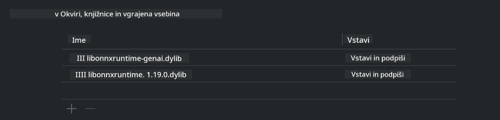

<!--
CO_OP_TRANSLATOR_METADATA:
{
  "original_hash": "82af197df38d25346a98f1f0e84d1698",
  "translation_date": "2025-07-16T20:25:19+00:00",
  "source_file": "md/01.Introduction/03/iOS_Inference.md",
  "language_code": "sl"
}
-->
# **Inferenca Phi-3 na iOS**

Phi-3-mini je nova serija modelov iz Microsofta, ki omogoča nameščanje velikih jezikovnih modelov (LLM) na robne naprave in IoT naprave. Phi-3-mini je na voljo za iOS, Android in Edge Device namestitve, kar omogoča uporabo generativne umetne inteligence v BYOD okoljih. Naslednji primer prikazuje, kako namestiti Phi-3-mini na iOS.

## **1. Priprava**

- **a.** macOS 14+
- **b.** Xcode 15+
- **c.** iOS SDK 17.x (iPhone 14 A16 ali novejši)
- **d.** Namestite Python 3.10+ (priporočamo Conda)
- **e.** Namestite Python knjižnico: `python-flatbuffers`
- **f.** Namestite CMake

### Semantic Kernel in inferenca

Semantic Kernel je aplikacijski okvir, ki omogoča ustvarjanje aplikacij, združljivih z Azure OpenAI Service, OpenAI modeli in celo lokalnimi modeli. Dostop do lokalnih storitev preko Semantic Kernel omogoča enostavno integracijo z vašim samostojno gostovanim strežnikom modela Phi-3-mini.

### Klicanje kvantiziranih modelov z Ollama ali LlamaEdge

Veliko uporabnikov raje uporablja kvantizirane modele za lokalno izvajanje. [Ollama](https://ollama.com) in [LlamaEdge](https://llamaedge.com) omogočata klic različnih kvantiziranih modelov:

#### **Ollama**

Lahko zaženete `ollama run phi3` neposredno ali ga konfigurirate brez povezave. Ustvarite Modelfile s potjo do vaše `gguf` datoteke. Primer kode za zagon kvantiziranega modela Phi-3-mini:

```gguf
FROM {Add your gguf file path}
TEMPLATE \"\"\"<|user|> .Prompt<|end|> <|assistant|>\"\"\"
PARAMETER stop <|end|>
PARAMETER num_ctx 4096
```

#### **LlamaEdge**

Če želite uporabljati `gguf` hkrati v oblaku in na robnih napravah, je LlamaEdge odlična izbira.

## **2. Prevajanje ONNX Runtime za iOS**

```bash

git clone https://github.com/microsoft/onnxruntime.git

cd onnxruntime

./build.sh --build_shared_lib --ios --skip_tests --parallel --build_dir ./build_ios --ios --apple_sysroot iphoneos --osx_arch arm64 --apple_deploy_target 17.5 --cmake_generator Xcode --config Release

cd ../

```

### **Obvestilo**

- **a.** Pred prevajanjem se prepričajte, da je Xcode pravilno nastavljen in ga nastavite kot aktivni razvojni imenik v terminalu:

    ```bash
    sudo xcode-select -switch /Applications/Xcode.app/Contents/Developer
    ```

- **b.** ONNX Runtime je treba prevesti za različne platforme. Za iOS lahko prevajate za `arm64` ali `x86_64`.

- **c.** Priporočamo uporabo najnovejše različice iOS SDK za prevajanje. Vendar lahko uporabite tudi starejšo različico, če potrebujete združljivost s prejšnjimi SDK-ji.

## **3. Prevajanje Generative AI z ONNX Runtime za iOS**

> **Note:** Ker je Generative AI z ONNX Runtime v predogledu, bodite pozorni na morebitne spremembe.

```bash

git clone https://github.com/microsoft/onnxruntime-genai
 
cd onnxruntime-genai
 
mkdir ort
 
cd ort
 
mkdir include
 
mkdir lib
 
cd ../
 
cp ../onnxruntime/include/onnxruntime/core/session/onnxruntime_c_api.h ort/include
 
cp ../onnxruntime/build_ios/Release/Release-iphoneos/libonnxruntime*.dylib* ort/lib
 
export OPENCV_SKIP_XCODEBUILD_FORCE_TRYCOMPILE_DEBUG=1
 
python3 build.py --parallel --build_dir ./build_ios --ios --ios_sysroot iphoneos --ios_arch arm64 --ios_deployment_target 17.5 --cmake_generator Xcode --cmake_extra_defines CMAKE_XCODE_ATTRIBUTE_CODE_SIGNING_ALLOWED=NO

```

## **4. Ustvarite aplikacijo v Xcode**

Izbral sem Objective-C kot način razvoja aplikacije, ker je uporaba Generative AI z ONNX Runtime C++ API-jem v Objective-C bolj združljiva. Seveda lahko ustrezne klice izvedete tudi preko Swift bridginga.


## **5. Kopirajte ONNX kvantizirani INT4 model v projekt aplikacije**

Potrebno je uvoziti INT4 kvantizacijski model v ONNX formatu, ki ga je treba najprej prenesti.


Po prenosu ga dodajte v mapo Resources v projektu v Xcode.


## **6. Dodajanje C++ API v ViewControllers**

> **Obvestilo:**

- **a.** Dodajte ustrezne C++ glave datotek v projekt.

  

- **b.** Vključite dinamično knjižnico `onnxruntime-genai` v Xcode.

  

- **c.** Za testiranje uporabite C vzorčno kodo. Dodate lahko tudi dodatne funkcije, kot je ChatUI, za večjo funkcionalnost.

- **d.** Ker boste v projektu uporabljali C++, preimenujte `ViewController.m` v `ViewController.mm`, da omogočite podporo za Objective-C++.

```objc

    NSString *llmPath = [[NSBundle mainBundle] resourcePath];
    char const *modelPath = llmPath.cString;

    auto model =  OgaModel::Create(modelPath);

    auto tokenizer = OgaTokenizer::Create(*model);

    const char* prompt = "<|system|>You are a helpful AI assistant.<|end|><|user|>Can you introduce yourself?<|end|><|assistant|>";

    auto sequences = OgaSequences::Create();
    tokenizer->Encode(prompt, *sequences);

    auto params = OgaGeneratorParams::Create(*model);
    params->SetSearchOption("max_length", 100);
    params->SetInputSequences(*sequences);

    auto output_sequences = model->Generate(*params);
    const auto output_sequence_length = output_sequences->SequenceCount(0);
    const auto* output_sequence_data = output_sequences->SequenceData(0);
    auto out_string = tokenizer->Decode(output_sequence_data, output_sequence_length);
    
    auto tmp = out_string;

```

## **7. Zagon aplikacije**

Ko je nastavitev končana, lahko zaženete aplikacijo in si ogledate rezultate inference modela Phi-3-mini.


Za več vzorčne kode in podrobna navodila obiščite [Phi-3 Mini Samples repository](https://github.com/Azure-Samples/Phi-3MiniSamples/tree/main/ios).

**Omejitev odgovornosti**:  
Ta dokument je bil preveden z uporabo AI prevajalske storitve [Co-op Translator](https://github.com/Azure/co-op-translator). Čeprav si prizadevamo za natančnost, vas opozarjamo, da avtomatizirani prevodi lahko vsebujejo napake ali netočnosti. Izvirni dokument v njegovem izvirnem jeziku velja za avtoritativni vir. Za pomembne informacije priporočamo strokovni človeški prevod. Za morebitna nesporazume ali napačne interpretacije, ki izhajajo iz uporabe tega prevoda, ne odgovarjamo.