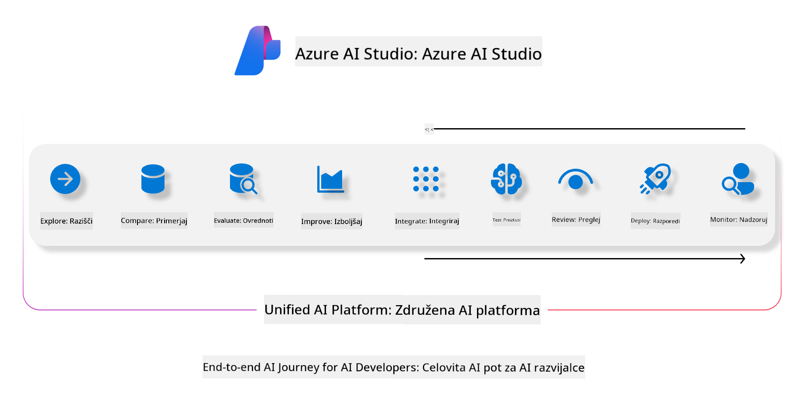

<!--
CO_OP_TRANSLATOR_METADATA:
{
  "original_hash": "7b4235159486df4000e16b7b46ddfec3",
  "translation_date": "2025-05-09T15:05:18+00:00",
  "source_file": "md/01.Introduction/05/AIFoundry.md",
  "language_code": "sl"
}
-->
# **Uporaba Azure AI Foundry za ocenjevanje**

Kako oceniti svojo generativno AI aplikacijo z uporabo [Azure AI Foundry](https://ai.azure.com?WT.mc_id=aiml-138114-kinfeylo). Ne glede na to, ali ocenjujete enkratne ali večkratne pogovore, Azure AI Foundry ponuja orodja za ocenjevanje zmogljivosti in varnosti modela.

## Kako oceniti generativne AI aplikacije z Azure AI Foundry
Za podrobnejša navodila si oglejte [dokumentacijo Azure AI Foundry](https://learn.microsoft.com/azure/ai-studio/how-to/evaluate-generative-ai-app?WT.mc_id=aiml-138114-kinfeylo)

Tukaj so koraki za začetek:

## Ocenjevanje generativnih AI modelov v Azure AI Foundry

**Pogoji za začetek**

- Testni podatkovni niz v CSV ali JSON formatu.
- Uporabljen generativni AI model (kot so Phi-3, GPT 3.5, GPT 4 ali modeli Davinci).
- Runtime z računalniškim instancom za izvedbo ocenjevanja.

## Vgrajeni merilniki ocenjevanja

Azure AI Foundry omogoča ocenjevanje tako enkratnih kot tudi kompleksnih večkratnih pogovorov.
Za scenarije Retrieval Augmented Generation (RAG), kjer je model podprt z določenimi podatki, lahko zmogljivost ocenite z uporabo vgrajenih merilnikov.
Poleg tega lahko ocenjujete tudi splošne enkratne scenarije odgovarjanja na vprašanja (ne-RAG).

## Ustvarjanje ocenjevalnega zagona

V uporabniškem vmesniku Azure AI Foundry pojdite na stran Evaluate ali Prompt Flow.
Sledite čarovniku za ustvarjanje ocenjevanja in nastavite ocenjevalni zagon. Po želji dodajte ime ocenjevanja.
Izberite scenarij, ki se ujema s cilji vaše aplikacije.
Izberite eno ali več merilnikov za ocenjevanje izhodov modela.

## Prilagojen ocenjevalni potek (neobvezno)

Za večjo prilagodljivost lahko vzpostavite prilagojen ocenjevalni potek. Prilagodite proces ocenjevanja glede na svoje specifične zahteve.

## Ogled rezultatov

Po izvedbi ocenjevanja si v Azure AI Foundry oglejte, zabeležite in analizirajte podrobne merilnike ocenjevanja. Pridobite vpogled v zmogljivosti in omejitve vaše aplikacije.

**Note** Azure AI Foundry je trenutno v javni predogledni fazi, zato ga uporabljajte za eksperimentiranje in razvoj. Za produkcijsko rabo razmislite o drugih možnostih. Za več podrobnosti in korak za korakom navodila si oglejte uradno [dokumentacijo AI Foundry](https://learn.microsoft.com/azure/ai-studio/?WT.mc_id=aiml-138114-kinfeylo).

**Omejitev odgovornosti**:  
Ta dokument je bil preveden z uporabo storitve za avtomatski prevod AI [Co-op Translator](https://github.com/Azure/co-op-translator). Čeprav si prizadevamo za natančnost, vas opozarjamo, da avtomatski prevodi lahko vsebujejo napake ali netočnosti. Izvirni dokument v njegovem izvirnem jeziku velja za avtoritativni vir. Za pomembne informacije priporočamo strokovni človeški prevod. Nismo odgovorni za morebitna nesporazume ali napačne interpretacije, ki izhajajo iz uporabe tega prevoda.