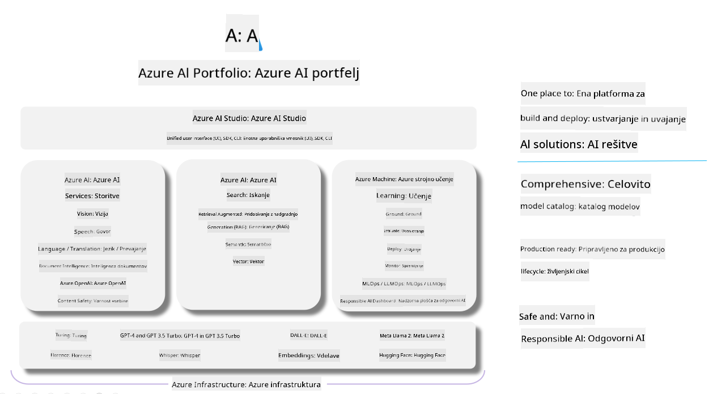

<!--
CO_OP_TRANSLATOR_METADATA:
{
  "original_hash": "7b4235159486df4000e16b7b46ddfec3",
  "translation_date": "2025-07-16T22:34:20+00:00",
  "source_file": "md/01.Introduction/05/AIFoundry.md",
  "language_code": "sl"
}
-->
# **Uporaba Azure AI Foundry za ocenjevanje**

Kako oceniti svojo generativno AI aplikacijo z uporabo [Azure AI Foundry](https://ai.azure.com?WT.mc_id=aiml-138114-kinfeylo). Ne glede na to, ali ocenjujete enkratne ali večkratne pogovore, Azure AI Foundry ponuja orodja za ocenjevanje zmogljivosti in varnosti modela.

## Kako oceniti generativne AI aplikacije z Azure AI Foundry
Za podrobnejša navodila si oglejte [Azure AI Foundry dokumentacijo](https://learn.microsoft.com/azure/ai-studio/how-to/evaluate-generative-ai-app?WT.mc_id=aiml-138114-kinfeylo)

Tukaj so koraki za začetek:

## Ocenjevanje generativnih AI modelov v Azure AI Foundry

**Pogoji**

- Testni nabor podatkov v formatu CSV ali JSON.
- Uporabljen generativni AI model (kot so Phi-3, GPT 3.5, GPT 4 ali modeli Davinci).
- Runtime z računalniškim primerkom za izvajanje ocenjevanja.

## Vgrajene metrike ocenjevanja

Azure AI Foundry omogoča ocenjevanje tako enkratnih kot kompleksnih večkratnih pogovorov.  
Za scenarije Retrieval Augmented Generation (RAG), kjer je model podprt s specifičnimi podatki, lahko zmogljivost ocenite z vgrajenimi metričnimi orodji.  
Poleg tega lahko ocenjujete tudi splošne enkratne scenarije odgovarjanja na vprašanja (ne-RAG).

## Ustvarjanje ocenjevalnega zagona

V uporabniškem vmesniku Azure AI Foundry pojdite na stran Evaluate ali Prompt Flow.  
Sledite čarovniku za ustvarjanje ocenjevanja in nastavite ocenjevalni zagon. Po želji vnesite ime ocenjevanja.  
Izberite scenarij, ki ustreza ciljem vaše aplikacije.  
Izberite eno ali več metrik za ocenjevanje izhodov modela.

## Prilagojen ocenjevalni potek (neobvezno)

Za večjo prilagodljivost lahko ustvarite svoj prilagojen ocenjevalni potek. Prilagodite postopek ocenjevanja glede na svoje specifične zahteve.

## Ogled rezultatov

Po izvedbi ocenjevanja si v Azure AI Foundry oglejte, zabeležite in analizirajte podrobne metrike ocenjevanja. Pridobite vpogled v zmogljivosti in omejitve vaše aplikacije.

**Note** Azure AI Foundry je trenutno v javni predogledni fazi, zato ga uporabljajte za eksperimentiranje in razvoj. Za produkcijske naloge razmislite o drugih možnostih. Za več informacij in podrobna navodila si oglejte uradno [AI Foundry dokumentacijo](https://learn.microsoft.com/azure/ai-studio/?WT.mc_id=aiml-138114-kinfeylo).

**Omejitev odgovornosti**:  
Ta dokument je bil preveden z uporabo AI prevajalske storitve [Co-op Translator](https://github.com/Azure/co-op-translator). Čeprav si prizadevamo za natančnost, vas opozarjamo, da avtomatizirani prevodi lahko vsebujejo napake ali netočnosti. Izvirni dokument v njegovem izvirnem jeziku velja za avtoritativni vir. Za ključne informacije priporočamo strokovni človeški prevod. Za morebitna nesporazume ali napačne interpretacije, ki izhajajo iz uporabe tega prevoda, ne odgovarjamo.