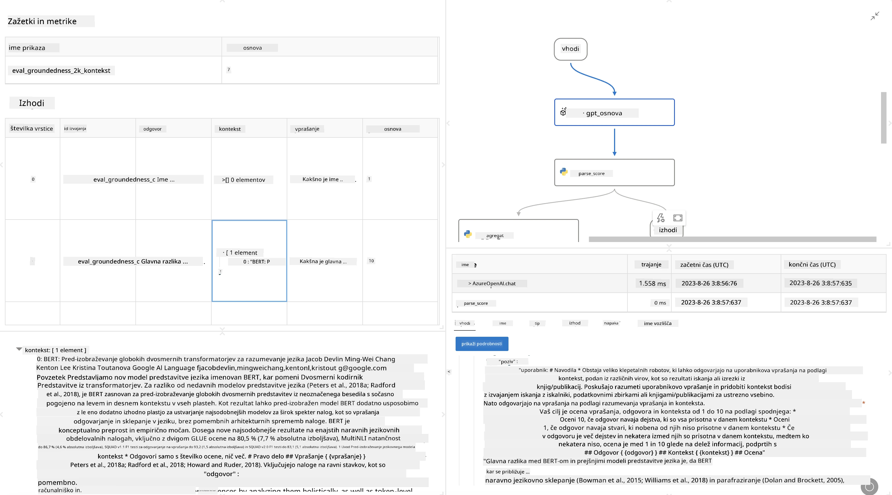

<!--
CO_OP_TRANSLATOR_METADATA:
{
  "original_hash": "3cbe7629d254f1043193b7fe22524d55",
  "translation_date": "2025-07-16T22:45:31+00:00",
  "source_file": "md/01.Introduction/05/Promptflow.md",
  "language_code": "sl"
}
-->
# **Predstavitev Promptflow**

[Microsoft Prompt Flow](https://microsoft.github.io/promptflow/index.html?WT.mc_id=aiml-138114-kinfeylo) je vizualno orodje za avtomatizacijo delovnih tokov, ki uporabnikom omogoča ustvarjanje avtomatiziranih delovnih tokov z uporabo vnaprej pripravljenih predlog in prilagojenih konektorjev. Namenjen je razvijalcem in poslovnim analitikom, da hitro zgradijo avtomatizirane procese za naloge, kot so upravljanje podatkov, sodelovanje in optimizacija procesov. S Prompt Flow lahko uporabniki enostavno povežejo različne storitve, aplikacije in sisteme ter avtomatizirajo kompleksne poslovne procese.

Microsoft Prompt Flow je zasnovan za poenostavitev celotnega razvojnega cikla AI aplikacij, ki temeljijo na velikih jezikovnih modelih (LLM). Ne glede na to, ali razvijate ideje, prototipe, testirate, ocenjujete ali uvajate aplikacije na osnovi LLM, Prompt Flow poenostavi postopek in vam omogoča izdelavo aplikacij LLM z industrijsko kakovostjo.

## Ključne funkcije in prednosti uporabe Microsoft Prompt Flow:

**Interaktivna izkušnja ustvarjanja**

Prompt Flow prikazuje vizualno strukturo vašega delovnega toka, kar olajša razumevanje in navigacijo po projektih.  
Nudi izkušnjo kodiranja, podobno zvezku, za učinkovito razvoj in odpravljanje napak v delovnem toku.

**Različice in prilagajanje pozivov**

Ustvarite in primerjajte več različic pozivov, da omogočite iterativni proces izboljšav. Ocenite uspešnost različnih pozivov in izberite najučinkovitejše.

**Vgrajeni evalvacijski delovni tokovi**  
Ocenite kakovost in učinkovitost vaših pozivov in delovnih tokov z uporabo vgrajenih orodij za evalvacijo.  
Razumite, kako dobro delujejo vaše aplikacije na osnovi LLM.

**Obsežni viri**

Prompt Flow vključuje knjižnico vgrajenih orodij, vzorcev in predlog. Ti viri služijo kot izhodišče za razvoj, spodbujajo ustvarjalnost in pospešujejo postopek.

**Sodelovanje in pripravljenost za podjetja**

Podpirajte timsko sodelovanje z omogočanjem več uporabnikom, da skupaj delajo na projektih pozivnega inženiringa.  
Vzdržujte nadzor različic in učinkovito delite znanje. Poenostavite celoten proces pozivnega inženiringa, od razvoja in evalvacije do uvajanja in spremljanja.

## Evalvacija v Prompt Flow

V Microsoft Prompt Flow ima evalvacija ključno vlogo pri ocenjevanju uspešnosti vaših AI modelov. Oglejmo si, kako lahko prilagodite evalvacijske delovne tokove in metrike znotraj Prompt Flow:

**Razumevanje evalvacije v Prompt Flow**

V Prompt Flow delovni tok predstavlja zaporedje vozlišč, ki obdelujejo vhodne podatke in ustvarjajo izhod. Evalvacijski delovni tokovi so posebne vrste delovnih tokov, namenjene ocenjevanju uspešnosti izvedbe na podlagi določenih kriterijev in ciljev.

**Ključne značilnosti evalvacijskih delovnih tokov**

Običajno se izvajajo po testiranem delovnem toku in uporabljajo njegove izhode. Izračunajo ocene ali metrike za merjenje uspešnosti testiranega toka. Metrike lahko vključujejo natančnost, ocene relevantnosti ali druge ustrezne kazalnike.

### Prilagajanje evalvacijskih delovnih tokov

**Določanje vhodov**

Evalvacijski delovni tokovi morajo sprejeti izhode testiranega toka. Vhode definirajte podobno kot pri standardnih delovnih tokovih.  
Na primer, če ocenjujete QnA tok, poimenujte vhod "answer". Če ocenjujete klasifikacijski tok, poimenujte vhod "category". Potrebni so lahko tudi vhodni podatki z dejanskimi oznakami (ground truth).

**Izhodi in metrike**

Evalvacijski delovni tokovi proizvajajo rezultate, ki merijo uspešnost testiranega toka. Metrike lahko izračunate s pomočjo Pythona ali LLM. Za beleženje relevantnih metrik uporabite funkcijo log_metric().

**Uporaba prilagojenih evalvacijskih delovnih tokov**

Razvijte svoj evalvacijski delovni tok, prilagojen vašim specifičnim nalogam in ciljem. Prilagodite metrike glede na cilje evalvacije.  
To prilagojeno evalvacijsko metodo uporabite za serijske izvedbe pri obsežnem testiranju.

## Vgrajene metode evalvacije

Prompt Flow ponuja tudi vgrajene metode evalvacije.  
Lahko pošljete serijske izvedbe in uporabite te metode za oceno uspešnosti vašega delovnega toka z velikimi nabori podatkov.  
Ogledate si lahko rezultate evalvacije, primerjate metrike in po potrebi ponovite postopek.  
Ne pozabite, da je evalvacija ključna za zagotavljanje, da vaši AI modeli izpolnjujejo želene kriterije in cilje. Za podrobna navodila o razvoju in uporabi evalvacijskih delovnih tokov v Microsoft Prompt Flow si oglejte uradno dokumentacijo.

Za povzetek, Microsoft Prompt Flow razvijalcem omogoča ustvarjanje visokokakovostnih aplikacij LLM z enostavnejšim pozivnim inženiringom in robustnim razvojnim okoljem. Če delate z LLM, je Prompt Flow dragoceno orodje za raziskovanje. Oglejte si [Prompt Flow Evaluation Documents](https://learn.microsoft.com/azure/machine-learning/prompt-flow/how-to-develop-an-evaluation-flow?view=azureml-api-2?WT.mc_id=aiml-138114-kinfeylo) za podrobna navodila o razvoju in uporabi evalvacijskih delovnih tokov v Microsoft Prompt Flow.

**Omejitev odgovornosti**:  
Ta dokument je bil preveden z uporabo storitve za avtomatski prevod AI [Co-op Translator](https://github.com/Azure/co-op-translator). Čeprav si prizadevamo za natančnost, vas opozarjamo, da lahko avtomatski prevodi vsebujejo napake ali netočnosti. Izvirni dokument v njegovem izvirnem jeziku velja za avtoritativni vir. Za pomembne informacije priporočamo strokovni človeški prevod. Za morebitna nesporazume ali napačne interpretacije, ki izhajajo iz uporabe tega prevoda, ne odgovarjamo.