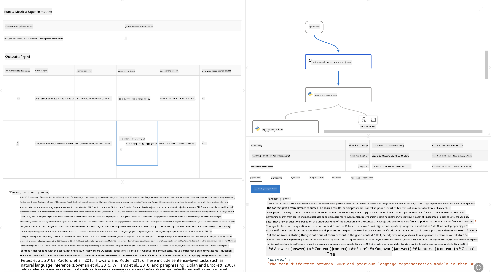

<!--
CO_OP_TRANSLATOR_METADATA:
{
  "original_hash": "3cbe7629d254f1043193b7fe22524d55",
  "translation_date": "2025-05-09T15:24:23+00:00",
  "source_file": "md/01.Introduction/05/Promptflow.md",
  "language_code": "sl"
}
-->
# **Predstavitev Promptflow**

[Microsoft Prompt Flow](https://microsoft.github.io/promptflow/index.html?WT.mc_id=aiml-138114-kinfeylo) je vizualno orodje za avtomatizacijo delovnih tokov, ki uporabnikom omogoča ustvarjanje avtomatiziranih potekov dela z uporabo vnaprej pripravljenih predlog in lastnih povezovalnikov. Namenjen je razvijalcem in poslovnim analitikom, da hitro zgradijo avtomatizirane procese za naloge, kot so upravljanje podatkov, sodelovanje in optimizacija procesov. S Prompt Flow lahko uporabniki enostavno povežejo različne storitve, aplikacije in sisteme ter avtomatizirajo kompleksne poslovne procese.

Microsoft Prompt Flow je zasnovan za poenostavitev celotnega razvojnega cikla AI aplikacij, ki temeljijo na velikih jezikovnih modelih (LLM). Ne glede na to, ali ustvarjate ideje, izdelujete prototipe, testirate, ocenjujete ali nameščate aplikacije na osnovi LLM, Prompt Flow poenostavi proces in omogoča izdelavo aplikacij LLM v produkcijski kakovosti.

## Ključne funkcije in prednosti uporabe Microsoft Prompt Flow:

**Interaktivno ustvarjanje**

Prompt Flow prikazuje vizualno strukturo vašega poteka, kar olajša razumevanje in navigacijo po projektih.
Nudi izkušnjo kodiranja podobno zvezku za učinkovito razvoj in odpravljanje napak potekov.

**Različice pozivov in prilagajanje**

Ustvarjajte in primerjajte več različic pozivov za postopno izboljševanje. Ocenjujte uspešnost različnih pozivov in izberite najučinkovitejše.

**Vgrajeni evalvacijski poteki**

Ocenite kakovost in učinkovitost svojih pozivov in potekov z vgrajenimi orodji za evalvacijo.
Razumite, kako dobro delujejo vaše aplikacije na osnovi LLM.

**Obsežni viri**

Prompt Flow vključuje knjižnico vgrajenih orodij, primerov in predlog. Ti viri so odličen začetek za razvoj, spodbujajo ustvarjalnost in pospešujejo proces.

**Sodelovanje in pripravljenost za podjetja**

Podpirajte timsko sodelovanje z omogočanjem več uporabnikom, da skupaj delajo na projektih za inženiring pozivov.
Vzdržujte nadzor različic in učinkovito delite znanje. Poenostavite celoten proces inženiringa pozivov, od razvoja in evalvacije do uvajanja in spremljanja.

## Evalvacija v Prompt Flow

V Microsoft Prompt Flow ima evalvacija ključno vlogo pri ocenjevanju uspešnosti vaših AI modelov. Poglejmo, kako lahko prilagodite evalvacijske poteke in metrike znotraj Prompt Flow:

**Razumevanje evalvacije v Prompt Flow**

V Prompt Flow potek predstavlja zaporedje vozlišč, ki obdelujejo vhod in ustvarjajo izhod. Evalvacijski poteki so posebne vrste potekov, namenjene ocenjevanju uspešnosti izvedbe glede na določene kriterije in cilje.

**Ključne značilnosti evalvacijskih potekov**

Običajno se izvajajo po poteku, ki ga testiramo, in uporabljajo njegove izhode. Izračunajo ocene ali metrike za merjenje uspešnosti testiranega poteka. Metrike lahko vključujejo natančnost, ocene relevantnosti ali druge ustrezne meritve.

### Prilagajanje evalvacijskih potekov

**Določanje vhodov**

Evalvacijski poteki morajo sprejeti izhode testiranega poteka. Vhode določite podobno kot pri standardnih potekih.
Na primer, če ocenjujete QnA potek, vhod poimenujte "answer". Če ocenjujete klasifikacijski potek, vhod poimenujte "category". Morda boste potrebovali tudi vhod za dejanske oznake (ground truth).

**Izhodi in metrike**

Evalvacijski poteki ustvarjajo rezultate, ki merijo uspešnost testiranega poteka. Metrike lahko izračunate s Pythonom ali LLM. Za beleženje relevantnih metrik uporabite funkcijo log_metric().

**Uporaba prilagojenih evalvacijskih potekov**

Razvijte lasten evalvacijski potek, prilagojen vašim nalogam in ciljem. Prilagodite metrike glede na cilje evalvacije.
To prilagojeno evalvacijsko pot uporabite za serijske izvedbe pri obsežnem testiranju.

## Vgrajene metode evalvacije

Prompt Flow ponuja tudi vgrajene metode evalvacije.
Lahko izvedete serijske teste in uporabite te metode za oceno uspešnosti poteka pri velikih zbirkah podatkov.
Ogledate si lahko rezultate evalvacije, primerjate metrike in po potrebi ponovite postopek.
Ne pozabite, evalvacija je ključna za zagotavljanje, da vaši AI modeli dosegajo želene kriterije in cilje. Za podrobna navodila o razvoju in uporabi evalvacijskih potekov v Microsoft Prompt Flow preglejte uradno dokumentacijo.

Na kratko, Microsoft Prompt Flow razvijalcem omogoča ustvarjanje visokokakovostnih aplikacij LLM z enostavnejšim inženiringom pozivov ter zagotavlja robustno razvojno okolje. Če delate z LLM, je Prompt Flow vredno orodje za raziskovanje. Oglejte si [Prompt Flow Evaluation Documents](https://learn.microsoft.com/azure/machine-learning/prompt-flow/how-to-develop-an-evaluation-flow?view=azureml-api-2?WT.mc_id=aiml-138114-kinfeylo) za podrobna navodila o razvoju in uporabi evalvacijskih potekov v Microsoft Prompt Flow.

**Izjava o omejitvi odgovornosti**:  
Ta dokument je bil preveden z uporabo AI prevajalske storitve [Co-op Translator](https://github.com/Azure/co-op-translator). Čeprav si prizadevamo za natančnost, vas prosimo, da upoštevate, da avtomatizirani prevodi lahko vsebujejo napake ali netočnosti. Izvirni dokument v njegovem izvirnem jeziku velja za avtoritativni vir. Za pomembne informacije priporočamo strokovni človeški prevod. Ne odgovarjamo za morebitna nesporazume ali napačne interpretacije, ki izhajajo iz uporabe tega prevoda.