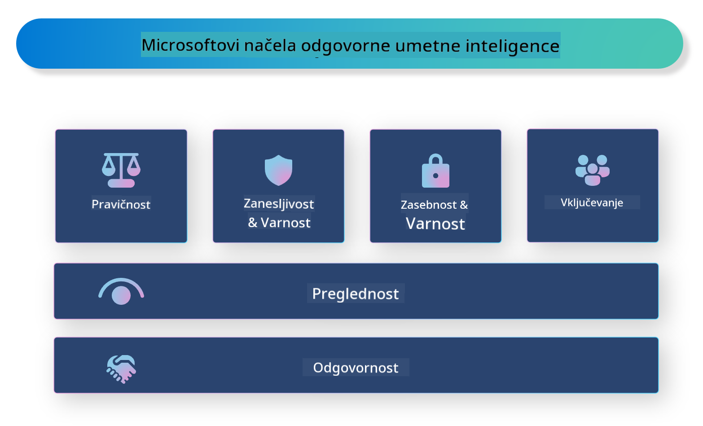

<!--
CO_OP_TRANSLATOR_METADATA:
{
  "original_hash": "805b96b20152936d8f4c587d90d6e06e",
  "translation_date": "2025-05-09T15:50:35+00:00",
  "source_file": "md/01.Introduction/05/ResponsibleAI.md",
  "language_code": "sl"
}
-->
# **Uvedba odgovorne umetne inteligence**

[Microsoft Responsible AI](https://www.microsoft.com/ai/responsible-ai?WT.mc_id=aiml-138114-kinfeylo) je pobuda, ki razvijalcem in organizacijam pomaga graditi sisteme umetne inteligence, ki so pregledni, zaupanja vredni in odgovorni. Pobuda ponuja smernice in vire za razvoj odgovornih AI rešitev, ki so skladne z etičnimi načeli, kot so zasebnost, pravičnost in preglednost. Prav tako bomo raziskali nekatere izzive in dobre prakse, povezane z gradnjo odgovornih AI sistemov.

## Pregled Microsoft Responsible AI

**Etična načela**

Microsoft Responsible AI temelji na naboru etičnih načel, kot so zasebnost, pravičnost, preglednost, odgovornost in varnost. Ta načela zagotavljajo, da so AI sistemi razviti na etičen in odgovoren način.

**Pregledna umetna inteligenca**

Microsoft Responsible AI poudarja pomen preglednosti v AI sistemih. To vključuje jasna pojasnila o delovanju AI modelov ter zagotavljanje, da so podatkovni viri in algoritmi javno dostopni.

**Odgovorna umetna inteligenca**

[Microsoft Responsible AI](https://www.microsoft.com/ai/responsible-ai?WT.mc_id=aiml-138114-kinfeylo) spodbuja razvoj odgovornih AI sistemov, ki omogočajo vpogled v način odločanja AI modelov. To pomaga uporabnikom razumeti in zaupati izhodom AI sistemov.

**Vključenost**

AI sistemi naj bodo zasnovani tako, da koristijo vsem. Microsoft si prizadeva ustvariti vključujočo umetno inteligenco, ki upošteva različne perspektive in preprečuje pristranskost ali diskriminacijo.

**Zanesljivost in varnost**

Zagotavljanje zanesljivosti in varnosti AI sistemov je ključno. Microsoft se osredotoča na gradnjo robustnih modelov, ki delujejo dosledno in preprečujejo škodljive posledice.

**Pravičnost v umetni inteligenci**

Microsoft Responsible AI prepoznava, da lahko AI sistemi ohranjajo pristranskosti, če so usposobljeni na pristranskih podatkih ali algoritmih. Pobuda ponuja smernice za razvoj pravičnih AI sistemov, ki ne diskriminirajo na podlagi dejavnikov, kot so rasa, spol ali starost.

**Zasebnost in varnost**

Microsoft Responsible AI poudarja pomen zaščite zasebnosti uporabnikov in varnosti podatkov v AI sistemih. To vključuje uporabo močne šifriranja podatkov in nadzora dostopa ter redno preverjanje AI sistemov glede ranljivosti.

**Odgovornost in prevzemanje odgovornosti**

Microsoft Responsible AI spodbuja odgovornost in prevzemanje odgovornosti pri razvoju in uvajanju AI. To vključuje ozaveščanje razvijalcev in organizacij o možnih tveganjih, povezanih z AI sistemi, ter ukrepe za njihovo zmanjšanje.

## Dobre prakse za gradnjo odgovornih AI sistemov

**Razvijajte AI modele z uporabo raznolikih zbirk podatkov**

Da bi preprečili pristranskost v AI sistemih, je pomembno uporabljati raznolike podatkovne zbirke, ki zajemajo različne poglede in izkušnje.

**Uporabljajte tehnike razložljive umetne inteligence**

Tehnike razložljive AI pomagajo uporabnikom razumeti, kako AI modeli sprejemajo odločitve, kar povečuje zaupanje v sistem.

**Redno preverjajte AI sisteme glede ranljivosti**

Redni pregledi AI sistemov pomagajo odkriti morebitna tveganja in ranljivosti, ki jih je treba odpraviti.

**Uvedite močno šifriranje podatkov in nadzor dostopa**

Šifriranje podatkov in nadzor dostopa pomagata zaščititi zasebnost in varnost uporabnikov v AI sistemih.

**Sledite etičnim načelom pri razvoju AI**

Sledenje etičnim načelom, kot so pravičnost, preglednost in odgovornost, pomaga graditi zaupanje v AI sisteme in zagotavlja njihov odgovoren razvoj.

## Uporaba AI Foundry za odgovorno umetno inteligenco

[Azure AI Foundry](https://ai.azure.com?WT.mc_id=aiml-138114-kinfeylo) je zmogljiva platforma, ki razvijalcem in organizacijam omogoča hitro ustvarjanje inteligentnih, naprednih, tržno pripravljenih in odgovornih aplikacij. Tukaj so nekatere ključne funkcije in zmožnosti Azure AI Foundry:

**Vnaprej pripravljeni API-ji in modeli**

Azure AI Foundry ponuja vnaprej izdelane in prilagodljive API-je ter modele. Ti pokrivajo širok spekter AI nalog, vključno z generativno AI, obdelavo naravnega jezika za pogovore, iskanjem, nadzorom, prevajanjem, govorom, vidom in odločanjem.

**Prompt Flow**

Prompt flow v Azure AI Foundry omogoča ustvarjanje pogovornih AI izkušenj. Omogoča načrtovanje in upravljanje pogovornih tokov, kar olajša gradnjo chatbotov, virtualnih asistentov in drugih interaktivnih aplikacij.

**Retrieval Augmented Generation (RAG)**

RAG je tehnika, ki združuje pristope na osnovi iskanja in generiranja. Izboljšuje kakovost ustvarjenih odgovorov z uporabo tako obstoječega znanja (iskanje) kot ustvarjalnega generiranja (generacija).

**Ocenjevalni in spremljevalni metri za generativno AI**

Azure AI Foundry ponuja orodja za ocenjevanje in spremljanje generativnih AI modelov. Lahko ocenite njihovo uspešnost, pravičnost in druge pomembne metrike za zagotovitev odgovornega uvajanja. Če ste ustvarili nadzorno ploščo, lahko uporabite brezkodni uporabniški vmesnik v Azure Machine Learning Studio za prilagoditev in generiranje Responsible AI Dashboarda ter pripadajočega scorecarda na podlagi [Responsible AI Toolbox](https://responsibleaitoolbox.ai/?WT.mc_id=aiml-138114-kinfeylo) Python knjižnic. Ta scorecard vam pomaga deliti ključne vpoglede o pravičnosti, pomembnosti značilk in drugih vidikih odgovornega uvajanja tako s tehničnimi kot netehničnimi deležniki.

Za uporabo AI Foundry z odgovorno umetno inteligenco lahko sledite tem dobrim praksam:

**Določite problem in cilje vašega AI sistema**

Pred začetkom razvoja je pomembno jasno opredeliti problem ali cilj, ki ga vaš AI sistem želi rešiti. To vam bo pomagalo določiti potrebne podatke, algoritme in vire za gradnjo učinkovitega modela.

**Zberite in predobdelajte ustrezne podatke**

Kakovost in količina podatkov, uporabljenih za usposabljanje AI sistema, močno vplivata na njegovo uspešnost. Zato je pomembno zbrati ustrezne podatke, jih očistiti, predobdelati in zagotoviti, da so reprezentativni za populacijo ali problem, ki ga želite rešiti.

**Izberite ustrezno metodo ocenjevanja**

Na voljo je več algoritmov za ocenjevanje. Pomembno je izbrati najbolj primernega glede na vaše podatke in problem.

**Ocenite in interpretirajte model**

Ko zgradite AI model, je pomembno oceniti njegovo uspešnost z ustreznimi metrikami in rezultate interpretirati na pregleden način. To vam pomaga prepoznati morebitne pristranskosti ali omejitve modela ter ga izboljšati, kjer je potrebno.

**Zagotovite preglednost in razložljivost**

AI sistemi naj bodo pregledni in razložljivi, da uporabniki razumejo, kako delujejo in kako so sprejete odločitve. To je še posebej pomembno za aplikacije, ki močno vplivajo na človeška življenja, kot so zdravstvo, finance in pravni sistemi.

**Spremljajte in posodabljajte model**

AI sisteme je treba nenehno spremljati in posodabljati, da ostanejo natančni in učinkoviti skozi čas. To zahteva stalno vzdrževanje, testiranje in ponovno usposabljanje modela.

Za konec, Microsoft Responsible AI je pobuda, ki razvijalcem in organizacijam pomaga graditi AI sisteme, ki so pregledni, zaupanja vredni in odgovorni. Ne pozabite, da je odgovorna uporaba AI ključna, Azure AI Foundry pa želi to narediti praktično za organizacije. Sledenjem etičnim načelom in najboljšim praksam lahko zagotovimo, da so AI sistemi razviti in uvajani na odgovoren način, ki koristi celotni družbi.

**Omejitev odgovornosti**:  
Ta dokument je bil preveden z uporabo storitve za avtomatski prevod AI [Co-op Translator](https://github.com/Azure/co-op-translator). Čeprav si prizadevamo za natančnost, upoštevajte, da avtomatizirani prevodi lahko vsebujejo napake ali netočnosti. Izvirni dokument v njegovem izvirnem jeziku velja za avtoritativni vir. Za pomembne informacije priporočamo strokovni človeški prevod. Nismo odgovorni za morebitne nesporazume ali napačne interpretacije, ki izhajajo iz uporabe tega prevoda.