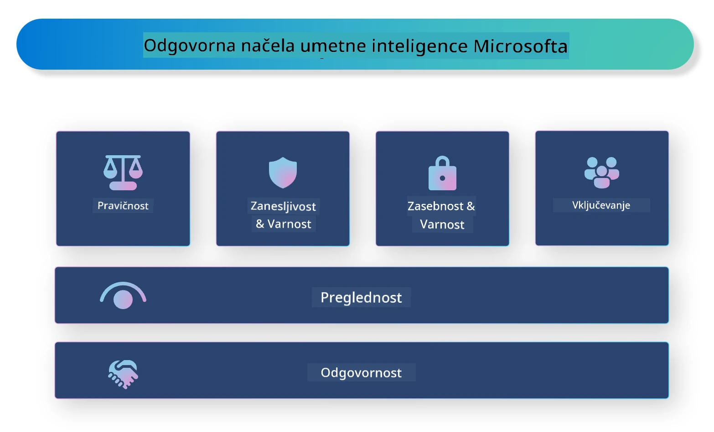

# **Predstavitev Responsible AI**

[Microsoft Responsible AI](https://www.microsoft.com/ai/responsible-ai?WT.mc_id=aiml-138114-kinfeylo) je pobuda, ki razvijalcem in organizacijam pomaga graditi AI sisteme, ki so pregledni, zaupanja vredni in odgovorni. Pobuda ponuja smernice in vire za razvoj odgovornih AI rešitev, ki so usklajene z etičnimi načeli, kot so zasebnost, pravičnost in preglednost. Prav tako bomo raziskali nekatere izzive in dobre prakse, povezane z gradnjo odgovornih AI sistemov.

## Pregled Microsoft Responsible AI

**Etična načela**

Microsoft Responsible AI temelji na naboru etičnih načel, kot so zasebnost, pravičnost, preglednost, odgovornost in varnost. Ta načela zagotavljajo, da so AI sistemi razviti na etičen in odgovoren način.

**Pregleden AI**

Microsoft Responsible AI poudarja pomen preglednosti v AI sistemih. To vključuje jasna pojasnila o delovanju AI modelov ter zagotavljanje, da so podatkovni viri in algoritmi javno dostopni.

**Odgovoren AI**

[Microsoft Responsible AI](https://www.microsoft.com/ai/responsible-ai?WT.mc_id=aiml-138114-kinfeylo) spodbuja razvoj odgovornih AI sistemov, ki omogočajo vpogled v to, kako AI modeli sprejemajo odločitve. To uporabnikom pomaga razumeti in zaupati izhodom AI sistemov.

**Vključujočnost**

AI sistemi naj bodo zasnovani tako, da koristijo vsem. Microsoft si prizadeva ustvariti vključujoč AI, ki upošteva različne perspektive in se izogiba pristranskosti ali diskriminaciji.

**Zanesljivost in varnost**

Zagotavljanje zanesljivosti in varnosti AI sistemov je ključno. Microsoft se osredotoča na gradnjo robustnih modelov, ki delujejo dosledno in preprečujejo škodljive posledice.

**Pravičnost v AI**

Microsoft Responsible AI priznava, da lahko AI sistemi ohranjajo pristranskosti, če so usposobljeni na pristranskih podatkih ali algoritmih. Pobuda ponuja smernice za razvoj pravičnih AI sistemov, ki ne diskriminirajo na podlagi dejavnikov, kot so rasa, spol ali starost.

**Zasebnost in varnost**

Microsoft Responsible AI poudarja pomen zaščite zasebnosti uporabnikov in varnosti podatkov v AI sistemih. To vključuje uporabo močnega šifriranja podatkov in nadzora dostopa ter redno preverjanje AI sistemov glede ranljivosti.

**Odgovornost in odgovornost**

Microsoft Responsible AI spodbuja odgovornost in prevzemanje odgovornosti pri razvoju in uvajanju AI. To vključuje zagotavljanje, da so razvijalci in organizacije seznanjeni s potencialnimi tveganji AI sistemov ter da sprejemajo ukrepe za njihovo zmanjšanje.

## Dobre prakse za gradnjo odgovornih AI sistemov

**Razvijajte AI modele z uporabo raznolikih podatkovnih nizov**

Da bi se izognili pristranskosti v AI sistemih, je pomembno uporabljati raznolike podatkovne nize, ki predstavljajo različne perspektive in izkušnje.

**Uporabljajte tehnike razložljivega AI**

Tehnike razložljivega AI pomagajo uporabnikom razumeti, kako AI modeli sprejemajo odločitve, kar povečuje zaupanje v sistem.

**Redno preverjajte AI sisteme glede ranljivosti**

Redni pregledi AI sistemov pomagajo odkriti morebitna tveganja in ranljivosti, ki jih je treba odpraviti.

**Uvedite močno šifriranje podatkov in nadzor dostopa**

Šifriranje podatkov in nadzor dostopa pomagata zaščititi zasebnost in varnost uporabnikov v AI sistemih.

**Sledite etičnim načelom pri razvoju AI**

Sledenje etičnim načelom, kot so pravičnost, preglednost in odgovornost, pomaga graditi zaupanje v AI sisteme in zagotavlja, da so razviti na odgovoren način.

## Uporaba AI Foundry za Responsible AI

[Azure AI Foundry](https://ai.azure.com?WT.mc_id=aiml-138114-kinfeylo) je zmogljiva platforma, ki razvijalcem in organizacijam omogoča hitro ustvarjanje inteligentnih, naprednih, tržno pripravljenih in odgovornih aplikacij. Tukaj so nekatere ključne funkcije in zmogljivosti Azure AI Foundry:

**Vnaprej pripravljeni API-ji in modeli**

Azure AI Foundry ponuja vnaprej izdelane in prilagodljive API-je ter modele. Ti pokrivajo širok spekter AI nalog, vključno z generativnim AI, obdelavo naravnega jezika za pogovore, iskanjem, nadzorom, prevajanjem, govorom, vidom in odločanjem.

**Prompt Flow**

Prompt flow v Azure AI Foundry omogoča ustvarjanje pogovornih AI izkušenj. Omogoča načrtovanje in upravljanje pogovornih tokov, kar olajša gradnjo chatbotov, virtualnih asistentov in drugih interaktivnih aplikacij.

**Retrieval Augmented Generation (RAG)**

RAG je tehnika, ki združuje pristope na osnovi iskanja in generiranja. Izboljšuje kakovost generiranih odgovorov z uporabo tako obstoječega znanja (iskanje) kot tudi ustvarjalnega generiranja (generiranje).

**Meritve za ocenjevanje in spremljanje generativnega AI**

Azure AI Foundry ponuja orodja za ocenjevanje in spremljanje generativnih AI modelov. Lahko ocenite njihovo zmogljivost, pravičnost in druge pomembne metrike za zagotovitev odgovorne uporabe. Poleg tega, če ste ustvarili nadzorno ploščo, lahko uporabite no-code UI v Azure Machine Learning Studio za prilagoditev in generiranje Responsible AI Dashboard ter pripadajoče ocenjevalne kartice na podlagi [Responsible AI Toolbox](https://responsibleaitoolbox.ai/?WT.mc_id=aiml-138114-kinfeylo) Python knjižnic. Ta ocenjevalna kartica vam pomaga deliti ključne vpoglede o pravičnosti, pomembnosti značilnosti in drugih vidikih odgovorne uporabe tako s tehničnimi kot netehničnimi deležniki.

Za uporabo AI Foundry z odgovornim AI lahko sledite tem dobrim praksam:

**Določite problem in cilje vašega AI sistema**

Pred začetkom razvoja je pomembno jasno opredeliti problem ali cilj, ki ga vaš AI sistem želi rešiti. To vam bo pomagalo določiti potrebne podatke, algoritme in vire za izdelavo učinkovitega modela.

**Zberite in predobdelajte ustrezne podatke**

Kakovost in količina podatkov, uporabljenih za usposabljanje AI sistema, močno vplivata na njegovo zmogljivost. Zato je pomembno zbrati ustrezne podatke, jih očistiti, predobdelati in zagotoviti, da so reprezentativni za populacijo ali problem, ki ga želite rešiti.

**Izberite ustrezno metodo ocenjevanja**

Na voljo je več algoritmov za ocenjevanje. Pomembno je izbrati najbolj primeren glede na vaše podatke in problem.

**Ocenite in interpretirajte model**

Ko zgradite AI model, je pomembno oceniti njegovo zmogljivost z ustreznimi metričnimi kazalniki in rezultate interpretirati na pregleden način. To vam bo pomagalo odkriti morebitne pristranskosti ali omejitve modela ter po potrebi izboljšati model.

**Zagotovite preglednost in razložljivost**

AI sistemi naj bodo pregledni in razložljivi, da uporabniki razumejo, kako delujejo in kako so sprejete odločitve. To je še posebej pomembno za aplikacije, ki pomembno vplivajo na človeška življenja, kot so zdravstvo, finance in pravni sistemi.

**Spremljajte in posodabljajte model**

AI sisteme je treba nenehno spremljati in posodabljati, da ostanejo natančni in učinkoviti skozi čas. To zahteva redno vzdrževanje, testiranje in ponovno usposabljanje modela.

Za zaključek, Microsoft Responsible AI je pobuda, ki razvijalcem in organizacijam pomaga graditi AI sisteme, ki so pregledni, zaupanja vredni in odgovorni. Pomembno je, da je implementacija odgovornega AI ključna, Azure AI Foundry pa si prizadeva to narediti praktično za organizacije. Sledenjem etičnim načelom in najboljšim praksam lahko zagotovimo, da so AI sistemi razviti in uporabljeni na odgovoren način, ki koristi celotni družbi.

**Omejitev odgovornosti**:  
Ta dokument je bil preveden z uporabo AI prevajalske storitve [Co-op Translator](https://github.com/Azure/co-op-translator). Čeprav si prizadevamo za natančnost, vas opozarjamo, da avtomatizirani prevodi lahko vsebujejo napake ali netočnosti. Izvirni dokument v njegovem izvirnem jeziku velja za avtoritativni vir. Za ključne informacije priporočamo strokovni človeški prevod. Za morebitna nesporazume ali napačne interpretacije, ki izhajajo iz uporabe tega prevoda, ne odgovarjamo.