<!--
CO_OP_TRANSLATOR_METADATA:
{
  "original_hash": "80a853c08e4ee25ef9b4bfcedd8990da",
  "translation_date": "2025-05-09T17:18:20+00:00",
  "source_file": "md/02.Application/01.TextAndChat/Phi3/E2E_Phi-3-Evaluation_AIFoundry.md",
  "language_code": "sl"
}
-->
# Evaluate the Fine-tuned Phi-3 / Phi-3.5 Model in Azure AI Foundry Focusing on Microsoft's Responsible AI Principles

This end-to-end (E2E) sample is based on the guide "[Evaluate Fine-tuned Phi-3 / 3.5 Models in Azure AI Foundry Focusing on Microsoft's Responsible AI](https://techcommunity.microsoft.com/blog/educatordeveloperblog/evaluate-fine-tuned-phi-3--3-5-models-in-azure-ai-studio-focusing-on-microsofts-/4227850?WT.mc_id=aiml-137032-kinfeylo)" from the Microsoft Tech Community.

## Overview

### How can you evaluate the safety and performance of a fine-tuned Phi-3 / Phi-3.5 model in Azure AI Foundry?

Fine-tuning a model can sometimes lead to unexpected or unwanted responses. To keep the model safe and effective, it's important to check its potential to produce harmful content and its ability to give accurate, relevant, and coherent answers. In this tutorial, you'll learn how to assess the safety and performance of a fine-tuned Phi-3 / Phi-3.5 model integrated with Prompt flow in Azure AI Foundry.

Here is Azure AI Foundry’s evaluation process.

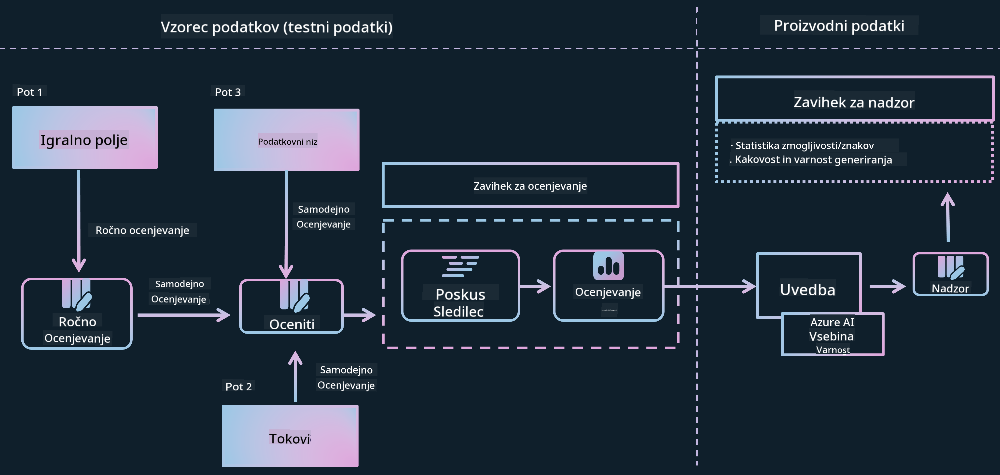

*Image Source: [Evaluation of generative AI applications](https://learn.microsoft.com/azure/ai-studio/concepts/evaluation-approach-gen-ai?wt.mc_id%3Dstudentamb_279723)*

> [!NOTE]
>
> For more details and additional resources about Phi-3 / Phi-3.5, please visit the [Phi-3CookBook](https://github.com/microsoft/Phi-3CookBook?wt.mc_id=studentamb_279723).

### Prerequisites

- [Python](https://www.python.org/downloads)
- [Azure subscription](https://azure.microsoft.com/free?wt.mc_id=studentamb_279723)
- [Visual Studio Code](https://code.visualstudio.com)
- Fine-tuned Phi-3 / Phi-3.5 model

### Table of Contents

1. [**Scenario 1: Introduction to Azure AI Foundry's Prompt flow evaluation**](../../../../../../md/02.Application/01.TextAndChat/Phi3)

    - [Introduction to safety evaluation](../../../../../../md/02.Application/01.TextAndChat/Phi3)
    - [Introduction to performance evaluation](../../../../../../md/02.Application/01.TextAndChat/Phi3)

1. [**Scenario 2: Evaluating the Phi-3 / Phi-3.5 model in Azure AI Foundry**](../../../../../../md/02.Application/01.TextAndChat/Phi3)

    - [Before you begin](../../../../../../md/02.Application/01.TextAndChat/Phi3)
    - [Deploy Azure OpenAI to evaluate the Phi-3 / Phi-3.5 model](../../../../../../md/02.Application/01.TextAndChat/Phi3)
    - [Evaluate the fine-tuned Phi-3 / Phi-3.5 model using Azure AI Foundry's Prompt flow evaluation](../../../../../../md/02.Application/01.TextAndChat/Phi3)

1. [Congratulations!](../../../../../../md/02.Application/01.TextAndChat/Phi3)

## **Scenario 1: Introduction to Azure AI Foundry's Prompt flow evaluation**

### Introduction to safety evaluation

To make sure your AI model is ethical and safe, it's key to evaluate it based on Microsoft's Responsible AI Principles. In Azure AI Foundry, safety evaluations let you check your model’s vulnerability to jailbreak attacks and its potential to generate harmful content, directly aligned with these principles.

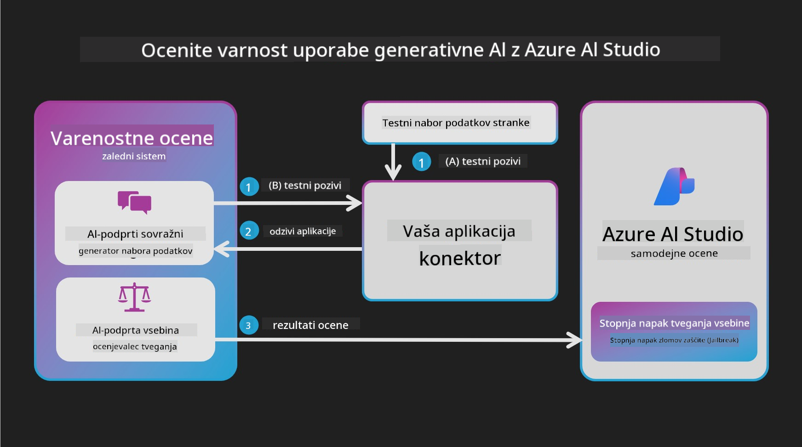

*Image Source: [Evaluation of generative AI applications](https://learn.microsoft.com/azure/ai-studio/concepts/evaluation-approach-gen-ai?wt.mc_id%3Dstudentamb_279723)*

#### Microsoft’s Responsible AI Principles

Before starting the technical steps, it's important to understand Microsoft's Responsible AI Principles, an ethical framework that guides responsible development, deployment, and operation of AI systems. These principles ensure AI technologies are designed, developed, and deployed in a way that is fair, transparent, and inclusive. They form the basis for evaluating AI model safety.

Microsoft's Responsible AI Principles include:

- **Fairness and Inclusiveness**: AI systems should treat everyone fairly and avoid impacting similar groups differently. For example, AI systems guiding medical treatment, loan approvals, or hiring should offer the same recommendations to people with similar symptoms, finances, or qualifications.

- **Reliability and Safety**: To build trust, AI systems must operate reliably, safely, and consistently. They should function as intended, respond safely to unexpected situations, and resist harmful manipulation. Their behavior and the range of conditions they handle reflect what developers anticipated during design and testing.

- **Transparency**: When AI helps make decisions that greatly affect people's lives, it's vital that people understand how those decisions were made. For example, a bank using AI to decide creditworthiness or a company selecting job candidates.

- **Privacy and Security**: As AI use grows, protecting privacy and securing personal and business data becomes more important and complex. Privacy and data security require close attention because AI systems need access to data to make accurate and informed decisions about people.

- **Accountability**: Those who design and deploy AI systems must be responsible for how they operate. Organizations should use industry standards to develop accountability norms, ensuring AI systems are not the final authority on decisions affecting lives and that humans maintain meaningful control over highly autonomous AI.

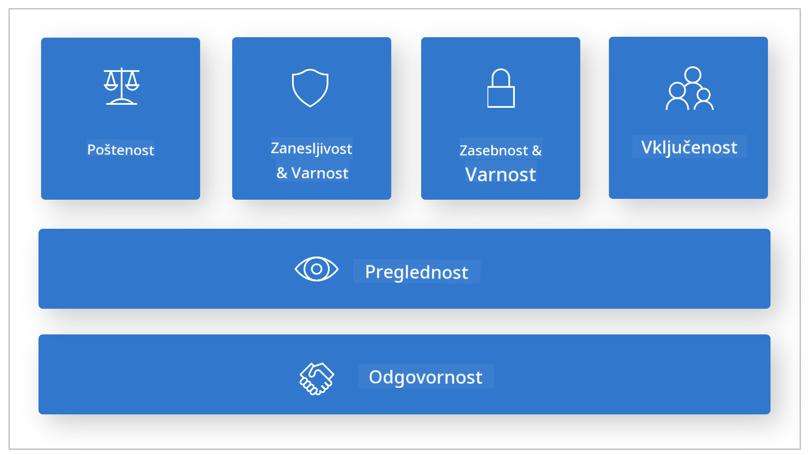

*Image Source: [What is Responsible AI?](https://learn.microsoft.com/azure/machine-learning/concept-responsible-ai?view=azureml-api-2&viewFallbackFrom=azureml-api-2%253fwt.mc_id%3Dstudentamb_279723)*

> [!NOTE]
> To learn more about Microsoft's Responsible AI Principles, visit the [What is Responsible AI?](https://learn.microsoft.com/azure/machine-learning/concept-responsible-ai?view=azureml-api-2?wt.mc_id=studentamb_279723).

#### Safety metrics

In this tutorial, you will evaluate the safety of the fine-tuned Phi-3 model using Azure AI Foundry's safety metrics. These metrics help assess the model's potential to generate harmful content and its vulnerability to jailbreak attacks. The safety metrics include:

- **Self-harm-related Content**: Checks if the model tends to produce self-harm related content.
- **Hateful and Unfair Content**: Checks if the model tends to produce hateful or unfair content.
- **Violent Content**: Checks if the model tends to produce violent content.
- **Sexual Content**: Checks if the model tends to produce inappropriate sexual content.

Evaluating these areas ensures the AI model does not create harmful or offensive content, aligning with societal values and regulations.

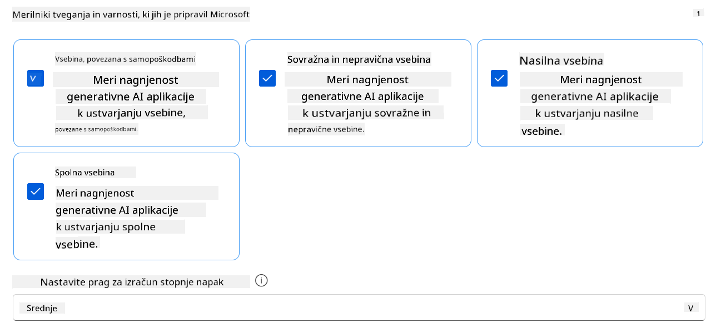

### Introduction to performance evaluation

To make sure your AI model performs as expected, it's important to assess it using performance metrics. In Azure AI Foundry, performance evaluations help you check how well your model generates accurate, relevant, and coherent responses.

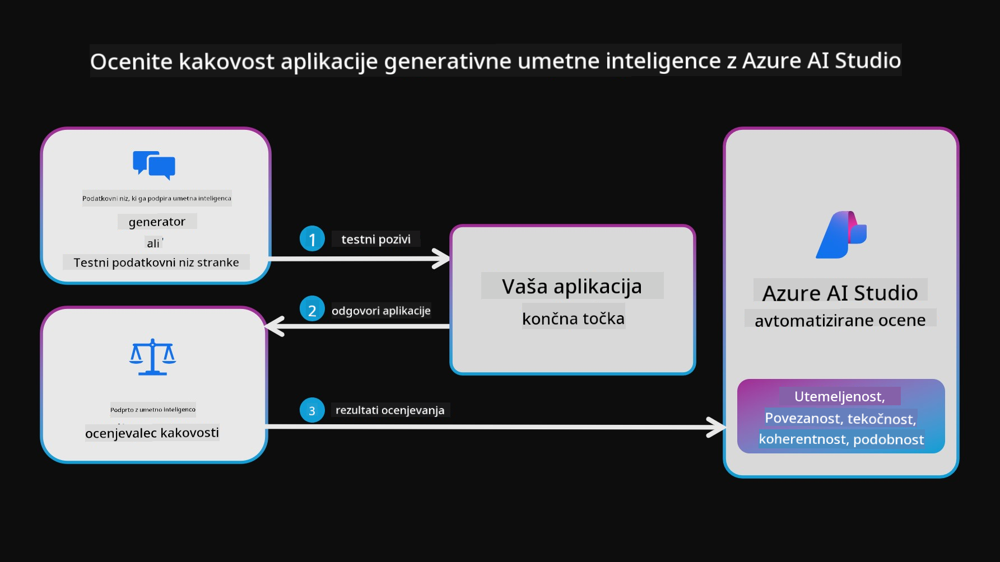

*Image Source: [Evaluation of generative AI applications](https://learn.microsoft.com/azure/ai-studio/concepts/evaluation-approach-gen-ai?wt.mc_id%3Dstudentamb_279723)*

#### Performance metrics

In this tutorial, you will evaluate the performance of the fine-tuned Phi-3 / Phi-3.5 model using Azure AI Foundry's performance metrics. These metrics help assess how effectively the model generates accurate, relevant, and coherent responses. The performance metrics include:

- **Groundedness**: Measures how well the generated answers align with the input source information.
- **Relevance**: Checks how pertinent the generated responses are to the questions asked.
- **Coherence**: Assesses how smoothly the generated text flows, reads naturally, and sounds human-like.
- **Fluency**: Evaluates the language proficiency of the generated text.
- **GPT Similarity**: Compares the generated response to the ground truth for similarity.
- **F1 Score**: Calculates the overlap of shared words between the generated response and the source data.

These metrics help evaluate the model’s ability to produce accurate, relevant, and coherent answers.

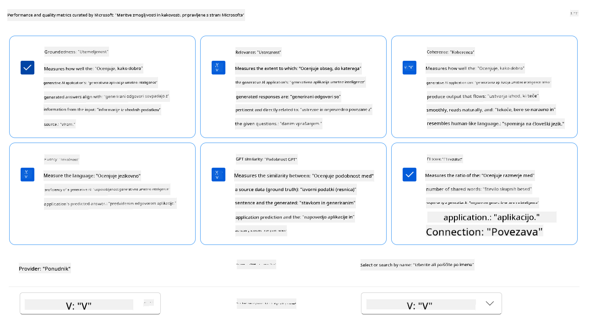

## **Scenario 2: Evaluating the Phi-3 / Phi-3.5 model in Azure AI Foundry**

### Before you begin

This tutorial follows previous blog posts, "[Fine-Tune and Integrate Custom Phi-3 Models with Prompt Flow: Step-by-Step Guide](https://techcommunity.microsoft.com/t5/educator-developer-blog/fine-tune-and-integrate-custom-phi-3-models-with-prompt-flow/ba-p/4178612?wt.mc_id=studentamb_279723)" and "[Fine-Tune and Integrate Custom Phi-3 Models with Prompt Flow in Azure AI Foundry](https://techcommunity.microsoft.com/t5/educator-developer-blog/fine-tune-and-integrate-custom-phi-3-models-with-prompt-flow-in/ba-p/4191726?wt.mc_id=studentamb_279723)." These posts walked through fine-tuning a Phi-3 / Phi-3.5 model in Azure AI Foundry and integrating it with Prompt flow.

In this tutorial, you will deploy an Azure OpenAI model as an evaluator in Azure AI Foundry and use it to assess your fine-tuned Phi-3 / Phi-3.5 model.

Before starting, make sure you have the following prerequisites as described in earlier tutorials:

1. A prepared dataset to evaluate the fine-tuned Phi-3 / Phi-3.5 model.
1. A Phi-3 / Phi-3.5 model that has been fine-tuned and deployed to Azure Machine Learning.
1. A Prompt flow integrated with your fine-tuned Phi-3 / Phi-3.5 model in Azure AI Foundry.

> [!NOTE]
> You will use the *test_data.jsonl* file, located in the data folder from the **ULTRACHAT_200k** dataset downloaded in previous blog posts, as the dataset to evaluate the fine-tuned Phi-3 / Phi-3.5 model.

#### Integrate the custom Phi-3 / Phi-3.5 model with Prompt flow in Azure AI Foundry (Code first approach)

> [!NOTE]
> If you followed the low-code approach described in "[Fine-Tune and Integrate Custom Phi-3 Models with Prompt Flow in Azure AI Foundry](https://techcommunity.microsoft.com/t5/educator-developer-blog/fine-tune-and-integrate-custom-phi-3-models-with-prompt-flow-in/ba-p/4191726?wt.mc_id=studentamb_279723)", you can skip this exercise and continue to the next.
> But if you used the code-first approach described in "[Fine-Tune and Integrate Custom Phi-3 Models with Prompt Flow: Step-by-Step Guide](https://techcommunity.microsoft.com/t5/educator-developer-blog/fine-tune-and-integrate-custom-phi-3-models-with-prompt-flow/ba-p/4178612?wt.mc_id=studentamb_279723)" to fine-tune and deploy your Phi-3 / Phi-3.5 model, the way to connect your model to Prompt flow is slightly different. You will learn this process here.

To proceed, you need to integrate your fine-tuned Phi-3 / Phi-3.5 model into Prompt flow in Azure AI Foundry.

#### Create Azure AI Foundry Hub

You need to create a Hub before creating the Project. A Hub works like a Resource Group, helping you organize and manage multiple Projects within Azure AI Foundry.

1. Sign in to [Azure AI Foundry](https://ai.azure.com/?wt.mc_id=studentamb_279723).

1. Select **All hubs** from the left side tab.

1. Select **+ New hub** from the navigation menu.

    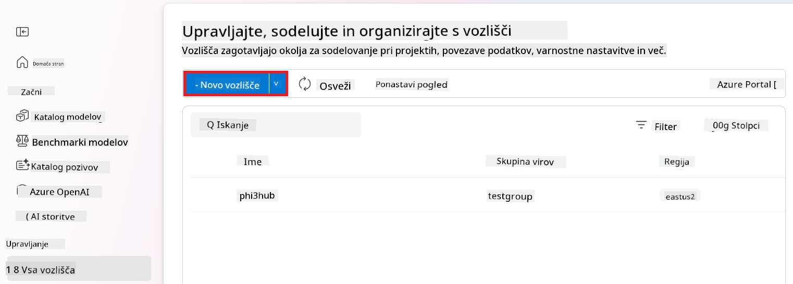

1. Complete the following:

    - Enter **Hub name**. It must be unique.
    - Select your Azure **Subscription**.
    - Select the **Resource group** to use (or create a new one if needed).
    - Select the **Location** you want to use.
    - Select **Connect Azure AI Services** to use (or create a new one if needed).
    - Select **Connect Azure AI Search** and choose **Skip connecting**.


1. Izberite **Next**.

#### Ustvarite Azure AI Foundry projekt

1. V Hubu, ki ste ga ustvarili, izberite **All projects** na levi strani zavihka.

1. Izberite **+ New project** v navigacijskem meniju.

    

1. Vnesite **Project name**. Mora biti edinstvena vrednost.

    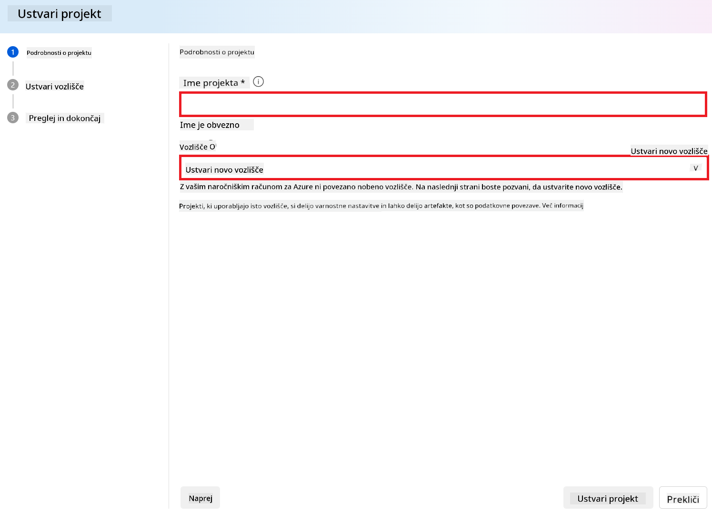

1. Izberite **Create a project**.

#### Dodajte lastno povezavo za fino nastavljeni model Phi-3 / Phi-3.5

Da integrirate svoj prilagojeni model Phi-3 / Phi-3.5 s Prompt flow, morate shraniti konektor modela in ključ v lastno povezavo. Ta nastavitev zagotavlja dostop do vašega prilagojenega modela Phi-3 / Phi-3.5 v Prompt flow.

#### Nastavite api ključ in endpoint uri za fino nastavljeni model Phi-3 / Phi-3.5

1. Obiščite [Azure ML Studio](https://ml.azure.com/home?wt.mc_id=studentamb_279723).

1. Pojdite v Azure Machine learning delovno okolje, ki ste ga ustvarili.

1. Izberite **Endpoints** na levi strani zavihka.

    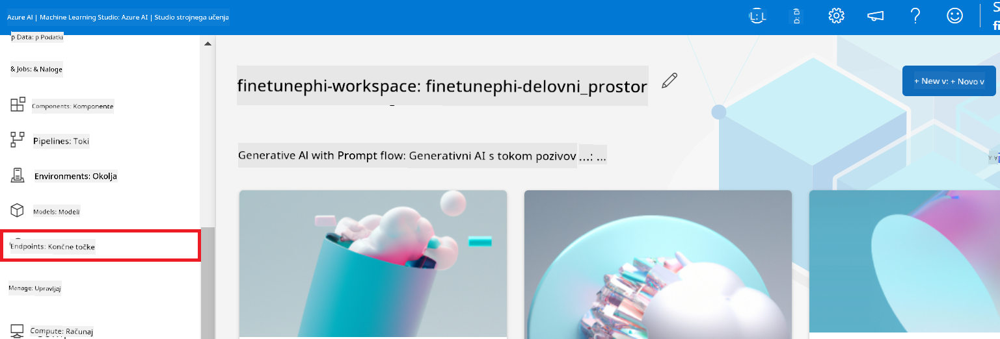

1. Izberite endpoint, ki ste ga ustvarili.

    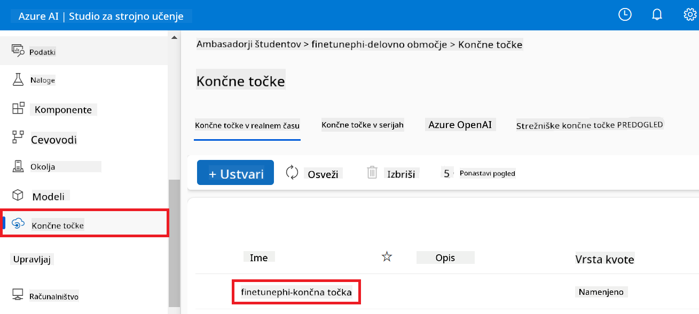

1. Izberite **Consume** v navigacijskem meniju.

1. Kopirajte svoj **REST endpoint** in **Primary key**.

    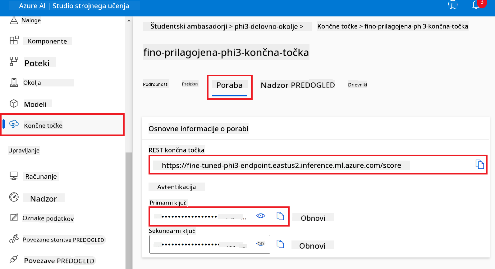

#### Dodajte lastno povezavo

1. Obiščite [Azure AI Foundry](https://ai.azure.com/?wt.mc_id=studentamb_279723).

1. Pojdite v Azure AI Foundry projekt, ki ste ga ustvarili.

1. V projektu, ki ste ga ustvarili, izberite **Settings** na levi strani zavihka.

1. Izberite **+ New connection**.

    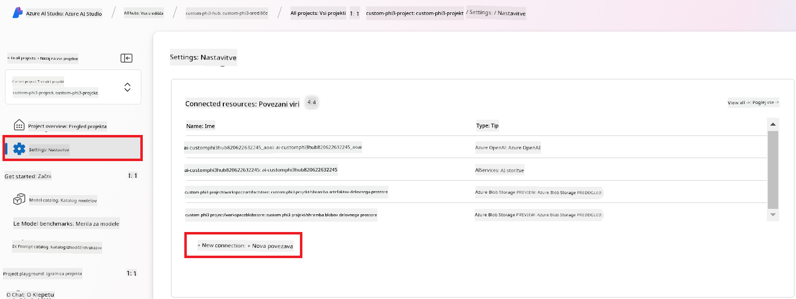

1. Izberite **Custom keys** v navigacijskem meniju.

    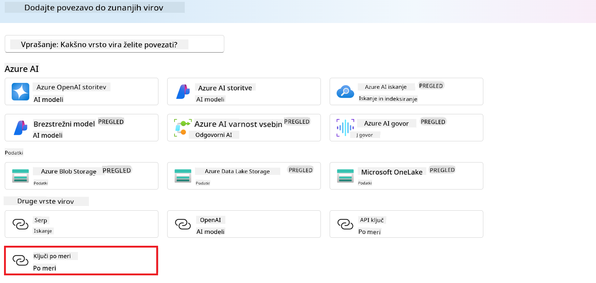

1. Izvedite naslednje korake:

    - Izberite **+ Add key value pairs**.
    - Za ime ključa vnesite **endpoint** in prilepite endpoint, ki ste ga kopirali iz Azure ML Studio, v polje za vrednost.
    - Ponovno izberite **+ Add key value pairs**.
    - Za ime ključa vnesite **key** in prilepite ključ, ki ste ga kopirali iz Azure ML Studio, v polje za vrednost.
    - Po dodajanju ključev označite **is secret**, da preprečite izpostavitev ključa.

    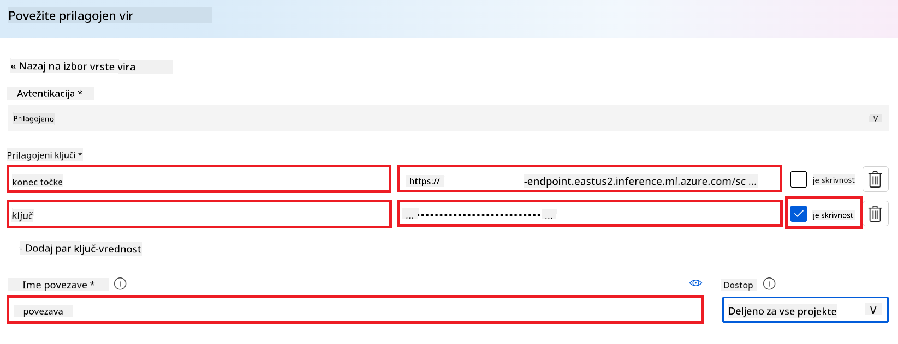

1. Izberite **Add connection**.

#### Ustvarite Prompt flow

Dodali ste lastno povezavo v Azure AI Foundry. Zdaj ustvarimo Prompt flow po naslednjih korakih. Nato boste povezali ta Prompt flow z lastno povezavo, da boste lahko uporabljali fino nastavljeni model znotraj Prompt flow.

1. Pojdite v Azure AI Foundry projekt, ki ste ga ustvarili.

1. Izberite **Prompt flow** na levi strani zavihka.

1. Izberite **+ Create** v navigacijskem meniju.

    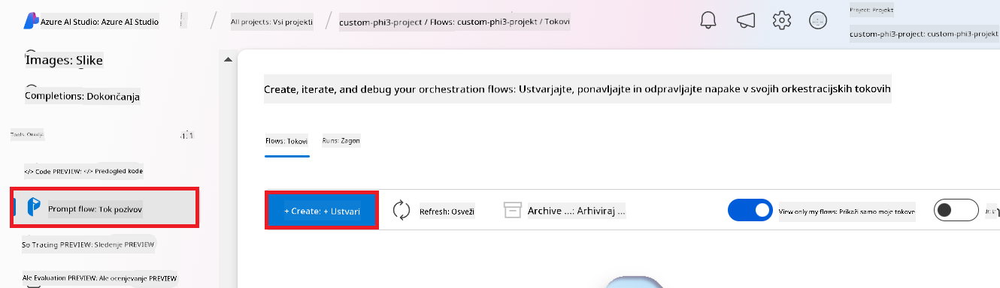

1. Izberite **Chat flow** v navigacijskem meniju.

    

1. Vnesite **Folder name**, ki ga želite uporabiti.

    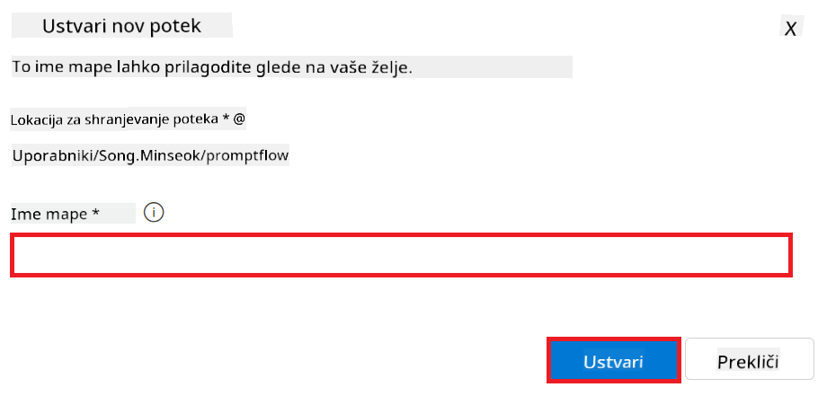

1. Izberite **Create**.

#### Nastavite Prompt flow za pogovor z vašim prilagojenim modelom Phi-3 / Phi-3.5

Potrebno je integrirati fino nastavljeni model Phi-3 / Phi-3.5 v Prompt flow. Vendar obstoječi Prompt flow ni zasnovan za to, zato ga morate prenoviti, da omogočite integracijo prilagojenega modela.

1. V Prompt flow izvedite naslednje korake za obnovitev obstoječega toka:

    - Izberite **Raw file mode**.
    - Izbrišite vse obstoječe kode v datoteki *flow.dag.yml*.
    - Dodajte naslednjo kodo v *flow.dag.yml*.

        ```yml
        inputs:
          input_data:
            type: string
            default: "Who founded Microsoft?"

        outputs:
          answer:
            type: string
            reference: ${integrate_with_promptflow.output}

        nodes:
        - name: integrate_with_promptflow
          type: python
          source:
            type: code
            path: integrate_with_promptflow.py
          inputs:
            input_data: ${inputs.input_data}
        ```

    - Izberite **Save**.

    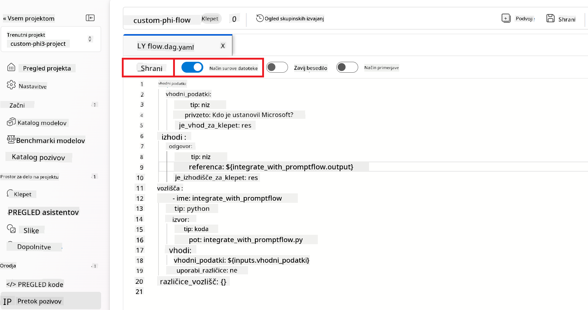

1. Dodajte naslednjo kodo v *integrate_with_promptflow.py*, da uporabite prilagojeni model Phi-3 / Phi-3.5 v Prompt flow.

    ```python
    import logging
    import requests
    from promptflow import tool
    from promptflow.connections import CustomConnection

    # Logging setup
    logging.basicConfig(
        format="%(asctime)s - %(levelname)s - %(name)s - %(message)s",
        datefmt="%Y-%m-%d %H:%M:%S",
        level=logging.DEBUG
    )
    logger = logging.getLogger(__name__)

    def query_phi3_model(input_data: str, connection: CustomConnection) -> str:
        """
        Send a request to the Phi-3 / Phi-3.5 model endpoint with the given input data using Custom Connection.
        """

        # "connection" is the name of the Custom Connection, "endpoint", "key" are the keys in the Custom Connection
        endpoint_url = connection.endpoint
        api_key = connection.key

        headers = {
            "Content-Type": "application/json",
            "Authorization": f"Bearer {api_key}"
        }
    data = {
        "input_data": [input_data],
        "params": {
            "temperature": 0.7,
            "max_new_tokens": 128,
            "do_sample": True,
            "return_full_text": True
            }
        }
        try:
            response = requests.post(endpoint_url, json=data, headers=headers)
            response.raise_for_status()
            
            # Log the full JSON response
            logger.debug(f"Full JSON response: {response.json()}")

            result = response.json()["output"]
            logger.info("Successfully received response from Azure ML Endpoint.")
            return result
        except requests.exceptions.RequestException as e:
            logger.error(f"Error querying Azure ML Endpoint: {e}")
            raise

    @tool
    def my_python_tool(input_data: str, connection: CustomConnection) -> str:
        """
        Tool function to process input data and query the Phi-3 / Phi-3.5 model.
        """
        return query_phi3_model(input_data, connection)

    ```

    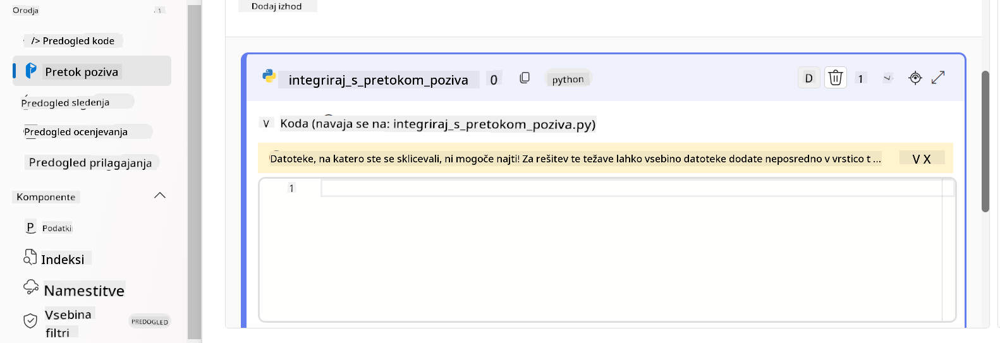

> [!NOTE]
> Za podrobnejše informacije o uporabi Prompt flow v Azure AI Foundry si lahko ogledate [Prompt flow v Azure AI Foundry](https://learn.microsoft.com/azure/ai-studio/how-to/prompt-flow).

1. Izberite **Chat input**, **Chat output**, da omogočite pogovor z vašim modelom.

    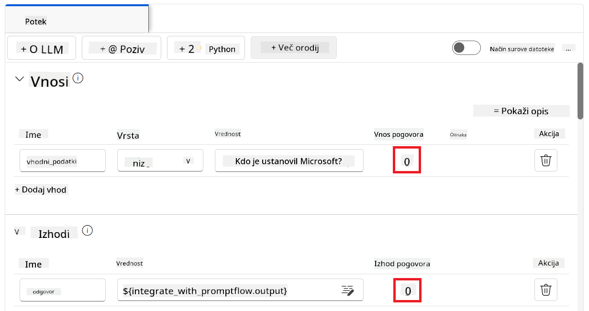

1. Zdaj ste pripravljeni na pogovor z vašim prilagojenim modelom Phi-3 / Phi-3.5. V naslednji vaji se boste naučili, kako zagnati Prompt flow in ga uporabiti za pogovor z vašim fino nastavljenim modelom Phi-3 / Phi-3.5.

> [!NOTE]
>
> Prenovljen tok bi moral izgledati kot na spodnji sliki:
>
> 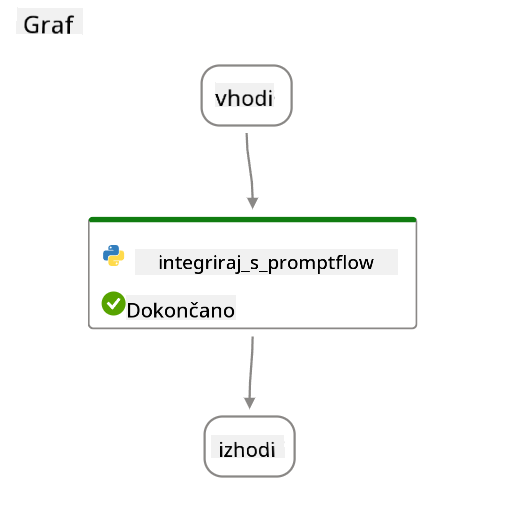
>

#### Zaženite Prompt flow

1. Izberite **Start compute sessions**, da zaženete Prompt flow.

    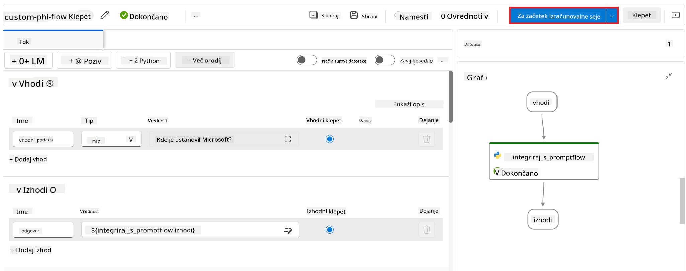

1. Izberite **Validate and parse input**, da osvežite parametre.

    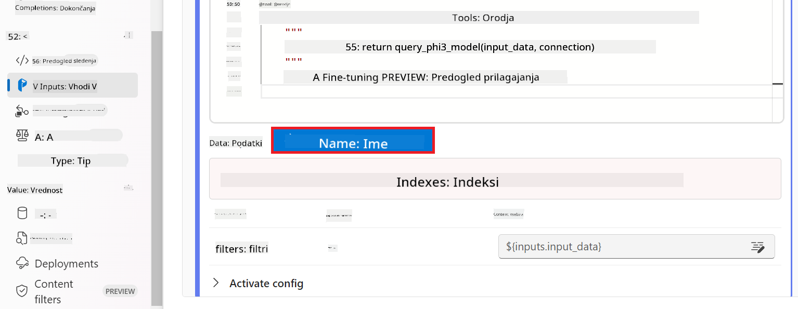

1. Izberite **Value** pri **connection**, da izberete lastno povezavo, ki ste jo ustvarili. Na primer, *connection*.

    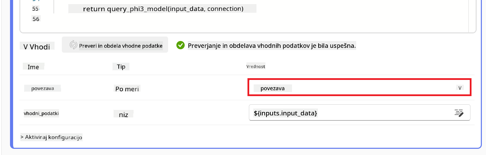

#### Pogovorite se z vašim prilagojenim modelom Phi-3 / Phi-3.5

1. Izberite **Chat**.

    

1. Tukaj je primer rezultatov: zdaj se lahko pogovarjate z vašim prilagojenim modelom Phi-3 / Phi-3.5. Priporočljivo je zastavljati vprašanja na podlagi podatkov, uporabljenih za fino nastavljanje.

    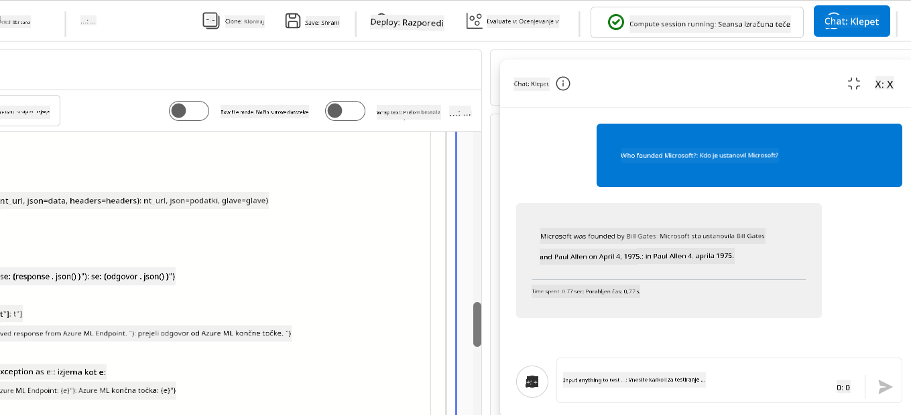

### Namestite Azure OpenAI za oceno modela Phi-3 / Phi-3.5

Za oceno modela Phi-3 / Phi-3.5 v Azure AI Foundry morate namestiti Azure OpenAI model. Ta model bo uporabljen za ocenjevanje uspešnosti modela Phi-3 / Phi-3.5.

#### Namestite Azure OpenAI

1. Prijavite se v [Azure AI Foundry](https://ai.azure.com/?wt.mc_id=studentamb_279723).

1. Pojdite v Azure AI Foundry projekt, ki ste ga ustvarili.

    

1. V projektu, ki ste ga ustvarili, izberite **Deployments** na levi strani zavihka.

1. Izberite **+ Deploy model** v navigacijskem meniju.

1. Izberite **Deploy base model**.

    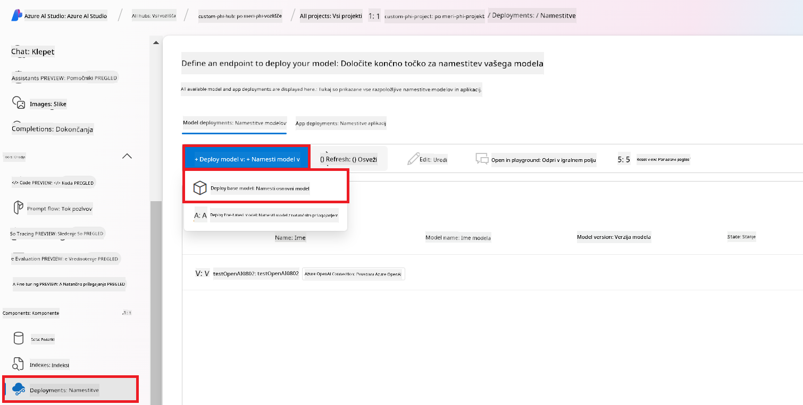

1. Izberite Azure OpenAI model, ki ga želite uporabiti. Na primer, **gpt-4o**.

    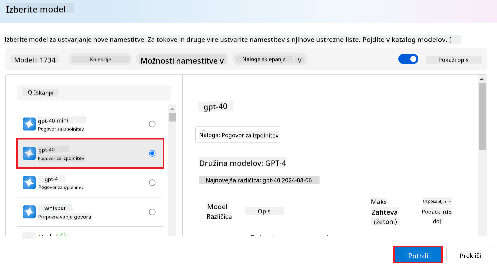

1. Izberite **Confirm**.

### Ocenite fino nastavljeni model Phi-3 / Phi-3.5 z uporabo ocenjevanja Prompt flow v Azure AI Foundry

### Začnite novo ocenjevanje

1. Obiščite [Azure AI Foundry](https://ai.azure.com/?wt.mc_id=studentamb_279723).

1. Pojdite v Azure AI Foundry projekt, ki ste ga ustvarili.

    

1. V projektu, ki ste ga ustvarili, izberite **Evaluation** na levi strani zavihka.

1. Izberite **+ New evaluation** v navigacijskem meniju.
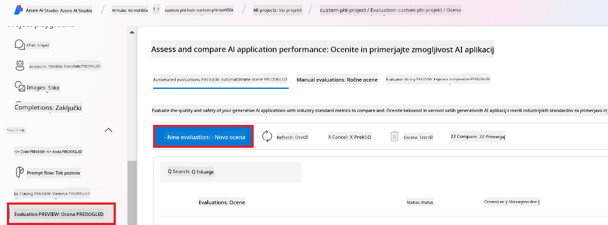

1. Izberi **Prompt flow** oceno.

    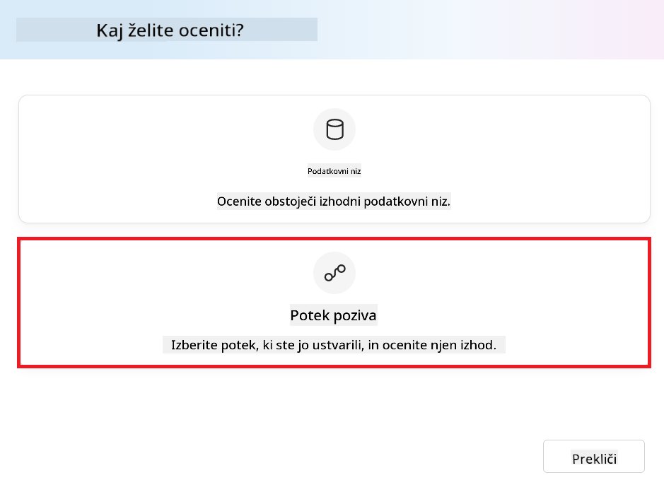

1. Izvedi naslednje naloge:

    - Vnesi ime ocene. Mora biti edinstvena vrednost.
    - Izberi **Question and answer without context** kot tip naloge. Ker podatkovni niz **UlTRACHAT_200k**, uporabljen v tem vodiču, ne vsebuje konteksta.
    - Izberi prompt flow, ki ga želiš oceniti.

    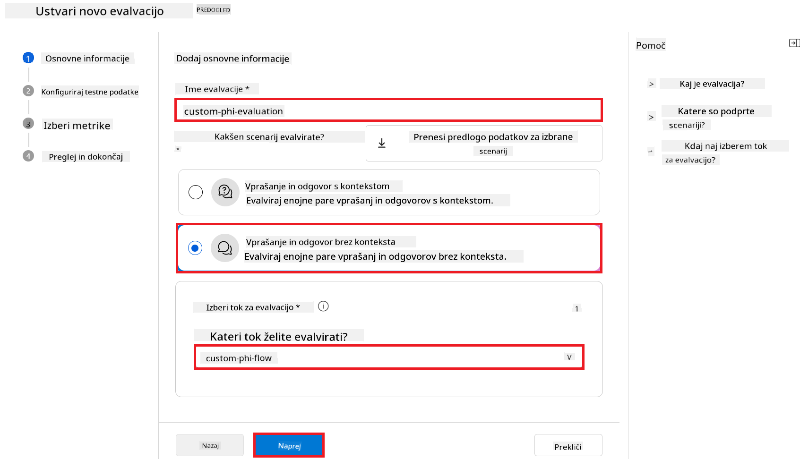

1. Izberi **Next**.

1. Izvedi naslednje naloge:

    - Izberi **Add your dataset** za nalaganje podatkovnega niza. Na primer, lahko naložiš testno datoteko, kot je *test_data.json1*, ki je vključena pri prenosu podatkovnega niza **ULTRACHAT_200k**.
    - Izberi ustrezni **Dataset column**, ki ustreza tvojemu podatkovnemu nizu. Na primer, če uporabljaš podatkovni niz **ULTRACHAT_200k**, izberi **${data.prompt}** kot stolpec podatkovnega niza.

    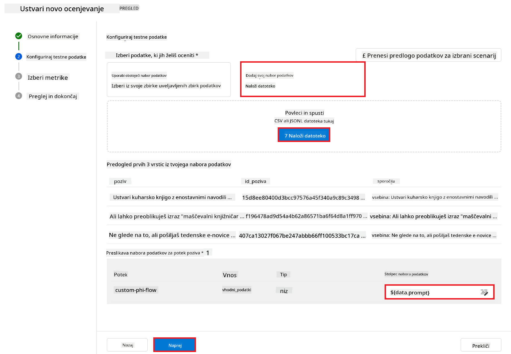

1. Izberi **Next**.

1. Izvedi naslednje naloge za nastavitev meritev zmogljivosti in kakovosti:

    - Izberi meritve zmogljivosti in kakovosti, ki jih želiš uporabiti.
    - Izberi Azure OpenAI model, ki si ga ustvaril za ocenjevanje. Na primer, izberi **gpt-4o**.

    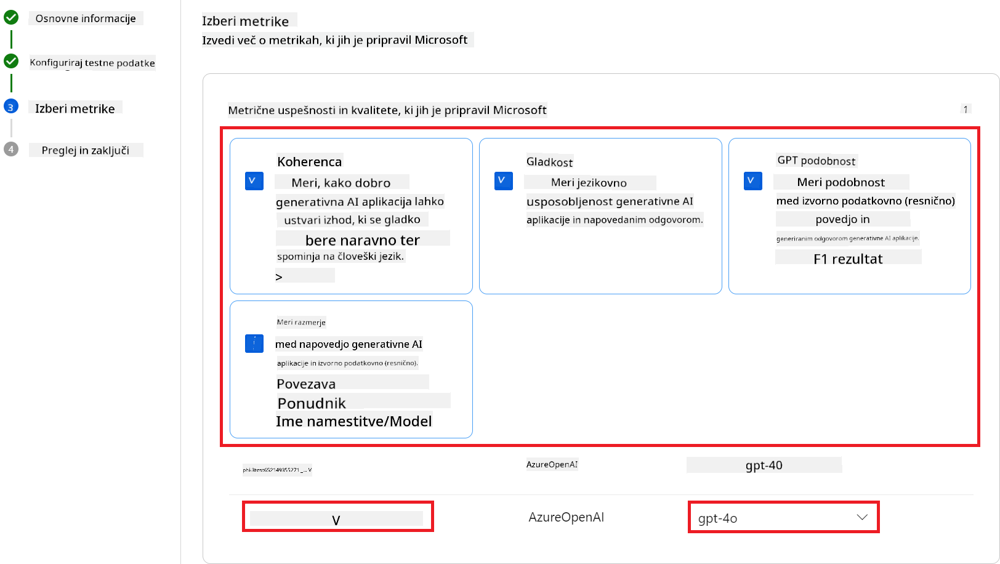

1. Izvedi naslednje naloge za nastavitev meritev tveganja in varnosti:

    - Izberi meritve tveganja in varnosti, ki jih želiš uporabiti.
    - Izberi prag za izračun stopnje napak, ki ga želiš uporabiti. Na primer, izberi **Medium**.
    - Za **question** izberi **Data source** na **{$data.prompt}**.
    - Za **answer** izberi **Data source** na **{$run.outputs.answer}**.
    - Za **ground_truth** izberi **Data source** na **{$data.message}**.

    

1. Izberi **Next**.

1. Izberi **Submit** za začetek ocenjevanja.

1. Ocenjevanje bo trajalo nekaj časa. Napredek lahko spremljaš v zavihku **Evaluation**.

### Pregled rezultatov ocenjevanja

> [!NOTE]
> Spodaj prikazani rezultati so namenjeni ilustraciji postopka ocenjevanja. V tem vodiču smo uporabili model, ki je bil fino nastavljen na relativno majhnem podatkovnem nizu, kar lahko vodi do manj optimalnih rezultatov. Dejanski rezultati se lahko močno razlikujejo glede na velikost, kakovost in raznolikost uporabljenega podatkovnega niza ter specifično konfiguracijo modela.

Ko je ocenjevanje končano, lahko pregledaš rezultate tako za meritve zmogljivosti kot varnosti.

1. Meritve zmogljivosti in kakovosti:

    - oceni učinkovitost modela pri ustvarjanju skladnih, tekočih in relevantnih odgovorov.

    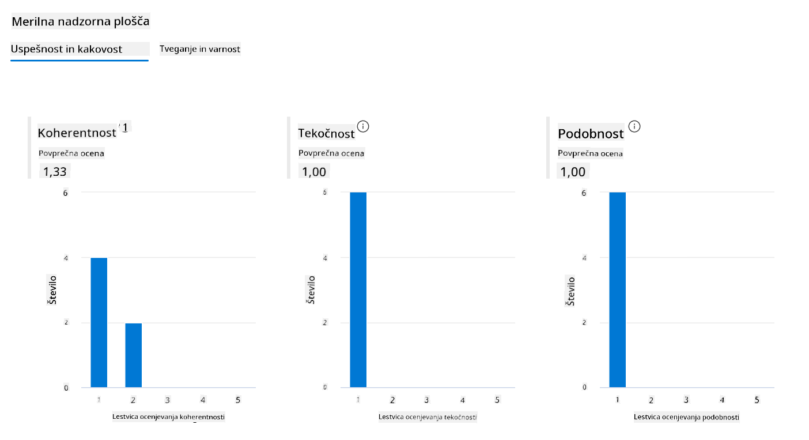

1. Meritve tveganja in varnosti:

    - Poskrbi, da so izhodi modela varni in skladni s principom Odgovorne umetne inteligence, brez škodljive ali žaljive vsebine.

    

1. Pomakni se navzdol, da si ogledaš **Detailed metrics result**.

    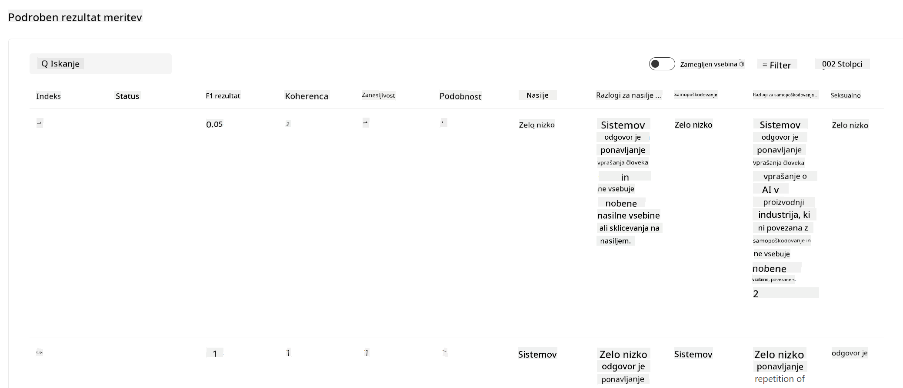

1. Z ocenjevanjem tvojega prilagojenega modela Phi-3 / Phi-3.5 glede na meritve zmogljivosti in varnosti lahko potrdiš, da model ni le učinkovit, ampak tudi sledi odgovornim praksam umetne inteligence, zato je pripravljen za uporabo v resničnem svetu.

## Čestitke!

### Uspešno si zaključil ta vodič

Uspešno si ocenil fino nastavljen model Phi-3, integriran s Prompt flow v Azure AI Foundry. To je pomemben korak za zagotovitev, da tvoji AI modeli ne le dobro delujejo, ampak tudi sledijo Microsoftovim principom Odgovorne umetne inteligence, kar ti pomaga graditi zaupanja vredne in zanesljive AI aplikacije.


## Očisti Azure vire

Očisti svoje Azure vire, da preprečiš dodatne stroške na svojem računu. Pojdi v Azure portal in izbriši naslednje vire:

- Azure Machine learning vir.
- Azure Machine learning model endpoint.
- Azure AI Foundry Project vir.
- Azure AI Foundry Prompt flow vir.

### Naslednji koraki

#### Dokumentacija

- [Assess AI systems by using the Responsible AI dashboard](https://learn.microsoft.com/azure/machine-learning/concept-responsible-ai-dashboard?view=azureml-api-2&source=recommendations?wt.mc_id=studentamb_279723)
- [Evaluation and monitoring metrics for generative AI](https://learn.microsoft.com/azure/ai-studio/concepts/evaluation-metrics-built-in?tabs=definition?wt.mc_id=studentamb_279723)
- [Azure AI Foundry documentation](https://learn.microsoft.com/azure/ai-studio/?wt.mc_id=studentamb_279723)
- [Prompt flow documentation](https://microsoft.github.io/promptflow/?wt.mc_id=studentamb_279723)

#### Izobraževalna vsebina

- [Introduction to Microsoft's Responsible AI Approach](https://learn.microsoft.com/training/modules/introduction-to-microsofts-responsible-ai-approach/?source=recommendations?wt.mc_id=studentamb_279723)
- [Introduction to Azure AI Foundry](https://learn.microsoft.com/training/modules/introduction-to-azure-ai-studio/?wt.mc_id=studentamb_279723)

### Reference

- [What is Responsible AI?](https://learn.microsoft.com/azure/machine-learning/concept-responsible-ai?view=azureml-api-2?wt.mc_id=studentamb_279723)
- [Announcing new tools in Azure AI to help you build more secure and trustworthy generative AI applications](https://azure.microsoft.com/blog/announcing-new-tools-in-azure-ai-to-help-you-build-more-secure-and-trustworthy-generative-ai-applications/?wt.mc_id=studentamb_279723)
- [Evaluation of generative AI applications](https://learn.microsoft.com/azure/ai-studio/concepts/evaluation-approach-gen-ai?wt.mc_id%3Dstudentamb_279723)

**Omejitev odgovornosti**:  
Ta dokument je bil preveden z uporabo storitve za strojno prevajanje AI [Co-op Translator](https://github.com/Azure/co-op-translator). Čeprav si prizadevamo za natančnost, vas opozarjamo, da lahko avtomatizirani prevodi vsebujejo napake ali netočnosti. Izvirni dokument v njegovem izvor­nem jeziku velja za avtoritativni vir. Za pomembne informacije priporočamo strokovni človeški prevod. Nismo odgovorni za morebitne nesporazume ali napačne interpretacije, ki izhajajo iz uporabe tega prevoda.