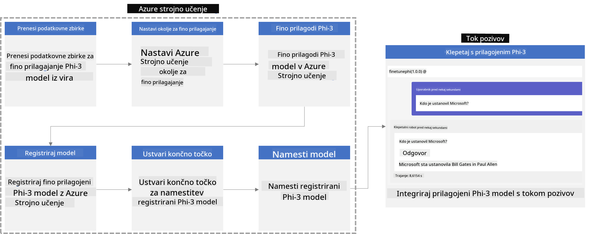
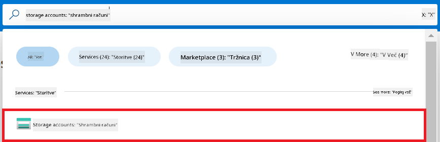
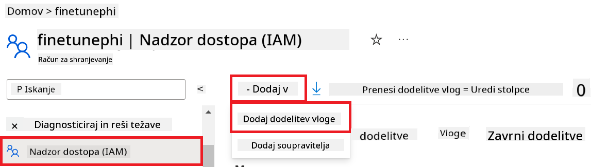
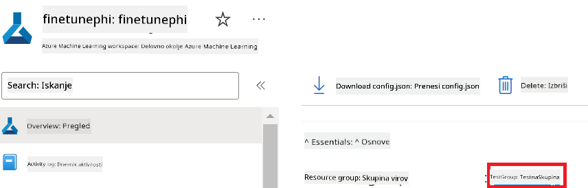
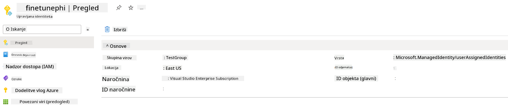
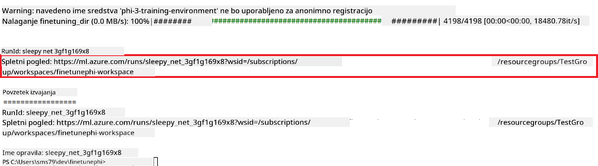
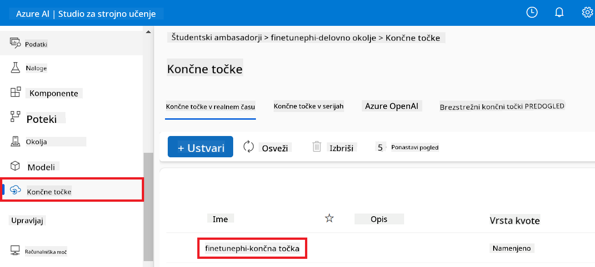

<!--
CO_OP_TRANSLATOR_METADATA:
{
  "original_hash": "7ca2c30fdb802664070e9cfbf92e24fe",
  "translation_date": "2026-01-05T15:37:58+00:00",
  "source_file": "md/02.Application/01.TextAndChat/Phi3/E2E_Phi-3-FineTuning_PromptFlow_Integration.md",
  "language_code": "sl"
}
-->
# Dodelajte in integrirajte po meri izdelane modele Phi-3 s Prompt flow

Ta celoten (E2E) primer temelji na vodiču "[Dodelajte in integrirajte po meri izdelane modele Phi-3 s Prompt Flow: vodič korak za korakom](https://techcommunity.microsoft.com/t5/educator-developer-blog/fine-tune-and-integrate-custom-phi-3-models-with-prompt-flow/ba-p/4178612?WT.mc_id=aiml-137032-kinfeylo)" iz Microsoft Tech Community. Predstavlja postopke natančnega prilagajanja, nameščanja in integracije po meri izdelanih modelov Phi-3 s Prompt flow.

## Pregled

V tem E2E primeru se boste naučili, kako natančno prilagoditi model Phi-3 in ga integrirati s Prompt flow. Z uporabo Azure Machine Learning in Prompt flow boste vzpostavili delovni tok za nameščanje in uporabo po meri izdelanih modelov AI. Ta E2E primer je razdeljen na tri scenarije:

**Scenarij 1: Nastavitev virov Azure in priprava na natančno prilagajanje**

**Scenarij 2: Natančno prilagodite model Phi-3 in ga namestite v Azure Machine Learning Studio**

**Scenarij 3: Integracija s Prompt flow in pogovor z vašim po meri izdelanim modelom**

Tukaj je pregled tega E2E primera.



### Kazalo vsebine

1. **[Scenarij 1: Nastavitev virov Azure in priprava na natančno prilagajanje](../../../../../../md/02.Application/01.TextAndChat/Phi3)**
    - [Ustvarite delovno okolje Azure Machine Learning](../../../../../../md/02.Application/01.TextAndChat/Phi3)
    - [Zahtevajte kvote GPU v naročnini Azure](../../../../../../md/02.Application/01.TextAndChat/Phi3)
    - [Dodajte dodelitev vlog](../../../../../../md/02.Application/01.TextAndChat/Phi3)
    - [Nastavite projekt](../../../../../../md/02.Application/01.TextAndChat/Phi3)
    - [Pripravite nabor podatkov za natančno prilagajanje](../../../../../../md/02.Application/01.TextAndChat/Phi3)

1. **[Scenarij 2: Natančno prilagodite model Phi-3 in ga namestite v Azure Machine Learning Studio](../../../../../../md/02.Application/01.TextAndChat/Phi3)**
    - [Nastavite Azure CLI](../../../../../../md/02.Application/01.TextAndChat/Phi3)
    - [Natančno prilagodite model Phi-3](../../../../../../md/02.Application/01.TextAndChat/Phi3)
    - [Namestite natančno prilagojen model](../../../../../../md/02.Application/01.TextAndChat/Phi3)

1. **[Scenarij 3: Integracija s Prompt flow in pogovor z vašim po meri izdelanim modelom](../../../../../../md/02.Application/01.TextAndChat/Phi3)**
    - [Integrirajte po meri izdelan model Phi-3 s Prompt flow](../../../../../../md/02.Application/01.TextAndChat/Phi3)
    - [Pogovarjajte se z vašim po meri izdelanim modelom](../../../../../../md/02.Application/01.TextAndChat/Phi3)

## Scenarij 1: Nastavitev virov Azure in priprava na natančno prilagajanje

### Ustvarite delovno okolje Azure Machine Learning

1. Vpišite *azure machine learning* v **iskalno vrstico** na vrhu strani portala in izberite **Azure Machine Learning** med prikazanimi možnostmi.

    

1. Izberite **+ Ustvari** v navigacijskem meniju.

1. Izberite **Novo delovno okolje** v navigacijskem meniju.

    

1. Izvedite naslednje korake:

    - Izberite vašo naročnino Azure (**Subscription**).
    - Izberite **Skupino virov** za uporabo (ustvarite novo, če je potrebno).
    - Vnesite **Ime delovnega okolja**. Mora biti edinstvena vrednost.
    - Izberite **Regijo**, ki jo želite uporabiti.
    - Izberite **Shranjevalni račun**, ki ga želite uporabiti (ustvarite novega, če je potrebno).
    - Izberite **Key vault**, ki ga želite uporabiti (ustvarite novega, če je potrebno).
    - Izberite **Application insights**, ki jih želite uporabiti (ustvarite nove, če je potrebno).
    - Izberite **Registrator zabojnikov** (Container registry), ki ga želite uporabiti (ustvarite novega, če je potrebno).

    

1. Izberite **Pregled in ustvarjanje**.

1. Izberite **Ustvari**.

### Zahtevajte kvote GPU v naročnini Azure

V tem E2E primeru boste za natančno prilagajanje uporabili *Standard_NC24ads_A100_v4 GPU*, za kar je potrebna zahteva po kvoti, za nameščanje pa *Standard_E4s_v3* CPU, za kar ni potrebna zahteva po kvoti.

> [!NOTE]
>
> GPU dodelitev je trenutno na voljo samo za naročnine Po plačilu po porabi (Pay-As-You-Go); naročnine za ugodnosti trenutno niso podprte.
>
> Za tiste, ki uporabljajo naročnine za ugodnosti (kot je Visual Studio Enterprise Subscription) ali želijo hitro preizkusiti postopek natančnega prilagajanja in nameščanja, ta vadnica nudi tudi navodila za natančno prilagajanje z minimalnim naborom podatkov ob uporabi CPU. Pomembno je poudariti, da so rezultati natančnega prilagajanja bistveno boljši pri uporabi GPU z večjimi nabori podatkov.

1. Obiščite [Azure ML Studio](https://ml.azure.com/home?wt.mc_id=studentamb_279723).

1. Izvedite naslednje korake za zahtevo kvote *Standard NCADSA100v4 Family*:

    - Izberite **Kvota** iz jezička na levi strani.
    - Izberite **Družino virtualnih računalnikov**, ki jo želite uporabiti. Na primer, izberite **Standard NCADSA100v4 Family Cluster Dedicated vCPUs**, ki vključuje *Standard_NC24ads_A100_v4* GPU.
    - Izberite **Zahtevaj kvoto** v navigacijskem meniju.

        

    - Na strani za zahtevo kvote vnesite **Novo omejitev jeder**, ki jih želite uporabiti. Na primer, 24.
    - Na strani za zahtevo kvote izberite **Pošlji**, da zahtevate kvoto GPU.

> [!NOTE]
> Ustrezni GPU ali CPU za vaše potrebe lahko izberete glede na dokument [Velikosti virtualnih računalnikov v Azure](https://learn.microsoft.com/azure/virtual-machines/sizes/overview?tabs=breakdownseries%2Cgeneralsizelist%2Ccomputesizelist%2Cmemorysizelist%2Cstoragesizelist%2Cgpusizelist%2Cfpgasizelist%2Chpcsizelist).

### Dodajte dodelitev vlog

Da natančno prilagodite in namestite svoje modele, morate najprej ustvariti Uporabniško dodeljeno upravljano identiteto (UAI) in ji dodeliti ustrezna dovoljenja. Ta UAI bo uporabljena za overjanje med nameščanjem.

#### Ustvarite uporabniško dodeljeno upravljano identiteto (UAI)

1. Vpišite *managed identities* v **iskalno vrstico** na vrhu strani portala in izberite **Managed Identities** med prikazanimi možnostmi.

    

1. Izberite **+ Ustvari**.

    

1. Izvedite naslednje korake:

    - Izberite vašo naročnino Azure (**Subscription**).
    - Izberite **Skupino virov** za uporabo (ustvarite novo, če je potrebno).
    - Izberite **Regijo**, ki jo želite uporabiti.
    - Vnesite **Ime**. Mora biti edinstvena vrednost.

1. Izberite **Pregled in ustvarjanje**.

1. Izberite **+ Ustvari**.

#### Dodajte dodelitev vloge Contributor upravljani identiteti

1. Pojdite do vira upravljane identitete, ki ste jo ustvarili.

1. Izberite **Dodelitve vlog Azure** na levi strani.

1. Izberite **+ Dodaj dodelitev vlog** v navigacijskem meniju.

1. Na strani Dodaj dodelitev vlog izvedite naslednje korake:
    - Izberite **Obseg** kot **Skupina virov**.
    - Izberite vašo naročnino Azure (**Subscription**).
    - Izberite **Skupino virov** za uporabo.
    - Izberite **Vlogo** kot **Contributor**.

    

1. Izberite **Shrani**.

#### Dodajte dodelitev vloge bralca podatkov sklopa Storage Blob upravljani identiteti

1. Vpišite *storage accounts* v **iskalno vrstico** na vrhu strani portala in izberite **Storage accounts** med prikazanimi možnostmi.

    

1. Izberite shrambo, povezano z delovnim okoljem Azure Machine Learning, ki ste ga ustvarili. Na primer, *finetunephistorage*.

1. Izvedite naslednje korake za navigacijo do strani za dodajanje dodelitve vlog:

    - Pomaknite se do računa Azure Storage, ki ste ga ustvarili.
    - Izberite **Nadzor dostopa (IAM)** na levi strani.
    - Izberite **+ Dodaj** v navigacijskem meniju.
    - Izberite **Dodaj dodelitev vlog** v navigacijskem meniju.

    

1. Na strani Dodaj dodelitev vlog izvedite naslednje korake:

    - Na strani z vlogami v iskalno vrstico vpišite *Storage Blob Data Reader* in izberite **Storage Blob Data Reader** med prikazanimi možnostmi.
    - Na strani z vlogami izberite **Naprej**.
    - Na strani z člani izberite **Dodeli dostop** kot **Upravljana identiteta**.
    - Na strani z člani izberite **+ Izberi člane**.
    - Na strani za izbiro upravljanih identitet izberite vašo naročnino Azure (**Subscription**).
    - Na strani za izbiro upravljanih identitet izberite **Upravljano identiteto** kot **Manage Identity**.
    - Na strani za izbiro upravljanih identitet izberite upravljano identiteto, ki ste jo ustvarili. Na primer, *finetunephi-managedidentity*.
    - Na strani za izbiro upravljanih identitet izberite **Izberi**.

    

1. Izberite **Pregled in dodeli**.

#### Dodajte dodelitev vloge AcrPull upravljani identiteti

1. Vpišite *container registries* v **iskalno vrstico** na vrhu strani portala in izberite **Container registries** med prikazanimi možnostmi.

    

1. Izberite registrator zabojnikov, povezan z delovnim okoljem Azure Machine Learning. Na primer, *finetunephicontainerregistries*

1. Izvedite naslednje korake za navigacijo do strani za dodajanje dodelitve vlog:

    - Izberite **Nadzor dostopa (IAM)** na levi strani.
    - Izberite **+ Dodaj** v navigacijskem meniju.
    - Izberite **Dodaj dodelitev vlog** v navigacijskem meniju.

1. Na strani Dodaj dodelitev vlog izvedite naslednje korake:

    - Na strani z vlogami vpišite *AcrPull* v iskalno vrstico in izberite **AcrPull** iz prikazanih možnosti.
    - Na strani z vlogami izberite **Naprej**.
    - Na strani z člani izberite **Dodeli dostop** kot **Upravljana identiteta**.
    - Na strani z člani izberite **+ Izberi člane**.
    - Na strani za izbiro upravljanih identitet izberite vašo naročnino Azure (**Subscription**).
    - Na strani za izbiro upravljanih identitet izberite **Upravljano identiteto** kot **Manage Identity**.
    - Na strani za izbiro upravljanih identitet izberite upravljano identiteto, ki ste jo ustvarili. Na primer, *finetunephi-managedidentity*.
    - Na strani za izbiro upravljanih identitet izberite **Izberi**.
    - Izberite **Pregled in dodeli**.

### Nastavite projekt

Zdaj boste ustvarili mapo, v kateri boste delali, in nastavili virtualno okolje za razvoj programa, ki komunicira z uporabniki in uporablja shranjeno zgodovino pogovora iz Azure Cosmos DB za obveščanje svojih odgovorov.

#### Ustvarite mapo, v kateri boste delali

1. Odprite terminal in vnesite naslednji ukaz za ustvarjanje mape z imenom *finetune-phi* v privzeti poti.

    ```console
    mkdir finetune-phi
    ```

1. Vnesite naslednji ukaz v terminal, da se premaknete v ustvarjeno mapo *finetune-phi*.

    ```console
    cd finetune-phi
    ```

#### Ustvarite virtualno okolje

1. Vnesite naslednji ukaz v terminal, da ustvarite virtualno okolje z imenom *.venv*.

    ```console
    python -m venv .venv
    ```

1. Vnesite naslednji ukaz v terminal, da aktivirate virtualno okolje.

    ```console
    .venv\Scripts\activate.bat
    ```

> [!NOTE]
>
> Če je uspelo, bi morali pred pozivom ukazne vrstice videti *(.venv)*.

#### Namestite potrebne pakete

1. Vnesite naslednje ukaze v terminal, da namestite potrebne pakete.

    ```console
    pip install datasets==2.19.1
    pip install transformers==4.41.1
    pip install azure-ai-ml==1.16.0
    pip install torch==2.3.1
    pip install trl==0.9.4
    pip install promptflow==1.12.0
    ```

#### Ustvarite datoteke projekta
V tej vaji boste ustvarili osnovne datoteke za naš projekt. Te datoteke vključujejo skripte za prenos nabora podatkov, nastavitev okolja Azure Machine Learning, fino nastavitev modela Phi-3 in razporeditev fino nastavljenega modela. Prav tako boste ustvarili datoteko *conda.yml* za nastavitev okolja za fino nastavitev.

V tej vaji boste:

- Ustvarili datoteko *download_dataset.py* za prenos nabora podatkov.
- Ustvarili datoteko *setup_ml.py* za nastavitev okolja Azure Machine Learning.
- Ustvarili datoteko *fine_tune.py* v mapi *finetuning_dir* za fino nastavitev modela Phi-3 z uporabo nabora podatkov.
- Ustvarili datoteko *conda.yml* za nastavitev okolja za fino nastavitev.
- Ustvarili datoteko *deploy_model.py* za razporeditev fino nastavljenega modela.
- Ustvarili datoteko *integrate_with_promptflow.py* za integracijo fino nastavljenega modela in izvrševanje modela preko Prompt flow.
- Ustvarili datoteko flow.dag.yml za nastavitev strukture poteka dela za Prompt flow.
- Ustvarili datoteko *config.py* za vnos podatkov o Azure.

> [!NOTE]
>
> Celotna struktura mape:
>
> ```text
> └── YourUserName
> .    └── finetune-phi
> .        ├── finetuning_dir
> .        │      └── fine_tune.py
> .        ├── conda.yml
> .        ├── config.py
> .        ├── deploy_model.py
> .        ├── download_dataset.py
> .        ├── flow.dag.yml
> .        ├── integrate_with_promptflow.py
> .        └── setup_ml.py
> ```

1. Odprite **Visual Studio Code**.

1. Izberite **File** v menijski vrstici.

1. Izberite **Open Folder**.

1. Izberite mapo *finetune-phi*, ki ste jo ustvarili, in se nahaja na *C:\Users\yourUserName\finetune-phi*.

    

1. V levem podoknu Visual Studio Code kliknite z desno tipko miške in izberite **New File**, da ustvarite novo datoteko z imenom *download_dataset.py*.

1. V levem podoknu Visual Studio Code kliknite z desno tipko miške in izberite **New File**, da ustvarite novo datoteko z imenom *setup_ml.py*.

1. V levem podoknu Visual Studio Code kliknite z desno tipko miške in izberite **New File**, da ustvarite novo datoteko z imenom *deploy_model.py*.

    

1. V levem podoknu Visual Studio Code kliknite z desno tipko miške in izberite **New Folder**, da ustvarite novo mapo z imenom *finetuning_dir*.

1. V mapi *finetuning_dir* ustvarite novo datoteko z imenom *fine_tune.py*.

#### Ustvarite in konfigurirajte datoteko *conda.yml*

1. V levem podoknu Visual Studio Code kliknite z desno tipko miške in izberite **New File**, da ustvarite novo datoteko z imenom *conda.yml*.

1. Dodajte naslednjo kodo v datoteko *conda.yml* za nastavitev okolja za fino nastavitev modela Phi-3.

    ```yml
    name: phi-3-training-env
    channels:
      - defaults
      - conda-forge
    dependencies:
      - python=3.10
      - pip
      - numpy<2.0
      - pip:
          - torch==2.4.0
          - torchvision==0.19.0
          - trl==0.8.6
          - transformers==4.41
          - datasets==2.21.0
          - azureml-core==1.57.0
          - azure-storage-blob==12.19.0
          - azure-ai-ml==1.16
          - azure-identity==1.17.1
          - accelerate==0.33.0
          - mlflow==2.15.1
          - azureml-mlflow==1.57.0
    ```

#### Ustvarite in konfigurirajte datoteko *config.py*

1. V levem podoknu Visual Studio Code kliknite z desno tipko miške in izberite **New File**, da ustvarite novo datoteko z imenom *config.py*.

1. Dodajte naslednjo kodo v datoteko *config.py* za vnos svojih podatkov o Azure.

    ```python
    # Nastavitve Azure
    AZURE_SUBSCRIPTION_ID = "your_subscription_id"
    AZURE_RESOURCE_GROUP_NAME = "your_resource_group_name" # "TestGroup"

    # Nastavitve Azure Machine Learning
    AZURE_ML_WORKSPACE_NAME = "your_workspace_name" # "finetunephi-workspace"

    # Nastavitve upravljane identitete Azure
    AZURE_MANAGED_IDENTITY_CLIENT_ID = "your_azure_managed_identity_client_id"
    AZURE_MANAGED_IDENTITY_NAME = "your_azure_managed_identity_name" # "finetunephi-mangedidentity"
    AZURE_MANAGED_IDENTITY_RESOURCE_ID = f"/subscriptions/{AZURE_SUBSCRIPTION_ID}/resourceGroups/{AZURE_RESOURCE_GROUP_NAME}/providers/Microsoft.ManagedIdentity/userAssignedIdentities/{AZURE_MANAGED_IDENTITY_NAME}"

    # Poti do datotek z nabori podatkov
    TRAIN_DATA_PATH = "data/train_data.jsonl"
    TEST_DATA_PATH = "data/test_data.jsonl"

    # Nastavitve modela z izboljšanim učenjem
    AZURE_MODEL_NAME = "your_fine_tuned_model_name" # "finetune-phi-model"
    AZURE_ENDPOINT_NAME = "your_fine_tuned_model_endpoint_name" # "finetune-phi-endpoint"
    AZURE_DEPLOYMENT_NAME = "your_fine_tuned_model_deployment_name" # "finetune-phi-deployment"

    AZURE_ML_API_KEY = "your_fine_tuned_model_api_key"
    AZURE_ML_ENDPOINT = "your_fine_tuned_model_endpoint_uri" # "https://{your-endpoint-name}.{your-region}.inference.ml.azure.com/score"
    ```

#### Dodajte spremenljivke okolja Azure

1. Izvedite naslednje korake za dodajanje ID naročnine Azure:

    - V iskalno vrstico na vrhu portala vtipkajte *subscriptions* in izberite **Subscriptions** iz prikazanih možnosti.
    - Izberite trenutno uporabljeno Azure naročnino.
    - Kopirajte in prilepite svoj ID naročnine v datoteko *config.py*.

    

1. Izvedite naslednje korake za dodajanje imena delovnega prostora Azure:

    - Pomaknite se do vira Azure Machine Learning, ki ste ga ustvarili.
    - Kopirajte in prilepite ime svojega delovnega prostora v datoteko *config.py*.

    

1. Izvedite naslednje korake za dodajanje imena skupine virov Azure:

    - Pomaknite se do vira Azure Machine Learning, ki ste ga ustvarili.
    - Kopirajte in prilepite ime skupine virov Azure v datoteko *config.py*.

    

2. Izvedite naslednje korake za dodajanje imena upravljane identitete Azure

    - Pomaknite se do vira Managed Identities, ki ste ga ustvarili.
    - Kopirajte in prilepite ime upravljane identitete Azure v datoteko *config.py*.

    

### Pripravite nabor podatkov za fino nastavitev

V tej vaji boste zagnali datoteko *download_dataset.py* za prenos nabora podatkov *ULTRACHAT_200k* v vaše lokalno okolje. Nato boste uporabili ta nabor podatkov za fino nastavitev modela Phi-3 v Azure Machine Learning.

#### Prenesite svoj nabor podatkov z uporabo *download_dataset.py*

1. Odprite datoteko *download_dataset.py* v Visual Studio Code.

1. Dodajte naslednjo kodo v *download_dataset.py*.

    ```python
    import json
    import os
    from datasets import load_dataset
    from config import (
        TRAIN_DATA_PATH,
        TEST_DATA_PATH)

    def load_and_split_dataset(dataset_name, config_name, split_ratio):
        """
        Load and split a dataset.
        """
        # Naloži niz podatkov z določenim imenom, konfiguracijo in razmerjem delitve
        dataset = load_dataset(dataset_name, config_name, split=split_ratio)
        print(f"Original dataset size: {len(dataset)}")
        
        # Razdeli niz podatkov na učni in testni del (80 % učno, 20 % testno)
        split_dataset = dataset.train_test_split(test_size=0.2)
        print(f"Train dataset size: {len(split_dataset['train'])}")
        print(f"Test dataset size: {len(split_dataset['test'])}")
        
        return split_dataset

    def save_dataset_to_jsonl(dataset, filepath):
        """
        Save a dataset to a JSONL file.
        """
        # Ustvari imenik, če ne obstaja
        os.makedirs(os.path.dirname(filepath), exist_ok=True)
        
        # Odpri datoteko v načinu pisanja
        with open(filepath, 'w', encoding='utf-8') as f:
            # Pojdi skozi vsak zapis v nizu podatkov
            for record in dataset:
                # Zapiši zapis kot JSON objekt in ga zapiši v datoteko
                json.dump(record, f)
                # Zapiši znak nove vrstice za ločevanje zapisov
                f.write('\n')
        
        print(f"Dataset saved to {filepath}")

    def main():
        """
        Main function to load, split, and save the dataset.
        """
        # Naloži in razdeli niz podatkov ULTRACHAT_200k z določeno konfiguracijo in razmerjem delitve
        dataset = load_and_split_dataset("HuggingFaceH4/ultrachat_200k", 'default', 'train_sft[:1%]')
        
        # Izlušči učni in testni niz podatkov iz razdelka
        train_dataset = dataset['train']
        test_dataset = dataset['test']

        # Shrani učni niz podatkov v JSONL datoteko
        save_dataset_to_jsonl(train_dataset, TRAIN_DATA_PATH)
        
        # Shrani testni niz podatkov v ločeno JSONL datoteko
        save_dataset_to_jsonl(test_dataset, TEST_DATA_PATH)

    if __name__ == "__main__":
        main()

    ```

> [!TIP]
>
> **Navodila za fino nastavitev z minimalnim naborom podatkov z uporabo CPU**
>
> Če želite uporabiti CPU za fino nastavitev, je ta pristop idealen za uporabnike z naročninami za ugodnosti (kot je Visual Studio Enterprise Subscription) ali za hitro testiranje postopka fine nastavitve in razporejanja.
>
> Zamenjajte `dataset = load_and_split_dataset("HuggingFaceH4/ultrachat_200k", 'default', 'train_sft[:1%]')` z `dataset = load_and_split_dataset("HuggingFaceH4/ultrachat_200k", 'default', 'train_sft[:10]')`
>

1. Vtipkajte naslednji ukaz v terminalu, da zaženete skripto in prenesete nabor podatkov v lokalno okolje.

    ```console
    python download_data.py
    ```

1. Preverite, da je bil nabor podatkov uspešno shranjen v lokalni imenik *finetune-phi/data*.

> [!NOTE]
>
> **Velikost nabora podatkov in čas fine nastavitve**
>
> V tem E2E vzorcu uporabljate le 1 % nabora podatkov (`train_sft[:1%]`). To občutno zmanjša količino podatkov, s čimer pohitri tako nalaganje kot proces fino nastavitve. Odstotek lahko prilagodite, da najdete pravo ravnovesje med časom usposabljanja in zmogljivostjo modela. Uporaba manjše podmnožice nabora podatkov zmanjša čas, potrebn za fino nastavitev, kar postopek naredi bolj obvladljiv za E2E vzorec.

## Scenarij 2: Fino nastavite model Phi-3 in ga razporedite v Azure Machine Learning Studio

### Nastavite Azure CLI

Za preverjanje pristnosti svojega okolja morate nastaviti Azure CLI. Azure CLI omogoča upravljanje Azure virov neposredno iz ukazne vrstice in zagotavlja poverilnice, potrebne za dostop Azure Machine Learning do teh virov. Za začetek namestite [Azure CLI](https://learn.microsoft.com/cli/azure/install-azure-cli)

1. Odprite terminal in vtipkajte naslednji ukaz za prijavo v svoj Azure račun.

    ```console
    az login
    ```

1. Izberite svoj Azure račun za uporabo.

1. Izberite svojo Azure naročnino za uporabo.

    

> [!TIP]
>
> Če imate težave s prijavo v Azure, poskusite uporabiti kodo naprave. Odprite terminal in vtipkajte naslednji ukaz za prijavo v svoj Azure račun:
>
> ```console
> az login --use-device-code
> ```
>

### Fino nastavite model Phi-3

V tej vaji boste fino nastavili model Phi-3 z uporabo priloženega nabora podatkov. Najprej boste definirali postopek fine nastavitve v datoteki *fine_tune.py*. Nato boste konfigurirali okolje Azure Machine Learning in začeli postopek fine nastavitve z zagonom datoteke *setup_ml.py*. Ta skripta zagotavlja, da izvaja fine nastavitev znotraj okolja Azure Machine Learning.

Z zagonom *setup_ml.py* boste zagnali postopek fine nastavitve v okolju Azure Machine Learning.

#### Dodajte kodo v datoteko *fine_tune.py*

1. Pomaknite se v mapo *finetuning_dir* in odprite datoteko *fine_tune.py* v Visual Studio Code.

1. Dodajte naslednjo kodo v *fine_tune.py*.

    ```python
    import argparse
    import sys
    import logging
    import os
    from datasets import load_dataset
    import torch
    import mlflow
    from transformers import AutoModelForCausalLM, AutoTokenizer, TrainingArguments
    from trl import SFTTrainer

    # Da preprečite napako INVALID_PARAMETER_VALUE v MLflow, onemogočite integracijo MLflow
    os.environ["DISABLE_MLFLOW_INTEGRATION"] = "True"

    # Nastavitev beleženja
    logging.basicConfig(
        format="%(asctime)s - %(levelname)s - %(name)s - %(message)s",
        datefmt="%Y-%m-%d %H:%M:%S",
        handlers=[logging.StreamHandler(sys.stdout)],
        level=logging.WARNING
    )
    logger = logging.getLogger(__name__)

    def initialize_model_and_tokenizer(model_name, model_kwargs):
        """
        Initialize the model and tokenizer with the given pretrained model name and arguments.
        """
        model = AutoModelForCausalLM.from_pretrained(model_name, **model_kwargs)
        tokenizer = AutoTokenizer.from_pretrained(model_name)
        tokenizer.model_max_length = 2048
        tokenizer.pad_token = tokenizer.unk_token
        tokenizer.pad_token_id = tokenizer.convert_tokens_to_ids(tokenizer.pad_token)
        tokenizer.padding_side = 'right'
        return model, tokenizer

    def apply_chat_template(example, tokenizer):
        """
        Apply a chat template to tokenize messages in the example.
        """
        messages = example["messages"]
        if messages[0]["role"] != "system":
            messages.insert(0, {"role": "system", "content": ""})
        example["text"] = tokenizer.apply_chat_template(
            messages, tokenize=False, add_generation_prompt=False
        )
        return example

    def load_and_preprocess_data(train_filepath, test_filepath, tokenizer):
        """
        Load and preprocess the dataset.
        """
        train_dataset = load_dataset('json', data_files=train_filepath, split='train')
        test_dataset = load_dataset('json', data_files=test_filepath, split='train')
        column_names = list(train_dataset.features)

        train_dataset = train_dataset.map(
            apply_chat_template,
            fn_kwargs={"tokenizer": tokenizer},
            num_proc=10,
            remove_columns=column_names,
            desc="Applying chat template to train dataset",
        )

        test_dataset = test_dataset.map(
            apply_chat_template,
            fn_kwargs={"tokenizer": tokenizer},
            num_proc=10,
            remove_columns=column_names,
            desc="Applying chat template to test dataset",
        )

        return train_dataset, test_dataset

    def train_and_evaluate_model(train_dataset, test_dataset, model, tokenizer, output_dir):
        """
        Train and evaluate the model.
        """
        training_args = TrainingArguments(
            bf16=True,
            do_eval=True,
            output_dir=output_dir,
            eval_strategy="epoch",
            learning_rate=5.0e-06,
            logging_steps=20,
            lr_scheduler_type="cosine",
            num_train_epochs=3,
            overwrite_output_dir=True,
            per_device_eval_batch_size=4,
            per_device_train_batch_size=4,
            remove_unused_columns=True,
            save_steps=500,
            seed=0,
            gradient_checkpointing=True,
            gradient_accumulation_steps=1,
            warmup_ratio=0.2,
        )

        trainer = SFTTrainer(
            model=model,
            args=training_args,
            train_dataset=train_dataset,
            eval_dataset=test_dataset,
            max_seq_length=2048,
            dataset_text_field="text",
            tokenizer=tokenizer,
            packing=True
        )

        train_result = trainer.train()
        trainer.log_metrics("train", train_result.metrics)

        mlflow.transformers.log_model(
            transformers_model={"model": trainer.model, "tokenizer": tokenizer},
            artifact_path=output_dir,
        )

        tokenizer.padding_side = 'left'
        eval_metrics = trainer.evaluate()
        eval_metrics["eval_samples"] = len(test_dataset)
        trainer.log_metrics("eval", eval_metrics)

    def main(train_file, eval_file, model_output_dir):
        """
        Main function to fine-tune the model.
        """
        model_kwargs = {
            "use_cache": False,
            "trust_remote_code": True,
            "torch_dtype": torch.bfloat16,
            "device_map": None,
            "attn_implementation": "eager"
        }

        # pretrained_model_name = "microsoft/Phi-3-mini-4k-instruct"
        pretrained_model_name = "microsoft/Phi-3.5-mini-instruct"

        with mlflow.start_run():
            model, tokenizer = initialize_model_and_tokenizer(pretrained_model_name, model_kwargs)
            train_dataset, test_dataset = load_and_preprocess_data(train_file, eval_file, tokenizer)
            train_and_evaluate_model(train_dataset, test_dataset, model, tokenizer, model_output_dir)

    if __name__ == "__main__":
        parser = argparse.ArgumentParser()
        parser.add_argument("--train-file", type=str, required=True, help="Path to the training data")
        parser.add_argument("--eval-file", type=str, required=True, help="Path to the evaluation data")
        parser.add_argument("--model_output_dir", type=str, required=True, help="Directory to save the fine-tuned model")
        args = parser.parse_args()
        main(args.train_file, args.eval_file, args.model_output_dir)

    ```

1. Shranite in zaprite datoteko *fine_tune.py*.

> [!TIP]
> **Lahko fino nastavite model Phi-3.5**
>
> V datoteki *fine_tune.py* lahko spremenite vrednost `pretrained_model_name` iz `"microsoft/Phi-3-mini-4k-instruct"` v kateri koli model, ki ga želite fino nastaviti. Na primer, če ga spremenite v `"microsoft/Phi-3.5-mini-instruct"`, boste uporabili model Phi-3.5-mini-instruct za fino nastavitev. Da najdete in uporabite ime modela, ki vam ustreza, obiščite [Hugging Face](https://huggingface.co/), poiščite interesni model in njegovo ime kopirajte v polje `pretrained_model_name` v vaši skripti.
>
> <image type="content" src="../../../../imgs/02/FineTuning-PromptFlow/finetunephi3.5.png" alt-text="Fino nastavite Phi-3.5.">
>

#### Dodajte kodo v datoteko *setup_ml.py*

1. Odprite datoteko *setup_ml.py* v Visual Studio Code.

1. Dodajte naslednjo kodo v *setup_ml.py*.

    ```python
    import logging
    from azure.ai.ml import MLClient, command, Input
    from azure.ai.ml.entities import Environment, AmlCompute
    from azure.identity import AzureCliCredential
    from config import (
        AZURE_SUBSCRIPTION_ID,
        AZURE_RESOURCE_GROUP_NAME,
        AZURE_ML_WORKSPACE_NAME,
        TRAIN_DATA_PATH,
        TEST_DATA_PATH
    )

    # Konstantne vrednosti

    # Odkomentirajte naslednje vrstice za uporabo CPU instance za učenje
    # COMPUTE_INSTANCE_TYPE = "Standard_E16s_v3" # cpu
    # COMPUTE_NAME = "cpu-e16s-v3"
    # DOCKER_IMAGE_NAME = "mcr.microsoft.com/azureml/openmpi4.1.0-ubuntu20.04:latest"

    # Odkomentirajte naslednje vrstice za uporabo GPU instance za učenje
    COMPUTE_INSTANCE_TYPE = "Standard_NC24ads_A100_v4"
    COMPUTE_NAME = "gpu-nc24s-a100-v4"
    DOCKER_IMAGE_NAME = "mcr.microsoft.com/azureml/curated/acft-hf-nlp-gpu:59"

    CONDA_FILE = "conda.yml"
    LOCATION = "eastus2" # Zamenjajte z lokacijo vašega računalniškega grozda
    FINETUNING_DIR = "./finetuning_dir" # Pot do skripte za fino nastavljanje
    TRAINING_ENV_NAME = "phi-3-training-environment" # Ime okolja za učenje
    MODEL_OUTPUT_DIR = "./model_output" # Pot do izhodnega imenika modela v Azure ML

    # Nastavitev beleženja za sledenje procesu
    logger = logging.getLogger(__name__)
    logging.basicConfig(
        format="%(asctime)s - %(levelname)s - %(name)s - %(message)s",
        datefmt="%Y-%m-%d %H:%M:%S",
        level=logging.WARNING
    )

    def get_ml_client():
        """
        Initialize the ML Client using Azure CLI credentials.
        """
        credential = AzureCliCredential()
        return MLClient(credential, AZURE_SUBSCRIPTION_ID, AZURE_RESOURCE_GROUP_NAME, AZURE_ML_WORKSPACE_NAME)

    def create_or_get_environment(ml_client):
        """
        Create or update the training environment in Azure ML.
        """
        env = Environment(
            image=DOCKER_IMAGE_NAME,  # Docker slika za okolje
            conda_file=CONDA_FILE,  # Datoteka conda okolja
            name=TRAINING_ENV_NAME,  # Ime okolja
        )
        return ml_client.environments.create_or_update(env)

    def create_or_get_compute_cluster(ml_client, compute_name, COMPUTE_INSTANCE_TYPE, location):
        """
        Create or update the compute cluster in Azure ML.
        """
        try:
            compute_cluster = ml_client.compute.get(compute_name)
            logger.info(f"Compute cluster '{compute_name}' already exists. Reusing it for the current run.")
        except Exception:
            logger.info(f"Compute cluster '{compute_name}' does not exist. Creating a new one with size {COMPUTE_INSTANCE_TYPE}.")
            compute_cluster = AmlCompute(
                name=compute_name,
                size=COMPUTE_INSTANCE_TYPE,
                location=location,
                tier="Dedicated",  # Vrsta računalniškega grozda
                min_instances=0,  # Minimalno število primerkov
                max_instances=1  # Maksimalno število primerkov
            )
            ml_client.compute.begin_create_or_update(compute_cluster).wait()  # Počakajte, da se grozd ustvari
        return compute_cluster

    def create_fine_tuning_job(env, compute_name):
        """
        Set up the fine-tuning job in Azure ML.
        """
        return command(
            code=FINETUNING_DIR,  # Pot do fine_tune.py
            command=(
                "python fine_tune.py "
                "--train-file ${{inputs.train_file}} "
                "--eval-file ${{inputs.eval_file}} "
                "--model_output_dir ${{inputs.model_output}}"
            ),
            environment=env,  # Okolje za učenje
            compute=compute_name,  # Računalniški grozd za uporabo
            inputs={
                "train_file": Input(type="uri_file", path=TRAIN_DATA_PATH),  # Pot do datoteke z učnimi podatki
                "eval_file": Input(type="uri_file", path=TEST_DATA_PATH),  # Pot do datoteke z evalvacijskimi podatki
                "model_output": MODEL_OUTPUT_DIR
            }
        )

    def main():
        """
        Main function to set up and run the fine-tuning job in Azure ML.
        """
        # Inicializirajte ML odjemalca
        ml_client = get_ml_client()

        # Ustvari okolje
        env = create_or_get_environment(ml_client)
        
        # Ustvari ali pridobi obstoječi računalniški grozd
        create_or_get_compute_cluster(ml_client, COMPUTE_NAME, COMPUTE_INSTANCE_TYPE, LOCATION)

        # Ustvari in pošlji nalogo fino nastavljanja
        job = create_fine_tuning_job(env, COMPUTE_NAME)
        returned_job = ml_client.jobs.create_or_update(job)  # Pošlji nalogo
        ml_client.jobs.stream(returned_job.name)  # Pretakajte dnevnike naloge
        
        # Zajemi ime naloge
        job_name = returned_job.name
        print(f"Job name: {job_name}")

    if __name__ == "__main__":
        main()

    ```

1. Zamenjajte `COMPUTE_INSTANCE_TYPE`, `COMPUTE_NAME` in `LOCATION` s svojimi specifičnimi podatki.

    ```python
   # Odkomentirajte naslednje vrstice za uporabo GPU primerka za učenje
    COMPUTE_INSTANCE_TYPE = "Standard_NC24ads_A100_v4"
    COMPUTE_NAME = "gpu-nc24s-a100-v4"
    ...
    LOCATION = "eastus2" # Zamenjajte z lokacijo vašega računalniškega gruče
    ```

> [!TIP]
>
> **Navodila za fino nastavitev z minimalnim naborom podatkov z uporabo CPU**
>
> Če želite uporabiti CPU za fino nastavitev, je ta pristop idealen za uporabnike z naročninami za ugodnosti (kot je Visual Studio Enterprise Subscription) ali za hitro testiranje postopka fine nastavitve in razporejanja.
>
> 1. Odprite datoteko *setup_ml*.
> 1. Zamenjajte `COMPUTE_INSTANCE_TYPE`, `COMPUTE_NAME` in `DOCKER_IMAGE_NAME` z naslednjim. Če nimate dostopa do *Standard_E16s_v3*, lahko uporabite ustrezno CPU instanco ali zaprosite za novo kvoto.
> 1. Zamenjajte `LOCATION` s svojimi specifičnimi podatki.
>
>    ```python
>    # Uncomment the following lines to use a CPU instance for training
>    COMPUTE_INSTANCE_TYPE = "Standard_E16s_v3" # cpu
>    COMPUTE_NAME = "cpu-e16s-v3"
>    DOCKER_IMAGE_NAME = "mcr.microsoft.com/azureml/openmpi4.1.0-ubuntu20.04:latest"
>    LOCATION = "eastus2" # Replace with the location of your compute cluster
>    ```
>

1. Vtipkajte naslednji ukaz za zagon skripte *setup_ml.py* in začnite postopek fine nastavitve v Azure Machine Learning.

    ```python
    python setup_ml.py
    ```

1. V tej vaji ste uspešno fino nastavili model Phi-3 z uporabo Azure Machine Learning. Z zagonom skripte *setup_ml.py* ste vzpostavili okolje Azure Machine Learning in sprožili postopek fine nastavitve, definiran v datoteki *fine_tune.py*. Upoštevajte, da lahko postopek fine nastavitve traja precej časa. Po zagonu ukaza `python setup_ml.py` morate počakati, da se postopek dokonča. Status naloge fine nastavitve lahko spremljate preko povezave, ki je prikazana v terminalu do portala Azure Machine Learning.

    

### Razporedite fino nastavljeni model

Za integracijo fino nastavljenega modela Phi-3 s Prompt Flow morate razporediti model, da bo dostopen za realnočasovno sklepanje. Ta postopek vključuje registracijo modela, ustvarjanje spletne končne točke in razporeditev modela.

#### Nastavite ime modela, ime končne točke in ime razporeditve za razporeditev

1. Odprite datoteko *config.py*.

1. Zamenjajte `AZURE_MODEL_NAME = "your_fine_tuned_model_name"` z želenim imenom za vaš model.

1. Zamenjajte `AZURE_ENDPOINT_NAME = "your_fine_tuned_model_endpoint_name"` z želenim imenom za vašo končno točko.

1. Zamenjajte `AZURE_DEPLOYMENT_NAME = "your_fine_tuned_model_deployment_name"` z želenim imenom za vašo razporeditev.

#### Dodajte kodo v datoteko *deploy_model.py*

Z zagonom datoteke *deploy_model.py* avtomatizirate celoten postopek razporeditve. Ta registrira model, ustvari končno točko in izvede razporeditev na podlagi nastavitev, določenih v datoteki config.py, ki vključujejo ime modela, ime končne točke in ime razporeditve.

1. Odprite datoteko *deploy_model.py* v Visual Studio Code.

1. Dodajte naslednjo kodo v *deploy_model.py*.

    ```python
    import logging
    from azure.identity import AzureCliCredential
    from azure.ai.ml import MLClient
    from azure.ai.ml.entities import Model, ProbeSettings, ManagedOnlineEndpoint, ManagedOnlineDeployment, IdentityConfiguration, ManagedIdentityConfiguration, OnlineRequestSettings
    from azure.ai.ml.constants import AssetTypes

    # Uvozi konfiguracije
    from config import (
        AZURE_SUBSCRIPTION_ID,
        AZURE_RESOURCE_GROUP_NAME,
        AZURE_ML_WORKSPACE_NAME,
        AZURE_MANAGED_IDENTITY_RESOURCE_ID,
        AZURE_MANAGED_IDENTITY_CLIENT_ID,
        AZURE_MODEL_NAME,
        AZURE_ENDPOINT_NAME,
        AZURE_DEPLOYMENT_NAME
    )

    # Konstantne vrednosti
    JOB_NAME = "your-job-name"
    COMPUTE_INSTANCE_TYPE = "Standard_E4s_v3"

    deployment_env_vars = {
        "SUBSCRIPTION_ID": AZURE_SUBSCRIPTION_ID,
        "RESOURCE_GROUP_NAME": AZURE_RESOURCE_GROUP_NAME,
        "UAI_CLIENT_ID": AZURE_MANAGED_IDENTITY_CLIENT_ID,
    }

    # Nastavitev beleženja
    logging.basicConfig(
        format="%(asctime)s - %(levelname)s - %(name)s - %(message)s",
        datefmt="%Y-%m-%d %H:%M:%S",
        level=logging.DEBUG
    )
    logger = logging.getLogger(__name__)

    def get_ml_client():
        """Initialize and return the ML Client."""
        credential = AzureCliCredential()
        return MLClient(credential, AZURE_SUBSCRIPTION_ID, AZURE_RESOURCE_GROUP_NAME, AZURE_ML_WORKSPACE_NAME)

    def register_model(ml_client, model_name, job_name):
        """Register a new model."""
        model_path = f"azureml://jobs/{job_name}/outputs/artifacts/paths/model_output"
        logger.info(f"Registering model {model_name} from job {job_name} at path {model_path}.")
        run_model = Model(
            path=model_path,
            name=model_name,
            description="Model created from run.",
            type=AssetTypes.MLFLOW_MODEL,
        )
        model = ml_client.models.create_or_update(run_model)
        logger.info(f"Registered model ID: {model.id}")
        return model

    def delete_existing_endpoint(ml_client, endpoint_name):
        """Delete existing endpoint if it exists."""
        try:
            endpoint_result = ml_client.online_endpoints.get(name=endpoint_name)
            logger.info(f"Deleting existing endpoint {endpoint_name}.")
            ml_client.online_endpoints.begin_delete(name=endpoint_name).result()
            logger.info(f"Deleted existing endpoint {endpoint_name}.")
        except Exception as e:
            logger.info(f"No existing endpoint {endpoint_name} found to delete: {e}")

    def create_or_update_endpoint(ml_client, endpoint_name, description=""):
        """Create or update an endpoint."""
        delete_existing_endpoint(ml_client, endpoint_name)
        logger.info(f"Creating new endpoint {endpoint_name}.")
        endpoint = ManagedOnlineEndpoint(
            name=endpoint_name,
            description=description,
            identity=IdentityConfiguration(
                type="user_assigned",
                user_assigned_identities=[ManagedIdentityConfiguration(resource_id=AZURE_MANAGED_IDENTITY_RESOURCE_ID)]
            )
        )
        endpoint_result = ml_client.online_endpoints.begin_create_or_update(endpoint).result()
        logger.info(f"Created new endpoint {endpoint_name}.")
        return endpoint_result

    def create_or_update_deployment(ml_client, endpoint_name, deployment_name, model):
        """Create or update a deployment."""

        logger.info(f"Creating deployment {deployment_name} for endpoint {endpoint_name}.")
        deployment = ManagedOnlineDeployment(
            name=deployment_name,
            endpoint_name=endpoint_name,
            model=model.id,
            instance_type=COMPUTE_INSTANCE_TYPE,
            instance_count=1,
            environment_variables=deployment_env_vars,
            request_settings=OnlineRequestSettings(
                max_concurrent_requests_per_instance=3,
                request_timeout_ms=180000,
                max_queue_wait_ms=120000
            ),
            liveness_probe=ProbeSettings(
                failure_threshold=30,
                success_threshold=1,
                period=100,
                initial_delay=500,
            ),
            readiness_probe=ProbeSettings(
                failure_threshold=30,
                success_threshold=1,
                period=100,
                initial_delay=500,
            ),
        )
        deployment_result = ml_client.online_deployments.begin_create_or_update(deployment).result()
        logger.info(f"Created deployment {deployment.name} for endpoint {endpoint_name}.")
        return deployment_result

    def set_traffic_to_deployment(ml_client, endpoint_name, deployment_name):
        """Set traffic to the specified deployment."""
        try:
            # Pridobi podrobnosti trenutne končne točke
            endpoint = ml_client.online_endpoints.get(name=endpoint_name)
            
            # Zabeleži trenutno porazdelitev prometa za odpravljanje napak
            logger.info(f"Current traffic allocation: {endpoint.traffic}")
            
            # Nastavi porazdelitev prometa za izdajo
            endpoint.traffic = {deployment_name: 100}
            
            # Posodobi končno točko z novo porazdelitvijo prometa
            endpoint_poller = ml_client.online_endpoints.begin_create_or_update(endpoint)
            updated_endpoint = endpoint_poller.result()
            
            # Zabeleži posodobljeno porazdelitev prometa za odpravljanje napak
            logger.info(f"Updated traffic allocation: {updated_endpoint.traffic}")
            logger.info(f"Set traffic to deployment {deployment_name} at endpoint {endpoint_name}.")
            return updated_endpoint
        except Exception as e:
            # Zabeleži vse napake, ki se pojavijo med postopkom
            logger.error(f"Failed to set traffic to deployment: {e}")
            raise


    def main():
        ml_client = get_ml_client()

        registered_model = register_model(ml_client, AZURE_MODEL_NAME, JOB_NAME)
        logger.info(f"Registered model ID: {registered_model.id}")

        endpoint = create_or_update_endpoint(ml_client, AZURE_ENDPOINT_NAME, "Endpoint for finetuned Phi-3 model")
        logger.info(f"Endpoint {AZURE_ENDPOINT_NAME} is ready.")

        try:
            deployment = create_or_update_deployment(ml_client, AZURE_ENDPOINT_NAME, AZURE_DEPLOYMENT_NAME, registered_model)
            logger.info(f"Deployment {AZURE_DEPLOYMENT_NAME} is created for endpoint {AZURE_ENDPOINT_NAME}.")

            set_traffic_to_deployment(ml_client, AZURE_ENDPOINT_NAME, AZURE_DEPLOYMENT_NAME)
            logger.info(f"Traffic is set to deployment {AZURE_DEPLOYMENT_NAME} at endpoint {AZURE_ENDPOINT_NAME}.")
        except Exception as e:
            logger.error(f"Failed to create or update deployment: {e}")

    if __name__ == "__main__":
        main()

    ```

1. Izvedite naslednje korake, da pridobite `JOB_NAME`:

    - Pomaknite se do vira Azure Machine Learning, ki ste ga ustvarili.
    - Izberite **Studio web URL** za odpiranje delovnega prostora Azure Machine Learning.
    - Izberite **Jobs** iz leve stranske zavihke.
    - Izberite eksperiment za fino nastavitev. Na primer, *finetunephi*.
    - Izberite ustvarjeno nalogo.
- Kopirajte in prilepite ime vaše naloge v `JOB_NAME = "ime-vaše-naloge"` v datoteko *deploy_model.py*.

1. Zamenjajte `COMPUTE_INSTANCE_TYPE` z vašimi specifičnimi podatki.

1. Vnesite naslednji ukaz za zagon skripte *deploy_model.py* in začetek procesa nameščanja v Azure Machine Learning.

    ```python
    python deploy_model.py
    ```

> [!WARNING]
> Da se izognete dodatnim stroškom na vašem računu, poskrbite, da izbrišete ustvarjeno končno točko v Azure Machine Learning delovnem prostoru.
>

#### Preverite stanje nameščanja v Azure Machine Learning delovnem prostoru

1. Obiščite [Azure ML Studio](https://ml.azure.com/home?wt.mc_id=studentamb_279723).

1. Pomaknite se do delovnega prostora Azure Machine Learning, ki ste ga ustvarili.

1. Izberite **Studio web URL**, da odprete delovni prostor Azure Machine Learning.

1. Iz levega zavihka izberite **Endpoints**.

    

2. Izberite končno točko, ki ste jo ustvarili.

    

3. Na tej strani lahko upravljate končne točke, ustvarjene med procesom nameščanja.

## Scenarij 3: Integracija z Prompt flow in pogovor z vašim prilagojenim modelom

### Integrirajte prilagojeni model Phi-3 s Prompt flow

Po uspešni namestitvi vašega fino nastavljenega modela ga lahko sedaj integrirate s Prompt flow, da uporabite vaš model v aplikacijah v realnem času, s čimer omogočite različne interaktivne naloge z vašim prilagojenim modelom Phi-3.

#### Nastavite API ključ in URI končne točke fino nastavljenega modela Phi-3

1. Pomaknite se do delovnega prostora Azure Machine Learning, ki ste ga ustvarili.
1. Iz levega zavihka izberite **Endpoints**.
1. Izberite končno točko, ki ste jo ustvarili.
1. Iz navigacijskega menija izberite **Consume**.
1. Kopirajte in prilepite vaš **REST endpoint** v datoteko *config.py*, tako da zamenjate `AZURE_ML_ENDPOINT = "your_fine_tuned_model_endpoint_uri"` z vašim **REST endpoint**.
1. Kopirajte in prilepite vaš **Primary key** v datoteko *config.py*, tako da zamenjate `AZURE_ML_API_KEY = "your_fine_tuned_model_api_key"` z vašim **Primary key**.

    

#### Dodajte kodo v datoteko *flow.dag.yml*

1. Odprite datoteko *flow.dag.yml* v Visual Studio Code.

1. Dodajte naslednjo kodo v *flow.dag.yml*.

    ```yml
    inputs:
      input_data:
        type: string
        default: "Who founded Microsoft?"

    outputs:
      answer:
        type: string
        reference: ${integrate_with_promptflow.output}

    nodes:
    - name: integrate_with_promptflow
      type: python
      source:
        type: code
        path: integrate_with_promptflow.py
      inputs:
        input_data: ${inputs.input_data}
    ```

#### Dodajte kodo v datoteko *integrate_with_promptflow.py*

1. Odprite datoteko *integrate_with_promptflow.py* v Visual Studio Code.

1. Dodajte naslednjo kodo v *integrate_with_promptflow.py*.

    ```python
    import logging
    import requests
    from promptflow.core import tool
    import asyncio
    import platform
    from config import (
        AZURE_ML_ENDPOINT,
        AZURE_ML_API_KEY
    )

    # Nastavitev beleženja
    logging.basicConfig(
        format="%(asctime)s - %(levelname)s - %(name)s - %(message)s",
        datefmt="%Y-%m-%d %H:%M:%S",
        level=logging.DEBUG
    )
    logger = logging.getLogger(__name__)

    def query_azml_endpoint(input_data: list, endpoint_url: str, api_key: str) -> str:
        """
        Send a request to the Azure ML endpoint with the given input data.
        """
        headers = {
            "Content-Type": "application/json",
            "Authorization": f"Bearer {api_key}"
        }
        data = {
            "input_data": [input_data],
            "params": {
                "temperature": 0.7,
                "max_new_tokens": 128,
                "do_sample": True,
                "return_full_text": True
            }
        }
        try:
            response = requests.post(endpoint_url, json=data, headers=headers)
            response.raise_for_status()
            result = response.json()[0]
            logger.info("Successfully received response from Azure ML Endpoint.")
            return result
        except requests.exceptions.RequestException as e:
            logger.error(f"Error querying Azure ML Endpoint: {e}")
            raise

    def setup_asyncio_policy():
        """
        Setup asyncio event loop policy for Windows.
        """
        if platform.system() == 'Windows':
            asyncio.set_event_loop_policy(asyncio.WindowsSelectorEventLoopPolicy())
            logger.info("Set Windows asyncio event loop policy.")

    @tool
    def my_python_tool(input_data: str) -> str:
        """
        Tool function to process input data and query the Azure ML endpoint.
        """
        setup_asyncio_policy()
        return query_azml_endpoint(input_data, AZURE_ML_ENDPOINT, AZURE_ML_API_KEY)

    ```

### Pogovor z vašim prilagojenim modelom

1. Vnesite naslednji ukaz za zagon skripte *deploy_model.py* in začetek procesa nameščanja v Azure Machine Learning.

    ```python
    pf flow serve --source ./ --port 8080 --host localhost
    ```

1. Tukaj je primer rezultatov: Zdaj lahko klepetate z vašim prilagojenim modelom Phi-3. Priporočljivo je, da postavljate vprašanja na podlagi podatkov, uporabljenih za fino nastavitev.

    

---

<!-- CO-OP TRANSLATOR DISCLAIMER START -->
**Omejitev odgovornosti**:
Ta dokument je bil preveden z uporabo storitve za prevajanje z umetno inteligenco [Co-op Translator](https://github.com/Azure/co-op-translator). Čeprav si prizadevamo za natančnost, vas opozarjamo, da avtomatizirani prevodi lahko vsebujejo napake ali netočnosti. Izvirni dokument v izvirnem jeziku je treba šteti za avtoritativni vir. Za pomembne informacije priporočamo profesionalen človeški prevod. Nismo odgovorni za morebitne nesporazume ali napačne interpretacije, ki izhajajo iz uporabe tega prevoda.
<!-- CO-OP TRANSLATOR DISCLAIMER END -->