<!--
CO_OP_TRANSLATOR_METADATA:
{
  "original_hash": "455be2b7b9c3390d367d528f8fab2aa0",
  "translation_date": "2025-05-09T17:53:38+00:00",
  "source_file": "md/02.Application/01.TextAndChat/Phi3/E2E_Phi-3-FineTuning_PromptFlow_Integration.md",
  "language_code": "sl"
}
-->
# Fine-tune karna aura Prompt flow ke sath custom Phi-3 models integrate karna

Ee end-to-end (E2E) example Microsoft Tech Community ke guide "[Fine-Tune and Integrate Custom Phi-3 Models with Prompt Flow: Step-by-Step Guide](https://techcommunity.microsoft.com/t5/educator-developer-blog/fine-tune-and-integrate-custom-phi-3-models-with-prompt-flow/ba-p/4178612?WT.mc_id=aiml-137032-kinfeylo)" par adharit ba. Isme fine-tuning, deployment, aura custom Phi-3 models ke Prompt flow ke sath integration ke process samjhae gail ba.

## Overview

Is E2E example me, aap sikhbai ki kaise Phi-3 model ke fine-tune karal jaawe aura Prompt flow ke sath integrate karal jaawe. Azure Machine Learning aura Prompt flow ke istemal karke, aap ek workflow banai ke deployment aura custom AI models ke use ke liye. Ee E2E example tin scenario me batwara ba:

**Scenario 1: Azure resources set up karein aura fine-tuning ke taiyaar ho jaayi**

**Scenario 2: Phi-3 model ke fine-tune karal jaayi aura Azure Machine Learning Studio me deploy karal jaayi**

**Scenario 3: Prompt flow ke sath integrate karal jaayi aura apne custom model se baat kari**

Ee E2E example ke ek overview dekh li.

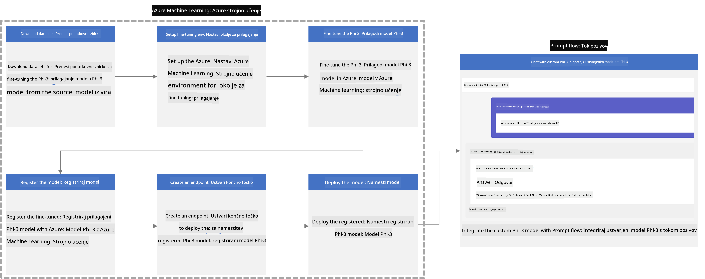

### Table of Contents

1. **[Scenario 1: Azure resources set up karein aura fine-tuning ke taiyaar ho jaayi](../../../../../../md/02.Application/01.TextAndChat/Phi3)**
    - [Azure Machine Learning Workspace banai](../../../../../../md/02.Application/01.TextAndChat/Phi3)
    - [Azure Subscription me GPU quotas ke request kari](../../../../../../md/02.Application/01.TextAndChat/Phi3)
    - [Role assignment jodi](../../../../../../md/02.Application/01.TextAndChat/Phi3)
    - [Project set up kari](../../../../../../md/02.Application/01.TextAndChat/Phi3)
    - [Fine-tuning ke liye dataset taiyaar kari](../../../../../../md/02.Application/01.TextAndChat/Phi3)

1. **[Scenario 2: Phi-3 model ke fine-tune kari aura Azure Machine Learning Studio me deploy kari](../../../../../../md/02.Application/01.TextAndChat/Phi3)**
    - [Azure CLI set up kari](../../../../../../md/02.Application/01.TextAndChat/Phi3)
    - [Phi-3 model ke fine-tune kari](../../../../../../md/02.Application/01.TextAndChat/Phi3)
    - [Fine-tuned model ke deploy kari](../../../../../../md/02.Application/01.TextAndChat/Phi3)

1. **[Scenario 3: Prompt flow ke sath integrate kari aura apne custom model se baat kari](../../../../../../md/02.Application/01.TextAndChat/Phi3)**
    - [Custom Phi-3 model ke Prompt flow ke sath integrate kari](../../../../../../md/02.Application/01.TextAndChat/Phi3)
    - [Apne custom model se baat kari](../../../../../../md/02.Application/01.TextAndChat/Phi3)

## Scenario 1: Azure resources set up kari aura fine-tuning ke taiyaar ho jaayi

### Azure Machine Learning Workspace banai

1. Portal page ke upar ke **search bar** me *azure machine learning* type kari aur jo options aayen, unme se **Azure Machine Learning** chuni.

    

1. Navigation menu se **+ Create** chuni.

1. Navigation menu se **New workspace** chuni.

    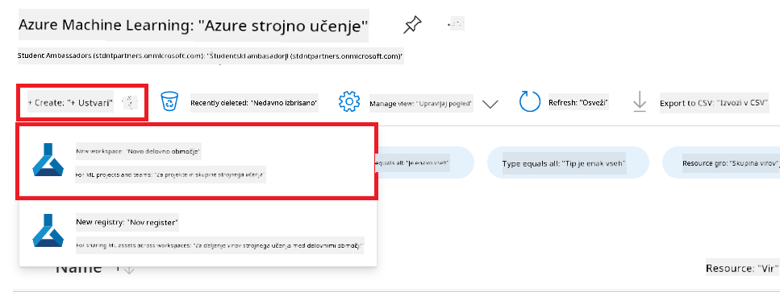

1. Nimn kaam kari:

    - Apna Azure **Subscription** chuni.
    - Istemal ke liye **Resource group** chuni (jarurat par naya banai).
    - **Workspace Name** daali, jo ki unique ho.
    - Apna pasand ke **Region** chuni.
    - Istemal ke liye **Storage account** chuni (jarurat par naya banai).
    - Istemal ke liye **Key vault** chuni (jarurat par naya banai).
    - Istemal ke liye **Application insights** chuni (jarurat par naya banai).
    - Istemal ke liye **Container registry** chuni (jarurat par naya banai).

    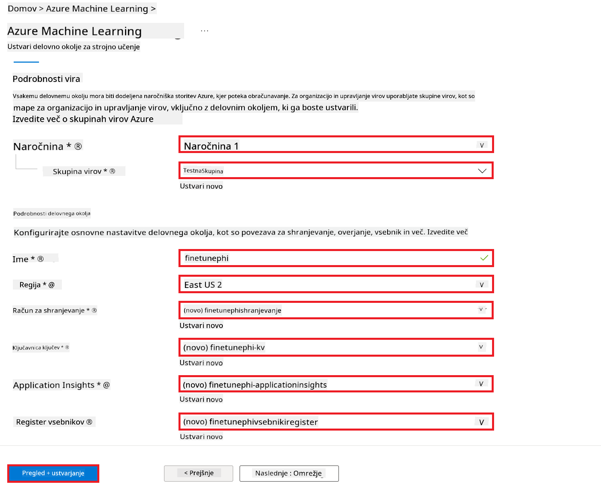

1. **Review + Create** chuni.

1. **Create** chuni.

### Azure Subscription me GPU quotas ke request kari

Is E2E example me, fine-tuning ke liye *Standard_NC24ads_A100_v4 GPU* ke istemal karab, jiske liye quota request karna zaroori ba, aur deployment ke liye *Standard_E4s_v3* CPU ke istemal karab, jiske liye quota request ke jarurat nahi ba.

> [!NOTE]
>
> Keval Pay-As-You-Go subscriptions (standard subscription type) GPU allocation ke liye eligible ba; benefit subscriptions abhi supported nahi ba.
>
> Jo log benefit subscriptions (jaise Visual Studio Enterprise Subscription) use karat ba ya jald se fine-tuning aur deployment process test karna chaht ba, unke liye ee tutorial CPU ke sath minimal dataset pe fine-tuning ke bhi guidance deta. Lekin yaad rahe ki GPU ke sath bada dataset pe fine-tuning ke results kaafi behtar milat ba.

1. [Azure ML Studio](https://ml.azure.com/home?wt.mc_id=studentamb_279723) par jaayi.

1. *Standard NCADSA100v4 Family* quota ke request kare ke liye nimn kaam kari:

    - Baaye taraf ke tab se **Quota** chuni.
    - Jo **Virtual machine family** chahi, uske chuni. Jaise, **Standard NCADSA100v4 Family Cluster Dedicated vCPUs**, jisme *Standard_NC24ads_A100_v4* GPU shamil ba.
    - Navigation menu se **Request quota** chuni.

        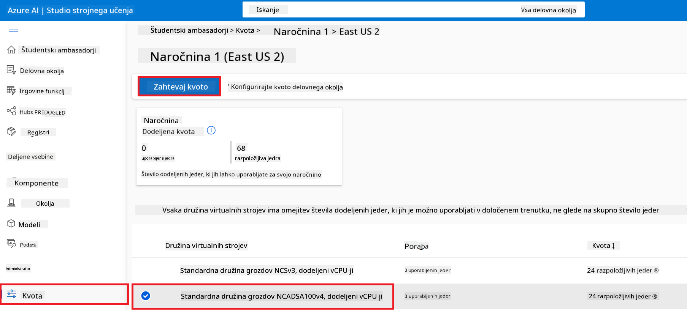

    - Request quota page me, apne jarurat ke mutabiq **New cores limit** daali. Jaise, 24.
    - Request quota page me, **Submit** chuni GPU quota ke liye request bheje ke.

> [!NOTE]
> Apne jarurat ke hisaab se GPU ya CPU chune ke liye [Sizes for Virtual Machines in Azure](https://learn.microsoft.com/azure/virtual-machines/sizes/overview?tabs=breakdownseries%2Cgeneralsizelist%2Ccomputesizelist%2Cmemorysizelist%2Cstoragesizelist%2Cgpusizelist%2Cfpgasizelist%2Chpcsizelist) document dekhi.

### Role assignment jodi

Apne models ke fine-tune aur deploy kare ke pehle, ek User Assigned Managed Identity (UAI) banai aur uske sahi permissions di. Ee UAI deployment ke dauran authentication ke liye istemal hoga.

#### User Assigned Managed Identity (UAI) banai

1. Portal page ke upar ke **search bar** me *managed identities* type kari aur jo options aayen, unme se **Managed Identities** chuni.

    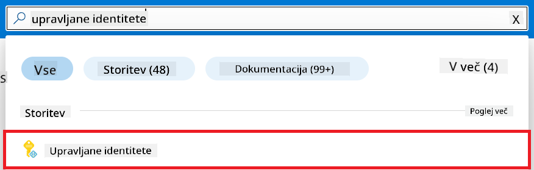

1. **+ Create** chuni.

    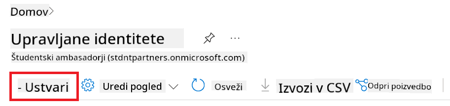

1. Nimn kaam kari:

    - Apna Azure **Subscription** chuni.
    - Istemal ke liye **Resource group** chuni (jarurat par naya banai).
    - Apna pasand ke **Region** chuni.
    - **Name** daali, jo ki unique ho.

1. **Review + create** chuni.

1. **+ Create** chuni.

#### Managed Identity me Contributor role assignment jodi

1. Apne banaye gail Managed Identity resource par jaayi.

1. Baaye taraf ke tab se **Azure role assignments** chuni.

1. Navigation menu se **+Add role assignment** chuni.

1. Add role assignment page me nimn kaam kari:
    - **Scope** ke liye **Resource group** chuni.
    - Apna Azure **Subscription** chuni.
    - Istemal ke liye **Resource group** chuni.
    - **Role** me **Contributor** chuni.

    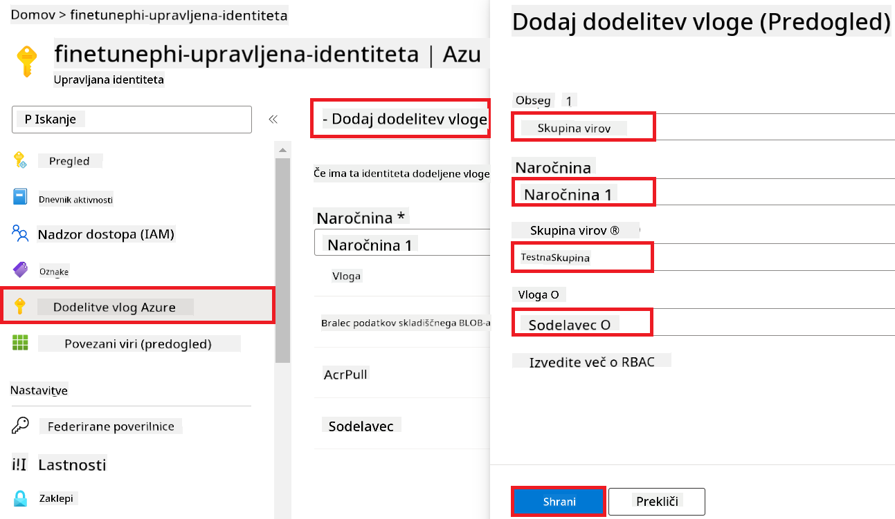

1. **Save** chuni.

#### Managed Identity me Storage Blob Data Reader role assignment jodi

1. Portal page ke upar ke **search bar** me *storage accounts* type kari aur jo options aayen, unme se **Storage accounts** chuni.

    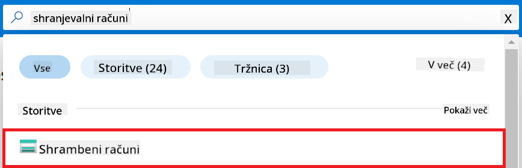

1. Us storage account ke chuni jo apne Azure Machine Learning workspace ke sath juda ba. Jaise, *finetunephistorage*.

1. Nimn kaam kari taaki Add role assignment page tak pahuche:

    - Apne banaye gail Azure Storage account par jaayi.
    - Baaye taraf ke tab se **Access Control (IAM)** chuni.
    - Navigation menu se **+ Add** chuni.
    - Navigation menu se **Add role assignment** chuni.

    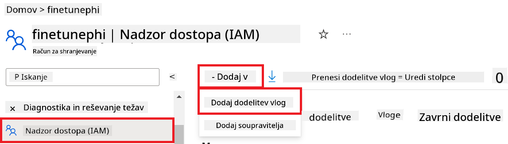

1. Add role assignment page me nimn kaam kari:

    - Role page me, **search bar** me *Storage Blob Data Reader* type kari aur jo options aayen, unme se **Storage Blob Data Reader** chuni.
    - Role page me **Next** chuni.
    - Members page me **Assign access to** me **Managed identity** chuni.
    - Members page me **+ Select members** chuni.
    - Select managed identities page me apna Azure **Subscription** chuni.
    - Select managed identities page me **Managed identity** ke liye **Manage Identity** chuni.
    - Select managed identities page me apne banaye gail Manage Identity chuni. Jaise, *finetunephi-managedidentity*.
    - Select managed identities page me **Select** chuni.

    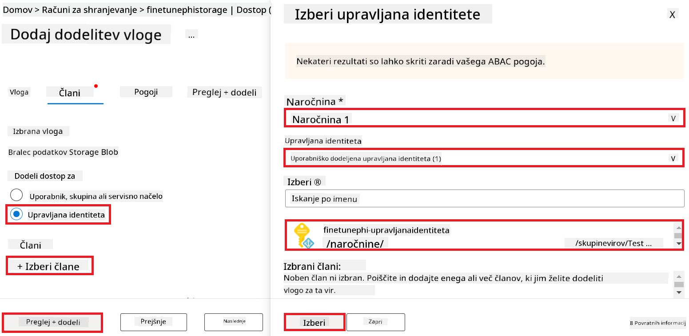

1. **Review + assign** chuni.

#### Managed Identity me AcrPull role assignment jodi

1. Portal page ke upar ke **search bar** me *container registries* type kari aur jo options aayen, unme se **Container registries** chuni.

    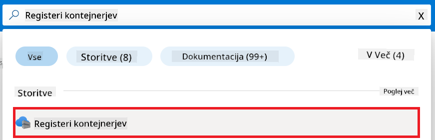

1. Jo container registry apne Azure Machine Learning workspace ke sath juda ba, uske chuni. Jaise, *finetunephicontainerregistries*.

1. Nimn kaam kari taaki Add role assignment page tak pahuche:

    - Baaye taraf ke tab se **Access Control (IAM)** chuni.
    - Navigation menu se **+ Add** chuni.
    - Navigation menu se **Add role assignment** chuni.

1. Add role assignment page me nimn kaam kari:

    - Role page me **search bar** me *AcrPull* type kari aur jo options aayen, unme se **AcrPull** chuni.
    - Role page me **Next** chuni.
    - Members page me **Assign access to** me **Managed identity** chuni.
    - Members page me **+ Select members** chuni.
    - Select managed identities page me apna Azure **Subscription** chuni.
    - Select managed identities page me **Managed identity** ke liye **Manage Identity** chuni.
    - Select managed identities page me apne banaye gail Manage Identity chuni. Jaise, *finetunephi-managedidentity*.
    - Select managed identities page me **Select** chuni.
    - **Review + assign** chuni.

### Project set up kari

Ab, aap ek folder banai jisme kaam karab aur ek virtual environment set up kari jisme aap user ke sath interact kar sake ke program develop karab, jo Azure Cosmos DB me stored chat history ke use karke apne jawab de.

#### Kaam ke liye folder banai

1. Terminal kholi aur nimn command type kari taaki default path me *finetune-phi* naam ke folder ban jaayi.

    ```console
    mkdir finetune-phi
    ```

1. Terminal me nimn command type kari taaki apne banaye gail *finetune-phi* folder me jaa saki.

    ```console
    cd finetune-phi
    ```

#### Virtual environment banai

1. Terminal me nimn command type kari taaki *.venv* naam ke virtual environment ban jaayi.

    ```console
    python -m venv .venv
    ```

1. Terminal me nimn command type kari taaki virtual environment activate ho jaayi.

    ```console
    .venv\Scripts\activate.bat
    ```

> [!NOTE]
>
> Agar sahi se kaam karat ba, to command prompt ke pahile *(.venv)* dikhai dega.

#### Jaruri packages install kari

1. Terminal me nimn command type kari taaki jaruri packages install ho jaayen.

    ```console
    pip install datasets==2.19.1
    pip install transformers==4.41.1
    pip install azure-ai-ml==1.16.0
    pip install torch==2.3.1
    pip install trl==0.9.4
    pip install promptflow==1.12.0
    ```

#### Project files banai

Is exercise me, aap project ke jaruri files banayenge. Ee files me dataset download kare ke script, Azure Machine Learning environment set up kare ke script, Phi-3 model ke fine-tune kare ke script, aur fine-tuned model ke deploy kare ke script shamil ba. Saath hi, fine-tuning environment set up kare ke liye *conda.yml* file bhi banayenge.

Is exercise me aap:

- *download_dataset.py* file banayenge dataset download kare ke liye.
- *setup_ml.py* file banayenge Azure Machine Learning environment set up kare ke liye.
- *finetuning_dir* folder ke andar *fine_tune.py* file banayenge, jisme dataset ke use karke Phi-3 model ke fine-tune karenge.
- *conda.yml* file banayenge fine-tuning environment set up kare ke liye.
- *deploy_model.py* file banayenge fine-tuned model deploy kare ke liye.
- *integrate_with_promptflow.py* file banayenge, jisme fine-tuned model ke Prompt flow ke sath integrate karenge aur model chalayenge.
- *flow.dag.yml* file banayenge, jo Prompt flow ke workflow structure set up karega.
- *config.py* file banayenge, jisme Azure ke information daalenge.

> [!NOTE]
>
> Poora folder structure:
>
> ```text
> └── YourUserName
> .    └── finetune-phi
> .        ├── finetuning_dir
> .        │      └── fine_tune.py
> .        ├── conda.yml
> .        ├── config.py
> .        ├── deploy_model.py
> .        ├── download_dataset.py
> .        ├── flow.dag.yml
> .        ├── integrate_with_promptflow.py
> .        └── setup_ml.py
> ```

1. **Visual Studio Code** kholi.

1. Menu bar me **File** chuni.

1. **Open Folder** chuni.

1. Apne banaye gail *finetune-phi* folder chuni, jo ki *C:\Users\yourUserName\finetune-phi* me ba.

    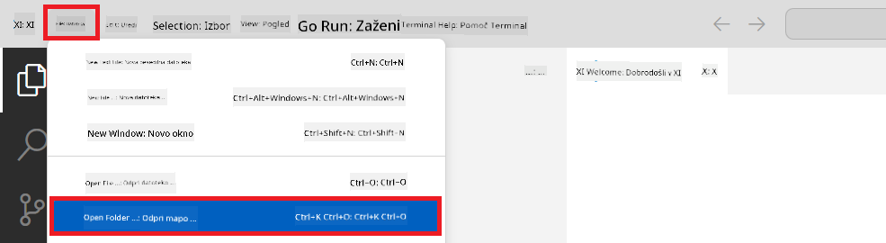

1. Visual Studio Code ke left pane me right-click kari aur **New File** chuni, fir *download_dataset.py* naam ke file banayi.

1. Left pane me right-click kari aur **New File** chuni, fir *setup_ml.py* naam ke file banayi.

1. Left pane me right-click kari aur **New File** chuni, fir *deploy_model.py* naam ke file banayi.

    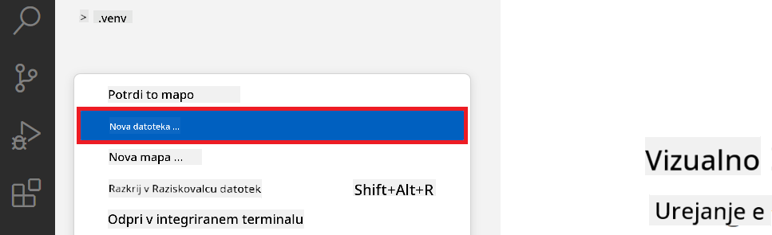

1. Left pane me right-click kari aur **New Folder** chuni, fir *finetuning_dir* naam ke folder banayi.

1. *finetuning_dir* folder ke andar, ek naya file *fine_tune.py* banayi.

#### *conda.yml* file banai aur configure kari

1. Left pane me right-click kari aur **New File** chuni, fir *conda.yml* file banayi.

1. *conda.yml* file me nimn code daali taaki Phi-3 model ke fine-tuning environment set up ho jaayi.

    ```yml
    name: phi-3-training-env
    channels:
      - defaults
      - conda-forge
    dependencies:
      - python=3.10
      - pip
      - numpy<2.0
      - pip:
          - torch==2.4.0
          - torchvision==0.19.0
          - trl==0.8.6
          - transformers==4.41
          - datasets==2.21.0
          - azureml-core==1.57.0
          - azure-storage-blob==12.19.0
          - azure-ai-ml==1.16
          - azure-identity==1.17.1
          - accelerate==0.33.0
          - mlflow==2.15.1
          - azureml-mlflow==1.57.0
    ```

#### *config.py* file banai aur configure kari

1. Left pane me right-click kari aur **New File** chuni, fir *config.py* file banayi.

1. *config.py* file me nimn code daali taaki apna Azure ke information daal saki.

    ```python
    # Azure settings
    AZURE_SUBSCRIPTION_ID = "your_subscription_id"
    AZURE_RESOURCE_GROUP_NAME = "your_resource_group_name" # "TestGroup"

    # Azure Machine Learning settings
    AZURE_ML_WORKSPACE_NAME = "your_workspace_name" # "finetunephi-workspace"

    # Azure Managed Identity settings
    AZURE_MANAGED_IDENTITY_CLIENT_ID = "your_azure_managed_identity_client_id"
    AZURE_MANAGED_IDENTITY_NAME = "your_azure_managed_identity_name" # "finetunephi-mangedidentity"
    AZURE_MANAGED_IDENTITY_RESOURCE_ID = f"/subscriptions/{AZURE_SUBSCRIPTION_ID}/resourceGroups/{AZURE_RESOURCE_GROUP_NAME}/providers/Microsoft.ManagedIdentity/userAssignedIdentities/{AZURE_MANAGED_IDENTITY_NAME}"

    # Dataset file paths
    TRAIN_DATA_PATH = "data/train_data.jsonl"
    TEST_DATA_PATH = "data/test_data.jsonl"

    # Fine-tuned model settings
    AZURE_MODEL_NAME = "your_fine_tuned_model_name" # "finetune-phi-model"
    AZURE_ENDPOINT_NAME = "your_fine_tuned_model_endpoint_name" # "finetune-phi-endpoint"
    AZURE_DEPLOYMENT_NAME = "your_fine_tuned_model_deployment_name" # "finetune-phi-deployment"

    AZURE_ML_API_KEY = "your_fine_tuned_model_api_key"
    AZURE_ML_ENDPOINT = "your_fine_tuned_model_endpoint_uri" # "https://{your-endpoint-name}.{your-region}.inference.ml.azure.com/score"
    ```

#### Azure environment variables jodi

1. Azure Subscription ID jodne ke liye nimn kaam kari:

    - Portal page ke upar ke **search bar** me *subscriptions* type kari aur jo options aayen, unme se **Subscriptions** chuni.
    - Apna jo Azure Subscription chalawat bani, uske chuni.
    - Apna Subscription ID copy kari aur *config.py* file me paste kari.
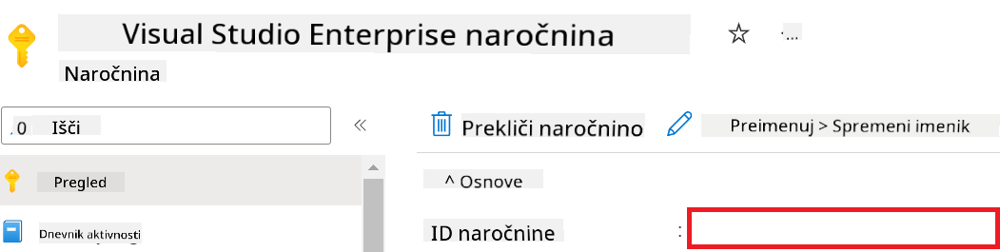

1. سوّ المهام التالية عشان تضيف اسم Azure Workspace:

    - روح لمورد Azure Machine Learning اللي سويته.
    - انسخ والصق اسم حسابك في ملف *config.py*.

    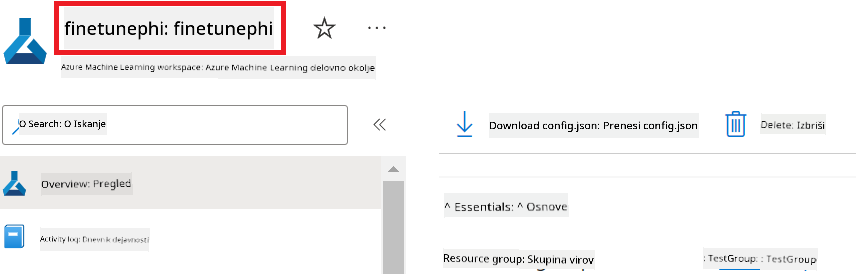

1. سوّ المهام التالية عشان تضيف اسم Azure Resource Group:

    - روح لمورد Azure Machine Learning اللي سويته.
    - انسخ والصق اسم Azure Resource Group في ملف *config.py*.

    

2. سوّ المهام التالية عشان تضيف اسم Azure Managed Identity

    - روح لمورد Managed Identities اللي سويته.
    - انسخ والصق اسم Azure Managed Identity في ملف *config.py*.

    

### جهز مجموعة البيانات للفاين تيونينج

في هذا التمرين، بتشغل ملف *download_dataset.py* عشان تنزل مجموعة بيانات *ULTRACHAT_200k* على جهازك المحلي. بعدها بتستخدم هالمجموعة عشان تفاين تيون نموذج Phi-3 في Azure Machine Learning.

#### نزّل مجموعة البيانات باستخدام *download_dataset.py*

1. افتح ملف *download_dataset.py* في Visual Studio Code.

1. أضف الكود التالي في *download_dataset.py*.

    ```python
    import json
    import os
    from datasets import load_dataset
    from config import (
        TRAIN_DATA_PATH,
        TEST_DATA_PATH)

    def load_and_split_dataset(dataset_name, config_name, split_ratio):
        """
        Load and split a dataset.
        """
        # Load the dataset with the specified name, configuration, and split ratio
        dataset = load_dataset(dataset_name, config_name, split=split_ratio)
        print(f"Original dataset size: {len(dataset)}")
        
        # Split the dataset into train and test sets (80% train, 20% test)
        split_dataset = dataset.train_test_split(test_size=0.2)
        print(f"Train dataset size: {len(split_dataset['train'])}")
        print(f"Test dataset size: {len(split_dataset['test'])}")
        
        return split_dataset

    def save_dataset_to_jsonl(dataset, filepath):
        """
        Save a dataset to a JSONL file.
        """
        # Create the directory if it does not exist
        os.makedirs(os.path.dirname(filepath), exist_ok=True)
        
        # Open the file in write mode
        with open(filepath, 'w', encoding='utf-8') as f:
            # Iterate over each record in the dataset
            for record in dataset:
                # Dump the record as a JSON object and write it to the file
                json.dump(record, f)
                # Write a newline character to separate records
                f.write('\n')
        
        print(f"Dataset saved to {filepath}")

    def main():
        """
        Main function to load, split, and save the dataset.
        """
        # Load and split the ULTRACHAT_200k dataset with a specific configuration and split ratio
        dataset = load_and_split_dataset("HuggingFaceH4/ultrachat_200k", 'default', 'train_sft[:1%]')
        
        # Extract the train and test datasets from the split
        train_dataset = dataset['train']
        test_dataset = dataset['test']

        # Save the train dataset to a JSONL file
        save_dataset_to_jsonl(train_dataset, TRAIN_DATA_PATH)
        
        # Save the test dataset to a separate JSONL file
        save_dataset_to_jsonl(test_dataset, TEST_DATA_PATH)

    if __name__ == "__main__":
        main()

    ```

> [!TIP]
>
> **نصيحة للفاين تيونينج باستخدام مجموعة بيانات صغيرة على CPU**
>
> إذا حاب تستخدم CPU للفاين تيونينج، هالطريقة مناسبة للمشتركين اللي عندهم اشتراكات مميزة (مثل Visual Studio Enterprise Subscription) أو إذا تبي تختبر العملية بسرعة.
>
> بدّل `dataset = load_and_split_dataset("HuggingFaceH4/ultrachat_200k", 'default', 'train_sft[:1%]')` with `dataset = load_and_split_dataset("HuggingFaceH4/ultrachat_200k", 'default', 'train_sft[:10]')`
>

1. اكتب الأمر التالي في التيرمنال عشان تشغل السكريبت وتنزل مجموعة البيانات على جهازك المحلي.

    ```console
    python download_data.py
    ```

1. تأكد إن المجموعات تم حفظها بنجاح في مجلد *finetune-phi/data* على جهازك.

> [!NOTE]
>
> **حجم مجموعة البيانات ووقت الفاين تيونينج**
>
> في هالعينة الكاملة، تستخدم بس 1% من مجموعة البيانات (`train_sft[:1%]`). هالشي يقلل كمية البيانات بشكل كبير، ويسرّع الرفع وعملية الفاين تيونينج. تقدر تعدل النسبة عشان تلاقي التوازن المناسب بين وقت التدريب وأداء النموذج. استخدام جزء صغير من البيانات يقلل وقت الفاين تيونينج، ويخلي العملية أسهل للعينة الكاملة.

## السيناريو 2: فاين تيون نموذج Phi-3 ونشره في Azure Machine Learning Studio

### جهز Azure CLI

لازم تضبط Azure CLI عشان توثق بيئتك. Azure CLI يتيح لك إدارة موارد Azure من خلال سطر الأوامر ويوفر بيانات الاعتماد اللازمة لـ Azure Machine Learning عشان توصل للموارد. للبدء، نزّل [Azure CLI](https://learn.microsoft.com/cli/azure/install-azure-cli)

1. افتح نافذة التيرمنال واكتب الأمر التالي لتسجيل الدخول لحساب Azure.

    ```console
    az login
    ```

1. اختر حساب Azure اللي تبي تستخدمه.

1. اختر اشتراك Azure اللي تبي تستخدمه.

    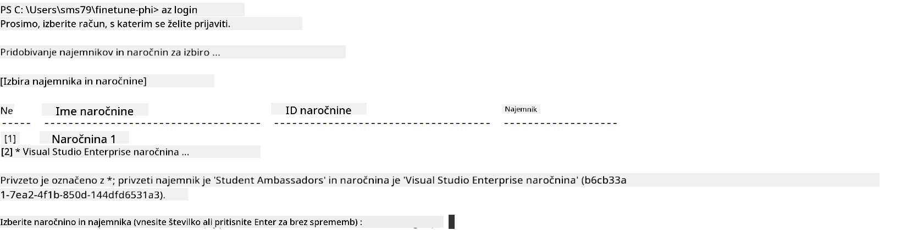

> [!TIP]
>
> إذا واجهت صعوبة في تسجيل الدخول لـ Azure، جرّب تستخدم رمز الجهاز. افتح نافذة تيرمنال واكتب الأمر التالي لتسجيل الدخول:
>
> ```console
> az login --use-device-code
> ```
>

### فاين تيون نموذج Phi-3

في هذا التمرين، بتفان تيون نموذج Phi-3 باستخدام مجموعة البيانات اللي عندك. أول شيء، بتحدد عملية الفاين تيونينج في ملف *fine_tune.py*. بعدها، بتضبط بيئة Azure Machine Learning وتبدأ عملية الفاين تيونينج بتشغيل ملف *setup_ml.py*. هالسكريبت يضمن إن الفاين تيون يصير داخل بيئة Azure Machine Learning.

بتشغيل *setup_ml.py*، بتبدأ عملية الفاين تيونينج في بيئة Azure Machine Learning.

#### أضف الكود في ملف *fine_tune.py*

1. انتقل لمجلد *finetuning_dir* وافتح ملف *fine_tune.py* في Visual Studio Code.

1. أضف الكود التالي في *fine_tune.py*.

    ```python
    import argparse
    import sys
    import logging
    import os
    from datasets import load_dataset
    import torch
    import mlflow
    from transformers import AutoModelForCausalLM, AutoTokenizer, TrainingArguments
    from trl import SFTTrainer

    # To avoid the INVALID_PARAMETER_VALUE error in MLflow, disable MLflow integration
    os.environ["DISABLE_MLFLOW_INTEGRATION"] = "True"

    # Logging setup
    logging.basicConfig(
        format="%(asctime)s - %(levelname)s - %(name)s - %(message)s",
        datefmt="%Y-%m-%d %H:%M:%S",
        handlers=[logging.StreamHandler(sys.stdout)],
        level=logging.WARNING
    )
    logger = logging.getLogger(__name__)

    def initialize_model_and_tokenizer(model_name, model_kwargs):
        """
        Initialize the model and tokenizer with the given pretrained model name and arguments.
        """
        model = AutoModelForCausalLM.from_pretrained(model_name, **model_kwargs)
        tokenizer = AutoTokenizer.from_pretrained(model_name)
        tokenizer.model_max_length = 2048
        tokenizer.pad_token = tokenizer.unk_token
        tokenizer.pad_token_id = tokenizer.convert_tokens_to_ids(tokenizer.pad_token)
        tokenizer.padding_side = 'right'
        return model, tokenizer

    def apply_chat_template(example, tokenizer):
        """
        Apply a chat template to tokenize messages in the example.
        """
        messages = example["messages"]
        if messages[0]["role"] != "system":
            messages.insert(0, {"role": "system", "content": ""})
        example["text"] = tokenizer.apply_chat_template(
            messages, tokenize=False, add_generation_prompt=False
        )
        return example

    def load_and_preprocess_data(train_filepath, test_filepath, tokenizer):
        """
        Load and preprocess the dataset.
        """
        train_dataset = load_dataset('json', data_files=train_filepath, split='train')
        test_dataset = load_dataset('json', data_files=test_filepath, split='train')
        column_names = list(train_dataset.features)

        train_dataset = train_dataset.map(
            apply_chat_template,
            fn_kwargs={"tokenizer": tokenizer},
            num_proc=10,
            remove_columns=column_names,
            desc="Applying chat template to train dataset",
        )

        test_dataset = test_dataset.map(
            apply_chat_template,
            fn_kwargs={"tokenizer": tokenizer},
            num_proc=10,
            remove_columns=column_names,
            desc="Applying chat template to test dataset",
        )

        return train_dataset, test_dataset

    def train_and_evaluate_model(train_dataset, test_dataset, model, tokenizer, output_dir):
        """
        Train and evaluate the model.
        """
        training_args = TrainingArguments(
            bf16=True,
            do_eval=True,
            output_dir=output_dir,
            eval_strategy="epoch",
            learning_rate=5.0e-06,
            logging_steps=20,
            lr_scheduler_type="cosine",
            num_train_epochs=3,
            overwrite_output_dir=True,
            per_device_eval_batch_size=4,
            per_device_train_batch_size=4,
            remove_unused_columns=True,
            save_steps=500,
            seed=0,
            gradient_checkpointing=True,
            gradient_accumulation_steps=1,
            warmup_ratio=0.2,
        )

        trainer = SFTTrainer(
            model=model,
            args=training_args,
            train_dataset=train_dataset,
            eval_dataset=test_dataset,
            max_seq_length=2048,
            dataset_text_field="text",
            tokenizer=tokenizer,
            packing=True
        )

        train_result = trainer.train()
        trainer.log_metrics("train", train_result.metrics)

        mlflow.transformers.log_model(
            transformers_model={"model": trainer.model, "tokenizer": tokenizer},
            artifact_path=output_dir,
        )

        tokenizer.padding_side = 'left'
        eval_metrics = trainer.evaluate()
        eval_metrics["eval_samples"] = len(test_dataset)
        trainer.log_metrics("eval", eval_metrics)

    def main(train_file, eval_file, model_output_dir):
        """
        Main function to fine-tune the model.
        """
        model_kwargs = {
            "use_cache": False,
            "trust_remote_code": True,
            "torch_dtype": torch.bfloat16,
            "device_map": None,
            "attn_implementation": "eager"
        }

        # pretrained_model_name = "microsoft/Phi-3-mini-4k-instruct"
        pretrained_model_name = "microsoft/Phi-3.5-mini-instruct"

        with mlflow.start_run():
            model, tokenizer = initialize_model_and_tokenizer(pretrained_model_name, model_kwargs)
            train_dataset, test_dataset = load_and_preprocess_data(train_file, eval_file, tokenizer)
            train_and_evaluate_model(train_dataset, test_dataset, model, tokenizer, model_output_dir)

    if __name__ == "__main__":
        parser = argparse.ArgumentParser()
        parser.add_argument("--train-file", type=str, required=True, help="Path to the training data")
        parser.add_argument("--eval-file", type=str, required=True, help="Path to the evaluation data")
        parser.add_argument("--model_output_dir", type=str, required=True, help="Directory to save the fine-tuned model")
        args = parser.parse_args()
        main(args.train_file, args.eval_file, args.model_output_dir)

    ```

1. احفظ واغلق ملف *fine_tune.py*.

> [!TIP]
> **تقدر تفاين تيون نموذج Phi-3.5**
>
> في ملف *fine_tune.py*، تقدر تغيّر حقل `pretrained_model_name` from `"microsoft/Phi-3-mini-4k-instruct"` to any model you want to fine-tune. For example, if you change it to `"microsoft/Phi-3.5-mini-instruct"`, you'll be using the Phi-3.5-mini-instruct model for fine-tuning. To find and use the model name you prefer, visit [Hugging Face](https://huggingface.co/), search for the model you're interested in, and then copy and paste its name into the `pretrained_model_name` في السكريبت حقك.
>
> :::image type="content" source="../../imgs/03/FineTuning-PromptFlow/finetunephi3.5.png" alt-text="فاين تيون Phi-3.5.":::
>

#### أضف الكود في ملف *setup_ml.py*

1. افتح ملف *setup_ml.py* في Visual Studio Code.

1. أضف الكود التالي في *setup_ml.py*.

    ```python
    import logging
    from azure.ai.ml import MLClient, command, Input
    from azure.ai.ml.entities import Environment, AmlCompute
    from azure.identity import AzureCliCredential
    from config import (
        AZURE_SUBSCRIPTION_ID,
        AZURE_RESOURCE_GROUP_NAME,
        AZURE_ML_WORKSPACE_NAME,
        TRAIN_DATA_PATH,
        TEST_DATA_PATH
    )

    # Constants

    # Uncomment the following lines to use a CPU instance for training
    # COMPUTE_INSTANCE_TYPE = "Standard_E16s_v3" # cpu
    # COMPUTE_NAME = "cpu-e16s-v3"
    # DOCKER_IMAGE_NAME = "mcr.microsoft.com/azureml/openmpi4.1.0-ubuntu20.04:latest"

    # Uncomment the following lines to use a GPU instance for training
    COMPUTE_INSTANCE_TYPE = "Standard_NC24ads_A100_v4"
    COMPUTE_NAME = "gpu-nc24s-a100-v4"
    DOCKER_IMAGE_NAME = "mcr.microsoft.com/azureml/curated/acft-hf-nlp-gpu:59"

    CONDA_FILE = "conda.yml"
    LOCATION = "eastus2" # Replace with the location of your compute cluster
    FINETUNING_DIR = "./finetuning_dir" # Path to the fine-tuning script
    TRAINING_ENV_NAME = "phi-3-training-environment" # Name of the training environment
    MODEL_OUTPUT_DIR = "./model_output" # Path to the model output directory in azure ml

    # Logging setup to track the process
    logger = logging.getLogger(__name__)
    logging.basicConfig(
        format="%(asctime)s - %(levelname)s - %(name)s - %(message)s",
        datefmt="%Y-%m-%d %H:%M:%S",
        level=logging.WARNING
    )

    def get_ml_client():
        """
        Initialize the ML Client using Azure CLI credentials.
        """
        credential = AzureCliCredential()
        return MLClient(credential, AZURE_SUBSCRIPTION_ID, AZURE_RESOURCE_GROUP_NAME, AZURE_ML_WORKSPACE_NAME)

    def create_or_get_environment(ml_client):
        """
        Create or update the training environment in Azure ML.
        """
        env = Environment(
            image=DOCKER_IMAGE_NAME,  # Docker image for the environment
            conda_file=CONDA_FILE,  # Conda environment file
            name=TRAINING_ENV_NAME,  # Name of the environment
        )
        return ml_client.environments.create_or_update(env)

    def create_or_get_compute_cluster(ml_client, compute_name, COMPUTE_INSTANCE_TYPE, location):
        """
        Create or update the compute cluster in Azure ML.
        """
        try:
            compute_cluster = ml_client.compute.get(compute_name)
            logger.info(f"Compute cluster '{compute_name}' already exists. Reusing it for the current run.")
        except Exception:
            logger.info(f"Compute cluster '{compute_name}' does not exist. Creating a new one with size {COMPUTE_INSTANCE_TYPE}.")
            compute_cluster = AmlCompute(
                name=compute_name,
                size=COMPUTE_INSTANCE_TYPE,
                location=location,
                tier="Dedicated",  # Tier of the compute cluster
                min_instances=0,  # Minimum number of instances
                max_instances=1  # Maximum number of instances
            )
            ml_client.compute.begin_create_or_update(compute_cluster).wait()  # Wait for the cluster to be created
        return compute_cluster

    def create_fine_tuning_job(env, compute_name):
        """
        Set up the fine-tuning job in Azure ML.
        """
        return command(
            code=FINETUNING_DIR,  # Path to fine_tune.py
            command=(
                "python fine_tune.py "
                "--train-file ${{inputs.train_file}} "
                "--eval-file ${{inputs.eval_file}} "
                "--model_output_dir ${{inputs.model_output}}"
            ),
            environment=env,  # Training environment
            compute=compute_name,  # Compute cluster to use
            inputs={
                "train_file": Input(type="uri_file", path=TRAIN_DATA_PATH),  # Path to the training data file
                "eval_file": Input(type="uri_file", path=TEST_DATA_PATH),  # Path to the evaluation data file
                "model_output": MODEL_OUTPUT_DIR
            }
        )

    def main():
        """
        Main function to set up and run the fine-tuning job in Azure ML.
        """
        # Initialize ML Client
        ml_client = get_ml_client()

        # Create Environment
        env = create_or_get_environment(ml_client)
        
        # Create or get existing compute cluster
        create_or_get_compute_cluster(ml_client, COMPUTE_NAME, COMPUTE_INSTANCE_TYPE, LOCATION)

        # Create and Submit Fine-Tuning Job
        job = create_fine_tuning_job(env, COMPUTE_NAME)
        returned_job = ml_client.jobs.create_or_update(job)  # Submit the job
        ml_client.jobs.stream(returned_job.name)  # Stream the job logs
        
        # Capture the job name
        job_name = returned_job.name
        print(f"Job name: {job_name}")

    if __name__ == "__main__":
        main()

    ```

1. استبدل `COMPUTE_INSTANCE_TYPE`, `COMPUTE_NAME`, and `LOCATION` بتفاصيلك الخاصة.

    ```python
   # Uncomment the following lines to use a GPU instance for training
    COMPUTE_INSTANCE_TYPE = "Standard_NC24ads_A100_v4"
    COMPUTE_NAME = "gpu-nc24s-a100-v4"
    ...
    LOCATION = "eastus2" # Replace with the location of your compute cluster
    ```

> [!TIP]
>
> **نصيحة للفاين تيونينج باستخدام مجموعة بيانات صغيرة على CPU**
>
> إذا تبي تستخدم CPU للفاين تيونينج، هالطريقة مناسبة للمشتركين اللي عندهم اشتراكات مميزة (مثل Visual Studio Enterprise Subscription) أو إذا تبي تختبر العملية بسرعة.
>
> 1. افتح ملف *setup_ml*.
> 1. استبدل `COMPUTE_INSTANCE_TYPE`, `COMPUTE_NAME`, and `DOCKER_IMAGE_NAME` with the following. If you do not have access to *Standard_E16s_v3*, you can use an equivalent CPU instance or request a new quota.
> 1. Replace `LOCATION` بتفاصيلك الخاصة.
>
>    ```python
>    # Uncomment the following lines to use a CPU instance for training
>    COMPUTE_INSTANCE_TYPE = "Standard_E16s_v3" # cpu
>    COMPUTE_NAME = "cpu-e16s-v3"
>    DOCKER_IMAGE_NAME = "mcr.microsoft.com/azureml/openmpi4.1.0-ubuntu20.04:latest"
>    LOCATION = "eastus2" # Replace with the location of your compute cluster
>    ```
>

1. اكتب الأمر التالي لتشغيل سكريبت *setup_ml.py* وبدء عملية الفاين تيونينج في Azure Machine Learning.

    ```python
    python setup_ml.py
    ```

1. في هذا التمرين، نجحت في فاين تيون نموذج Phi-3 باستخدام Azure Machine Learning. بتشغيل سكريبت *setup_ml.py*، ضبطت بيئة Azure Machine Learning وبدأت عملية الفاين تيونينج اللي عرّفتها في ملف *fine_tune.py*. لاحظ إن عملية الفاين تيونينج ممكن تاخذ وقت طويل. بعد تشغيل الأمر `python setup_ml.py` command, you need to wait for the process to complete. You can monitor the status of the fine-tuning job by following the link provided in the terminal to the Azure Machine Learning portal.

    

### Deploy the fine-tuned model

To integrate the fine-tuned Phi-3 model with Prompt Flow, you need to deploy the model to make it accessible for real-time inference. This process involves registering the model, creating an online endpoint, and deploying the model.

#### Set the model name, endpoint name, and deployment name for deployment

1. Open *config.py* file.

1. Replace `AZURE_MODEL_NAME = "your_fine_tuned_model_name"` with the desired name for your model.

1. Replace `AZURE_ENDPOINT_NAME = "your_fine_tuned_model_endpoint_name"` with the desired name for your endpoint.

1. Replace `AZURE_DEPLOYMENT_NAME = "your_fine_tuned_model_deployment_name"` استخدم الاسم اللي تبيه للنشر.

#### أضف الكود في ملف *deploy_model.py*

تشغيل ملف *deploy_model.py* يسهّل عملية النشر كاملة. يسجل النموذج، ينشئ نقطة نهاية، وينفذ النشر بناءً على الإعدادات في ملف config.py، اللي يشمل اسم النموذج، اسم نقطة النهاية، واسم النشر.

1. افتح ملف *deploy_model.py* في Visual Studio Code.

1. أضف الكود التالي في *deploy_model.py*.

    ```python
    import logging
    from azure.identity import AzureCliCredential
    from azure.ai.ml import MLClient
    from azure.ai.ml.entities import Model, ProbeSettings, ManagedOnlineEndpoint, ManagedOnlineDeployment, IdentityConfiguration, ManagedIdentityConfiguration, OnlineRequestSettings
    from azure.ai.ml.constants import AssetTypes

    # Configuration imports
    from config import (
        AZURE_SUBSCRIPTION_ID,
        AZURE_RESOURCE_GROUP_NAME,
        AZURE_ML_WORKSPACE_NAME,
        AZURE_MANAGED_IDENTITY_RESOURCE_ID,
        AZURE_MANAGED_IDENTITY_CLIENT_ID,
        AZURE_MODEL_NAME,
        AZURE_ENDPOINT_NAME,
        AZURE_DEPLOYMENT_NAME
    )

    # Constants
    JOB_NAME = "your-job-name"
    COMPUTE_INSTANCE_TYPE = "Standard_E4s_v3"

    deployment_env_vars = {
        "SUBSCRIPTION_ID": AZURE_SUBSCRIPTION_ID,
        "RESOURCE_GROUP_NAME": AZURE_RESOURCE_GROUP_NAME,
        "UAI_CLIENT_ID": AZURE_MANAGED_IDENTITY_CLIENT_ID,
    }

    # Logging setup
    logging.basicConfig(
        format="%(asctime)s - %(levelname)s - %(name)s - %(message)s",
        datefmt="%Y-%m-%d %H:%M:%S",
        level=logging.DEBUG
    )
    logger = logging.getLogger(__name__)

    def get_ml_client():
        """Initialize and return the ML Client."""
        credential = AzureCliCredential()
        return MLClient(credential, AZURE_SUBSCRIPTION_ID, AZURE_RESOURCE_GROUP_NAME, AZURE_ML_WORKSPACE_NAME)

    def register_model(ml_client, model_name, job_name):
        """Register a new model."""
        model_path = f"azureml://jobs/{job_name}/outputs/artifacts/paths/model_output"
        logger.info(f"Registering model {model_name} from job {job_name} at path {model_path}.")
        run_model = Model(
            path=model_path,
            name=model_name,
            description="Model created from run.",
            type=AssetTypes.MLFLOW_MODEL,
        )
        model = ml_client.models.create_or_update(run_model)
        logger.info(f"Registered model ID: {model.id}")
        return model

    def delete_existing_endpoint(ml_client, endpoint_name):
        """Delete existing endpoint if it exists."""
        try:
            endpoint_result = ml_client.online_endpoints.get(name=endpoint_name)
            logger.info(f"Deleting existing endpoint {endpoint_name}.")
            ml_client.online_endpoints.begin_delete(name=endpoint_name).result()
            logger.info(f"Deleted existing endpoint {endpoint_name}.")
        except Exception as e:
            logger.info(f"No existing endpoint {endpoint_name} found to delete: {e}")

    def create_or_update_endpoint(ml_client, endpoint_name, description=""):
        """Create or update an endpoint."""
        delete_existing_endpoint(ml_client, endpoint_name)
        logger.info(f"Creating new endpoint {endpoint_name}.")
        endpoint = ManagedOnlineEndpoint(
            name=endpoint_name,
            description=description,
            identity=IdentityConfiguration(
                type="user_assigned",
                user_assigned_identities=[ManagedIdentityConfiguration(resource_id=AZURE_MANAGED_IDENTITY_RESOURCE_ID)]
            )
        )
        endpoint_result = ml_client.online_endpoints.begin_create_or_update(endpoint).result()
        logger.info(f"Created new endpoint {endpoint_name}.")
        return endpoint_result

    def create_or_update_deployment(ml_client, endpoint_name, deployment_name, model):
        """Create or update a deployment."""

        logger.info(f"Creating deployment {deployment_name} for endpoint {endpoint_name}.")
        deployment = ManagedOnlineDeployment(
            name=deployment_name,
            endpoint_name=endpoint_name,
            model=model.id,
            instance_type=COMPUTE_INSTANCE_TYPE,
            instance_count=1,
            environment_variables=deployment_env_vars,
            request_settings=OnlineRequestSettings(
                max_concurrent_requests_per_instance=3,
                request_timeout_ms=180000,
                max_queue_wait_ms=120000
            ),
            liveness_probe=ProbeSettings(
                failure_threshold=30,
                success_threshold=1,
                period=100,
                initial_delay=500,
            ),
            readiness_probe=ProbeSettings(
                failure_threshold=30,
                success_threshold=1,
                period=100,
                initial_delay=500,
            ),
        )
        deployment_result = ml_client.online_deployments.begin_create_or_update(deployment).result()
        logger.info(f"Created deployment {deployment.name} for endpoint {endpoint_name}.")
        return deployment_result

    def set_traffic_to_deployment(ml_client, endpoint_name, deployment_name):
        """Set traffic to the specified deployment."""
        try:
            # Fetch the current endpoint details
            endpoint = ml_client.online_endpoints.get(name=endpoint_name)
            
            # Log the current traffic allocation for debugging
            logger.info(f"Current traffic allocation: {endpoint.traffic}")
            
            # Set the traffic allocation for the deployment
            endpoint.traffic = {deployment_name: 100}
            
            # Update the endpoint with the new traffic allocation
            endpoint_poller = ml_client.online_endpoints.begin_create_or_update(endpoint)
            updated_endpoint = endpoint_poller.result()
            
            # Log the updated traffic allocation for debugging
            logger.info(f"Updated traffic allocation: {updated_endpoint.traffic}")
            logger.info(f"Set traffic to deployment {deployment_name} at endpoint {endpoint_name}.")
            return updated_endpoint
        except Exception as e:
            # Log any errors that occur during the process
            logger.error(f"Failed to set traffic to deployment: {e}")
            raise


    def main():
        ml_client = get_ml_client()

        registered_model = register_model(ml_client, AZURE_MODEL_NAME, JOB_NAME)
        logger.info(f"Registered model ID: {registered_model.id}")

        endpoint = create_or_update_endpoint(ml_client, AZURE_ENDPOINT_NAME, "Endpoint for finetuned Phi-3 model")
        logger.info(f"Endpoint {AZURE_ENDPOINT_NAME} is ready.")

        try:
            deployment = create_or_update_deployment(ml_client, AZURE_ENDPOINT_NAME, AZURE_DEPLOYMENT_NAME, registered_model)
            logger.info(f"Deployment {AZURE_DEPLOYMENT_NAME} is created for endpoint {AZURE_ENDPOINT_NAME}.")

            set_traffic_to_deployment(ml_client, AZURE_ENDPOINT_NAME, AZURE_DEPLOYMENT_NAME)
            logger.info(f"Traffic is set to deployment {AZURE_DEPLOYMENT_NAME} at endpoint {AZURE_ENDPOINT_NAME}.")
        except Exception as e:
            logger.error(f"Failed to create or update deployment: {e}")

    if __name__ == "__main__":
        main()

    ```

1. سوّ المهام التالية عشان تحدد `JOB_NAME`:

    - Navigate to Azure Machine Learning resource that you created.
    - Select **Studio web URL** to open the Azure Machine Learning workspace.
    - Select **Jobs** from the left side tab.
    - Select the experiment for fine-tuning. For example, *finetunephi*.
    - Select the job that you created.
    - Copy and paste your job Name into the `JOB_NAME = "your-job-name"` in *deploy_model.py* file.

1. Replace `COMPUTE_INSTANCE_TYPE` بتفاصيلك الخاصة.

1. اكتب الأمر التالي لتشغيل سكريبت *deploy_model.py* وبدء عملية النشر في Azure Machine Learning.

    ```python
    python deploy_model.py
    ```

> [!WARNING]
> عشان تتجنب رسوم إضافية على حسابك، تأكد من حذف نقطة النهاية اللي أنشأتها في Azure Machine Learning workspace.
>

#### راجع حالة النشر في Azure Machine Learning Workspace

1. زور [Azure ML Studio](https://ml.azure.com/home?wt.mc_id=studentamb_279723).

1. ادخل على Azure Machine Learning workspace اللي سويته.

1. اختر **Studio web URL** عشان تفتح Azure Machine Learning workspace.

1. اختر **Endpoints** من القائمة الجانبية.

    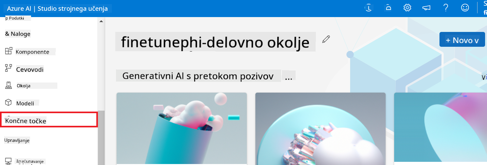

2. اختر نقطة النهاية اللي أنشأتها.

    

3. في هالصفحة، تقدر تدير نقاط النهاية اللي تم إنشاؤها أثناء عملية النشر.

## السيناريو 3: دمج مع Prompt flow والدردشة مع نموذجك المخصص

### دمج نموذج Phi-3 المخصص مع Prompt flow

بعد ما نشرت نموذجك المفاين تيون بنجاح، تقدر الآن تدمجه مع Prompt flow عشان تستخدم نموذجك في تطبيقات الوقت الحقيقي، مما يتيح لك تنفيذ مهام تفاعلية متنوعة مع نموذج Phi-3 المخصص.

#### اضبط مفتاح api و URI نقطة النهاية لنموذج Phi-3 المفاين تيون

1. ادخل على Azure Machine Learning workspace اللي سويته.
1. اختر **Endpoints** من القائمة الجانبية.
1. اختر نقطة النهاية اللي أنشأتها.
1. اختر **Consume** من قائمة التنقل.
1. انسخ والصق **REST endpoint** في ملف *config.py*، واستبدل `AZURE_ML_ENDPOINT = "your_fine_tuned_model_endpoint_uri"` with your **REST endpoint**.
1. Copy and paste your **Primary key** into the *config.py* file, replacing `AZURE_ML_API_KEY = "your_fine_tuned_model_api_key"` بالمفتاح الأساسي (**Primary key**).

    

#### أضف الكود في ملف *flow.dag.yml*

1. افتح ملف *flow.dag.yml* في Visual Studio Code.

1. أضف الكود التالي في *flow.dag.yml*.

    ```yml
    inputs:
      input_data:
        type: string
        default: "Who founded Microsoft?"

    outputs:
      answer:
        type: string
        reference: ${integrate_with_promptflow.output}

    nodes:
    - name: integrate_with_promptflow
      type: python
      source:
        type: code
        path: integrate_with_promptflow.py
      inputs:
        input_data: ${inputs.input_data}
    ```

#### أضف الكود في ملف *integrate_with_promptflow.py*

1. افتح ملف *integrate_with_promptflow.py* في Visual Studio Code.

1. أضف الكود التالي في *integrate_with_promptflow.py*.

    ```python
    import logging
    import requests
    from promptflow.core import tool
    import asyncio
    import platform
    from config import (
        AZURE_ML_ENDPOINT,
        AZURE_ML_API_KEY
    )

    # Logging setup
    logging.basicConfig(
        format="%(asctime)s - %(levelname)s - %(name)s - %(message)s",
        datefmt="%Y-%m-%d %H:%M:%S",
        level=logging.DEBUG
    )
    logger = logging.getLogger(__name__)

    def query_azml_endpoint(input_data: list, endpoint_url: str, api_key: str) -> str:
        """
        Send a request to the Azure ML endpoint with the given input data.
        """
        headers = {
            "Content-Type": "application/json",
            "Authorization": f"Bearer {api_key}"
        }
        data = {
            "input_data": [input_data],
            "params": {
                "temperature": 0.7,
                "max_new_tokens": 128,
                "do_sample": True,
                "return_full_text": True
            }
        }
        try:
            response = requests.post(endpoint_url, json=data, headers=headers)
            response.raise_for_status()
            result = response.json()[0]
            logger.info("Successfully received response from Azure ML Endpoint.")
            return result
        except requests.exceptions.RequestException as e:
            logger.error(f"Error querying Azure ML Endpoint: {e}")
            raise

    def setup_asyncio_policy():
        """
        Setup asyncio event loop policy for Windows.
        """
        if platform.system() == 'Windows':
            asyncio.set_event_loop_policy(asyncio.WindowsSelectorEventLoopPolicy())
            logger.info("Set Windows asyncio event loop policy.")

    @tool
    def my_python_tool(input_data: str) -> str:
        """
        Tool function to process input data and query the Azure ML endpoint.
        """
        setup_asyncio_policy()
        return query_azml_endpoint(input_data, AZURE_ML_ENDPOINT, AZURE_ML_API_KEY)

    ```

### دردش مع نموذجك المخصص

1. اكتب الأمر التالي لتشغيل سكريبت *deploy_model.py* وبدء عملية النشر في Azure Machine Learning.

    ```python
    pf flow serve --source ./ --port 8080 --host localhost
    ```

1. هذا مثال للنتائج: الحين تقدر تدردش مع نموذج Phi-3 المخصص. يُنصح تسأل أسئلة مبنية على البيانات اللي استخدمتها في الفاين تيونينج.

    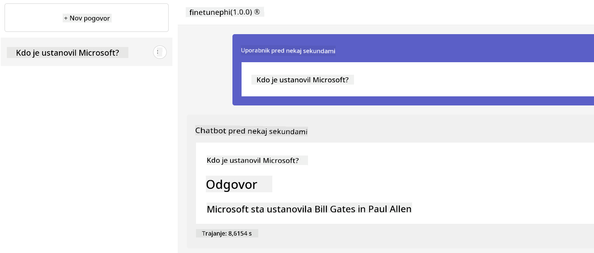

**Omejitev odgovornosti**:  
Ta dokument je bil preveden z uporabo AI prevajalske storitve [Co-op Translator](https://github.com/Azure/co-op-translator). Čeprav si prizadevamo za natančnost, upoštevajte, da lahko avtomatizirani prevodi vsebujejo napake ali netočnosti. Izvirni dokument v njegovem izvirnem jeziku naj se šteje za avtoritativni vir. Za ključne informacije priporočamo strokovni človeški prevod. Za morebitne nesporazume ali napačne interpretacije, ki izhajajo iz uporabe tega prevoda, ne odgovarjamo.