<!--
CO_OP_TRANSLATOR_METADATA:
{
  "original_hash": "ecbd9179a21edbaafaf114d47f09f3e3",
  "translation_date": "2025-07-17T02:02:13+00:00",
  "source_file": "md/02.Application/01.TextAndChat/Phi3/E2E_Phi-3-FineTuning_PromptFlow_Integration_AIFoundry.md",
  "language_code": "sl"
}
-->
# Prilagodite in integrirajte lastne modele Phi-3 s Prompt flow v Azure AI Foundry

Ta celovit (E2E) primer temelji na vodiču "[Fine-Tune and Integrate Custom Phi-3 Models with Prompt Flow in Azure AI Foundry](https://techcommunity.microsoft.com/t5/educator-developer-blog/fine-tune-and-integrate-custom-phi-3-models-with-prompt-flow-in/ba-p/4191726?WT.mc_id=aiml-137032-kinfeylo)" iz Microsoft Tech Community. Predstavlja postopke prilagajanja, nameščanja in integracije lastnih modelov Phi-3 s Prompt flow v Azure AI Foundry. Za razliko od E2E primera "[Fine-Tune and Integrate Custom Phi-3 Models with Prompt Flow](./E2E_Phi-3-FineTuning_PromptFlow_Integration.md)", ki je vključeval lokalno izvajanje kode, se ta vodič osredotoča izključno na prilagajanje in integracijo vašega modela znotraj Azure AI / ML Studia.

## Pregled

V tem E2E primeru se boste naučili, kako prilagoditi model Phi-3 in ga integrirati s Prompt flow v Azure AI Foundry. Z uporabo Azure AI / ML Studia boste vzpostavili potek dela za nameščanje in uporabo lastnih AI modelov. Ta E2E primer je razdeljen na tri scenarije:

**Scenarij 1: Nastavitev Azure virov in priprava na prilagajanje**

**Scenarij 2: Prilagoditev modela Phi-3 in nameščanje v Azure Machine Learning Studio**

**Scenarij 3: Integracija s Prompt flow in pogovor z vašim lastnim modelom v Azure AI Foundry**

Tukaj je pregled tega E2E primera.

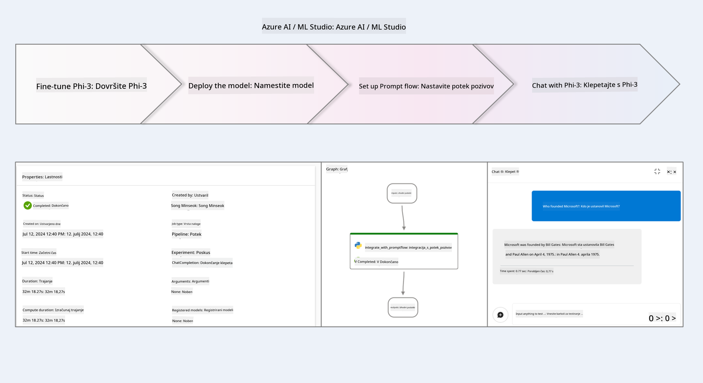

### Kazalo

1. **[Scenarij 1: Nastavitev Azure virov in priprava na prilagajanje](../../../../../../md/02.Application/01.TextAndChat/Phi3)**
    - [Ustvarite Azure Machine Learning Workspace](../../../../../../md/02.Application/01.TextAndChat/Phi3)
    - [Zahtevajte GPU kvote v Azure naročnini](../../../../../../md/02.Application/01.TextAndChat/Phi3)
    - [Dodajte dodelitev vlog](../../../../../../md/02.Application/01.TextAndChat/Phi3)
    - [Nastavite projekt](../../../../../../md/02.Application/01.TextAndChat/Phi3)
    - [Pripravite podatkovni niz za prilagajanje](../../../../../../md/02.Application/01.TextAndChat/Phi3)

1. **[Scenarij 2: Prilagodite model Phi-3 in ga namestite v Azure Machine Learning Studio](../../../../../../md/02.Application/01.TextAndChat/Phi3)**
    - [Prilagodite model Phi-3](../../../../../../md/02.Application/01.TextAndChat/Phi3)
    - [Namestite prilagojeni model Phi-3](../../../../../../md/02.Application/01.TextAndChat/Phi3)

1. **[Scenarij 3: Integrirajte s Prompt flow in se pogovarjajte z vašim lastnim modelom v Azure AI Foundry](../../../../../../md/02.Application/01.TextAndChat/Phi3)**
    - [Integrirajte lastni model Phi-3 s Prompt flow](../../../../../../md/02.Application/01.TextAndChat/Phi3)
    - [Pogovarjajte se z vašim lastnim modelom Phi-3](../../../../../../md/02.Application/01.TextAndChat/Phi3)

## Scenarij 1: Nastavitev Azure virov in priprava na prilagajanje

### Ustvarite Azure Machine Learning Workspace

1. V iskalno vrstico na vrhu portala vpišite *azure machine learning* in izberite **Azure Machine Learning** med prikazanimi možnostmi.

    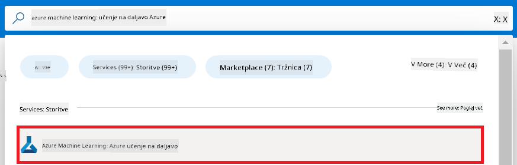

2. Izberite **+ Create** v navigacijskem meniju.

3. Izberite **New workspace** v navigacijskem meniju.

    

4. Izvedite naslednje korake:

    - Izberite vašo Azure **Subscription**.
    - Izberite **Resource group**, ki jo želite uporabiti (po potrebi ustvarite novo).
    - Vnesite **Workspace Name**. Mora biti edinstveno ime.
    - Izberite **Region**, ki ga želite uporabiti.
    - Izberite **Storage account**, ki ga želite uporabiti (po potrebi ustvarite novega).
    - Izberite **Key vault**, ki ga želite uporabiti (po potrebi ustvarite novega).
    - Izberite **Application insights**, ki ga želite uporabiti (po potrebi ustvarite novega).
    - Izberite **Container registry**, ki ga želite uporabiti (po potrebi ustvarite novega).

    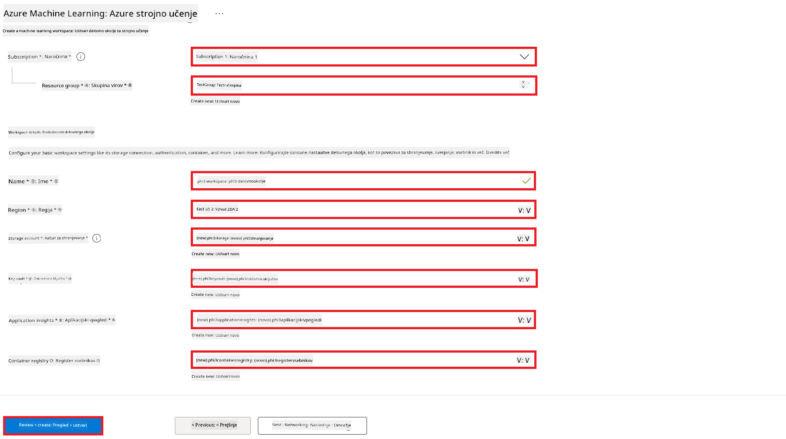

5. Izberite **Review + Create**.

6. Izberite **Create**.

### Zahtevajte GPU kvote v Azure naročnini

V tem vodiču se boste naučili, kako prilagoditi in namestiti model Phi-3 z uporabo GPU-jev. Za prilagajanje boste uporabili GPU *Standard_NC24ads_A100_v4*, za katerega je potrebna zahteva za kvoto. Za nameščanje boste uporabili GPU *Standard_NC6s_v3*, ki prav tako zahteva zahtevo za kvoto.

> [!NOTE]
>
> GPU dodelitev je na voljo samo za naročnine Pay-As-You-Go (standardni tip naročnine); naročnine z ugodnostmi trenutno niso podprte.
>

1. Obiščite [Azure ML Studio](https://ml.azure.com/home?wt.mc_id=studentamb_279723).

1. Izvedite naslednje korake za zahtevo kvote *Standard NCADSA100v4 Family*:

    - Izberite **Quota** v levem zavihku.
    - Izberite **Virtual machine family**, ki jo želite uporabiti. Na primer, izberite **Standard NCADSA100v4 Family Cluster Dedicated vCPUs**, ki vključuje GPU *Standard_NC24ads_A100_v4*.
    - Izberite **Request quota** v navigacijskem meniju.

        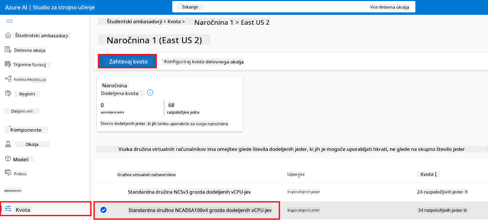

    - Na strani Request quota vnesite **New cores limit**, ki ga želite uporabiti. Na primer, 24.
    - Na strani Request quota izberite **Submit** za oddajo zahteve za GPU kvoto.

1. Izvedite naslednje korake za zahtevo kvote *Standard NCSv3 Family*:

    - Izberite **Quota** v levem zavihku.
    - Izberite **Virtual machine family**, ki jo želite uporabiti. Na primer, izberite **Standard NCSv3 Family Cluster Dedicated vCPUs**, ki vključuje GPU *Standard_NC6s_v3*.
    - Izberite **Request quota** v navigacijskem meniju.
    - Na strani Request quota vnesite **New cores limit**, ki ga želite uporabiti. Na primer, 24.
    - Na strani Request quota izberite **Submit** za oddajo zahteve za GPU kvoto.

### Dodajte dodelitev vlog

Za prilagajanje in nameščanje modelov morate najprej ustvariti User Assigned Managed Identity (UAI) in ji dodeliti ustrezna dovoljenja. Ta UAI bo uporabljena za preverjanje pristnosti med nameščanjem.

#### Ustvarite User Assigned Managed Identity (UAI)

1. V iskalno vrstico na vrhu portala vpišite *managed identities* in izberite **Managed Identities** med prikazanimi možnostmi.

    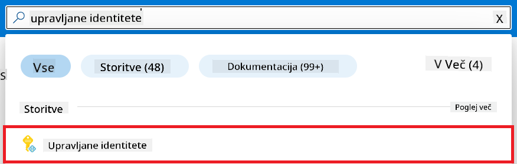

1. Izberite **+ Create**.

    

1. Izvedite naslednje korake:

    - Izberite vašo Azure **Subscription**.
    - Izberite **Resource group**, ki jo želite uporabiti (po potrebi ustvarite novo).
    - Izberite **Region**, ki ga želite uporabiti.
    - Vnesite **Name**. Mora biti edinstveno ime.

    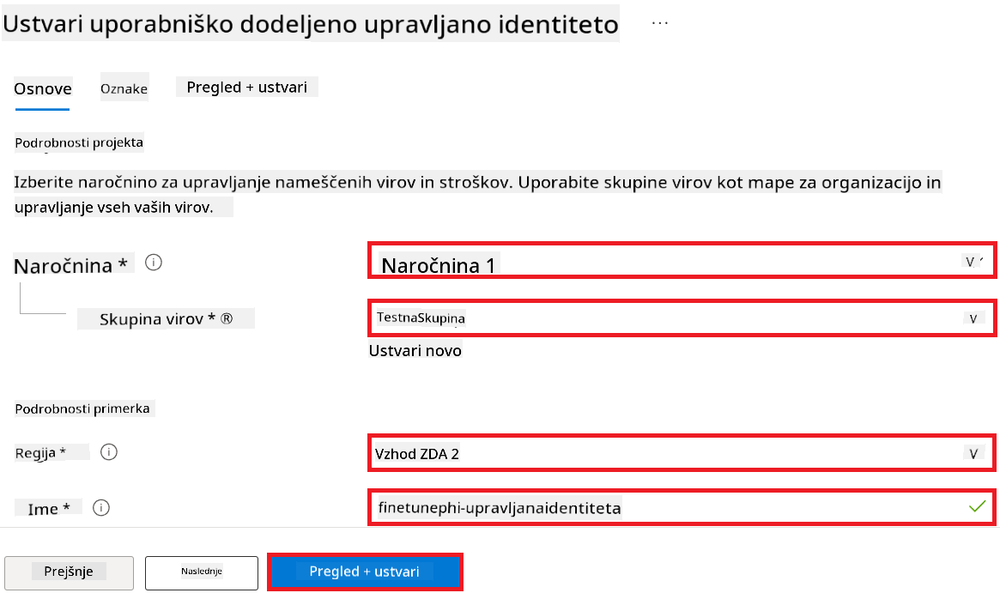

1. Izberite **Review + create**.

1. Izberite **+ Create**.

#### Dodajte dodelitev vloge Contributor Managed Identity

1. Pomaknite se do vira Managed Identity, ki ste ga ustvarili.

1. Izberite **Azure role assignments** v levem zavihku.

1. Izberite **+Add role assignment** v navigacijskem meniju.

1. Na strani Add role assignment izvedite naslednje korake:
    - Izberite **Scope** na **Resource group**.
    - Izberite vašo Azure **Subscription**.
    - Izberite **Resource group**, ki jo želite uporabiti.
    - Izberite vlogo **Contributor**.

    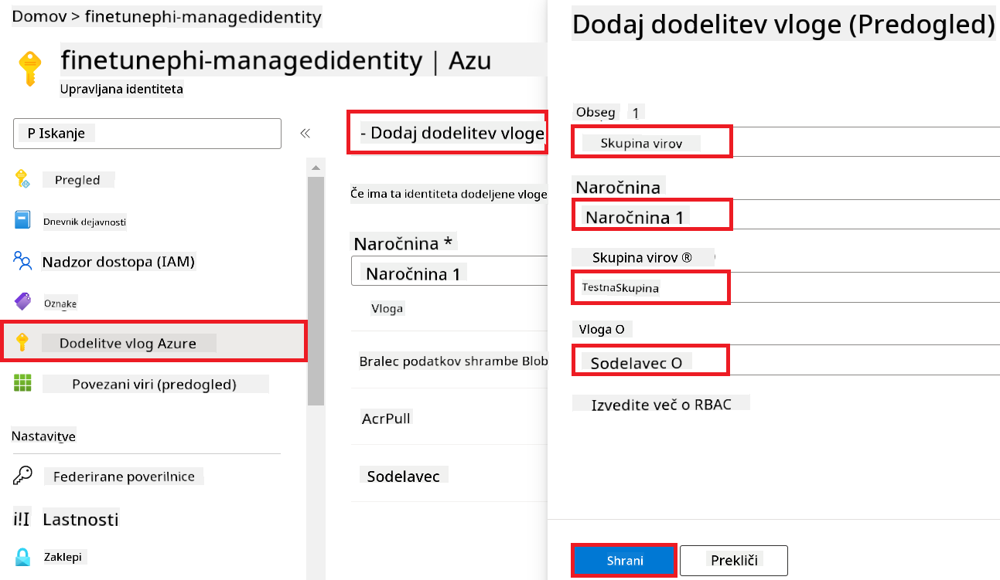

2. Izberite **Save**.

#### Dodajte dodelitev vloge Storage Blob Data Reader Managed Identity

1. V iskalno vrstico na vrhu portala vpišite *storage accounts* in izberite **Storage accounts** med prikazanimi možnostmi.

    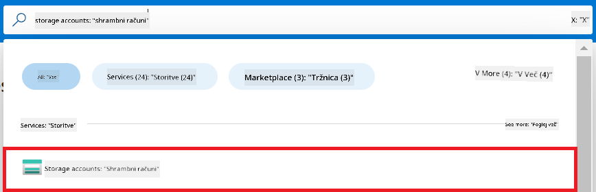

1. Izberite račun za shranjevanje, povezan z Azure Machine Learning workspace, ki ste ga ustvarili. Na primer, *finetunephistorage*.

1. Izvedite naslednje korake za dostop do strani Add role assignment:

    - Pomaknite se do Azure Storage računa, ki ste ga ustvarili.
    - Izberite **Access Control (IAM)** v levem zavihku.
    - Izberite **+ Add** v navigacijskem meniju.
    - Izberite **Add role assignment** v navigacijskem meniju.

    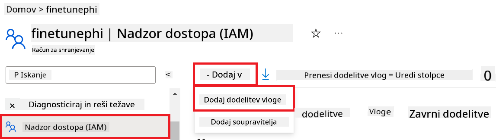

1. Na strani Add role assignment izvedite naslednje korake:

    - V iskalno vrstico na strani Role vpišite *Storage Blob Data Reader* in izberite **Storage Blob Data Reader** med prikazanimi možnostmi.
    - Izberite **Next**.
    - Na strani Members izberite **Assign access to** **Managed identity**.
    - Izberite **+ Select members**.
    - Na strani Select managed identities izberite vašo Azure **Subscription**.
    - Izberite **Managed identity** kot **Manage Identity**.
    - Izberite Manage Identity, ki ste jo ustvarili. Na primer, *finetunephi-managedidentity*.
    - Izberite **Select**.

    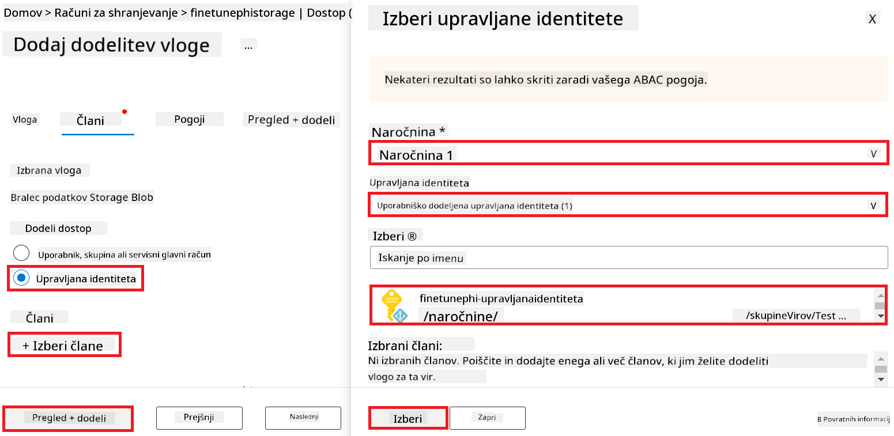

1. Izberite **Review + assign**.

#### Dodajte dodelitev vloge AcrPull Managed Identity

1. V iskalno vrstico na vrhu portala vpišite *container registries* in izberite **Container registries** med prikazanimi možnostmi.

    

1. Izberite container registry, povezan z Azure Machine Learning workspace. Na primer, *finetunephicontainerregistry*

1. Izvedite naslednje korake za dostop do strani Add role assignment:

    - Izberite **Access Control (IAM)** v levem zavihku.
    - Izberite **+ Add** v navigacijskem meniju.
    - Izberite **Add role assignment** v navigacijskem meniju.

1. Na strani Add role assignment izvedite naslednje korake:

    - V iskalno vrstico na strani Role vpišite *AcrPull* in izberite **AcrPull** med prikazanimi možnostmi.
    - Izberite **Next**.
    - Na strani Members izberite **Assign access to** **Managed identity**.
    - Izberite **+ Select members**.
    - Na strani Select managed identities izberite vašo Azure **Subscription**.
    - Izberite **Managed identity** kot **Manage Identity**.
    - Izberite Manage Identity, ki ste jo ustvarili. Na primer, *finetunephi-managedidentity*.
    - Izberite **Select**.
    - Izberite **Review + assign**.

### Nastavite projekt

Za prenos podatkovnih nizov, potrebnih za prilagajanje, boste nastavili lokalno okolje.

V tej vaji boste:

- Ustvarili mapo za delo.
- Ustvarili virtualno okolje.
- Namestili potrebne pakete.
- Ustvarili datoteko *download_dataset.py* za prenos podatkovnega niza.

#### Ustvarite mapo za delo

1. Odprite terminal in vnesite naslednji ukaz za ustvarjanje mape z imenom *finetune-phi* na privzeti poti.

    ```console
    mkdir finetune-phi
    ```

2. V terminalu vnesite naslednji ukaz, da se premaknete v mapo *finetune-phi*, ki ste jo ustvarili.
#### Ustvari virtualno okolje

1. V terminal vpiši naslednji ukaz za ustvarjanje virtualnega okolja z imenom *.venv*.

    ```console
    python -m venv .venv
    ```

2. V terminal vpiši naslednji ukaz za aktivacijo virtualnega okolja.

    ```console
    .venv\Scripts\activate.bat
    ```


> [!NOTE]
> Če je uspelo, bi moral pred pozivom ukazne vrstice videti *(.venv)*.

#### Namesti potrebne pakete

1. V terminal vpiši naslednje ukaze za namestitev potrebnih paketov.

    ```console
    pip install datasets==2.19.1
    ```

#### Ustvari `download_dataset.py`

> [!NOTE]
> Celotna struktura mape:
>
> ```text
> └── YourUserName
> .    └── finetune-phi
> .        └── download_dataset.py
> ```

1. Odpri **Visual Studio Code**.

1. Izberi **File** v menijski vrstici.

1. Izberi **Open Folder**.

1. Izberi mapo *finetune-phi*, ki si jo ustvaril, in se nahaja na *C:\Users\yourUserName\finetune-phi*.

    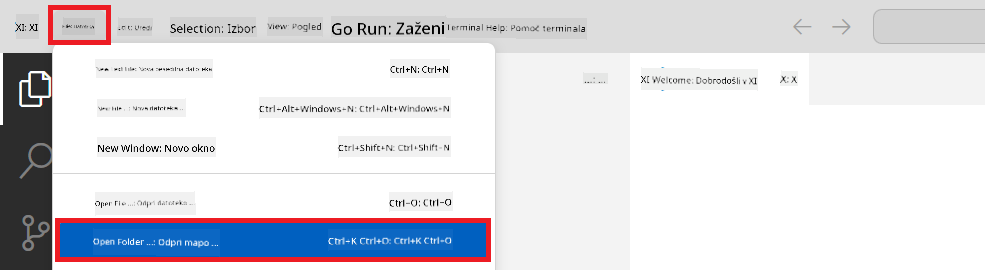

1. V levem delu Visual Studio Code z desnim klikom izberi **New File** za ustvarjanje nove datoteke z imenom *download_dataset.py*.

    

### Priprava podatkov za fino nastavljanje

V tej vaji boš zagnal datoteko *download_dataset.py*, da preneseš *ultrachat_200k* podatkovne zbirke v lokalno okolje. Nato boš te podatke uporabil za fino nastavljanje modela Phi-3 v Azure Machine Learning.

V tej vaji boš:

- Dodal kodo v datoteko *download_dataset.py* za prenos podatkovnih zbirk.
- Zagnal datoteko *download_dataset.py* za prenos podatkovnih zbirk v lokalno okolje.

#### Prenesi svojo podatkovno zbirko z uporabo *download_dataset.py*

1. Odpri datoteko *download_dataset.py* v Visual Studio Code.

1. V datoteko *download_dataset.py* dodaj naslednjo kodo.

    ```python
    import json
    import os
    from datasets import load_dataset

    def load_and_split_dataset(dataset_name, config_name, split_ratio):
        """
        Load and split a dataset.
        """
        # Load the dataset with the specified name, configuration, and split ratio
        dataset = load_dataset(dataset_name, config_name, split=split_ratio)
        print(f"Original dataset size: {len(dataset)}")
        
        # Split the dataset into train and test sets (80% train, 20% test)
        split_dataset = dataset.train_test_split(test_size=0.2)
        print(f"Train dataset size: {len(split_dataset['train'])}")
        print(f"Test dataset size: {len(split_dataset['test'])}")
        
        return split_dataset

    def save_dataset_to_jsonl(dataset, filepath):
        """
        Save a dataset to a JSONL file.
        """
        # Create the directory if it does not exist
        os.makedirs(os.path.dirname(filepath), exist_ok=True)
        
        # Open the file in write mode
        with open(filepath, 'w', encoding='utf-8') as f:
            # Iterate over each record in the dataset
            for record in dataset:
                # Dump the record as a JSON object and write it to the file
                json.dump(record, f)
                # Write a newline character to separate records
                f.write('\n')
        
        print(f"Dataset saved to {filepath}")

    def main():
        """
        Main function to load, split, and save the dataset.
        """
        # Load and split the ULTRACHAT_200k dataset with a specific configuration and split ratio
        dataset = load_and_split_dataset("HuggingFaceH4/ultrachat_200k", 'default', 'train_sft[:1%]')
        
        # Extract the train and test datasets from the split
        train_dataset = dataset['train']
        test_dataset = dataset['test']

        # Save the train dataset to a JSONL file
        save_dataset_to_jsonl(train_dataset, "data/train_data.jsonl")
        
        # Save the test dataset to a separate JSONL file
        save_dataset_to_jsonl(test_dataset, "data/test_data.jsonl")

    if __name__ == "__main__":
        main()

    ```

1. V terminal vpiši naslednji ukaz za zagon skripte in prenos podatkovne zbirke v lokalno okolje.

    ```console
    python download_dataset.py
    ```

1. Preveri, da so bile podatkovne zbirke uspešno shranjene v lokalno mapo *finetune-phi/data*.

> [!NOTE]
>
> #### Opomba o velikosti podatkovne zbirke in času fino nastavljanja
>
> V tem vodiču uporabljaš le 1 % podatkovne zbirke (`split='train[:1%]'`). To znatno zmanjša količino podatkov, kar pospeši tako nalaganje kot tudi proces fino nastavljanja. Procent lahko prilagodiš, da najdeš pravo ravnovesje med časom učenja in zmogljivostjo modela. Uporaba manjše podmnožice podatkov zmanjša čas, potreben za fino nastavljanje, kar proces naredi bolj obvladljiv za ta vodič.

## Scenarij 2: Fino nastavi model Phi-3 in ga razporedi v Azure Machine Learning Studio

### Fino nastavi model Phi-3

V tej vaji boš fino nastavil model Phi-3 v Azure Machine Learning Studio.

V tej vaji boš:

- Ustvaril računalniški grozd za fino nastavljanje.
- Fino nastavil model Phi-3 v Azure Machine Learning Studio.

#### Ustvari računalniški grozd za fino nastavljanje

1. Obišči [Azure ML Studio](https://ml.azure.com/home?wt.mc_id=studentamb_279723).

1. Izberi **Compute** v levem zavihku.

1. Izberi **Compute clusters** v navigacijskem meniju.

1. Izberi **+ New**.

    

1. Izvedi naslednje korake:

    - Izberi **Region**, ki ga želiš uporabiti.
    - Izberi **Virtual machine tier** na **Dedicated**.
    - Izberi **Virtual machine type** na **GPU**.
    - Filtriraj **Virtual machine size** na **Select from all options**.
    - Izberi **Virtual machine size** na **Standard_NC24ads_A100_v4**.

    

1. Izberi **Next**.

1. Izvedi naslednje korake:

    - Vnesi **Compute name**. Mora biti unikatno ime.
    - Nastavi **Minimum number of nodes** na **0**.
    - Nastavi **Maximum number of nodes** na **1**.
    - Nastavi **Idle seconds before scale down** na **120**.

    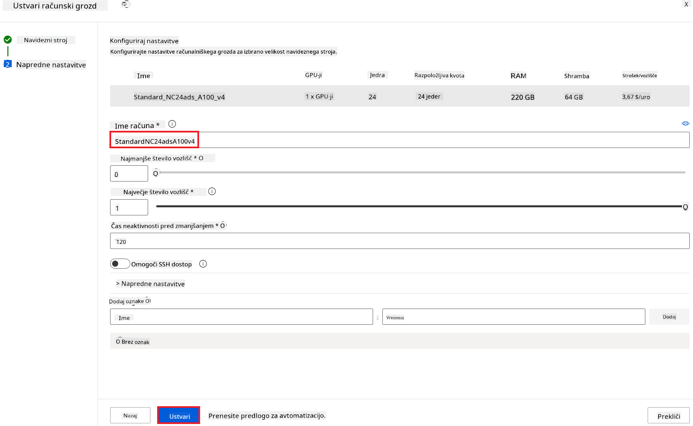

1. Izberi **Create**.

#### Fino nastavi model Phi-3

1. Obišči [Azure ML Studio](https://ml.azure.com/home?wt.mc_id=studentamb_279723).

1. Izberi Azure Machine Learning delovno okolje, ki si ga ustvaril.

    

1. Izvedi naslednje korake:

    - Izberi **Model catalog** v levem zavihku.
    - V iskalno polje vpiši *phi-3-mini-4k* in izberite **Phi-3-mini-4k-instruct** iz prikazanih možnosti.

    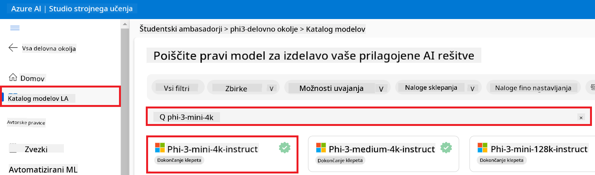

1. Izberi **Fine-tune** v navigacijskem meniju.

    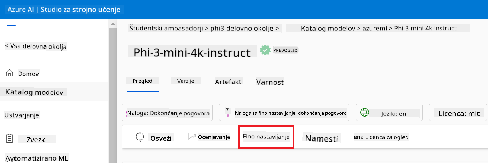

1. Izvedi naslednje korake:

    - Izberi **Select task type** na **Chat completion**.
    - Izberi **+ Select data** za nalaganje **Traning data**.
    - Izberi način nalaganja validacijskih podatkov na **Provide different validation data**.
    - Izberi **+ Select data** za nalaganje **Validation data**.

    

    > [!TIP]
    >
    > Lahko izbereš **Advanced settings** za prilagoditev nastavitev, kot so **learning_rate** in **lr_scheduler_type**, da optimiziraš proces fino nastavljanja glede na svoje potrebe.

1. Izberi **Finish**.

1. V tej vaji si uspešno fino nastavil model Phi-3 z uporabo Azure Machine Learning. Upoštevaj, da lahko proces fino nastavljanja traja precej časa. Po zagonu naloge za fino nastavljanje moraš počakati, da se zaključi. Status naloge lahko spremljaš v zavihku Jobs na levi strani tvojega Azure Machine Learning delovnega okolja. V naslednjem sklopu boš razporedil fino nastavljeni model in ga integriral s Prompt flow.

    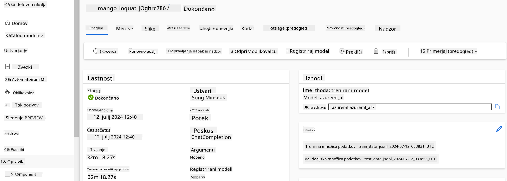

### Razporedi fino nastavljeni model Phi-3

Za integracijo fino nastavljenega modela Phi-3 s Prompt flow moraš model razporediti, da bo dostopen za realnočasovno napovedovanje. Ta postopek vključuje registracijo modela, ustvarjanje spletne končne točke in razporeditev modela.

V tej vaji boš:

- Registriral fino nastavljeni model v Azure Machine Learning delovnem okolju.
- Ustvaril spletno končno točko.
- Razporedil registrirani fino nastavljeni model Phi-3.

#### Registriraj fino nastavljeni model

1. Obišči [Azure ML Studio](https://ml.azure.com/home?wt.mc_id=studentamb_279723).

1. Izberi Azure Machine Learning delovno okolje, ki si ga ustvaril.

    

1. Izberi **Models** v levem zavihku.

1. Izberi **+ Register**.

1. Izberi **From a job output**.

    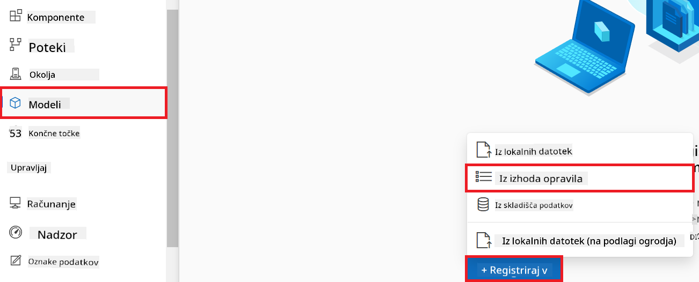

1. Izberi nalogo, ki si jo ustvaril.

    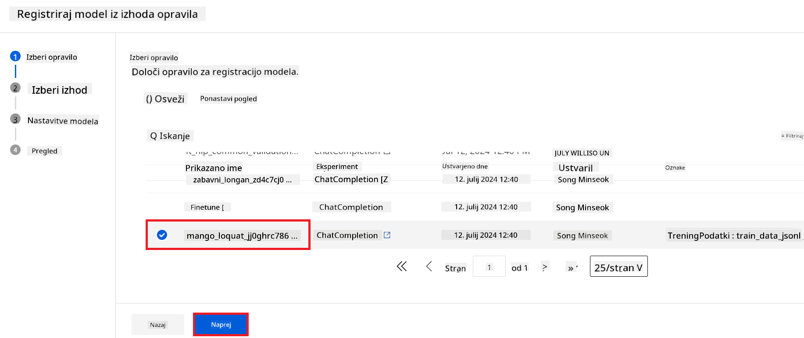

1. Izberi **Next**.

1. Izberi **Model type** na **MLflow**.

1. Preveri, da je izbran **Job output**; to bi moralo biti samodejno izbrano.

    

2. Izberi **Next**.

3. Izberi **Register**.

    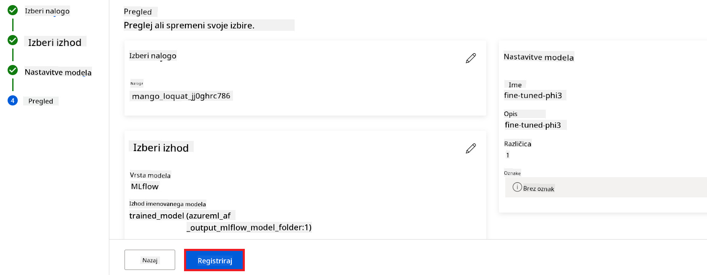

4. Registrirani model si lahko ogledaš v meniju **Models** v levem zavihku.

    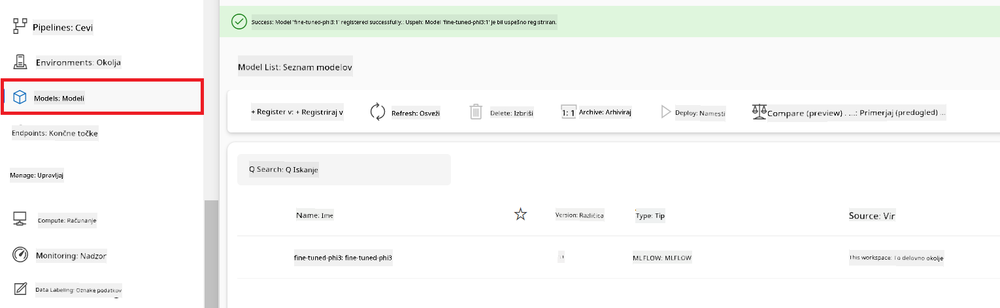

#### Razporedi fino nastavljeni model

1. Pojdi v Azure Machine Learning delovno okolje, ki si ga ustvaril.

1. Izberi **Endpoints** v levem zavihku.

1. Izberi **Real-time endpoints** v navigacijskem meniju.

    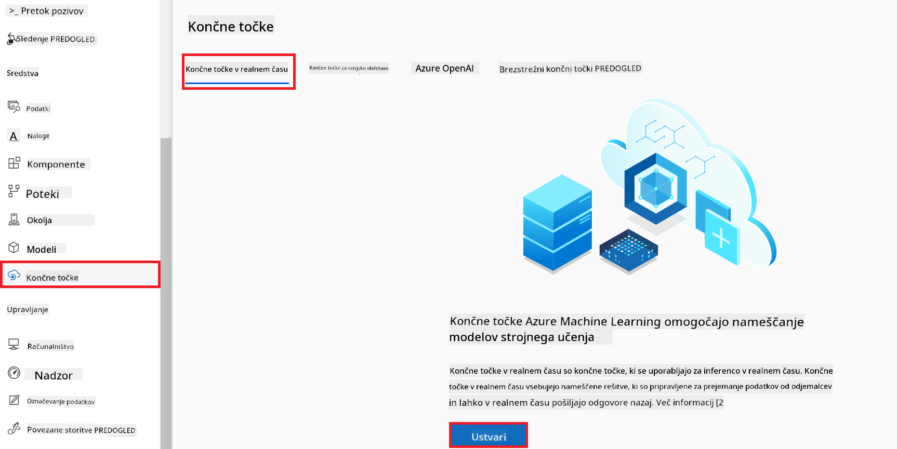

1. Izberi **Create**.

1. Izberi registrirani model, ki si ga ustvaril.

    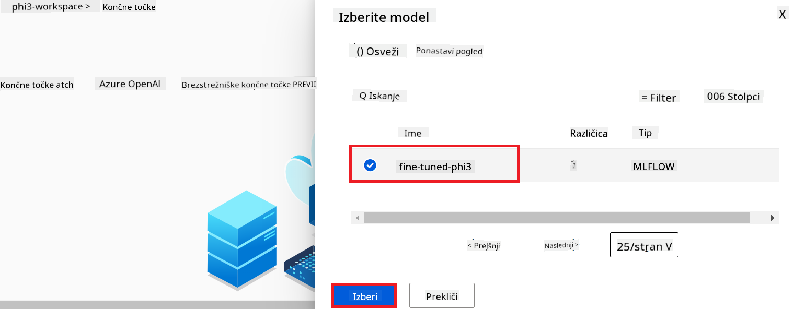

1. Izberi **Select**.

1. Izvedi naslednje korake:

    - Izberi **Virtual machine** na *Standard_NC6s_v3*.
    - Nastavi **Instance count** po želji, na primer *1*.
    - Izberi **Endpoint** na **New** za ustvarjanje nove končne točke.
    - Vnesi **Endpoint name**. Mora biti unikatno ime.
    - Vnesi **Deployment name**. Mora biti unikatno ime.

    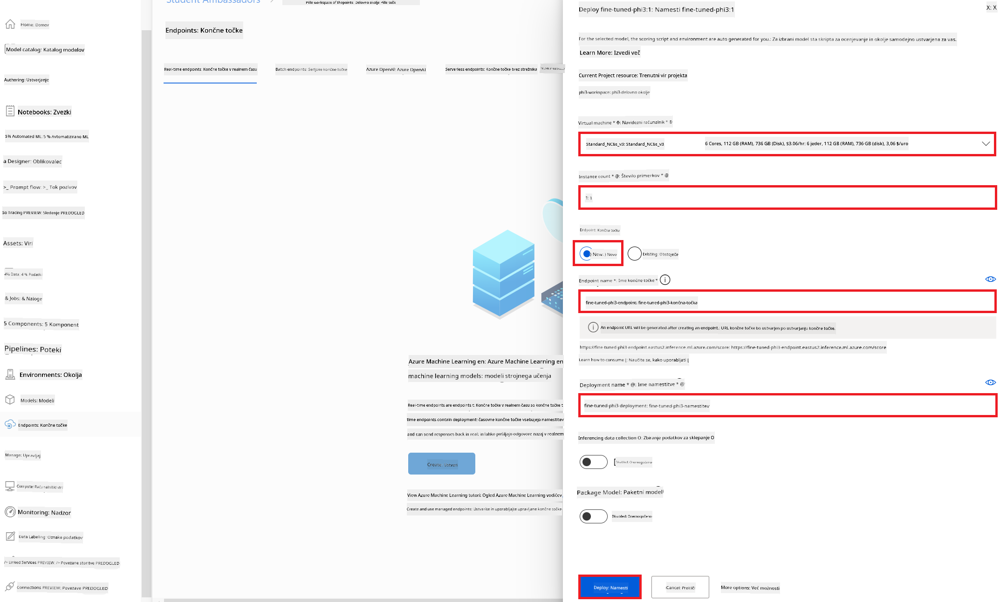

1. Izberi **Deploy**.

> [!WARNING]
> Da se izogneš dodatnim stroškom na svojem računu, poskrbi, da boš po uporabi izbrisal ustvarjeno končno točko v Azure Machine Learning delovnem okolju.
>

#### Preveri status razporeditve v Azure Machine Learning delovnem okolju

1. Pojdi v Azure Machine Learning delovno okolje, ki si ga ustvaril.

1. Izberi **Endpoints** v levem zavihku.

1. Izberi končno točko, ki si jo ustvaril.

    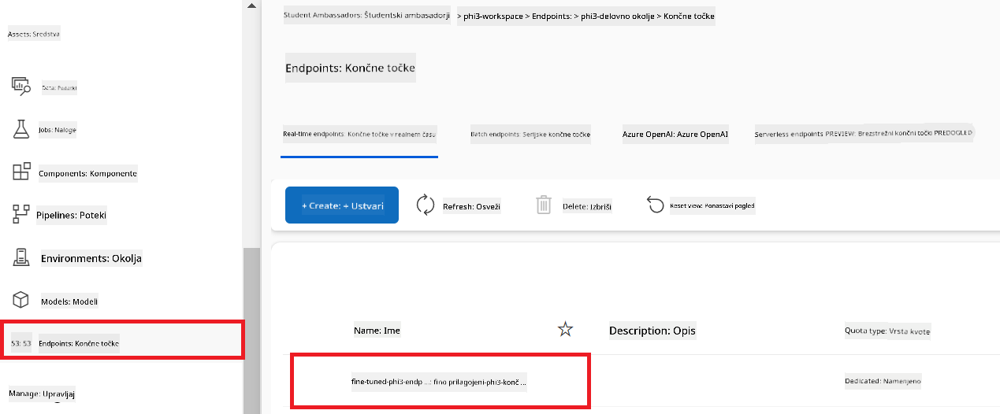

1. Na tej strani lahko upravljaš končne točke med procesom razporeditve.

> [!NOTE]
> Ko je razporeditev končana, preveri, da je **Live traffic** nastavljen na **100 %**. Če ni, izberi **Update traffic** za prilagoditev nastavitev prometa. Upoštevaj, da modela ne moreš testirati, če je promet nastavljen na 0 %.
>
> 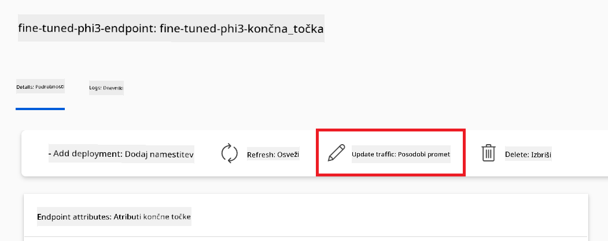
>

## Scenarij 3: Integracija s Prompt flow in pogovor s svojim prilagojenim modelom v Azure AI Foundry

### Integriraj prilagojeni model Phi-3 s Prompt flow

Po uspešni razporeditvi fino nastavljenega modela ga lahko zdaj integriraš s Prompt Flow, da boš lahko model uporabljal v realnočasovnih aplikacijah, kar omogoča različne interaktivne naloge s tvojim prilagojenim modelom Phi-3.

V tej vaji boš:

- Ustvaril Azure AI Foundry Hub.
- Ustvaril Azure AI Foundry projekt.
- Ustvaril Prompt flow.
- Dodal prilagojeno povezavo za fino nastavljeni model Phi-3.
- Nastavil Prompt flow za pogovor s svojim prilagojenim modelom Phi-3.
> [!NOTE]
> Integracijo lahko izvedete tudi s Promptflow v Azure ML Studio. Enak postopek integracije velja za Azure ML Studio.
#### Ustvarite Azure AI Foundry Hub

Preden ustvarite projekt, morate ustvariti Hub. Hub deluje kot Resource Group, ki vam omogoča organizacijo in upravljanje več projektov znotraj Azure AI Foundry.

1. Obiščite [Azure AI Foundry](https://ai.azure.com/?WT.mc_id=aiml-137032-kinfeylo).

1. Izberite **All hubs** na levi strani.

1. Izberite **+ New hub** v navigacijskem meniju.

    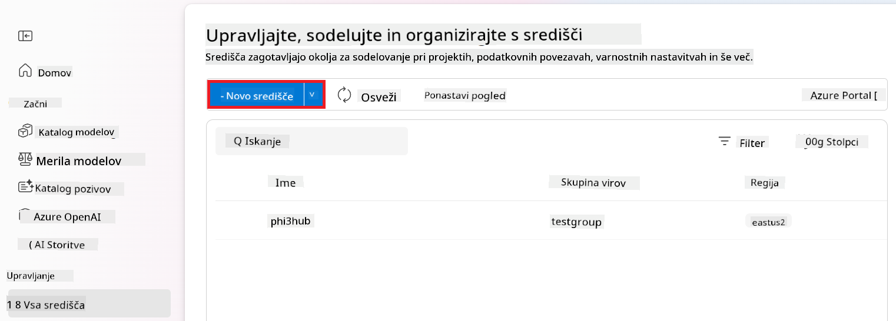

1. Izvedite naslednje korake:

    - Vnesite **Hub name**. Mora biti edinstvena vrednost.
    - Izberite svojo Azure **Subscription**.
    - Izberite **Resource group**, ki jo želite uporabiti (po potrebi ustvarite novo).
    - Izberite **Location**, ki jo želite uporabiti.
    - Izberite **Connect Azure AI Services**, ki jih želite uporabiti (po potrebi ustvarite nove).
    - Izberite **Connect Azure AI Search** in izberite **Skip connecting**.

    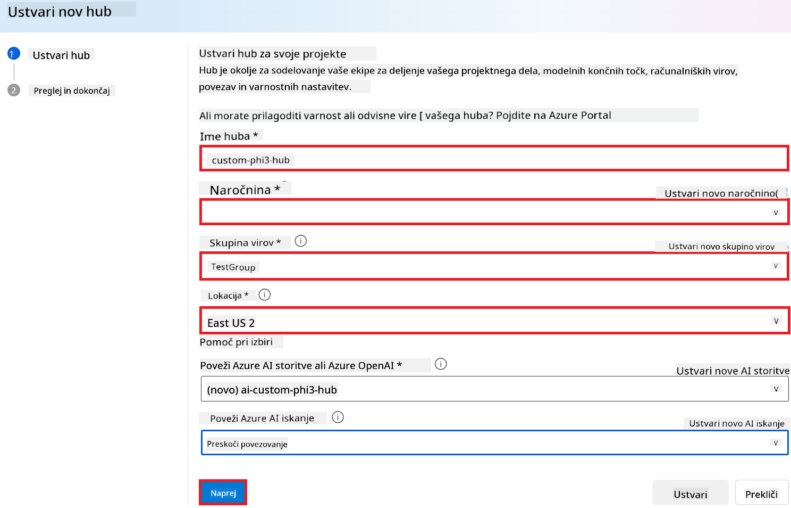

1. Izberite **Next**.

#### Ustvarite Azure AI Foundry projekt

1. V Hubu, ki ste ga ustvarili, izberite **All projects** na levi strani.

1. Izberite **+ New project** v navigacijskem meniju.

    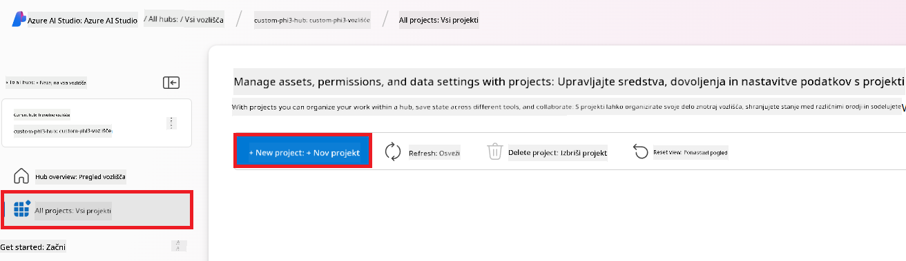

1. Vnesite **Project name**. Mora biti edinstvena vrednost.

    

1. Izberite **Create a project**.

#### Dodajte lastno povezavo za fino nastavljeni model Phi-3

Za integracijo vašega prilagojenega modela Phi-3 s Prompt flow morate shraniti endpoint in ključ modela v lastno povezavo. Ta nastavitev zagotavlja dostop do vašega prilagojenega modela Phi-3 v Prompt flow.

#### Nastavite api ključ in endpoint uri fino nastavljenega modela Phi-3

1. Obiščite [Azure ML Studio](https://ml.azure.com/home?WT.mc_id=aiml-137032-kinfeylo).

1. Pojdite v Azure Machine learning workspace, ki ste ga ustvarili.

1. Izberite **Endpoints** na levi strani.

    

1. Izberite endpoint, ki ste ga ustvarili.

    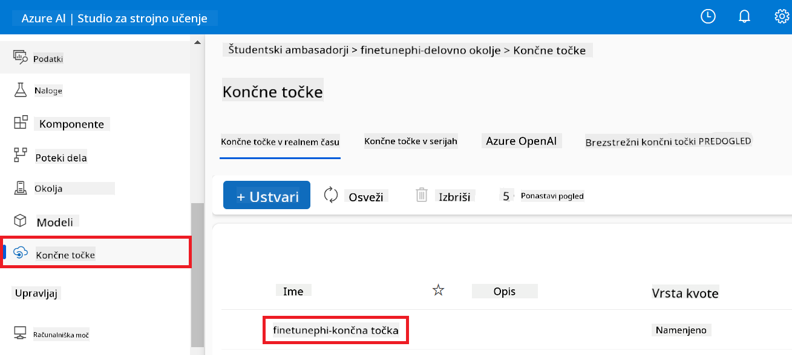

1. Izberite **Consume** v navigacijskem meniju.

1. Kopirajte svoj **REST endpoint** in **Primary key**.

    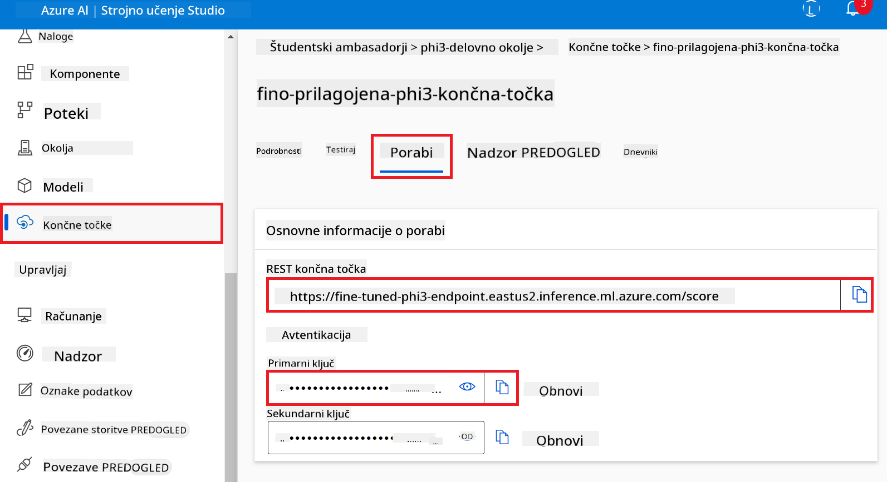

#### Dodajte lastno povezavo

1. Obiščite [Azure AI Foundry](https://ai.azure.com/?WT.mc_id=aiml-137032-kinfeylo).

1. Pojdite v Azure AI Foundry projekt, ki ste ga ustvarili.

1. V projektu, ki ste ga ustvarili, izberite **Settings** na levi strani.

1. Izberite **+ New connection**.

    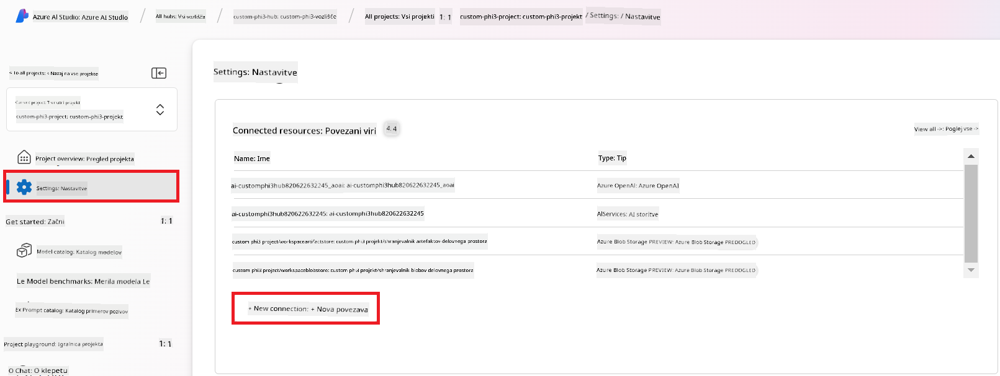

1. Izberite **Custom keys** v navigacijskem meniju.

    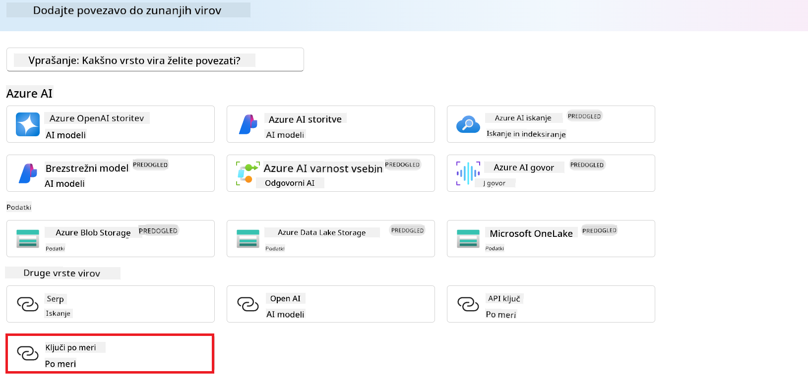

1. Izvedite naslednje korake:

    - Izberite **+ Add key value pairs**.
    - Za ime ključa vnesite **endpoint** in prilepite endpoint, ki ste ga kopirali iz Azure ML Studio, v polje za vrednost.
    - Ponovno izberite **+ Add key value pairs**.
    - Za ime ključa vnesite **key** in prilepite ključ, ki ste ga kopirali iz Azure ML Studio, v polje za vrednost.
    - Po dodajanju ključev izberite **is secret**, da preprečite razkritje ključa.

    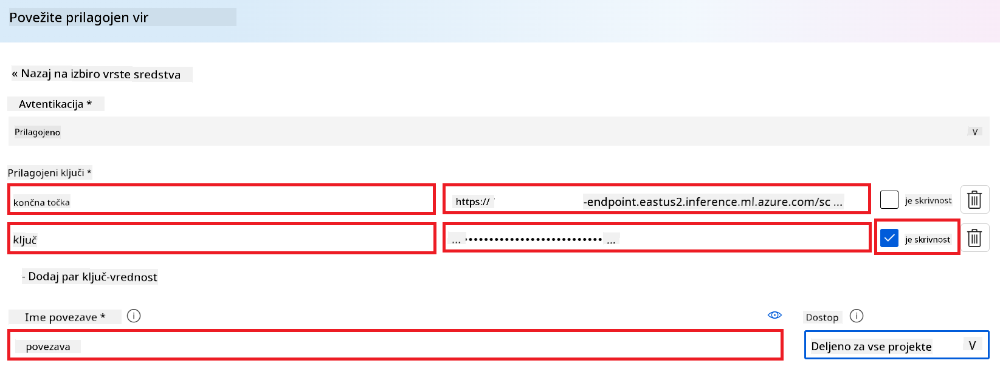

1. Izberite **Add connection**.

#### Ustvarite Prompt flow

Dodali ste lastno povezavo v Azure AI Foundry. Zdaj ustvarimo Prompt flow z naslednjimi koraki. Nato boste to Prompt flow povezali z lastno povezavo, da boste lahko uporabljali fino nastavljeni model znotraj Prompt flow.

1. Pojdite v Azure AI Foundry projekt, ki ste ga ustvarili.

1. Izberite **Prompt flow** na levi strani.

1. Izberite **+ Create** v navigacijskem meniju.

    

1. Izberite **Chat flow** v navigacijskem meniju.

    

1. Vnesite **Folder name**, ki ga želite uporabiti.

    

2. Izberite **Create**.

#### Nastavite Prompt flow za klepet z vašim prilagojenim modelom Phi-3

Za integracijo fino nastavljenega modela Phi-3 v Prompt flow morate obstoječi Prompt flow prilagoditi, saj ni zasnovan za to. Zato morate Prompt flow preoblikovati, da omogočite integracijo prilagojenega modela.

1. V Prompt flow izvedite naslednje korake za obnovo obstoječega toka:

    - Izberite **Raw file mode**.
    - Izbrišite vso obstoječo kodo v datoteki *flow.dag.yml*.
    - Dodajte naslednjo kodo v datoteko *flow.dag.yml*.

        ```yml
        inputs:
          input_data:
            type: string
            default: "Who founded Microsoft?"

        outputs:
          answer:
            type: string
            reference: ${integrate_with_promptflow.output}

        nodes:
        - name: integrate_with_promptflow
          type: python
          source:
            type: code
            path: integrate_with_promptflow.py
          inputs:
            input_data: ${inputs.input_data}
        ```

    - Izberite **Save**.

    

1. Dodajte naslednjo kodo v datoteko *integrate_with_promptflow.py*, da uporabite prilagojeni model Phi-3 v Prompt flow.

    ```python
    import logging
    import requests
    from promptflow import tool
    from promptflow.connections import CustomConnection

    # Logging setup
    logging.basicConfig(
        format="%(asctime)s - %(levelname)s - %(name)s - %(message)s",
        datefmt="%Y-%m-%d %H:%M:%S",
        level=logging.DEBUG
    )
    logger = logging.getLogger(__name__)

    def query_phi3_model(input_data: str, connection: CustomConnection) -> str:
        """
        Send a request to the Phi-3 model endpoint with the given input data using Custom Connection.
        """

        # "connection" is the name of the Custom Connection, "endpoint", "key" are the keys in the Custom Connection
        endpoint_url = connection.endpoint
        api_key = connection.key

        headers = {
            "Content-Type": "application/json",
            "Authorization": f"Bearer {api_key}"
        }
        data = {
            "input_data": {
                "input_string": [
                    {"role": "user", "content": input_data}
                ],
                "parameters": {
                    "temperature": 0.7,
                    "max_new_tokens": 128
                }
            }
        }
        try:
            response = requests.post(endpoint_url, json=data, headers=headers)
            response.raise_for_status()
            
            # Log the full JSON response
            logger.debug(f"Full JSON response: {response.json()}")

            result = response.json()["output"]
            logger.info("Successfully received response from Azure ML Endpoint.")
            return result
        except requests.exceptions.RequestException as e:
            logger.error(f"Error querying Azure ML Endpoint: {e}")
            raise

    @tool
    def my_python_tool(input_data: str, connection: CustomConnection) -> str:
        """
        Tool function to process input data and query the Phi-3 model.
        """
        return query_phi3_model(input_data, connection)

    ```

    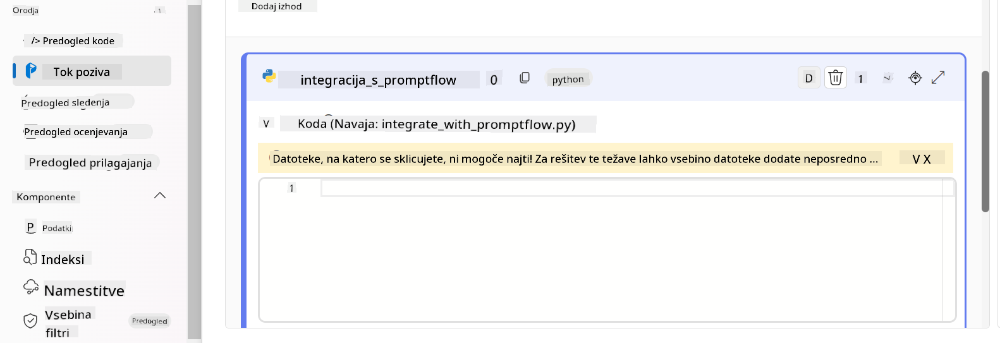

> [!NOTE]
> Za podrobnejše informacije o uporabi Prompt flow v Azure AI Foundry si lahko ogledate [Prompt flow in Azure AI Foundry](https://learn.microsoft.com/azure/ai-studio/how-to/prompt-flow).

1. Izberite **Chat input**, **Chat output**, da omogočite klepet z vašim modelom.

    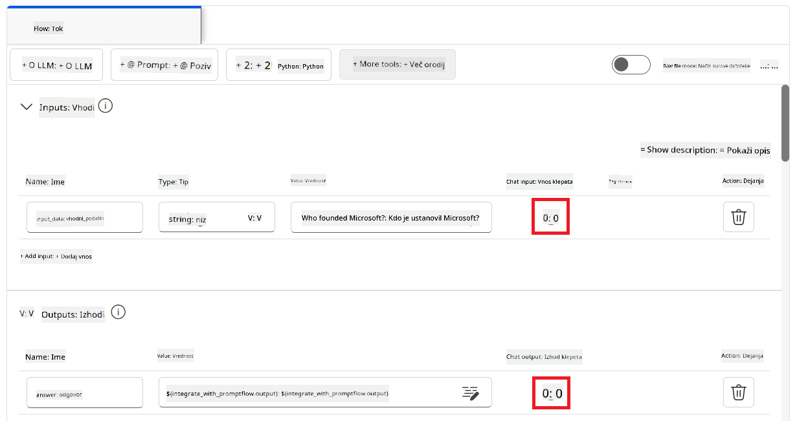

1. Zdaj ste pripravljeni za klepet z vašim prilagojenim modelom Phi-3. V naslednji vaji se boste naučili, kako zagnati Prompt flow in ga uporabiti za klepet z vašim fino nastavljenim modelom Phi-3.

> [!NOTE]
>
> Obnovljen tok bi moral izgledati kot na spodnji sliki:
>
> 
>

### Klepetajte z vašim prilagojenim modelom Phi-3

Zdaj, ko ste fino nastavili in integrirali vaš prilagojeni model Phi-3 s Prompt flow, ste pripravljeni začeti interakcijo z njim. Ta vaja vas bo vodila skozi postopek nastavitve in začetka klepeta z vašim modelom preko Prompt flow. S temi koraki boste lahko v celoti izkoristili zmogljivosti vašega fino nastavljenega modela Phi-3 za različne naloge in pogovore.

- Klepetajte z vašim prilagojenim modelom Phi-3 preko Prompt flow.

#### Zaženite Prompt flow

1. Izberite **Start compute sessions**, da zaženete Prompt flow.

    

1. Izberite **Validate and parse input**, da osvežite parametre.

    

1. Izberite **Value** povezave do lastne povezave, ki ste jo ustvarili. Na primer, *connection*.

    

#### Klepetajte z vašim prilagojenim modelom

1. Izberite **Chat**.

    

1. Tukaj je primer rezultatov: Zdaj lahko klepetate z vašim prilagojenim modelom Phi-3. Priporočljivo je, da postavljate vprašanja, ki temeljijo na podatkih, uporabljenih za fino nastavitev.

    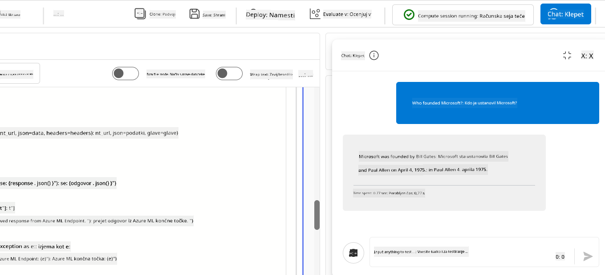

**Omejitev odgovornosti**:  
Ta dokument je bil preveden z uporabo AI prevajalske storitve [Co-op Translator](https://github.com/Azure/co-op-translator). Čeprav si prizadevamo za natančnost, vas opozarjamo, da avtomatizirani prevodi lahko vsebujejo napake ali netočnosti. Izvirni dokument v njegovem izvirnem jeziku velja za avtoritativni vir. Za ključne informacije priporočamo strokovni človeški prevod. Nismo odgovorni za morebitna nesporazume ali napačne interpretacije, ki izhajajo iz uporabe tega prevoda.