# Natančno prilagodite in integrirajte prilagojene modele Phi-3 s Prompt flow v Azure AI Foundry

Ta vzorec od začetka do konca (E2E) temelji na vodiču "[Fine-Tune and Integrate Custom Phi-3 Models with Prompt Flow in Azure AI Foundry](https://techcommunity.microsoft.com/t5/educator-developer-blog/fine-tune-and-integrate-custom-phi-3-models-with-prompt-flow-in/ba-p/4191726?WT.mc_id=aiml-137032-kinfeylo)" iz Microsoft Tech Community. Predstavlja postopke fino prilagajanje, nameščanja in integracije prilagojenih modelov Phi-3 s Prompt flow v Azure AI Foundry. Za razliko od E2E vzorca, "[Fine-Tune and Integrate Custom Phi-3 Models with Prompt Flow](./E2E_Phi-3-FineTuning_PromptFlow_Integration.md)", ki je vključeval lokalno izvajanje kode, se ta vadnica v celoti osredotoča na fino prilagajanje in integracijo vašega modela znotraj Azure AI / ML Studia.

## Pregled

V tem E2E vzorcu se boste naučili, kako fino prilagoditi model Phi-3 in ga integrirati s Prompt flow v Azure AI Foundry. Z uporabo Azure AI / ML Studia boste vzpostavili potek dela za nameščanje in uporabo prilagojenih AI modelov. Ta E2E vzorec je razdeljen na tri scenarije:

**Scenarij 1: Nastavite vire Azure in pripravite za fino prilagajanje**

**Scenarij 2: Fino prilagodite model Phi-3 in ga namestite v Azure Machine Learning Studio**

**Scenarij 3: Integrirajte s Prompt flow in klepetajte s svojim prilagojenim modelom v Azure AI Foundry**

Tu je pregled tega E2E vzorca.

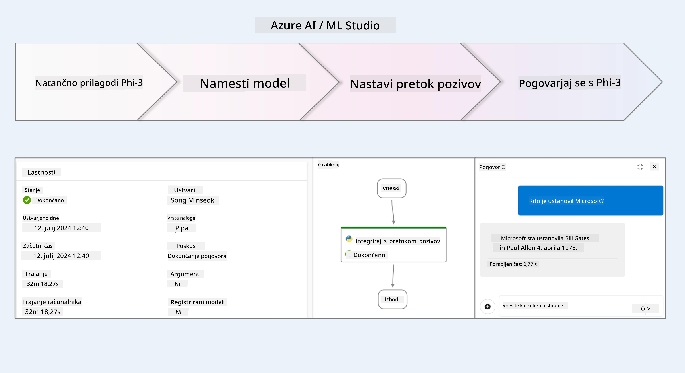

### Kazalo

1. **[Scenarij 1: Nastavite vire Azure in pripravite za fino prilagajanje](../../../../../../md/02.Application/01.TextAndChat/Phi3)**
    - [Ustvarite Azure Machine Learning Workspace](../../../../../../md/02.Application/01.TextAndChat/Phi3)
    - [Zahtevajte GPU kvote v naročnini Azure](../../../../../../md/02.Application/01.TextAndChat/Phi3)
    - [Dodajte dodelitev vlog](../../../../../../md/02.Application/01.TextAndChat/Phi3)
    - [Nastavite projekt](../../../../../../md/02.Application/01.TextAndChat/Phi3)
    - [Pripravite podatkovni niz za fino prilagajanje](../../../../../../md/02.Application/01.TextAndChat/Phi3)

1. **[Scenarij 2: Fino prilagodite model Phi-3 in ga namestite v Azure Machine Learning Studio](../../../../../../md/02.Application/01.TextAndChat/Phi3)**
    - [Fino prilagodite model Phi-3](../../../../../../md/02.Application/01.TextAndChat/Phi3)
    - [Namestite fino prilagojeni model Phi-3](../../../../../../md/02.Application/01.TextAndChat/Phi3)

1. **[Scenarij 3: Integrirajte s Prompt flow in klepetajte s svojim prilagojenim modelom v Azure AI Foundry](../../../../../../md/02.Application/01.TextAndChat/Phi3)**
    - [Integrirajte prilagojeni model Phi-3 s Prompt flow](../../../../../../md/02.Application/01.TextAndChat/Phi3)
    - [Klepetajte s svojim prilagojenim modelom Phi-3](../../../../../../md/02.Application/01.TextAndChat/Phi3)

## Scenarij 1: Nastavite vire Azure in pripravite za fino prilagajanje

### Ustvarite Azure Machine Learning Workspace

1. V **iskalnem polju** na vrhu portala vnesite *azure machine learning* in iz prikazanih možnosti izberite **Azure Machine Learning**.

    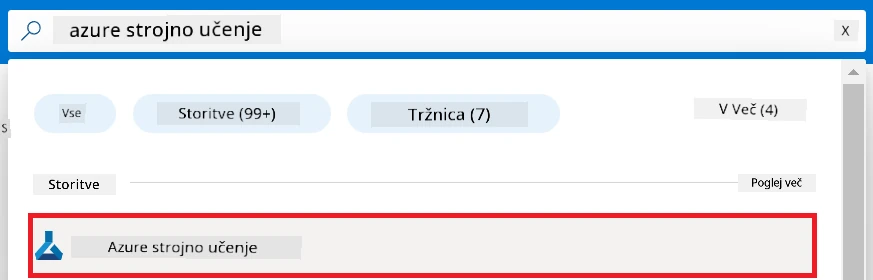

2. Izberite **+ Ustvari** v navigacijskem meniju.

3. Izberite **Nov delovni prostor** v navigacijskem meniju.

    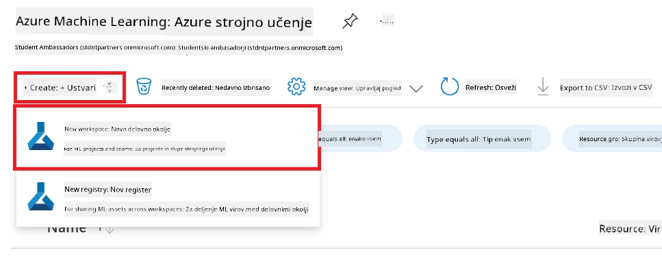

4. Izvedite naslednje naloge:

    - Izberite svojo Azure **naročnino**.
    - Izberite **Skupino virov**, ki jo želite uporabiti (po potrebi ustvarite novo).
    - Vnesite **Ime delovnega prostora**. Mora biti edinstvena vrednost.
    - Izberite **Območje**, ki ga želite uporabiti.
    - Izberite **račun za shranjevanje**, ki ga želite uporabiti (po potrebi ustvarite novega).
    - Izberite **Zakladnico ključev**, ki jo želite uporabiti (po potrebi ustvarite novo).
    - Izberite **Application insights**, ki ga želite uporabiti (po potrebi ustvarite novega).
    - Izberite **Registracijo vsebnika**, ki jo želite uporabiti (po potrebi ustvarite novo).

    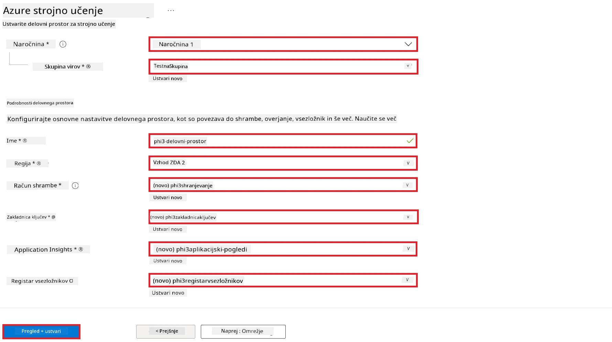

5. Izberite **Preglej + Ustvari**.

6. Izberite **Ustvari**.

### Zahtevajte GPU kvote v naročnini Azure

V tej vadnici se boste naučili, kako fino prilagoditi in namestiti model Phi-3 z uporabo GPU-jev. Za fino prilagajanje boste uporabili GPU *Standard_NC24ads_A100_v4*, za katerega je potrebna zahteva za kvoto. Za nameščanje boste uporabili GPU *Standard_NC6s_v3*, za katerega je prav tako potrebna zahteva za kvoto.

> [!NOTE]
>
> Le naročnine Pay-As-You-Go (standardni tip naročnine) so upravičene do dodelitve GPU-jev; koristne naročnine trenutno niso podprte.
>

1. Obiščite [Azure ML Studio](https://ml.azure.com/home?wt.mc_id=studentamb_279723).

1. Izvedite naslednje korake za zahtevo kvote *Standard NCADSA100v4 Family*:

    - Izberite **Kvote** na levi strani.
    - Izberite **Družino virtualnih strojev**, ki jo želite uporabiti. Na primer, izberite **Standard NCADSA100v4 Family Cluster Dedicated vCPUs**, ki vključuje GPU *Standard_NC24ads_A100_v4*.
    - Izberite **Zahtevaj kvoto** v navigacijskem meniju.

        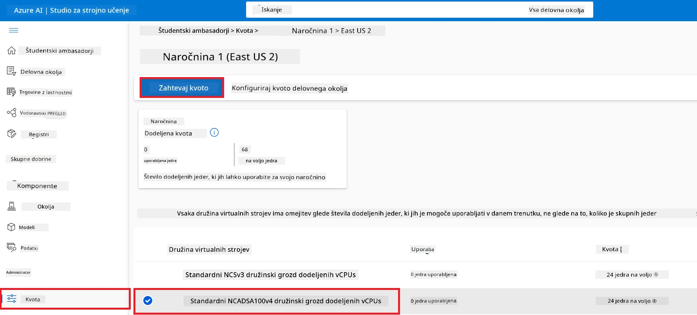

    - Na strani zahteve kvote vnesite **Novo omejitev jeder**, ki jo želite uporabiti. Na primer, 24.
    - Na strani zahteve kvote izberite **Pošlji**, da zahtevate kvoto za GPU.

1. Izvedite naslednje korake za zahtevo kvote *Standard NCSv3 Family*:

    - Izberite **Kvote** na levi strani.
    - Izberite **Družino virtualnih strojev**, ki jo želite uporabiti. Na primer, izberite **Standard NCSv3 Family Cluster Dedicated vCPUs**, ki vključuje GPU *Standard_NC6s_v3*.
    - Izberite **Zahtevaj kvoto** v navigacijskem meniju.
    - Na strani zahteve kvote vnesite **Novo omejitev jeder**, ki jo želite uporabiti. Na primer, 24.
    - Na strani zahteve kvote izberite **Pošlji**, da zahtevate kvoto za GPU.

### Dodajte dodelitev vlog

Za fino prilagajanje in nameščanje modelov morate najprej ustvariti Uporabniško dodeljeno upravljano identiteto (UAI) in ji dodeliti ustrezna dovoljenja. Ta UAI bo uporabljena za avtentikacijo med nameščanjem.

#### Ustvarite Uporabniško dodeljeno upravljano identiteto (UAI)

1. V iskalno polje na vrhu portala vnesite *managed identities* in iz prikazanih možnosti izberite **Managed Identities**.

    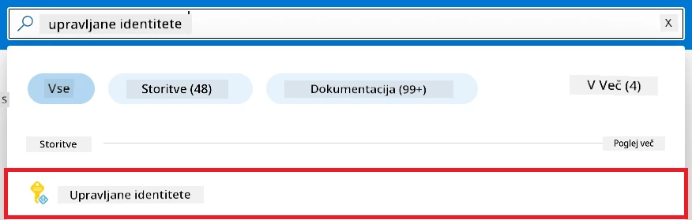

1. Izberite **+ Ustvari**.

    

1. Izvedite naslednje korake:

    - Izberite svojo Azure **naročnino**.
    - Izberite **Skupino virov**, ki jo želite uporabiti (po potrebi ustvarite novo).
    - Izberite **Območje**, ki ga želite uporabiti.
    - Vnesite **Ime**. Mora biti edinstvena vrednost.

    

1. Izberite **Preglej + ustvari**.

1. Izberite **+ Ustvari**.

#### Dodajte dodelitev vloge Contributor upravljani identiteti

1. Pojdite na vir upravljane identitete, ki ste ga ustvarili.

1. Izberite **Dodelitve vlog Azure** na levi strani.

1. Izberite **+ Dodaj dodelitev vloge** v navigacijskem meniju.

1. Na strani Dodaj dodelitev vloge izvedite naslednje korake:
    - Nastavite **Obseg** na **Skupina virov**.
    - Izberite svojo Azure **naročnino**.
    - Izberite **Skupino virov**, ki jo želite uporabiti.
    - Izberite **Vlogo** **Contributor**.

    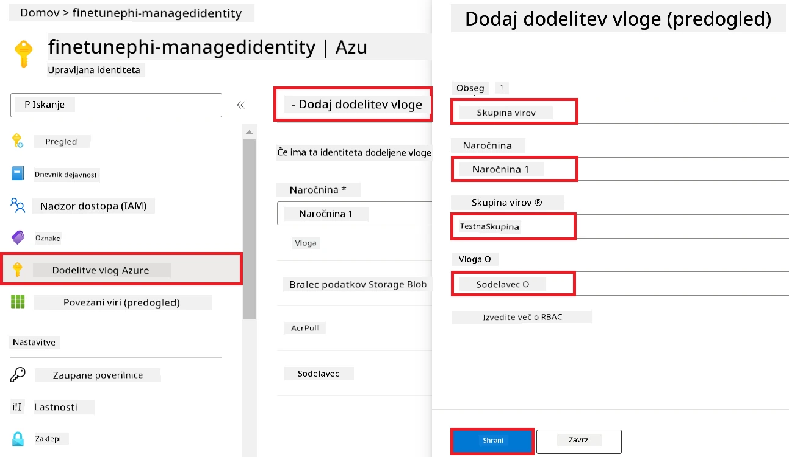

2. Izberite **Shrani**.

#### Dodajte dodelitev vloge Storage Blob Data Reader upravljani identiteti

1. V iskalno polje na vrhu portala vnesite *storage accounts* in izberite **Storage accounts** iz prikazanih možnosti.

    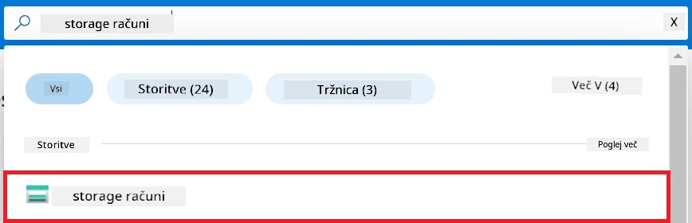

1. Izberite račun za shranjevanje, ki je povezan z Azure Machine Learning delovnim prostorom, ki ste ga ustvarili. Na primer, *finetunephistorage*.

1. Izvedite naslednje korake za navigacijo do strani Dodaj dodelitev vloge:

    - Pojdite v Azure Storage račun, ki ste ga ustvarili.
    - Izberite **Access Control (IAM)** na levi strani.
    - Izberite **+ Dodaj** v navigacijskem meniju.
    - Izberite **Dodaj dodelitev vloge**.

    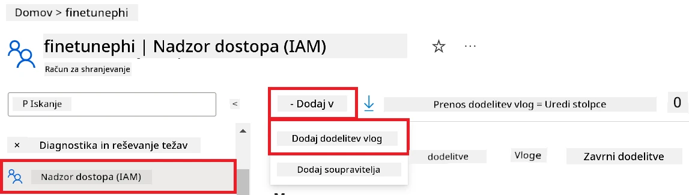

1. Na strani Dodaj dodelitev vloge izvedite naslednje korake:

    - Na strani vloge v iskalno polje vnesite *Storage Blob Data Reader* in izberite **Storage Blob Data Reader** iz prikazanih možnosti.
    - Na strani vloge izberite **Naprej**.
    - Na strani Člani izberite **Dodeli dostop** **Upravljana identiteta**.
    - Na strani Člani izberite **+ Izberi člane**.
    - Na strani Izberi upravljane identitete izberite svojo Azure **naročnino**.
    - Na strani Izberi upravljane identitete izberite **Upravljana identiteta** za **Manage Identity**.
    - Na strani Izberi upravljane identitete izberite Manage Identity, ki ste jo ustvarili. Na primer, *finetunephi-managedidentity*.
    - Na strani Izberi upravljane identitete izberite **Izberi**.

    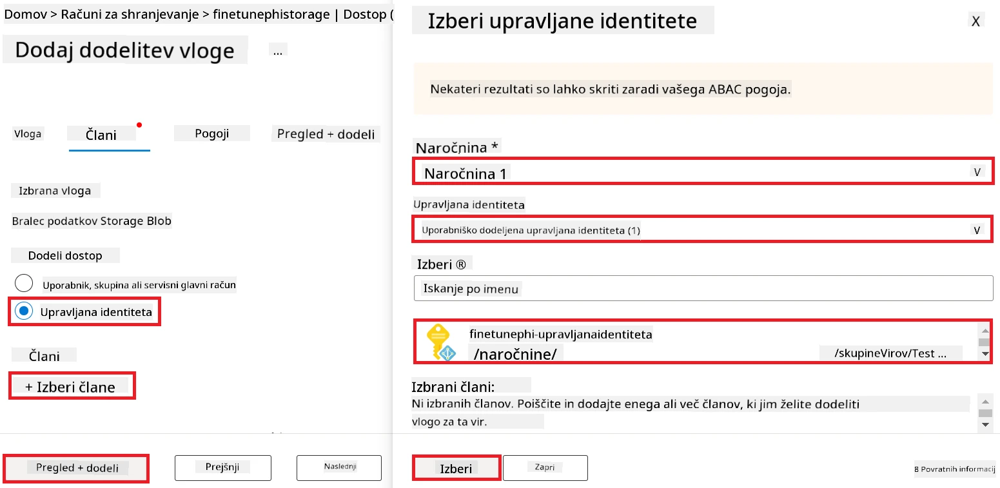

1. Izberite **Preglej + dodeli**.

#### Dodajte dodelitev vloge AcrPull upravljani identiteti

1. V iskalno polje na vrhu portala vnesite *container registries* in izberite **Container registries** iz prikazanih možnosti.

    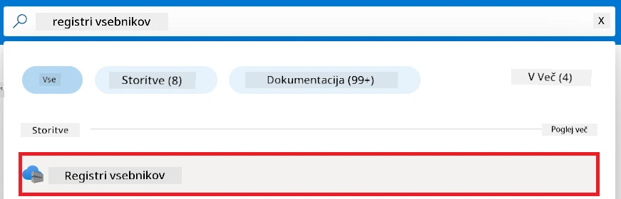

1. Izberite registracijo vsebnika, ki je povezana z Azure Machine Learning delovnim prostorom. Na primer, *finetunephicontainerregistry*.

1. Izvedite naslednje korake za navigacijo na stran Dodaj dodelitev vloge:

    - Izberite **Access Control (IAM)** na levi strani.
    - Izberite **+ Dodaj** v navigacijskem meniju.
    - Izberite **Dodaj dodelitev vloge**.

1. Na strani Dodaj dodelitev vloge izvedite naslednje korake:

    - Na strani vloge v iskalno polje vnesite *AcrPull* in izberite **AcrPull** iz prikazanih možnosti.
    - Na strani vloge izberite **Naprej**.
    - Na strani Člani izberite **Dodeli dostop** **Upravljana identiteta**.
    - Na strani Člani izberite **+ Izberi člane**.
    - Na strani Izberi upravljane identitete izberite svojo Azure **naročnino**.
    - Na strani Izberi upravljane identitete izberite **Upravljana identiteta** za **Manage Identity**.
    - Na strani Izberi upravljane identitete izberite Manage Identity, ki ste jo ustvarili. Na primer, *finetunephi-managedidentity*.
    - Na strani Izberi upravljane identitete izberite **Izberi**.
    - Izberite **Preglej + dodeli**.

### Nastavite projekt

Za prenos podatkovnih nizov, potrebnih za fino prilagajanje, boste nastavili lokalno okolje.

V tej vaji boste

- ustvarili mapo za delo znotraj nje.
- ustvarili virtualno okolje.
- namestili zahtevane pakete.
- ustvarili datoteko *download_dataset.py* za prenos podatkovnega niza.

#### Ustvarite mapo za delo znotraj nje

1. Odprite okno terminala in vnesite naslednji ukaz za ustvarjanje mape z imenom *finetune-phi* v privzeti poti.

    ```console
    mkdir finetune-phi
    ```

2. Vnesite naslednji ukaz v terminal, da se premaknete v mapo *finetune-phi*, ki ste jo ustvarili.

    ```console
    cd finetune-phi
    ```

#### Ustvarite virtualno okolje

1. Vnesite naslednji ukaz v terminal, da ustvarite virtualno okolje po imenu *.venv*.

    ```console
    python -m venv .venv
    ```

2. Vnesite naslednji ukaz v terminal, da aktivirate virtualno okolje.

    ```console
    .venv\Scripts\activate.bat
    ```

> [!NOTE]
> Če je uspelo, bi morali videti *(.venv)* pred ukazno vrstico.

#### Namestite potrebne pakete

1. Vnesite naslednje ukaze v terminal, da namestite potrebne pakete.

    ```console
    pip install datasets==2.19.1
    ```

#### Ustvarite `donload_dataset.py`

> [!NOTE]
> Popolna struktura mape:
>
> ```text
> └── YourUserName
> .    └── finetune-phi
> .        └── download_dataset.py
> ```

1. Odprite **Visual Studio Code**.

1. Izberite **Datoteka** v menijski vrstici.

1. Izberite **Odpri mapo**.

1. Izberite mapo *finetune-phi*, ki ste jo ustvarili, in se nahaja na *C:\Users\yourUserName\finetune-phi*.

    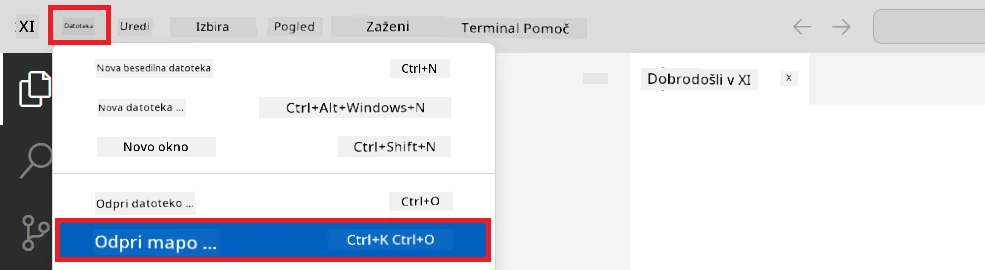

1. V levem podoknu Visual Studio Code kliknite z desno tipko miške in izberite **Nova datoteka**, da ustvarite novo datoteko po imenu *download_dataset.py*.

    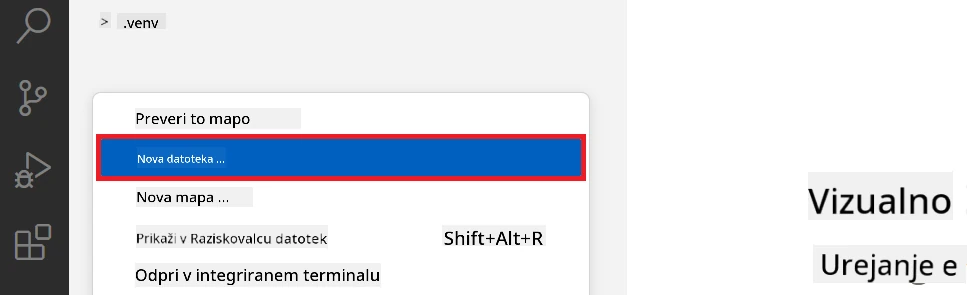

### Pripravite podatkovni niz za fino nastavitev

V tej vaji boste zagnali datoteko *download_dataset.py*, da prenesete nabor podatkov *ultrachat_200k* v vaše lokalno okolje. Nato boste uporabili te podatke za fino nastavitev modela Phi-3 v Azure Machine Learning.

V tej vaji boste:

- Dodali kodo v datoteko *download_dataset.py* za prenos podatkov.
- Zagnali datoteko *download_dataset.py*, da prenesete podatke v lokalno okolje.

#### Prenesite svoj nabor podatkov z uporabo *download_dataset.py*

1. Odprite datoteko *download_dataset.py* v Visual Studio Code.

1. V datoteko *download_dataset.py* dodajte naslednjo kodo.

    ```python
    import json
    import os
    from datasets import load_dataset

    def load_and_split_dataset(dataset_name, config_name, split_ratio):
        """
        Load and split a dataset.
        """
        # Naložite nabor podatkov z določenim imenom, konfiguracijo in razmerjem delitve
        dataset = load_dataset(dataset_name, config_name, split=split_ratio)
        print(f"Original dataset size: {len(dataset)}")
        
        # Razdelite nabor podatkov na učni in testni del (80 % učno, 20 % testno)
        split_dataset = dataset.train_test_split(test_size=0.2)
        print(f"Train dataset size: {len(split_dataset['train'])}")
        print(f"Test dataset size: {len(split_dataset['test'])}")
        
        return split_dataset

    def save_dataset_to_jsonl(dataset, filepath):
        """
        Save a dataset to a JSONL file.
        """
        # Ustvarite imenik, če ne obstaja
        os.makedirs(os.path.dirname(filepath), exist_ok=True)
        
        # Odprite datoteko v načinu pisanja
        with open(filepath, 'w', encoding='utf-8') as f:
            # Iterirajte skozi vsak zapis v naboru podatkov
            for record in dataset:
                # Zapišite zapis kot JSON objekt in ga zapišite v datoteko
                json.dump(record, f)
                # Zapišite znak za novo vrstico, da ločite zapise
                f.write('\n')
        
        print(f"Dataset saved to {filepath}")

    def main():
        """
        Main function to load, split, and save the dataset.
        """
        # Naložite in razdelite nabor podatkov ULTRACHAT_200k z določeno konfiguracijo in razmerjem delitve
        dataset = load_and_split_dataset("HuggingFaceH4/ultrachat_200k", 'default', 'train_sft[:1%]')
        
        # Izvlecite učni in testni nabor podatkov iz delitve
        train_dataset = dataset['train']
        test_dataset = dataset['test']

        # Shrani učni nabor podatkov v JSONL datoteko
        save_dataset_to_jsonl(train_dataset, "data/train_data.jsonl")
        
        # Shrani testni nabor podatkov v ločeno JSONL datoteko
        save_dataset_to_jsonl(test_dataset, "data/test_data.jsonl")

    if __name__ == "__main__":
        main()

    ```

1. Vnesite naslednji ukaz v terminal, da zaženete skripto in prenesete nabor podatkov v lokalno okolje.

    ```console
    python download_dataset.py
    ```

1. Preverite, ali so bili podatki uspešno shranjeni v lokalno mapo *finetune-phi/data*.

> [!NOTE]
>
> #### Opomba glede velikosti nabora podatkov in časa fine nastavitve
>
> V tem vadniku uporabljate samo 1% nabora podatkov (`split='train[:1%]'`). To bistveno zmanjša količino podatkov, kar pospeši tako nalaganje kot postopek fine nastavitve. Procent lahko prilagodite, da najdete pravo ravnovesje med časom usposabljanja in zmogljivostjo modela. Uporaba manjšega podnabora podatkov zmanjša čas za fine nastavitev, kar naredi postopek bolj obvladljiv za vadnico.

## Scenarij 2: Fine nastavite model Phi-3 in ga razporedite v Azure Machine Learning Studio

### Fine nastavite model Phi-3

V tej vaji boste fine nastavili model Phi-3 v Azure Machine Learning Studio.

V tej vaji boste:

- Ustvarili računalniški grozd za fine nastavitev.
- Fine nastavili model Phi-3 v Azure Machine Learning Studio.

#### Ustvarite računalniški grozd za fino nastavitev

1. Obiščite [Azure ML Studio](https://ml.azure.com/home?wt.mc_id=studentamb_279723).

1. Izberite **Compute** v levem zavihku.

1. Izberite **Compute clusters** v navigacijskem meniju.

1. Izberite **+ New**.

    

1. Izvedite naslednje naloge:

    - Izberite **Regijo**, ki jo želite uporabiti.
    - Izberite **Nivo virtualnega računalnika** na **Dedicated**.
    - Izberite **Vrsto virtualnega računalnika** na **GPU**.
    - Izberite filter **Velikost virtualnega računalnika** na **Izberi iz vseh možnosti**.
    - Izberite velikost virtualnega računalnika na **Standard_NC24ads_A100_v4**.

    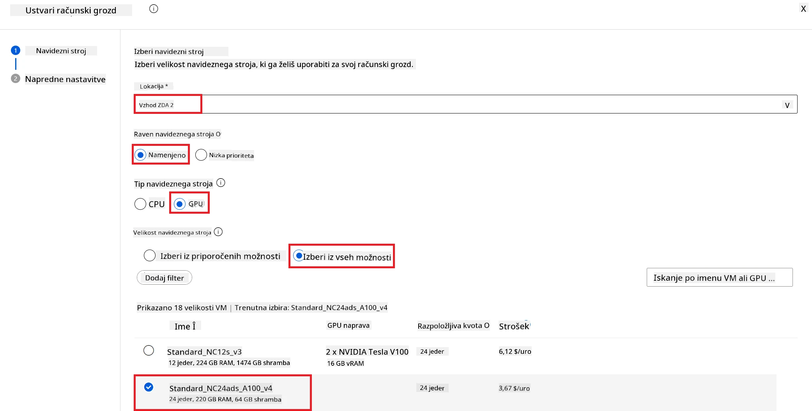

1. Izberite **Next**.

1. Izvedite naslednje naloge:

    - Vnesite **Ime računalnika**. Mora biti edinstvena vrednost.
    - Izberite **Najmanjše število vozlišč** na **0**.
    - Izberite **Največje število vozlišč** na **1**.
    - Izberite **Sekunde neaktivnosti pred prilagoditvijo velikosti navzdol** na **120**.

    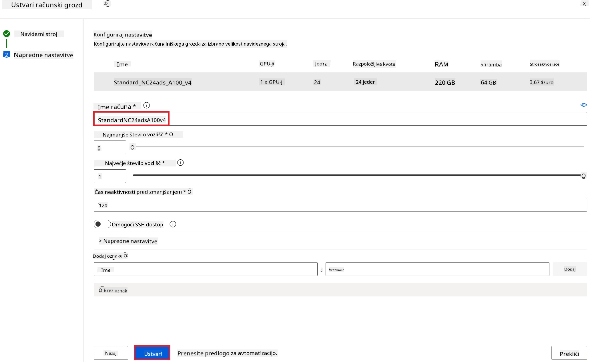

1. Izberite **Ustvari**.

#### Fine nastavite model Phi-3

1. Obiščite [Azure ML Studio](https://ml.azure.com/home?wt.mc_id=studentamb_279723).

1. Izberite deloarnico Azure Machine Learning, ki ste jo ustvarili.

    

1. Izvedite naslednje naloge:

    - Izberite **Model catalog** v levem zavihku.
    - V iskalno polje vnesite *phi-3-mini-4k* in izberite **Phi-3-mini-4k-instruct** iz prikazanih možnosti.

    

1. Izberite **Fine-tune** v navigacijskem meniju.

    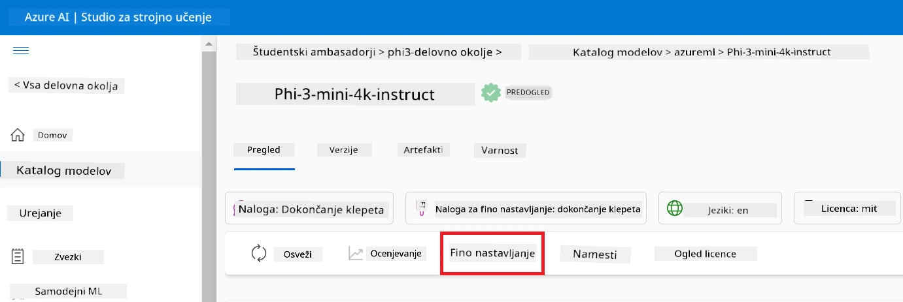

1. Izvedite naslednje naloge:

    - Izberite **Izberite tip naloge** na **Chat completion**.
    - Izberite **+ Izberi podatke** za nalaganje **Trening podatkov**.
    - Izberite način nalaganja validacijskih podatkov na **Navedite drugačne validacijske podatke**.
    - Izberite **+ Izberi podatke** za nalaganje **Validacijskih podatkov**.

    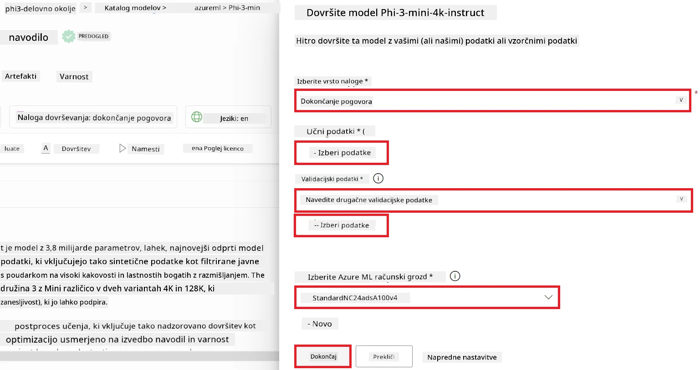

> [!TIP]
>
> Lahko izberete **Napredne nastavitve**, da prilagodite konfiguracije, kot so **learning_rate** in **lr_scheduler_type**, da optimizirate postopek fino nastavitve glede na vaše posebne potrebe.

1. Izberite **Končaj**.

1. V tej vaji ste uspešno fino nastavili model Phi-3 z uporabo Azure Machine Learning. Upoštevajte, da lahko postopek fino nastavitve traja kar nekaj časa. Po zagonu naloge fine nastavitve morate počakati, da ta dokonča. Status naloge lahko spremljate tako, da v delovnem prostoru Azure Machine Learning izberete zavihek Jobs na levi strani. V naslednjem sklopu boste razporedili fino nastavljeni model in ga integrirali s Prompt flow.

    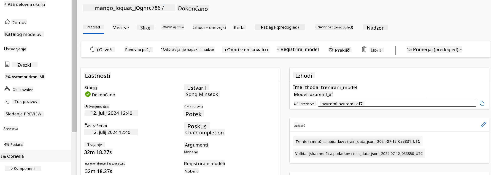

### Razporedite fino nastavljeni model Phi-3

Za integracijo fino nastavljenega modela Phi-3 s Prompt flow morate model razporediti, da bo dostopen za realnočasno sklepanje. Ta postopek vključuje registracijo modela, ustvarjanje spletne končne točke in razporeditev modela.

V tej vaji boste:

- Registrirali fino nastavljen model v delovnem prostoru Azure Machine Learning.
- Ustvarili spletno končno točko.
- Razporedili registrirani fino nastavljen model Phi-3.

#### Registrirajte fino nastavljen model

1. Obiščite [Azure ML Studio](https://ml.azure.com/home?wt.mc_id=studentamb_279723).

1. Izberite deloarnico Azure Machine Learning, ki ste jo ustvarili.

    

1. Izberite **Models** v levem zavihku.
1. Izberite **+ Register**.
1. Izberite **Iz izhoda naloge**.

    

1. Izberite nalogo, ki ste jo ustvarili.

    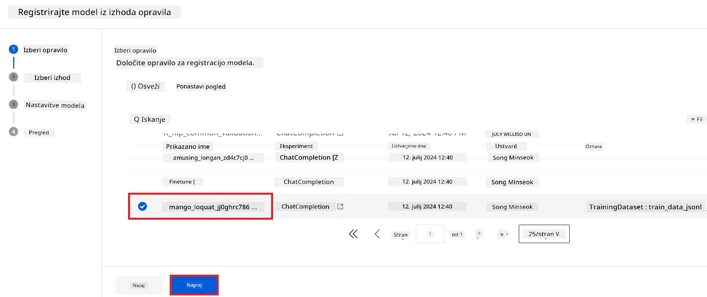

1. Izberite **Next**.

1. Izberite **Vrsto modela** na **MLflow**.

1. Preverite, da je izbran **Izhod naloge**; naj bi bil izbran samodejno.

    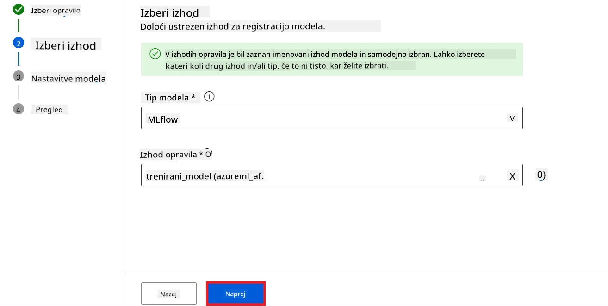

2. Izberite **Next**.

3. Izberite **Register**.

    

4. Vaš registrirani model si lahko ogledate, če v levem zavihku izberete meni **Models**.

    

#### Razporedite fino nastavljen model

1. Pomaknite se do deloarnice Azure Machine Learning, ki ste jo ustvarili.

1. Izberite **Endpoints** v levem zavihku.

1. Izberite **Real-time endpoints** v navigacijskem meniju.

    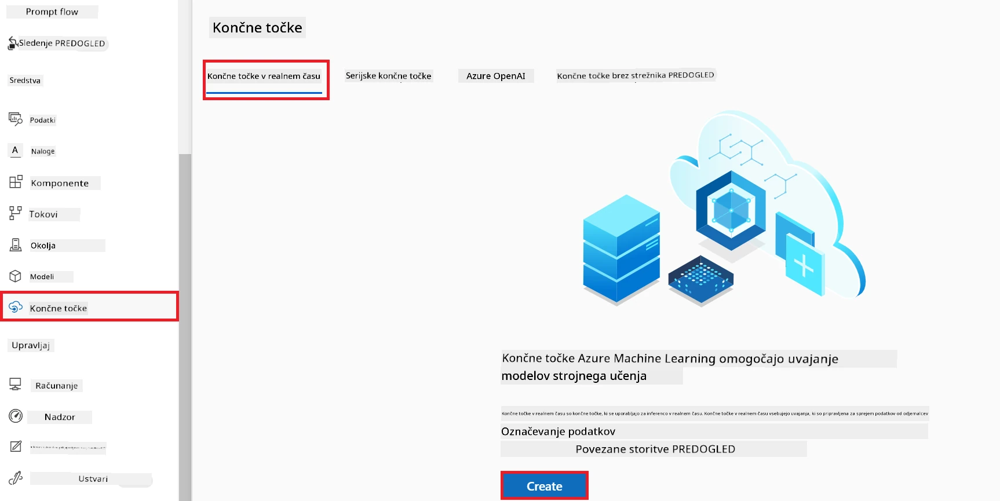

1. Izberite **Ustvari**.

1. Izberite registrirani model, ki ste ga ustvarili.

    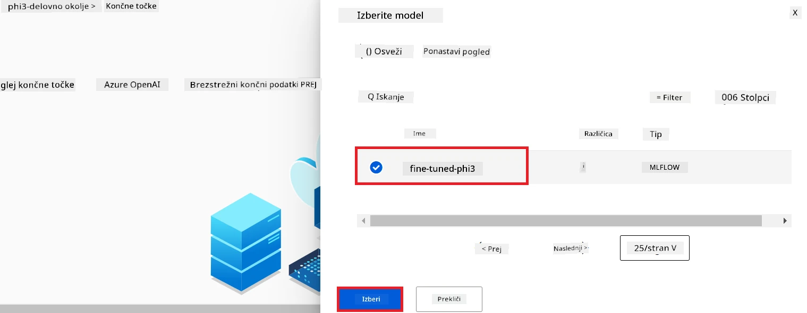

1. Izberite **Izberi**.

1. Izvedite naslednje naloge:

    - Izberite **Virtualni računalnik** na *Standard_NC6s_v3*.
    - Izberite **Število instanc**, ki jih želite uporabiti. Na primer, *1*.
    - Izberite **Končna točka** na **Novo** za ustvarjanje končne točke.
    - Vnesite **Ime končne točke**. Mora biti edinstvena vrednost.
    - Vnesite **Ime razporeditve**. Mora biti edinstvena vrednost.

    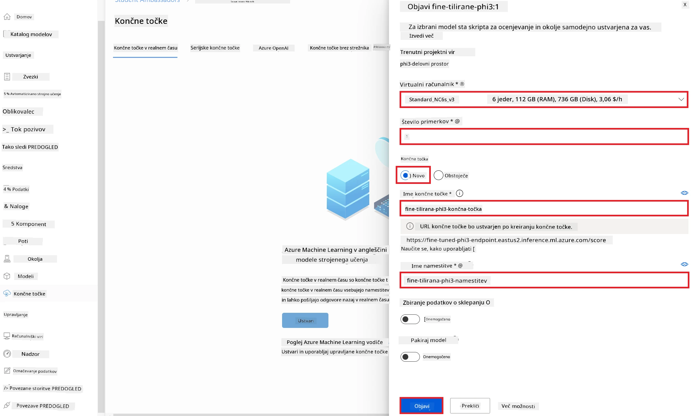

1. Izberite **Razporedi**.

> [!WARNING]
> Da bi se izognili dodatnim stroškom na vašem računu, poskrbite, da izbrišete ustvarjeno končno točko v deloarnici Azure Machine Learning.
>

#### Preverite stanje razporeditve v deloarnici Azure Machine Learning

1. Odprite deloarnico Azure Machine Learning, ki ste jo ustvarili.

1. Izberite **Endpoints** v levem zavihku.

1. Izberite končno točko, ki ste jo ustvarili.

    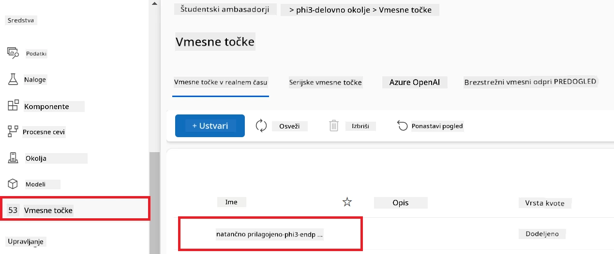

1. Na tej strani lahko upravljate končne točke med postopkom razporeditve.

> [!NOTE]
> Ko je razporeditev dokončana, zagotovite, da je **Promet v živo** nastavljen na **100%**. Če ni, izberite **Posodobi promet**, da prilagodite nastavitve prometa. Upoštevajte, da modela ne morete testirati, če je promet nastavljen na 0%.
>
> 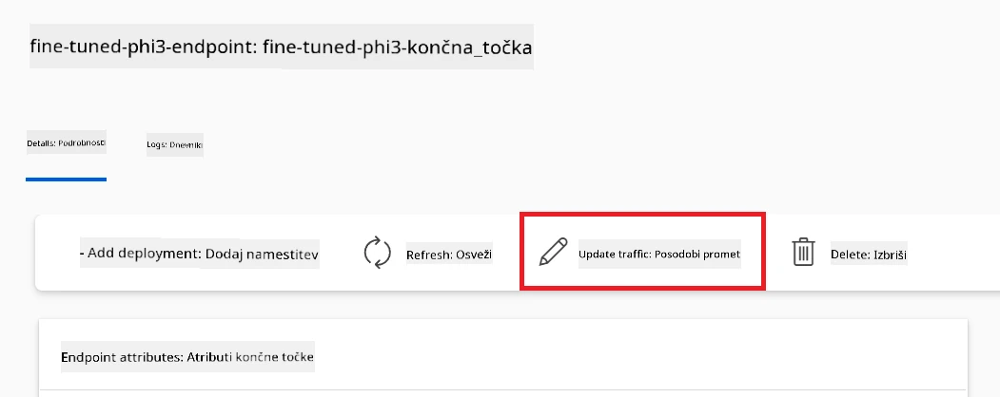
>

## Scenarij 3: Integracija s Prompt flow in klepet z vašim prilagojenim modelom v Azure AI Foundry

### Integrirajte prilagojeni model Phi-3 s Prompt flow

Po uspešni razporeditvi vašega fino nastavljenega modela ga lahko zdaj integrirate s Prompt Flow, da uporabite vaš model v realnočasnih aplikacijah, kar omogoča različne interaktivne naloge z vašim prilagojenim modelom Phi-3.

V tej vaji boste:

- Ustvarili Azure AI Foundry Hub.
- Ustvarili projekt v Azure AI Foundry.
- Ustvarili Prompt flow.
- Dodali prilagojeno povezavo za fino nastavljen model Phi-3.
- Nastavili Prompt flow za klepet z vašim prilagojenim modelom Phi-3.

> [!NOTE]
> Prav tako se lahko integrirate s Promptflow z uporabo Azure ML Studia. Isti postopek integracije je mogoče uporabiti v Azure ML Studiu.

#### Ustvarite Azure AI Foundry Hub

Preden ustvarite projekt, morate ustvariti Hub. Hub deluje kot skupina virov, kar vam omogoča organizacijo in upravljanje različnih projektov znotraj Azure AI Foundry.

1. Obiščite [Azure AI Foundry](https://ai.azure.com/?WT.mc_id=aiml-137032-kinfeylo).

1. Izberite **Vsi hubi** v levem zavihku.

1. Izberite **+ Nov hub** v navigacijskem meniju.
    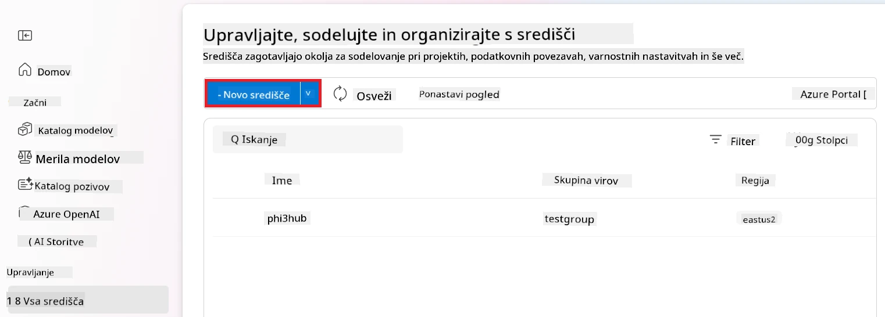

1. Opravite naslednje naloge:

    - Vnesite **Ime vozlišča**. Mora biti unikatna vrednost.
    - Izberite svoj Azure **Naročniški račun**.
    - Izberite **Skupino virov**, ki jo želite uporabiti (po potrebi ustvarite novo).
    - Izberite **Lokacijo**, ki jo želite uporabiti.
    - Izberite **Poveži Azure AI storitve**, ki jih želite uporabiti (po potrebi ustvarite nove).
    - Izberite **Poveži Azure AI Search** in nato **Preskoči povezovanje**.

    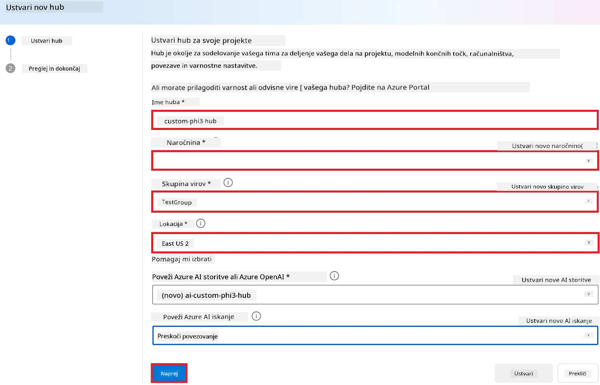

1. Izberite **Naprej**.

#### Ustvarjanje projekta Azure AI Foundry

1. V vozlišču, ki ste ga ustvarili, izberite **Vsi projekti** na levi strani zavihka.

1. Izberite **+ Nov projekt** v navigacijskem meniju.

    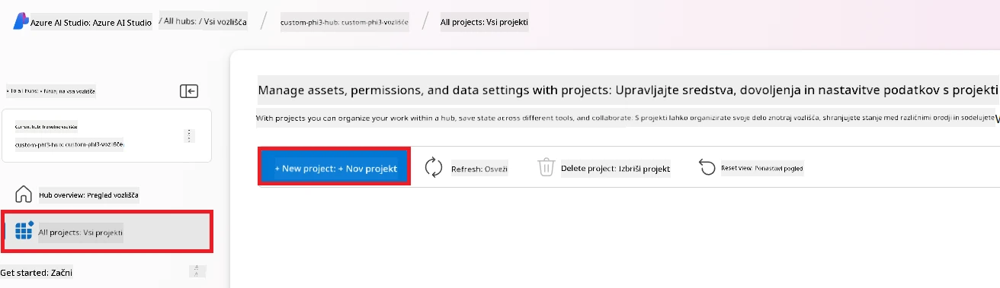

1. Vnesite **Ime projekta**. Mora biti unikatna vrednost.

    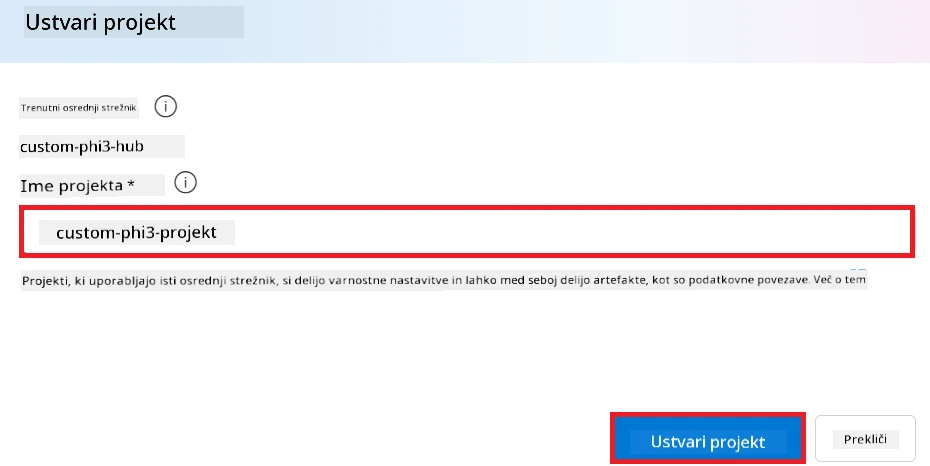

1. Izberite **Ustvari projekt**.

#### Dodajanje po meri povezave za fino nastavljeni model Phi-3

Za integracijo vašega prilagojenega modela Phi-3 s Prompt flow morate shraniti končni naslov modela in ključ v po meri ustvarjeni povezavi. Ta nastavitev zagotavlja dostop do vašega prilagojenega modela Phi-3 v Prompt flow.

#### Nastavitev api ključa in končnega naslova fino nastavljenega modela Phi-3

1. Obiščite [Azure ML Studio](https://ml.azure.com/home?WT.mc_id=aiml-137032-kinfeylo).

1. Pomaknite se do delovnega prostora Azure Machine learning, ki ste ga ustvarili.

1. Izberite **Končne točke** na levi strani zavihka.

    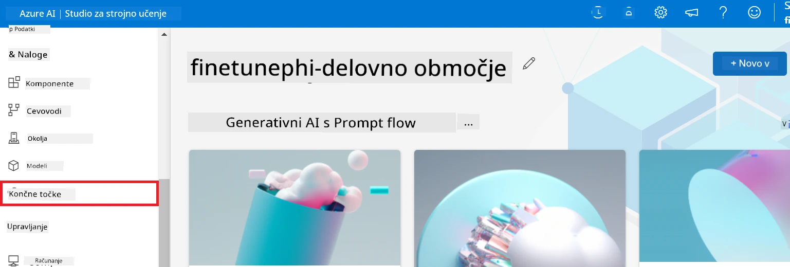

1. Izberite končno točko, ki ste jo ustvarili.

    

1. Izberite **Porabljaj** v navigacijskem meniju.

1. Kopirajte vaš **REST končni naslov** in **Primarni ključ**.

    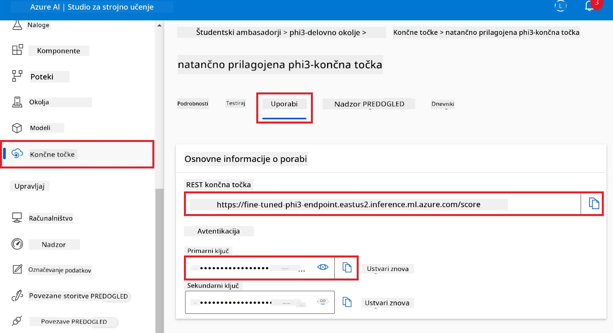

#### Dodajte po meri povezavo

1. Obiščite [Azure AI Foundry](https://ai.azure.com/?WT.mc_id=aiml-137032-kinfeylo).

1. Pomaknite se do projekta Azure AI Foundry, ki ste ga ustvarili.

1. V projektu, ki ste ga ustvarili, izberite **Nastavitve** na levi strani zavihka.

1. Izberite **+ Nova povezava**.

    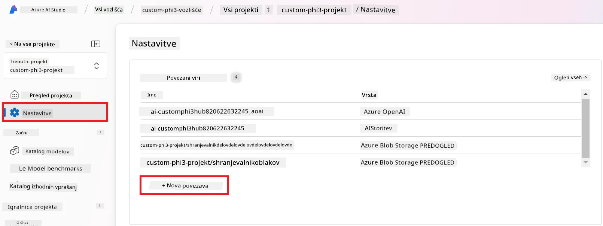

1. Izberite **Ključi po meri** v navigacijskem meniju.

    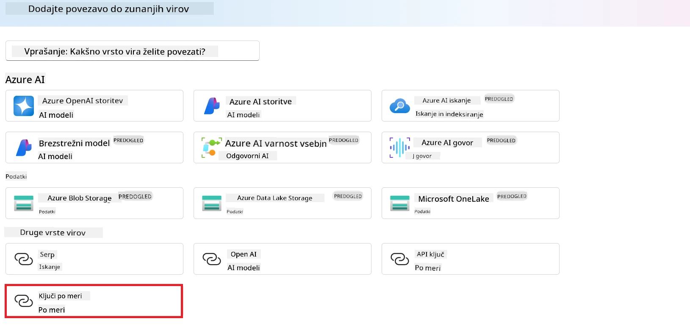

1. Opravite naslednje naloge:

    - Izberite **+ Dodaj pare ključ vrednost**.
    - Za ime ključa vnesite **endpoint** in prilepite endpoint, ki ste ga kopirali iz Azure ML Studio v polje vrednosti.
    - Ponovno izberite **+ Dodaj pare ključ vrednost**.
    - Za ime ključa vnesite **key** in prilepite ključ, ki ste ga kopirali iz Azure ML Studio v polje vrednosti.
    - Po dodajanju ključev izberite **je skrivnost**, da preprečite razkritje ključa.

    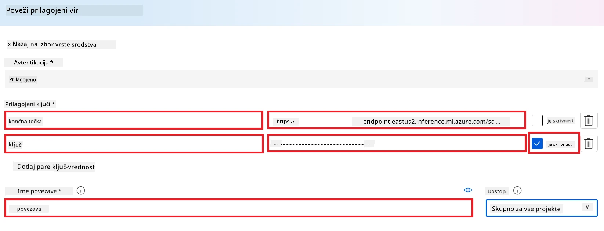

1. Izberite **Dodaj povezavo**.

#### Ustvari Prompt flow

Dodali ste po meri povezavo v Azure AI Foundry. Zdaj ustvarimo Prompt flow z naslednjimi koraki. Nato boste to Prompt flow povezali s po meri povezavo, da boste lahko uporabili fino nastavljeni model znotraj Prompt flow.

1. Pomaknite se do projekta Azure AI Foundry, ki ste ga ustvarili.

1. Izberite **Prompt flow** na levi strani zavihka.

1. Izberite **+ Ustvari** v navigacijskem meniju.

    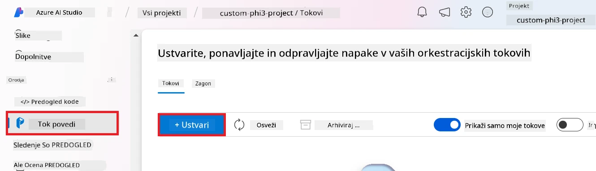

1. Izberite **Chat flow** v navigacijskem meniju.

    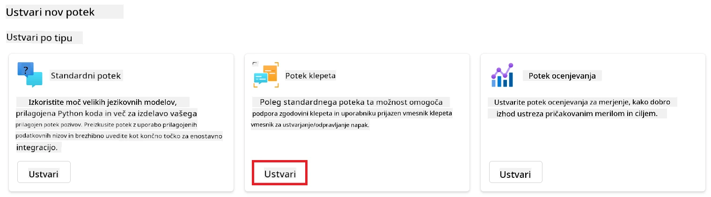

1. Vnesite **Ime mape** za uporabo.

    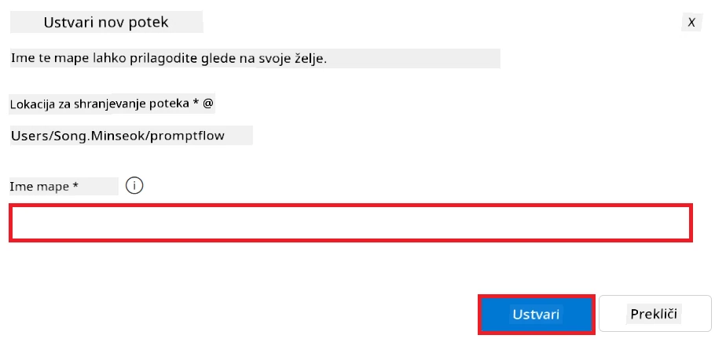

2. Izberite **Ustvari**.

#### Nastavite Prompt flow za pogovor z vašim prilagojenim modelom Phi-3

Potrebno je integrirati fino nastavljeni model Phi-3 v Prompt flow. Vendar obstoječi Prompt flow ni zasnovan za ta namen. Zato morate Prompt flow preoblikovati, da omogočite integracijo prilagojenega modela.

1. V Prompt flow izvedite naslednje naloge za ponovno izgradnjo obstoječe poti:

    - Izberite **Način nepredelanih datotek**.
    - Izbrišite vse obstoječe kode v datoteki *flow.dag.yml*.
    - Dodajte naslednjo kodo v datoteko *flow.dag.yml*.

        ```yml
        inputs:
          input_data:
            type: string
            default: "Who founded Microsoft?"

        outputs:
          answer:
            type: string
            reference: ${integrate_with_promptflow.output}

        nodes:
        - name: integrate_with_promptflow
          type: python
          source:
            type: code
            path: integrate_with_promptflow.py
          inputs:
            input_data: ${inputs.input_data}
        ```

    - Izberite **Shrani**.

    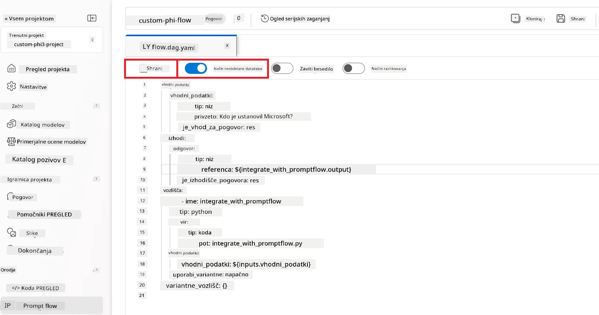

1. Dodajte naslednjo kodo v datoteko *integrate_with_promptflow.py* za uporabo prilagojenega modela Phi-3 v Prompt flow.

    ```python
    import logging
    import requests
    from promptflow import tool
    from promptflow.connections import CustomConnection

    # Nastavitev beleženja
    logging.basicConfig(
        format="%(asctime)s - %(levelname)s - %(name)s - %(message)s",
        datefmt="%Y-%m-%d %H:%M:%S",
        level=logging.DEBUG
    )
    logger = logging.getLogger(__name__)

    def query_phi3_model(input_data: str, connection: CustomConnection) -> str:
        """
        Send a request to the Phi-3 model endpoint with the given input data using Custom Connection.
        """

        # "connection" je ime po meri povezave, "endpoint", "key" so ključi v po meri povezavi
        endpoint_url = connection.endpoint
        api_key = connection.key

        headers = {
            "Content-Type": "application/json",
            "Authorization": f"Bearer {api_key}"
        }
        data = {
            "input_data": {
                "input_string": [
                    {"role": "user", "content": input_data}
                ],
                "parameters": {
                    "temperature": 0.7,
                    "max_new_tokens": 128
                }
            }
        }
        try:
            response = requests.post(endpoint_url, json=data, headers=headers)
            response.raise_for_status()
            
            # Beleži celoten JSON odgovor
            logger.debug(f"Full JSON response: {response.json()}")

            result = response.json()["output"]
            logger.info("Successfully received response from Azure ML Endpoint.")
            return result
        except requests.exceptions.RequestException as e:
            logger.error(f"Error querying Azure ML Endpoint: {e}")
            raise

    @tool
    def my_python_tool(input_data: str, connection: CustomConnection) -> str:
        """
        Tool function to process input data and query the Phi-3 model.
        """
        return query_phi3_model(input_data, connection)

    ```

    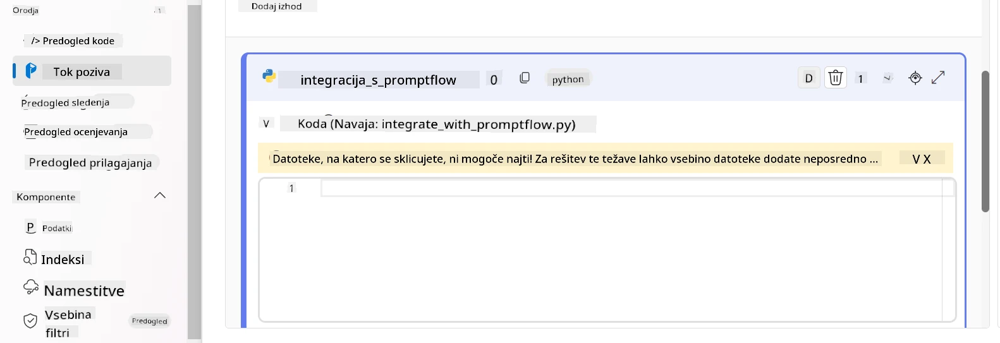

> [!NOTE]
> Za bolj podrobne informacije o uporabi Prompt flow v Azure AI Foundry, lahko pogledate [Prompt flow v Azure AI Foundry](https://learn.microsoft.com/azure/ai-studio/how-to/prompt-flow).

1. Izberite **Vhod za pogovor**, **Izhod za pogovor**, da omogočite pogovor z vašim modelom.

    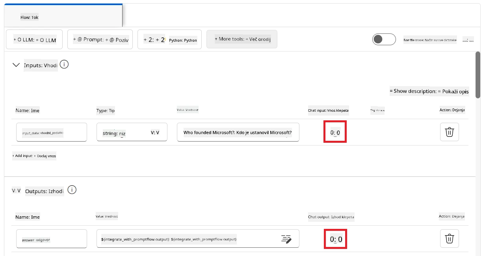

1. Zdaj ste pripravljeni za pogovor z vašim prilagojenim modelom Phi-3. V naslednji vaji se boste naučili, kako zagnati Prompt flow in ga uporabiti za pogovor z vašim fino nastavljenim modelom Phi-3.

> [!NOTE]
>
> Ponovno zgrajena pot bi morala izgledati kot na spodnji sliki:
>
> 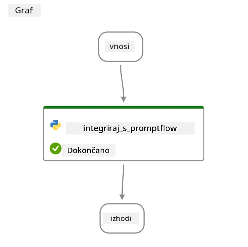
>

### Pogovor z vašim prilagojenim modelom Phi-3

Zdaj, ko ste fino nastavili in integrirali svoj prilagojeni model Phi-3 s Prompt flow, ste pripravljeni, da začnete z interakcijo z njim. Ta vaja vas bo vodila skozi postopek nastavitev in začetka pogovora z vašim modelom preko Prompt flow. Z upoštevanjem teh korakov boste lahko v celoti izkoristili zmogljivosti vašega fino nastavljenega modela Phi-3 za različne naloge in pogovore.

- Pogovorite se z vašim prilagojenim modelom Phi-3 z uporabo Prompt flow.

#### Zaženi Prompt flow

1. Izberite **Zaženi seje izračunavanja**, da zaženete Prompt flow.

    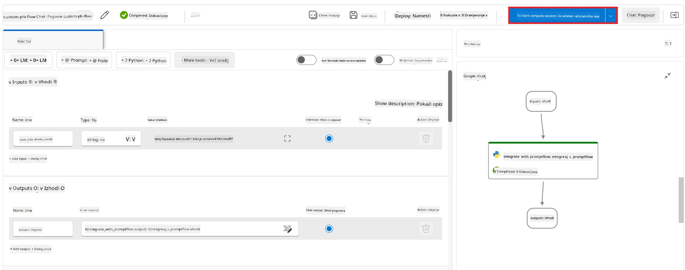

1. Izberite **Preveri in razčleni vhod**, da osvežite parametre.

    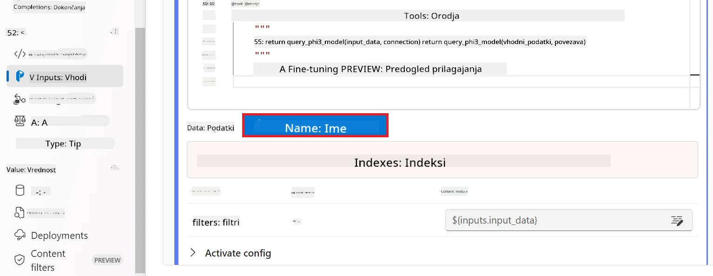

1. Izberite vrednost **povezave** za povezavo, ki ste jo ustvarili po meri. Na primer, *connection*.

    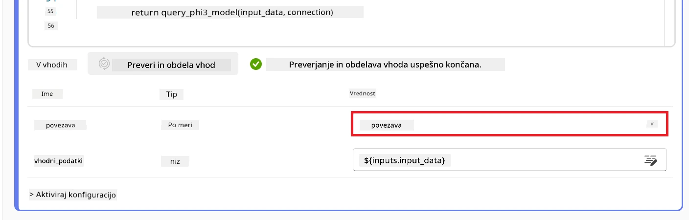

#### Pogovor z vašim prilagojenim modelom

1. Izberite **Pogovor**.

    

1. Tukaj je primer rezultatov: Zdaj se lahko pogovarjate z vašim prilagojenim modelom Phi-3. Priporočljivo je zastavljati vprašanja na podlagi podatkov, uporabljenih za fino nastavljanje.

    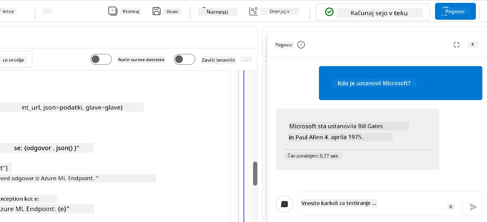

---

<!-- CO-OP TRANSLATOR DISCLAIMER START -->
**Opozorilo**:
Ta dokument je bil preveden z uporabo storitve za avtomatski prevod AI [Co-op Translator](https://github.com/Azure/co-op-translator). Čeprav si prizadevamo za natančnost, vas prosimo, da upoštevate, da avtomatizirani prevodi lahko vsebujejo napake ali netočnosti. Izvirni dokument v njegovem prvotnem jeziku velja za avtoritativni vir. Za kritične informacije priporočamo strokovni človeški prevod. Nismo odgovorni za kakršne koli nesporazume ali napačne interpretacije, ki bi lahko nastale zaradi uporabe tega prevoda.
<!-- CO-OP TRANSLATOR DISCLAIMER END -->