<!--
CO_OP_TRANSLATOR_METADATA:
{
  "original_hash": "ecbd9179a21edbaafaf114d47f09f3e3",
  "translation_date": "2025-05-09T18:28:26+00:00",
  "source_file": "md/02.Application/01.TextAndChat/Phi3/E2E_Phi-3-FineTuning_PromptFlow_Integration_AIFoundry.md",
  "language_code": "sl"
}
-->
# Fine-tune and Integrate custom Phi-3 models with Prompt flow in Azure AI Foundry

This end-to-end (E2E) example is based on the guide "[Fine-Tune and Integrate Custom Phi-3 Models with Prompt Flow in Azure AI Foundry](https://techcommunity.microsoft.com/t5/educator-developer-blog/fine-tune-and-integrate-custom-phi-3-models-with-prompt-flow-in/ba-p/4191726?WT.mc_id=aiml-137032-kinfeylo)" from Microsoft Tech Community. It covers the steps to fine-tune, deploy, and integrate custom Phi-3 models with Prompt flow in Azure AI Foundry.  
Unlike the E2E example "[Fine-Tune and Integrate Custom Phi-3 Models with Prompt Flow](./E2E_Phi-3-FineTuning_PromptFlow_Integration.md)" which involved running code locally, this tutorial focuses solely on fine-tuning and integrating your model within Azure AI / ML Studio.

## Overview

In this E2E example, you will learn how to fine-tune the Phi-3 model and integrate it with Prompt flow in Azure AI Foundry. Using Azure AI / ML Studio, you will create a workflow to deploy and use custom AI models. This E2E example is split into three scenarios:

**Scenario 1: Set up Azure resources and Prepare for fine-tuning**

**Scenario 2: Fine-tune the Phi-3 model and Deploy in Azure Machine Learning Studio**

**Scenario 3: Integrate with Prompt flow and Chat with your custom model in Azure AI Foundry**

Below is an overview of this E2E example.


### Table of Contents

1. **[Scenario 1: Set up Azure resources and Prepare for fine-tuning](../../../../../../md/02.Application/01.TextAndChat/Phi3)**
    - [Create an Azure Machine Learning Workspace](../../../../../../md/02.Application/01.TextAndChat/Phi3)
    - [Request GPU quotas in Azure Subscription](../../../../../../md/02.Application/01.TextAndChat/Phi3)
    - [Add role assignment](../../../../../../md/02.Application/01.TextAndChat/Phi3)
    - [Set up project](../../../../../../md/02.Application/01.TextAndChat/Phi3)
    - [Prepare dataset for fine-tuning](../../../../../../md/02.Application/01.TextAndChat/Phi3)

1. **[Scenario 2: Fine-tune Phi-3 model and Deploy in Azure Machine Learning Studio](../../../../../../md/02.Application/01.TextAndChat/Phi3)**
    - [Fine-tune the Phi-3 model](../../../../../../md/02.Application/01.TextAndChat/Phi3)
    - [Deploy the fine-tuned Phi-3 model](../../../../../../md/02.Application/01.TextAndChat/Phi3)

1. **[Scenario 3: Integrate with Prompt flow and Chat with your custom model in Azure AI Foundry](../../../../../../md/02.Application/01.TextAndChat/Phi3)**
    - [Integrate the custom Phi-3 model with Prompt flow](../../../../../../md/02.Application/01.TextAndChat/Phi3)
    - [Chat with your custom Phi-3 model](../../../../../../md/02.Application/01.TextAndChat/Phi3)

## Scenario 1: Set up Azure resources and Prepare for fine-tuning

### Create an Azure Machine Learning Workspace

1. Type *azure machine learning* in the **search bar** at the top of the portal page and choose **Azure Machine Learning** from the results.

    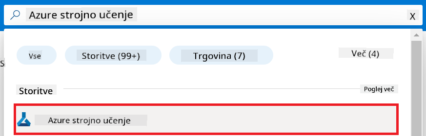

2. Click **+ Create** in the navigation menu.

3. Choose **New workspace** from the navigation menu.

    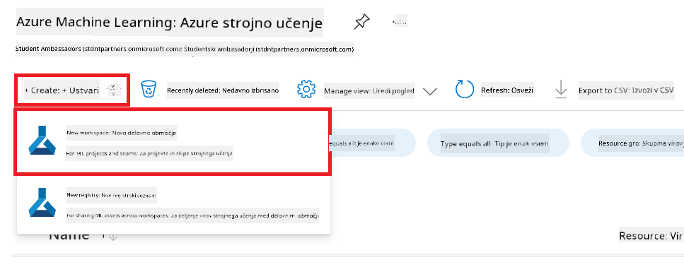

4. Complete the following:

    - Select your Azure **Subscription**.
    - Choose the **Resource group** to use (or create a new one).
    - Enter a unique **Workspace Name**.
    - Select the desired **Region**.
    - Choose the **Storage account** to use (or create a new one).
    - Select the **Key vault** to use (or create a new one).
    - Select the **Application insights** to use (or create a new one).
    - Choose the **Container registry** to use (or create a new one).

    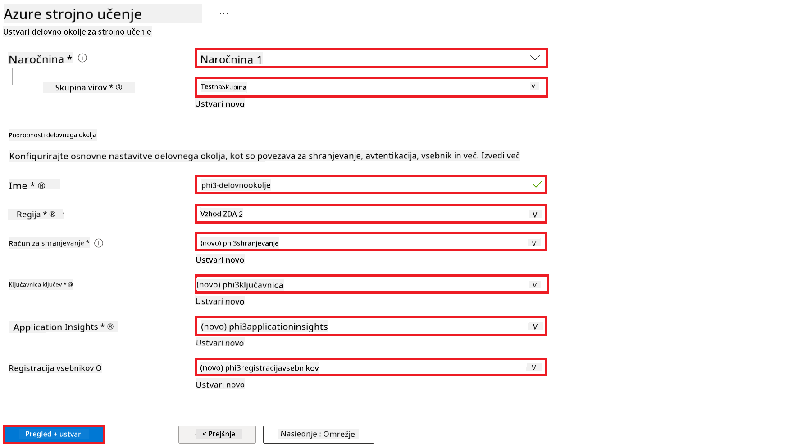

5. Click **Review + Create**.

6. Click **Create**.

### Request GPU quotas in Azure Subscription

In this tutorial, you'll fine-tune and deploy a Phi-3 model using GPUs. For fine-tuning, you'll use the *Standard_NC24ads_A100_v4* GPU, which requires a quota request. For deployment, you'll use the *Standard_NC6s_v3* GPU, which also requires a quota request.

> [!NOTE]
>
> Only Pay-As-You-Go subscriptions (standard subscription type) qualify for GPU allocation; benefit subscriptions are not supported at this time.
>

1. Visit [Azure ML Studio](https://ml.azure.com/home?wt.mc_id=studentamb_279723).

1. To request *Standard NCADSA100v4 Family* quota:

    - Select **Quota** from the left tab.
    - Choose the **Virtual machine family**. For example, select **Standard NCADSA100v4 Family Cluster Dedicated vCPUs**, which includes the *Standard_NC24ads_A100_v4* GPU.
    - Click **Request quota** in the navigation menu.

        

    - On the Request quota page, enter the desired **New cores limit**, e.g., 24.
    - Click **Submit** to send the quota request.

1. To request *Standard NCSv3 Family* quota:

    - Select **Quota** from the left tab.
    - Choose the **Virtual machine family**. For example, select **Standard NCSv3 Family Cluster Dedicated vCPUs**, which includes the *Standard_NC6s_v3* GPU.
    - Click **Request quota** in the navigation menu.
    - Enter the desired **New cores limit**, e.g., 24.
    - Click **Submit** to send the quota request.

### Add role assignment

To fine-tune and deploy your models, you need to create a User Assigned Managed Identity (UAI) and assign it the correct permissions. This UAI will be used for authentication during deployment.

#### Create User Assigned Managed Identity(UAI)

1. Type *managed identities* in the **search bar** at the top of the portal and select **Managed Identities** from the results.

    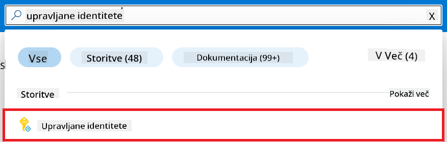

1. Click **+ Create**.

    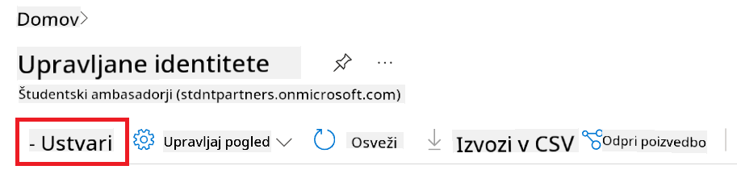

1. Fill in the following:

    - Select your Azure **Subscription**.
    - Choose the **Resource group** to use (or create a new one).
    - Select the **Region** you want.
    - Enter a unique **Name**.

    

1. Click **Review + create**.

1. Click **+ Create**.

#### Add Contributor role assignment to Managed Identity

1. Go to the Managed Identity resource you created.

1. Select **Azure role assignments** from the left tab.

1. Click **+ Add role assignment** in the navigation menu.

1. On the Add role assignment page, do the following:
    - Set **Scope** to **Resource group**.
    - Select your Azure **Subscription**.
    - Choose the **Resource group**.
    - Select **Role** as **Contributor**.

    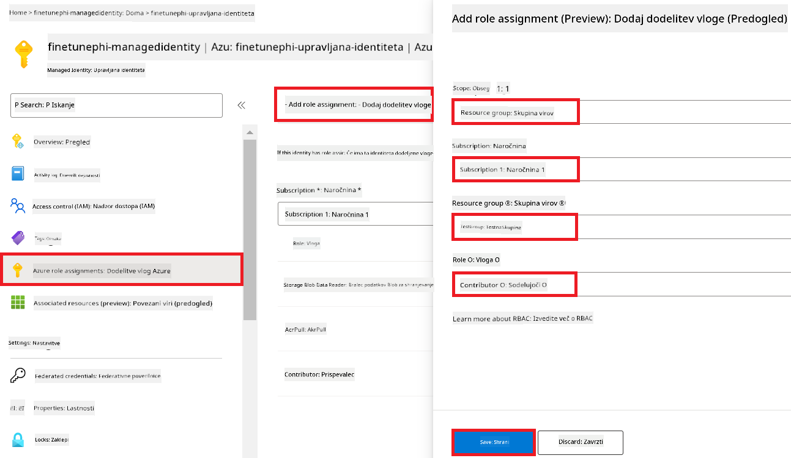

2. Click **Save**.

#### Add Storage Blob Data Reader role assignment to Managed Identity

1. Type *storage accounts* in the **search bar** and select **Storage accounts** from the results.

    

1. Select the storage account linked to your Azure Machine Learning workspace, for example, *finetunephistorage*.

1. To navigate to Add role assignment page:

    - Open the Azure Storage account you created.
    - Select **Access Control (IAM)** from the left tab.
    - Click **+ Add** in the navigation menu.
    - Choose **Add role assignment**.

    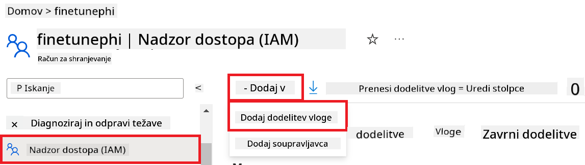

1. On the Add role assignment page, do the following:

    - In the Role page, type *Storage Blob Data Reader* in the **search bar** and select **Storage Blob Data Reader**.
    - Click **Next**.
    - In the Members page, select **Assign access to** **Managed identity**.
    - Click **+ Select members**.
    - In the Select managed identities page, choose your Azure **Subscription**.
    - Select the **Managed identity** option.
    - Choose the Managed Identity you created, for example, *finetunephi-managedidentity*.
    - Click **Select**.

    

1. Click **Review + assign**.

#### Add AcrPull role assignment to Managed Identity

1. Type *container registries* in the **search bar** and select **Container registries** from the results.

    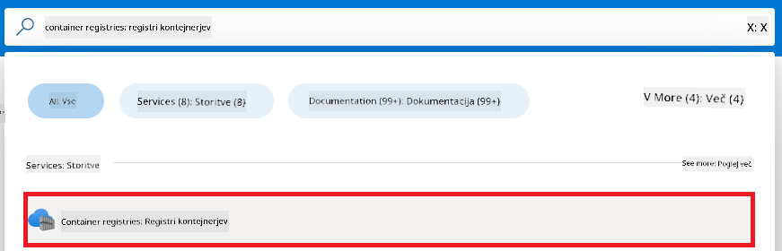

1. Select the container registry linked to your Azure Machine Learning workspace, e.g., *finetunephicontainerregistry*.

1. To navigate to Add role assignment page:

    - Select **Access Control (IAM)** from the left tab.
    - Click **+ Add** in the navigation menu.
    - Choose **Add role assignment**.

1. On the Add role assignment page, do the following:

    - In the Role page, type *AcrPull* in the **search bar** and select **AcrPull**.
    - Click **Next**.
    - In the Members page, select **Assign access to** **Managed identity**.
    - Click **+ Select members**.
    - Select your Azure **Subscription**.
    - Choose the **Managed identity** option.
    - Select the Managed Identity you created, e.g., *finetunephi-managedidentity*.
    - Click **Select**.
    - Click **Review + assign**.

### Set up project

To download the datasets needed for fine-tuning, set up a local environment.

In this exercise, you will:

- Create a working folder.
- Create a virtual environment.
- Install the necessary packages.
- Create a *download_dataset.py* file to download the dataset.

#### Create a folder to work inside it

1. Open a terminal and run the following command to create a folder named *finetune-phi* in the default path.

    ```console
    mkdir finetune-phi
    ```

2. Run the following command to navigate to the *finetune-phi* folder.

    ```console
    cd finetune-phi
    ```

#### Create a virtual environment

1. Run the following command to create a virtual environment named *.venv*.

    ```console
    python -m venv .venv
    ```

2. Activate the virtual environment by running:

    ```console
    .venv\Scripts\activate.bat
    ```

> [!NOTE]
> If successful, you should see *(.venv)* before your command prompt.

#### Install the required packages

1. Run the following commands to install the required packages.

    ```console
    pip install datasets==2.19.1
    ```

#### Create `download_dataset.py`

> [!NOTE]
> Complete folder structure:
>
> ```text
> └── YourUserName
> .    └── finetune-phi
> .        └── download_dataset.py
> ```

1. Open **Visual Studio Code**.

1. From the menu bar, select **File**.

1. Select **Open Folder**.

1. Choose the *finetune-phi* folder you created, located at *C:\Users\yourUserName\finetune-phi*.

    

1. In the left pane, right-click and select **New File** to create *download_dataset.py*.

    

### Prepare dataset for fine-tuning

In this exercise, you will run *download_dataset.py* to download the *ultrachat_200k* datasets to your local environment. You will then use these datasets to fine-tune the Phi-3 model in Azure Machine Learning.

In this exercise, you will:

- Add code to *download_dataset.py* to download the datasets.
- Run *download_dataset.py* to download datasets locally.

#### Download your dataset using *download_dataset.py*

1. Open *download_dataset.py* in Visual Studio Code.

1. Add the following code to *download_dataset.py*.

    ```python
    import json
    import os
    from datasets import load_dataset

    def load_and_split_dataset(dataset_name, config_name, split_ratio):
        """
        Load and split a dataset.
        """
        # Load the dataset with the specified name, configuration, and split ratio
        dataset = load_dataset(dataset_name, config_name, split=split_ratio)
        print(f"Original dataset size: {len(dataset)}")
        
        # Split the dataset into train and test sets (80% train, 20% test)
        split_dataset = dataset.train_test_split(test_size=0.2)
        print(f"Train dataset size: {len(split_dataset['train'])}")
        print(f"Test dataset size: {len(split_dataset['test'])}")
        
        return split_dataset

    def save_dataset_to_jsonl(dataset, filepath):
        """
        Save a dataset to a JSONL file.
        """
        # Create the directory if it does not exist
        os.makedirs(os.path.dirname(filepath), exist_ok=True)
        
        # Open the file in write mode
        with open(filepath, 'w', encoding='utf-8') as f:
            # Iterate over each record in the dataset
            for record in dataset:
                # Dump the record as a JSON object and write it to the file
                json.dump(record, f)
                # Write a newline character to separate records
                f.write('\n')
        
        print(f"Dataset saved to {filepath}")

    def main():
        """
        Main function to load, split, and save the dataset.
        """
        # Load and split the ULTRACHAT_200k dataset with a specific configuration and split ratio
        dataset = load_and_split_dataset("HuggingFaceH4/ultrachat_200k", 'default', 'train_sft[:1%]')
        
        # Extract the train and test datasets from the split
        train_dataset = dataset['train']
        test_dataset = dataset['test']

        # Save the train dataset to a JSONL file
        save_dataset_to_jsonl(train_dataset, "data/train_data.jsonl")
        
        # Save the test dataset to a separate JSONL file
        save_dataset_to_jsonl(test_dataset, "data/test_data.jsonl")

    if __name__ == "__main__":
        main()

    ```

1. Run the following command in your terminal to execute the script and download the dataset locally.

    ```console
    python download_dataset.py
    ```

1. Confirm that the datasets were saved successfully in your local *finetune-phi/data* directory.

> [!NOTE]
>
> #### Note on dataset size and fine-tuning time
>
> In this tutorial, only 1% of the dataset is used (`split='train[:1%]'`). This greatly reduces the data size, speeding up upload and fine-tuning. You can adjust this percentage to balance training time and model performance. Using a smaller dataset subset shortens fine-tuning time, making it more manageable for this tutorial.

## Scenario 2: Fine-tune Phi-3 model and Deploy in Azure Machine Learning Studio

### Fine-tune the Phi-3 model

In this exercise, you will fine-tune the Phi-3 model in Azure Machine Learning Studio.

In this exercise, you will:

- Create a compute cluster for fine-tuning.
- Fine-tune the Phi-3 model in Azure Machine Learning Studio.

#### Create computer cluster for fine-tuning
1. Obiščite [Azure ML Studio](https://ml.azure.com/home?wt.mc_id=studentamb_279723).

1. Izberite **Compute** na levi strani zavihka.

1. Izberite **Compute clusters** v navigacijskem meniju.

1. Izberite **+ New**.

    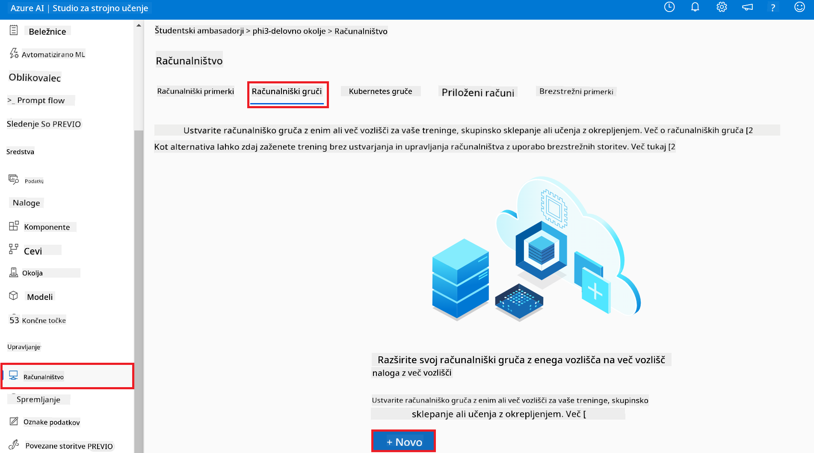

1. Izvedite naslednje naloge:

    - Izberite **Region**, ki ga želite uporabiti.
    - Nastavite **Virtual machine tier** na **Dedicated**.
    - Nastavite **Virtual machine type** na **GPU**.
    - Pri filtru **Virtual machine size** izberite **Select from all options**.
    - Izberite **Virtual machine size** na **Standard_NC24ads_A100_v4**.

    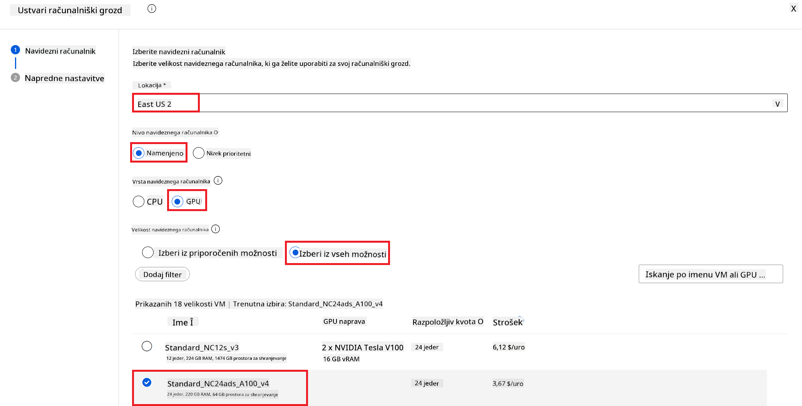

1. Izberite **Next**.

1. Izvedite naslednje naloge:

    - Vnesite **Compute name**. Mora biti edinstvena vrednost.
    - Nastavite **Minimum number of nodes** na **0**.
    - Nastavite **Maximum number of nodes** na **1**.
    - Nastavite **Idle seconds before scale down** na **120**.

    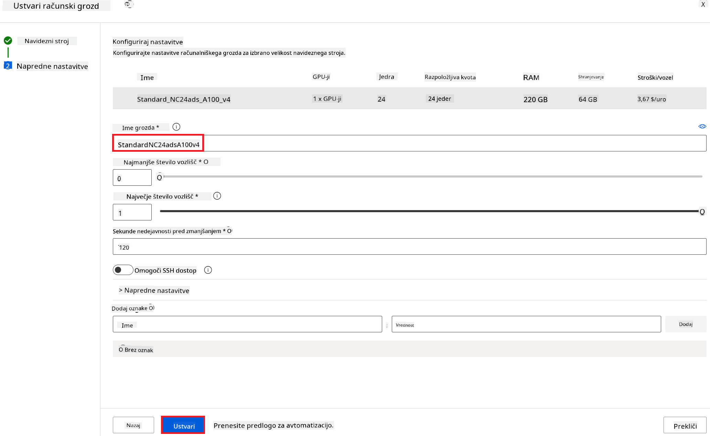

1. Izberite **Create**.

#### Prilagodite model Phi-3

1. Obiščite [Azure ML Studio](https://ml.azure.com/home?wt.mc_id=studentamb_279723).

1. Izberite Azure Machine Learning delovno okolje, ki ste ga ustvarili.

    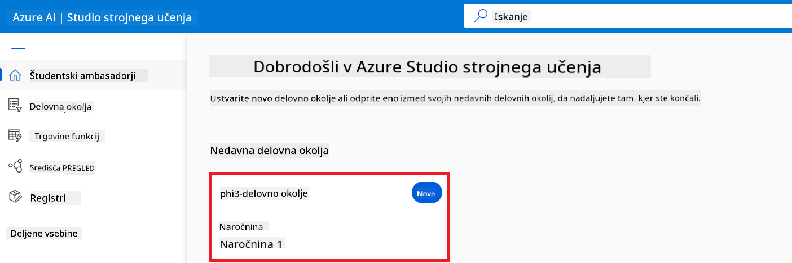

1. Izvedite naslednje naloge:

    - Izberite **Model catalog** na levi strani zavihka.
    - V iskalno vrstico vpišite *phi-3-mini-4k* in izberite **Phi-3-mini-4k-instruct** iz prikazanih možnosti.

    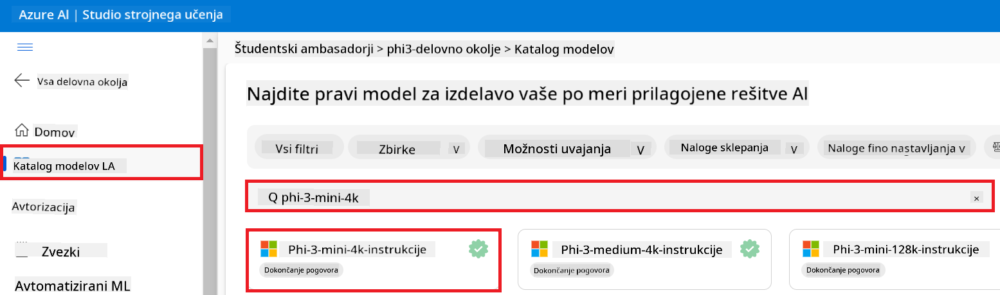

1. Izberite **Fine-tune** v navigacijskem meniju.

    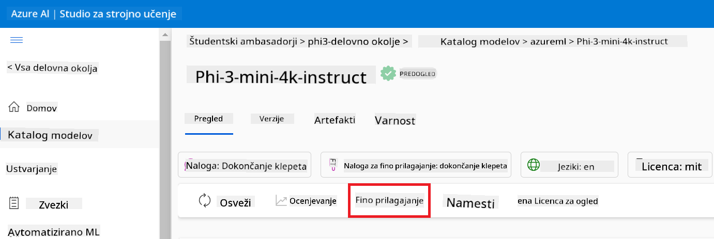

1. Izvedite naslednje naloge:

    - Nastavite **Select task type** na **Chat completion**.
    - Izberite **+ Select data** za nalaganje **Traning data**.
    - Pri nalaganju validacijskih podatkov izberite **Provide different validation data**.
    - Izberite **+ Select data** za nalaganje **Validation data**.

    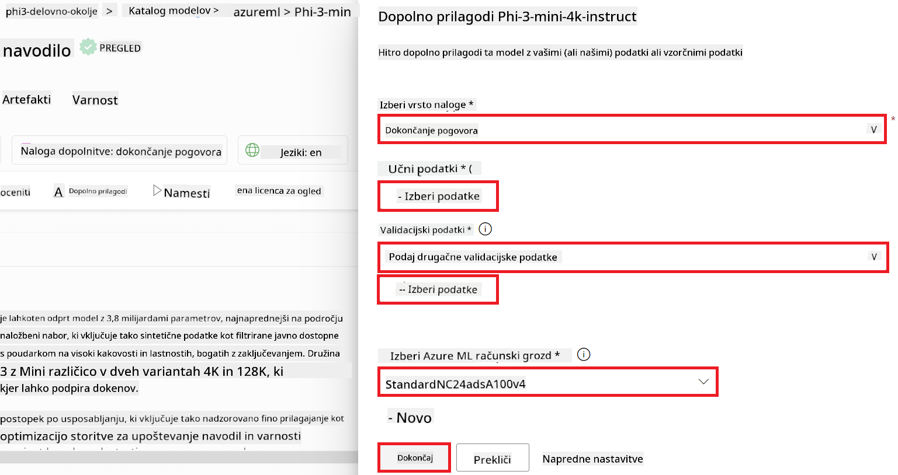

    > [!TIP]
    >
    > Lahko izberete **Advanced settings** za prilagoditev nastavitev, kot so **learning_rate** in **lr_scheduler_type**, da optimizirate proces prilagajanja glede na vaše potrebe.

1. Izberite **Finish**.

1. V tej vaji ste uspešno prilagodili model Phi-3 z uporabo Azure Machine Learning. Upoštevajte, da lahko postopek prilagajanja traja precej časa. Po zagonu naloge za prilagajanje morate počakati, da se dokonča. Status naloge lahko spremljate v zavihku Jobs na levi strani vašega Azure Machine Learning delovnega okolja. V naslednji seriji boste model namestili in ga povezali s Prompt flow.

    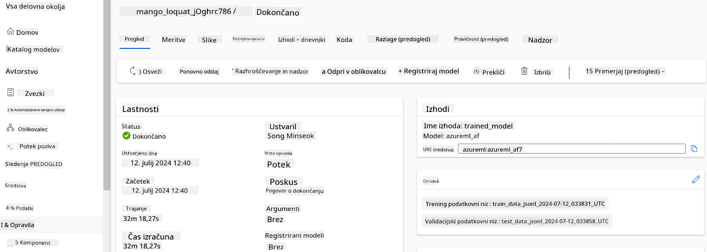

### Namestite prilagojeni model Phi-3

Za integracijo prilagojenega modela Phi-3 s Prompt flow morate model namestiti, da bo dostopen za realnočasovno napovedovanje. Ta postopek vključuje registracijo modela, ustvarjanje spletne končne točke in namestitev modela.

V tej vaji boste:

- Registrirali prilagojeni model v Azure Machine Learning delovnem okolju.
- Ustvarili spletno končno točko.
- Namestili registrirani prilagojeni model Phi-3.

#### Registrirajte prilagojeni model

1. Obiščite [Azure ML Studio](https://ml.azure.com/home?wt.mc_id=studentamb_279723).

1. Izberite Azure Machine Learning delovno okolje, ki ste ga ustvarili.

    

1. Izberite **Models** na levi strani zavihka.
1. Izberite **+ Register**.
1. Izberite **From a job output**.

    

1. Izberite nalogo, ki ste jo ustvarili.

    

1. Izberite **Next**.

1. Nastavite **Model type** na **MLflow**.

1. Preverite, da je izbran **Job output**; to bi moralo biti izbrano samodejno.

    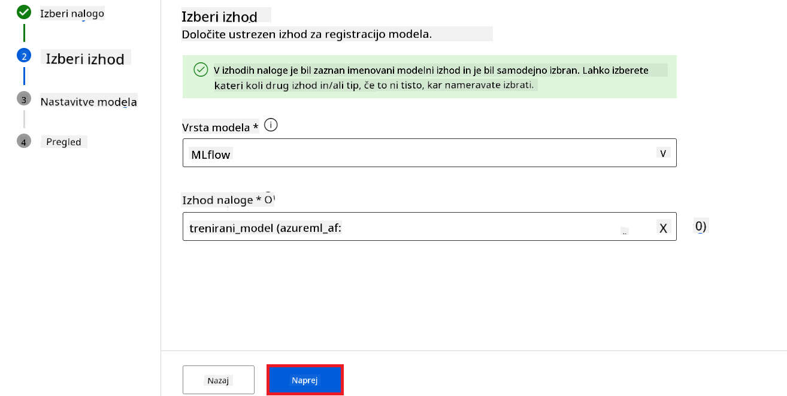

2. Izberite **Next**.

3. Izberite **Register**.

    

4. Vaš registrirani model si lahko ogledate v meniju **Models** na levi strani zavihka.

    

#### Namestite prilagojeni model

1. Pojdite v Azure Machine Learning delovno okolje, ki ste ga ustvarili.

1. Izberite **Endpoints** na levi strani zavihka.

1. Izberite **Real-time endpoints** v navigacijskem meniju.

    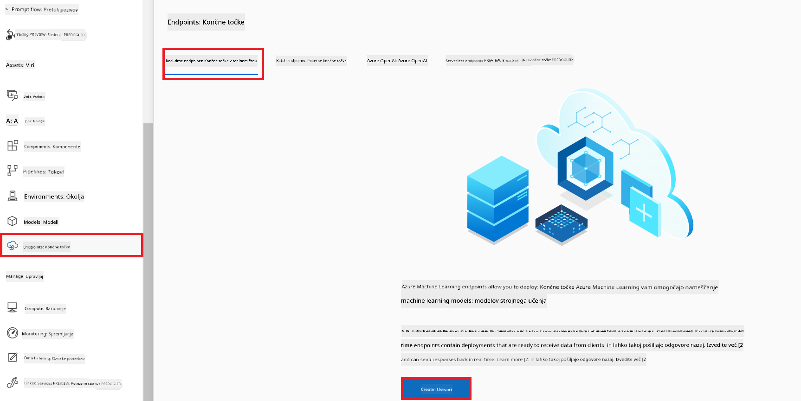

1. Izberite **Create**.

1. Izberite registrirani model, ki ste ga ustvarili.

    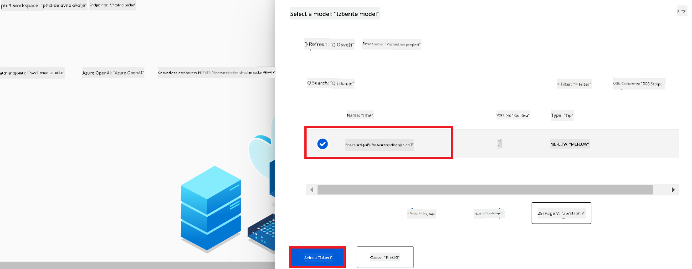

1. Izberite **Select**.

1. Izvedite naslednje naloge:

    - Nastavite **Virtual machine** na *Standard_NC6s_v3*.
    - Izberite **Instance count**, ki ga želite uporabiti, na primer *1*.
    - Nastavite **Endpoint** na **New** za ustvarjanje nove končne točke.
    - Vnesite **Endpoint name**. Mora biti edinstvena vrednost.
    - Vnesite **Deployment name**. Mora biti edinstvena vrednost.

    

1. Izberite **Deploy**.

> [!WARNING]
> Da se izognete dodatnim stroškom, ne pozabite izbrisati ustvarjene končne točke v Azure Machine Learning delovnem okolju.
>

#### Preverite stanje namestitve v Azure Machine Learning delovnem okolju

1. Pojdite v Azure Machine Learning delovno okolje, ki ste ga ustvarili.

1. Izberite **Endpoints** na levi strani zavihka.

1. Izberite končno točko, ki ste jo ustvarili.

    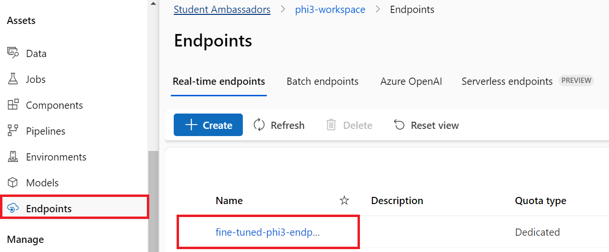

1. Na tej strani lahko upravljate končne točke med postopkom namestitve.

> [!NOTE]
> Ko je namestitev zaključena, preverite, da je **Live traffic** nastavljen na **100%**. Če ni, izberite **Update traffic** za prilagoditev nastavitev prometa. Modela ne morete testirati, če je promet nastavljen na 0%.
>
> 
>

## Scenarij 3: Integracija s Prompt flow in pogovor s prilagojenim modelom v Azure AI Foundry

### Integrirajte prilagojeni model Phi-3 s Prompt flow

Po uspešni namestitvi prilagojenega modela ga lahko zdaj povežete s Prompt Flow za uporabo v realnočasovnih aplikacijah, kar omogoča različne interaktivne naloge s prilagojenim modelom Phi-3.

V tej vaji boste:

- Ustvarili Azure AI Foundry Hub.
- Ustvarili Azure AI Foundry projekt.
- Ustvarili Prompt flow.
- Dodali prilagojeno povezavo za prilagojeni model Phi-3.
- Nastavili Prompt flow za pogovor s prilagojenim modelom Phi-3.

> [!NOTE]
> Prav tako lahko integrirate s Promptflow z uporabo Azure ML Studio. Enak postopek integracije velja tudi za Azure ML Studio.

#### Ustvarite Azure AI Foundry Hub

Hub morate ustvariti pred ustvarjanjem projekta. Hub deluje kot Resource Group, ki omogoča organizacijo in upravljanje več projektov znotraj Azure AI Foundry.

1. Obiščite [Azure AI Foundry](https://ai.azure.com/?WT.mc_id=aiml-137032-kinfeylo).

1. Izberite **All hubs** na levi strani zavihka.

1. Izberite **+ New hub** v navigacijskem meniju.

    

1. Izvedite naslednje naloge:

    - Vnesite **Hub name**. Mora biti edinstvena vrednost.
    - Izberite svojo Azure **Subscription**.
    - Izberite **Resource group**, ki jo želite uporabiti (po potrebi ustvarite novo).
    - Izberite **Location**, ki jo želite uporabiti.
    - Izberite **Connect Azure AI Services** (po potrebi ustvarite novo).
    - Nastavite **Connect Azure AI Search** na **Skip connecting**.

    

1. Izberite **Next**.

#### Ustvarite Azure AI Foundry projekt

1. V Hubu, ki ste ga ustvarili, izberite **All projects** na levi strani zavihka.

1. Izberite **+ New project** v navigacijskem meniju.

    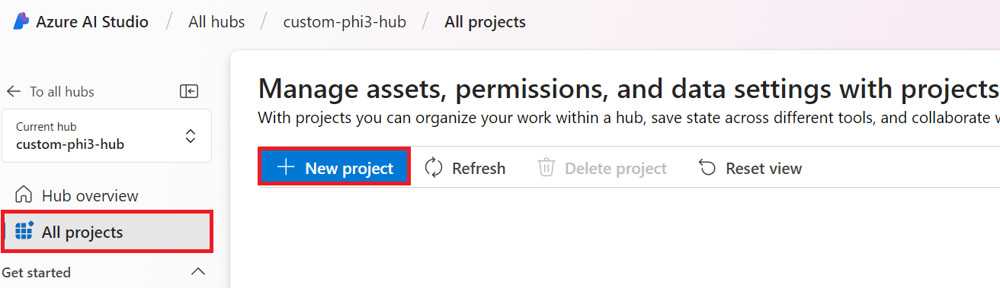

1. Vnesite **Project name**. Mora biti edinstvena vrednost.

    

1. Izberite **Create a project**.

#### Dodajte prilagojeno povezavo za prilagojeni model Phi-3

Za integracijo vašega prilagojenega modela Phi-3 s Prompt flow morate shraniti končno točko in ključ modela v prilagojeno povezavo. Ta nastavitev zagotavlja dostop do vašega prilagojenega modela Phi-3 v Prompt flow.

#### Nastavite api ključ in endpoint uri prilagojenega modela Phi-3

1. Obiščite [Azure ML Studio](https://ml.azure.com/home?WT.mc_id=aiml-137032-kinfeylo).

1. Pojdite v Azure Machine Learning delovno okolje, ki ste ga ustvarili.

1. Izberite **Endpoints** na levi strani zavihka.

    

1. Izberite končno točko, ki ste jo ustvarili.

    

1. Izberite **Consume** v navigacijskem meniju.

1. Kopirajte vaš **REST endpoint** in **Primary key**.


#### Dodaj Custom Connection

1. Obiđi [Azure AI Foundry](https://ai.azure.com/?WT.mc_id=aiml-137032-kinfeylo).

1. Otvori Azure AI Foundry projekt koji si kreirao.

1. U projektu koji si kreirao, odaberi **Settings** sa lijevog izbornika.

1. Odaberi **+ New connection**.

    

1. Odaberi **Custom keys** iz navigacijskog menija.

    

1. Izvrši sljedeće korake:

    - Odaberi **+ Add key value pairs**.
    - Za naziv ključa unesi **endpoint** i zalijepi endpoint koji si kopirao iz Azure ML Studija u polje za vrijednost.
    - Ponovo odaberi **+ Add key value pairs**.
    - Za naziv ključa unesi **key** i zalijepi ključ koji si kopirao iz Azure ML Studija u polje za vrijednost.
    - Nakon dodavanja ključeva, označi **is secret** kako bi spriječio da ključ bude vidljiv.

    

1. Odaberi **Add connection**.

#### Kreiraj Prompt flow

Dodao si custom connection u Azure AI Foundry. Sada ćemo kreirati Prompt flow slijedeći ove korake. Nakon toga, povezat ćeš ovaj Prompt flow s custom connection kako bi mogao koristiti fino podešeni model unutar Prompt flowa.

1. Otvori Azure AI Foundry projekt koji si kreirao.

1. Odaberi **Prompt flow** sa lijevog izbornika.

1. Odaberi **+ Create** iz navigacijskog menija.

    

1. Odaberi **Chat flow** iz navigacijskog menija.

    

1. Unesi **Folder name** koji želiš koristiti.

    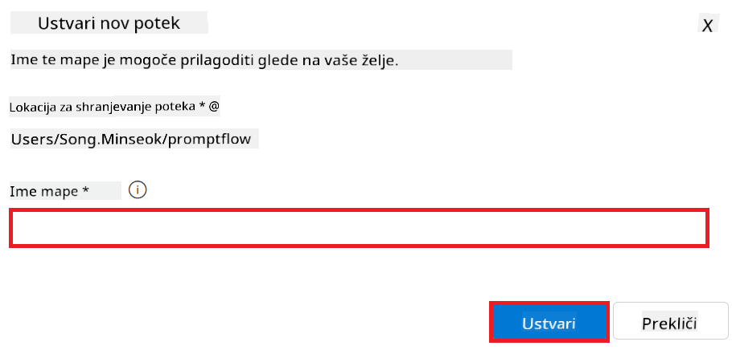

2. Odaberi **Create**.

#### Postavi Prompt flow za chat s tvojim custom Phi-3 modelom

Trebaš integrirati fino podešeni Phi-3 model u Prompt flow. No, postojeći Prompt flow nije dizajniran za to, pa ga trebaš redizajnirati kako bi omogućio integraciju custom modela.

1. U Prompt flowu napravi sljedeće da preurediš postojeći flow:

    - Odaberi **Raw file mode**.
    - Izbriši sav postojeći kod u *flow.dag.yml* datoteci.
    - Dodaj sljedeći kod u *flow.dag.yml* datoteku.

        ```yml
        inputs:
          input_data:
            type: string
            default: "Who founded Microsoft?"

        outputs:
          answer:
            type: string
            reference: ${integrate_with_promptflow.output}

        nodes:
        - name: integrate_with_promptflow
          type: python
          source:
            type: code
            path: integrate_with_promptflow.py
          inputs:
            input_data: ${inputs.input_data}
        ```

    - Odaberi **Save**.

    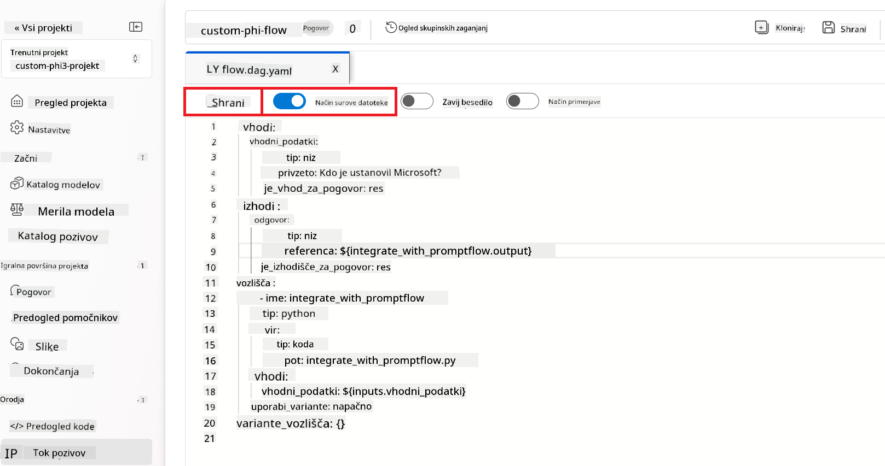

1. Dodaj sljedeći kod u *integrate_with_promptflow.py* datoteku kako bi koristio custom Phi-3 model u Prompt flowu.

    ```python
    import logging
    import requests
    from promptflow import tool
    from promptflow.connections import CustomConnection

    # Logging setup
    logging.basicConfig(
        format="%(asctime)s - %(levelname)s - %(name)s - %(message)s",
        datefmt="%Y-%m-%d %H:%M:%S",
        level=logging.DEBUG
    )
    logger = logging.getLogger(__name__)

    def query_phi3_model(input_data: str, connection: CustomConnection) -> str:
        """
        Send a request to the Phi-3 model endpoint with the given input data using Custom Connection.
        """

        # "connection" is the name of the Custom Connection, "endpoint", "key" are the keys in the Custom Connection
        endpoint_url = connection.endpoint
        api_key = connection.key

        headers = {
            "Content-Type": "application/json",
            "Authorization": f"Bearer {api_key}"
        }
        data = {
            "input_data": {
                "input_string": [
                    {"role": "user", "content": input_data}
                ],
                "parameters": {
                    "temperature": 0.7,
                    "max_new_tokens": 128
                }
            }
        }
        try:
            response = requests.post(endpoint_url, json=data, headers=headers)
            response.raise_for_status()
            
            # Log the full JSON response
            logger.debug(f"Full JSON response: {response.json()}")

            result = response.json()["output"]
            logger.info("Successfully received response from Azure ML Endpoint.")
            return result
        except requests.exceptions.RequestException as e:
            logger.error(f"Error querying Azure ML Endpoint: {e}")
            raise

    @tool
    def my_python_tool(input_data: str, connection: CustomConnection) -> str:
        """
        Tool function to process input data and query the Phi-3 model.
        """
        return query_phi3_model(input_data, connection)

    ```

    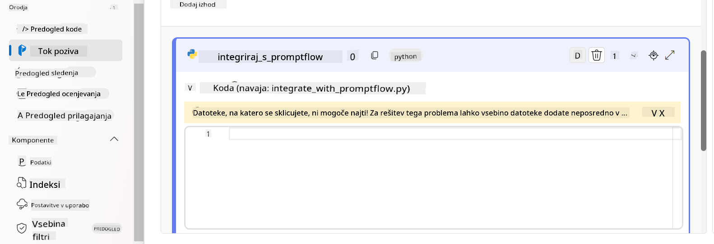

> [!NOTE]
> Za detaljnije informacije o korištenju Prompt flow u Azure AI Foundry, možeš pogledati [Prompt flow in Azure AI Foundry](https://learn.microsoft.com/azure/ai-studio/how-to/prompt-flow).

1. Odaberi **Chat input**, **Chat output** da omogućiš chat s tvojim modelom.

    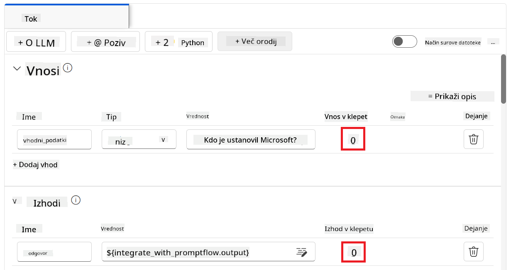

1. Sad si spreman za chat s tvojim custom Phi-3 modelom. U sljedećem zadatku naučit ćeš kako pokrenuti Prompt flow i koristiti ga za chat s tvojim fino podešenim Phi-3 modelom.

> [!NOTE]
>
> Redizajnirani flow bi trebao izgledati kao na slici ispod:
>
> 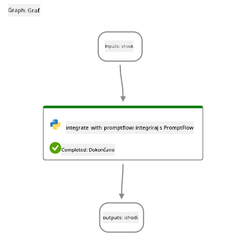
>

### Chat s tvojim custom Phi-3 modelom

Sada kada si fino podesio i integrirao svoj custom Phi-3 model s Prompt flowom, spreman si za interakciju s njim. Ovaj zadatak će te provesti kroz postavljanje i pokretanje chata s modelom koristeći Prompt flow. Slijedeći ove korake, moći ćeš u potpunosti iskoristiti mogućnosti svog fino podešenog Phi-3 modela za različite zadatke i razgovore.

- Razgovaraj s tvojim custom Phi-3 modelom koristeći Prompt flow.

#### Pokreni Prompt flow

1. Odaberi **Start compute sessions** da pokreneš Prompt flow.

    

1. Odaberi **Validate and parse input** da osvježiš parametre.

    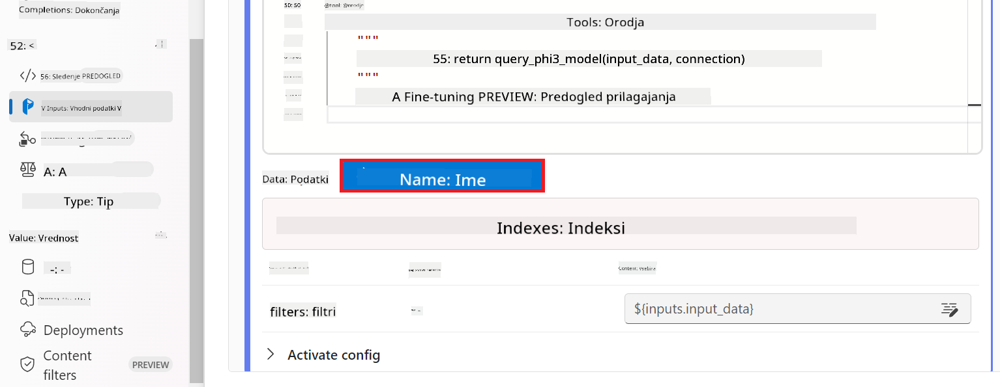

1. Odaberi **Value** kod **connection** i poveži ga s custom connection koji si kreirao, na primjer *connection*.

    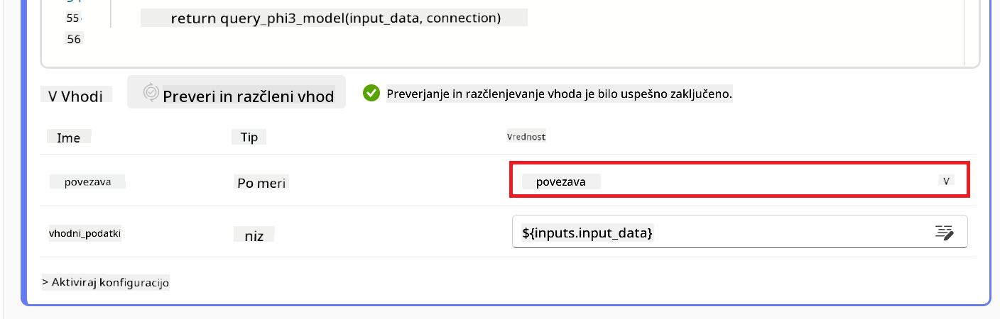

#### Chat s tvojim custom modelom

1. Odaberi **Chat**.

    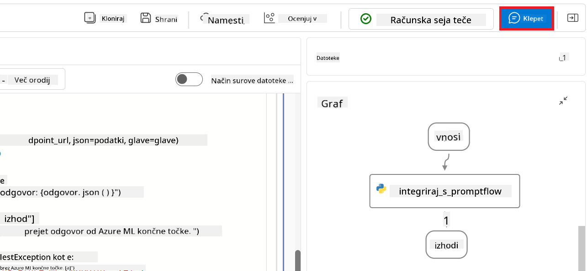

1. Evo primjera rezultata: sada možeš razgovarati sa svojim custom Phi-3 modelom. Preporučuje se postavljati pitanja vezana uz podatke korištene za fino podešavanje.

    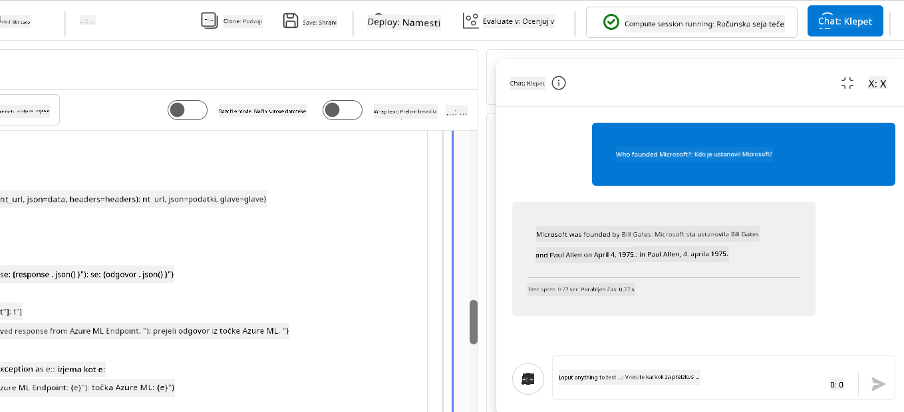

**Omejitev odgovornosti**:  
Ta dokument je bil preveden z uporabo storitve za avtomatski prevod [Co-op Translator](https://github.com/Azure/co-op-translator). Čeprav si prizadevamo za natančnost, vas prosimo, da upoštevate, da avtomatski prevodi lahko vsebujejo napake ali netočnosti. Izvirni dokument v njegovem izvirnem jeziku velja za avtoritativni vir. Za pomembne informacije priporočamo strokovni človeški prevod. Nismo odgovorni za morebitna nesporazumevanja ali napačne interpretacije, ki izhajajo iz uporabe tega prevoda.