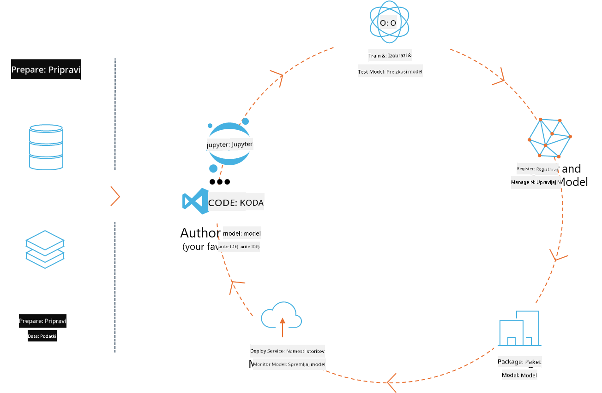
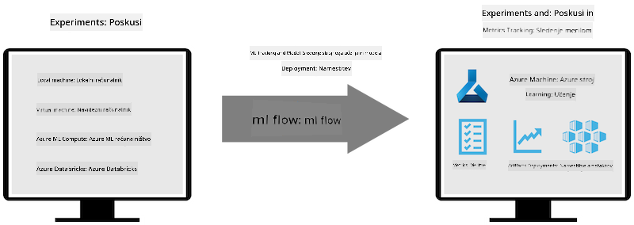

<!--
CO_OP_TRANSLATOR_METADATA:
{
  "original_hash": "f61c383bbf0c3dac97e43f833c258731",
  "translation_date": "2025-05-09T18:41:41+00:00",
  "source_file": "md/02.Application/01.TextAndChat/Phi3/E2E_Phi-3-MLflow.md",
  "language_code": "sl"
}
-->
# MLflow

[MLflow](https://mlflow.org/) je odprtokodna platforma, zasnovana za upravljanje celotnega življenjskega cikla strojnega učenja.



MLFlow se uporablja za upravljanje življenjskega cikla ML, vključno z eksperimentiranjem, ponovljivostjo, uvajanjem in centralnim registrom modelov. MLflow trenutno ponuja štiri komponente.

- **MLflow Tracking:** Beleženje in poizvedovanje eksperimentov, kode, konfiguracije podatkov in rezultatov.
- **MLflow Projects:** Pakiranje podatkovnoznanstvene kode v format, ki omogoča ponovitev zagona na katerikoli platformi.
- **Mlflow Models:** Uvajanje modelov strojnega učenja v različnih strežniških okoljih.
- **Model Registry:** Shranjevanje, označevanje in upravljanje modelov v centralnem repozitoriju.

Vsebuje zmogljivosti za sledenje eksperimentom, pakiranje kode v ponovljive zagon ter deljenje in uvajanje modelov. MLFlow je integriran v Databricks in podpira različne ML knjižnice, kar pomeni, da ni vezan na določeno knjižnico. Uporablja se lahko z vsako knjižnico strojnega učenja in v katerem koli programskem jeziku, saj zagotavlja REST API in CLI za priročnost.



Ključne funkcije MLFlow vključujejo:

- **Sledenje eksperimentom:** Beleženje in primerjava parametrov ter rezultatov.
- **Upravljanje modelov:** Uvajanje modelov na različne strežniške in inferenčne platforme.
- **Model Registry:** Sodelovalno upravljanje življenjskega cikla MLflow modelov, vključno z verzioniranjem in označevanjem.
- **Projects:** Pakiranje ML kode za deljenje ali produkcijsko uporabo.

MLFlow prav tako podpira MLOps zanko, ki vključuje pripravo podatkov, registracijo in upravljanje modelov, pakiranje modelov za izvajanje, uvajanje storitev in spremljanje modelov. Cilj je poenostaviti prehod od prototipa do produkcijskega poteka dela, zlasti v oblačnih in edge okoljih.

## E2E scenarij – Gradnja ovojnice in uporaba Phi-3 kot MLFlow modela

V tem E2E primeru bomo pokazali dva različna pristopa za gradnjo ovojnice okoli majhnega jezikovnega modela Phi-3 (SLM) in njegovo zagon kot MLFlow model bodisi lokalno ali v oblaku, npr. v Azure Machine Learning delovnem prostoru.


| Projekt | Opis | Lokacija |
| ------------ | ----------- | -------- |
| Transformer Pipeline | Transformer Pipeline je najlažja možnost za gradnjo ovojnice, če želite uporabiti HuggingFace model z eksperimentalno transformatorjevo različico MLFlow. | [**TransformerPipeline.ipynb**](../../../../../../code/06.E2E/E2E_Phi-3-MLflow_TransformerPipeline.ipynb) |
| Custom Python Wrapper | Ob času pisanja transformer pipeline ni podpiral generiranja MLFlow ovojnice za HuggingFace modele v ONNX formatu, tudi z eksperimentalnim paketom optimum. V takih primerih lahko zgradite svojo lastno Python ovojnico za MLFlow model. | [**CustomPythonWrapper.ipynb**](../../../../../../code/06.E2E/E2E_Phi-3-MLflow_CustomPythonWrapper.ipynb) |

## Projekt: Transformer Pipeline

1. Potrebovali boste ustrezne Python pakete iz MLFlow in HuggingFace:

    ``` Python
    import mlflow
    import transformers
    ```

2. Nato morate inicializirati transformer pipeline z referenco na ciljni Phi-3 model v HuggingFace registru. Kot je razvidno iz model kartice _Phi-3-mini-4k-instruct_, je njegova naloga tipa “Text Generation”:

    ``` Python
    pipeline = transformers.pipeline(
        task = "text-generation",
        model = "microsoft/Phi-3-mini-4k-instruct"
    )
    ```

3. Sedaj lahko shranite Phi-3 modelov transformer pipeline v MLFlow format in dodate dodatne podrobnosti, kot so ciljna pot artefaktov, specifične nastavitve modela in tip inference API-ja:

    ``` Python
    model_info = mlflow.transformers.log_model(
        transformers_model = pipeline,
        artifact_path = "phi3-mlflow-model",
        model_config = model_config,
        task = "llm/v1/chat"
    )
    ```

## Projekt: Custom Python Wrapper

1. Tukaj lahko uporabimo Microsoftov [ONNX Runtime generate() API](https://github.com/microsoft/onnxruntime-genai) za inferenco ONNX modela ter kodiranje/dekodiranje tokenov. Za ciljni računalnik morate izbrati paket _onnxruntime_genai_, spodnji primer cilja CPU:

    ``` Python
    import mlflow
    from mlflow.models import infer_signature
    import onnxruntime_genai as og
    ```

1. Naša lastna razred implementira dve metodi: _load_context()_ za inicializacijo **ONNX modela** Phi-3 Mini 4K Instruct, **parametrov generatorja** in **tokenizatorja**; ter _predict()_ za generiranje izhodnih tokenov za podan poziv:

    ``` Python
    class Phi3Model(mlflow.pyfunc.PythonModel):
        def load_context(self, context):
            # Retrieving model from the artifacts
            model_path = context.artifacts["phi3-mini-onnx"]
            model_options = {
                 "max_length": 300,
                 "temperature": 0.2,         
            }
        
            # Defining the model
            self.phi3_model = og.Model(model_path)
            self.params = og.GeneratorParams(self.phi3_model)
            self.params.set_search_options(**model_options)
            
            # Defining the tokenizer
            self.tokenizer = og.Tokenizer(self.phi3_model)
    
        def predict(self, context, model_input):
            # Retrieving prompt from the input
            prompt = model_input["prompt"][0]
            self.params.input_ids = self.tokenizer.encode(prompt)
    
            # Generating the model's response
            response = self.phi3_model.generate(self.params)
    
            return self.tokenizer.decode(response[0][len(self.params.input_ids):])
    ```

1. Sedaj lahko uporabite funkcijo _mlflow.pyfunc.log_model()_ za generiranje lastne Python ovojnice (v pickle formatu) za Phi-3 model skupaj z originalnim ONNX modelom in potrebnimi odvisnostmi:

    ``` Python
    model_info = mlflow.pyfunc.log_model(
        artifact_path = artifact_path,
        python_model = Phi3Model(),
        artifacts = {
            "phi3-mini-onnx": "cpu_and_mobile/cpu-int4-rtn-block-32-acc-level-4",
        },
        input_example = input_example,
        signature = infer_signature(input_example, ["Run"]),
        extra_pip_requirements = ["torch", "onnxruntime_genai", "numpy"],
    )
    ```

## Podpisi generiranih MLFlow modelov

1. V koraku 3 projekta Transformer Pipeline zgoraj smo nastavili nalogo MLFlow modela na “_llm/v1/chat_”. Takšna navodila generirajo API ovojnico modela, združljivo z OpenAI Chat API, kot je prikazano spodaj:

    ``` Python
    {inputs: 
      ['messages': Array({content: string (required), name: string (optional), role: string (required)}) (required), 'temperature': double (optional), 'max_tokens': long (optional), 'stop': Array(string) (optional), 'n': long (optional), 'stream': boolean (optional)],
    outputs: 
      ['id': string (required), 'object': string (required), 'created': long (required), 'model': string (required), 'choices': Array({finish_reason: string (required), index: long (required), message: {content: string (required), name: string (optional), role: string (required)} (required)}) (required), 'usage': {completion_tokens: long (required), prompt_tokens: long (required), total_tokens: long (required)} (required)],
    params: 
      None}
    ```

1. Posledično lahko svoj poziv pošljete v naslednji obliki:

    ``` Python
    messages = [{"role": "user", "content": "What is the capital of Spain?"}]
    ```

1. Nato uporabite OpenAI API združljivo postprocesiranje, npr. _response[0][‘choices’][0][‘message’][‘content’]_, da lepše prikažete izhod, nekaj takega:

    ``` JSON
    Question: What is the capital of Spain?
    
    Answer: The capital of Spain is Madrid. It is the largest city in Spain and serves as the political, economic, and cultural center of the country. Madrid is located in the center of the Iberian Peninsula and is known for its rich history, art, and architecture, including the Royal Palace, the Prado Museum, and the Plaza Mayor.
    
    Usage: {'prompt_tokens': 11, 'completion_tokens': 73, 'total_tokens': 84}
    ```

1. V koraku 3 projekta Custom Python Wrapper zgoraj dovolimo MLFlow paketu, da generira podpis modela iz podanega primerka vhodnih podatkov. Podpis naše MLFlow ovojnice bo videti takole:

    ``` Python
    {inputs: 
      ['prompt': string (required)],
    outputs: 
      [string (required)],
    params: 
      None}
    ```

1. Zato mora naš poziv vsebovati ključ slovarja "prompt", podobno kot tukaj:

    ``` Python
    {"prompt": "<|system|>You are a stand-up comedian.<|end|><|user|>Tell me a joke about atom<|end|><|assistant|>",}
    ```

1. Izhod modela bo nato podan v obliki niza:

    ``` JSON
    Alright, here's a little atom-related joke for you!
    
    Why don't electrons ever play hide and seek with protons?
    
    Because good luck finding them when they're always "sharing" their electrons!
    
    Remember, this is all in good fun, and we're just having a little atomic-level humor!
    ```

**Opozorilo**:  
Ta dokument je bil preveden z uporabo AI prevajalske storitve [Co-op Translator](https://github.com/Azure/co-op-translator). Čeprav si prizadevamo za natančnost, upoštevajte, da lahko avtomatizirani prevodi vsebujejo napake ali netočnosti. Izvirni dokument v njegovem izvorno jeziku velja za avtoritativni vir. Za pomembne informacije priporočamo strokovni človeški prevod. Nismo odgovorni za morebitna nesporazume ali napačne interpretacije, ki izhajajo iz uporabe tega prevoda.