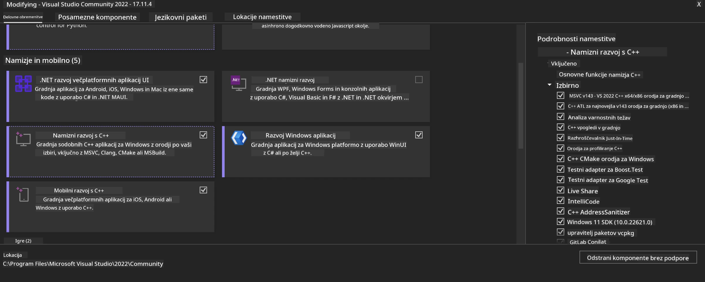
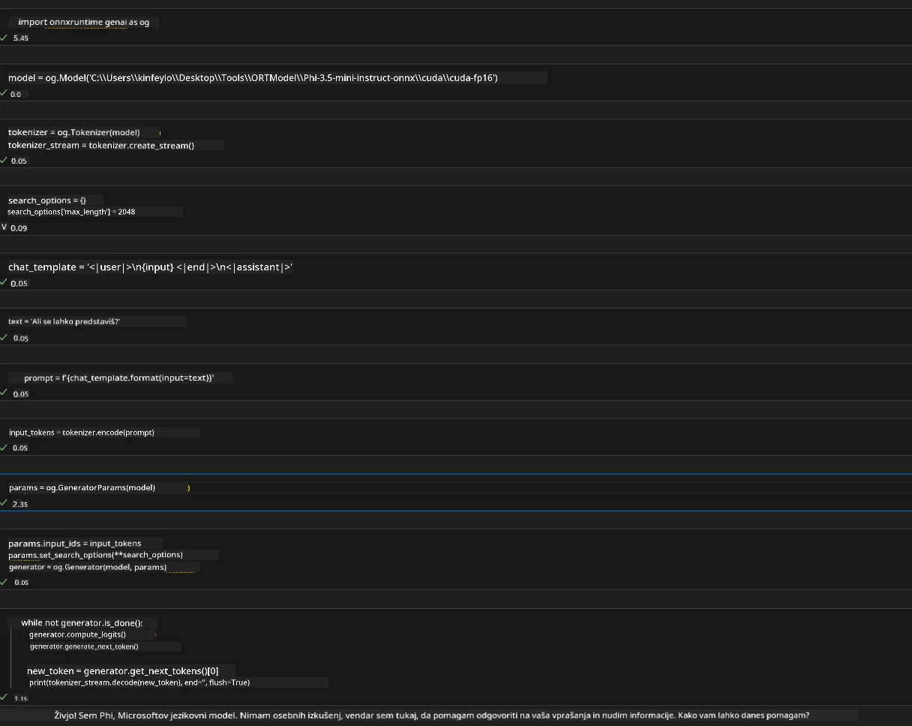
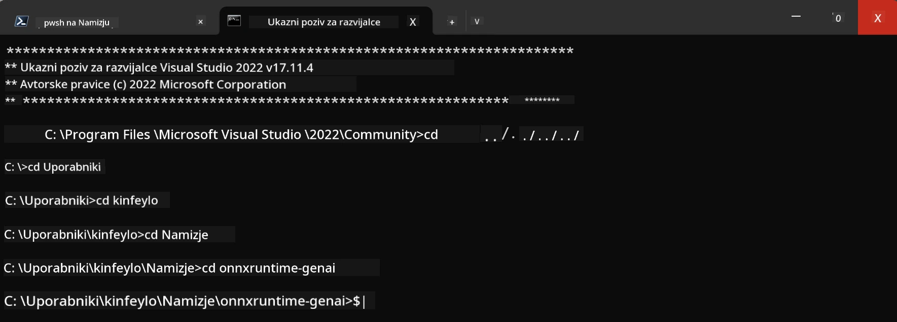

# **Navodila za OnnxRuntime GenAI Windows GPU**

Ta navodila opisujejo korake za nastavitev in uporabo ONNX Runtime (ORT) z GPU-ji na Windows. Namenjena so, da vam pomagajo izkoristiti pospeševanje z GPU za vaše modele, kar izboljša zmogljivost in učinkovitost.

Dokument vsebuje navodila za:

- Nastavitev okolja: Navodila za namestitev potrebnih odvisnosti, kot so CUDA, cuDNN in ONNX Runtime.
- Konfiguracijo: Kako nastaviti okolje in ONNX Runtime za učinkovito uporabo GPU virov.
- Nasvete za optimizacijo: Priporočila za fino nastavitev GPU nastavitev za optimalno delovanje.

### **1. Python 3.10.x /3.11.8**

   ***Note*** Priporočamo uporabo [miniforge](https://github.com/conda-forge/miniforge/releases/latest/download/Miniforge3-Windows-x86_64.exe) kot vaše Python okolje

   ```bash

   conda create -n pydev python==3.11.8

   conda activate pydev

   ```

   ***Reminder*** Če imate nameščeno katerokoli Python ONNX knjižnico, jo prosim odstranite

### **2. Namestitev CMake z winget**

   ```bash

   winget install -e --id Kitware.CMake

   ```

### **3. Namestitev Visual Studio 2022 - Desktop Development with C++**

   ***Note*** Če ne želite prevajati, lahko ta korak preskočite



### **4. Namestitev NVIDIA gonilnika**

1. **NVIDIA GPU Driver**  [https://www.nvidia.com/en-us/drivers/](https://www.nvidia.com/en-us/drivers/)

2. **NVIDIA CUDA 12.4** [https://developer.nvidia.com/cuda-12-4-0-download-archive](https://developer.nvidia.com/cuda-12-4-0-download-archive)

3. **NVIDIA CUDNN 9.4**  [https://developer.nvidia.com/cudnn-downloads](https://developer.nvidia.com/cudnn-downloads)

***Reminder*** Prosimo, uporabite privzete nastavitve med namestitvijo

### **5. Nastavitev NVIDIA okolja**

Kopirajte NVIDIA CUDNN 9.4 datoteke iz map lib, bin, include v ustrezne mape NVIDIA CUDA 12.4

- kopirajte datoteke iz *'C:\Program Files\NVIDIA\CUDNN\v9.4\bin\12.6'* v *'C:\Program Files\NVIDIA GPU Computing Toolkit\CUDA\v12.4\bin'*

- kopirajte datoteke iz *'C:\Program Files\NVIDIA\CUDNN\v9.4\include\12.6'* v *'C:\Program Files\NVIDIA GPU Computing Toolkit\CUDA\v12.4\include'*

- kopirajte datoteke iz *'C:\Program Files\NVIDIA\CUDNN\v9.4\lib\12.6'* v *'C:\Program Files\NVIDIA GPU Computing Toolkit\CUDA\v12.4\lib\x64'*

### **6. Prenos Phi-3.5-mini-instruct-onnx**

   ```bash

   winget install -e --id Git.Git

   winget install -e --id GitHub.GitLFS

   git lfs install

   git clone https://huggingface.co/microsoft/Phi-3.5-mini-instruct-onnx

   ```

### **7. Zagon InferencePhi35Instruct.ipynb**

   Odprite [Notebook](../../../../../../code/09.UpdateSamples/Aug/ortgpu-phi35-instruct.ipynb) in ga zaženite



### **8. Prevajanje ORT GenAI GPU**

   ***Note*** 
   
   1. Najprej odstranite vse pakete, povezane z onnx, onnxruntime in onnxruntime-genai

   ```bash

   pip list 
   
   ```

   Nato odstranite vse onnxruntime knjižnice, npr.

   ```bash

   pip uninstall onnxruntime

   pip uninstall onnxruntime-genai

   pip uninstall onnxruntume-genai-cuda
   
   ```

   2. Preverite podporo Visual Studio Extension

   Preverite mapo C:\Program Files\NVIDIA GPU Computing Toolkit\CUDA\v12.4\extras, da zagotovite, da obstaja C:\Program Files\NVIDIA GPU Computing Toolkit\CUDA\v12.4\extras\visual_studio_integration. 
   
   Če ni najdena, preverite druge mape Cuda toolkit gonilnikov in kopirajte mapo visual_studio_integration ter njeno vsebino v C:\Program Files\NVIDIA GPU Computing Toolkit\CUDA\v12.4\extras\visual_studio_integration

   - Če ne želite prevajati, lahko ta korak preskočite

   ```bash

   git clone https://github.com/microsoft/onnxruntime-genai

   ```

   - Prenesite [https://github.com/microsoft/onnxruntime/releases/download/v1.19.2/onnxruntime-win-x64-gpu-1.19.2.zip](https://github.com/microsoft/onnxruntime/releases/download/v1.19.2/onnxruntime-win-x64-gpu-1.19.2.zip)

   - Razširite onnxruntime-win-x64-gpu-1.19.2.zip, preimenujte mapo v **ort** in jo kopirajte v onnxruntime-genai

   - Uporabite Windows Terminal, odprite Developer Command Prompt za VS 2022 in pojdite v onnxruntime-genai



   - Prevedite z vašim Python okoljem

   ```bash

   cd onnxruntime-genai

   python build.py --use_cuda  --cuda_home "C:\Program Files\NVIDIA GPU Computing Toolkit\CUDA\v12.4" --config Release
 

   cd build/Windows/Release/Wheel

   pip install .whl

   ```

**Omejitev odgovornosti**:  
Ta dokument je bil preveden z uporabo AI prevajalske storitve [Co-op Translator](https://github.com/Azure/co-op-translator). Čeprav si prizadevamo za natančnost, vas opozarjamo, da avtomatizirani prevodi lahko vsebujejo napake ali netočnosti. Izvirni dokument v njegovem izvirnem jeziku velja za avtoritativni vir. Za ključne informacije priporočamo strokovni človeški prevod. Za morebitna nesporazume ali napačne interpretacije, ki izhajajo iz uporabe tega prevoda, ne odgovarjamo.