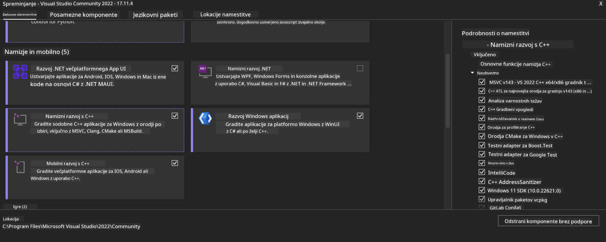

<!--
CO_OP_TRANSLATOR_METADATA:
{
  "original_hash": "b066fc29c1b2129df84e027cb75119ce",
  "translation_date": "2025-05-09T18:47:26+00:00",
  "source_file": "md/02.Application/01.TextAndChat/Phi3/ORTWindowGPUGuideline.md",
  "language_code": "sl"
}
-->
# **OnnxRuntime GenAI Windows GPU සඳහා මාර්ගෝපදේශය**

මෙම මාර්ගෝපදේශය Windows හි GPU සමඟ ONNX Runtime (ORT) සකස් කර භාවිතා කිරීම සඳහා පියවර ලබා දෙයි. ඔබේ ආකෘති සඳහා GPU වේගවත් කිරීමෙන් කාර්යක්ෂමතාව සහ කාර්ය සාධනය වැඩි දියුණු කර ගැනීමට මෙය උපකාරී වේ.

ලේඛනයේ අන්තර්ගතය:

- පරිසර සකස් කිරීම: CUDA, cuDNN සහ ONNX Runtime වැනි අවශ්‍ය උපකරණ ස්ථාපනය කිරීමේ උපදෙස්.
- සැකසුම්: GPU සම්පත් කාර්යක්ෂමව භාවිතා කිරීමට පරිසරය සහ ONNX Runtime සැකසීම.
- කාර්යක්ෂමතා වැඩිදියුණු කිරීමේ උපදෙස්: ඔබගේ GPU සැකසුම් හොඳම ප්‍රතිදානය සඳහා සුදුසු ලෙස වෙනස් කිරීමේ උපදෙස්.

### **1. Python 3.10.x /3.11.8**

   ***Note*** Python පරිසරයක් ලෙස [miniforge](https://github.com/conda-forge/miniforge/releases/latest/download/Miniforge3-Windows-x86_64.exe) භාවිතා කිරීමට යෝජනා කරයි

   ```bash

   conda create -n pydev python==3.11.8

   conda activate pydev

   ```

   ***Reminder*** Python ONNX පුස්තකාලය කිසිවක් ස්ථාපනය කර තිබේ නම්, ඒවා ඉවත් කරන්න

### **2. CMake winget මඟින් ස්ථාපනය කරන්න**

   ```bash

   winget install -e --id Kitware.CMake

   ```

### **3. Visual Studio 2022 - Desktop Development with C++ ස්ථාපනය කරන්න**

   ***Note*** ඔබට සංකලනය කිරීමට අවශ්‍ය නැත්නම් මෙම පියවර මඟහැරිය හැක



### **4. NVIDIA ධාවකය ස්ථාපනය කරන්න**

1. **NVIDIA GPU Driver**  [https://www.nvidia.com/en-us/drivers/](https://www.nvidia.com/en-us/drivers/)

2. **NVIDIA CUDA 12.4** [https://developer.nvidia.com/cuda-12-4-0-download-archive](https://developer.nvidia.com/cuda-12-4-0-download-archive)

3. **NVIDIA CUDNN 9.4**  [https://developer.nvidia.com/cudnn-downloads](https://developer.nvidia.com/cudnn-downloads)

***Reminder*** ස්ථාපන ක්‍රියාවලිය සඳහා පෙරනිමි සැකසුම් භාවිතා කරන්න

### **5. NVIDIA පරිසරය සකසන්න**

NVIDIA CUDNN 9.4 හි lib, bin, include ෆෝල්ඩර් CUDA 12.4 හි lib, bin, include වෙත පිටපත් කරන්න

- *'C:\Program Files\NVIDIA\CUDNN\v9.4\bin\12.6'* ෆයිල් *'C:\Program Files\NVIDIA GPU Computing Toolkit\CUDA\v12.4\bin'* වෙත පිටපත් කරන්න

- *'C:\Program Files\NVIDIA\CUDNN\v9.4\include\12.6'* ෆයිල් *'C:\Program Files\NVIDIA GPU Computing Toolkit\CUDA\v12.4\include'* වෙත පිටපත් කරන්න

- *'C:\Program Files\NVIDIA\CUDNN\v9.4\lib\12.6'* ෆයිල් *'C:\Program Files\NVIDIA GPU Computing Toolkit\CUDA\v12.4\lib\x64'* වෙත පිටපත් කරන්න

### **6. Phi-3.5-mini-instruct-onnx බාගන්න**

   ```bash

   winget install -e --id Git.Git

   winget install -e --id GitHub.GitLFS

   git lfs install

   git clone https://huggingface.co/microsoft/Phi-3.5-mini-instruct-onnx

   ```

### **7. InferencePhi35Instruct.ipynb ධාවනය කරන්න**

   [Notebook](../../../../../../code/09.UpdateSamples/Aug/ortgpu-phi35-instruct.ipynb) විවෘත කර ක්‍රියාත්මක කරන්න


### **8. ORT GenAI GPU සංකලනය කරන්න**

   ***Note*** 
   
   1. පළමුව onnx, onnxruntime සහ onnxruntime-genai සම්බන්ධ සියලුම දේ ඉවත් කරන්න

   ```bash

   pip list 
   
   ```

   පසුව සියලු onnxruntime පුස්තකාල ඉවත් කරන්න, උදාහරණයක් ලෙස:

   ```bash

   pip uninstall onnxruntime

   pip uninstall onnxruntime-genai

   pip uninstall onnxruntume-genai-cuda
   
   ```

   2. Visual Studio විස්තාරක සහය පරීක්ෂා කරන්න

   C:\Program Files\NVIDIA GPU Computing Toolkit\CUDA\v12.4\extras හි C:\Program Files\NVIDIA GPU Computing Toolkit\CUDA\v12.4\extras\visual_studio_integration ෆෝල්ඩරය තිබේදැයි පරීක්ෂා කරන්න.

   නොමැතිනම්, අනෙක් CUDA toolkit ධාවක ෆෝල්ඩර පරීක්ෂා කර visual_studio_integration ෆෝල්ඩරය සහ අන්තර්ගතය C:\Program Files\NVIDIA GPU Computing Toolkit\CUDA\v12.4\extras\visual_studio_integration වෙත පිටපත් කරන්න

   - සංකලනය කිරීමට අවශ්‍ය නොවන්නේ නම් මෙම පියවර මඟහැරිය හැක

   ```bash

   git clone https://github.com/microsoft/onnxruntime-genai

   ```

   - [https://github.com/microsoft/onnxruntime/releases/download/v1.19.2/onnxruntime-win-x64-gpu-1.19.2.zip](https://github.com/microsoft/onnxruntime/releases/download/v1.19.2/onnxruntime-win-x64-gpu-1.19.2.zip) බාගන්න

   - onnxruntime-win-x64-gpu-1.19.2.zip විහිදා **ort** ලෙස නැවත නම් කර onnxruntime-genai වෙත ort ෆෝල්ඩරය පිටපත් කරන්න

   - Windows Terminal භාවිතා කර VS 2022 සඳහා Developer Command Prompt වෙත ගොස් onnxruntime-genai වෙත යන්න


   - ඔබගේ python පරිසරයෙන් එය සංකලනය කරන්න

   ```bash

   cd onnxruntime-genai

   python build.py --use_cuda  --cuda_home "C:\Program Files\NVIDIA GPU Computing Toolkit\CUDA\v12.4" --config Release
 

   cd build/Windows/Release/Wheel

   pip install .whl

   ```

**Opozorilo**:  
Ta dokument je bil preveden z uporabo AI prevajalske storitve [Co-op Translator](https://github.com/Azure/co-op-translator). Čeprav si prizadevamo za natančnost, upoštevajte, da avtomatizirani prevodi lahko vsebujejo napake ali netočnosti. Izvirni dokument v njegovem izvirnem jeziku naj velja za zanesljiv vir. Za ključne informacije priporočamo strokovni človeški prevod. Za morebitna nesporazume ali napačne interpretacije, ki izhajajo iz uporabe tega prevoda, ne odgovarjamo.