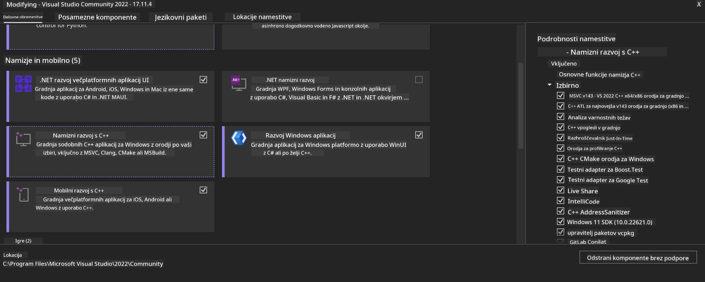
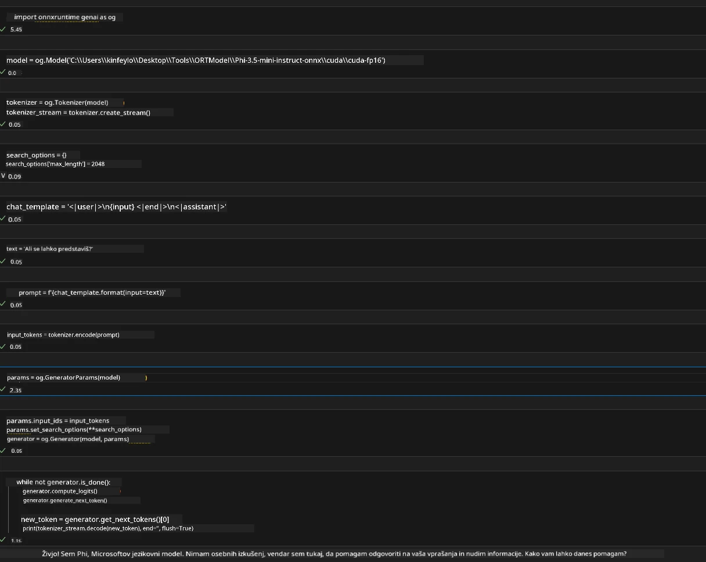
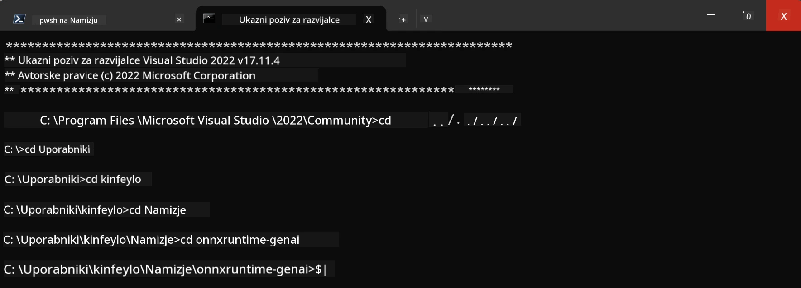

# **Smernice za OnnxRuntime GenAI Windows GPU**

Te smernice zagotavljajo korake za nastavitev in uporabo ONNX Runtime (ORT) z GPU-ji na Windows. Namenjene so, da vam pomagajo izkoristiti pospeševanje z GPU za vaše modele, kar izboljša zmogljivost in učinkovitost.

Dokument ponuja navodila za:

- Nastavitev okolja: Navodila za namestitev potrebnih odvisnosti, kot so CUDA, cuDNN in ONNX Runtime.
- Konfiguracija: Kako konfigurirati okolje in ONNX Runtime za učinkovito uporabo GPU virov.
- Nasveti za optimizacijo: Nasveti, kako fino nastaviti nastavitve GPU za optimalno zmogljivost.

### **1. Python 3.10.x /3.11.8**

   ***Opomba*** Priporočamo uporabo [miniforge](https://github.com/conda-forge/miniforge/releases/latest/download/Miniforge3-Windows-x86_64.exe) kot vaše Python okolje

   ```bash

   conda create -n pydev python==3.11.8

   conda activate pydev

   ```

   ***Opomnik*** Če imate nameščeno katerokoli python ONNX knjižnico, jo prosim odstranite

### **2. Namestite CMake z winget**


   ```bash

   winget install -e --id Kitware.CMake

   ```

### **3. Namestite Visual Studio 2022 - Namizni razvoj s C++**

   ***Opomba*** Če ne želite prevajati, lahko ta korak preskočite




### **4. Namestite NVIDIA gonilnik**

1. **NVIDIA GPU gonilnik**  [https://www.nvidia.com/en-us/drivers/](https://www.nvidia.com/en-us/drivers/)

2. **NVIDIA CUDA 12.4** [https://developer.nvidia.com/cuda-12-4-0-download-archive](https://developer.nvidia.com/cuda-12-4-0-download-archive)

3. **NVIDIA CUDNN 9.4**  [https://developer.nvidia.com/cudnn-downloads](https://developer.nvidia.com/cudnn-downloads)

***Opomnik*** Prosimo, uporabite privzete nastavitve med namestitvenim potekom 

### **5. Nastavite NVIDIA okolje**

Kopirajte NVIDIA CUDNN 9.4 datoteke lib, bin, include v NVIDIA CUDA 12.4 lib, bin, include

- kopirajte datoteke iz *'C:\Program Files\NVIDIA\CUDNN\v9.4\bin\12.6'* v  *'C:\Program Files\NVIDIA GPU Computing Toolkit\CUDA\v12.4\bin*

- kopirajte datoteke iz *'C:\Program Files\NVIDIA\CUDNN\v9.4\include\12.6'* v  *'C:\Program Files\NVIDIA GPU Computing Toolkit\CUDA\v12.4\include*

- kopirajte datoteke iz *'C:\Program Files\NVIDIA\CUDNN\v9.4\lib\12.6'* v  *'C:\Program Files\NVIDIA GPU Computing Toolkit\CUDA\v12.4\lib\x64'*


### **6. Prenesite Phi-3.5-mini-instruct-onnx**


   ```bash

   winget install -e --id Git.Git

   winget install -e --id GitHub.GitLFS

   git lfs install

   git clone https://huggingface.co/microsoft/Phi-3.5-mini-instruct-onnx

   ```

### **7. Zagon InferencePhi35Instruct.ipynb**

   Odprite [Zvezek](../../../../code/09.UpdateSamples/Aug/ortgpu-phi35-instruct.ipynb) in ga zaženite





### **8. Prevajanje ORT GenAI GPU**


   ***Opomba*** 
   
   1. Prosim najprej odstranite vse povezano z onnx in onnxruntime ter onnxruntime-genai

   
   ```bash

   pip list 
   
   ```

   Nato odstranite vse onnxruntime knjižnice, npr. 


   ```bash

   pip uninstall onnxruntime

   pip uninstall onnxruntime-genai

   pip uninstall onnxruntume-genai-cuda
   
   ```

   2. Preverite podporo za Visual Studio razširitev 

   Preverite C:\Program Files\NVIDIA GPU Computing Toolkit\CUDA\v12.4\extras, da zagotovite, da obstaja C:\Program Files\NVIDIA GPU Computing Toolkit\CUDA\v12.4\extras\visual_studio_integration.
   
   Če ni najdeno, preverite druge mape orodij Cuda in kopirajte mapo visual_studio_integration in vsebino v C:\Program Files\NVIDIA GPU Computing Toolkit\CUDA\v12.4\extras\visual_studio_integration


   - Če ne želite prevajati, lahko ta korak preskočite


   ```bash

   git clone https://github.com/microsoft/onnxruntime-genai

   ```

   - Prenesite [https://github.com/microsoft/onnxruntime/releases/download/v1.19.2/onnxruntime-win-x64-gpu-1.19.2.zip](https://github.com/microsoft/onnxruntime/releases/download/v1.19.2/onnxruntime-win-x64-gpu-1.19.2.zip)

   - Razširite onnxruntime-win-x64-gpu-1.19.2.zip in preimenujte mapo v **ort**, nato kopirajte mapo ort v onnxruntime-genai

   - Z uporabo Windows Terminal odprite Developer Command Prompt za VS 2022 in pojdite v onnxruntime-genai 



   - Prevajajte z vašim python okoljem

   
   ```bash

   cd onnxruntime-genai

   python build.py --use_cuda  --cuda_home "C:\Program Files\NVIDIA GPU Computing Toolkit\CUDA\v12.4" --config Release
 

   cd build/Windows/Release/Wheel

   pip install .whl

   ```

---

<!-- CO-OP TRANSLATOR DISCLAIMER START -->
**Omejitev odgovornosti**:
Ta dokument je bil preveden z uporabo AI prevajalske storitve [Co-op Translator](https://github.com/Azure/co-op-translator). Čeprav si prizadevamo za natančnost, vas prosimo, da upoštevate, da avtomatizirani prevodi lahko vsebujejo napake ali netočnosti. Izvirni dokument v njegovem izvirnem jeziku je treba obravnavati kot avtoritativni vir. Za kritične informacije je priporočljiv strokovni človeški prevod. Ne odgovarjamo za morebitna nesporazume ali napačne interpretacije, ki izhajajo iz uporabe tega prevoda.
<!-- CO-OP TRANSLATOR DISCLAIMER END -->