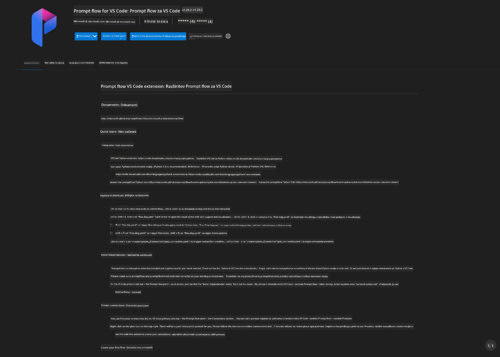
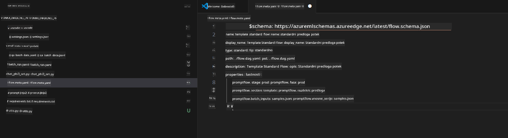
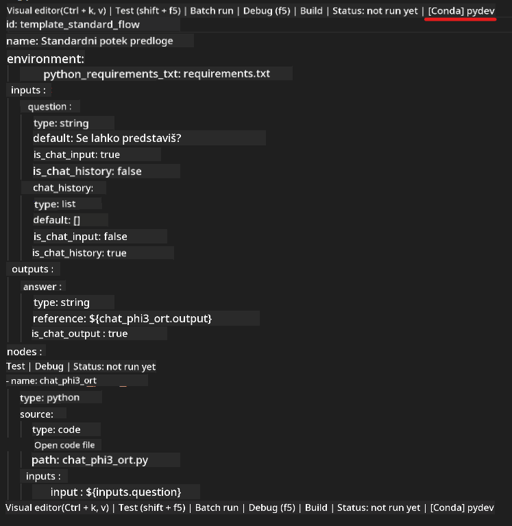
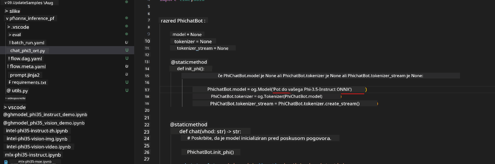
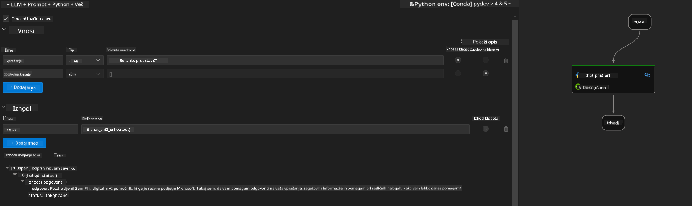

<!--
CO_OP_TRANSLATOR_METADATA:
{
  "original_hash": "92e7dac1e5af0dd7c94170fdaf6860fe",
  "translation_date": "2025-05-09T18:55:56+00:00",
  "source_file": "md/02.Application/01.TextAndChat/Phi3/UsingPromptFlowWithONNX.md",
  "language_code": "sl"
}
-->
# Uporaba Windows GPU za ustvarjanje rešitve Prompt flow s Phi-3.5-Instruct ONNX

Naslednji dokument je primer, kako uporabljati PromptFlow z ONNX (Open Neural Network Exchange) za razvoj AI aplikacij, temelječih na modelih Phi-3.

PromptFlow je zbirka razvojnih orodij, zasnovanih za poenostavitev celotnega razvojnega cikla AI aplikacij, ki temeljijo na LLM (Large Language Model), od idej in prototipiranja do testiranja in ocenjevanja.

Z integracijo PromptFlow z ONNX lahko razvijalci:

- Optimizirajo zmogljivost modela: Izkoristijo ONNX za učinkovito izvajanje in nameščanje modelov.
- Poenostavijo razvoj: Uporabijo PromptFlow za upravljanje delovnega toka in avtomatizacijo ponavljajočih se opravil.
- Izboljšajo sodelovanje: Olajšajo boljše sodelovanje med člani ekipe z zagotavljanjem enotnega razvojnega okolja.

**Prompt flow** je zbirka razvojnih orodij, zasnovanih za poenostavitev celotnega razvojnega cikla AI aplikacij, ki temeljijo na LLM, od idej, prototipiranja, testiranja, ocenjevanja do produkcijske uvedbe in spremljanja. Poenostavi prompt inženiring ter omogoča izdelavo LLM aplikacij s produkcijsko kakovostjo.

Prompt flow se lahko poveže z OpenAI, Azure OpenAI Service in prilagodljivimi modeli (Huggingface, lokalni LLM/SLM). Cilj je namestitev kvantiziranega ONNX modela Phi-3.5 v lokalne aplikacije. Prompt flow nam pomaga bolje načrtovati poslovanje in dokončati lokalne rešitve na podlagi Phi-3.5. V tem primeru bomo združili ONNX Runtime GenAI knjižnico za dokončanje Prompt flow rešitve na Windows GPU.

## **Namestitev**

### **ONNX Runtime GenAI za Windows GPU**

Preberite ta vodič za nastavitev ONNX Runtime GenAI za Windows GPU [kliknite tukaj](./ORTWindowGPUGuideline.md)

### **Nastavitev Prompt flow v VSCode**

1. Namestite Prompt flow VS Code razširitev



2. Po namestitvi Prompt flow VS Code razširitve kliknite razširitev in izberite **Installation dependencies**, sledite temu vodiču za namestitev Prompt flow SDK v vašem okolju


3. Prenesite [Sample Code](../../../../../../code/09.UpdateSamples/Aug/pf/onnx_inference_pf) in odprite ta primer v VS Code



4. Odprite **flow.dag.yaml** in izberite vaše Python okolje



   Odprite **chat_phi3_ort.py** in spremenite lokacijo Phi-3.5-instruct ONNX modela



5. Zaženite vaš prompt flow za testiranje

Odprite **flow.dag.yaml** in kliknite vizualni urejevalnik


Po kliku zaženite test



1. V terminalu lahko zaženete batch, da preverite več rezultatov


```bash

pf run create --file batch_run.yaml --stream --name 'Your eval qa name'    

```

Rezultate lahko preverite v privzetem brskalniku


**Opozorilo**:  
Ta dokument je bil preveden z uporabo AI prevajalske storitve [Co-op Translator](https://github.com/Azure/co-op-translator). Čeprav si prizadevamo za natančnost, vas prosimo, da upoštevate, da avtomatizirani prevodi lahko vsebujejo napake ali netočnosti. Izvirni dokument v njegovem izvirnem jeziku velja za avtoritativni vir. Za pomembne informacije priporočamo strokovni človeški prevod. Za kakršne koli nesporazume ali napačne interpretacije, ki izhajajo iz uporabe tega prevoda, ne odgovarjamo.