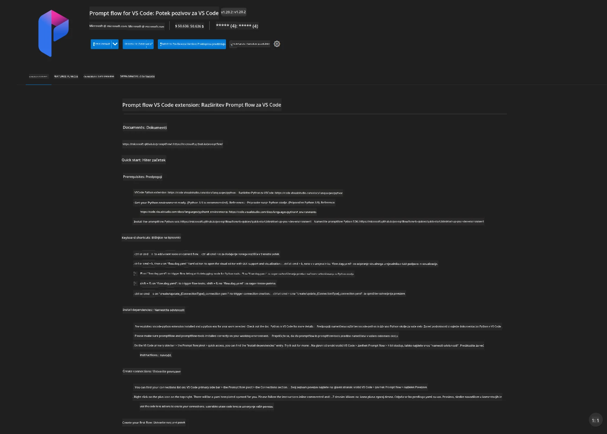
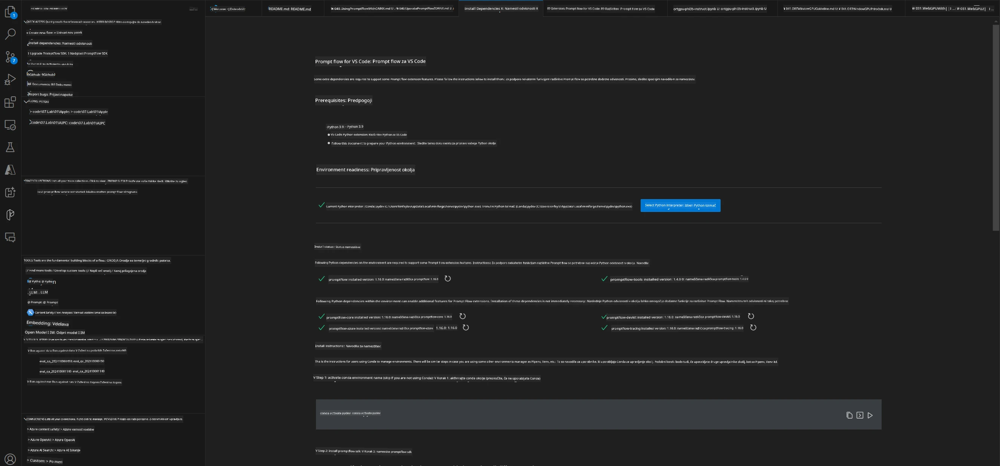
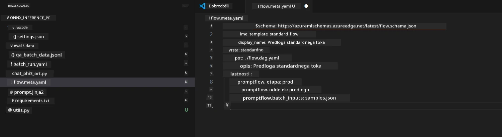
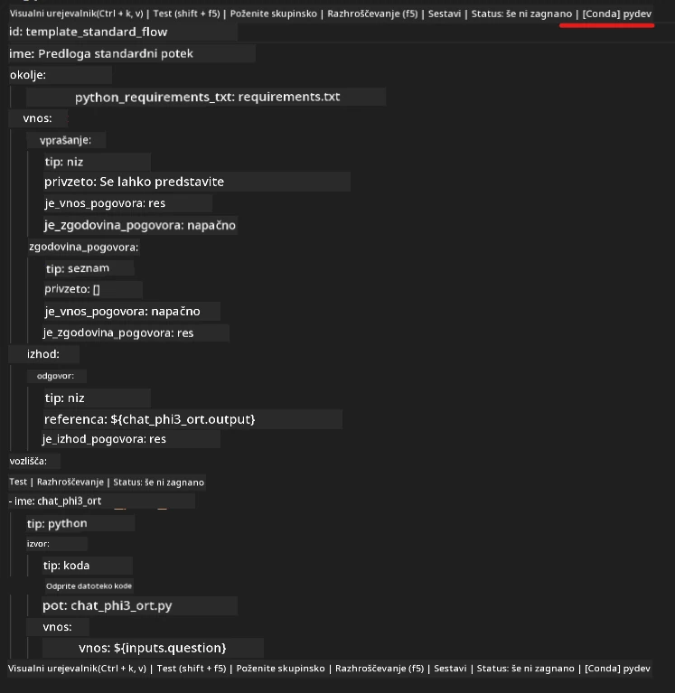
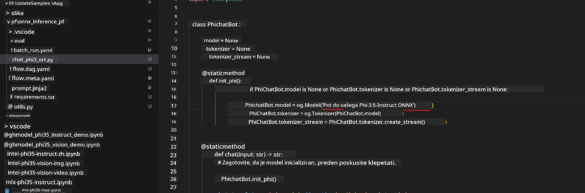
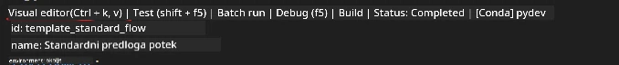
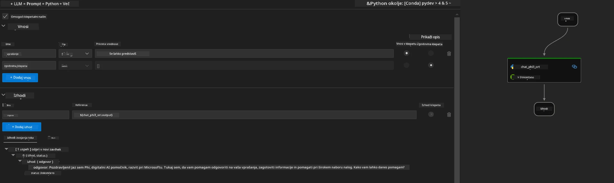
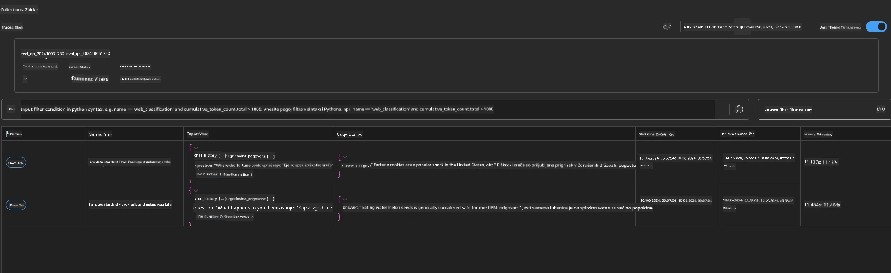

<!--
CO_OP_TRANSLATOR_METADATA:
{
  "original_hash": "92e7dac1e5af0dd7c94170fdaf6860fe",
  "translation_date": "2025-07-17T03:04:22+00:00",
  "source_file": "md/02.Application/01.TextAndChat/Phi3/UsingPromptFlowWithONNX.md",
  "language_code": "sl"
}
-->
# Uporaba Windows GPU za ustvarjanje rešitve Prompt flow s Phi-3.5-Instruct ONNX

Naslednji dokument je primer, kako uporabiti PromptFlow z ONNX (Open Neural Network Exchange) za razvoj AI aplikacij, temelječih na modelih Phi-3.

PromptFlow je zbirka razvojnih orodij, zasnovanih za poenostavitev celotnega razvojnega cikla AI aplikacij, ki temeljijo na LLM (Large Language Model), od ideje in prototipiranja do testiranja in ocenjevanja.

Z integracijo PromptFlow z ONNX lahko razvijalci:

- Optimizirajo zmogljivost modela: izkoristijo ONNX za učinkovito izvajanje in nameščanje modelov.
- Poenostavijo razvoj: uporabijo PromptFlow za upravljanje delovnega toka in avtomatizacijo ponavljajočih se opravil.
- Izboljšajo sodelovanje: omogočijo boljše sodelovanje med člani ekipe z enotnim razvojnim okoljem.

**Prompt flow** je zbirka razvojnih orodij, namenjena poenostavitvi celotnega razvojnega cikla AI aplikacij, ki temeljijo na LLM, od ideje, prototipiranja, testiranja, ocenjevanja do produkcijske uvedbe in spremljanja. Olajša delo s prompt in omogoča gradnjo LLM aplikacij z produkcijsko kakovostjo.

Prompt flow se lahko poveže z OpenAI, Azure OpenAI Service in prilagodljivimi modeli (Huggingface, lokalni LLM/SLM). Upamo, da bomo lahko namestili kvantizirani ONNX model Phi-3.5 v lokalne aplikacije. Prompt flow nam lahko pomaga bolje načrtovati poslovanje in dokončati lokalne rešitve, ki temeljijo na Phi-3.5. V tem primeru bomo združili ONNX Runtime GenAI knjižnico za dokončanje rešitve Prompt flow na Windows GPU.

## **Namestitev**

### **ONNX Runtime GenAI za Windows GPU**

Preberite ta vodič za nastavitev ONNX Runtime GenAI za Windows GPU [kliknite tukaj](./ORTWindowGPUGuideline.md)

### **Nastavitev Prompt flow v VSCode**

1. Namestite Prompt flow razširitev za VS Code



2. Po namestitvi Prompt flow razširitve za VS Code kliknite na razširitev in izberite **Installation dependencies**, sledite temu vodiču za namestitev Prompt flow SDK v vašem okolju



3. Prenesite [vzorec kode](../../../../../../code/09.UpdateSamples/Aug/pf/onnx_inference_pf) in ga odprite v VS Code



4. Odprite **flow.dag.yaml** in izberite vaše Python okolje



   Odprite **chat_phi3_ort.py** in spremenite lokacijo vašega Phi-3.5-instruct ONNX modela



5. Zaženite vaš prompt flow za testiranje

Odprite **flow.dag.yaml** in kliknite na vizualni urejevalnik



Po kliku zaženite, da testirate



1. V terminalu lahko zaženete batch, da preverite več rezultatov


```bash

pf run create --file batch_run.yaml --stream --name 'Your eval qa name'    

```

Rezultate lahko preverite v vašem privzetem brskalniku




**Omejitev odgovornosti**:  
Ta dokument je bil preveden z uporabo AI prevajalske storitve [Co-op Translator](https://github.com/Azure/co-op-translator). Čeprav si prizadevamo za natančnost, vas opozarjamo, da avtomatizirani prevodi lahko vsebujejo napake ali netočnosti. Izvirni dokument v njegovem izvirnem jeziku velja za avtoritativni vir. Za ključne informacije priporočamo strokovni človeški prevod. Za morebitna nesporazume ali napačne interpretacije, ki izhajajo iz uporabe tega prevoda, ne odgovarjamo.