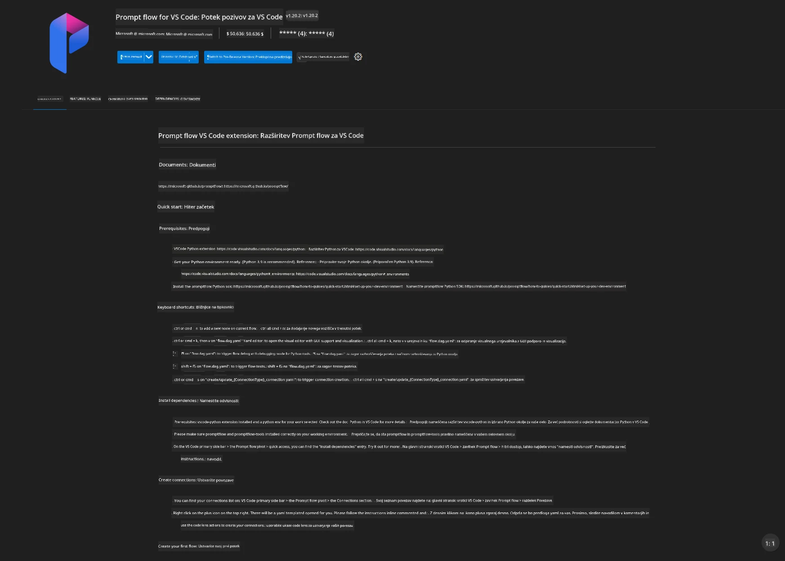
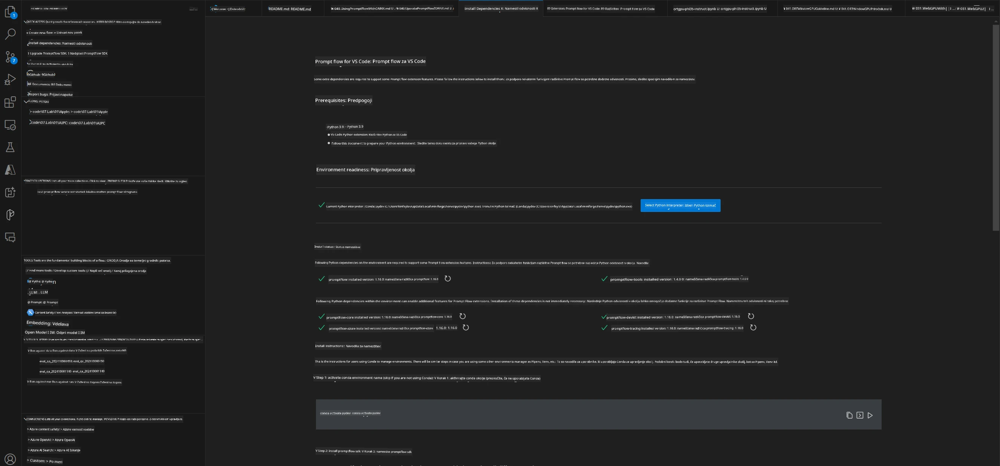
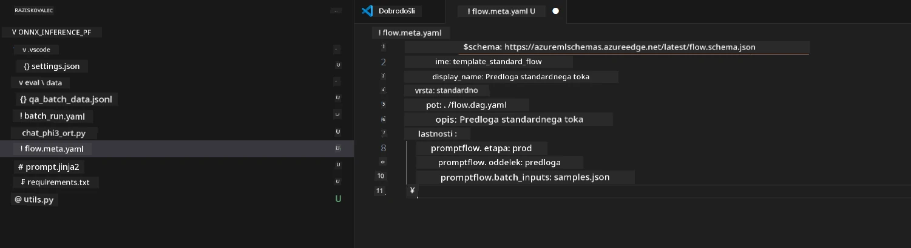
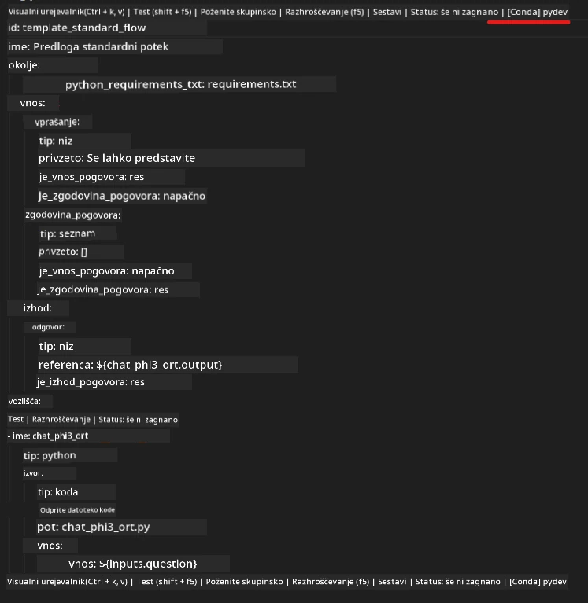
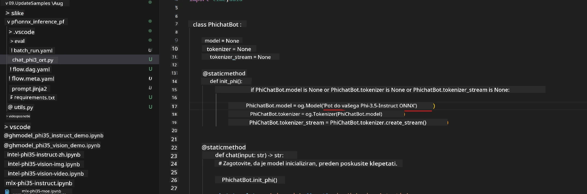
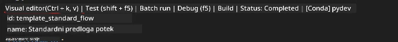
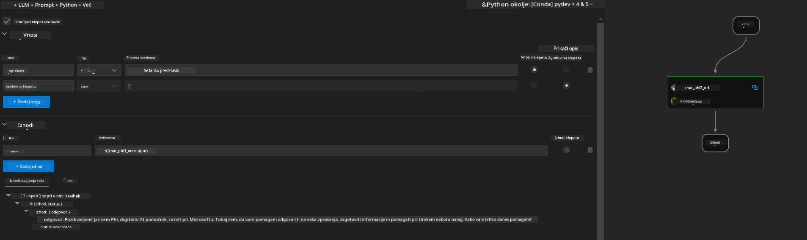
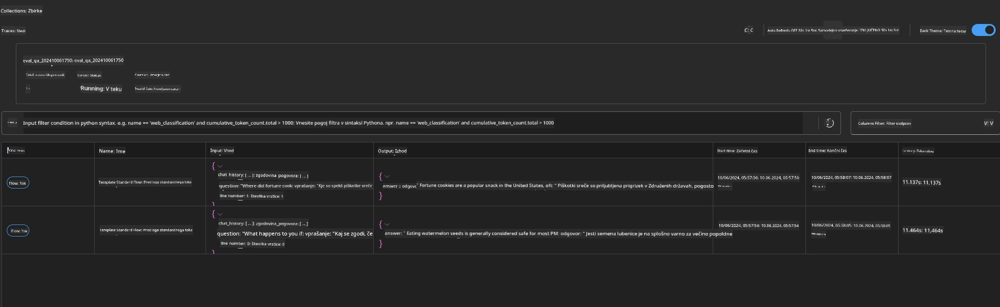

# Uporaba Windows GPU za ustvarjanje rešitve Prompt flow s Phi-3.5-Instruct ONNX 

Naslednji dokument je primer, kako uporabiti PromptFlow z ONNX (Open Neural Network Exchange) za razvoj AI aplikacij na podlagi modelov Phi-3.

PromptFlow je zbirka razvojnih orodij, zasnovanih za poenostavitev celotnega razvojnega cikla AI aplikacij, temelječih na LLM (Large Language Model), od ideje in prototipiranja do testiranja in ocenjevanja.

Z integracijo PromptFlow z ONNX lahko razvijalci:

- Optimizirajo zmogljivost modela: Izkoristijo ONNX za učinkovito izvedbo in uvajanje modelov.
- Poenostavijo razvoj: Uporabijo PromptFlow za upravljanje delovnega toka in avtomatizacijo ponavljajočih se nalog.
- Izboljšajo sodelovanje: Omogočijo boljše sodelovanje med člani ekipe z zagotavljanjem enotnega razvojnega okolja.

**Prompt flow** je zbirka razvojnih orodij, zasnovanih za poenostavitev celotnega razvoja AI aplikacij, temelječih na LLM, od ideje, prototipiranja, testiranja, ocenjevanja do uvajanja v produkcijo in spremljanja. Poenostavi inženiring promptov ter omogoča gradnjo LLM aplikacij s produkcijsko kakovostjo.

Prompt flow se lahko poveže z OpenAI, Azure OpenAI Service in prilagodljivimi modeli (Huggingface, lokalni LLM/SLM). Upamo, da bomo kvantiziran ONNX model Phi-3.5 namestili v lokalne aplikacije. Prompt flow nam lahko pomaga bolje načrtovati naš posel in dokončati lokalne rešitve na osnovi Phi-3.5. V tem primeru bomo združili ONNX Runtime GenAI knjižnico za dokončanje Prompt flow rešitve na Windows GPU.

## **Namestitev**

### **ONNX Runtime GenAI za Windows GPU**

Preberite ta vodnik za nastavitev ONNX Runtime GenAI za Windows GPU [kliknite tukaj](./ORTWindowGPUGuideline.md)

### **Nastavitev Prompt flow v VSCode**

1. Namestite Prompt flow VS Code Extension



2. Po namestitvi Prompt flow VS Code Extension, kliknite na razširitev in izberite **Installation dependencies**, sledite temu vodniku za namestitev Prompt flow SDK v vaše okolje



3. Prenesite [Sample Code](../../../../../../code/09.UpdateSamples/Aug/pf/onnx_inference_pf) in uporabite VS Code za odprtje tega vzorca



4. Odprite **flow.dag.yaml** in izberite vaše Python okolje



   Odprite **chat_phi3_ort.py** za spremembo lokacije Phi-3.5-instruct ONNX modela



5. Zaženite vaš prompt flow za testiranje

Odprite **flow.dag.yaml** in kliknite vizualni urejevalnik



Po kliku na to, zaženite in testirajte



1. Rezultate lahko preverite tudi z izvajanjem v terminalu za več rezultatov


```bash

pf run create --file batch_run.yaml --stream --name 'Your eval qa name'    

```

Rezultate lahko preverite v vašem privzetem brskalniku




---

<!-- CO-OP TRANSLATOR DISCLAIMER START -->
**Omejitev odgovornosti**:
Ta dokument je bil preveden z uporabo AI prevajalske storitve [Co-op Translator](https://github.com/Azure/co-op-translator). Čeprav si prizadevamo za natančnost, vas prosimo, da upoštevate, da avtomatizirani prevodi lahko vsebujejo napake ali netočnosti. Izvirni dokument v njegovem izvirnem jeziku je treba obravnavati kot avtoritativni vir. Za kritične informacije je priporočljiv strokovni človeški prevod. Ne odgovarjamo za morebitna nesporazume ali napačne interpretacije, ki izhajajo iz uporabe tega prevoda.
<!-- CO-OP TRANSLATOR DISCLAIMER END -->