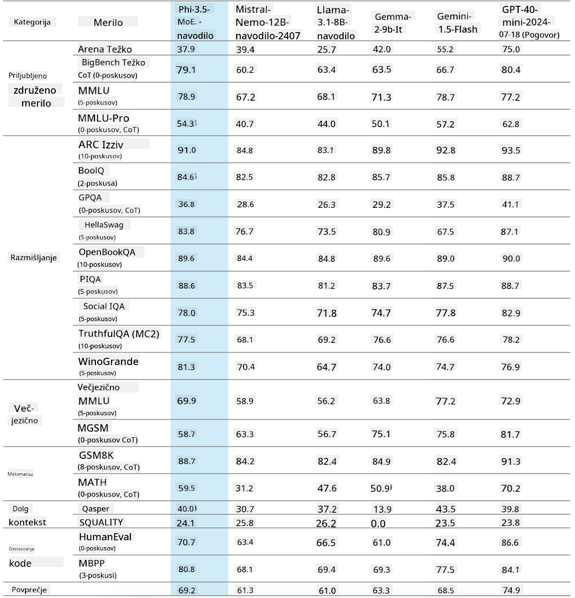
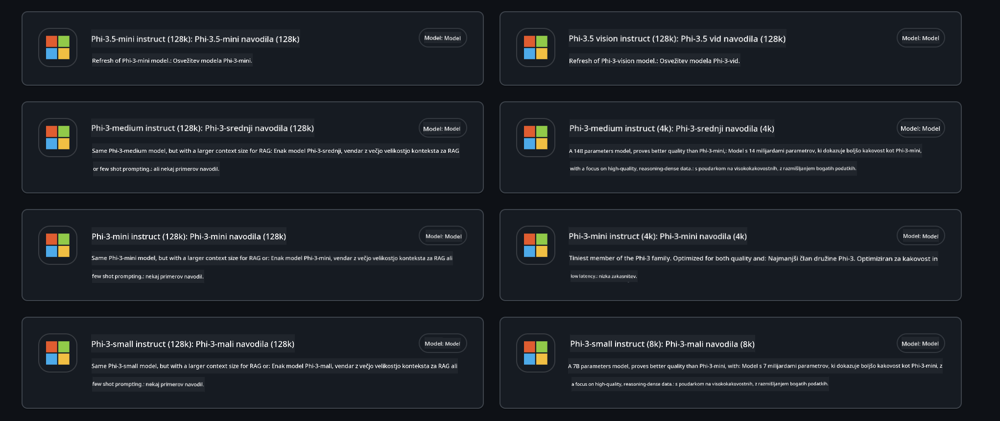
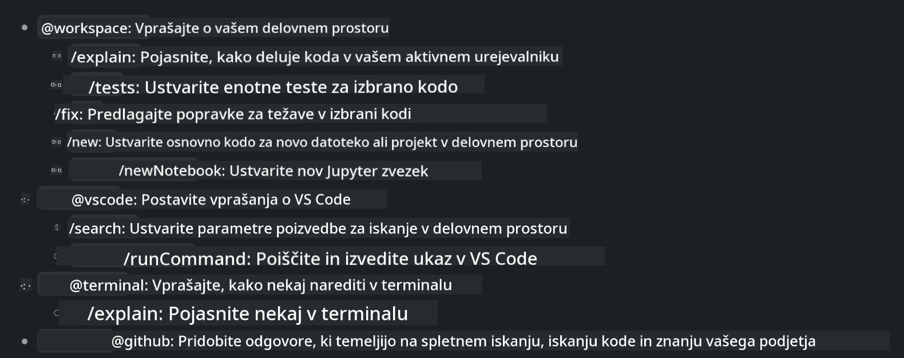
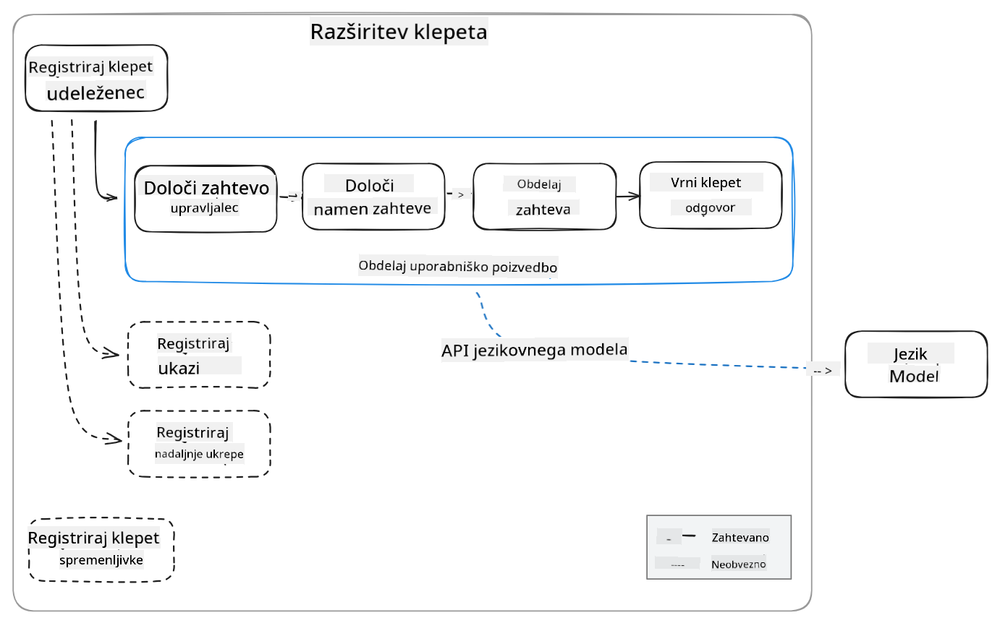
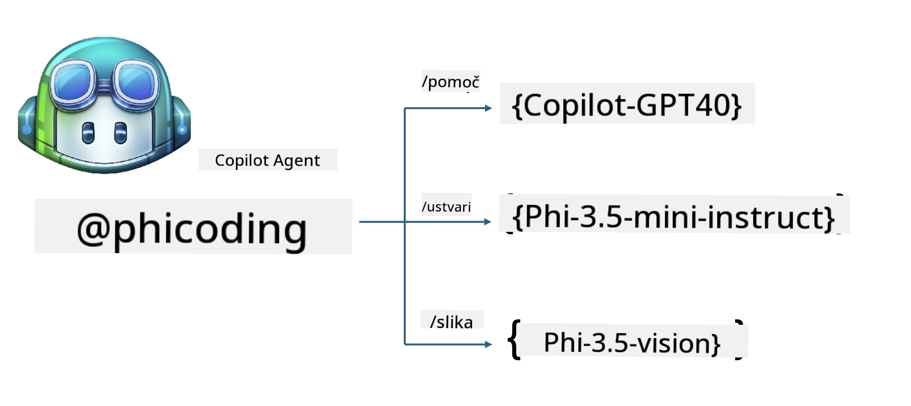
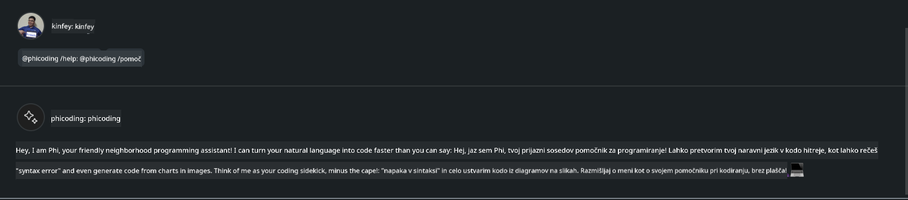
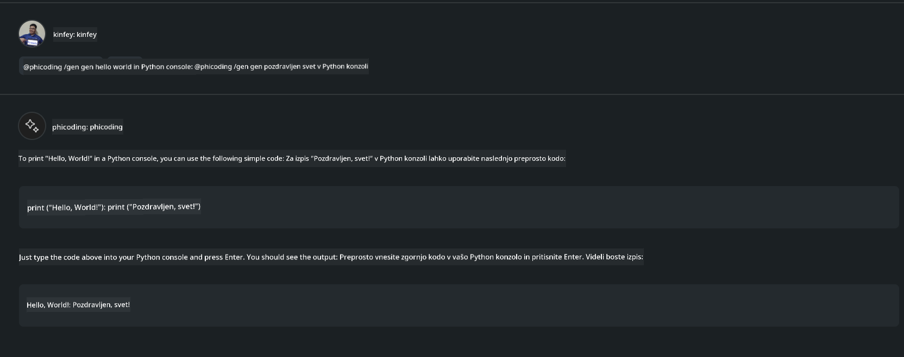
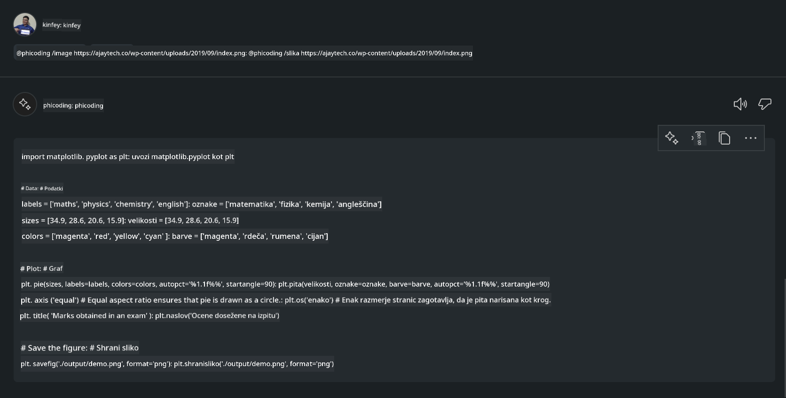

<!--
CO_OP_TRANSLATOR_METADATA:
{
  "original_hash": "35bf81388ac6917277b8d9a0c39bdc70",
  "translation_date": "2025-07-17T03:31:16+00:00",
  "source_file": "md/02.Application/02.Code/Phi3/CreateVSCodeChatAgentWithGitHubModels.md",
  "language_code": "sl"
}
-->
# **Ustvarite svojega Visual Studio Code Chat Copilot agenta z Phi-3.5 iz GitHub Models**

Ali uporabljate Visual Studio Code Copilot? Še posebej v Chat načinu lahko uporabite različne agente za izboljšanje sposobnosti ustvarjanja, pisanja in vzdrževanja projektov v Visual Studio Code. Visual Studio Code ponuja API, ki podjetjem in posameznikom omogoča ustvarjanje različnih agentov, prilagojenih njihovemu poslovanju, za razširitev zmogljivosti na različnih področjih. V tem članku se bomo osredotočili na **Phi-3.5-mini-instruct (128k)** in **Phi-3.5-vision-instruct (128k)** iz GitHub Models za ustvarjanje lastnega Visual Studio Code agenta.

## **O Phi-3.5 na GitHub Models**

Vemo, da ima Phi-3/3.5-mini-instruct iz družine Phi-3/3.5 močne sposobnosti razumevanja in generiranja kode ter prednosti pred Gemma-2-9b in Mistral-Nemo-12B-instruct-2407.



Najnovejši GitHub Models že omogočajo dostop do modelov Phi-3.5-mini-instruct (128k) in Phi-3.5-vision-instruct (128k). Razvijalci do njih dostopajo preko OpenAI SDK, Azure AI Inference SDK in REST API.



***Note:*** Priporočljivo je uporabljati Azure AI Inference SDK, saj omogoča bolj gladko preklapljanje z Azure Model Catalog v produkcijskem okolju.

Spodaj so prikazani rezultati **Phi-3.5-mini-instruct (128k)** in **Phi-3.5-vision-instruct (128k)** v scenariju generiranja kode po povezavi z GitHub Models, prav tako pa so pripravljeni za naslednje primere.

**Demo: GitHub Models Phi-3.5-mini-instruct (128k) generira kodo iz Prompt** ([kliknite tukaj](../../../../../../code/09.UpdateSamples/Aug/ghmodel_phi35_instruct_demo.ipynb))

**Demo: GitHub Models Phi-3.5-vision-instruct (128k) generira kodo iz slike** ([kliknite tukaj](../../../../../../code/09.UpdateSamples/Aug/ghmodel_phi35_vision_demo.ipynb))


## **O GitHub Copilot Chat Agentu**

GitHub Copilot Chat Agent lahko opravi različne naloge v različnih projektnih scenarijih na podlagi kode. Sistem ima štiri agente: workspace, github, terminal, vscode.



Z dodajanjem imena agenta z ‘@’ lahko hitro opravite ustrezno delo. Za podjetja, če dodate vsebine, povezane z vašim poslovanjem, kot so zahteve, kodiranje, testne specifikacije in izdaje, lahko pridobite močnejše zasebne funkcije za podjetja, ki temeljijo na GitHub Copilot.

Visual Studio Code Chat Agent je zdaj uradno izdal svoj API, ki podjetjem ali razvijalcem omogoča razvoj agentov, prilagojenih različnim ekosistemom programske opreme. Na podlagi metode razvoja Visual Studio Code Extension Development lahko enostavno dostopate do vmesnika Visual Studio Code Chat Agent API. Razvijamo lahko na podlagi tega procesa.



Razvojni scenarij podpira dostop do API-jev tretjih modelov (kot so GitHub Models, Azure Model Catalog in lastne storitve, zgrajene na odprtokodnih modelih) ter lahko uporablja tudi modele gpt-35-turbo, gpt-4 in gpt-4o, ki jih zagotavlja GitHub Copilot.

## **Dodajanje agenta @phicoding na osnovi Phi-3.5**

Poskušamo združiti programerske zmogljivosti Phi-3.5 za dokončanje pisanja kode, generiranja kode iz slik in drugih nalog. Ustvarimo agenta, zgrajenega okoli Phi-3.5 - @PHI, spodaj so nekatere funkcije:

1. Generira samopredstavitev na podlagi GPT-4o, ki ga zagotavlja GitHub Copilot, preko ukaza **@phicoding /help**

2. Generira kodo za različne programske jezike na podlagi **Phi-3.5-mini-instruct (128k)** preko ukaza **@phicoding /gen**

3. Generira kodo na podlagi **Phi-3.5-vision-instruct (128k)** in dokončuje kodo iz slike preko ukaza **@phicoding /image**



## **Povezani koraki**

1. Namestite podporo za razvoj Visual Studio Code Extension z uporabo npm

```bash

npm install --global yo generator-code 

```
2. Ustvarite Visual Studio Code Extension vtičnik (v načinu razvoja Typescript, poimenujte phiext)

```bash

yo code 

```

3. Odprite ustvarjeni projekt in uredite package.json. Tukaj so povezane instrukcije in konfiguracije, vključno s konfiguracijo GitHub Models. Pomembno je, da tukaj dodate svoj GitHub Models žeton.

```json

{
  "name": "phiext",
  "displayName": "phiext",
  "description": "",
  "version": "0.0.1",
  "engines": {
    "vscode": "^1.93.0"
  },
  "categories": [
    "AI",
    "Chat"
  ],
  "activationEvents": [],
  "enabledApiProposals": [
      "chatVariableResolver"
  ],
  "main": "./dist/extension.js",
  "contributes": {
    "chatParticipants": [
        {
            "id": "chat.phicoding",
            "name": "phicoding",
            "description": "Hey! I am Microsoft Phi-3.5, She can help me with coding problems, such as generation code with your natural language, or even generation code about chart from images. Just ask me anything!",
            "isSticky": true,
            "commands": [
                {
                    "name": "help",
                    "description": "Introduce myself to you"
                },
                {
                    "name": "gen",
                    "description": "Generate code for you with Microsoft Phi-3.5-mini-instruct"
                },
                {
                    "name": "image",
                    "description": "Generate code for chart from image(png or jpg) with Microsoft Phi-3.5-vision-instruct, please add image url like this : https://ajaytech.co/wp-content/uploads/2019/09/index.png"
                }
            ]
        }
    ],
    "commands": [
        {
            "command": "phicoding.namesInEditor",
            "title": "Use Microsoft Phi 3.5 in Editor"
        }
    ],
    "configuration": {
      "type": "object",
      "title": "githubmodels",
      "properties": {
        "githubmodels.endpoint": {
          "type": "string",
          "default": "https://models.inference.ai.azure.com",
          "description": "Your GitHub Models Endpoint",
          "order": 0
        },
        "githubmodels.api_key": {
          "type": "string",
          "default": "Your GitHub Models Token",
          "description": "Your GitHub Models Token",
          "order": 1
        },
        "githubmodels.phi35instruct": {
          "type": "string",
          "default": "Phi-3.5-mini-instruct",
          "description": "Your Phi-35-Instruct Model",
          "order": 2
        },
        "githubmodels.phi35vision": {
          "type": "string",
          "default": "Phi-3.5-vision-instruct",
          "description": "Your Phi-35-Vision Model",
          "order": 3
        }
      }
    }
  },
  "scripts": {
    "vscode:prepublish": "npm run package",
    "compile": "webpack",
    "watch": "webpack --watch",
    "package": "webpack --mode production --devtool hidden-source-map",
    "compile-tests": "tsc -p . --outDir out",
    "watch-tests": "tsc -p . -w --outDir out",
    "pretest": "npm run compile-tests && npm run compile && npm run lint",
    "lint": "eslint src",
    "test": "vscode-test"
  },
  "devDependencies": {
    "@types/vscode": "^1.93.0",
    "@types/mocha": "^10.0.7",
    "@types/node": "20.x",
    "@typescript-eslint/eslint-plugin": "^8.3.0",
    "@typescript-eslint/parser": "^8.3.0",
    "eslint": "^9.9.1",
    "typescript": "^5.5.4",
    "ts-loader": "^9.5.1",
    "webpack": "^5.94.0",
    "webpack-cli": "^5.1.4",
    "@vscode/test-cli": "^0.0.10",
    "@vscode/test-electron": "^2.4.1"
  },
  "dependencies": {
    "@types/node-fetch": "^2.6.11",
    "node-fetch": "^3.3.2",
    "@azure-rest/ai-inference": "latest",
    "@azure/core-auth": "latest",
    "@azure/core-sse": "latest"
  }
}


```

4. Uredite src/extension.ts

```typescript

// The module 'vscode' contains the VS Code extensibility API
// Import the module and reference it with the alias vscode in your code below
import * as vscode from 'vscode';
import ModelClient from "@azure-rest/ai-inference";
import { AzureKeyCredential } from "@azure/core-auth";


interface IPhiChatResult extends vscode.ChatResult {
    metadata: {
        command: string;
    };
}


const MODEL_SELECTOR: vscode.LanguageModelChatSelector = { vendor: 'copilot', family: 'gpt-4o' };

function isValidImageUrl(url: string): boolean {
    const regex = /^(https?:\/\/.*\.(?:png|jpg))$/i;
    return regex.test(url);
}
  

// This method is called when your extension is activated
// Your extension is activated the very first time the command is executed
export function activate(context: vscode.ExtensionContext) {

    const codinghandler: vscode.ChatRequestHandler = async (request: vscode.ChatRequest, context: vscode.ChatContext, stream: vscode.ChatResponseStream, token: vscode.CancellationToken): Promise<IPhiChatResult> => {


        const config : any = vscode.workspace.getConfiguration('githubmodels');
        const endPoint: string = config.get('endpoint');
        const apiKey: string = config.get('api_key');
        const phi35instruct: string = config.get('phi35instruct');
        const phi35vision: string = config.get('phi35vision');
        
        if (request.command === 'help') {

            const content = "Welcome to Coding assistant with Microsoft Phi-3.5"; 
            stream.progress(content);


            try {
                const [model] = await vscode.lm.selectChatModels(MODEL_SELECTOR);
                if (model) {
                    const messages = [
                        vscode.LanguageModelChatMessage.User("Please help me express this content in a humorous way: I am a programming assistant who can help you convert natural language into code and generate code based on the charts in the images. output format like this : Hey I am Phi ......")
                    ];
                    const chatResponse = await model.sendRequest(messages, {}, token);
                    for await (const fragment of chatResponse.text) {
                        stream.markdown(fragment);
                    }
                }
            } catch(err) {
                console.log(err);
            }


            return { metadata: { command: 'help' } };

        }

        
        if (request.command === 'gen') {

            const content = "Welcome to use phi-3.5 to generate code";

            stream.progress(content);

            const client = new ModelClient(endPoint, new AzureKeyCredential(apiKey));

            const response = await client.path("/chat/completions").post({
              body: {
                messages: [
                  { role:"system", content: "You are a coding assistant.Help answer all code generation questions." },
                  { role:"user", content: request.prompt }
                ],
                model: phi35instruct,
                temperature: 0.4,
                max_tokens: 1000,
                top_p: 1.
              }
            });

            stream.markdown(response.body.choices[0].message.content);

            return { metadata: { command: 'gen' } };

        }


        
        if (request.command === 'image') {


            const content = "Welcome to use phi-3.5 to generate code from image(png or jpg),image url like this:https://ajaytech.co/wp-content/uploads/2019/09/index.png";

            stream.progress(content);

            if (!isValidImageUrl(request.prompt)) {
                stream.markdown('Please provide a valid image URL');
                return { metadata: { command: 'image' } };
            }
            else
            {

                const client = new ModelClient(endPoint, new AzureKeyCredential(apiKey));
    
                const response = await client.path("/chat/completions").post({
                    body: {
                      messages: [
                        { role: "system", content: "You are a helpful assistant that describes images in details." },
                        { role: "user", content: [
                            { type: "text", text: "Please generate code according to the chart in the picture according to the following requirements\n1. Keep all information in the chart, including data and text\n2. Do not generate additional information that is not included in the chart\n3. Please extract data from the picture, do not generate it from csv\n4. Please save the regenerated chart as a chart and save it to ./output/demo.png"},
                            { type: "image_url", image_url: {url: request.prompt}
                            }
                          ]
                        }
                      ],
                      model: phi35vision,
                      temperature: 0.4,
                      max_tokens: 2048,
                      top_p: 1.
                    }
                  });
    
                
                stream.markdown(response.body.choices[0].message.content);
    
                return { metadata: { command: 'image' } };
            }


        }


        return { metadata: { command: '' } };
    };


    const phi_ext = vscode.chat.createChatParticipant("chat.phicoding", codinghandler);

    phi_ext.iconPath = new vscode.ThemeIcon('sparkle');


    phi_ext.followupProvider = {
        provideFollowups(result: IPhiChatResult, context: vscode.ChatContext, token: vscode.CancellationToken) {
            return [{
                prompt: 'Let us coding with Phi-3.5 😋😋😋😋',
                label: vscode.l10n.t('Enjoy coding with Phi-3.5'),
                command: 'help'
            } satisfies vscode.ChatFollowup];
        }
    };

    context.subscriptions.push(phi_ext);
}

// This method is called when your extension is deactivated
export function deactivate() {}


```

6. Zagon

***/help***


***@phicoding /help***



***@phicoding /gen***



***@phicoding /image***



Vzorec kode lahko prenesete tukaj: [kliknite](../../../../../../code/09.UpdateSamples/Aug/vscode)

## **Viri**

1. Registracija za GitHub Models [https://gh.io/models](https://gh.io/models)

2. Naučite se razvoja Visual Studio Code Extension [https://code.visualstudio.com/api/get-started/your-first-extension](https://code.visualstudio.com/api/get-started/your-first-extension)

3. Spoznajte Visual Studio Code Copilot Chat API [https://code.visualstudio.com/api/extension-guides/chat](https://code.visualstudio.com/api/extension-guides/chat)

**Omejitev odgovornosti**:  
Ta dokument je bil preveden z uporabo AI prevajalske storitve [Co-op Translator](https://github.com/Azure/co-op-translator). Čeprav si prizadevamo za natančnost, vas opozarjamo, da avtomatizirani prevodi lahko vsebujejo napake ali netočnosti. Izvirni dokument v njegovem izvirnem jeziku velja za avtoritativni vir. Za ključne informacije priporočamo strokovni človeški prevod. Za morebitna nesporazume ali napačne interpretacije, ki izhajajo iz uporabe tega prevoda, ne odgovarjamo.