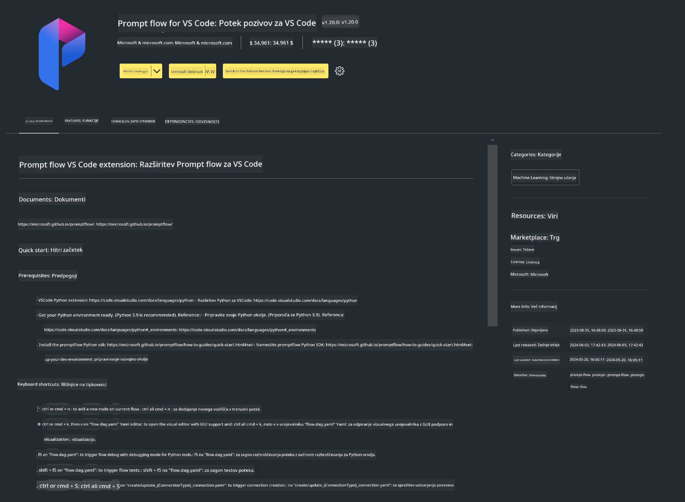

<!--
CO_OP_TRANSLATOR_METADATA:
{
  "original_hash": "a4ef39027902e82f2c33d568d2a2259a",
  "translation_date": "2025-05-09T19:21:48+00:00",
  "source_file": "md/02.Application/02.Code/Phi3/VSCodeExt/HOL/AIPC/01.Installations.md",
  "language_code": "sl"
}
-->
# **Lab 0 - Namestitev**

Ko vstopimo v laboratorij, moramo nastaviti ustrezno okolje:

### **1. Python 3.11+**

Priporočamo uporabo miniforge za nastavitev vašega Python okolja.

Za nastavitev miniforge si oglejte [https://github.com/conda-forge/miniforge](https://github.com/conda-forge/miniforge)

Po nastavitvi miniforge zaženite naslednji ukaz v Power Shellu

```bash

conda create -n pyenv python==3.11.8 -y

conda activate pyenv

```

### **2. Namestitev Prompt flow SDK**

V Lab 1 uporabljamo Prompt flow, zato morate nastaviti Prompt flow SDK.

```bash

pip install promptflow --upgrade

```

Za preverjanje promptflow sdk uporabite ta ukaz

```bash

pf --version

```

### **3. Namestitev Visual Studio Code Prompt flow razširitve**



### **4. Intel NPU Acceleration Library**

Intelovi procesorji nove generacije podpirajo NPU. Če želite lokalno poganjati LLM-je / SLM-je z uporabo NPU, lahko uporabite ***Intel NPU Acceleration Library***. Za več informacij preberite [https://github.com/microsoft/PhiCookBook/blob/main/md/01.Introduction/03/AIPC_Inference.md](https://github.com/microsoft/PhiCookBook/blob/main/md/01.Introduction/03/AIPC_Inference.md).

Namestite Intel NPU Acceleration Library v bashu

```bash

pip install intel-npu-acceleration-library

```

***Note***: Upoštevajte, da ta knjižnica podpira transformers ***4.40.2***, prosimo, preverite različico.

### **5. Druge Python knjižnice**

Ustvarite datoteko requirements.txt in vanjo dodajte naslednjo vsebino

```txt

notebook
numpy 
scipy 
scikit-learn 
matplotlib 
pandas 
pillow 
graphviz

```

### **6. Namestitev NVM**

Namestite nvm v Powershellu

```bash

winget install -e --id CoreyButler.NVMforWindows

```

Namestite nodejs 18.20

```bash

nvm install 18.20.0

nvm use 18.20.0

```

### **7. Namestitev podpore za razvoj v Visual Studio Code**

```bash

npm install --global yo generator-code

```

Čestitke! Uspešno ste nastavili SDK. Nadaljujte z izvajanjem praktičnih korakov.

**Omejitev odgovornosti**:  
Ta dokument je bil preveden z uporabo AI prevajalske storitve [Co-op Translator](https://github.com/Azure/co-op-translator). Čeprav si prizadevamo za natančnost, vas prosimo, da upoštevate, da lahko avtomatizirani prevodi vsebujejo napake ali netočnosti. Izvirni dokument v njegovem izvirnem jeziku velja za avtoritativni vir. Za kritične informacije priporočamo strokovni človeški prevod. Nismo odgovorni za morebitna nesporazumevanja ali napačne interpretacije, ki izhajajo iz uporabe tega prevoda.