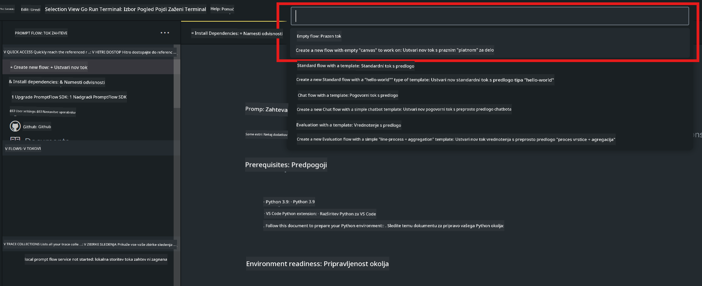

<!--
CO_OP_TRANSLATOR_METADATA:
{
  "original_hash": "bc29f7fe7fc16bed6932733eac8c81b8",
  "translation_date": "2025-07-17T04:02:41+00:00",
  "source_file": "md/02.Application/02.Code/Phi3/VSCodeExt/HOL/AIPC/02.PromptflowWithNPU.md",
  "language_code": "sl"
}
-->
# **Lab 2 - Zaženi Prompt flow s Phi-3-mini v AIPC**

## **Kaj je Prompt flow**

Prompt flow je zbirka razvojnih orodij, zasnovanih za poenostavitev celotnega razvojnega cikla AI aplikacij, ki temeljijo na LLM, od ideje, prototipiranja, testiranja, ocenjevanja do uvajanja v produkcijo in spremljanja. Omogoča lažje oblikovanje promptov in vam pomaga graditi LLM aplikacije z produkcijsko kakovostjo.

Z uporabo prompt flow boste lahko:

- Ustvarjali tokove, ki povezujejo LLM, prompte, Python kodo in druga orodja v izvršljiv delovni proces.

- Enostavno odpravljali napake in iterirali svoje tokove, še posebej interakcijo z LLM.

- Ocenjevali svoje tokove, izračunavali metrike kakovosti in zmogljivosti na večjih podatkovnih nizih.

- Integrirali testiranje in ocenjevanje v vaš CI/CD sistem za zagotavljanje kakovosti toka.

- Enostavno uvajali tokove na izbrano platformo za strežbo ali jih vključili v kodo vaše aplikacije.

- (Neobvezno, a zelo priporočljivo) Sodelovali s svojo ekipo z uporabo oblačne različice Prompt flow v Azure AI.

## **Kaj je AIPC**

AI PC ima CPU, GPU in NPU, vsak s posebnimi zmogljivostmi za pospeševanje AI. NPU, oziroma nevronska procesna enota, je specializiran pospeševalnik, ki opravlja naloge umetne inteligence (AI) in strojnega učenja (ML) neposredno na vašem računalniku, namesto da bi podatke pošiljal v oblak. GPU in CPU lahko prav tako obdelujeta te naloge, vendar je NPU posebej učinkovit pri nizkoenergijskih AI izračunih. AI PC predstavlja temeljno spremembo v delovanju naših računalnikov. Ni rešitev za problem, ki prej ni obstajal, ampak obljublja velik napredek pri vsakodnevni uporabi računalnika.

Kako to deluje? V primerjavi z generativno AI in velikimi jezikovnimi modeli (LLM), ki so usposobljeni na ogromnih količinah javnih podatkov, je AI, ki bo delovala na vašem računalniku, dostopnejša na skoraj vseh ravneh. Koncept je lažje razumljiv, in ker je usposobljen na vaših podatkih, brez potrebe po dostopu do oblaka, so koristi takoj bolj privlačne širši populaciji.

V bližnji prihodnosti bo svet AI PC vključeval osebne asistente in manjše AI modele, ki bodo tekli neposredno na vašem računalniku, uporabljali vaše podatke za osebne, zasebne in varnejše AI izboljšave za stvari, ki jih že počnete vsak dan – zapisovanje zapisnikov sestankov, organizacijo fantazijske nogometne lige, avtomatizacijo izboljšav za urejanje fotografij in videoposnetkov ali pripravo popolnega načrta za družinsko srečanje glede na prihode in odhode vseh udeležencev.

## **Gradnja generacijskih kodnih tokov na AIPC**

***Note*** ：Če še niste dokončali namestitve okolja, obiščite [Lab 0 -Installations](./01.Installations.md)

1. Odprite Prompt flow razširitev v Visual Studio Code in ustvarite prazen projekt toka



2. Dodajte vhodne in izhodne parametre ter dodajte Python kodo kot nov tok


Za konstrukcijo vašega toka se lahko sklicujete na to strukturo (flow.dag.yaml)

```yaml

inputs:
  question:
    type: string
    default: how to write Bubble Algorithm
outputs:
  answer:
    type: string
    reference: ${Chat_With_Phi3.output}
nodes:
- name: Chat_With_Phi3
  type: python
  source:
    type: code
    path: Chat_With_Phi3.py
  inputs:
    question: ${inputs.question}


```

3. Dodajte kodo v ***Chat_With_Phi3.py***

```python


from promptflow.core import tool

# import torch
from transformers import AutoTokenizer, pipeline,TextStreamer
import intel_npu_acceleration_library as npu_lib

import warnings

import asyncio
import platform

class Phi3CodeAgent:
    
    model = None
    tokenizer = None
    text_streamer = None
    
    model_id = "microsoft/Phi-3-mini-4k-instruct"

    @staticmethod
    def init_phi3():
        
        if Phi3CodeAgent.model is None or Phi3CodeAgent.tokenizer is None or Phi3CodeAgent.text_streamer is None:
            Phi3CodeAgent.model = npu_lib.NPUModelForCausalLM.from_pretrained(
                                    Phi3CodeAgent.model_id,
                                    torch_dtype="auto",
                                    dtype=npu_lib.int4,
                                    trust_remote_code=True
                                )
            Phi3CodeAgent.tokenizer = AutoTokenizer.from_pretrained(Phi3CodeAgent.model_id)
            Phi3CodeAgent.text_streamer = TextStreamer(Phi3CodeAgent.tokenizer, skip_prompt=True)

    

    @staticmethod
    def chat_with_phi3(prompt):
        
        Phi3CodeAgent.init_phi3()

        messages = "<|system|>You are a AI Python coding assistant. Please help me to generate code in Python.The answer only genertated Python code, but any comments and instructions do not need to be generated<|end|><|user|>" + prompt +"<|end|><|assistant|>"


        generation_args = {
            "max_new_tokens": 1024,
            "return_full_text": False,
            "temperature": 0.3,
            "do_sample": False,
            "streamer": Phi3CodeAgent.text_streamer,
        }

        pipe = pipeline(
            "text-generation",
            model=Phi3CodeAgent.model,
            tokenizer=Phi3CodeAgent.tokenizer,
            # **generation_args
        )

        result = ''

        with warnings.catch_warnings():
            warnings.simplefilter("ignore")
            response = pipe(messages, **generation_args)
            result =response[0]['generated_text']
            return result


@tool
def my_python_tool(question: str) -> str:
    if platform.system() == 'Windows':
        asyncio.set_event_loop_policy(asyncio.WindowsSelectorEventLoopPolicy())
    return Phi3CodeAgent.chat_with_phi3(question)


```

4. Tok lahko preizkusite z Debug ali Run, da preverite, ali generiranje kode deluje pravilno


5. Zaženite tok kot razvojni API v terminalu

```

pf flow serve --source ./ --port 8080 --host localhost   

```

Lahko ga preizkusite v Postman / Thunder Client

### **Note**

1. Prvi zagon traja dlje. Priporočamo, da model phi-3 prenesete preko Hugging face CLI.

2. Glede na omejeno računsko moč Intel NPU je priporočljivo uporabiti Phi-3-mini-4k-instruct

3. Uporabljamo Intel NPU pospeševanje za kvantizacijo INT4 pretvorbe, vendar če storitev ponovno zaženete, morate izbrisati mape cache in nc_workshop.

## **Viri**

1. Spoznajte Promptflow [https://microsoft.github.io/promptflow/](https://microsoft.github.io/promptflow/)

2. Spoznajte Intel NPU Acceleration [https://github.com/intel/intel-npu-acceleration-library](https://github.com/intel/intel-npu-acceleration-library)

3. Vzorec kode, prenesite [Local NPU Agent Sample Code](../../../../../../../../../code/07.Lab/01/AIPC)

**Omejitev odgovornosti**:  
Ta dokument je bil preveden z uporabo AI prevajalske storitve [Co-op Translator](https://github.com/Azure/co-op-translator). Čeprav si prizadevamo za natančnost, vas opozarjamo, da avtomatizirani prevodi lahko vsebujejo napake ali netočnosti. Izvirni dokument v njegovem izvirnem jeziku velja za avtoritativni vir. Za ključne informacije priporočamo strokovni človeški prevod. Za morebitna nesporazume ali napačne interpretacije, ki izhajajo iz uporabe tega prevoda, ne odgovarjamo.