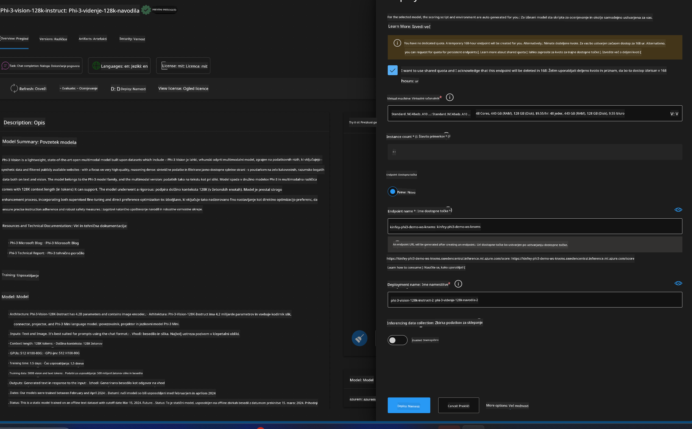
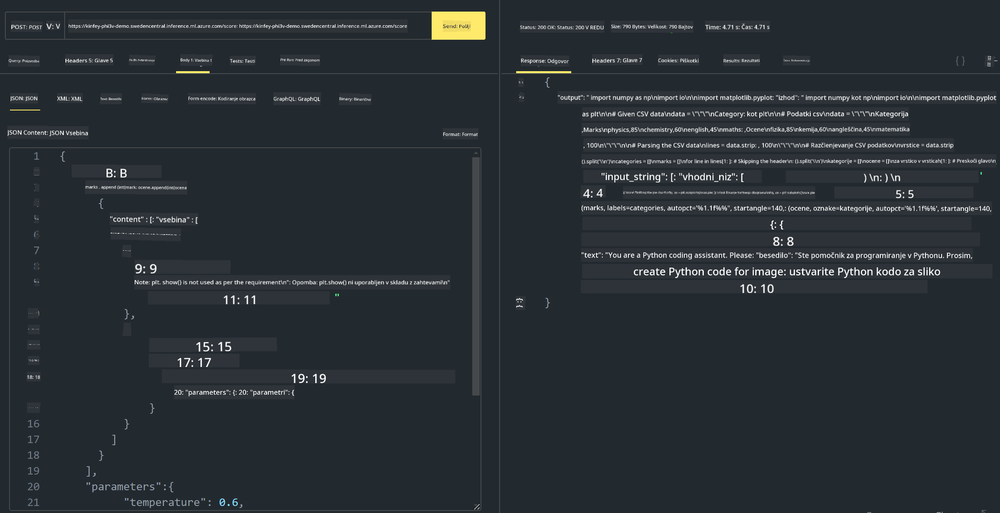

<!--
CO_OP_TRANSLATOR_METADATA:
{
  "original_hash": "20cb4e6ac1686248e8be913ccf6c2bc2",
  "translation_date": "2025-05-09T19:30:41+00:00",
  "source_file": "md/02.Application/02.Code/Phi3/VSCodeExt/HOL/AIPC/03.DeployPhi3VisionOnAzure.md",
  "language_code": "sl"
}
-->
# **Lab 3 - Deploy Phi-3-vision on Azure Machine Learning Service**

We use NPU to finish the production deployment of local code, and now we want to add the capability of PHI-3-VISION to generate code from images.

In this guide, we’ll quickly set up a Model As Service Phi-3 Vision service on Azure Machine Learning Service.

***Note***： Phi-3 Vision needs strong computing power to generate content quickly. Cloud computing resources are required to support this.


### **1. Create Azure Machine Learning Service**

You need to create an Azure Machine Learning Service in the Azure Portal. For detailed instructions, please visit [https://learn.microsoft.com/azure/machine-learning/quickstart-create-resources?view=azureml-api-2](https://learn.microsoft.com/azure/machine-learning/quickstart-create-resources?view=azureml-api-2)


### **2. Choose Phi-3 Vision in Azure Machine Learning Service**


### **3. Deploy Phi-3-Vision in Azure**





### **4. Test Endpoint in Postman**





***Note***

1. The parameters you send must include Authorization, azureml-model-deployment, and Content-Type. Check the deployment details to get these values.

2. To send parameters, Phi-3-Vision requires an image URL. Please refer to the GPT-4-Vision method for sending parameters, for example

```json

{
  "input_data":{
    "input_string":[
      {
        "role":"user",
        "content":[ 
          {
            "type": "text",
            "text": "You are a Python coding assistant.Please create Python code for image "
          },
          {
              "type": "image_url",
              "image_url": {
                "url": "https://ajaytech.co/wp-content/uploads/2019/09/index.png"
              }
          }
        ]
      }
    ],
    "parameters":{
          "temperature": 0.6,
          "top_p": 0.9,
          "do_sample": false,
          "max_new_tokens": 2048
    }
  }
}

```

3. Use the Post method to call **/score**

**Congratulations**! You have successfully deployed PHI-3-VISION quickly and tested how to generate code from images. Next, you can build applications combining NPUs and cloud services.

**Izjava o omejitvi odgovornosti**:  
Ta dokument je bil preveden z uporabo storitve AI prevajanja [Co-op Translator](https://github.com/Azure/co-op-translator). Čeprav si prizadevamo za natančnost, upoštevajte, da lahko avtomatizirani prevodi vsebujejo napake ali netočnosti. Izvirni dokument v njegovem maternem jeziku velja za avtoritativni vir. Za ključne informacije priporočamo strokovni človeški prevod. Za morebitna nesporazume ali napačne interpretacije, ki izhajajo iz uporabe tega prevoda, ne odgovarjamo.