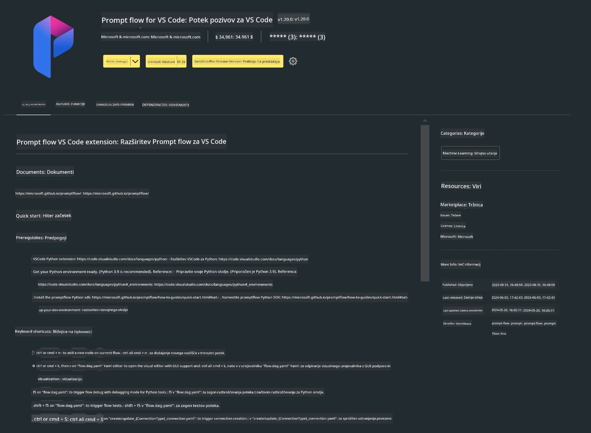

# **Lab 0 - Namestitev**

Ko vstopimo v laboratorij, moramo nastaviti ustrezno okolje:


### **1. Python 3.11+**

Priporočamo uporabo miniforge za nastavitev vašega Python okolja.

Za nastavitev miniforge si oglejte [https://github.com/conda-forge/miniforge](https://github.com/conda-forge/miniforge)

Po nastavitvi miniforge zaženite naslednji ukaz v Power Shell


```bash

conda create -n pyenv python==3.11.8 -y

conda activate pyenv

```


### **2. Namestitev Prompt flow SDK**

V Lab 1 uporabljamo Prompt flow, zato morate nastaviti Prompt flow SDK.

```bash

pip install promptflow --upgrade

```

Promptflow sdk lahko preverite z naslednjim ukazom


```bash

pf --version

```

### **3. Namestitev Visual Studio Code razširitve za Prompt flow**



### **4. Apple MLX Framework**

MLX je ogrodje za raziskave strojnega učenja na Apple silikonu, ki ga je razvilo Apple machine learning research. Z **Apple MLX framework** lahko pospešite LLM / SLM z Apple Silicon. Če želite izvedeti več, si lahko preberete [https://github.com/microsoft/PhiCookBook/blob/main/md/01.Introduction/03/MLX_Inference.md](https://github.com/microsoft/PhiCookBook/blob/main/md/01.Introduction/03/MLX_Inference.md).

Namestite MLX framework knjižnico v bash


```bash

pip install mlx-lm

```


### **5. Druge Python knjižnice**

Ustvarite datoteko requirements.txt in vanjo dodajte naslednjo vsebino

```txt

notebook
numpy 
scipy 
scikit-learn 
matplotlib 
pandas 
pillow 
graphviz

```


### **6. Namestitev NVM**

Namestite nvm v Powershell


```bash

brew install nvm

```

Namestite nodejs 18.20


```bash

nvm install 18.20.0

nvm use 18.20.0

```

### **7. Namestitev podpore za razvoj v Visual Studio Code**


```bash

npm install --global yo generator-code

```

Čestitke! Uspešno ste nastavili SDK. Nadaljujte z naslednjimi praktičnimi koraki.

**Omejitev odgovornosti**:  
Ta dokument je bil preveden z uporabo AI prevajalske storitve [Co-op Translator](https://github.com/Azure/co-op-translator). Čeprav si prizadevamo za natančnost, vas opozarjamo, da avtomatizirani prevodi lahko vsebujejo napake ali netočnosti. Izvirni dokument v njegovem izvirnem jeziku velja za avtoritativni vir. Za ključne informacije priporočamo strokovni človeški prevod. Za morebitna nesporazume ali napačne interpretacije, ki izhajajo iz uporabe tega prevoda, ne odgovarjamo.