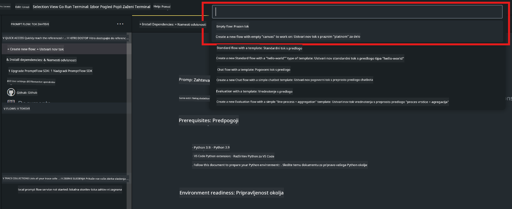
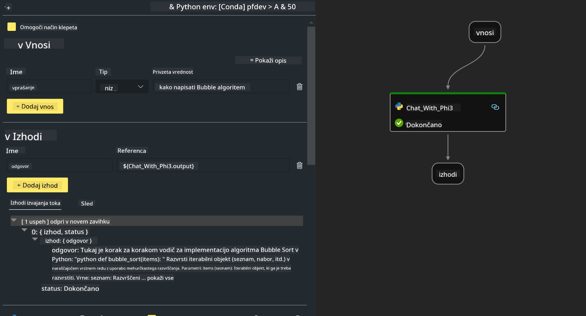
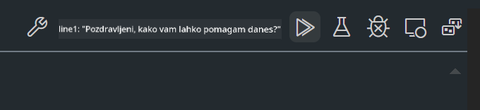

<!--
CO_OP_TRANSLATOR_METADATA:
{
  "original_hash": "3dbbf568625b1ee04b354c2dc81d3248",
  "translation_date": "2025-07-17T04:29:37+00:00",
  "source_file": "md/02.Application/02.Code/Phi3/VSCodeExt/HOL/Apple/02.PromptflowWithMLX.md",
  "language_code": "sl"
}
-->
# **Lab 2 - Zagon Prompt flow s Phi-3-mini v AIPC**

## **Kaj je Prompt flow**

Prompt flow je zbirka razvojnih orodij, zasnovanih za poenostavitev celotnega razvojnega cikla AI aplikacij, ki temeljijo na LLM, od ideje, prototipiranja, testiranja, ocenjevanja do uvajanja v produkcijo in spremljanja. Omogoča lažje upravljanje z prompti in vam pomaga graditi LLM aplikacije z produkcijsko kakovostjo.

Z uporabo prompt flow boste lahko:

- Ustvarjali tokove, ki povezujejo LLM, prompte, Python kodo in druga orodja v izvršljiv delovni proces.

- Enostavno odpravljali napake in iterirali svoje tokove, še posebej interakcijo z LLM.

- Ocenjevali svoje tokove, izračunavali metrike kakovosti in zmogljivosti na večjih podatkovnih nizih.

- Integrirali testiranje in ocenjevanje v vaš CI/CD sistem za zagotavljanje kakovosti toka.

- Enostavno uvajali tokove na izbrano platformo za strežbo ali jih vključili v kodo vaše aplikacije.

- (Neobvezno, a zelo priporočljivo) Sodelovali s svojo ekipo z uporabo oblačne različice Prompt flow v Azure AI.

## **Gradnja generacijskih kodnih tokov na Apple Silicon**

***Note*** ：Če še niste dokončali namestitve okolja, obiščite [Lab 0 -Installations](./01.Installations.md)

1. Odprite Prompt flow razširitev v Visual Studio Code in ustvarite prazen projekt toka



2. Dodajte vhodne in izhodne parametre ter dodajte Python kodo kot nov tok



Za konstrukcijo toka se lahko sklicujete na to strukturo (flow.dag.yaml)

```yaml

inputs:
  prompt:
    type: string
    default: Write python code for Fibonacci serie. Please use markdown as output
outputs:
  result:
    type: string
    reference: ${gen_code_by_phi3.output}
nodes:
- name: gen_code_by_phi3
  type: python
  source:
    type: code
    path: gen_code_by_phi3.py
  inputs:
    prompt: ${inputs.prompt}


```

3. Kvantizirajte phi-3-mini

Želimo bolje poganjati SLM na lokalnih napravah. Na splošno kvantiziramo model (INT4, FP16, FP32)

```bash

python -m mlx_lm.convert --hf-path microsoft/Phi-3-mini-4k-instruct

```

**Note:** privzeta mapa je mlx_model

4. Dodajte kodo v ***Chat_With_Phi3.py***

```python


from promptflow import tool

from mlx_lm import load, generate


# The inputs section will change based on the arguments of the tool function, after you save the code
# Adding type to arguments and return value will help the system show the types properly
# Please update the function name/signature per need
@tool
def my_python_tool(prompt: str) -> str:

    model_id = './mlx_model_phi3_mini'

    model, tokenizer = load(model_id)

    # <|user|>\nWrite python code for Fibonacci serie. Please use markdown as output<|end|>\n<|assistant|>

    response = generate(model, tokenizer, prompt="<|user|>\n" + prompt  + "<|end|>\n<|assistant|>", max_tokens=2048, verbose=True)

    return response


```

4. Tok lahko preizkusite z Debug ali Run, da preverite, ali generiranje kode deluje pravilno



5. Zaženite tok kot razvojni API v terminalu

```

pf flow serve --source ./ --port 8080 --host localhost   

```

Preizkusite ga lahko v Postman / Thunder Client

### **Note**

1. Prvi zagon traja dlje časa. Priporočamo, da model phi-3 prenesete preko Hugging face CLI.

2. Glede na omejeno računsko moč Intel NPU je priporočljivo uporabiti Phi-3-mini-4k-instruct.

3. Za kvantizacijo INT4 pretvorbe uporabljamo Intel NPU pospeševanje, vendar če storitev ponovno zaženete, morate izbrisati mape cache in nc_workshop.

## **Viri**

1. Spoznajte Promptflow [https://microsoft.github.io/promptflow/](https://microsoft.github.io/promptflow/)

2. Spoznajte Intel NPU Acceleration [https://github.com/intel/intel-npu-acceleration-library](https://github.com/intel/intel-npu-acceleration-library)

3. Vzorec kode, prenesite [Local NPU Agent Sample Code](../../../../../../../../../code/07.Lab/01/AIPC/local-npu-agent)

**Omejitev odgovornosti**:  
Ta dokument je bil preveden z uporabo storitve za avtomatski prevod AI [Co-op Translator](https://github.com/Azure/co-op-translator). Čeprav si prizadevamo za natančnost, vas opozarjamo, da lahko avtomatski prevodi vsebujejo napake ali netočnosti. Izvirni dokument v njegovem izvirnem jeziku velja za avtoritativni vir. Za pomembne informacije priporočamo strokovni človeški prevod. Za morebitna nesporazume ali napačne interpretacije, ki izhajajo iz uporabe tega prevoda, ne odgovarjamo.