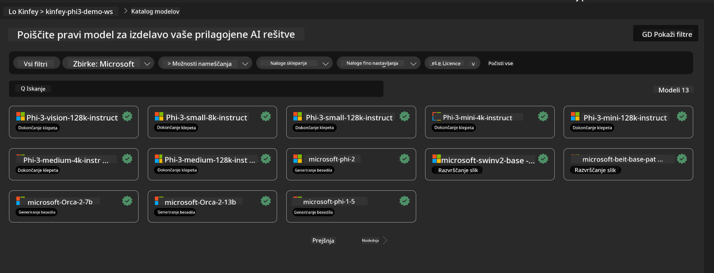
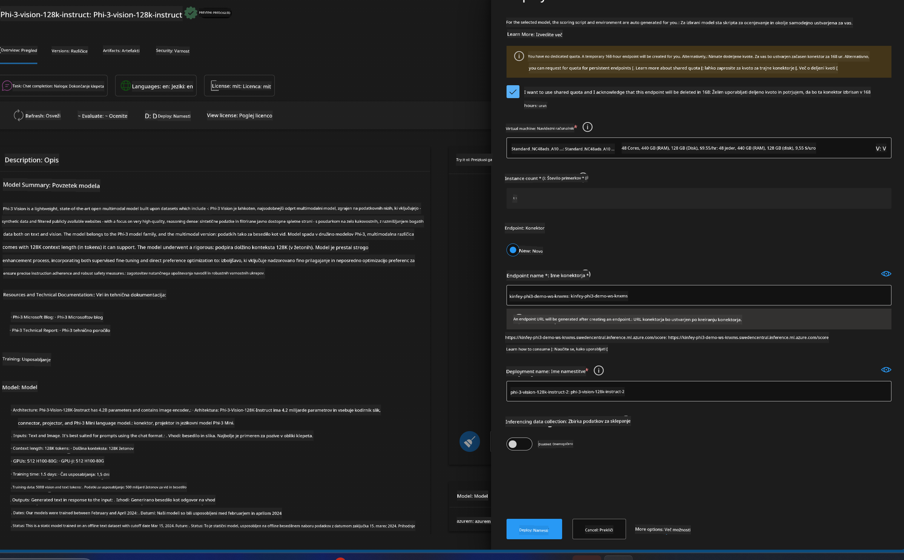
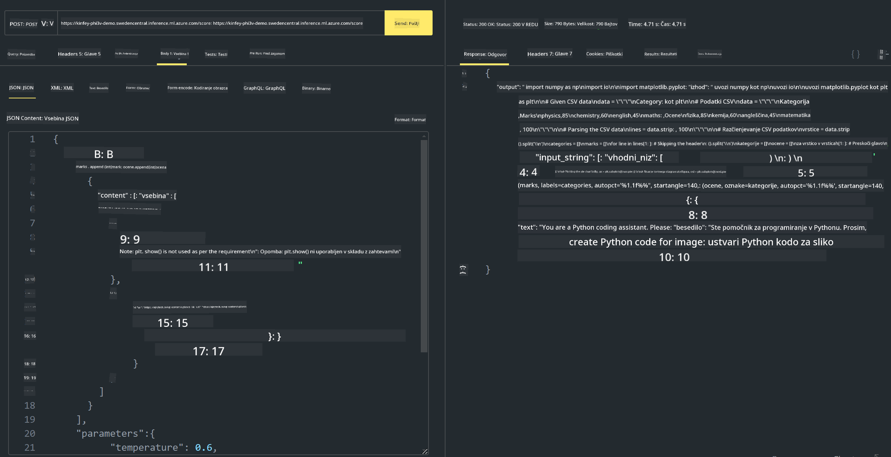

<!--
CO_OP_TRANSLATOR_METADATA:
{
  "original_hash": "20cb4e6ac1686248e8be913ccf6c2bc2",
  "translation_date": "2025-07-17T04:36:18+00:00",
  "source_file": "md/02.Application/02.Code/Phi3/VSCodeExt/HOL/Apple/03.DeployPhi3VisionOnAzure.md",
  "language_code": "sl"
}
-->
# **Laboratorij 3 - Namestitev Phi-3-vision na Azure Machine Learning Service**

Uporabljamo NPU za dokončanje produkcijske namestitve lokalne kode, nato pa želimo preko tega uvesti možnost PHI-3-VISION za generiranje kode iz slik.

V tem uvodu lahko hitro zgradimo Model As Service Phi-3 Vision storitev v Azure Machine Learning Service.

***Note***: Phi-3 Vision zahteva računsko moč za hitrejše generiranje vsebine. Potrebujemo oblačno računsko moč, ki nam pri tem pomaga.


### **1. Ustvarite Azure Machine Learning Service**

V Azure portalu moramo ustvariti Azure Machine Learning Service. Če želite izvedeti, kako, obiščite to povezavo [https://learn.microsoft.com/azure/machine-learning/quickstart-create-resources?view=azureml-api-2](https://learn.microsoft.com/azure/machine-learning/quickstart-create-resources?view=azureml-api-2)


### **2. Izberite Phi-3 Vision v Azure Machine Learning Service**




### **3. Namestite Phi-3-Vision v Azure**





### **4. Preizkusite Endpoint v Postmanu**





***Note***

1. Posredovani parametri morajo vključevati Authorization, azureml-model-deployment in Content-Type. Te informacije morate pridobiti iz podatkov o namestitvi.

2. Za prenos parametrov Phi-3-Vision zahteva povezavo do slike. Za način prenosa parametrov si oglejte metodo GPT-4-Vision, na primer

```json

{
  "input_data":{
    "input_string":[
      {
        "role":"user",
        "content":[ 
          {
            "type": "text",
            "text": "You are a Python coding assistant.Please create Python code for image "
          },
          {
              "type": "image_url",
              "image_url": {
                "url": "https://ajaytech.co/wp-content/uploads/2019/09/index.png"
              }
          }
        ]
      }
    ],
    "parameters":{
          "temperature": 0.6,
          "top_p": 0.9,
          "do_sample": false,
          "max_new_tokens": 2048
    }
  }
}

```

3. Pokličite **/score** z metodo Post

**Čestitke**! Uspešno ste izvedli hitro namestitev PHI-3-VISION in preizkusili, kako iz slik generirati kodo. Naslednji korak je gradnja aplikacij v kombinaciji z NPU-ji in oblakom.

**Omejitev odgovornosti**:  
Ta dokument je bil preveden z uporabo AI prevajalske storitve [Co-op Translator](https://github.com/Azure/co-op-translator). Čeprav si prizadevamo za natančnost, vas opozarjamo, da avtomatizirani prevodi lahko vsebujejo napake ali netočnosti. Izvirni dokument v njegovem izvirnem jeziku velja za avtoritativni vir. Za ključne informacije priporočamo strokovni človeški prevod. Za morebitna nesporazume ali napačne interpretacije, ki izhajajo iz uporabe tega prevoda, ne odgovarjamo.