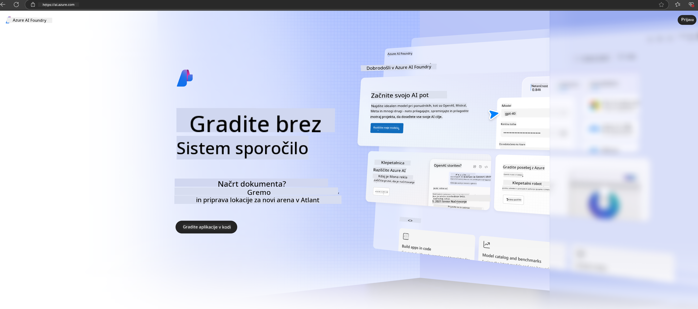

<!--
CO_OP_TRANSLATOR_METADATA:
{
  "original_hash": "3a1e48b628022485aac989c9f733e792",
  "translation_date": "2025-05-09T20:15:41+00:00",
  "source_file": "md/02.QuickStart/AzureAIFoundry_QuickStart.md",
  "language_code": "sl"
}
-->
# **Phi-3 භාවිතා කිරීම Azure AI Foundry හි**

Generative AI සංවර්ධනය සමඟ, අපි විවිධ LLM සහ SLM, ව්‍යාපාරික දත්ත ඒකාබද්ධ කිරීම, fine-tuning/RAG මෙහෙයුම්, LLM සහ SLM ඒකාබද්ධ කිරීමෙන් පසු විවිධ ව්‍යාපාරික ඇප්ලිකේෂන්වල ඇගයීම් කළමනාකරණය සඳහා ඒකාබද්ධ වේදිකාවක් භාවිතා කිරීමට බලාපොරොත්තු වෙමු. මෙයින් generative AI මගින් Smart ඇප්ලිකේෂන් හොඳින් ක්‍රියාත්මක කරගත හැක. [Azure AI Foundry](https://ai.azure.com) යනු ව්‍යාපාර මට්ටමේ generative AI ඇප්ලිකේෂන් වේදිකාවකි.

Azure AI Foundry සමඟ, ඔබට විශාල භාෂා ආදර්ශ (LLM) ප්‍රතිචාර ඇගයීම් කළ හැකි අතර prompt flow මඟින් prompt ඇප්ලිකේෂන් කොටස් සංවිධානය කර වැඩි කාර්යක්ෂමතාවයක් ලබා ගත හැක. මෙම වේදිකාව, පරීක්ෂණාත්මක අදහස් නිෂ්පාදන මට්ටමට පහසුවෙන් පරිවර්තනය කිරීම සඳහා විස්තාරණය පහසු කරයි. අඛණ්ඩ නිරීක්ෂණය සහ සංශෝධනය දිගුකාලීන සාර්ථකත්වයට සහය දක්වයි.

අපට පහසු පියවර කිහිපයක් මඟින් Phi-3 ආදර්ශය Azure AI Foundry මත ඉක්මනින් යොදාගත හැකි අතර, එවිට Azure AI Foundry භාවිතයෙන් Phi-3 සම්බන්ධ Playground/Chat, Fine-tuning, ඇගයීම් සහ අනෙකුත් සම්බන්ධ කාර්යයන් නිම කළ හැක.

## **1. සූදානම**

ඔබට දැනටමත් [Azure Developer CLI](https://learn.microsoft.com/azure/developer/azure-developer-cli/overview?WT.mc_id=aiml-138114-kinfeylo) ඔබේ යන්ත්‍රයේ ස්ථාපනය කර ඇත්නම්, මෙම ටෙම්ප්ලේට් එක භාවිතා කිරීම නව ෆෝල්ඩරයක මෙම විධානය ධාවනය කිරීම පමණි.

## අත්පොතෙන් සාදීම

Microsoft Azure AI Foundry ව්‍යාපෘතියක් සහ hub එකක් සාදීම ඔබේ AI වැඩ සංවිධානය සහ කළමනාකරණය කිරීමට හොඳ ක්‍රමයකි. පහත පියවර අනුව ඔබට ආරම්භ කළ හැක:

### Azure AI Foundry හි ව්‍යාපෘතියක් සාදීම

1. **Azure AI Foundry වෙත යන්න**: Azure AI Foundry පෝර්ටලයට පිවිසෙන්න.
2. **ව්‍යාපෘතියක් සාදන්න**:
   - ඔබ ව්‍යාපෘතියක සිටී නම්, පිටුවේ ඉහළ වම පැත්තේ "Azure AI Foundry" තෝරා මුල් පිටුවට යන්න.
   - "+ Create project" තෝරන්න.
   - ව්‍යාපෘතිය සඳහා නමක් ඇතුළත් කරන්න.
   - ඔබට hub එකක් ඇත්නම් එය පෙරනිමි ලෙස තෝරා ඇත. ඔබට hub කිහිපයක් සඳහා ප්‍රවේශය ඇත්නම්, dropdown එකෙන් වෙන hub එකක් තෝරන්න. නව hub එකක් සාදන්න නම් "Create new hub" තෝරා නමක් ලබා දෙන්න.
   - "Create" තෝරන්න.

### Azure AI Foundry හි Hub එකක් සාදීම

1. **Azure AI Foundry වෙත යන්න**: Azure ගිණුමෙන් පිවිසෙන්න.
2. **Hub එකක් සාදන්න**:
   - වම මෙනුවෙන් Management center තෝරන්න.
   - "All resources" තෝරන්න, එවිට "+ New project" අසළ ඇති පහළ අරය තෝරා "+ New hub" තෝරන්න.
   - "Create a new hub" සංවාද පෙන්වීමේදී hub එකට නමක් (උදාහරණයක් ලෙස contoso-hub) දී අනෙකුත් ක්ෂේත්‍ර අවශ්‍ය පරිදි වෙනස් කරන්න.
   - "Next" තෝරන්න, තොරතුරු සමාලෝචනය කර "Create" තෝරන්න.

වැඩි විස්තර සඳහා නිල [Microsoft ලේඛනය](https://learn.microsoft.com/azure/ai-studio/how-to/create-projects) බලන්න.

සාර්ථකව සාදීමෙන් පසු, ඔබ සාදන ලද studio එකට [ai.azure.com](https://ai.azure.com/) මගින් ප්‍රවේශ විය හැක.

AI Foundry එකේ ව්‍යාපෘති කිහිපයක් තිබිය හැක. AI Foundry හි ව්‍යාපෘතියක් සාදා සූදානම් වන්න.

Azure AI Foundry [QuickStarts](https://learn.microsoft.com/azure/ai-studio/quickstarts/get-started-code) සාදන්න.

## **2. Azure AI Foundry හි Phi ආදර්ශයක් යොදන්න**

ව්‍යාපෘතියේ Explore විකල්පය ක්ලික් කර Model Catalog වෙත පිවිස Phi-3 තෝරන්න

Phi-3-mini-4k-instruct තෝරන්න

Phi-3-mini-4k-instruct ආදර්ශය යොදීමට 'Deploy' ක්ලික් කරන්න

> [!NOTE]
>
> යොදන විට ගණනය කිරීමේ බලය තෝරා ගත හැක

## **3. Azure AI Foundry හි Playground Chat Phi**

යොදන පිටුවට ගොස් Playground තෝරන්න, Azure AI Foundry හි Phi-3 සමඟ කතා කරන්න

## **4. Azure AI Foundry සිට ආදර්ශය යොදීම**

Azure Model Catalog එකෙන් ආදර්ශයක් යොදීමට පහත පියවර අනුගමනය කරන්න:

- Azure AI Foundry වෙත පිවිසෙන්න.
- Azure AI Foundry ආදර්ශ කාටලොගයෙන් ඔබට යොදන්න අවශ්‍ය ආදර්ශය තෝරන්න.
- ආදර්ශයේ විස්තර පිටුවේ Deploy තෝරන්න, පසුව Serverless API with Azure AI Content Safety තෝරන්න.
- ඔබගේ ආදර්ශ යොදන්න අවශ්‍ය ව්‍යාපෘතිය තෝරන්න. Serverless API භාවිතා කිරීමට, ඔබගේ වැඩසටහන East US 2 හෝ Sweden Central ප්‍රදේශයට අයත් විය යුතුය. Deployment නම ඔබට වෙනස් කළ හැක.
- යොදන මැජික්වෙළේ Pricing සහ terms කියවන්න.
- Deploy තෝරන්න. යොදීම සම්පූර්ණ වනතුරු රැඳී සිට Deployments පිටුවට යොමු වන්න.
- PlayGround හි Open තෝරන්න, ආදර්ශය සමඟ කටයුතු ආරම්භ කරන්න.
- Deployments පිටුවට ආපසු ගොස් යොදීම තෝරන්න, Target URL සහ Secret Key සටහන් කරගන්න. ඒවා භාවිතා කර යොදීම ඇමතුම් හා completions ජනනය කළ හැක.
- Build ටැබ් එකට ගොස් Components කොටසෙන් Deployments තෝරා Endpoint විස්තර, URL සහ ප්‍රවේශ යතුරු සොයා ගත හැක.

> [!NOTE]
> මෙම පියවර කිරීමට ඔබගේ ගිණුමට Resource Group මත Azure AI Developer භූමිකා අවසර තිබිය යුතුය.

## **5. Azure AI Foundry හි Phi API භාවිතය**

https://{Your project name}.region.inference.ml.azure.com/swagger.json වෙත Postman GET මඟින් පිවිස Key සමඟ ඒකතු කර සපයන අතුරුමුහුණු පිළිබඳ දැනගන්න

ඉල්ලීම් පරාමිතීන් සහ ප්‍රතිචාර පරාමිතීන් ඉතා පහසුවෙන් ලබා ගත හැක.

**Omejitev odgovornosti**:  
Ta dokument je bil preveden z uporabo storitve za prevajanje z umetno inteligenco [Co-op Translator](https://github.com/Azure/co-op-translator). Čeprav si prizadevamo za natančnost, vas opozarjamo, da avtomatizirani prevodi lahko vsebujejo napake ali netočnosti. Izvirni dokument v njegovem izvor nem jeziku velja za avtoritativni vir. Za pomembne informacije priporočamo strokovni človeški prevod. Nismo odgovorni za morebitna nesporazumevanja ali napačne interpretacije, ki izhajajo iz uporabe tega prevoda.