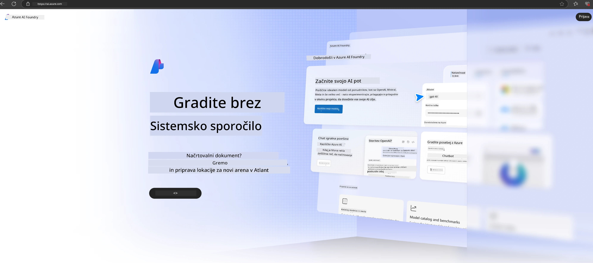

# **Uporaba Phi-3 v Microsoft Foundry**

Z razvojem generativne umetne inteligence želimo uporabiti enotno platformo za upravljanje različnih LLM in SLM, integracijo podatkov podjetja, fino nastavljanje/RAG operacije ter ocenjevanje različnih poslovnih procesov po integraciji LLM in SLM, da lahko generativna AI bolje podpira pametne aplikacije. [Microsoft Foundry](https://ai.azure.com) je platforma za generativne AI aplikacije na ravni podjetij.

Z Microsoft Foundry lahko ocenjujete odzive velikih jezikovnih modelov (LLM) in orkestrirate komponente aplikacij z uporabo prompt flow za boljšo zmogljivost. Platforma omogoča enostavno skaliranje za preobrazbo dokazov koncepta v polno produkcijo. Neprestano spremljanje in izboljševanje podpirata dolgoročni uspeh.

Phi-3 model lahko hitro namestimo na Microsoft Foundry z nekaj preprostimi koraki, nato pa uporabimo Microsoft Foundry za dokončanje Playground/Chat, fino nastavljanje, ocenjevanje in druge povezane naloge.

## **1. Priprava**

Če imate na svojem računalniku že nameščen [Azure Developer CLI](https://learn.microsoft.com/azure/developer/azure-developer-cli/overview?WT.mc_id=aiml-138114-kinfeylo), je uporaba te predloge enostavna – samo zaženite ta ukaz v novi mapi.

## Ročna ustvaritev

Ustvarjanje projekta in huba v Microsoft Foundry je odličen način za organizacijo in upravljanje vašega AI dela. Tukaj je korak za korakom vodič za začetek:

### Ustvarjanje projekta v Microsoft Foundry

1. **Pojdite na Microsoft Foundry**: Prijavite se v portal Microsoft Foundry.
2. **Ustvarite projekt**:
   - Če ste že v projektu, izberite "Microsoft Foundry" zgoraj levo, da se vrnete na domačo stran.
   - Izberite "+ Create project".
   - Vnesite ime projekta.
   - Če imate hub, bo ta privzeto izbran. Če imate dostop do več hubov, lahko izberete drugega iz spustnega menija. Če želite ustvariti nov hub, izberite "Create new hub" in vnesite ime.
   - Izberite "Create".

### Ustvarjanje huba v Microsoft Foundry

1. **Pojdite na Microsoft Foundry**: Prijavite se z vašim Azure računom.
2. **Ustvarite hub**:
   - Izberite Management center v levem meniju.
   - Izberite "All resources", nato puščico ob "+ New project" in izberite "+ New hub".
   - V pogovornem oknu "Create a new hub" vnesite ime huba (npr. contoso-hub) in po želji prilagodite ostala polja.
   - Izberite "Next", preglejte podatke in nato izberite "Create".

Za podrobnejša navodila si lahko ogledate uradno [Microsoftovo dokumentacijo](https://learn.microsoft.com/azure/ai-studio/how-to/create-projects).

Po uspešni ustvaritvi lahko dostopate do studia, ki ste ga ustvarili, preko [ai.azure.com](https://ai.azure.com/)

Na enem AI Foundry je lahko več projektov. Ustvarite projekt v AI Foundry za pripravo.

Ustvarite Microsoft Foundry [QuickStarts](https://learn.microsoft.com/azure/ai-studio/quickstarts/get-started-code)

## **2. Namestitev Phi modela v Microsoft Foundry**

Kliknite možnost Explore v projektu, da vstopite v Model Catalog in izberite Phi-3

Izberite Phi-3-mini-4k-instruct

Kliknite 'Deploy' za namestitev modela Phi-3-mini-4k-instruct

> [!NOTE]
>
> Pri nameščanju lahko izberete računsko moč

## **3. Playground Chat Phi v Microsoft Foundry**

Pojdite na stran z nameščanjem, izberite Playground in klepetajte s Phi-3 v Microsoft Foundry

## **4. Namestitev modela iz Microsoft Foundry**

Za namestitev modela iz Azure Model Catalog sledite tem korakom:

- Prijavite se v Microsoft Foundry.
- Izberite model, ki ga želite namestiti iz kataloga modelov Microsoft Foundry.
- Na strani z informacijami o modelu izberite Deploy in nato Serverless API z Azure AI Content Safety.
- Izberite projekt, v katerem želite namestiti modele. Za uporabo ponudbe Serverless API mora biti vaš delovni prostor v regiji East US 2 ali Sweden Central. Ime namestitve lahko prilagodite.
- V čarovniku za namestitev izberite Pricing and terms, da si ogledate cene in pogoje uporabe.
- Izberite Deploy. Počakajte, da je namestitev pripravljena in da ste preusmerjeni na stran Deployments.
- Izberite Open in playground, da začnete interakcijo z modelom.
- Lahko se vrnete na stran Deployments, izberete namestitev in si zabeležite Target URL končne točke ter Secret Key, ki ju lahko uporabite za klice namestitve in generiranje izhodov.
- Podrobnosti o končni točki, URL in dostopnih ključih lahko vedno najdete v zavihku Build pod Components in nato Deployments.

> [!NOTE]
> Upoštevajte, da mora imeti vaš račun dovoljenja v vlogi Azure AI Developer na Resource Group, da lahko izvedete te korake.

## **5. Uporaba Phi API v Microsoft Foundry**

Dostopate lahko do https://{Your project name}.region.inference.ml.azure.com/swagger.json preko Postman GET in ga kombinirate s ključem, da spoznate ponujene vmesnike.

Zelo enostavno lahko pridobite parametre zahtevka in tudi parametre odgovora.

**Omejitev odgovornosti**:  
Ta dokument je bil preveden z uporabo AI prevajalske storitve [Co-op Translator](https://github.com/Azure/co-op-translator). Čeprav si prizadevamo za natančnost, vas opozarjamo, da avtomatizirani prevodi lahko vsebujejo napake ali netočnosti. Izvirni dokument v njegovem izvirnem jeziku velja za avtoritativni vir. Za ključne informacije priporočamo strokovni človeški prevod. Za morebitna nesporazume ali napačne interpretacije, ki izhajajo iz uporabe tega prevoda, ne odgovarjamo.