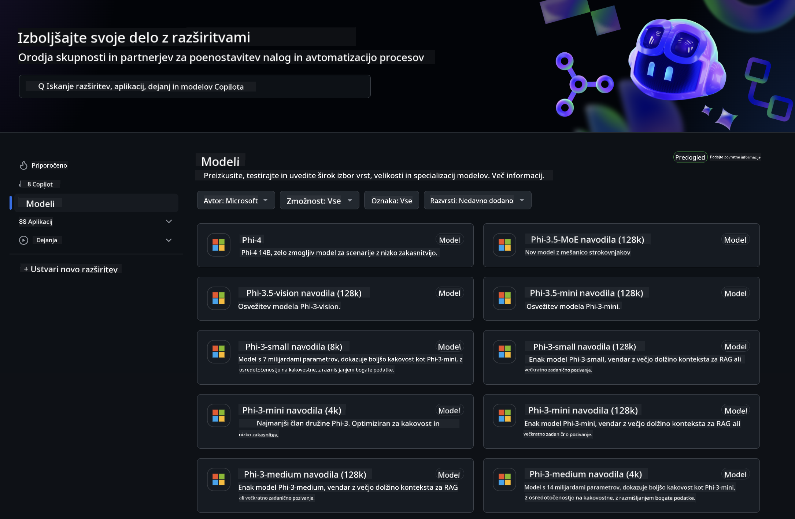
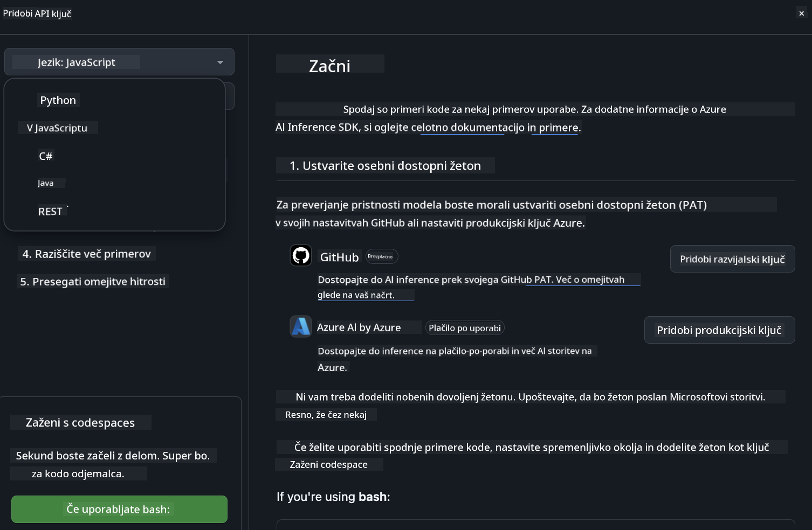
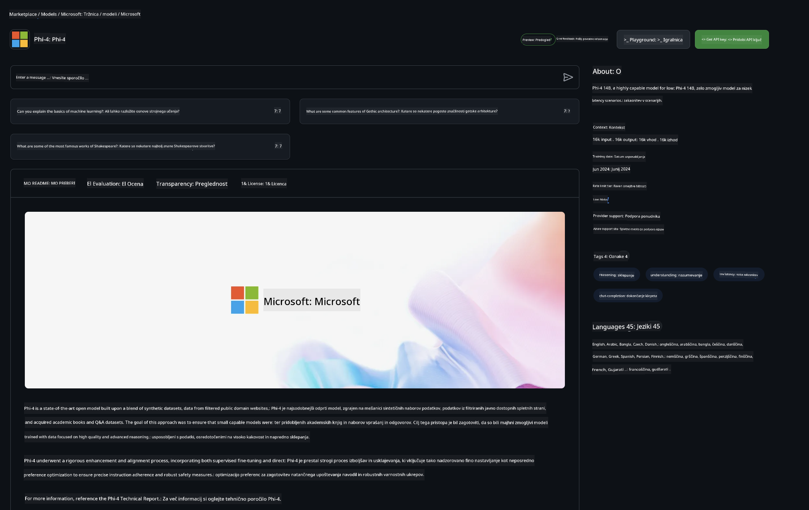

<!--
CO_OP_TRANSLATOR_METADATA:
{
  "original_hash": "5113634b77370af6790f9697d5d7de90",
  "translation_date": "2025-05-09T20:22:38+00:00",
  "source_file": "md/02.QuickStart/GitHubModel_QuickStart.md",
  "language_code": "sl"
}
-->
## GitHub Models - Limited Public Beta

Dobrodošli na [GitHub Models](https://github.com/marketplace/models)! Vse je pripravljeno, da raziščete AI modele, ki gostujejo na Azure AI.



Za več informacij o modelih, ki so na voljo na GitHub Models, si oglejte [GitHub Model Marketplace](https://github.com/marketplace/models)

## Na voljo modeli

Vsak model ima svoj namenski playground in primer kode


### Phi-3 modeli v GitHub Model Catalog

[Phi-3-Medium-128k-Instruct](https://github.com/marketplace/models/azureml/Phi-3-medium-128k-instruct)

[Phi-3-medium-4k-instruct](https://github.com/marketplace/models/azureml/Phi-3-medium-4k-instruct)

[Phi-3-mini-128k-instruct](https://github.com/marketplace/models/azureml/Phi-3-mini-128k-instruct)

[Phi-3-mini-4k-instruct](https://github.com/marketplace/models/azureml/Phi-3-mini-4k-instruct)

[Phi-3-small-128k-instruct](https://github.com/marketplace/models/azureml/Phi-3-small-128k-instruct)

[Phi-3-small-8k-instruct](https://github.com/marketplace/models/azureml/Phi-3-small-8k-instruct)

## Začetek

Na voljo je nekaj osnovnih primerov, ki so pripravljeni za zagon. Najdete jih v mapi samples. Če želite skočiti neposredno na svoj najljubši jezik, so primeri na voljo v naslednjih jezikih:

- Python
- JavaScript
- cURL

Na voljo je tudi namensko Codespaces okolje za izvajanje primerov in modelov.



## Primer kode

Spodaj so primeri kode za nekaj primerov uporabe. Za dodatne informacije o Azure AI Inference SDK si oglejte celotno dokumentacijo in primere.

## Namestitev

1. Ustvarite osebni dostopni žeton  
Ni vam treba dodeliti nobenih dovoljenj žetonu. Upoštevajte, da bo žeton poslan Microsoftovi storitvi.

Za uporabo spodnjih primerov kode ustvarite okoljsko spremenljivko, kjer nastavite svoj žeton kot ključ za odjemalsko kodo.

Če uporabljate bash:  
```
export GITHUB_TOKEN="<your-github-token-goes-here>"
```  
Če uporabljate powershell:  

```
$Env:GITHUB_TOKEN="<your-github-token-goes-here>"
```  

Če uporabljate Windows ukazno vrstico:  

```
set GITHUB_TOKEN=<your-github-token-goes-here>
```  

## Python primer

### Namestite odvisnosti  
Namestite Azure AI Inference SDK z uporabo pip (zahteva: Python >=3.8):

```
pip install azure-ai-inference
```  
### Zaženite osnovni primer kode

Ta primer prikazuje osnovni klic API-ja za chat completion. Uporablja GitHub AI model inference endpoint in vaš GitHub žeton. Klic je sinhron.

```
import os
from azure.ai.inference import ChatCompletionsClient
from azure.ai.inference.models import SystemMessage, UserMessage
from azure.core.credentials import AzureKeyCredential

endpoint = "https://models.inference.ai.azure.com"
# Replace Model_Name 
model_name = "Phi-3-small-8k-instruct"
token = os.environ["GITHUB_TOKEN"]

client = ChatCompletionsClient(
    endpoint=endpoint,
    credential=AzureKeyCredential(token),
)

response = client.complete(
    messages=[
        SystemMessage(content="You are a helpful assistant."),
        UserMessage(content="What is the capital of France?"),
    ],
    model=model_name,
    temperature=1.,
    max_tokens=1000,
    top_p=1.
)

print(response.choices[0].message.content)
```

### Zaženite večkrožni pogovor

Ta primer prikazuje večkrožni pogovor z API-jem za chat completion. Ko uporabljate model za klepetalno aplikacijo, morate upravljati zgodovino pogovora in poslati najnovejša sporočila modelu.

```
import os
from azure.ai.inference import ChatCompletionsClient
from azure.ai.inference.models import AssistantMessage, SystemMessage, UserMessage
from azure.core.credentials import AzureKeyCredential

token = os.environ["GITHUB_TOKEN"]
endpoint = "https://models.inference.ai.azure.com"
# Replace Model_Name
model_name = "Phi-3-small-8k-instruct"

client = ChatCompletionsClient(
    endpoint=endpoint,
    credential=AzureKeyCredential(token),
)

messages = [
    SystemMessage(content="You are a helpful assistant."),
    UserMessage(content="What is the capital of France?"),
    AssistantMessage(content="The capital of France is Paris."),
    UserMessage(content="What about Spain?"),
]

response = client.complete(messages=messages, model=model_name)

print(response.choices[0].message.content)
```

### Pretakajte izhod

Za boljšo uporabniško izkušnjo boste želeli pretakati odziv modela, da se prvi token prikaže prej in se izognete dolgemu čakanju na odziv.

```
import os
from azure.ai.inference import ChatCompletionsClient
from azure.ai.inference.models import SystemMessage, UserMessage
from azure.core.credentials import AzureKeyCredential

token = os.environ["GITHUB_TOKEN"]
endpoint = "https://models.inference.ai.azure.com"
# Replace Model_Name
model_name = "Phi-3-small-8k-instruct"

client = ChatCompletionsClient(
    endpoint=endpoint,
    credential=AzureKeyCredential(token),
)

response = client.complete(
    stream=True,
    messages=[
        SystemMessage(content="You are a helpful assistant."),
        UserMessage(content="Give me 5 good reasons why I should exercise every day."),
    ],
    model=model_name,
)

for update in response:
    if update.choices:
        print(update.choices[0].delta.content or "", end="")

client.close()
```  
## JavaScript

### Namestite odvisnosti

Namestite Node.js.

Kopirajte spodnje vrstice besedila in jih shranite kot datoteko package.json v svojo mapo.

```
{
  "type": "module",
  "dependencies": {
    "@azure-rest/ai-inference": "latest",
    "@azure/core-auth": "latest",
    "@azure/core-sse": "latest"
  }
}
```

Opomba: @azure/core-sse je potreben samo, če pretakate odzive chat completion.

Odprite terminal v tej mapi in zaženite npm install.

Za vsak spodnji primer kode kopirajte vsebino v datoteko sample.js in jo zaženite z node sample.js.

### Zaženite osnovni primer kode

Ta primer prikazuje osnovni klic API-ja za chat completion. Uporablja GitHub AI model inference endpoint in vaš GitHub žeton. Klic je sinhron.

```
import ModelClient from "@azure-rest/ai-inference";
import { AzureKeyCredential } from "@azure/core-auth";

const token = process.env["GITHUB_TOKEN"];
const endpoint = "https://models.inference.ai.azure.com";
// Update your modelname
const modelName = "Phi-3-small-8k-instruct";

export async function main() {

  const client = new ModelClient(endpoint, new AzureKeyCredential(token));

  const response = await client.path("/chat/completions").post({
    body: {
      messages: [
        { role:"system", content: "You are a helpful assistant." },
        { role:"user", content: "What is the capital of France?" }
      ],
      model: modelName,
      temperature: 1.,
      max_tokens: 1000,
      top_p: 1.
    }
  });

  if (response.status !== "200") {
    throw response.body.error;
  }
  console.log(response.body.choices[0].message.content);
}

main().catch((err) => {
  console.error("The sample encountered an error:", err);
});
```

### Zaženite večkrožni pogovor

Ta primer prikazuje večkrožni pogovor z API-jem za chat completion. Ko uporabljate model za klepetalno aplikacijo, morate upravljati zgodovino pogovora in poslati najnovejša sporočila modelu.

```
import ModelClient from "@azure-rest/ai-inference";
import { AzureKeyCredential } from "@azure/core-auth";

const token = process.env["GITHUB_TOKEN"];
const endpoint = "https://models.inference.ai.azure.com";
// Update your modelname
const modelName = "Phi-3-small-8k-instruct";

export async function main() {

  const client = new ModelClient(endpoint, new AzureKeyCredential(token));

  const response = await client.path("/chat/completions").post({
    body: {
      messages: [
        { role: "system", content: "You are a helpful assistant." },
        { role: "user", content: "What is the capital of France?" },
        { role: "assistant", content: "The capital of France is Paris." },
        { role: "user", content: "What about Spain?" },
      ],
      model: modelName,
    }
  });

  if (response.status !== "200") {
    throw response.body.error;
  }

  for (const choice of response.body.choices) {
    console.log(choice.message.content);
  }
}

main().catch((err) => {
  console.error("The sample encountered an error:", err);
});
```

### Pretakajte izhod

Za boljšo uporabniško izkušnjo boste želeli pretakati odziv modela, da se prvi token prikaže prej in se izognete dolgemu čakanju na odziv.

```
import ModelClient from "@azure-rest/ai-inference";
import { AzureKeyCredential } from "@azure/core-auth";
import { createSseStream } from "@azure/core-sse";

const token = process.env["GITHUB_TOKEN"];
const endpoint = "https://models.inference.ai.azure.com";
// Update your modelname
const modelName = "Phi-3-small-8k-instruct";

export async function main() {

  const client = new ModelClient(endpoint, new AzureKeyCredential(token));

  const response = await client.path("/chat/completions").post({
    body: {
      messages: [
        { role: "system", content: "You are a helpful assistant." },
        { role: "user", content: "Give me 5 good reasons why I should exercise every day." },
      ],
      model: modelName,
      stream: true
    }
  }).asNodeStream();

  const stream = response.body;
  if (!stream) {
    throw new Error("The response stream is undefined");
  }

  if (response.status !== "200") {
    stream.destroy();
    throw new Error(`Failed to get chat completions, http operation failed with ${response.status} code`);
  }

  const sseStream = createSseStream(stream);

  for await (const event of sseStream) {
    if (event.data === "[DONE]") {
      return;
    }
    for (const choice of (JSON.parse(event.data)).choices) {
        process.stdout.write(choice.delta?.content ?? ``);
    }
  }
}

main().catch((err) => {
  console.error("The sample encountered an error:", err);
});
```

## REST

### Zaženite osnovni primer kode

Prilepite naslednje v shell:

```
curl -X POST "https://models.inference.ai.azure.com/chat/completions" \
    -H "Content-Type: application/json" \
    -H "Authorization: Bearer $GITHUB_TOKEN" \
    -d '{
        "messages": [
            {
                "role": "system",
                "content": "You are a helpful assistant."
            },
            {
                "role": "user",
                "content": "What is the capital of France?"
            }
        ],
        "model": "Phi-3-small-8k-instruct"
    }'
```  
### Zaženite večkrožni pogovor

Pokličite chat completion API in pošljite zgodovino pogovora:

```
curl -X POST "https://models.inference.ai.azure.com/chat/completions" \
    -H "Content-Type: application/json" \
    -H "Authorization: Bearer $GITHUB_TOKEN" \
    -d '{
        "messages": [
            {
                "role": "system",
                "content": "You are a helpful assistant."
            },
            {
                "role": "user",
                "content": "What is the capital of France?"
            },
            {
                "role": "assistant",
                "content": "The capital of France is Paris."
            },
            {
                "role": "user",
                "content": "What about Spain?"
            }
        ],
        "model": "Phi-3-small-8k-instruct"
    }'
```  
### Pretakajte izhod

To je primer klica endpointa in pretakanja odziva.

```
curl -X POST "https://models.inference.ai.azure.com/chat/completions" \
    -H "Content-Type: application/json" \
    -H "Authorization: Bearer $GITHUB_TOKEN" \
    -d '{
        "messages": [
            {
                "role": "system",
                "content": "You are a helpful assistant."
            },
            {
                "role": "user",
                "content": "Give me 5 good reasons why I should exercise every day."
            }
        ],
        "stream": true,
        "model": "Phi-3-small-8k-instruct"
    }'
```

## BREZPLAČNA uporaba in omejitve za GitHub Models



[Omejitve hitrosti za playground in brezplačno uporabo API-ja](https://docs.github.com/en/github-models/prototyping-with-ai-models#rate-limits) so namenjene temu, da lahko eksperimentirate z modeli in prototipirate svojo AI aplikacijo. Za uporabo nad temi omejitvami in za širitev aplikacije morate zagotoviti vire iz Azure računa in se od tam avtenticirati namesto z vašim GitHub osebnim dostopnim žetonom. Ni vam treba spreminjati ničesar drugega v kodi. Uporabite to povezavo, da odkrijete, kako preseči brezplačne omejitve v Azure AI.

### Opozorila

Zapomnite si, da ko uporabljate model, eksperimentirate z AI, zato so možne vsebinske napake.

Funkcija je podvržena različnim omejitvam (vključno z zahtevami na minuto, zahtevami na dan, tokeni na zahtevo in sočasnimi zahtevami) in ni namenjena za produkcijske primere uporabe.

GitHub Models uporablja Azure AI Content Safety. Ti filtri se ne dajo izključiti kot del izkušnje GitHub Models. Če se odločite uporabljati modele preko plačljive storitve, prosimo, konfigurirajte svoje vsebinske filtre glede na vaše zahteve.

Ta storitev je podvržena GitHub-ovim pogojev predizdaje.

**Omejitev odgovornosti**:  
Ta dokument je bil preveden z uporabo AI prevajalske storitve [Co-op Translator](https://github.com/Azure/co-op-translator). Čeprav si prizadevamo za natančnost, vas prosimo, da upoštevate, da avtomatizirani prevodi lahko vsebujejo napake ali netočnosti. Izvirni dokument v njegovem izvorno jeziku velja za avtoritativni vir. Za kritične informacije priporočamo strokovni človeški prevod. Nismo odgovorni za morebitna nesporazumevanja ali napačne interpretacije, ki izhajajo iz uporabe tega prevoda.