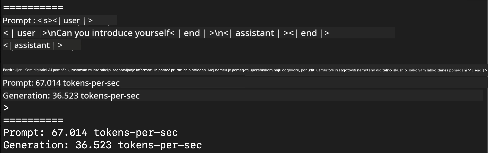
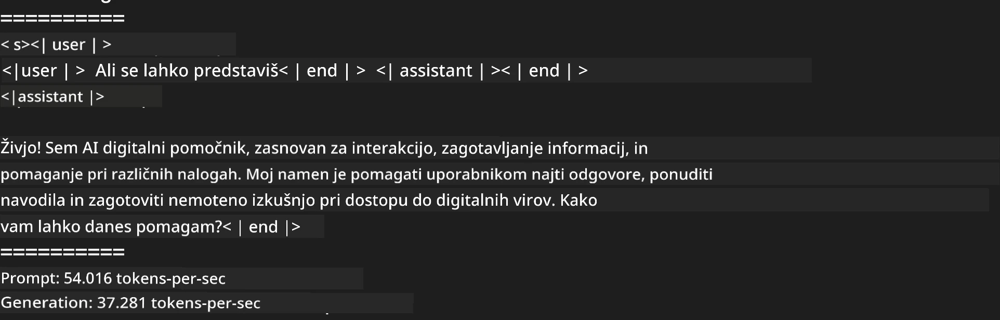
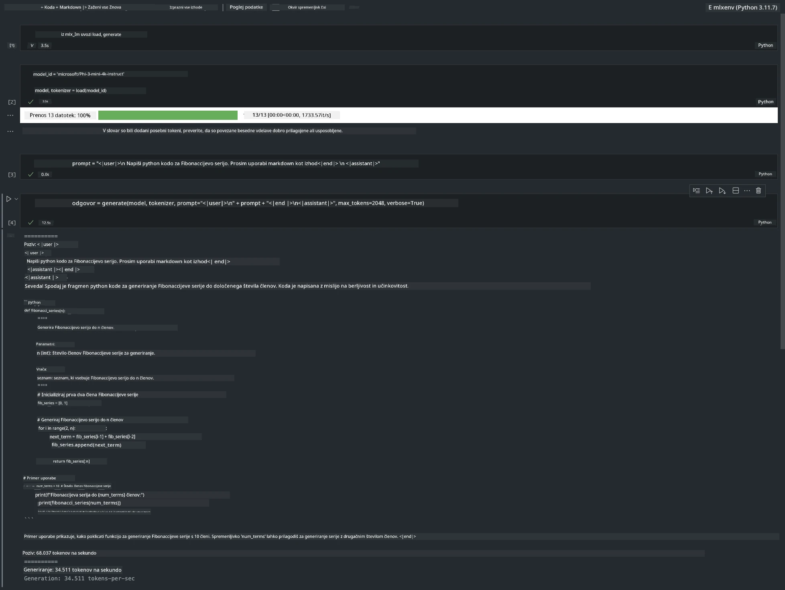

# **Inferenca Phi-3 z Apple MLX ogrodjem**

## **Kaj je MLX ogrodje**

MLX je ogrodje za raziskave strojnega učenja na Apple silikonu, ki ga je razvila Apple ekipa za raziskave strojnega učenja.

MLX so zasnovali raziskovalci strojnega učenja za raziskovalce strojnega učenja. Ogrodje je namenjeno enostavni uporabi, hkrati pa učinkovito za učenje in izvajanje modelov. Sam koncept ogrodja je prav tako preprost. Želimo omogočiti raziskovalcem, da enostavno razširjajo in izboljšujejo MLX, s ciljem hitrega preizkušanja novih idej.

Veliki jezikovni modeli (LLM) se lahko pospešijo na napravah Apple Silicon z uporabo MLX, modeli pa se lahko zelo priročno izvajajo lokalno.

## **Uporaba MLX za inferenco Phi-3-mini**

### **1. Nastavitev MLX okolja**

1. Python 3.11.x  
2. Namestite MLX knjižnico

```bash

pip install mlx-lm

```

### **2. Zagon Phi-3-mini v terminalu z MLX**

```bash

python -m mlx_lm.generate --model microsoft/Phi-3-mini-4k-instruct --max-token 2048 --prompt  "<|user|>\nCan you introduce yourself<|end|>\n<|assistant|>"

```

Rezultat (moje okolje je Apple M1 Max, 64GB) je



### **3. Kvantizacija Phi-3-mini z MLX v terminalu**

```bash

python -m mlx_lm.convert --hf-path microsoft/Phi-3-mini-4k-instruct

```

***Opomba:*** Model je mogoče kvantizirati preko mlx_lm.convert, privzeta kvantizacija je INT4. Ta primer kvantizira Phi-3-mini v INT4.

Model je mogoče kvantizirati preko mlx_lm.convert, privzeta kvantizacija je INT4. Ta primer kvantizira Phi-3-mini v INT4. Po kvantizaciji bo shranjen v privzeti imenik ./mlx_model.

Model kvantiziran z MLX lahko preizkusimo iz terminala.

```bash

python -m mlx_lm.generate --model ./mlx_model/ --max-token 2048 --prompt  "<|user|>\nCan you introduce yourself<|end|>\n<|assistant|>"

```

Rezultat je



### **4. Zagon Phi-3-mini z MLX v Jupyter Notebooku**



***Opomba:*** Prosim, preberite ta primer [kliknite na to povezavo](../../../../../code/03.Inference/MLX/MLX_DEMO.ipynb)

## **Viri**

1. Spoznajte Apple MLX ogrodje [https://ml-explore.github.io](https://ml-explore.github.io/mlx/build/html/index.html)

2. Apple MLX GitHub repozitorij [https://github.com/ml-explore](https://github.com/ml-explore)

**Omejitev odgovornosti**:  
Ta dokument je bil preveden z uporabo AI prevajalske storitve [Co-op Translator](https://github.com/Azure/co-op-translator). Čeprav si prizadevamo za natančnost, vas opozarjamo, da avtomatizirani prevodi lahko vsebujejo napake ali netočnosti. Izvirni dokument v njegovem izvirnem jeziku velja za avtoritativni vir. Za ključne informacije priporočamo strokovni človeški prevod. Za morebitna nesporazume ali napačne interpretacije, ki izhajajo iz uporabe tega prevoda, ne odgovarjamo.