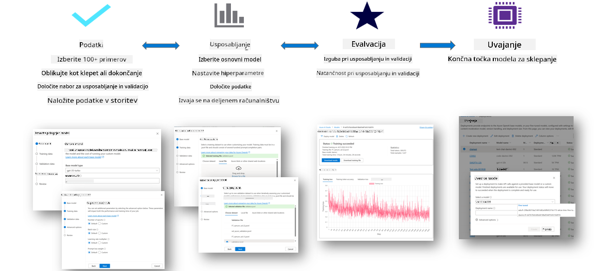
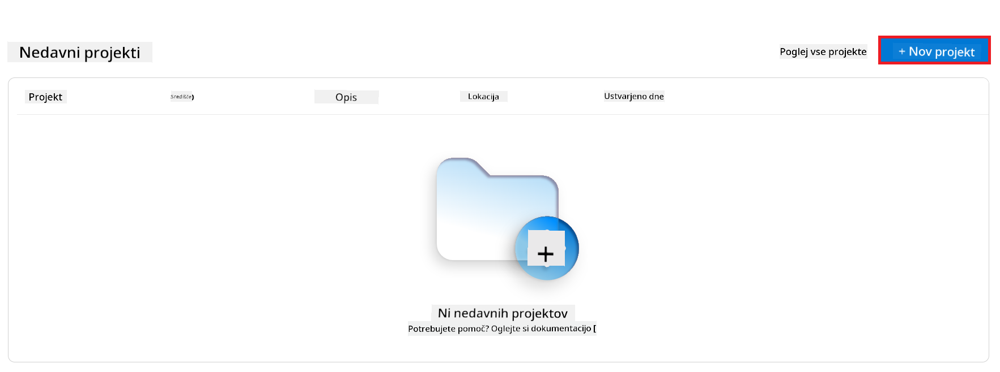
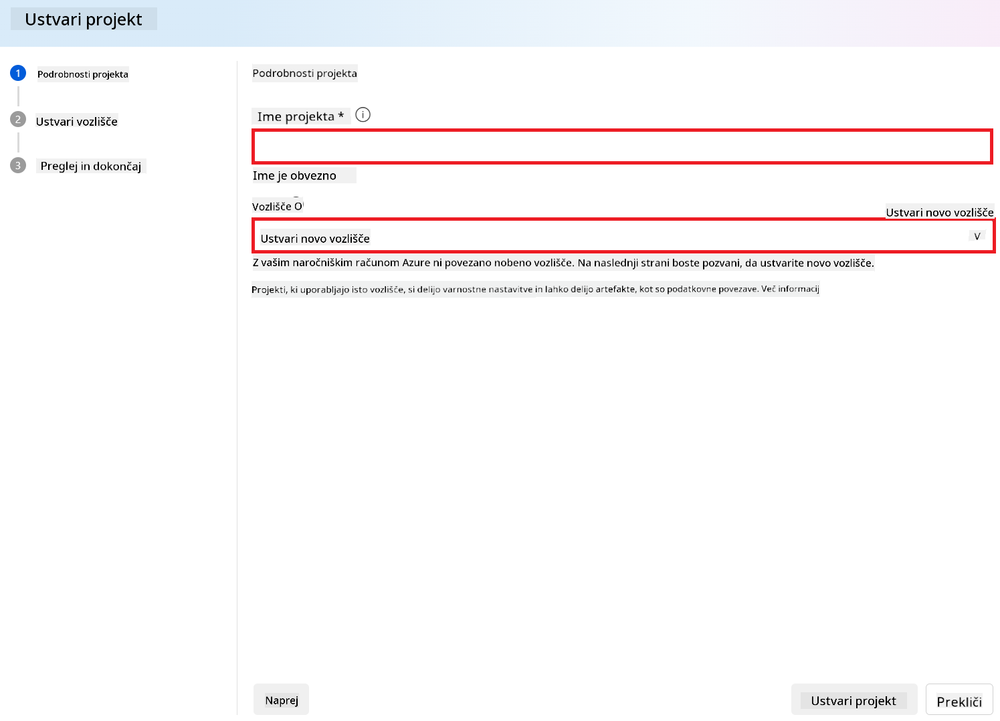
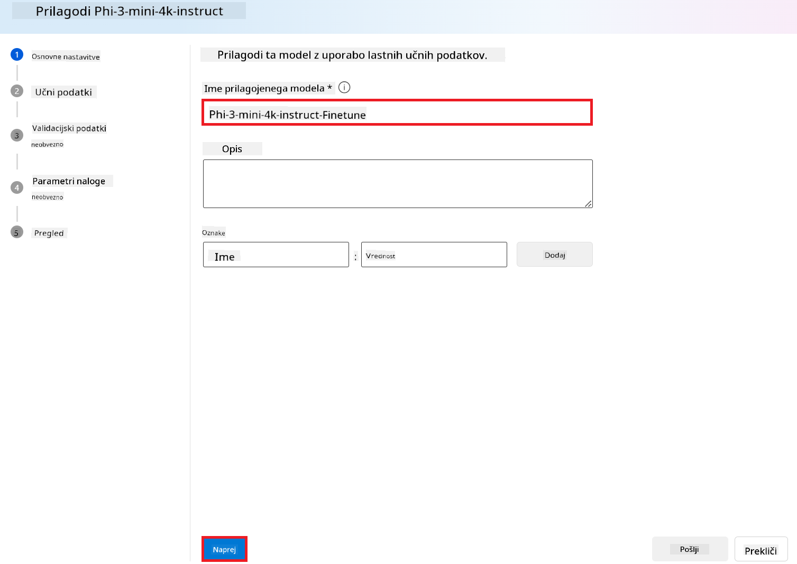
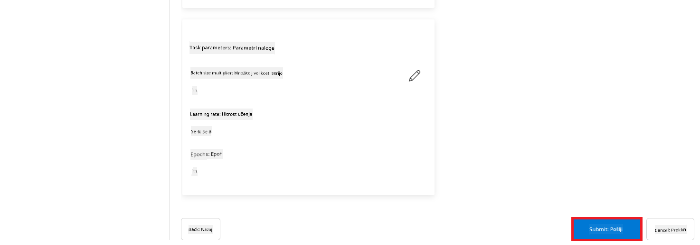

<!--
CO_OP_TRANSLATOR_METADATA:
{
  "original_hash": "c1559c5af6caccf6f623fd43a6b3a9a3",
  "translation_date": "2025-07-17T06:16:03+00:00",
  "source_file": "md/03.FineTuning/FineTuning_AIFoundry.md",
  "language_code": "sl"
}
-->
# Prilagajanje Phi-3 z Azure AI Foundry

Raziščimo, kako prilagoditi Microsoftov jezikovni model Phi-3 Mini z uporabo Azure AI Foundry. Prilagajanje omogoča, da Phi-3 Mini prilagodite specifičnim nalogam, s čimer postane še močnejši in bolj zavedajoč se konteksta.

## Premisleki

- **Zmožnosti:** Kateri modeli so prilagodljivi? Kaj lahko osnovni model naredi po prilagoditvi?
- **Stroški:** Kakšen je cenovni model za prilagajanje?
- **Prilagodljivost:** Koliko lahko spremenim osnovni model – in na kakšne načine?
- **Udobje:** Kako poteka prilagajanje – ali moram pisati lastno kodo? Ali potrebujem lastne računalniške vire?
- **Varnost:** Prilagojeni modeli lahko predstavljajo varnostna tveganja – ali so na voljo zaščitni mehanizmi za preprečevanje neželenih posledic?


## Priprava na prilagajanje

### Predpogoji

> [!NOTE]
> Za modele družine Phi-3 je ponudba prilagajanja po modelu plačaj-po-porabi na voljo samo za hube, ustvarjene v regijah **East US 2**.

- Azure naročnina. Če je še nimate, ustvarite [plačljiv Azure račun](https://azure.microsoft.com/pricing/purchase-options/pay-as-you-go) za začetek.

- [AI Foundry projekt](https://ai.azure.com?WT.mc_id=aiml-138114-kinfeylo).
- Za dostop do operacij v Azure AI Foundry se uporabljajo vloge Azure RBAC. Za izvedbo korakov v tem članku mora biti vaš uporabniški račun dodeljen vlogi __Azure AI Developer__ v skupini virov.

### Registracija ponudnika naročnine

Preverite, ali je naročnina registrirana pri ponudniku virov `Microsoft.Network`.

1. Prijavite se v [Azure portal](https://portal.azure.com).
1. Izberite **Subscriptions** v levem meniju.
1. Izberite naročnino, ki jo želite uporabiti.
1. Izberite **AI project settings** > **Resource providers** v levem meniju.
1. Preverite, ali je **Microsoft.Network** na seznamu ponudnikov virov. Če ni, ga dodajte.

### Priprava podatkov

Pripravite podatke za učenje in validacijo za prilagoditev modela. Vaši podatki za učenje in validacijo vsebujejo primere vhodov in izhodov, ki prikazujejo, kako želite, da model deluje.

Poskrbite, da vsi primeri učenja sledijo pričakovanemu formatu za inferenco. Za učinkovito prilagajanje modelov zagotovite uravnotežen in raznolik nabor podatkov.

To vključuje ohranjanje ravnovesja podatkov, vključevanje različnih scenarijev in občasno izboljševanje učnih podatkov, da se uskladijo z realnimi pričakovanji, kar vodi do natančnejših in bolj uravnoteženih odzivov modela.

Različni tipi modelov zahtevajo različne formate učnih podatkov.

### Chat Completion

Podatki za učenje in validacijo **morajo** biti oblikovani kot JSON Lines (JSONL) dokument. Za `Phi-3-mini-128k-instruct` mora biti nabor podatkov za prilagajanje oblikovan v pogovornem formatu, ki ga uporablja API za Chat completions.

### Primer formata datoteke

```json
    {"messages": [{"role": "system", "content": "You are an Xbox customer support agent whose primary goal is to help users with issues they are experiencing with their Xbox devices. You are friendly and concise. You only provide factual answers to queries, and do not provide answers that are not related to Xbox."}, {"role": "user", "content": "Is Xbox better than PlayStation?"}, {"role": "assistant", "content": "I apologize, but I cannot provide personal opinions. My primary job is to assist you with any issues related to your Xbox device. Do you have any Xbox-related issues that need addressing?"}]}
    {"messages": [{"role": "system", "content": "You are an Xbox customer support agent whose primary goal is to help users with issues they are experiencing with their Xbox devices. You are friendly and concise. You only provide factual answers to queries, and do not provide answers that are not related to Xbox."}, {"role": "user", "content": "Can I play PC games on my Xbox?"}, {"role": "assistant", "content": "While Xbox consoles don't natively support PC games, they can play an array of Xbox games, many of which are also available on PC. Can I assist you with finding games compatible with your Xbox device?"}]}
    {"messages": [{"role": "system", "content": "You are an Xbox customer support agent whose primary goal is to help users with issues they are experiencing with their Xbox devices. You are friendly and concise. You only provide factual answers to queries, and do not provide answers that are not related to Xbox."}, {"role": "user", "content": "I'm having trouble connecting my Xbox to the Wi-Fi."}, {"role": "assistant", "content": "No worries, let's go through the network settings on your Xbox. Can you please tell me what happens when you try to connect it to the Wi-Fi?"}]}
```

Podprta vrsta datoteke je JSON Lines. Datoteke se naložijo v privzeti podatkovni prostor in so na voljo v vašem projektu.

## Prilagajanje Phi-3 z Azure AI Foundry

Azure AI Foundry vam omogoča, da prilagodite velike jezikovne modele svojim osebnim podatkom z uporabo procesa, imenovanega prilagajanje (fine-tuning). Prilagajanje prinaša veliko vrednost z omogočanjem prilagoditve in optimizacije za specifične naloge in aplikacije. To vodi do izboljšane zmogljivosti, stroškovne učinkovitosti, zmanjšane zakasnitve in prilagojenih izhodov.



### Ustvarjanje novega projekta

1. Prijavite se v [Azure AI Foundry](https://ai.azure.com).

1. Izberite **+New project** za ustvarjanje novega projekta v Azure AI Foundry.

    

1. Izvedite naslednje korake:

    - Ime projekta **Hub name**. Mora biti unikatno.
    - Izberite **Hub**, ki ga želite uporabiti (po potrebi ustvarite novega).

    

1. Izvedite naslednje korake za ustvarjanje novega huba:

    - Vnesite **Hub name**. Mora biti unikatno.
    - Izberite svojo Azure **Subscription**.
    - Izberite **Resource group** za uporabo (po potrebi ustvarite novo).
    - Izberite **Location**, ki ga želite uporabiti.
    - Izberite **Connect Azure AI Services** za uporabo (po potrebi ustvarite novega).
    - Izberite **Connect Azure AI Search** in izberite **Skip connecting**.

    

1. Izberite **Next**.
1. Izberite **Create a project**.

### Priprava podatkov

Pred prilagajanjem zberite ali ustvarite nabor podatkov, ki je relevanten za vašo nalogo, kot so navodila za klepet, pari vprašanje-odgovor ali kateri koli drugi ustrezni besedilni podatki. Očistite in predobdelajte te podatke z odstranjevanjem šuma, obravnavo manjkajočih vrednosti in tokenizacijo besedila.

### Prilagajanje Phi-3 modelov v Azure AI Foundry

> [!NOTE]
> Prilagajanje Phi-3 modelov je trenutno podprto samo v projektih, ki se nahajajo v regiji East US 2.

1. Izberite **Model catalog** v levem zavihku.

1. V iskalno polje vnesite *phi-3* in izberite želeni phi-3 model.

    

1. Izberite **Fine-tune**.

    

1. Vnesite ime za **Fine-tuned model name**.

    

1. Izberite **Next**.

1. Izvedite naslednje korake:

    - Izberite **task type** kot **Chat completion**.
    - Izberite **Training data**, ki ga želite uporabiti. Lahko ga naložite preko Azure AI Foundry ali iz lokalnega okolja.

    

1. Izberite **Next**.

1. Naložite **Validation data**, ki ga želite uporabiti, ali pa izberite **Automatic split of training data**.

    

1. Izberite **Next**.

1. Izvedite naslednje korake:

    - Izberite **Batch size multiplier**, ki ga želite uporabiti.
    - Izberite **Learning rate**, ki ga želite uporabiti.
    - Izberite **Epochs**, ki jih želite uporabiti.

    

1. Izberite **Submit** za začetek procesa prilagajanja.

    

1. Ko je vaš model prilagojen, bo status prikazan kot **Completed**, kot je prikazano na spodnji sliki. Model lahko zdaj namestite in uporabljate v svoji aplikaciji, v playgroundu ali v prompt flow. Za več informacij glejte [Kako namestiti družino majhnih jezikovnih modelov Phi-3 z Azure AI Foundry](https://learn.microsoft.com/azure/ai-studio/how-to/deploy-models-phi-3?tabs=phi-3-5&pivots=programming-language-python).

    

> [!NOTE]
> Za podrobnejše informacije o prilagajanju Phi-3 obiščite [Fine-tune Phi-3 models in Azure AI Foundry](https://learn.microsoft.com/azure/ai-studio/how-to/fine-tune-phi-3?tabs=phi-3-mini).

## Čiščenje prilagojenih modelov

Prilagojeni model lahko izbrišete s seznama prilagojenih modelov v [Azure AI Foundry](https://ai.azure.com) ali na strani s podrobnostmi modela. Izberite model, ki ga želite izbrisati na strani Fine-tuning, nato pa kliknite gumb Delete za brisanje.

> [!NOTE]
> Prilagojenega modela ne morete izbrisati, če ima obstoječo namestitev. Najprej morate izbrisati namestitev modela, preden lahko izbrišete prilagojeni model.

## Stroški in kvote

### Premisleki o stroških in kvotah za Phi-3 modele, prilagojene kot storitev

Phi modeli, prilagojeni kot storitev, jih ponuja Microsoft in so integrirani z Azure AI Foundry za uporabo. Cene najdete med [namestitvijo](https://learn.microsoft.com/azure/ai-studio/how-to/deploy-models-phi-3?tabs=phi-3-5&pivots=programming-language-python) ali prilagajanjem modelov pod zavihkom Pricing and terms v čarovniku za namestitev.

## Filtriranje vsebine

Modeli, nameščeni kot storitev po modelu plačaj-po-porabi, so zaščiteni z Azure AI Content Safety. Ko so nameščeni na realnočasovne končne točke, se lahko odločite, da te funkcije ne uporabljate. Z omogočeno Azure AI Content Safety tako poziv kot izhod prehajata skozi skupek klasifikacijskih modelov, ki zaznavajo in preprečujejo izhod škodljive vsebine. Sistem filtriranja vsebine zaznava in ukrepa glede določenih kategorij potencialno škodljive vsebine tako v vhodnih pozivih kot v izhodnih odgovorih. Več o [Azure AI Content Safety](https://learn.microsoft.com/azure/ai-studio/concepts/content-filtering).

**Konfiguracija prilagajanja**

Določite hiperparametre, kot so hitrost učenja, velikost serije in število epochov učenja.

**Funkcija izgube**

Izberite ustrezno funkcijo izgube za vašo nalogo (npr. cross-entropy).

**Optimizator**

Izberite optimizator (npr. Adam) za posodobitve gradienta med učenjem.

**Proces prilagajanja**

- Naložite predhodno naučen model: naložite Phi-3 Mini kontrolno točko.
- Dodajte lastne plasti: dodajte plasti, specifične za nalogo (npr. klasifikacijsko glavo za navodila za klepet).

**Učenje modela**  
Prilagodite model z uporabo pripravljenega nabora podatkov. Spremljajte napredek učenja in po potrebi prilagajajte hiperparametre.

**Evalvacija in validacija**

Validacijski nabor: podatke razdelite na učni in validacijski nabor.

**Ocenjevanje zmogljivosti**

Uporabite metrike, kot so natančnost, F1-ocena ali perplexity za oceno zmogljivosti modela.

## Shranjevanje prilagojenega modela

**Kontrolna točka**  
Shranjena kontrolna točka prilagojenega modela za kasnejšo uporabo.

## Namestitev

- Namestitev kot spletna storitev: namestite prilagojeni model kot spletno storitev v Azure AI Foundry.
- Testiranje končne točke: pošljite testne poizvedbe na nameščeno končno točko za preverjanje delovanja.

## Iteracija in izboljšave

Iterirajte: če zmogljivost ni zadovoljiva, prilagodite hiperparametre, dodajte več podatkov ali podaljšajte učenje za dodatne epohe.

## Spremljanje in izboljševanje

Nenehno spremljajte vedenje modela in ga po potrebi izboljšujte.

## Prilagajanje in razširjanje

Prilagojene naloge: Phi-3 Mini lahko prilagodite za različne naloge, ne le za navodila za klepet. Raziščite druge primere uporabe!  
Eksperimentirajte: preizkusite različne arhitekture, kombinacije plasti in tehnike za izboljšanje zmogljivosti.

> [!NOTE]
> Prilagajanje je iterativen proces. Eksperimentirajte, se učite in prilagajajte model, da dosežete najboljše rezultate za svojo specifično nalogo!

**Omejitev odgovornosti**:  
Ta dokument je bil preveden z uporabo storitve za avtomatski prevod AI [Co-op Translator](https://github.com/Azure/co-op-translator). Čeprav si prizadevamo za natančnost, vas opozarjamo, da lahko avtomatizirani prevodi vsebujejo napake ali netočnosti. Izvirni dokument v njegovem izvirnem jeziku velja za avtoritativni vir. Za pomembne informacije priporočamo strokovni človeški prevod. Za morebitna nesporazume ali napačne interpretacije, ki izhajajo iz uporabe tega prevoda, ne odgovarjamo.