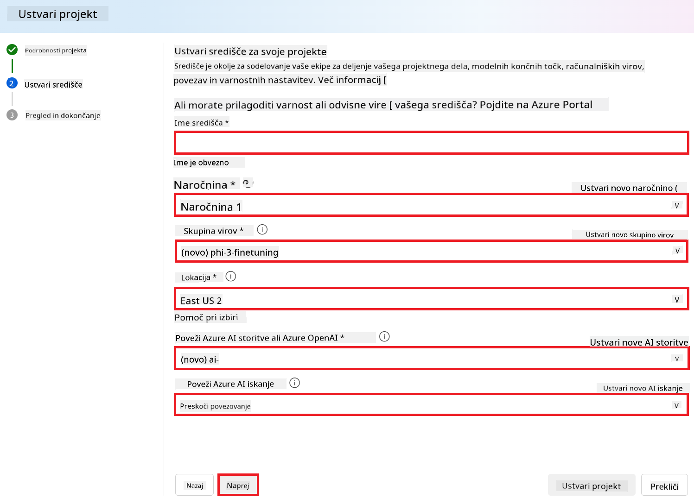
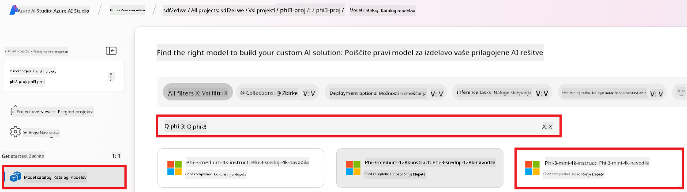
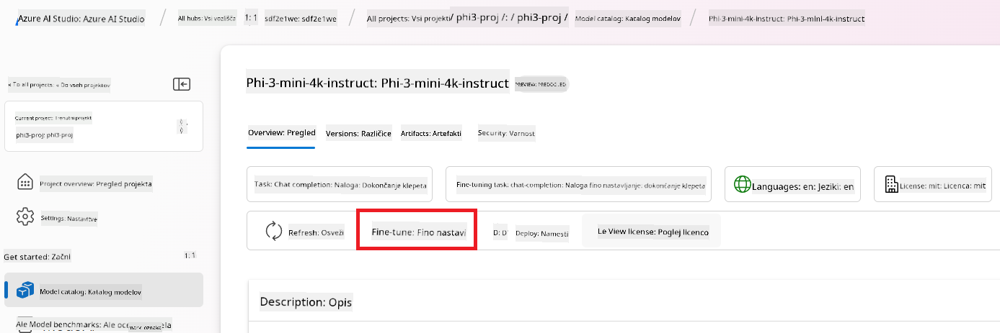
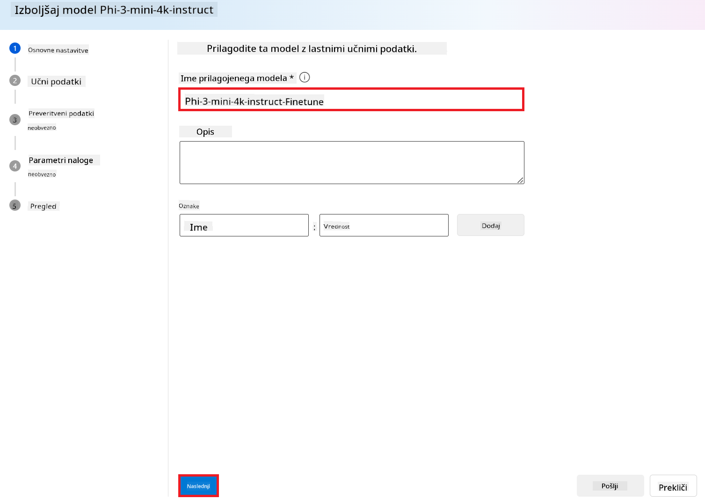
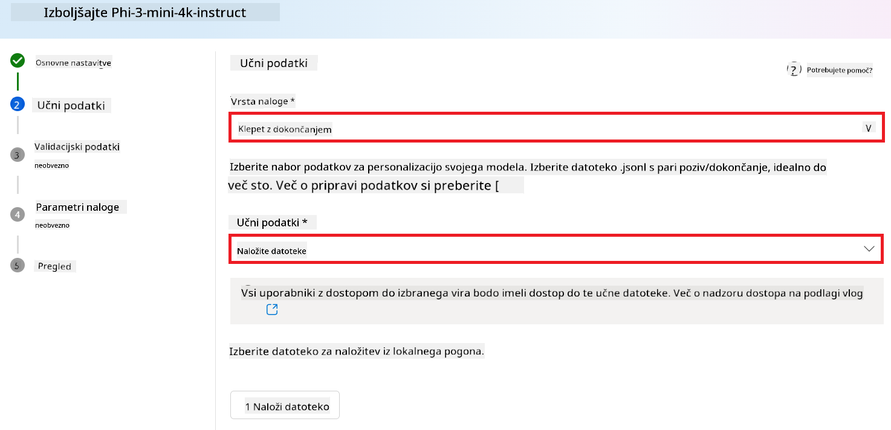
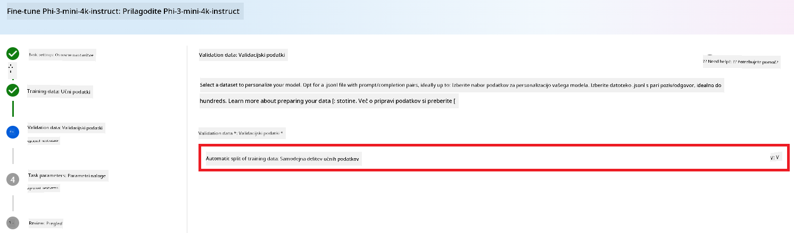
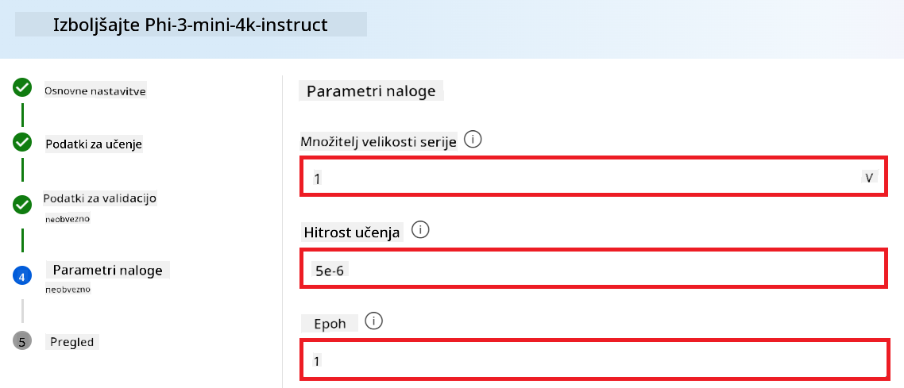
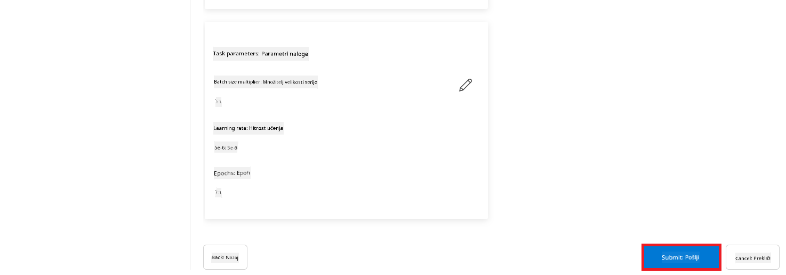
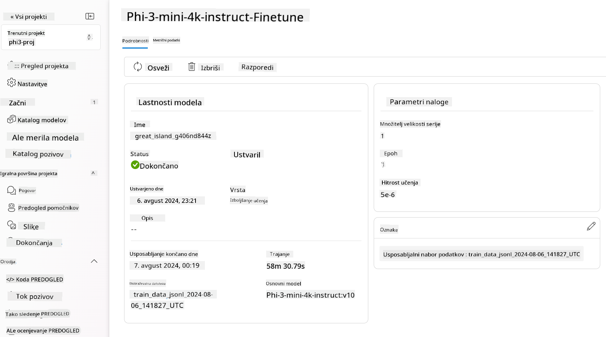

<!--
CO_OP_TRANSLATOR_METADATA:
{
  "original_hash": "c1559c5af6caccf6f623fd43a6b3a9a3",
  "translation_date": "2025-05-09T20:38:50+00:00",
  "source_file": "md/03.FineTuning/FineTuning_AIFoundry.md",
  "language_code": "sl"
}
-->
# Fine-tuning Phi-3 with Azure AI Foundry

Chalo dekhiye kaise Microsoft ke Phi-3 Mini language model ko Azure AI Foundry ke zariye fine-tune karte hain. Fine-tuning se aap Phi-3 Mini ko khaas tasks ke liye customize kar sakte hain, jisse yeh aur bhi powerful aur context-aware ho jaata hai.

## Considerations

- **Capabilities:** Kaunse models fine-tune kiye ja sakte hain? Base model ko fine-tune karke kya kya kiya ja sakta hai?
- **Cost:** Fine-tuning ka pricing model kya hai?
- **Customizability:** Base model mein kitna badlav kar sakte hain – aur kaise?
- **Convenience:** Fine-tuning kaise hoti hai – kya mujhe custom code likhna padega? Kya apna compute laana padega?
- **Safety:** Fine-tuned models mein safety risks hote hain – kya koi guardrails hain jo unintended nuksaan se bachate hain?


## Preparation for fine-tuning

### Prerequisites

> [!NOTE]
> Phi-3 family ke models ke liye, pay-as-you-go fine-tune option sirf **East US 2** regions mein banaye gaye hubs ke saath available hai.

- Ek Azure subscription. Agar aapke paas Azure subscription nahi hai, to ek [paid Azure account](https://azure.microsoft.com/pricing/purchase-options/pay-as-you-go) banayein.

- Ek [AI Foundry project](https://ai.azure.com?WT.mc_id=aiml-138114-kinfeylo).
- Azure role-based access controls (Azure RBAC) Azure AI Foundry mein operations ke liye access dete hain. Is article ke steps karne ke liye, aapke user account ko resource group par __Azure AI Developer role__ assign hona chahiye.

### Subscription provider registration

Confirm karein ki subscription `Microsoft.Network` resource provider ke liye registered hai.

1. [Azure portal](https://portal.azure.com) mein sign in karein.
1. Left menu se **Subscriptions** select karein.
1. Apni subscription select karein.
1. Left menu se **AI project settings** > **Resource providers** select karein.
1. Dekhein ki **Microsoft.Network** resource providers ki list mein hai. Agar nahi, to add karein.

### Data preparation

Apne training aur validation data ko fine-tune ke liye tayaar karein. Training aur validation datasets mein input-output examples hote hain jo model ko batate hain ki aap kaise perform karwana chahte hain.

Ensure karein ki aapke training examples inference ke expected format mein hon. Effective fine-tuning ke liye data balanced aur diverse hona chahiye.

Iska matlab hai data balance maintain karna, alag-alag scenarios shamil karna, aur training data ko time-time par refine karna taaki model ke responses accurate aur balanced ho.

Alag-alag model types ke liye training data ka format alag hota hai.

### Chat Completion

Jo training aur validation data aap use karenge, woh **JSON Lines (JSONL)** format mein hona chahiye. `Phi-3-mini-128k-instruct` ke liye fine-tuning dataset conversational format mein hona chahiye jo Chat completions API use karti hai.

### Example file format

```json
    {"messages": [{"role": "system", "content": "You are an Xbox customer support agent whose primary goal is to help users with issues they are experiencing with their Xbox devices. You are friendly and concise. You only provide factual answers to queries, and do not provide answers that are not related to Xbox."}, {"role": "user", "content": "Is Xbox better than PlayStation?"}, {"role": "assistant", "content": "I apologize, but I cannot provide personal opinions. My primary job is to assist you with any issues related to your Xbox device. Do you have any Xbox-related issues that need addressing?"}]}
    {"messages": [{"role": "system", "content": "You are an Xbox customer support agent whose primary goal is to help users with issues they are experiencing with their Xbox devices. You are friendly and concise. You only provide factual answers to queries, and do not provide answers that are not related to Xbox."}, {"role": "user", "content": "Can I play PC games on my Xbox?"}, {"role": "assistant", "content": "While Xbox consoles don't natively support PC games, they can play an array of Xbox games, many of which are also available on PC. Can I assist you with finding games compatible with your Xbox device?"}]}
    {"messages": [{"role": "system", "content": "You are an Xbox customer support agent whose primary goal is to help users with issues they are experiencing with their Xbox devices. You are friendly and concise. You only provide factual answers to queries, and do not provide answers that are not related to Xbox."}, {"role": "user", "content": "I'm having trouble connecting my Xbox to the Wi-Fi."}, {"role": "assistant", "content": "No worries, let's go through the network settings on your Xbox. Can you please tell me what happens when you try to connect it to the Wi-Fi?"}]}
```

Supported file type JSON Lines hai. Files default datastore mein upload hote hain aur aapke project mein available hote hain.

## Fine-Tuning Phi-3 with Azure AI Foundry

Azure AI Foundry se aap apne personal datasets ke liye large language models ko fine-tune kar sakte hain. Fine-tuning se aapko customization aur optimization milta hai jo specific tasks aur applications ke liye faydemand hai. Isse performance improve hoti hai, cost efficient hota hai, latency kam hoti hai, aur output tailored hota hai.


### Create a New Project

1. [Azure AI Foundry](https://ai.azure.com) mein sign in karein.

1. **+New project** select karke naya project banayein.

    

1. Ye tasks complete karein:

    - Project ka **Hub name** daalein. Yeh unique hona chahiye.
    - Use karne ke liye **Hub** select karein (zarurat pade to naya banayein).

    

1. Naya hub banane ke liye ye steps karein:

    - **Hub name** daalein, jo unique ho.
    - Apni Azure **Subscription** select karein.
    - Use karne ke liye **Resource group** select karein (zarurat pade to naya banayein).
    - Apni pasand ki **Location** select karein.
    - Use karne ke liye **Connect Azure AI Services** select karein (zarurat pade to naya banayein).
    - **Connect Azure AI Search** ko **Skip connecting** karein.

    

1. **Next** select karein.
1. **Create a project** select karein.

### Data Preparation

Fine-tuning se pehle apne task se related dataset ikatha karein ya banayein, jaise chat instructions, question-answer pairs, ya koi aur relevant text data. Data ko clean karein, noise hataayein, missing values handle karein, aur text ko tokenize karein.

### Fine-tune Phi-3 models in Azure AI Foundry

> [!NOTE]
> Phi-3 models ka fine-tuning abhi sirf East US 2 region ke projects mein supported hai.

1. Left side tab se **Model catalog** select karein.

1. **search bar** mein *phi-3* type karein aur apne pasand ka phi-3 model select karein.

    

1. **Fine-tune** select karein.

    

1. **Fine-tuned model name** daalein.

    

1. **Next** select karein.

1. Ye tasks karein:

    - **task type** mein **Chat completion** select karein.
    - Apna **Training data** select karein. Aap ise Azure AI Foundry ke data se ya apne local environment se upload kar sakte hain.

    

1. **Next** select karein.

1. Apna **Validation data** upload karein, ya phir **Automatic split of training data** select karein.

    

1. **Next** select karein.

1. Ye options select karein:

    - Apna pasandida **Batch size multiplier** choose karein.
    - Apna pasandida **Learning rate** choose karein.
    - Apna pasandida **Epochs** choose karein.

    

1. Fine-tuning process start karne ke liye **Submit** select karein.

    

1. Jab model fine-tune ho jaye, status **Completed** dikhaya jayega, jaise neeche image mein hai. Ab aap model ko deploy kar sakte hain aur apni application, playground, ya prompt flow mein use kar sakte hain. Zyada jankari ke liye dekhein [How to deploy Phi-3 family of small language models with Azure AI Foundry](https://learn.microsoft.com/azure/ai-studio/how-to/deploy-models-phi-3?tabs=phi-3-5&pivots=programming-language-python).

    

> [!NOTE]
> Phi-3 fine-tuning ke detailed info ke liye dekhein [Fine-tune Phi-3 models in Azure AI Foundry](https://learn.microsoft.com/azure/ai-studio/how-to/fine-tune-phi-3?tabs=phi-3-mini).

## Cleaning up your fine-tuned models

Aap fine-tuned model ko [Azure AI Foundry](https://ai.azure.com) ke fine-tuning model list se ya model details page se delete kar sakte hain. Fine-tuned model select karein Fine-tuning page par, phir Delete button dabakar model delete karein.

> [!NOTE]
> Agar custom model ka deployment exist karta hai, to aap us model ko delete nahi kar sakte. Pehle deployment delete karna zaruri hai tabhi custom model delete ho payega.

## Cost and quotas

### Cost and quota considerations for Phi-3 models fine-tuned as a service

Phi models jo service ke roop mein fine-tune kiye jaate hain, Microsoft ke dwara offer kiye jaate hain aur Azure AI Foundry ke saath integrated hain. Pricing aap [deploy](https://learn.microsoft.com/azure/ai-studio/how-to/deploy-models-phi-3?tabs=phi-3-5&pivots=programming-language-python) ya fine-tuning ke dauran deployment wizard ke Pricing and terms tab mein dekh sakte hain.

## Content filtering

Pay-as-you-go service ke roop mein deploy kiye gaye models Azure AI Content Safety se protected hote hain. Jab real-time endpoints par deploy kiya jata hai, to aap is feature ko opt out kar sakte hain. Azure AI content safety enabled hone par, prompt aur completion dono ek ensemble classification models ke through pass hote hain jo harmful content detect aur rokne ke liye design kiye gaye hain. Content filtering system input prompts aur output completions mein harmful content ke specific categories ko detect karta hai aur action leta hai. Zyada jankari ke liye dekhein [Azure AI Content Safety](https://learn.microsoft.com/azure/ai-studio/concepts/content-filtering).

**Fine-Tuning Configuration**

Hyperparameters: Learning rate, batch size, aur training epochs jaise hyperparameters define karein.

**Loss Function**

Apne task ke liye sahi loss function choose karein (jaise cross-entropy).

**Optimizer**

Training ke dauran gradient updates ke liye optimizer select karein (jaise Adam).

**Fine-Tuning Process**

- Pre-Trained Model Load karein: Phi-3 Mini checkpoint load karein.
- Custom Layers Add karein: Task-specific layers add karein (jaise chat instructions ke liye classification head).

**Train the Model**

Apne tayaar kiye gaye dataset se model ko fine-tune karein. Training progress monitor karein aur zarurat pade to hyperparameters adjust karein.

**Evaluation and Validation**

Validation Set: Apne data ko training aur validation sets mein baant lein.

**Evaluate Performance**

Accuracy, F1-score, ya perplexity jaise metrics se model ki performance assess karein.

## Save Fine-Tuned Model

**Checkpoint**

Future use ke liye fine-tuned model checkpoint save karein.

## Deployment

- Web Service ke roop mein deploy karein: Apne fine-tuned model ko Azure AI Foundry mein web service ke roop mein deploy karein.
- Endpoint test karein: Deploy kiye gaye endpoint par test queries bhej kar uski functionality verify karein.

## Iterate and Improve

Agar performance satisfactory nahi hai, to hyperparameters adjust karke, zyada data add karke, ya additional epochs ke liye fine-tune karke iterate karein.

## Monitor and Refine

Model ke behaviour ko lagataar monitor karein aur zarurat ke mutabiq refine karein.

## Customize and Extend

Custom Tasks: Phi-3 Mini ko chat instructions ke alawa bhi kai tasks ke liye fine-tune kiya ja sakta hai. Dusre use cases explore karein!
Experiment: Alag architectures, layer combinations, aur techniques try karein taaki performance aur behtar ho.

> [!NOTE]
> Fine-tuning ek iterative process hai. Experiment karein, seekhein, aur apne model ko apne specific task ke liye best results ke liye adapt karein!

**Omejitev odgovornosti**:  
Ta dokument je bil preveden z uporabo storitve za avtomatski prevod AI [Co-op Translator](https://github.com/Azure/co-op-translator). Čeprav si prizadevamo za natančnost, upoštevajte, da avtomatizirani prevodi lahko vsebujejo napake ali netočnosti. Izvirni dokument v njegovem maternem jeziku velja za avtoritativni vir. Za pomembne informacije priporočamo strokovni človeški prevod. Nismo odgovorni za morebitna nesporazumevanja ali napačne interpretacije, ki izhajajo iz uporabe tega prevoda.