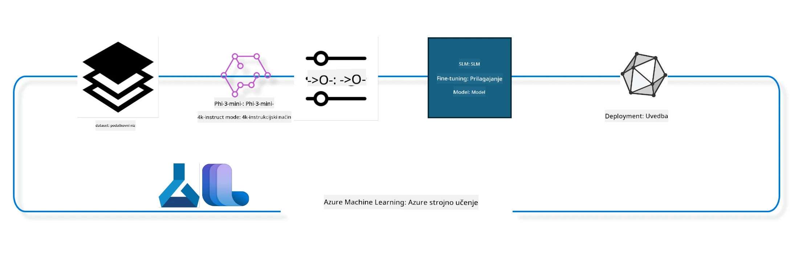

## Kako uporabljati komponente za dokončanje pogovora iz sistemskega registra Azure ML za fino nastavljanje modela

V tem primeru bomo izvedli fino nastavljanje modela Phi-3-mini-4k-instruct za dokončanje pogovora med 2 osebama z uporabo podatkovnega nabora ultrachat_200k.



Primer vam bo pokazal, kako izvesti fino nastavljanje z uporabo Azure ML SDK in Pythona ter nato namestiti fino nastavljen model na spletno točko za realnočasovno sklepanja.

### Podatki za učenje

Uporabili bomo podatkovni niz ultrachat_200k. To je močno filtrirana različica podatkovnega niza UltraChat in je bila uporabljena za učenje modela Zephyr-7B-β, vrhunskega 7b klepetalnega modela.

### Model

Uporabili bomo model Phi-3-mini-4k-instruct, da pokažemo, kako uporabnik lahko fino nastavi model za nalogo dokončanja pogovora. Če ste odprli ta zvezek iz določenega modela, ne pozabite zamenjati imena modela.

### Naloge

- Izberite model za fino nastavitev.
- Izberite in preučite podatke za učenje.
- Konfigurirajte nalogo fine nastavitve.
- Zaženite nalogo fine nastavitve.
- Preglejte meritve učenja in ocenjevanja.
- Registrirajte fino nastavljen model.
- Namestite fino nastavljen model za realnočasovno sklepanja.
- Očistite vire.

## 1. Nastavitev predpogojev

- Namestite odvisnosti
- Povežite se z AzureML delovnim prostorom. Več o tem na nastavitvi preverjanja pristnosti SDK. Spodaj zamenjajte <WORKSPACE_NAME>, <RESOURCE_GROUP> in <SUBSCRIPTION_ID>.
- Povežite se s sistemskim registrom azureml
- Nastavite opcijsko ime eksperimenta
- Preverite ali ustvarite izračun.

> [!NOTE]
> Zahteve so en vozlišče z GPU, ki lahko ima več GPU kartic. Na primer, eno vozlišče Standard_NC24rs_v3 ima 4 NVIDIA V100 GPU-je, medtem ko Standard_NC12s_v3 ima 2 NVIDIA V100 GPU-ja. Za te informacije glejte dokumentacijo. Število GPU kartic na vozlišče je nastavljeno v parametru gpus_per_node spodaj. Pravilna nastavitev te vrednosti zagotavlja uporabo vseh GPU-jev v vozlišču. Priporočene SKU-je za GPU računalnike najdete tukaj in tukaj.

### Python knjižnice

Namestite odvisnosti z zagonom spodnje celice. To ni opcijski korak, če delate v novem okolju.

```bash
pip install azure-ai-ml
pip install azure-identity
pip install datasets==2.9.0
pip install mlflow
pip install azureml-mlflow
```

### Interakcija z Azure ML

1. Ta Python skripta se uporablja za interakcijo s storitvijo Azure Machine Learning (Azure ML). Tukaj je povzetek, kaj počne:

    - Uvozi potrebne module iz paketov azure.ai.ml, azure.identity in azure.ai.ml.entities. Prav tako uvozi modul time.

    - Poskuša avtorizirati z DefaultAzureCredential(), ki zagotavlja poenostavljeno izkušnjo preverjanja pristnosti za hitro začetek razvoja aplikacij, ki tečejo v oblaku Azure. Če to ne uspe, preklopi na InteractiveBrowserCredential(), ki omogoča interaktivno prijavo prek brskalnika.

    - Poskuša ustvariti instanco MLClient z metodo from_config, ki prebere konfiguracijo iz privzete datoteke config.json. Če to ne uspe, ustvari instanco MLClient z ročno podanim subscription_id, resource_group_name in workspace_name.

    - Ustvari še eno instanco MLClient, tokrat za registarski sistem Azure ML z imenom "azureml". Ta register je mesto, kjer so shranjeni modeli, celični procesi za fino nastavitev in okolja.

    - Nastavi ime eksperimenta na "chat_completion_Phi-3-mini-4k-instruct".

    - Ustvari unikatni časovni žig s konverzijo trenutnega časa (v sekundah od epohe, kot decimalno število) v celo število in nato v niz. Ta časovni žig se lahko uporablja za ustvarjanje unikatnih imen in različic.

    ```python
    # Uvozi potrebne module iz Azure ML in Azure Identity
    from azure.ai.ml import MLClient
    from azure.identity import (
        DefaultAzureCredential,
        InteractiveBrowserCredential,
    )
    from azure.ai.ml.entities import AmlCompute
    import time  # Uvozi modul time
    
    # Poskusi se avtorizirati z uporabo DefaultAzureCredential
    try:
        credential = DefaultAzureCredential()
        credential.get_token("https://management.azure.com/.default")
    except Exception as ex:  # Če DefaultAzureCredential ne uspe, uporabi InteractiveBrowserCredential
        credential = InteractiveBrowserCredential()
    
    # Poskusi ustvariti instanco MLClient z uporabo privzete konfiguracijske datoteke
    try:
        workspace_ml_client = MLClient.from_config(credential=credential)
    except:  # Če to ne uspe, ustvari instanco MLClient z ročnim vnosom podatkov
        workspace_ml_client = MLClient(
            credential,
            subscription_id="<SUBSCRIPTION_ID>",
            resource_group_name="<RESOURCE_GROUP>",
            workspace_name="<WORKSPACE_NAME>",
        )
    
    # Ustvari še eno instanco MLClient za Azure ML register z imenom "azureml"
    # Ta register je mesto, kjer se hranijo modeli, fine-tuning cevovodi in okolja
    registry_ml_client = MLClient(credential, registry_name="azureml")
    
    # Nastavi ime eksperimenta
    experiment_name = "chat_completion_Phi-3-mini-4k-instruct"
    
    # Ustvari unikaten časovni žig, ki se lahko uporabi za unikatna imena in različice
    timestamp = str(int(time.time()))
    ```

## 2. Izberite osnovni model za fino nastavitev

1. Phi-3-mini-4k-instruct je lahkoten, vrhunski odprt model z 3,8 milijarde parametrov, zgrajen na podatkovnih nizih, uporabljenih za Phi-2. Model pripada družini modelov Phi-3, Mini različica pa prihaja v dveh variantah, 4K in 128K, kar predstavlja dolžino konteksta (v žetonih), ki jih podpira. Potrebno je fino nastaviti model za naš specifični namen, da ga lahko uporabimo. Te modele lahko poiščete v katalogu modelov v AzureML studiu, s filtrom za nalogo dokončanja pogovora. V tem primeru uporabljamo model Phi-3-mini-4k-instruct. Če ste odprli ta zvezek za drug model, zamenjajte ime modela in različico ustrezno.

> [!NOTE]
> lastnost id modela. Ta se posreduje kot vhod v nalogo fine nastavitve. Prav tako je na voljo kot polje Asset ID na strani podrobnosti modela v katalogu modelov AzureML studia.

2. Ta Python skripta komunicira s storitvijo Azure Machine Learning (Azure ML). Tukaj je povzetek, kaj počne:

    - Nastavi spremenljivko model_name na "Phi-3-mini-4k-instruct".

    - Uporabi metodo get lastnosti models objekta registry_ml_client, da pridobi zadnjo različico modela z navedenim imenom iz registra Azure ML. Metoda get se kliče z dvema argumentoma: imenom modela in oznako, ki določa, da naj bo pridobljena zadnja različica modela.

    - Izpiše sporočilo v konzolo, ki prikazuje ime, različico in id modela, ki bo uporabljen za fino nastavitev. Metoda format niza se uporablja za vstavljanje imena, različice in id modela v sporočilo. Ime, različica in id so dostopni kot lastnosti objekta foundation_model.

    ```python
    # Nastavi ime modela
    model_name = "Phi-3-mini-4k-instruct"
    
    # Pridobi najnovejšo različico modela iz Azure ML registra
    foundation_model = registry_ml_client.models.get(model_name, label="latest")
    
    # Izpiši ime modela, različico in ID
    # Te informacije so uporabne za sledenje in odpravljanje napak
    print(
        "\n\nUsing model name: {0}, version: {1}, id: {2} for fine tuning".format(
            foundation_model.name, foundation_model.version, foundation_model.id
        )
    )
    ```

## 3. Ustvarite izračun za uporabo v nalogi

Naloga fine nastavite deluje SAMO z računalniško močjo z GPU-ji. Velikost računalnika je odvisna od velikosti modela in v večini primerov je težko izbrati pravo konfiguracijo. V tej celici uporabniku pomagamo izbrati pravi izračun za nalogo.

> [!NOTE]
> Spodaj navedeni računalniki delujejo z najbolj optimizirano konfiguracijo. Vsaka sprememba konfiguracije lahko povzroči napako Cuda Out Of Memory. V takih primerih poskusite nadgraditi izračun na večjo velikost.

> [!NOTE]
> Pri izbiri compute_cluster_size poskrbite, da je ta računalnik na voljo v vaši skupini virov. Če določen računalnik ni na voljo, lahko zaprosite za dostop do računalniških virov.

### Preverjanje podpore modela za fino nastavitev

1. Ta Python skripta komunicira z modelom Azure Machine Learning (Azure ML). Tukaj je povzetek, kaj počne:

    - Uvozi modul ast, ki omogoča obdelavo dreves abstraktne sintakse Pythona.

    - Preveri, ali ima objekt foundation_model (ki predstavlja model v Azure ML) oznako z imenom finetune_compute_allow_list. Oznake v Azure ML so pari ključ-vrednost, ki jih lahko ustvarite in uporabite za filtriranje in razvrščanje modelov.

    - Če oznaka finetune_compute_allow_list obstaja, jo z ast.literal_eval varno pretvori iz niza v Python seznam. Ta seznam se nato dodeli spremenljivki computes_allow_list. Nato izpiše sporočilo, da je treba ustvariti izračun iz seznama.

    - Če oznaka ni prisotna, nastavi computes_allow_list na None in izpiše sporočilo, da oznaka finetune_compute_allow_list ni del oznak modela.

    - Skripta torej preverja določeno oznako v metapodatkih modela, jo pretvori v seznam, če obstaja, in ustrezno obvesti uporabnika.

    ```python
    # Uvozi modul ast, ki nudi funkcije za obdelavo dreves abstraktne sintakse Pythona
    import ast
    
    # Preveri, ali je oznaka 'finetune_compute_allow_list' prisotna med oznakami modela
    if "finetune_compute_allow_list" in foundation_model.tags:
        # Če je oznaka prisotna, uporabi ast.literal_eval za varno razčlenitev vrednosti oznake (niz) v Pythonovo listo
        computes_allow_list = ast.literal_eval(
            foundation_model.tags["finetune_compute_allow_list"]
        )  # pretvori niz v pythonovo listo
        # Izpiši sporočilo, ki kaže, da naj bi bil iz liste ustvarjen compute
        print(f"Please create a compute from the above list - {computes_allow_list}")
    else:
        # Če oznaka ni prisotna, nastavi computes_allow_list na None
        computes_allow_list = None
        # Izpiši sporočilo, da oznaka 'finetune_compute_allow_list' ni del oznak modela
        print("`finetune_compute_allow_list` is not part of model tags")
    ```

### Preverjanje računalniškega vozlišča

1. Ta Python skripta komunicira s storitvijo Azure Machine Learning (Azure ML) in izvaja več preverjanj na računalniškem vozlišču. Tukaj je povzetek, kaj počne:

    - Poskuša pridobiti računalniško vozlišče z imenom, shranjenim v compute_cluster, iz delovnega prostora Azure ML. Če je stanje zagona vozlišča "failed" (neuspešno), sproži izjemo ValueError.

    - Preveri, ali je computes_allow_list različna od None. Če je, pretvori vse velikosti računalnikov v seznamu v male črke in preveri, če je velikost trenutnega računalniškega vozlišča v seznamu. Če ni, sproži izjemo ValueError.

    - Če je computes_allow_list None, preveri, ali je velikost računalniškega vozlišča v seznamu nepodprtih velikosti GPU VM-jev. Če je, sproži izjemo ValueError.

    - Pridobi seznam vseh razpoložljivih velikosti izračunskih enot v delovnem prostoru. Nato pregleda ta seznam in za vsako velikost preveri, ali ime ustreza velikosti trenutnega vozlišča. Če da, pridobi število GPU-jev za to velikost in nastavi gpu_count_found na True.

    - Če je gpu_count_found True, izpiše število GPU-jev v računalniškem vozlišču. Če False, sproži izjemo ValueError.

    - Skripta torej izvaja več preverjanj na računalniškem vozlišču v delovnem prostoru Azure ML, vključno s stanjem zagona, velikostjo glede na dovoljen seznam ali seznam prepovedi in številom GPU-jev.
    
    ```python
    # Natisnite sporočilo o izjema
    print(e)
    # Zvrzi ValueError, če velikost računalnika ni na voljo v delovnem prostoru
    raise ValueError(
        f"WARNING! Compute size {compute_cluster_size} not available in workspace"
    )
    
    # Pridobi računalniški primerek iz Azure ML delovnega prostora
    compute = workspace_ml_client.compute.get(compute_cluster)
    # Preveri, ali je stanje zagotavljanja računalniškega primerka "failed"
    if compute.provisioning_state.lower() == "failed":
        # Zvrzi ValueError, če je stanje zagotavljanja "failed"
        raise ValueError(
            f"Provisioning failed, Compute '{compute_cluster}' is in failed state. "
            f"please try creating a different compute"
        )
    
    # Preveri, ali computes_allow_list ni None
    if computes_allow_list is not None:
        # Pretvori vse velikosti računalnikov v computes_allow_list v male črke
        computes_allow_list_lower_case = [x.lower() for x in computes_allow_list]
        # Preveri, ali je velikost računalniškega primerka v computes_allow_list_lower_case
        if compute.size.lower() not in computes_allow_list_lower_case:
            # Zvrzi ValueError, če velikost računalniškega primerka ni v computes_allow_list_lower_case
            raise ValueError(
                f"VM size {compute.size} is not in the allow-listed computes for finetuning"
            )
    else:
        # Določi seznam nepodprtih velikosti GPU VM
        unsupported_gpu_vm_list = [
            "standard_nc6",
            "standard_nc12",
            "standard_nc24",
            "standard_nc24r",
        ]
        # Preveri, ali je velikost računalniškega primerka v unsupported_gpu_vm_list
        if compute.size.lower() in unsupported_gpu_vm_list:
            # Zvrzi ValueError, če je velikost računalniškega primerka v unsupported_gpu_vm_list
            raise ValueError(
                f"VM size {compute.size} is currently not supported for finetuning"
            )
    
    # Inicializiraj zastavico za preverjanje, ali je bilo število GPU v računalniškem primeru najdeno
    gpu_count_found = False
    # Pridobi seznam vseh razpoložljivih velikosti računalnikov v delovnem prostoru
    workspace_compute_sku_list = workspace_ml_client.compute.list_sizes()
    available_sku_sizes = []
    # Iteriraj čez seznam razpoložljivih velikosti računalnikov
    for compute_sku in workspace_compute_sku_list:
        available_sku_sizes.append(compute_sku.name)
        # Preveri, ali se ime velikosti računalnika ujema z velikostjo računalniškega primerka
        if compute_sku.name.lower() == compute.size.lower():
            # Če se ujema, pridobi število GPU za to velikost računalnika in nastavi gpu_count_found na True
            gpus_per_node = compute_sku.gpus
            gpu_count_found = True
    # Če je gpu_count_found True, natisni število GPU v računalniškem primeru
    if gpu_count_found:
        print(f"Number of GPU's in compute {compute.size}: {gpus_per_node}")
    else:
        # Če je gpu_count_found False, zvrzi ValueError
        raise ValueError(
            f"Number of GPU's in compute {compute.size} not found. Available skus are: {available_sku_sizes}."
            f"This should not happen. Please check the selected compute cluster: {compute_cluster} and try again."
        )
    ```

## 4. Izberite podatkovni niz za fino nastavitev modela

1. Uporabljamo podatkovni niz ultrachat_200k. Podatkovni niz ima štiri dele, primerne za Supervised fine-tuning (sft).
Generacijsko rangiranje (gen). Število primerov na delitev je prikazano takole:

    ```bash
    train_sft test_sft  train_gen  test_gen
    207865  23110  256032  28304
    ```

1. Naslednje nekaj celic prikazuje osnovno pripravo podatkov za fino nastavitev:

### Vizualizacija nekaj vrstic podatkov

Želimo, da ta vzorec teče hitro, zato shranite datoteki train_sft in test_sft, ki vsebujeta 5 % že obrezanih vrstic. To pomeni, da bo fino nastavljen model manj natančen, zato ga ne smete uporabljati v resničnih primerih.
download-dataset.py se uporablja za prenos podatkovnega niza ultrachat_200k in pretvorbo podatkovnega niza v format, ki ga lahko uporabijo komponente za fino nastavitev. Ker je podatkovni niz velik, imamo tu samo del podatkovnega niza.

1. Zagon spodnjega skripta prenese samo 5 % podatkov. To lahko povečate z nastavitvijo parametra dataset_split_pc na želeni odstotek.

> [!NOTE]
> Nekateri jezikovni modeli imajo različne jezikovne kode, zato morajo imena stolpcev v podatkovnem nizu odražati to.

1. Tukaj je primer, kako naj bi podatki izgledali.
Podatkovni niz za dokončanje pogovora je shranjen v formatu parquet, pri čemer ima vsak vnos sledečo shemo:

    - To je JSON (JavaScript Object Notation) dokument, ki je priljubljen format za prenos podatkov. Ni izvršljiva koda, temveč način za shranjevanje in prenos podatkov. Tukaj je razčlenitev njegove strukture:

    - "prompt": Ta ključ vsebuje niz, ki predstavlja nalogo ali vprašanje, postavljeno AI pomočniku.

    - "messages": Ta ključ vsebuje seznam objektov. Vsak objekt predstavlja sporočilo v pogovoru med uporabnikom in AI pomočnikom. Vsako sporočilo ima dva ključa:

    - "content": Ta ključ vsebuje niz, ki predstavlja vsebino sporočila.
    - "role": Ta ključ vsebuje niz, ki označuje vlogo entitete, ki je sporočilo poslala. Lahko je "user" ali "assistant".
    - "prompt_id": Ta ključ vsebuje niz, ki predstavlja enolični identifikator za prompt.

1. V tem specifičnem JSON dokumentu je prikazan pogovor, kjer uporabnik prosi AI pomočnika, naj ustvari protagonistko za distopijsko zgodbo. Pomočnik odgovori, nato uporabnik zahteva več podrobnosti. Pomočnik se strinja, da bo več podrobnosti posredoval. Ves pogovor je povezan z določenim id-jem prompta.

    ```python
    {
        // The task or question posed to an AI assistant
        "prompt": "Create a fully-developed protagonist who is challenged to survive within a dystopian society under the rule of a tyrant. ...",
        
        // An array of objects, each representing a message in a conversation between a user and an AI assistant
        "messages":[
            {
                // The content of the user's message
                "content": "Create a fully-developed protagonist who is challenged to survive within a dystopian society under the rule of a tyrant. ...",
                // The role of the entity that sent the message
                "role": "user"
            },
            {
                // The content of the assistant's message
                "content": "Name: Ava\n\n Ava was just 16 years old when the world as she knew it came crashing down. The government had collapsed, leaving behind a chaotic and lawless society. ...",
                // The role of the entity that sent the message
                "role": "assistant"
            },
            {
                // The content of the user's message
                "content": "Wow, Ava's story is so intense and inspiring! Can you provide me with more details.  ...",
                // The role of the entity that sent the message
                "role": "user"
            }, 
            {
                // The content of the assistant's message
                "content": "Certainly! ....",
                // The role of the entity that sent the message
                "role": "assistant"
            }
        ],
        
        // A unique identifier for the prompt
        "prompt_id": "d938b65dfe31f05f80eb8572964c6673eddbd68eff3db6bd234d7f1e3b86c2af"
    }
    ```

### Prenos podatkov

1. Ta Python skripta uporablja pomožni skript download-dataset.py za prenos podatkovnega niza. Tukaj je razčlenitev, kaj počne:

    - Uvozi modul os, ki omogoča prenosljive operacije, odvisne od operacijskega sistema.

    - Z uporabo funkcije os.system zažene skripto download-dataset.py v lupini z določenimi argumenti ukazne vrstice. Argumenti določajo, kateri podatkovni niz prenesti (HuggingFaceH4/ultrachat_200k), v kateri imenik ga shraniti (ultrachat_200k_dataset) in kateri odstotek podatkovnega niza uporabiti (5). Funkcija os.system vrne izhodno stanje ukaza, ki ga shrani v spremenljivko exit_status.

    - Preveri, ali exit_status ni 0. V operacijskih sistemih, podobnih Unixu, oznaka 0 pomeni uspeh, katerakoli druga številka pa napako. Če je exit_status različna od 0, sproži izjemo Exception z obvestilom o napaki pri prenosu podatkov.

    - Skripto torej zažene ukaz za prenos podatkovnega niza z uporabo pomožnega skripta in ob neuspehu sproži izjemo.
    
    ```python
    # Uvozi modul os, ki omogoča uporabo funkcionalnosti, odvisne od operacijskega sistema
    import os
    
    # Uporabi funkcijo os.system za zagon skripte download-dataset.py v shellu z določenimi argumenti ukazne vrstice
    # Argumenti določajo nabor podatkov za prenos (HuggingFaceH4/ultrachat_200k), imenik za prenos (ultrachat_200k_dataset) in odstotek podatkov za razdelitev (5)
    # Funkcija os.system vrne izhodni status ukaza, ki ga je izvedla; ta status je shranjen v spremenljivki exit_status
    exit_status = os.system(
        "python ./download-dataset.py --dataset HuggingFaceH4/ultrachat_200k --download_dir ultrachat_200k_dataset --dataset_split_pc 5"
    )
    
    # Preveri, ali exit_status ni 0
    # V unixu podobnih operacijskih sistemih izhodni status 0 običajno pomeni, da je ukaz uspel, medtem ko katerakoli druga številka označuje napako
    # Če exit_status ni 0, sproži izjemo z sporočilom, ki označuje, da je prišlo do napake pri prenosu nabora podatkov
    if exit_status != 0:
        raise Exception("Error downloading dataset")
    ```

### Nalaganje podatkov v DataFrame

1. Ta Python skripta naloži datoteko JSON Lines v pandas DataFrame in prikaže prvih 5 vrstic. Tukaj je povzetek, kaj počne:

    - Uvozi knjižnico pandas, ki je močan paket za manipulacijo in analizo podatkov.

    - Nastavi največjo širino stolpcev za prikaz pandas na 0. To pomeni, da bo celotno besedilo vsakega stolpca prikazano brez skrajševanja, ko bo DataFrame izpisan.
- Uporablja funkcijo pd.read_json za nalaganje datoteke train_sft.jsonl iz imenika ultrachat_200k_dataset v DataFrame. Argument lines=True označuje, da je datoteka v formatu JSON Lines, kjer je vsaka vrstica ločen JSON objekt.

- Uporablja metodo head za prikaz prvih 5 vrstic DataFrame-a. Če je v DataFrame-u manj kot 5 vrstic, bo prikazal vse.

- Povzetek: ta skripta nalaga datoteko JSON Lines v DataFrame in prikazuje prvih 5 vrstic s polnim besedilom stolpcev.

    ```python
    # Uvozi knjižnico pandas, ki je zmogljiva knjižnica za manipulacijo in analizo podatkov
    import pandas as pd
    
    # Nastavi maksimalno širino stolpca za pandasove možnosti prikaza na 0
    # To pomeni, da se bo ob tiskanju DataFramea prikazal celoten tekst vsakega stolpca brez skrajšav
    pd.set_option("display.max_colwidth", 0)
    
    # Uporabi funkcijo pd.read_json za nalaganje datoteke train_sft.jsonl iz imenika ultrachat_200k_dataset v DataFrame
    # Argument lines=True pomeni, da je datoteka v formatu JSON Lines, kjer je vsak vrstica ločen JSON objekt
    df = pd.read_json("./ultrachat_200k_dataset/train_sft.jsonl", lines=True)
    
    # Uporabi metodo head za prikaz prvih 5 vrstic DataFramea
    # Če ima DataFrame manj kot 5 vrstic, bo prikazal vse
    df.head()
    ```

## 5. Oddajte nalogo za fino nastavljanje z uporabo modela in podatkov kot vhodov

Ustvarite nalogo, ki uporablja komponento pipeline za dokončanje klepeta. Naučite se več o vseh parametrih, ki jih podpira fino nastavljanje.

### Določite parametre fino nastavljanja

1. Parametri fino nastavljanja se lahko združijo v 2 kategoriji - parametri učenja, parametri optimizacije

1. Parametri učenja opredeljujejo vidike učenja, kot so -

    - Optimizator, razporejevalnik, ki ga uporabljamo
    - Merilo za optimizacijo fino nastavitev
    - Število učnih korakov in velikost paketov itd.
    - Parametri optimizacije pomagajo pri optimizaciji GPU pomnilnika in učinkoviti uporabi računalniških virov.

1. Spodaj je nekaj parametrov, ki spadajo v to kategorijo. Parametri optimizacije se razlikujejo za vsak model in so vključeni v model, da se te razlike obravnavajo.

    - Omogoči deepspeed in LoRA
    - Omogoči učenje z mešano natančnostjo
    - Omogoči učenje na več vozliščih

> [!NOTE]
> Nadzorovano fino nastavljanje lahko povzroči izgubo usklajenosti ali katastrofalno pozabo. Priporočamo, da preverite to težavo in izvedete fazo usklajevanja po fino nastavljanju.

### Parametri fino nastavljanja

1. Ta Python skripta nastavlja parametre za fino nastavljanje modela strojnega učenja. Tukaj je razčlenitev, kaj počne:

    - Nastavi privzete parametre učenja, kot so število učnih epoh, velikosti paketov za učenje in ocenjevanje, hitrost učenja in vrsta razporejevalnika hitrosti učenja.

    - Nastavi privzete parametre optimizacije, kot so uporaba Layer-wise Relevance Propagation (LoRa) in DeepSpeed ter stopnja DeepSpeed.

    - Združi parametre učenja in optimizacije v en sam slovar z imenom finetune_parameters.

    - Preveri, ali ima foundation_model kakršnekoli privzete parametre, specifične za model. Če jih ima, izpiše opozorilno sporočilo in posodobi slovar finetune_parameters s temi specifičnimi privzetimi vrednostmi. Funkcija ast.literal_eval se uporablja za pretvorbo teh specifičnih privzetih vrednosti iz niza v Python slovar.

    - Izpiše končni nabor parametrov za fino nastavljanje, ki bodo uporabljeni za zagon.

    - Povzetek: ta skripta nastavlja in prikazuje parametre za fino nastavljanje modela strojnega učenja z možnostjo, da se privzeti parametri preglasijo z model-specifičnimi.

    ```python
    # Nastavite privzete parametre treniranja, kot so število epoh treniranja, velikosti serij za treniranje in evalvacijo, hitrost učenja in vrsta urnika hitrosti učenja
    training_parameters = dict(
        num_train_epochs=3,
        per_device_train_batch_size=1,
        per_device_eval_batch_size=1,
        learning_rate=5e-6,
        lr_scheduler_type="cosine",
    )
    
    # Nastavite privzete parametre optimizacije, kot so uporaba Layer-wise Relevance Propagation (LoRa) in DeepSpeed ter stopnja DeepSpeed
    optimization_parameters = dict(
        apply_lora="true",
        apply_deepspeed="true",
        deepspeed_stage=2,
    )
    
    # Združite parametre treniranja in optimizacije v en sam slovar z imenom finetune_parameters
    finetune_parameters = {**training_parameters, **optimization_parameters}
    
    # Preverite, ali ima foundation_model kakšne privzete parametre, specifične za model
    # Če jih ima, izpišite opozorilo in posodobite slovar finetune_parameters z temi modelno specifičnimi privzetimi vrednostmi
    # Funkcija ast.literal_eval se uporablja za pretvorbo modelno specifičnih privzetih vrednosti iz niza v Python slovar
    if "model_specific_defaults" in foundation_model.tags:
        print("Warning! Model specific defaults exist. The defaults could be overridden.")
        finetune_parameters.update(
            ast.literal_eval(  # pretvori niz v Python slovar
                foundation_model.tags["model_specific_defaults"]
            )
        )
    
    # Izpišite končni nabor parametrov za fino nastavljanje, ki bodo uporabljeni za izvajanje
    print(
        f"The following finetune parameters are going to be set for the run: {finetune_parameters}"
    )
    ```

### Učna cevovod

1. Ta Python skripta definira funkcijo za generiranje prikaznega imena za učno cevovod strojnega učenja, nato pokliče to funkcijo, da generira in izpiše prikazno ime. Tukaj je razčlenitev, kaj počne:

1. Definirana je funkcija get_pipeline_display_name. Ta funkcija generira prikazno ime na podlagi različnih parametrov, povezanih z učnim cevovodom.

1. Znotraj funkcije izračuna skupno velikost paketa tako, da pomnoži velikost paketa na napravo, število korakov akumulacije gradienta, število GPU-jev na vozlišče in število vozlišč uporabljenih za fino nastavljanje.

1. Pridobi različne druge parametre, kot so vrsta razporejevalnika hitrosti učenja, ali je uporabljen DeepSpeed, stopnja DeepSpeed, ali je uporabljen Layer-wise Relevance Propagation (LoRa), omejitev števila model checkpoints za shranjevanje in največja dolžina sekvence.

1. Sestavi niz, ki vključuje vse te parametre, ločene s pomišljaji. Če je uporabljen DeepSpeed ali LoRa, niz vključuje "ds" zatem stopnjo DeepSpeed, oziroma "lora". Če ne, vključuje "nods" oziroma "nolora".

1. Funkcija vrne ta niz, ki služi kot prikazno ime učnega cevovoda.

1. Po definiciji funkcije je ta klicana za generiranje prikaznega imena, ki je nato izpisano.

1. Povzetek: ta skripta generira prikazno ime za učni cevovod strojnega učenja na podlagi različnih parametrov in nato izpiše to prikazno ime.

    ```python
    # Določi funkcijo za ustvarjanje prikazanega imena za učni proces
    def get_pipeline_display_name():
        # Izračunaj skupno velikost paketa tako, da zmnožiš velikost paketa na napravo, število korakov za akumulacijo gradienta, število GPU-jev na vozlišče in število vozlišč, uporabljenih za fino prilagajanje
        batch_size = (
            int(finetune_parameters.get("per_device_train_batch_size", 1))
            * int(finetune_parameters.get("gradient_accumulation_steps", 1))
            * int(gpus_per_node)
            * int(finetune_parameters.get("num_nodes_finetune", 1))
        )
        # Pridobi vrsto časovnika hitrosti učenja
        scheduler = finetune_parameters.get("lr_scheduler_type", "linear")
        # Pridobi, ali je uporabljen DeepSpeed
        deepspeed = finetune_parameters.get("apply_deepspeed", "false")
        # Pridobi DeepSpeed stopnjo
        ds_stage = finetune_parameters.get("deepspeed_stage", "2")
        # Če je DeepSpeed uporabljen, vključi "ds" skupaj z DeepSpeed stopnjo v prikazano ime; če ne, vključi "nods"
        if deepspeed == "true":
            ds_string = f"ds{ds_stage}"
        else:
            ds_string = "nods"
        # Pridobi, ali je uporabljena slojna relevantna propagacija (LoRa)
        lora = finetune_parameters.get("apply_lora", "false")
        # Če je LoRa uporabljen, vključi "lora" v prikazano ime; če ne, vključi "nolora"
        if lora == "true":
            lora_string = "lora"
        else:
            lora_string = "nolora"
        # Pridobi omejitev števila shranjenih kontrolnih točk modela
        save_limit = finetune_parameters.get("save_total_limit", -1)
        # Pridobi največjo dolžino zaporedja
        seq_len = finetune_parameters.get("max_seq_length", -1)
        # Sestavi prikazano ime, tako da vse te parametre združiš, ločene z vezaji
        return (
            model_name
            + "-"
            + "ultrachat"
            + "-"
            + f"bs{batch_size}"
            + "-"
            + f"{scheduler}"
            + "-"
            + ds_string
            + "-"
            + lora_string
            + f"-save_limit{save_limit}"
            + f"-seqlen{seq_len}"
        )
    
    # Pokliči funkcijo za generiranje prikazanega imena
    pipeline_display_name = get_pipeline_display_name()
    # Izpiši prikazano ime
    print(f"Display name used for the run: {pipeline_display_name}")
    ```

### Konfiguracija cevovoda

Ta Python skripta definira in konfigurira učni cevovod strojnega učenja z uporabo SDK za Azure Machine Learning. Tukaj je razčlenitev, kaj počne:

1. Uvozi potrebne module iz Azure AI ML SDK.

1. Prenese komponento pipeline z imenom "chat_completion_pipeline" iz registra.

1. Definira nalogo pipeline z dekoratorjem `@pipeline` in funkcijo `create_pipeline`. Ime pipeline je nastavljeno na `pipeline_display_name`.

1. Znotraj funkcije `create_pipeline` inicializira preneseno komponento pipeline z različnimi parametri, vključno s potjo do modela, računalniškimi skupinami za različne faze, razdelki podatkov za učenje in testiranje, številom GPU-jev za fino nastavljanje in drugimi parametri fino nastavljanja.

1. Preslika izhod naloge fino nastavljanja v izhod naloge pipeline. To je storjeno, da se lahko fino nastavljeni model enostavno registrira, kar je potrebno za nameščanje modela v spletni ali paketni konektor.

1. Ustvari primer pipeline z klicem funkcije `create_pipeline`.

1. Nastavi nastavitev `force_rerun` pipeline na `True`, kar pomeni, da ne bodo uporabljeni predpomnjeni rezultati prejšnjih nalog.

1. Nastavi nastavitev `continue_on_step_failure` pipeline na `False`, kar pomeni, da bo pipeline prenehal, če kateri koli korak ne uspe.

1. Povzetek: ta skripta definira in konfigurira učni cevovod strojnega učenja za nalogo dokončanja klepeta z uporabo Azure Machine Learning SDK.

    ```python
    # Uvozi potrebne module iz Azure AI ML SDK
    from azure.ai.ml.dsl import pipeline
    from azure.ai.ml import Input
    
    # Pridobi komponento poteka imenovano "chat_completion_pipeline" iz registra
    pipeline_component_func = registry_ml_client.components.get(
        name="chat_completion_pipeline", label="latest"
    )
    
    # Določi opravilo poteka z dekoratorjem @pipeline in funkcijo create_pipeline
    # Ime poteka je nastavljeno na pipeline_display_name
    @pipeline(name=pipeline_display_name)
    def create_pipeline():
        # Inicializiraj pridobljeno komponento poteka z različnimi parametri
        # Ti vključujejo pot modela, računalniške gruče za različne faze, razdelke podatkovnih nizov za učenje in testiranje, število GPU-jev za fino prilagajanje in druge parametre fino prilagajanja
        chat_completion_pipeline = pipeline_component_func(
            mlflow_model_path=foundation_model.id,
            compute_model_import=compute_cluster,
            compute_preprocess=compute_cluster,
            compute_finetune=compute_cluster,
            compute_model_evaluation=compute_cluster,
            # Preslikaj razdelke podatkovnih nizov na parametre
            train_file_path=Input(
                type="uri_file", path="./ultrachat_200k_dataset/train_sft.jsonl"
            ),
            test_file_path=Input(
                type="uri_file", path="./ultrachat_200k_dataset/test_sft.jsonl"
            ),
            # Nastavitve učenja
            number_of_gpu_to_use_finetuning=gpus_per_node,  # Nastavljeno na število GPU-jev, razpoložljivih v računalniku
            **finetune_parameters
        )
        return {
            # Preslikaj izhod fino prilagojenega opravila na izhod opravila poteka
            # To je narejeno, da lahko zlahka registriramo fino prilagojen model
            # Registracija modela je potrebna za uvajanje modela na spletni ali serijski točki
            "trained_model": chat_completion_pipeline.outputs.mlflow_model_folder
        }
    
    # Ustvari instanco poteka s klicem funkcije create_pipeline
    pipeline_object = create_pipeline()
    
    # Ne uporabljaj predpomnjenih rezultatov iz prejšnjih opravil
    pipeline_object.settings.force_rerun = True
    
    # Nastavi nadaljevanje ob napaki koraka na False
    # To pomeni, da se bo potek ustavil, če kateri koli korak spodleti
    pipeline_object.settings.continue_on_step_failure = False
    ```

### Oddajte nalogo

1. Ta Python skripta oddaja učno cevovodno nalogo za strojno učenje v Azure Machine Learning delovno okolje in nato čaka, da naloga konča. Tukaj je razčlenitev, kaj počne:

    - Pokliče metodo create_or_update objekta jobs v workspace_ml_client za oddajo naloge pipeline. Pipeline, ki se izvaja, je določen z pipeline_object, eksperiment, pod katerim teče naloga, pa z experiment_name.

    - Nato pokliče metodo stream objekta jobs v workspace_ml_client, da počaka, da pipeline naloga konča. Naloga, na katero čaka, je določena z atributom name objekta pipeline_job.

    - Povzetek: ta skripta oddaja nalogo učnega cevovoda za strojno učenje v Azure Machine Learning in nato čaka, da naloga konča.

    ```python
    # Pošljite nalogo cevovoda v Azure Machine Learning delovno okolje
    # Cevovod, ki ga je treba zagnati, določa pipeline_object
    # Poskus, pod katerim se opravlja naloga, določa experiment_name
    pipeline_job = workspace_ml_client.jobs.create_or_update(
        pipeline_object, experiment_name=experiment_name
    )
    
    # Počakajte, da se naloga cevovoda dokonča
    # Naloga, na katero je treba počakati, je določena z atributom name objekta pipeline_job
    workspace_ml_client.jobs.stream(pipeline_job.name)
    ```

## 6. Registrirajte fino nastavljeni model v delovnem okolju

Registrirali bomo model iz izhoda naloge fino nastavljanja. To bo sledilo izvoru podatkov med fino nastavljenim modelom in nalogo fino nastavljanja. Naloga fino nastavljanja nadalje sledi izvoru do osnovnega modela, podatkov in kode za učenje.

### Registracija modela ML

1. Ta Python skripta registrira model strojnega učenja, ki je bil naučen v učnem cevovodu Azure Machine Learning. Tukaj je razčlenitev, kaj počne:

    - Uvozi potrebne module iz Azure AI ML SDK.

    - Preveri, ali je izhod trained_model na voljo iz naloge pipeline z metodami get objekta jobs v workspace_ml_client in dostopom do njegovega atributa outputs.

    - Sestavi pot do naučenega modela s formatiranjem niza z imenom naloge pipeline in imenom izhoda ("trained_model").

    - Določi ime za fino nastavljeni model tako, da doda "-ultrachat-200k" k izvirnemu imenu modela in nadomesti vse poševnice z vezaji.

    - Pripravi registracijo modela z ustvarjanjem objekta Model z različnimi parametri, vključno s potjo do modela, vrsto modela (MLflow model), imenom in različico modela ter opisom modela.

    - Registrira model z metodo create_or_update objekta models v workspace_ml_client z objektom Model kot argumentom.

    - Izpiše registrirani model.

1. Povzetek: ta skripta registrira model strojnega učenja, ki je bil naučen v učnem cevovodu Azure Machine Learning.

    ```python
    # Uvozi potrebne module iz Azure AI ML SDK
    from azure.ai.ml.entities import Model
    from azure.ai.ml.constants import AssetTypes
    
    # Preveri, ali je izhod `trained_model` na voljo iz pipeline opravila
    print("pipeline job outputs: ", workspace_ml_client.jobs.get(pipeline_job.name).outputs)
    
    # Ustvari pot do izurjenega modela z oblikovanjem niza z imenom pipeline opravila in imenom izhoda ("trained_model")
    model_path_from_job = "azureml://jobs/{0}/outputs/{1}".format(
        pipeline_job.name, "trained_model"
    )
    
    # Določi ime za fino prilagojen model z dodajanjem "-ultrachat-200k" k originalnemu imenu modela in zamenjavo vseh poševnic s pomišljaji
    finetuned_model_name = model_name + "-ultrachat-200k"
    finetuned_model_name = finetuned_model_name.replace("/", "-")
    
    print("path to register model: ", model_path_from_job)
    
    # Pripravi registracijo modela z ustvarjanjem Model objekta z različnimi parametri
    # Ti vključujejo pot do modela, vrsto modela (MLflow model), ime in različico modela ter opis modela
    prepare_to_register_model = Model(
        path=model_path_from_job,
        type=AssetTypes.MLFLOW_MODEL,
        name=finetuned_model_name,
        version=timestamp,  # Uporabi časovni žig kot različico, da se izogne konfliktu verzij
        description=model_name + " fine tuned model for ultrachat 200k chat-completion",
    )
    
    print("prepare to register model: \n", prepare_to_register_model)
    
    # Registriraj model z uporabo metode create_or_update objekta models v workspace_ml_client z Model objektom kot argumentom
    registered_model = workspace_ml_client.models.create_or_update(
        prepare_to_register_model
    )
    
    # Izpiši registrirani model
    print("registered model: \n", registered_model)
    ```

## 7. Namestite fino nastavljeni model na spletni konektor

Spletni konektorji zagotavljajo trajen REST API, ki ga je mogoče uporabiti za integracijo z aplikacijami, ki potrebujejo uporabo modela.

### Upravljanje konektorja

1. Ta Python skripta ustvarja upravljani spletni konektor v Azure Machine Learning za registriran model. Tukaj je razčlenitev, kaj počne:

    - Uvozi potrebne module iz Azure AI ML SDK.

    - Določi edinstveno ime za spletni konektor s pripenjanjem časovnega žiga k nizu "ultrachat-completion-".

    - Pripravi se za ustvarjanje spletnega konektorja z ustvarjanjem objekta ManagedOnlineEndpoint z različnimi parametri, vključno z imenom konektorja, opisom konektorja in načinom preverjanja pristnosti ("key").

    - Ustvari spletni konektor z metodo begin_create_or_update v workspace_ml_client z objektom ManagedOnlineEndpoint kot argumentom. Nato počaka, da se operacija ustvarjanja zaključi, z metodo wait.

1. Povzetek: ta skripta ustvarja upravljani spletni konektor v Azure Machine Learning za registriran model.

    ```python
    # Uvozi potrebne module iz Azure AI ML SDK
    from azure.ai.ml.entities import (
        ManagedOnlineEndpoint,
        ManagedOnlineDeployment,
        ProbeSettings,
        OnlineRequestSettings,
    )
    
    # Določi edinstveno ime za spletno končno točko z dodajanjem časovnega žiga k nizu "ultrachat-completion-"
    online_endpoint_name = "ultrachat-completion-" + timestamp
    
    # Pripravi se na ustvarjanje spletne končne točke z ustvarjanjem objekta ManagedOnlineEndpoint z različnimi parametri
    # Ti vključujejo ime končne točke, opis končne točke in način preverjanja pristnosti ("key")
    endpoint = ManagedOnlineEndpoint(
        name=online_endpoint_name,
        description="Online endpoint for "
        + registered_model.name
        + ", fine tuned model for ultrachat-200k-chat-completion",
        auth_mode="key",
    )
    
    # Ustvari spletno končno točko z klicem metode begin_create_or_update objekta workspace_ml_client z objektom ManagedOnlineEndpoint kot argumentom
    # Nato počakaj, da se ustvarjanje konča, tako da pokličeš metodo wait
    workspace_ml_client.begin_create_or_update(endpoint).wait()
    ```

> [!NOTE]
> Tukaj lahko najdete seznam podprtih SKU-jev za nameščanje - [Seznam SKU-jev upravljanih spletnih konektorjev](https://learn.microsoft.com/azure/machine-learning/reference-managed-online-endpoints-vm-sku-list)

### Namestitev ML modela

1. Ta Python skripta namešča registriran model strojnega učenja na upravljani spletni konektor v Azure Machine Learning. Tukaj je razčlenitev, kaj počne:

    - Uvozi modul ast, ki zagotavlja funkcije za obdelavo dreves Python abstraktne sintakse.

    - Nastavi tip instance za namestitev na "Standard_NC6s_v3".

    - Preveri, ali oznaka inference_compute_allow_list obstaja v osnovnem modelu. Če obstaja, pretvori vrednost oznake iz niza v Python seznam in jo dodeli inference_computes_allow_list. Če ne, nastavi inference_computes_allow_list na None.

    - Preveri, ali je določen tip instance v seznamu dovoljenih vrednosti. Če ni, izpiše sporočilo, naj uporabnik izbere tip instance iz dovoljenega seznama.

    - Pripravi se za ustvarjanje namestitve z ustvarjanjem objekta ManagedOnlineDeployment z različnimi parametri, vključno z imenom namestitve, imenom konektorja, ID-jem modela, tipo in številom instanc, nastavitvami preverjanja liveness ter nastavitvami zahtevkov.

    - Ustvari namestitev z metodo begin_create_or_update v workspace_ml_client z objektom ManagedOnlineDeployment kot argumentom. Nato počaka, da se operacija ustvarjanja zaključi z metodo wait.

    - Nastavi promet konektorja tako, da 100 % prometa usmeri na namestitev "demo".

    - Posodobi konektor z metodo begin_create_or_update v workspace_ml_client z objektom konektorja kot argumentom. Nato počaka, da se posodobitev zaključi z metodo result.

1. Povzetek: ta skripta namešča registriran model strojnega učenja na upravljani spletni konektor v Azure Machine Learning.

    ```python
    # Uvozi modul ast, ki zagotavlja funkcije za obdelavo dreves abstraktne slovnice Pythona
    import ast
    
    # Nastavi tip instance za namestitev
    instance_type = "Standard_NC6s_v3"
    
    # Preveri, ali je oznaka `inference_compute_allow_list` prisotna v osnovnem modelu
    if "inference_compute_allow_list" in foundation_model.tags:
        # Če je, pretvori vrednost oznake iz niza v Pythonovo listo in jo dodeli spremenljivki `inference_computes_allow_list`
        inference_computes_allow_list = ast.literal_eval(
            foundation_model.tags["inference_compute_allow_list"]
        )
        print(f"Please create a compute from the above list - {computes_allow_list}")
    else:
        # Če ni, nastavi `inference_computes_allow_list` na `None`
        inference_computes_allow_list = None
        print("`inference_compute_allow_list` is not part of model tags")
    
    # Preveri, ali je določeni tip instance na seznamu dovoljenih
    if (
        inference_computes_allow_list is not None
        and instance_type not in inference_computes_allow_list
    ):
        print(
            f"`instance_type` is not in the allow listed compute. Please select a value from {inference_computes_allow_list}"
        )
    
    # Pripravi se na ustvarjanje namestitve z ustvarjanjem objekta `ManagedOnlineDeployment` z različnimi parametri
    demo_deployment = ManagedOnlineDeployment(
        name="demo",
        endpoint_name=online_endpoint_name,
        model=registered_model.id,
        instance_type=instance_type,
        instance_count=1,
        liveness_probe=ProbeSettings(initial_delay=600),
        request_settings=OnlineRequestSettings(request_timeout_ms=90000),
    )
    
    # Ustvari namestitev s klicem metode `begin_create_or_update` objekta `workspace_ml_client` z objektom `ManagedOnlineDeployment` kot argumentom
    # Nato počakaj na dokončanje operacije ustvarjanja z klicem metode `wait`
    workspace_ml_client.online_deployments.begin_create_or_update(demo_deployment).wait()
    
    # Nastavi promet končne točke tako, da 100 % prometa usmeri na namestitev "demo"
    endpoint.traffic = {"demo": 100}
    
    # Posodobi končno točko s klicem metode `begin_create_or_update` objekta `workspace_ml_client` z objektom `endpoint` kot argumentom
    # Nato počakaj na dokončanje operacije posodobitve z klicem metode `result`
    workspace_ml_client.begin_create_or_update(endpoint).result()
    ```

## 8. Testirajte konektor z vzorčnimi podatki

Pridobili bomo nekaj vzorčnih podatkov iz testnega nabora in jih poslali na spletni konektor za napovedovanje. Nato bomo prikazali ocenjene oznake skupaj z dejanskimi oznakami.

### Branje rezultatov

1. Ta Python skripta bere datoteko JSON Lines v pandas DataFrame, vzame naključni vzorec in ponastavi indeks. Tukaj je razčlenitev, kaj počne:

    - Prebere datoteko ./ultrachat_200k_dataset/test_gen.jsonl v pandas DataFrame. Funkcija read_json uporablja argument lines=True, ker je datoteka v formatu JSON Lines, kjer je vsaka vrstica ločen JSON objekt.

    - Vzame naključni vzorec ene vrstice iz DataFrame-a. Funkcija sample uporablja argument n=1 za določitev števila naključnih vrstic.

    - Ponastavi indeks DataFrame-a. Funkcija reset_index uporablja argument drop=True, da zavrže izvirni indeks in ga nadomesti z novim indeksom privzetih celih števil.

    - Prikaže prvi 2 vrstici DataFrame s funkcijo head z argumentom 2. Vendar ker DataFrame po vzorčenju vsebuje samo eno vrstico, bo prikazana le ta ena vrstica.

1. Povzetek: ta skripta bere datoteko JSON Lines v pandas DataFrame, vzame naključni vzorec ene vrstice, ponastavi indeks in prikaže prvo vrstico.

    ```python
    # Uvozi knjižnico pandas
    import pandas as pd
    
    # Preberi datoteko JSON Lines './ultrachat_200k_dataset/test_gen.jsonl' v pandas DataFrame
    # Argument 'lines=True' označuje, da je datoteka v formatu JSON Lines, kjer je vsaka vrstica poseben JSON objekt
    test_df = pd.read_json("./ultrachat_200k_dataset/test_gen.jsonl", lines=True)
    
    # Izberi naključni vzorec 1 vrstice iz DataFrame
    # Argument 'n=1' določa število naključnih vrstic za izbiro
    test_df = test_df.sample(n=1)
    
    # Ponastavi indeks DataFrame
    # Argument 'drop=True' označuje, da je treba izvirni indeks odstraniti in ga zamenjati z novim indeksom privzetih celih števil
    # Argument 'inplace=True' označuje, da se naj DataFrame spremeni na mestu (brez ustvarjanja novega objekta)
    test_df.reset_index(drop=True, inplace=True)
    
    # Prikaži prvih 2 vrstici DataFrame
    # Vendar pa ker DataFrame po vzorčenju vsebuje samo eno vrstico, bo prikazana samo ta ena vrstica
    test_df.head(2)
    ```

### Ustvarite JSON objekt

1. Ta Python skripta ustvarja JSON objekt s specifičnimi parametri in ga shrani v datoteko. Tukaj je razčlenitev, kaj počne:

    - Uvozi modul json, ki zagotavlja funkcije za delo z JSON podatki.
    - Ustvari slovar parameters s ključi in vrednostmi, ki predstavljajo parametre za model strojnega učenja. Ključi so "temperature", "top_p", "do_sample" in "max_new_tokens", njihove ustrezne vrednosti pa so 0,6, 0,9, True in 200.

    - Ustvari drug slovar test_json z dvema ključema: "input_data" in "params". Vrednost "input_data" je drug slovar s ključi "input_string" in "parameters". Vrednost "input_string" je seznam, ki vsebuje prvo sporočilo iz podatkovnega okvira test_df. Vrednost "parameters" je prej ustvarjeni slovar parameters. Vrednost "params" je prazen slovar.

    - Odpre datoteko z imenom sample_score.json
    
    ```python
    # Uvozi modul json, ki zagotavlja funkcije za delo z JSON podatki
    import json
    
    # Ustvari slovar `parameters` s ključih in vrednostmi, ki predstavljajo parametre za strojno učenje
    # Ključi so "temperature", "top_p", "do_sample" in "max_new_tokens", njihove pripadajoče vrednosti pa so 0.6, 0.9, True in 200
    parameters = {
        "temperature": 0.6,
        "top_p": 0.9,
        "do_sample": True,
        "max_new_tokens": 200,
    }
    
    # Ustvari drug slovar `test_json` z dvema ključema: "input_data" in "params"
    # Vrednost "input_data" je drug slovar s ključi "input_string" in "parameters"
    # Vrednost "input_string" je seznam, ki vsebuje prvo sporočilo iz DataFrame `test_df`
    # Vrednost "parameters" je prej ustvarjeni slovar `parameters`
    # Vrednost "params" je prazen slovar
    test_json = {
        "input_data": {
            "input_string": [test_df["messages"][0]],
            "parameters": parameters,
        },
        "params": {},
    }
    
    # Odpri datoteko z imenom `sample_score.json` v imeniku `./ultrachat_200k_dataset` v načinu za pisanje
    with open("./ultrachat_200k_dataset/sample_score.json", "w") as f:
        # Zapiši slovar `test_json` v datoteko v formatu JSON z uporabo funkcije `json.dump`
        json.dump(test_json, f)
    ```

### Klic končne točke

1. Ta Python skripta kliče spletno končno točko v Azure Machine Learning za ocenjevanje JSON datoteke. Tukaj je razčlenitev, kaj počne:

    - Pokliče metodo invoke lastnosti online_endpoints objekta workspace_ml_client. Ta metoda se uporablja za pošiljanje zahteve spletni končni točki in pridobivanje odgovora.

    - Določi ime končne točke in implementacije z argumentoma endpoint_name in deployment_name. V tem primeru je ime končne točke shranjeno v spremenljivki online_endpoint_name, ime implementacije pa je "demo".

    - Določi pot do JSON datoteke za ocenjevanje z argumentom request_file. V tem primeru je datoteka ./ultrachat_200k_dataset/sample_score.json.

    - Odgovor končne točke shrani v spremenljivko response.

    - Izpiše osnovni odgovor.

1. Povzetek: ta skripta kliče spletno končno točko v Azure Machine Learning za ocenjevanje JSON datoteke in izpiše odgovor.

    ```python
    # Pokliči spletno končno točko v Azure Machine Learning za oceno datoteke `sample_score.json`
    # Metoda `invoke` lastnosti `online_endpoints` objekta `workspace_ml_client` se uporablja za pošiljanje zahteve na spletno končno točko in pridobitev odgovora
    # Argument `endpoint_name` določa ime končne točke, ki je shranjeno v spremenljivki `online_endpoint_name`
    # Argument `deployment_name` določa ime namestitve, ki je "demo"
    # Argument `request_file` določa pot do JSON datoteke za ocenjevanje, ki je `./ultrachat_200k_dataset/sample_score.json`
    response = workspace_ml_client.online_endpoints.invoke(
        endpoint_name=online_endpoint_name,
        deployment_name="demo",
        request_file="./ultrachat_200k_dataset/sample_score.json",
    )
    
    # Izpiši surovi odgovor s končne točke
    print("raw response: \n", response, "\n")
    ```

## 9. Izbrišite spletno končno točko

1. Ne pozabite izbrisati spletne končne točke, sicer boste pustili števce stroškov vklopljene za izračune, ki jih uporablja končna točka. Ta vrstica kode v Pythonu briše spletno končno točko v Azure Machine Learning. Tukaj je razčlenitev, kaj počne:

    - Pokliče metodo begin_delete lastnosti online_endpoints objekta workspace_ml_client. Ta metoda se uporablja za začetek brisanja spletne končne točke.

    - Določi ime končne točke za brisanje z argumentom name. V tem primeru je ime končne točke shranjeno v spremenljivki online_endpoint_name.

    - Pokliče metodo wait, da počaka, da se operacija brisanja zaključi. To je blokirajoča operacija, kar pomeni, da skripta ne bo nadaljevala, dokler brisanje ni končano.

    - Povzetek: ta vrstica kode začenja brisanje spletne končne točke v Azure Machine Learning in čaka na dokončanje operacije.

    ```python
    # Izbrišite spletno končno točko v Azure Machine Learning
    # Metoda `begin_delete` lastnosti `online_endpoints` objekta `workspace_ml_client` se uporablja za začetek brisanja spletne končne točke
    # Argument `name` določa ime končne točke, ki se izbriše, in je shranjen v spremenljivki `online_endpoint_name`
    # Kliče se metoda `wait`, da se počaka, da se operacija brisanja zaključi. To je blokirajoča operacija, kar pomeni, da bo preprečila nadaljevanje skripte, dokler brisanje ni končano
    workspace_ml_client.online_endpoints.begin_delete(name=online_endpoint_name).wait()
    ```

---

<!-- CO-OP TRANSLATOR DISCLAIMER START -->
**Omejitev odgovornosti**:
Dokument je bil preveden z uporabo AI prevajalske storitve [Co-op Translator](https://github.com/Azure/co-op-translator). Čeprav si prizadevamo za točnost, upoštevajte, da avtomatizirani prevodi lahko vsebujejo napake ali netočnosti. Izvirni dokument v izvirnem jeziku velja za avtoritativni vir. Za pomembne informacije priporočamo strokovni človeški prevod. Za morebitna nesporazume ali napačne interpretacije, ki izhajajo iz uporabe tega prevoda, ne odgovarjamo.
<!-- CO-OP TRANSLATOR DISCLAIMER END -->