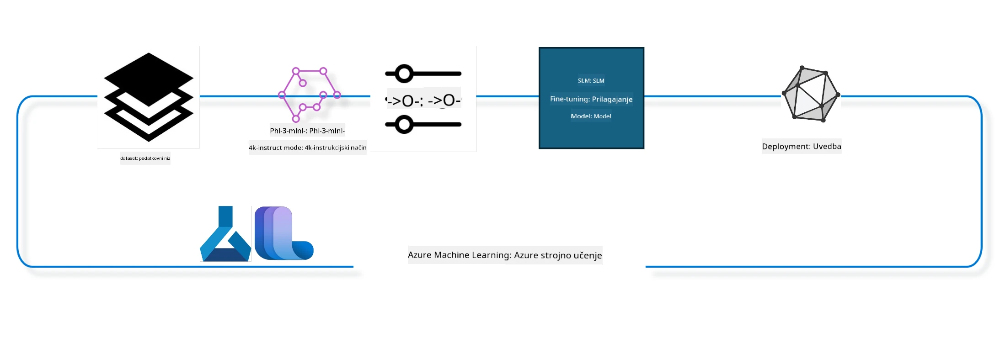

## Kako uporabiti komponente za dokončanje pogovora iz sistemskega registra Azure ML za natančno prilagajanje modela

V tem primeru bomo izvedli natančno prilagajanje modela Phi-3-mini-4k-instruct za dokončanje pogovora med 2 osebama z uporabo podatkovnega nabora ultrachat_200k.



Primer vam bo pokazal, kako izvesti natančno prilagajanje z uporabo Azure ML SDK in Pythona ter nato namestiti natančno prilagojen model na spletno točko za napovedovanje v realnem času.

### Učni podatki

Uporabili bomo podatkovni niz ultrachat_200k. To je močno filtrirana različica podatkovnega nabora UltraChat, ki je bila uporabljena za učenje modela Zephyr-7B-β, vrhunskega 7b klepetalnega modela.

### Model

Uporabili bomo model Phi-3-mini-4k-instruct, da pokažemo, kako lahko uporabnik natančno prilagodi model za nalogo dokončanja pogovora. Če ste odprli ta zvezek iz kartice specifičnega modela, ne pozabite zamenjati imena modela.

### Naloge

- Izberite model za natančno prilagajanje.
- Izberite in preglejte učne podatke.
- Konfigurirajte nalogo za natančno prilagajanje.
- Zaženite nalogo natančnega prilagajanja.
- Preglejte učne in evalvacijske metrike.
- Registrirajte natančno prilagojen model.
- Namestite natančno prilagojen model za napovedovanje v realnem času.
- Očistite vire.

## 1. Nastavitev predpogojov

- Namestite odvisnosti
- Povežite se z delovnim prostorom AzureML. Več informacij najdete na nastavitev overjanja SDK. Zamenjajte <WORKSPACE_NAME>, <RESOURCE_GROUP> in <SUBSCRIPTION_ID> spodaj.
- Povežite se s sistemskim registrom azureml
- Nastavite neobvezno ime eksperimenta
- Preverite ali ustvarite računske vire.

> [!NOTE]
> Zahteve: en sam GPU vozel lahko ima več GPU kartic. Na primer, v enem vozlišču Standard_NC24rs_v3 so 4 NVIDIA V100 GPU, medtem ko je v Standard_NC12s_v3 2 NVIDIA V100 GPU. Za te informacije si oglejte dokumentacijo. Število GPU kartic na vozlišče je nastavljeno v parametru gpus_per_node spodaj. Pravilna nastavitev te vrednosti bo zagotovila uporabo vseh GPU-jev v vozlišču. Priporočene SKU-je za GPU račune najdete tukaj in tukaj.

### Python knjižnice

Namestite odvisnosti z zagonom spodnje celice. To ni neobvezen korak, če izvajate v novem okolju.

```bash
pip install azure-ai-ml
pip install azure-identity
pip install datasets==2.9.0
pip install mlflow
pip install azureml-mlflow
```

### Interakcija z Azure ML

1. Ta Python skripta se uporablja za interakcijo s storitvijo Azure Machine Learning (Azure ML). Tukaj je povzetek, kaj počne:

    - Uvaža potrebne module iz paketov azure.ai.ml, azure.identity in azure.ai.ml.entities. Prav tako uvaža modul time.

    - Poskuša se overiti z DefaultAzureCredential(), ki omogoča poenostavljeno overjanje za hitro začetek razvoja aplikacij v oblaku Azure. Če to ne uspe, preide na InteractiveBrowserCredential(), ki omogoča interaktivno prijavo.

    - Nato poskuša ustvariti instanco MLClient z metodo from_config, ki bere konfiguracijo iz privzete konfiguracijske datoteke (config.json). Če to ne uspe, ustvari MLClient tako, da ročno poda subscription_id, resource_group_name in workspace_name.

    - Ustvari še eno instanco MLClient, tokrat za Azure ML register z imenom "azureml". Ta register je mesto, kjer so shranjeni modeli, cevovodi za natančno prilagajanje in okolja.

    - Nastavi experiment_name na "chat_completion_Phi-3-mini-4k-instruct".

    - Generira edinstven časovni žig tako, da trenutni čas (v sekundah od epohe, kot plavajoče število) pretvori v celo število in nato v niz. Ta časovni žig se lahko uporabi za ustvarjanje edinstvenih imen in različic.

    ```python
    # Uvozi potrebne module iz Azure ML in Azure Identity
    from azure.ai.ml import MLClient
    from azure.identity import (
        DefaultAzureCredential,
        InteractiveBrowserCredential,
    )
    from azure.ai.ml.entities import AmlCompute
    import time  # Uvozi modul time
    
    # Poskusi se avtenticirati z uporabo DefaultAzureCredential
    try:
        credential = DefaultAzureCredential()
        credential.get_token("https://management.azure.com/.default")
    except Exception as ex:  # Če DefaultAzureCredential ne uspe, uporabi InteractiveBrowserCredential
        credential = InteractiveBrowserCredential()
    
    # Poskusi ustvariti instanco MLClient z uporabo privzete konfiguracijske datoteke
    try:
        workspace_ml_client = MLClient.from_config(credential=credential)
    except:  # Če to ne uspe, ustvari instanco MLClient z ročnim vnosom podatkov
        workspace_ml_client = MLClient(
            credential,
            subscription_id="<SUBSCRIPTION_ID>",
            resource_group_name="<RESOURCE_GROUP>",
            workspace_name="<WORKSPACE_NAME>",
        )
    
    # Ustvari še eno instanco MLClient za Azure ML register z imenom "azureml"
    # Ta register je mesto, kjer so shranjeni modeli, fine-tuning cevovodi in okolja
    registry_ml_client = MLClient(credential, registry_name="azureml")
    
    # Nastavi ime eksperimenta
    experiment_name = "chat_completion_Phi-3-mini-4k-instruct"
    
    # Ustvari edinstven časovni žig, ki se lahko uporabi za imena in različice, ki morajo biti edinstvene
    timestamp = str(int(time.time()))
    ```

## 2. Izberite osnovni model za natančno prilagajanje

1. Phi-3-mini-4k-instruct je model z 3.8 milijardami parametrov, lahek, vrhunski odprtokodni model, zgrajen na podatkovnih nizih, uporabljenih za Phi-2. Model spada v družino modelov Phi-3, Mini različica pa je na voljo v dveh variantah, 4K in 128K, kar predstavlja dolžino konteksta (v žetonih), ki jo podpira. Model moramo natančno prilagoditi za naš specifični namen, da ga lahko uporabimo. Te modele lahko pregledujete v katalogu modelov v AzureML Studiu, z uporabo filtra za nalogo dokončanja pogovora. V tem primeru uporabljamo model Phi-3-mini-4k-instruct. Če ste odprli ta zvezek za drug model, ustrezno zamenjajte ime in različico modela.

> [!NOTE]
> lastnost id modela tega modela. Ta bo posredovana kot vhod v nalogo za natančno prilagajanje. Prav tako je na voljo kot polje Asset ID na strani podrobnosti modela v katalogu modelov AzureML Studia.

2. Ta Python skripta sodeluje z Azure Machine Learning (Azure ML) storitvijo. Tukaj je povzetek, kaj počne:

    - Nastavi model_name na "Phi-3-mini-4k-instruct".

    - Uporabi metodo get lastnosti models objekta registry_ml_client za pridobitev najnovejše različice modela z določenim imenom iz Azure ML registra. Metoda get se kliče z dvema argumentoma: imenom modela in oznako, ki določa, da naj se pridobi najnovejša različica modela.

    - Izpiše sporočilo na konzolo, ki kaže ime, različico in id modela, ki bo uporabljen za natančno prilagajanje. Metoda format niza se uporablja za vstavljanje imena, verzije in id-ja modela v sporočilo. Ime, različica in id modela so dostopni kot lastnosti objekta foundation_model.

    ```python
    # Nastavite ime modela
    model_name = "Phi-3-mini-4k-instruct"
    
    # Pridobite najnovejšo različico modela iz Azure ML registra
    foundation_model = registry_ml_client.models.get(model_name, label="latest")
    
    # Izpišite ime modela, različico in id
    # Te informacije so uporabne za sledenje in odpravljanje napak
    print(
        "\n\nUsing model name: {0}, version: {1}, id: {2} for fine tuning".format(
            foundation_model.name, foundation_model.version, foundation_model.id
        )
    )
    ```

## 3. Ustvarite računski vir, ki bo uporabljen v nalogi

Naloga natančnega prilagajanja dela IZKLJUČNO z GPU računi. Velikost računa je odvisna od velikosti modela in v večini primerov je težko izbrati pravi račun za nalogo. V tej celici vodimo uporabnika pri izbiri pravilnega računa za nalogo.

> [!NOTE]
> Spodaj navedeni računi delujejo z najbolj optimizirano konfiguracijo. Kakršne koli spremembe konfiguracije lahko povzročijo Cuda Out Of Memory napako. V takih primerih poskusite nadgraditi račun na večjo velikost.

> [!NOTE]
> Pri izbiri compute_cluster_size spodaj poskrbite, da je računski vir na voljo v vaši skupini virov. Če določen račun ni na voljo, lahko zaprosite za dostop do računalniških virov.

### Preverjanje podpore modela za natančno prilagajanje

1. Ta Python skripta sodeluje z modelom Azure Machine Learning (Azure ML). Tukaj je povzetek, kaj počne:

    - Uvaža modul ast, ki omogoča obdelavo dreves abstraktne slovnice Pythona.

    - Preverja, ali ima objekt foundation_model (ki predstavlja model v Azure ML) oznako z imenom finetune_compute_allow_list. Oznake v Azure ML so ključ-vrednost pari, ki jih lahko ustvarjate in uporabljate za filtriranje in razvrščanje modelov.

    - Če oznaka finetune_compute_allow_list obstaja, uporablja funkcijo ast.literal_eval za varno pretvorbo vrednosti oznake (niz) v Python seznam. Ta seznam se nato dodeli spremenljivki computes_allow_list. Nato izpiše sporočilo, da naj se računski vir ustvari iz seznama.

    - Če oznaka finetune_compute_allow_list ne obstaja, nastavi computes_allow_list na None in izpiše sporočilo, da oznaka ni del oznak modela.

    - Skratka, ta skripta preverja specifično oznako v metapodatkih modela, pretvarja vrednost oznake v seznam, če obstaja, in o tem obvešča uporabnika.

    ```python
    # Uvozi modul ast, ki zagotavlja funkcije za obdelavo dreves abstraktne sintakse Pythona
    import ast
    
    # Preveri, ali je oznaka 'finetune_compute_allow_list' prisotna v oznakah modela
    if "finetune_compute_allow_list" in foundation_model.tags:
        # Če je oznaka prisotna, uporabi ast.literal_eval za varno pretvorbo vrednosti oznake (niz) v Pythonovo listo
        computes_allow_list = ast.literal_eval(
            foundation_model.tags["finetune_compute_allow_list"]
        )  # Pretvori niz v Pythonovo listo
        # Izpiši sporočilo, ki kaže, da je treba ustvariti compute iz liste
        print(f"Please create a compute from the above list - {computes_allow_list}")
    else:
        # Če oznaka ni prisotna, nastavi computes_allow_list na None
        computes_allow_list = None
        # Izpiši sporočilo, ki kaže, da oznaka 'finetune_compute_allow_list' ni del oznak modela
        print("`finetune_compute_allow_list` is not part of model tags")
    ```

### Preverjanje računalniškega primerka

1. Ta Python skripta sodeluje s storitvijo Azure Machine Learning (Azure ML) in izvaja več preverjanj računalniškega primerka. Tukaj je povzetek, kaj počne:

    - Poskuša pridobiti računski primerek z imenom, shranjenim v compute_cluster, iz delovnega prostora Azure ML. Če je stanje zagotavljanja računalniškega primerka "failed" (ni uspelo), sproži ValueError.

    - Preveri, če je computes_allow_list različen od None. Če je, pretvori vse velikosti računalnikov na seznamu v male črke in preveri, če je velikost trenutnega računskega primerka na seznamu. Če ni, sproži ValueError.

    - Če je computes_allow_list None, preveri, ali je velikost računalniškega primerka na seznamu nepodprtih velikosti GPU VM. Če je, sproži ValueError.

    - Pridobi seznam vseh razpoložljivih velikosti računalnikov v delovnem prostoru. Nato iterira po tem seznamu in za vsako velikost preveri, ali se ime ujema z velikostjo trenutnega računalniškega primerka. Če se ujema, pridobi število GPU-jev za to velikost računalnika in nastavi gpu_count_found na True.

    - Če je gpu_count_found True, izpiše število GPU-jev v računalniškem primerku. Če je False, sproži ValueError.

    - Skratka, ta skripta izvaja več preverjanj nad računalniškim primerkom v delovnem prostoru Azure ML, vključno s preverjanjem stanja zagotavljanja, velikosti glede na dovoljen seznam ali prepovedani seznam in številom GPU-jev.

    ```python
    # Natisni sporočilo o izjema
    print(e)
    # Sproži ValueError, če velikost računalnika ni na voljo v delovnem prostoru
    raise ValueError(
        f"WARNING! Compute size {compute_cluster_size} not available in workspace"
    )
    
    # Pridobi računalniški primerek iz Azure ML delovnega prostora
    compute = workspace_ml_client.compute.get(compute_cluster)
    # Preveri, ali je stanje izvajanja računalniškega primerka "failed"
    if compute.provisioning_state.lower() == "failed":
        # Sproži ValueError, če je stanje izvajanja "failed"
        raise ValueError(
            f"Provisioning failed, Compute '{compute_cluster}' is in failed state. "
            f"please try creating a different compute"
        )
    
    # Preveri, ali computes_allow_list ni None
    if computes_allow_list is not None:
        # Pretvori vse velikosti računalnikov v computes_allow_list v male črke
        computes_allow_list_lower_case = [x.lower() for x in computes_allow_list]
        # Preveri, ali je velikost računalniškega primerka v computes_allow_list_lower_case
        if compute.size.lower() not in computes_allow_list_lower_case:
            # Sproži ValueError, če velikost računalniškega primerka ni v computes_allow_list_lower_case
            raise ValueError(
                f"VM size {compute.size} is not in the allow-listed computes for finetuning"
            )
    else:
        # Določi seznam nepodprtih velikosti GPU VM
        unsupported_gpu_vm_list = [
            "standard_nc6",
            "standard_nc12",
            "standard_nc24",
            "standard_nc24r",
        ]
        # Preveri, ali je velikost računalniškega primerka v unsupported_gpu_vm_list
        if compute.size.lower() in unsupported_gpu_vm_list:
            # Sproži ValueError, če je velikost računalniškega primerka v unsupported_gpu_vm_list
            raise ValueError(
                f"VM size {compute.size} is currently not supported for finetuning"
            )
    
    # Inicializiraj zastavico za preverjanje, ali je bilo število GPU v računalniškem primeru najdeno
    gpu_count_found = False
    # Pridobi seznam vseh razpoložljivih velikosti računalnika v delovnem prostoru
    workspace_compute_sku_list = workspace_ml_client.compute.list_sizes()
    available_sku_sizes = []
    # Pojdi skozi seznam razpoložljivih velikosti računalnika
    for compute_sku in workspace_compute_sku_list:
        available_sku_sizes.append(compute_sku.name)
        # Preveri, ali ime velikosti računalnika ustreza velikosti računalniškega primerka
        if compute_sku.name.lower() == compute.size.lower():
            # Če ustreza, pridobi število GPU za to velikost računalnika in nastavi gpu_count_found na True
            gpus_per_node = compute_sku.gpus
            gpu_count_found = True
    # Če je gpu_count_found True, natisni število GPU v računalniškem primeru
    if gpu_count_found:
        print(f"Number of GPU's in compute {compute.size}: {gpus_per_node}")
    else:
        # Če je gpu_count_found False, sproži ValueError
        raise ValueError(
            f"Number of GPU's in compute {compute.size} not found. Available skus are: {available_sku_sizes}."
            f"This should not happen. Please check the selected compute cluster: {compute_cluster} and try again."
        )
    ```

## 4. Izberite podatkovni niz za natančno prilagajanje modela

1. Uporabljamo podatkovni niz ultrachat_200k. Podatkovni niz ima štiri razdelke, primerni za nadzorovano natančno prilagajanje (sft).
Generacijsko rangiranje (gen). Število primerov na razdelek je prikazano spodaj:

    ```bash
    train_sft test_sft  train_gen  test_gen
    207865  23110  256032  28304
    ```

1. Naslednje celice prikazujejo osnovno pripravo podatkov za natančno prilagajanje:

### Vizualizacija nekaj vrstic podatkov

Želimo, da ta vzorec deluje hitro, zato shranite datoteki train_sft, test_sft, ki vsebujeta 5 % že obrezanih vrstic. To pomeni, da bo natančno prilagojen model manj natančen, zato ga ne bi smeli uporabljati v resničnem svetu.
Datoteka download-dataset.py se uporablja za prenos podatkovnega sklopa ultrachat_200k in pretvorbo podatkovnega sklopa v obliko, ki jo lahko porabi komponenta cevovoda za natančno prilagajanje. Ker je podatkovni sklop velik, imamo tukaj le del podatkovnega sklopa.

1. Zagon spodnjega skripta prenese le 5 % podatkov. To je mogoče povečati z nastavitvijo parametra dataset_split_pc na željeni odstotek.

> [!NOTE]
> Nekateri jezikovni modeli imajo različne jezikovne kode, zato bi morale biti tudi imenske oznake stolpcev v podatkovnem zbiru ustrezno prilagojene.

1. Tukaj je primer, kako naj bi podatki izgledali
Podatkovni niz za dokončanje pogovora je shranjen v formatu parquet, pri čemer ima vsak zapis naslednjo shemo:

    - To je JSON (JavaScript Object Notation) dokument, ki je priljubljen format za izmenjavo podatkov. Ni izvršljiva koda, ampak način shranjevanja in prenosa podatkov. Tukaj je razčlenitev njegove strukture:

    - "prompt": Ta ključ vsebuje niz, ki predstavlja nalogo ali vprašanje, namenjeno AI pomočniku.

    - "messages": Ta ključ vsebuje polje objektov. Vsak objekt predstavlja sporočilo v pogovoru med uporabnikom in AI pomočnikom. Vsako sporočilo ima dva ključa:

    - "content": Ta ključ vsebuje niz, ki predstavlja vsebino sporočila.
    - "role": Ta ključ vsebuje niz, ki predstavlja vlogo entitete, ki je poslala sporočilo. Lahko je "user" ali "assistant".
    - "prompt_id": Ta ključ vsebuje niz, ki predstavlja edinstveni identifikator poziva.

1. V tem specifičnem JSON dokumentu je prikazan pogovor, kjer uporabnik prosi AI pomočnika, naj ustvari glavnega junaka za distopično zgodbo. Pomočnik odgovori, nato uporabnik zahteva več podrobnosti. Pomočnik se strinja, da jih bo podal. Celoten pogovor je povezan z določenim ID poziva.

    ```python
    {
        // The task or question posed to an AI assistant
        "prompt": "Create a fully-developed protagonist who is challenged to survive within a dystopian society under the rule of a tyrant. ...",
        
        // An array of objects, each representing a message in a conversation between a user and an AI assistant
        "messages":[
            {
                // The content of the user's message
                "content": "Create a fully-developed protagonist who is challenged to survive within a dystopian society under the rule of a tyrant. ...",
                // The role of the entity that sent the message
                "role": "user"
            },
            {
                // The content of the assistant's message
                "content": "Name: Ava\n\n Ava was just 16 years old when the world as she knew it came crashing down. The government had collapsed, leaving behind a chaotic and lawless society. ...",
                // The role of the entity that sent the message
                "role": "assistant"
            },
            {
                // The content of the user's message
                "content": "Wow, Ava's story is so intense and inspiring! Can you provide me with more details.  ...",
                // The role of the entity that sent the message
                "role": "user"
            }, 
            {
                // The content of the assistant's message
                "content": "Certainly! ....",
                // The role of the entity that sent the message
                "role": "assistant"
            }
        ],
        
        // A unique identifier for the prompt
        "prompt_id": "d938b65dfe31f05f80eb8572964c6673eddbd68eff3db6bd234d7f1e3b86c2af"
    }
    ```

### Prenos podatkov

1. Ta Python skripta se uporablja za prenos podatkovnega niza z uporabo pomožne skripte z imenom download-dataset.py. Tukaj je povzetek, kaj počne:

    - Uvaža modul os, ki omogoča prenosljiv način uporabe funkcionalnosti, odvisne od operacijskega sistema.

    - Uporablja funkcijo os.system za zagon skripte download-dataset.py v lupini s specifičnimi argumenti ukazne vrstice. Argumenti določajo podatkovni niz, ki ga je treba prenesti (HuggingFaceH4/ultrachat_200k), imenik za prenos (ultrachat_200k_dataset) in odstotek razdelka podatkovnega niza (5). Funkcija os.system vrne izhodni status ukaza, ta status se shrani v spremenljivko exit_status.

    - Preveri, ali exit_status ni 0. V operacijskih sistemih, podobnih Unixu, izhodni status 0 običajno pomeni uspeh ukaza, medtem ko katerikoli drug številka pomeni napako. Če exit_status ni 0, sproži izjemo z sporočilom o napaki med prenosom podatkovnega niza.

    - Skratka, ta skripta izvaja ukaz za prenos podatkovnega niza z uporabo pomožne skripte in sproži izjemo, če ukaz ne uspe.

    ```python
    # Uvozi modul os, ki omogoča uporabo funkcionalnosti, odvisne od operacijskega sistema
    import os
    
    # Uporabi funkcijo os.system za zagon skripte download-dataset.py v ukazni vrstici z določenimi argumenti
    # Argumenti določajo, kateri nabor podatkov prenesti (HuggingFaceH4/ultrachat_200k), v katero mapo ga prenesti (ultrachat_200k_dataset) in odstotek podatkovnega nabora za delitev (5)
    # Funkcija os.system vrne izhodno stanje ukaza, ki ga je izvedla; to stanje se shrani v spremenljivko exit_status
    exit_status = os.system(
        "python ./download-dataset.py --dataset HuggingFaceH4/ultrachat_200k --download_dir ultrachat_200k_dataset --dataset_split_pc 5"
    )
    
    # Preveri, ali exit_status ni 0
    # V Unixu in podobnih operacijskih sistemih izhodno stanje 0 običajno pomeni, da je bil ukaz uspešno izveden, medtem ko katera koli druga številka pomeni napako
    # Če exit_status ni 0, sproži izjemo z sporočilom, ki označuje, da je prišlo do napake pri prenosu nabora podatkov
    if exit_status != 0:
        raise Exception("Error downloading dataset")
    ```

### Nalaganje podatkov v DataFrame
1. Ta Python skripta nalaga datoteko JSON Lines v pandas DataFrame in prikazuje prvih 5 vrstic. Tukaj je pregled, kaj počne:

    - Uvaža knjižnico pandas, ki je zmogljiva knjižnica za manipulacijo in analizo podatkov.

    - Nastavi največjo širino stolpca za prikaz v pandas na 0. To pomeni, da bo celotno besedilo vsakega stolpca prikazano brez skrajševanja, ko se DataFrame izpiše.

    - Uporabi funkcijo pd.read_json za nalaganje datoteke train_sft.jsonl iz mape ultrachat_200k_dataset v DataFrame. Argument lines=True označuje, da je datoteka v formatu JSON Lines, kjer je vsaka vrstica ločen JSON objekt.

    - Uporabi metodo head za prikaz prvih 5 vrstic DataFrame. Če DataFrame vsebuje manj kot 5 vrstic, bo prikazal vse.

    - Povzetek: ta skripta nalaga datoteko JSON Lines v DataFrame in prikazuje prvih 5 vrstic s polnim besedilom stolpcev.
    
    ```python
    # Uvozi knjižnico pandas, ki je zmogljiva knjižnica za manipulacijo in analizo podatkov
    import pandas as pd
    
    # Nastavi največjo širino stolpca za prikazne možnosti pandas na 0
    # To pomeni, da bo celotno besedilo vsakega stolpca prikazano brez skrajševanja, ko se DataFrame izpiše
    pd.set_option("display.max_colwidth", 0)
    
    # Uporabi funkcijo pd.read_json za nalaganje datoteke train_sft.jsonl iz imenika ultrachat_200k_dataset v DataFrame
    # Argument lines=True pomeni, da je datoteka v formatu JSON Lines, kjer je vsaka vrstica ločen JSON objekt
    df = pd.read_json("./ultrachat_200k_dataset/train_sft.jsonl", lines=True)
    
    # Uporabi metodo head za prikaz prvih 5 vrstic DataFrame
    # Če ima DataFrame manj kot 5 vrstic, bo prikazal vse te vrstice
    df.head()
    ```

## 5. Oddajte nalogo za fino učenje z modelom in podatki kot vhodnimi podatki

Ustvarite nalogo, ki uporablja komponento chat-completion pipepline. Več o vseh parametrih, ki jih podpira fino učenje.

### Določanje parametrov finetuninga

1. Parametri finetuninga so razdeljeni v 2 kategoriji - parametri učenja, parametri optimizacije

1. Parametri učenja določajo vidike učenja, kot so -

    - Optimizer, scheduler, ki se uporabljata
    - Metrična meritev za optimizacijo finetuninga
    - Število učnih korakov in velikost serije itd.
    - Optimizacijski parametri pomagajo optimizirati GPU pomnilnik in učinkovito uporabljati računske vire.

1. Spodaj je nekaj parametrov, ki spadajo v to kategorijo. Optimizacijski parametri so različni za vsak model in so vključeni z modelom, da obvladajo te razlike.

    - Omogoči deepspeed in LoRA
    - Omogoči mešano natančnost učenja
    - Omogoči večvozlično učenje

> [!NOTE]
> Nadzorovano fino učenje lahko povzroči izgubo poravnave ali katastrofalno pozabo. Priporočamo, da to težavo preverite in zaženete fazo poravnave po finetuning-u.

### Parametri finetuninga

1. Ta Python skripta nastavi parametre za fino učenje modela strojnega učenja. Tukaj je pregled, kaj počne:

    - Nastavi privzete parametre učenja, kot so število učnih epoh, velikosti serij za učenje in ocenjevanje, hitrost učenja in tip načrtovalca hitrosti učenja.

    - Nastavi privzete optimizacijske parametre, kot so uporaba Layer-wise Relevance Propagation (LoRa) in DeepSpeed ter DeepSpeed fazo.

    - Združi parametre učenja in optimizacije v en sam slovar z imenom finetune_parameters.

    - Preveri, ali ima foundation_model model-specifične privzete parametre. Če jih ima, izpiše opozorilo in posodobi slovar finetune_parameters s temi model-specifičnimi privzetimi vrednostmi. Funkcija ast.literal_eval se uporabi za pretvorbo model-specifičnih privzetih vrednosti iz niza v Python slovar.

    - Izpiše končni nabor parametrov za fino učenje, ki se bodo uporabljali pri izvajanju.

    - Povzetek: ta skripta nastavlja in prikazuje parametre za fino učenje modela strojnega učenja, z možnostjo preglasitve privzetih parametrov s specifičnimi za model.

    ```python
    # Nastavite privzete parametre usposabljanja, kot so število epoh usposabljanja, velikosti serij za usposabljanje in ocenjevanje, hitrost učenja ter tip urnika hitrosti učenja
    training_parameters = dict(
        num_train_epochs=3,
        per_device_train_batch_size=1,
        per_device_eval_batch_size=1,
        learning_rate=5e-6,
        lr_scheduler_type="cosine",
    )
    
    # Nastavite privzete parametre optimizacije, kot so uporaba Layer-wise Relevance Propagation (LoRa) in DeepSpeed ter stopnja DeepSpeed
    optimization_parameters = dict(
        apply_lora="true",
        apply_deepspeed="true",
        deepspeed_stage=2,
    )
    
    # Združite parametre usposabljanja in optimizacije v enoten slovar z imenom finetune_parameters
    finetune_parameters = {**training_parameters, **optimization_parameters}
    
    # Preverite, ali foundation_model vsebuje kakšne privzete parametre, specifične za model
    # Če jih, izpišite opozorilno sporočilo in posodobite slovar finetune_parameters s temi model-specifičnimi privzetimi vrednostmi
    # Funkcija ast.literal_eval se uporablja za pretvorbo model-specifičnih privzetih vrednosti iz niza v Python slovar
    if "model_specific_defaults" in foundation_model.tags:
        print("Warning! Model specific defaults exist. The defaults could be overridden.")
        finetune_parameters.update(
            ast.literal_eval(  # pretvori niz v python slovar
                foundation_model.tags["model_specific_defaults"]
            )
        )
    
    # Izpišite končni niz parametrov za fino nastavljanje, ki bodo uporabljeni za zagon
    print(
        f"The following finetune parameters are going to be set for the run: {finetune_parameters}"
    )
    ```

### Učna cevovod

1. Ta Python skripta definira funkcijo za ustvarjanje prikaznega imena za učni cevovod modela strojnega učenja in nato pokliče to funkcijo za ustvarjanje in izpis prikaznega imena. Tukaj je pregled, kaj počne:

1. Funkcija get_pipeline_display_name je definirana. Ta funkcija ustvari prikazno ime na podlagi različnih parametrov, povezanih z učnim cevovodom.

1. Znotraj funkcije izračuna skupno velikost serije tako, da pomnoži velikost serije na napravo, število korakov za akumulacijo gradienta, število GPU na vozlišče in število vozlišč, uporabljenih za fino učenje.

1. Pridobi različne druge parametre, kot so tip načrtovalca hitrosti učenja, ali je uporabljen DeepSpeed, DeepSpeed faza, ali je uporabljen Layer-wise Relevance Propagation (LoRa), omejitev števila kontrolnih točk modela in največja velikost zaporedja.

1. Ustvari niz, ki vključuje vse te parametre, ločene z vezaji. Če je uporabljen DeepSpeed ali LoRa, niz vključuje "ds" sledi DeepSpeed faza oziroma "lora". Če ne, vključuje "nods" ali "nolora".

1. Funkcija vrne ta niz, ki služi kot prikazno ime za učni cevovod.

1. Po definiciji funkcije se ta kliče za ustvarjanje prikaznega imena in ga nato izpiše.

1. Povzetek: ta skripta ustvarja prikazno ime za učni cevovod modela strojnega učenja na podlagi različnih parametrov in nato izpiše to ime.

    ```python
    # Določi funkcijo za ustvarjanje prikaznega imena za učni potek
    def get_pipeline_display_name():
        # Izračunaj skupno velikost serije tako, da zmnožiš velikost serije na napravo, število korakov akumulacije gradienta, število GPU-jev na vozlišče in število vozlišč, uporabljenih za fino nastavitev
        batch_size = (
            int(finetune_parameters.get("per_device_train_batch_size", 1))
            * int(finetune_parameters.get("gradient_accumulation_steps", 1))
            * int(gpus_per_node)
            * int(finetune_parameters.get("num_nodes_finetune", 1))
        )
        # Pridobi tip urnika hitrosti učenja
        scheduler = finetune_parameters.get("lr_scheduler_type", "linear")
        # Pridobi, ali je aplikacija DeepSpeed uporabljena
        deepspeed = finetune_parameters.get("apply_deepspeed", "false")
        # Pridobi fazo DeepSpeed
        ds_stage = finetune_parameters.get("deepspeed_stage", "2")
        # Če je DeepSpeed uporabljen, dodaj "ds" in fazo DeepSpeed v prikazno ime; če ne, dodaj "nods"
        if deepspeed == "true":
            ds_string = f"ds{ds_stage}"
        else:
            ds_string = "nods"
        # Pridobi, ali je uporabljena propagacija pomembnosti po plasteh (LoRa)
        lora = finetune_parameters.get("apply_lora", "false")
        # Če je LoRa uporabljena, dodaj "lora" v prikazno ime; če ne, dodaj "nolora"
        if lora == "true":
            lora_string = "lora"
        else:
            lora_string = "nolora"
        # Pridobi omejitev števila modelnih kontrolnih točk, ki jih je treba obdržati
        save_limit = finetune_parameters.get("save_total_limit", -1)
        # Pridobi največjo dolžino zaporedja
        seq_len = finetune_parameters.get("max_seq_length", -1)
        # Ustvari prikazno ime s povezovanjem vseh teh parametrov, ločenih z vezaji
        return (
            model_name
            + "-"
            + "ultrachat"
            + "-"
            + f"bs{batch_size}"
            + "-"
            + f"{scheduler}"
            + "-"
            + ds_string
            + "-"
            + lora_string
            + f"-save_limit{save_limit}"
            + f"-seqlen{seq_len}"
        )
    
    # Kliči funkcijo za ustvarjanje prikaznega imena
    pipeline_display_name = get_pipeline_display_name()
    # Izpiši prikazno ime
    print(f"Display name used for the run: {pipeline_display_name}")
    ```

### Konfiguracija cevovoda

Ta Python skripta definira in konfigurira učni cevovod modela strojnega učenja z uporabo Azure Machine Learning SDK. Tukaj je pregled, kaj počne:

1. Uvozi potrebne module iz Azure AI ML SDK.

1. Pridobi komponento cevovoda z imenom "chat_completion_pipeline" iz registra.

1. Definira nalogo cevovoda z dekoratorjem `@pipeline` in funkcijo `create_pipeline`. Ime cevovoda je nastavljeno na `pipeline_display_name`.

1. Znotraj funkcije `create_pipeline` inicializira pridobljeno komponento cevovoda z različnimi parametri, vključno s potjo do modela, gruče računalnih enot za različne faze, razdelitvami podatkov za učenje in testiranje, številom GPU-jev za fino učenje ter drugimi parametri finetuninga.

1. Preslika izhod fine tuning naloge na izhod cevovoda. To je narejeno, da je finoučen model enostavno registrirati, kar je potrebno za nameščanje modela na spletno ali paketno končno postajo.

1. Ustvari instanco cevovoda z klicanjem funkcije `create_pipeline`.

1. Nastavi možnost `force_rerun` cevovoda na `True`, kar pomeni, da se ne uporabijo predpomnjeni rezultati prejšnjih nalog.

1. Nastavi možnost `continue_on_step_failure` cevovoda na `False`, kar pomeni, da se cevovod ustavi, če kateri koli korak ne uspe.

1. Povzetek: ta skripta definira in konfigurira učni cevovod za nalogo dokončanja klepeta z uporabo Azure Machine Learning SDK.

    ```python
    # Uvozi potrebne module iz Azure AI ML SDK
    from azure.ai.ml.dsl import pipeline
    from azure.ai.ml import Input
    
    # Pridobi komponento cevovoda z imenom "chat_completion_pipeline" iz registra
    pipeline_component_func = registry_ml_client.components.get(
        name="chat_completion_pipeline", label="latest"
    )
    
    # Določi nalogo cevovoda z uporabo dekoraterja @pipeline in funkcije create_pipeline
    # Ime cevovoda je nastavljeno na pipeline_display_name
    @pipeline(name=pipeline_display_name)
    def create_pipeline():
        # Inicializiraj pridobljeno komponento cevovoda z različnimi parametri
        # Ti vključujejo pot do modela, računske gruče za različne faze, razdelke podatkov za učenje in testiranje, število GPU-jev za fino nastavljanje in druge parametre fino nastavljanja
        chat_completion_pipeline = pipeline_component_func(
            mlflow_model_path=foundation_model.id,
            compute_model_import=compute_cluster,
            compute_preprocess=compute_cluster,
            compute_finetune=compute_cluster,
            compute_model_evaluation=compute_cluster,
            # Preslika razdelke podatkov na parametre
            train_file_path=Input(
                type="uri_file", path="./ultrachat_200k_dataset/train_sft.jsonl"
            ),
            test_file_path=Input(
                type="uri_file", path="./ultrachat_200k_dataset/test_sft.jsonl"
            ),
            # Nastavitve učenja
            number_of_gpu_to_use_finetuning=gpus_per_node,  # Nastavljeno na število GPU-jev, ki so na voljo v računu
            **finetune_parameters
        )
        return {
            # Preslika izhod fino nastavljenega dela na izhod naloge cevovoda
            # To se naredi, da lahko enostavno registriramo fino nastavljen model
            # Registracija modela je potrebna za uvajanje modela na spletni ali paketni konektor
            "trained_model": chat_completion_pipeline.outputs.mlflow_model_folder
        }
    
    # Ustvari instanco cevovoda tako, da pokličeš funkcijo create_pipeline
    pipeline_object = create_pipeline()
    
    # Ne uporabljaj predpomnjenih rezultatov iz prejšnjih opravil
    pipeline_object.settings.force_rerun = True
    
    # Nastavi nadaljevanje ob neuspehu koraka na False
    # To pomeni, da se bo cevovod ustavil, če kateri koli korak ne uspe
    pipeline_object.settings.continue_on_step_failure = False
    ```

### Oddajte nalogo

1. Ta Python skripta odda nalogo učnega cevovoda v delovno okolje Azure Machine Learning in nato čaka, da se naloga zaključi. Tukaj je pregled, kaj počne:

    - Pokliče metodo create_or_update objekta jobs v workspace_ml_client za oddajo naloge cevovoda. Cevovod, ki se bo zagnal, je določen z pipeline_object, eksperiment, pod katerim se naloga izvaja, pa je določen z experiment_name.

    - Nato pokliče metodo stream objekta jobs v workspace_ml_client, da počaka na zaključek naloge cevovoda. Naloga za čakanje je določena z atributom name objekta pipeline_job.

    - Povzetek: ta skripta odda nalogo za učni cevovod v delovnem okolju Azure Machine Learning in nato čaka na zaključek naloge.

    ```python
    # Pošljite nalogo pipeline v delovno okolje Azure Machine Learning
    # Pipeline, ki se izvede, je določen s pipeline_object
    # Poskus, pod katerim se naloga izvaja, je določen z experiment_name
    pipeline_job = workspace_ml_client.jobs.create_or_update(
        pipeline_object, experiment_name=experiment_name
    )
    
    # Počakajte, da se naloga pipeline zaključi
    # Naloga, na katero čakamo, je določena z atributom name objekta pipeline_job
    workspace_ml_client.jobs.stream(pipeline_job.name)
    ```

## 6. Registrirajte finoučen model v delovnem okolju

Model bomo registrirali iz izhoda naloge fine učenja. To bo sledilo sorodstvu med finoučenim modelom in nalogo fine učenja. Naloga fine učenja lahko dodatno sledi sorodstvu do osnovnega modela, podatkov in učne kode.

### Registracija ML modela

1. Ta Python skripta registrira model strojnega učenja, ki je bil naučen v učnem cevovodu Azure Machine Learning. Tukaj je pregled, kaj počne:

    - Uvozi potrebne module iz Azure AI ML SDK.

    - Preveri, ali je izhod trained_model na voljo iz naloge cevovoda tako, da pokliče metodo get objekta jobs v workspace_ml_client in dostopa do atributa outputs.

    - Sestavi pot do naučenega modela s formatiranjem niza z imenom naloge cevovoda in imenom izhoda ("trained_model").

    - Določi ime za finoučen model tako, da originalnemu imenu modela doda "-ultrachat-200k" in zamenja vse poševnice s pomišljaji.

    - Pripravi registracijo modela z ustvarjanjem objekta Model z različnimi parametri, vključno s potjo do modela, tipom modela (MLflow model), imenom in različico modela ter opisom modela.

    - Registrira model s klicem metode create_or_update objekta models v workspace_ml_client z objektom Model kot argumentom.

    - Izpiše registrirani model.

1. Povzetek: ta skripta registrira model strojnega učenja, ki je bil naučen v učnem cevovodu Azure Machine Learning.
    
    ```python
    # Uvozi potrebne module iz Azure AI ML SDK
    from azure.ai.ml.entities import Model
    from azure.ai.ml.constants import AssetTypes
    
    # Preveri, ali je izhod `trained_model` na voljo iz cevovodnega opravila
    print("pipeline job outputs: ", workspace_ml_client.jobs.get(pipeline_job.name).outputs)
    
    # Ustvari pot do izurjenega modela z oblikovanjem niza z imenom cevovodnega opravila in imenom izhoda ("trained_model")
    model_path_from_job = "azureml://jobs/{0}/outputs/{1}".format(
        pipeline_job.name, "trained_model"
    )
    
    # Določi ime za fino nastavljeni model tako, da originalno ime modela dopolni z "-ultrachat-200k" in zamenja vse poševnice s pomišljaji
    finetuned_model_name = model_name + "-ultrachat-200k"
    finetuned_model_name = finetuned_model_name.replace("/", "-")
    
    print("path to register model: ", model_path_from_job)
    
    # Pripravi registracijo modela z ustvarjanjem objekta Model z različnimi parametri
    # Sem spadajo pot do modela, tip modela (MLflow model), ime in različica modela ter opis modela
    prepare_to_register_model = Model(
        path=model_path_from_job,
        type=AssetTypes.MLFLOW_MODEL,
        name=finetuned_model_name,
        version=timestamp,  # Uporabi časovni žig kot različico, da se prepreči konflikt različic
        description=model_name + " fine tuned model for ultrachat 200k chat-completion",
    )
    
    print("prepare to register model: \n", prepare_to_register_model)
    
    # Registriraj model z klicem metode create_or_update objekta models v workspace_ml_client z objektom Model kot argumentom
    registered_model = workspace_ml_client.models.create_or_update(
        prepare_to_register_model
    )
    
    # Izpiši registrirani model
    print("registered model: \n", registered_model)
    ```

## 7. Namestite finoučen model na spletno končno postajo

Spletne končne postaje nudijo vzdržljiv REST API, ki je uporabna za integracijo z aplikacijami, ki morajo uporabljati model.

### Upravljanje končne postaje

1. Ta Python skripta ustvarja upravljano spletno končno postajo v Azure Machine Learning za registriran model. Tukaj je pregled, kaj počne:

    - Uvozi potrebne module iz Azure AI ML SDK.

    - Določi unikatno ime za spletno končno postajo tako, da nizu "ultrachat-completion-" doda časovni žig.

    - Pripravi ustvarjanje spletne končne postaje z ustvarjanjem objekta ManagedOnlineEndpoint z različnimi parametri, vključno z imenom končne postaje, opisom končne postaje in načinom avtentikacije ("key").

    - Ustvari spletno končno postajo z klicem metode begin_create_or_update v workspace_ml_client z objektom ManagedOnlineEndpoint kot argumentom. Nato počaka na dokončanje operacije s klicem metode wait.

1. Povzetek: ta skripta ustvarja upravljano spletno končno postajo v Azure Machine Learning za registriran model.

    ```python
    # Uvozi potrebne module iz Azure AI ML SDK
    from azure.ai.ml.entities import (
        ManagedOnlineEndpoint,
        ManagedOnlineDeployment,
        ProbeSettings,
        OnlineRequestSettings,
    )
    
    # Določi edinstveno ime za spletno točko z dodajanjem časovnega žiga nizu "ultrachat-completion-"
    online_endpoint_name = "ultrachat-completion-" + timestamp
    
    # Pripravi se na ustvarjanje spletne točke z ustvarjanjem objekta ManagedOnlineEndpoint z različnimi parametri
    # Ti vključujejo ime točke, opis točke in način preverjanja pristnosti ("key")
    endpoint = ManagedOnlineEndpoint(
        name=online_endpoint_name,
        description="Online endpoint for "
        + registered_model.name
        + ", fine tuned model for ultrachat-200k-chat-completion",
        auth_mode="key",
    )
    
    # Ustvari spletno točko tako, da pokličeš metodo begin_create_or_update od workspace_ml_client z objektom ManagedOnlineEndpoint kot argumentom
    # Nato počakaj, da se operacija ustvarjanja zaključi, z uporabo metode wait
    workspace_ml_client.begin_create_or_update(endpoint).wait()
    ```

> [!NOTE]
> Tukaj najdete seznam SKU-jev, podprtih za nameščanje - [Seznam SKU-jev upravljanih spletnih končnih postaj](https://learn.microsoft.com/azure/machine-learning/reference-managed-online-endpoints-vm-sku-list)

### Namestitev ML modela

1. Ta Python skripta namešča registriran model strojnega učenja na upravljano spletno končno postajo v Azure Machine Learning. Tukaj je pregled, kaj počne:

    - Uvozi modul ast, ki ponuja funkcije za obdelavo dreves Pythonovega abstraktnega sintaktičnega drevesa.

    - Nastavi tip primerka za nameščanje na "Standard_NC6s_v3".

    - Preveri, ali je oznaka inference_compute_allow_list prisotna v osnovnem modelu. Če je, pretvori vrednost oznake iz niza v Python seznam in jo dodeli spremenljivki inference_computes_allow_list. Če ni, nastavi inference_computes_allow_list na None.

    - Preveri, ali je izbrani tip primerka v dovoljenem seznamu. Če ni, izpiše sporočilo, naj uporabnik izbere tip primerka iz dovoljenega seznama.

    - Pripravi ustvarjanje nameščanja z ustvarjanjem objekta ManagedOnlineDeployment z različnimi parametri, vključno z imenom nameščanja, imenom končne postaje, ID-jem modela, tipom in številom primerkov, nastavitvami probe žive povezave in nastavitvami zahtev.

    - Ustvari nameščanje z klicem metode begin_create_or_update v workspace_ml_client z objektom ManagedOnlineDeployment kot argumentom. Nato počaka na dokončanje operacije s klicem metode wait.

    - Nastavi promet končne postaje tako, da usmeri 100% prometa na nameščanje "demo".

    - Posodobi končno postajo z klicem metode begin_create_or_update v workspace_ml_client z objektom končne postaje kot argumentom. Nato počaka na dokončanje posodobitve s klicem metode result.

1. Povzetek: ta skripta namešča registriran model strojnega učenja na upravljano spletno končno postajo v Azure Machine Learning.

    ```python
    # Uvozi modul ast, ki zagotavlja funkcije za obdelavo dreves abstraktne sintakse Python jezika
    import ast
    
    # Nastavi tip instančne za nameščanje
    instance_type = "Standard_NC6s_v3"
    
    # Preveri, ali oznaka `inference_compute_allow_list` obstaja v osnovnem modelu
    if "inference_compute_allow_list" in foundation_model.tags:
        # Če obstaja, pretvori vrednost oznake iz niza v Python seznam in jo dodeli `inference_computes_allow_list`
        inference_computes_allow_list = ast.literal_eval(
            foundation_model.tags["inference_compute_allow_list"]
        )
        print(f"Please create a compute from the above list - {computes_allow_list}")
    else:
        # Če ne obstaja, nastavi `inference_computes_allow_list` na `None`
        inference_computes_allow_list = None
        print("`inference_compute_allow_list` is not part of model tags")
    
    # Preveri, ali je določen tip instance v seznamu dovoljenih
    if (
        inference_computes_allow_list is not None
        and instance_type not in inference_computes_allow_list
    ):
        print(
            f"`instance_type` is not in the allow listed compute. Please select a value from {inference_computes_allow_list}"
        )
    
    # Pripravi se na ustvarjanje nameščanja z ustvarjanjem objekta `ManagedOnlineDeployment` z različnimi parametri
    demo_deployment = ManagedOnlineDeployment(
        name="demo",
        endpoint_name=online_endpoint_name,
        model=registered_model.id,
        instance_type=instance_type,
        instance_count=1,
        liveness_probe=ProbeSettings(initial_delay=600),
        request_settings=OnlineRequestSettings(request_timeout_ms=90000),
    )
    
    # Ustvari nameščanje s klicem metode `begin_create_or_update` objekta `workspace_ml_client` z objektom `ManagedOnlineDeployment` kot argument
    # Nato počakaj, da se operacija ustvarjanja zaključi s klicem metode `wait`
    workspace_ml_client.online_deployments.begin_create_or_update(demo_deployment).wait()
    
    # Nastavi promet končnega točke, da usmeri 100 % prometa na nameščanje "demo"
    endpoint.traffic = {"demo": 100}
    
    # Posodobi končno točko s klicem metode `begin_create_or_update` objekta `workspace_ml_client` z objektom `endpoint` kot argument
    # Nato počakaj, da se operacija posodobitve zaključi s klicem metode `result`
    workspace_ml_client.begin_create_or_update(endpoint).result()
    ```

## 8. Preizkusite končno postajo z vzorčnimi podatki

Z vzorčnimi podatki iz testnega nabora bomo poslali zahtevo na spletno končno postajo za sklepanje. Nato bomo prikazali izračunane oznake skupaj z resničnimi oznakami.

### Branje rezultatov

1. Ta Python skripta bere datoteko JSON Lines v pandas DataFrame, vzame naključni vzorec in ponastavi indeks. Tukaj je pregled, kaj počne:

    - Prebere datoteko ./ultrachat_200k_dataset/test_gen.jsonl v pandas DataFrame. Funkcija read_json je uporabljena z argumentom lines=True, ker je datoteka v formatu JSON Lines, kjer je vsaka vrstica ločen JSON objekt.

    - Vzame naključni vzorec ene vrstice iz DataFrame. Funkcija sample je uporabljena z argumentom n=1 za določitev števila naključnih vrstic.

    - Ponastavi indeks DataFrame. Funkcija reset_index je uporabljena z argumentom drop=True, da odstrani izvirni indeks in ga nadomesti z novim indeksom privzetih celih števil.

    - Prikaže prvih 2 vrstici DataFrame z uporabo funkcije head z argumentom 2. Ker pa DataFrame vsebuje le eno vrstico po vzorčenju, bo prikazala samo to eno vrstico.

1. Povzetek: ta skripta bere datoteko JSON Lines v pandas DataFrame, vzame naključni vzorec ene vrstice, ponastavi indeks in prikaže prvo vrstico.
    
    ```python
    # Uvozi knjižnico pandas
    import pandas as pd
    
    # Preberi JSON Lines datoteko './ultrachat_200k_dataset/test_gen.jsonl' v pandas DataFrame
    # Argument 'lines=True' označuje, da je datoteka v JSON Lines formatu, kjer je vsaka vrstica ločen JSON objekt
    test_df = pd.read_json("./ultrachat_200k_dataset/test_gen.jsonl", lines=True)
    
    # Vzemi naključen vzorec 1 vrstice iz DataFrame
    # Argument 'n=1' določa število naključnih vrstic za izbiro
    test_df = test_df.sample(n=1)
    
    # Ponastavi indeks DataFrame
    # Argument 'drop=True' označuje, da je treba originalni indeks odstraniti in ga nadomestiti z novim indeksom privzetih celih števil
    # Argument 'inplace=True' označuje, da naj se DataFrame spremeni na mestu (brez ustvarjanja novega objekta)
    test_df.reset_index(drop=True, inplace=True)
    
    # Prikaži prvih 2 vrstici DataFrame
    # Ker pa DataFrame vsebuje samo eno vrstico po vzorčenju, bo to prikazalo samo to eno vrstico
    test_df.head(2)
    ```

### Ustvarite JSON objekt
1. Ta Python skripta ustvarja JSON objekt s specifičnimi parametri in ga shranjuje v datoteko. Tukaj je razčlenitev, kaj počne:

    - Uvozi modul json, ki zagotavlja funkcije za delo z JSON podatki.

    - Ustvari slovar parameters s ključi in vrednostmi, ki predstavljajo parametre za model strojnega učenja. Ključi so "temperature", "top_p", "do_sample" in "max_new_tokens", njihove ustrezne vrednosti pa so 0.6, 0.9, True in 200.

    - Ustvari drug slovar test_json z dvema ključema: "input_data" in "params". Vrednost "input_data" je drug slovar s ključi "input_string" in "parameters". Vrednost "input_string" je seznam, ki vsebuje prvo sporočilo iz DataFrame test_df. Vrednost "parameters" je slovar parameters, ustvarjen prej. Vrednost "params" je prazen slovar.

    - Odpre datoteko z imenom sample_score.json

    ```python
    # Uvozi modul json, ki zagotavlja funkcije za delo z JSON podatki
    import json
    
    # Ustvari slovar `parameters` s ključi in vrednostmi, ki predstavljajo parametre za model strojnega učenja
    # Ključi so "temperature", "top_p", "do_sample" in "max_new_tokens", njihove ustrezne vrednosti pa so 0.6, 0.9, True in 200
    parameters = {
        "temperature": 0.6,
        "top_p": 0.9,
        "do_sample": True,
        "max_new_tokens": 200,
    }
    
    # Ustvari še en slovar `test_json` z dvema ključema: "input_data" in "params"
    # Vrednost "input_data" je drug slovar s ključi "input_string" in "parameters"
    # Vrednost "input_string" je seznam, ki vsebuje prvo sporočilo iz DataFrame `test_df`
    # Vrednost "parameters" je predhodno ustvarjeni slovar `parameters`
    # Vrednost "params" je prazen slovar
    test_json = {
        "input_data": {
            "input_string": [test_df["messages"][0]],
            "parameters": parameters,
        },
        "params": {},
    }
    
    # Odpri datoteko z imenom `sample_score.json` v mapi `./ultrachat_200k_dataset` v načinu pisanja
    with open("./ultrachat_200k_dataset/sample_score.json", "w") as f:
        # Zapiši slovar `test_json` v datoteko v JSON formatu z uporabo funkcije `json.dump`
        json.dump(test_json, f)
    ```

### Klicanje končne točke

1. Ta Python skripta kliče spletno končno točko v Azure Machine Learning za ocenjevanje JSON datoteke. Tukaj je razčlenitev, kaj počne:

    - Pokliče metodo invoke lastnosti online_endpoints objekta workspace_ml_client. Ta metoda se uporablja za pošiljanje zahteve spletni končni točki in pridobivanje odgovora.

    - Določi ime končne točke in namestitve z argumentoma endpoint_name in deployment_name. V tem primeru je ime končne točke shranjeno v spremenljivki online_endpoint_name, ime namestitve pa je "demo".

    - Določi pot do JSON datoteke, ki jo je treba oceniti, z argumentom request_file. V tem primeru je datoteka ./ultrachat_200k_dataset/sample_score.json.

    - Shrani odgovor končne točke v spremenljivko response.

    - Izpiše surovi odgovor.

1. Povzemimo, ta skripta kliče spletno končno točko v Azure Machine Learning za ocenjevanje JSON datoteke in izpiše odgovor.

    ```python
    # Kličite spletni konec v Azure Machine Learning za ocenjevanje datoteke `sample_score.json`
    # Metoda `invoke` lastnosti `online_endpoints` objekta `workspace_ml_client` se uporablja za pošiljanje zahteve spletnemu koncu in pridobitev odgovora
    # Argument `endpoint_name` določa ime konca, ki je shranjeno v spremenljivki `online_endpoint_name`
    # Argument `deployment_name` določa ime namestitve, ki je "demo"
    # Argument `request_file` določa pot do JSON datoteke za oceno, ki je `./ultrachat_200k_dataset/sample_score.json`
    response = workspace_ml_client.online_endpoints.invoke(
        endpoint_name=online_endpoint_name,
        deployment_name="demo",
        request_file="./ultrachat_200k_dataset/sample_score.json",
    )
    
    # Natisnite surovi odgovor od konca
    print("raw response: \n", response, "\n")
    ```

## 9. Brisanje spletne končne točke

1. Ne pozabite izbrisati spletne končne točke, sicer boste pustili merilec stroškov v teku za računalniške vire, ki jih uporablja končna točka. Ta vrstica Python kode briše spletno končno točko v Azure Machine Learning. Tukaj je razčlenitev, kaj počne:

    - Pokliče metodo begin_delete lastnosti online_endpoints objekta workspace_ml_client. Ta metoda se uporablja za začetek brisanja spletne končne točke.

    - Določi ime končne točke, ki jo je treba izbrisati, z argumentom name. V tem primeru je ime končne točke shranjeno v spremenljivki online_endpoint_name.

    - Pokliče metodo wait, da počaka, da se brisanje zaključi. To je blokirajoča operacija, kar pomeni, da prepreči, da bi skripta nadaljevala, dokler brisanje ni končano.

    - Povzemimo, ta vrstica kode začne brisati spletno končno točko v Azure Machine Learning in počaka, da se operacija zaključi.

    ```python
    # Izbriši spletno končno točko v Azure Machine Learning
    # Metoda `begin_delete` lastnosti `online_endpoints` objekta `workspace_ml_client` se uporablja za začetek brisanja spletne končne točke
    # Argument `name` določa ime končne točke, ki bo izbrisana, shranjeno v spremenljivki `online_endpoint_name`
    # Kliče se metoda `wait`, da počaka, da se operacija brisanja zaključi. To je blokirajoča operacija, kar pomeni, da skripta ne bo nadaljevala, dokler brisanje ni končano
    workspace_ml_client.online_endpoints.begin_delete(name=online_endpoint_name).wait()
    ```

---

<!-- CO-OP TRANSLATOR DISCLAIMER START -->
**Omejitev odgovornosti**:  
Ta dokument je bil preveden z uporabo storitve za avtomatski prevod AI [Co-op Translator](https://github.com/Azure/co-op-translator). Čeprav si prizadevamo za natančnost, prosimo, upoštevajte, da avtomatski prevodi lahko vsebujejo napake ali netočnosti. Izvirni dokument v izvorni jezik je treba upoštevati kot avtoritativni vir. Za ključne informacije priporočamo strokovni človekov prevod. Nismo odgovorni za morebitne nesporazume ali napačne interpretacije, ki izhajajo iz uporabe tega prevoda.
<!-- CO-OP TRANSLATOR DISCLAIMER END -->