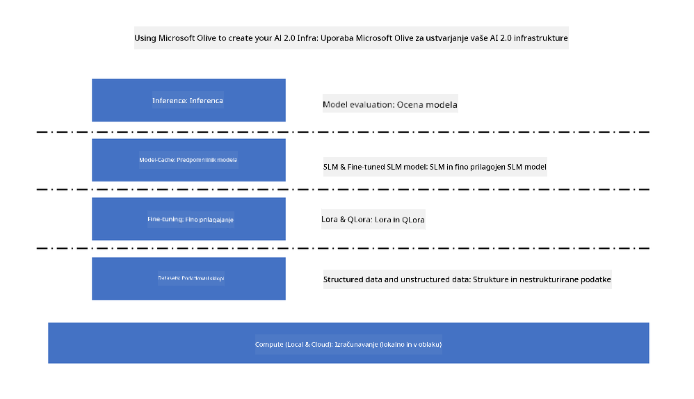
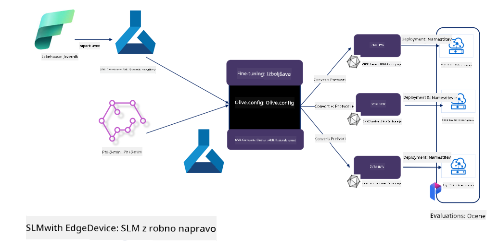

<!--
CO_OP_TRANSLATOR_METADATA:
{
  "original_hash": "5764be88ad2eb4f341e742eb8f14fab1",
  "translation_date": "2025-05-09T20:56:09+00:00",
  "source_file": "md/03.FineTuning/FineTuning_MicrosoftOlive.md",
  "language_code": "sl"
}
-->
# **Fine-tuning Phi-3 s Microsoft Olive**

[Olive](https://github.com/microsoft/OLive?WT.mc_id=aiml-138114-kinfeylo) je enostavno orodje za optimizacijo modelov, ki upošteva strojno opremo in združuje vodilne tehnike za stiskanje, optimizacijo in prevajanje modelov.

Namenjeno je poenostavitvi procesa optimizacije modelov strojnega učenja, da kar najbolje izkoristijo določene strojne arhitekture.

Ne glede na to, ali delate na aplikacijah v oblaku ali na napravah na robu, vam Olive omogoča enostavno in učinkovito optimizacijo modelov.

## Ključne funkcije:
- Olive združuje in avtomatizira optimizacijske tehnike za želene ciljne naprave.
- Ker ena sama optimizacijska tehnika ne ustreza vsem scenarijem, Olive omogoča razširljivost z vključevanjem inovacij strokovnjakov iz industrije.

## Zmanjšajte inženirsko delo:
- Razvijalci pogosto potrebujejo znanje in uporabo več različnih orodij specifičnih za proizvajalce strojne opreme, da pripravijo in optimizirajo usposobljene modele za uvajanje.
- Olive poenostavi ta proces z avtomatizacijo optimizacijskih tehnik za želene naprave.

## Pripravljen za uporabo E2E optimizacijska rešitev:

S kombiniranjem in prilagajanjem integriranih tehnik Olive ponuja enotno rešitev za optimizacijo od začetka do konca.
Pri optimizaciji modelov upošteva omejitve, kot sta natančnost in zakasnitev.

## Uporaba Microsoft Olive za fine-tuning

Microsoft Olive je zelo enostavno odprtokodno orodje za optimizacijo modelov, ki pokriva tako fine-tuning kot referenco na področju generativne umetne inteligence. Zahteva le preprosto konfiguracijo, v kombinaciji z uporabo odprtokodnih majhnih jezikovnih modelov in pripadajočih runtime okolij (AzureML / lokalni GPU, CPU, DirectML), s čimer lahko avtomatsko optimizirate model in najdete najboljši model za uvajanje v oblak ali na robne naprave. Podjetjem omogoča, da zgradijo svoje vertikalne industrijske modele lokalno in v oblaku.



## Fine-tuning Phi-3 z Microsoft Olive



## Primer kode in primer Phi-3 Olive
V tem primeru boste uporabili Olive za:

- Fine-tuning LoRA adapterja za razvrščanje fraz v kategorije Sad, Joy, Fear, Surprise.
- Združitev uteži adapterja v osnovni model.
- Optimizacijo in kvantizacijo modela v int4.

[Sample Code](../../code/03.Finetuning/olive-ort-example/README.md)

### Namestitev Microsoft Olive

Namestitev Microsoft Olive je zelo preprosta in podpira CPU, GPU, DirectML ter Azure ML.

```bash
pip install olive-ai
```

Če želite zagnati ONNX model na CPU, lahko uporabite

```bash
pip install olive-ai[cpu]
```

Če želite zagnati ONNX model na GPU, lahko uporabite

```python
pip install olive-ai[gpu]
```

Če želite uporabiti Azure ML, uporabite

```python
pip install git+https://github.com/microsoft/Olive#egg=olive-ai[azureml]
```

**Opomba**  
Zahteve OS: Ubuntu 20.04 / 22.04

### **Microsoft Olive Config.json**

Po namestitvi lahko konfigurirate različne nastavitve za specifične modele preko Config datoteke, vključno s podatki, računanjem, treningom, uvajanjem in generiranjem modelov.

**1. Podatki**

Microsoft Olive podpira trening na lokalnih in oblačnih podatkih, kar lahko nastavite v konfiguraciji.

*Nastavitve lokalnih podatkov*

Preprosto nastavite nabor podatkov za fine-tuning, običajno v json formatu, in ga prilagodite podatkovnemu predlogu. To je treba prilagoditi glede na zahteve modela (npr. prilagoditev formatu, ki ga zahteva Microsoft Phi-3-mini. Za druge modele preverite zahtevane formate fine-tuninga).

```json

    "data_configs": [
        {
            "name": "dataset_default_train",
            "type": "HuggingfaceContainer",
            "load_dataset_config": {
                "params": {
                    "data_name": "json", 
                    "data_files":"dataset/dataset-classification.json",
                    "split": "train"
                }
            },
            "pre_process_data_config": {
                "params": {
                    "dataset_type": "corpus",
                    "text_cols": [
                            "phrase",
                            "tone"
                    ],
                    "text_template": "### Text: {phrase}\n### The tone is:\n{tone}",
                    "corpus_strategy": "join",
                    "source_max_len": 2048,
                    "pad_to_max_len": false,
                    "use_attention_mask": false
                }
            }
        }
    ],
```

**Nastavitve oblačnih virov podatkov**

Povezovanjem podatkovnega skladišča Azure AI Studio/Azure Machine Learning Service lahko uvozite različne vire podatkov v Azure AI Studio/Azure Machine Learning Service preko Microsoft Fabric in Azure Data za podporo fine-tuningu.

```json

    "data_configs": [
        {
            "name": "dataset_default_train",
            "type": "HuggingfaceContainer",
            "load_dataset_config": {
                "params": {
                    "data_name": "json", 
                    "data_files": {
                        "type": "azureml_datastore",
                        "config": {
                            "azureml_client": {
                                "subscription_id": "Your Azure Subscrition ID",
                                "resource_group": "Your Azure Resource Group",
                                "workspace_name": "Your Azure ML Workspaces name"
                            },
                            "datastore_name": "workspaceblobstore",
                            "relative_path": "Your train_data.json Azure ML Location"
                        }
                    },
                    "split": "train"
                }
            },
            "pre_process_data_config": {
                "params": {
                    "dataset_type": "corpus",
                    "text_cols": [
                            "Question",
                            "Best Answer"
                    ],
                    "text_template": "<|user|>\n{Question}<|end|>\n<|assistant|>\n{Best Answer}\n<|end|>",
                    "corpus_strategy": "join",
                    "source_max_len": 2048,
                    "pad_to_max_len": false,
                    "use_attention_mask": false
                }
            }
        }
    ],
    
```

**2. Konfiguracija računalništva**

Če želite delati lokalno, lahko uporabite lokalne podatkovne vire. Če želite uporabiti vire Azure AI Studio / Azure Machine Learning Service, morate nastaviti ustrezne Azure parametre, ime računalniške zmogljivosti ipd.

```json

    "systems": {
        "aml": {
            "type": "AzureML",
            "config": {
                "accelerators": ["gpu"],
                "hf_token": true,
                "aml_compute": "Your Azure AI Studio / Azure Machine Learning Service Compute Name",
                "aml_docker_config": {
                    "base_image": "Your Azure AI Studio / Azure Machine Learning Service docker",
                    "conda_file_path": "conda.yaml"
                }
            }
        },
        "azure_arc": {
            "type": "AzureML",
            "config": {
                "accelerators": ["gpu"],
                "aml_compute": "Your Azure AI Studio / Azure Machine Learning Service Compute Name",
                "aml_docker_config": {
                    "base_image": "Your Azure AI Studio / Azure Machine Learning Service docker",
                    "conda_file_path": "conda.yaml"
                }
            }
        }
    },
```

***Opomba***  
Ker se izvaja preko kontejnerja na Azure AI Studio/Azure Machine Learning Service, je potrebno konfigurirati zahtevano okolje. To se nastavi v conda.yaml datoteki.

```yaml

name: project_environment
channels:
  - defaults
dependencies:
  - python=3.8.13
  - pip=22.3.1
  - pip:
      - einops
      - accelerate
      - azure-keyvault-secrets
      - azure-identity
      - bitsandbytes
      - datasets
      - huggingface_hub
      - peft
      - scipy
      - sentencepiece
      - torch>=2.2.0
      - transformers
      - git+https://github.com/microsoft/Olive@jiapli/mlflow_loading_fix#egg=olive-ai[gpu]
      - --extra-index-url https://aiinfra.pkgs.visualstudio.com/PublicPackages/_packaging/ORT-Nightly/pypi/simple/ 
      - ort-nightly-gpu==1.18.0.dev20240307004
      - --extra-index-url https://aiinfra.pkgs.visualstudio.com/PublicPackages/_packaging/onnxruntime-genai/pypi/simple/
      - onnxruntime-genai-cuda

    

```

**3. Izberite svoj SLM**

Model lahko uporabite neposredno iz Hugging Face, ali pa ga izberete preko Model Catalog v Azure AI Studio / Azure Machine Learning. V spodnjem primeru uporabljamo Microsoft Phi-3-mini.

Če imate model lokalno, lahko uporabite to metodo

```json

    "input_model":{
        "type": "PyTorchModel",
        "config": {
            "hf_config": {
                "model_name": "model-cache/microsoft/phi-3-mini",
                "task": "text-generation",
                "model_loading_args": {
                    "trust_remote_code": true
                }
            }
        }
    },
```

Če želite uporabiti model iz Azure AI Studio / Azure Machine Learning Service, uporabite to metodo

```json

    "input_model":{
        "type": "PyTorchModel",
        "config": {
            "model_path": {
                "type": "azureml_registry_model",
                "config": {
                    "name": "microsoft/Phi-3-mini-4k-instruct",
                    "registry_name": "azureml-msr",
                    "version": "11"
                }
            },
             "model_file_format": "PyTorch.MLflow",
             "hf_config": {
                "model_name": "microsoft/Phi-3-mini-4k-instruct",
                "task": "text-generation",
                "from_pretrained_args": {
                    "trust_remote_code": true
                }
            }
        }
    },
```

**Opomba:**  
Za integracijo z Azure AI Studio / Azure Machine Learning Service upoštevajte verzije in ustrezna poimenovanja modelov.

Vsi modeli na Azure morajo biti nastavljeni kot PyTorch.MLflow.

Potrebujete račun na Hugging Face in ključ povežite z vrednostjo ključa v Azure AI Studio / Azure Machine Learning.

**4. Algoritem**

Microsoft Olive zelo dobro ovije Lora in QLora algoritme za fine-tuning. Potrebno je nastaviti le nekaj parametrov. Tukaj kot primer uporabljamo QLora.

```json
        "lora": {
            "type": "LoRA",
            "config": {
                "target_modules": [
                    "o_proj",
                    "qkv_proj"
                ],
                "double_quant": true,
                "lora_r": 64,
                "lora_alpha": 64,
                "lora_dropout": 0.1,
                "train_data_config": "dataset_default_train",
                "eval_dataset_size": 0.3,
                "training_args": {
                    "seed": 0,
                    "data_seed": 42,
                    "per_device_train_batch_size": 1,
                    "per_device_eval_batch_size": 1,
                    "gradient_accumulation_steps": 4,
                    "gradient_checkpointing": false,
                    "learning_rate": 0.0001,
                    "num_train_epochs": 3,
                    "max_steps": 10,
                    "logging_steps": 10,
                    "evaluation_strategy": "steps",
                    "eval_steps": 187,
                    "group_by_length": true,
                    "adam_beta2": 0.999,
                    "max_grad_norm": 0.3
                }
            }
        },
```

Če želite kvantizacijo, glavna veja Microsoft Olive že podpira onnxruntime-genai metodo. Nastavite jo lahko po potrebi:

1. združite uteži adapterja v osnovni model  
2. Pretvorite model v onnx model z zahtevano natančnostjo preko ModelBuilderja

na primer pretvorba v kvantiziran INT4

```json

        "merge_adapter_weights": {
            "type": "MergeAdapterWeights"
        },
        "builder": {
            "type": "ModelBuilder",
            "config": {
                "precision": "int4"
            }
        }
```

**Opomba**  
- Če uporabljate QLoRA, trenutno onnxruntime-genai kvantizacija ni podprta.  
- Pomembno je, da lahko zgornje korake prilagodite svojim potrebam. Ni nujno, da konfigurirate vse korake. Glede na potrebe lahko uporabite le korake algoritma brez fine-tuninga. Na koncu pa morate nastaviti ustrezne engine.

```json

    "engine": {
        "log_severity_level": 0,
        "host": "aml",
        "target": "aml",
        "search_strategy": false,
        "execution_providers": ["CUDAExecutionProvider"],
        "cache_dir": "../model-cache/models/phi3-finetuned/cache",
        "output_dir" : "../model-cache/models/phi3-finetuned"
    }
```

**5. Zaključek fine-tuninga**

Na ukazni vrstici zaženite v mapi z olive-config.json

```bash
olive run --config olive-config.json  
```

**Omejitev odgovornosti**:  
Ta dokument je bil preveden z uporabo storitve za avtomatski prevod AI [Co-op Translator](https://github.com/Azure/co-op-translator). Čeprav si prizadevamo za natančnost, vas opozarjamo, da lahko avtomatizirani prevodi vsebujejo napake ali netočnosti. Izvirni dokument v njegovem izvirnem jeziku velja za avtoritativni vir. Za ključne informacije priporočamo strokovni človeški prevod. Ne odgovarjamo za morebitna nesporazume ali napačne interpretacije, ki izhajajo iz uporabe tega prevoda.