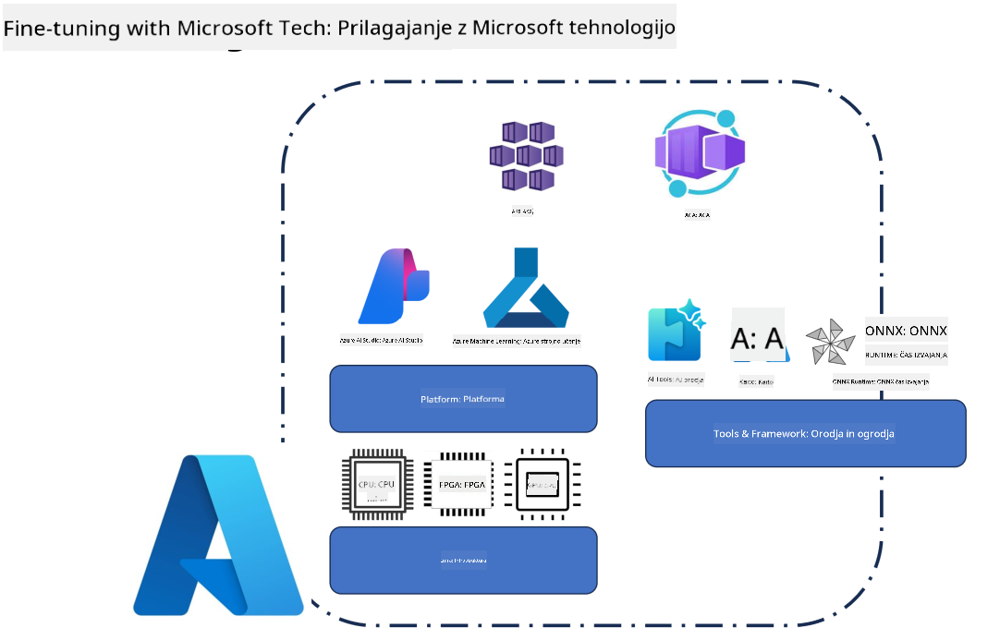

<!--
CO_OP_TRANSLATOR_METADATA:
{
  "original_hash": "cb5648935f63edc17e95ce38f23adc32",
  "translation_date": "2025-07-17T08:31:12+00:00",
  "source_file": "md/03.FineTuning/FineTuning_Scenarios.md",
  "language_code": "sl"
}
-->
## Scenariji za fino nastavljanje

**Platforma** Vključuje različne tehnologije, kot so Azure AI Foundry, Azure Machine Learning, AI Tools, Kaito in ONNX Runtime.

**Infrastruktura** Vključuje CPU in FPGA, ki sta ključna za proces fine nastavljanja. Pokažem vam ikone za vsako od teh tehnologij.

**Orodja in ogrodja** Vključuje ONNX Runtime in ONNX Runtime. Pokažem vam ikone za vsako od teh tehnologij.  
[Vstavi ikone za ONNX Runtime in ONNX Runtime]

Proces fine nastavljanja z Microsoftovimi tehnologijami vključuje različne komponente in orodja. Z razumevanjem in uporabo teh tehnologij lahko učinkovito prilagodimo naše aplikacije in ustvarimo boljše rešitve.

## Model kot storitev

Fino nastavite model z uporabo gostovanega fine nastavljanja, brez potrebe po ustvarjanju in upravljanju računalniških virov.

Brezstrežni način fine nastavljanja je na voljo za modele Phi-3-mini in Phi-3-medium, kar razvijalcem omogoča hitro in enostavno prilagajanje modelov za oblačne in robne scenarije, brez skrbi glede računalniških virov. Prav tako smo napovedali, da je model Phi-3-small zdaj na voljo prek naše ponudbe Models-as-a-Service, kar razvijalcem omogoča hiter in enostaven začetek z razvojem AI brez upravljanja osnovne infrastrukture.

## Model kot platforma

Uporabniki upravljajo svoje računalniške vire, da lahko fino nastavijo svoje modele.

[Primer fine nastavljanja](https://github.com/Azure/azureml-examples/blob/main/sdk/python/foundation-models/system/finetune/chat-completion/chat-completion.ipynb)

## Scenariji fine nastavljanja

| | | | | | | |
|-|-|-|-|-|-|-|
|Scenarij|LoRA|QLoRA|PEFT|DeepSpeed|ZeRO|DORA|
|Prilagajanje predhodno usposobljenih LLM-jev za specifične naloge ali domene|Da|Da|Da|Da|Da|Da|
|Fino nastavljanje za naloge NLP, kot so klasifikacija besedila, prepoznavanje imenovanih entitet in strojno prevajanje|Da|Da|Da|Da|Da|Da|
|Fino nastavljanje za naloge vprašanj in odgovorov (QA)|Da|Da|Da|Da|Da|Da|
|Fino nastavljanje za generiranje odgovorov, podobnih človeškim, v klepetalnikih|Da|Da|Da|Da|Da|Da|
|Fino nastavljanje za ustvarjanje glasbe, umetnosti ali drugih oblik ustvarjalnosti|Da|Da|Da|Da|Da|Da|
|Zmanjševanje računalniških in finančnih stroškov|Da|Da|Ne|Da|Da|Ne|
|Zmanjševanje porabe pomnilnika|Ne|Da|Ne|Da|Da|Da|
|Uporaba manjšega števila parametrov za učinkovito fino nastavljanje|Ne|Da|Da|Ne|Ne|Da|
|Pomnilniško učinkovita oblika podatkovnega paralelizma, ki omogoča dostop do skupnega GPU pomnilnika vseh razpoložljivih GPU naprav|Ne|Ne|Ne|Da|Da|Da|

## Primeri zmogljivosti fine nastavljanja

**Omejitev odgovornosti**:  
Ta dokument je bil preveden z uporabo AI prevajalske storitve [Co-op Translator](https://github.com/Azure/co-op-translator). Čeprav si prizadevamo za natančnost, vas opozarjamo, da avtomatizirani prevodi lahko vsebujejo napake ali netočnosti. Izvirni dokument v njegovem izvirnem jeziku velja za avtoritativni vir. Za ključne informacije priporočamo strokovni človeški prevod. Nismo odgovorni za morebitna nesporazume ali napačne interpretacije, ki izhajajo iz uporabe tega prevoda.