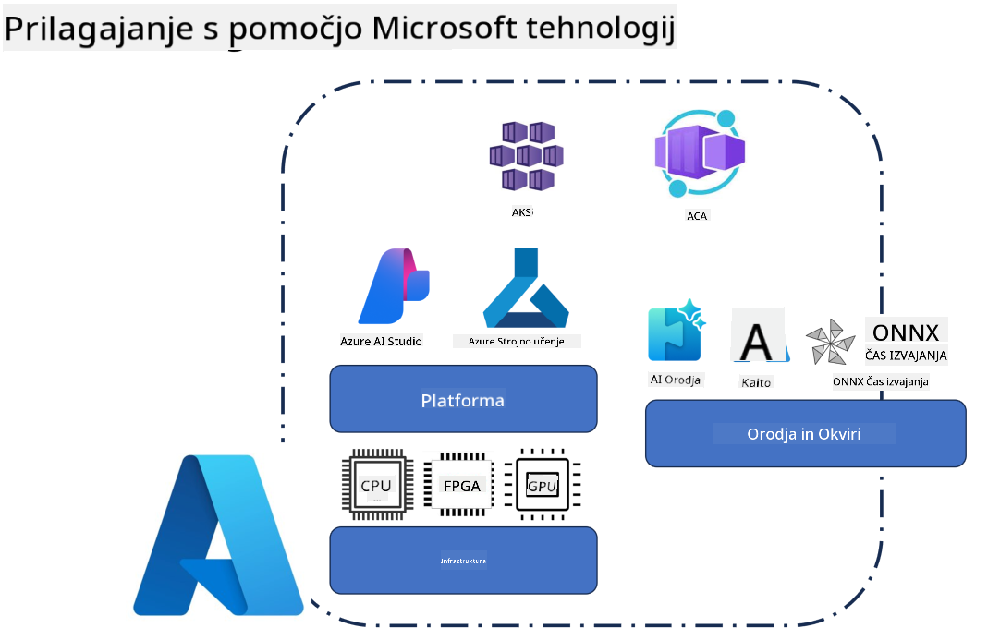
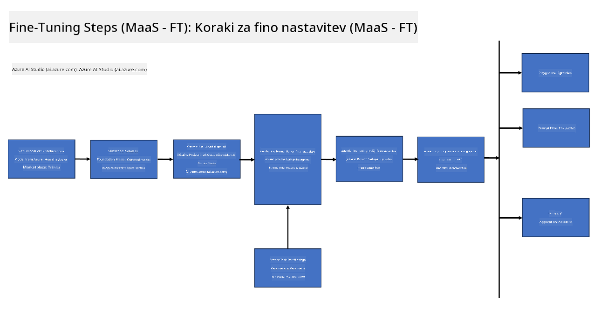
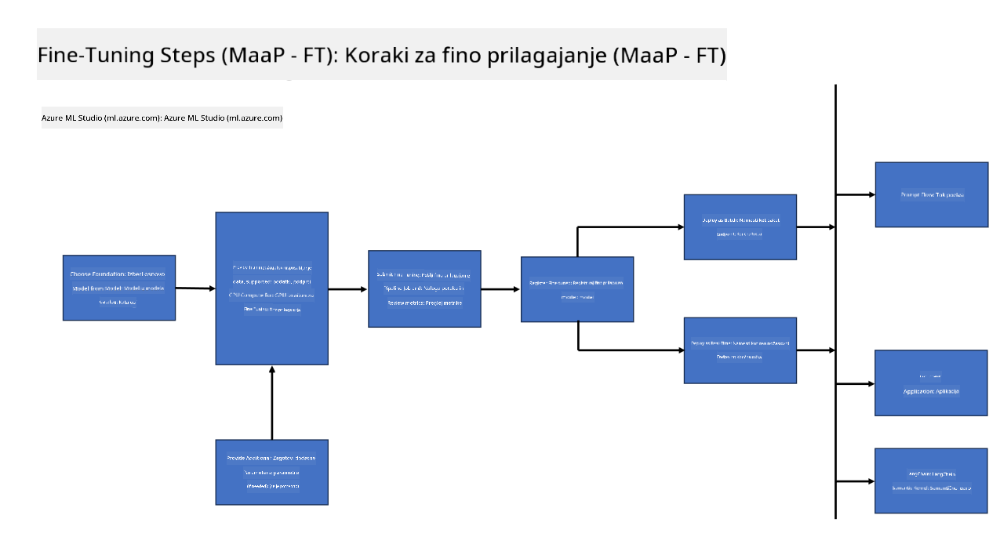
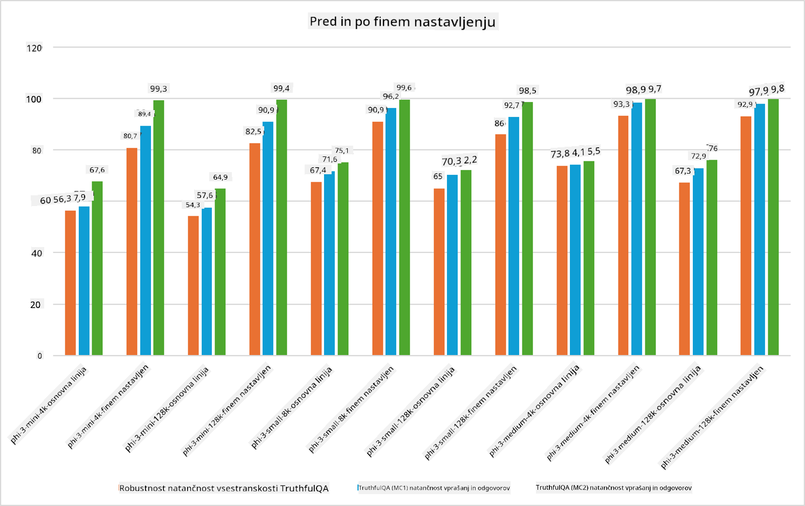

<!--
CO_OP_TRANSLATOR_METADATA:
{
  "original_hash": "cb5648935f63edc17e95ce38f23adc32",
  "translation_date": "2025-05-09T21:58:25+00:00",
  "source_file": "md/03.FineTuning/FineTuning_Scenarios.md",
  "language_code": "sl"
}
-->
## Fine Tuning Scenarios

**Platform** Ya vključuje različne tehnologije, kot so Azure AI Foundry, Azure Machine Learning, AI Tools, Kaito in ONNX Runtime.

**Infrastruktura** Vključuje CPU in FPGA, ki sta ključna za postopek fine-tuninga. Naj vam pokažem ikone za vsako od teh tehnologij.

**Orodja in Okviri** Vključuje ONNX Runtime in ONNX Runtime. Naj vam pokažem ikone za vsako od teh tehnologij.  
[Vstavi ikone za ONNX Runtime in ONNX Runtime]

Postopek fine-tuninga z Microsoft tehnologijami vključuje različne komponente in orodja. Z razumevanjem in uporabo teh tehnologij lahko učinkovito prilagodimo naše aplikacije in ustvarimo boljše rešitve.

## Model kot storitev

Prilagodite model z uporabo gostovanega fine-tuninga, brez potrebe po ustvarjanju in upravljanju računalniških virov.

Brezstrežni fine-tuning je na voljo za modele Phi-3-mini in Phi-3-medium, kar razvijalcem omogoča hitro in enostavno prilagajanje modelov za oblačne in edge scenarije, brez potrebe po organizaciji računalniških virov. Prav tako smo napovedali, da je Phi-3-small zdaj na voljo preko naše ponudbe Models-as-a-Service, tako da lahko razvijalci hitro in preprosto začnejo z razvojem AI brez upravljanja osnovne infrastrukture.

## Model kot platforma

Uporabniki upravljajo svoje računalniške vire, da prilagodijo svoje modele.

[Fine Tuning Sample](https://github.com/Azure/azureml-examples/blob/main/sdk/python/foundation-models/system/finetune/chat-completion/chat-completion.ipynb)

## Fine Tuning Scenarios

| | | | | | | |
|-|-|-|-|-|-|-|
|Scenarij|LoRA|QLoRA|PEFT|DeepSpeed|ZeRO|DORA|
|Prilagajanje predhodno usposobljenih LLM za specifične naloge ali domene|Da|Da|Da|Da|Da|Da|
|Fine-tuning za NLP naloge, kot so klasifikacija besedila, prepoznavanje imenovanih entitet in strojno prevajanje|Da|Da|Da|Da|Da|Da|
|Fine-tuning za QA naloge|Da|Da|Da|Da|Da|Da|
|Fine-tuning za generiranje odzivov, ki so podobni človeškim, v klepetalnikih|Da|Da|Da|Da|Da|Da|
|Fine-tuning za ustvarjanje glasbe, umetnosti ali drugih oblik ustvarjalnosti|Da|Da|Da|Da|Da|Da|
|Zmanjševanje računalniških in finančnih stroškov|Da|Da|Ne|Da|Da|Ne|
|Zmanjševanje porabe pomnilnika|Ne|Da|Ne|Da|Da|Da|
|Uporaba manj parametrov za učinkovito prilagajanje|Ne|Da|Da|Ne|Ne|Da|
|Pomnilniško učinkovita oblika podatkovnega paralelizma, ki omogoča dostop do skupnega GPU pomnilnika vseh razpoložljivih GPU naprav|Ne|Ne|Ne|Da|Da|Da|

## Primeri zmogljivosti fine-tuninga

**Opozorilo**:  
Ta dokument je bil preveden z uporabo AI prevajalske storitve [Co-op Translator](https://github.com/Azure/co-op-translator). Čeprav si prizadevamo za natančnost, vas prosimo, da upoštevate, da avtomatizirani prevodi lahko vsebujejo napake ali netočnosti. Izvirni dokument v njegovem izvirnem jeziku velja za avtoritativni vir. Za pomembne informacije priporočamo strokovni človeški prevod. Nismo odgovorni za morebitna nesporazumevanja ali napačne interpretacije, ki izhajajo iz uporabe tega prevoda.