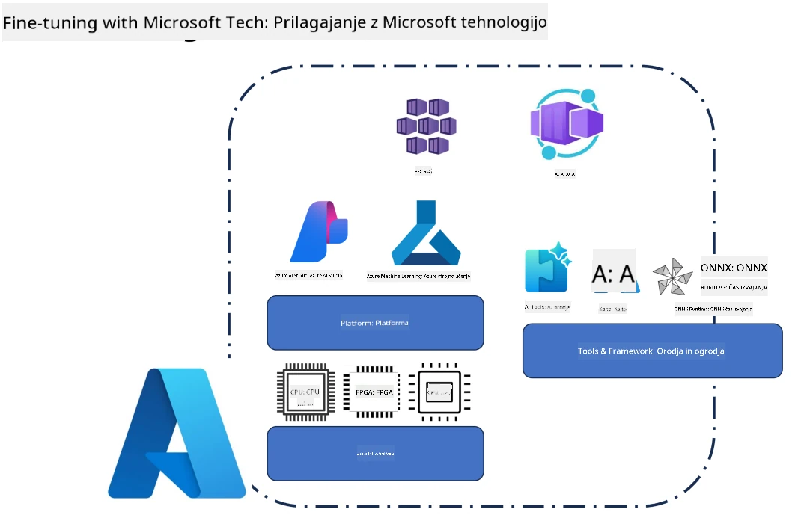
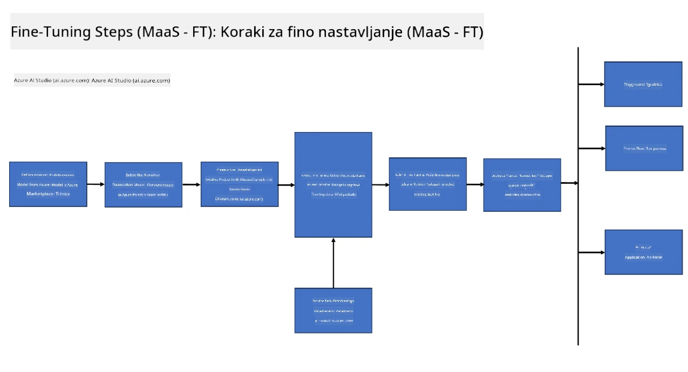
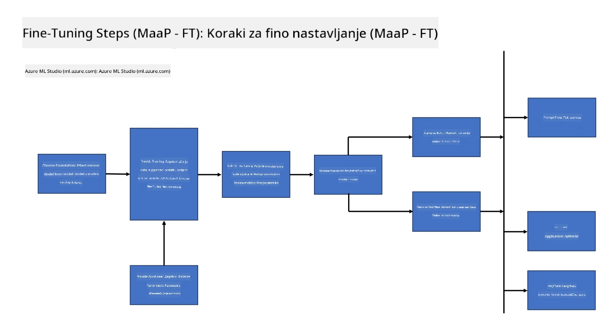
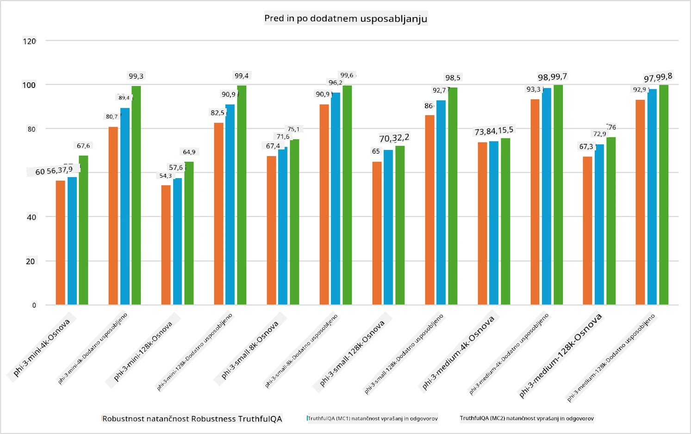

## Scenariji za fino nastavitev

Ta razdelek ponuja pregled scenarijev za fino nastavitev v okoljih Microsoft Foundry in Azure, vključno z modeli nameščanja, plastmi infrastrukture in pogosto uporabljenimi tehnikami optimizacije.

**Platforma**  
Vključuje upravljane storitve, kot so Microsoft Foundry (prej Azure AI Foundry) in Azure Machine Learning, ki zagotavljajo upravljanje modelov, orkestracijo, sledenje eksperimentom in poteke dela nameščanja.

**Infrastruktura**  
Fina nastavitev zahteva razširljive računske vire. V okoljih Azure to običajno vključuje virtualne računalnike na osnovi GPU in CPU vire za lažje obremenitve, skupaj z razširljivim shranjevanjem za nabor podatkov in kontrolne točke.

**Orodja in okvirji**  
Poteki dela pri fini nastavitvi pogosto temeljijo na okvirjih in knjižnicah za optimizacijo, kot so Hugging Face Transformers, DeepSpeed in PEFT (Parameter-Efficient Fine-Tuning).

Postopek fine nastavitve z Microsoft tehnologijami zajema platformne storitve, računsko infrastrukturo in učne okvirje. Z razumevanjem, kako ti elementi delujejo skupaj, lahko razvijalci učinkovito prilagodijo osnovne modele za specifične naloge in proizvodne scenarije.

## Model kot storitev

Nastavite model s pomočjo gostovane fine nastavitve, brez potrebe po ustvarjanju in upravljanju računalnih virov.

Brezstrežna fina nastavitev je zdaj na voljo za družine modelov Phi-3, Phi-3.5 in Phi-4, kar razvijalcem omogoča hitro in enostavno prilagoditev modelov za oblačne in robne scenarije, brez potrebe po ureditev računalnih virov.

## Model kot platforma

Uporabniki upravljajo lastne računske vire za fino nastavitev svojih modelov.

[Primer fine nastavitve](https://github.com/Azure/azureml-examples/blob/main/sdk/python/foundation-models/system/finetune/chat-completion/chat-completion.ipynb)

## Primerjava tehnik fine nastavitve

|Scenarij|LoRA|QLoRA|PEFT|DeepSpeed|ZeRO|DoRA|
|---|---|---|---|---|---|---|
|Prilagajanje pred-usposobljenih LLM modelov za specifične naloge ali domene|Da|Da|Da|Da|Da|Da|
|Fina nastavitev za naloge NLP, kot so klasifikacija besedil, prepoznavanje imenovanih entitet in strojno prevajanje|Da|Da|Da|Da|Da|Da|
|Fina nastavitev za naloge vprašanj in odgovorov|Da|Da|Da|Da|Da|Da|
|Fina nastavitev za generiranje človeku podobnih odgovorov v klepetalnikih|Da|Da|Da|Da|Da|Da|
|Fina nastavitev za ustvarjanje glasbe, umetnosti ali drugih oblik ustvarjalnosti|Da|Da|Da|Da|Da|Da|
|Zmanjševanje računalniških in finančnih stroškov|Da|Da|Da|Da|Da|Da|
|Zmanjševanje porabe pomnilnika|Da|Da|Da|Da|Da|Da|
|Uporaba manjšega števila parametrov za učinkovito fino nastavitev|Da|Da|Da|Ne|Ne|Da|
|Pomnilniško učinkovita oblika paralelizma podatkov, ki omogoča dostop do združenega GPU pomnilnika vseh razpoložljivih GPU naprav|Ne|Ne|Ne|Da|Da|Ne|

> [!NOTE]
> LoRA, QLoRA, PEFT in DoRA so metode parametrsko učinkovite fine nastavitve, medtem ko se DeepSpeed in ZeRO osredotočata na distribuirano učenje in optimizacijo pomnilnika.

## Primeri zmogljivosti fine nastavitve

---

<!-- CO-OP TRANSLATOR DISCLAIMER START -->
**Izjava o omejitvi odgovornosti**:
Ta dokument je bil preveden z uporabo AI prevajalske storitve [Co-op Translator](https://github.com/Azure/co-op-translator). Čeprav si prizadevamo za natančnost, vas prosimo, da upoštevate, da lahko avtomatizirani prevodi vsebujejo napake ali netočnosti. Izvirni dokument v njegovem izvirnem jeziku velja za avtoritativni vir. Za kritične informacije je priporočljivo uporabiti profesionalni človeški prevod. Za morebitne nesporazume ali napačne interpretacije, ki izhajajo iz uporabe tega prevoda, ne prevzemamo odgovornosti.
<!-- CO-OP TRANSLATOR DISCLAIMER END -->