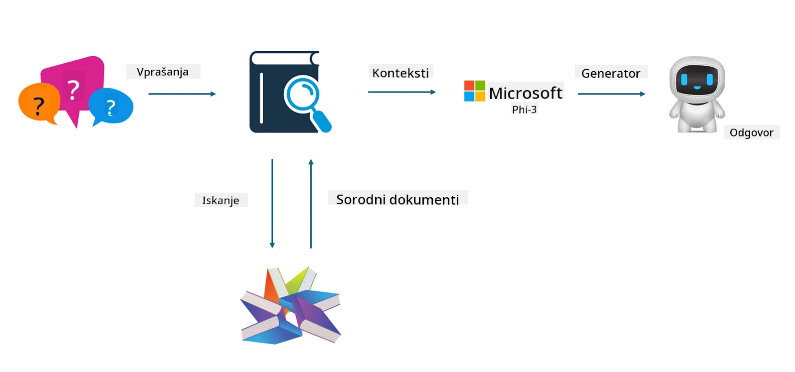

## Finetuning proti RAG

## Retrieval Augmented Generation

RAG je kombinacija iskanja podatkov in generiranja besedila. Strukture in nestrukturirane podatke podjetja shranjujemo v vektorski bazi podatkov. Pri iskanju relevantne vsebine najdemo ustrezne povzetke in vsebino, ki tvorijo kontekst, ter združimo zmožnost dopolnjevanja besedila modela LLM/SLM za generiranje vsebine.

## Proces RAG  

## Fine-tuning  
Fine-tuning temelji na izboljšavi določenega modela. Ni ga treba začeti z algoritmom modela, vendar je potrebno nenehno zbiranje podatkov. Če želite natančnejšo terminologijo in jezikovni izraz v industrijskih aplikacijah, je fine-tuning boljša izbira. Če pa se vaši podatki pogosto spreminjajo, je fine-tuning lahko zapleten.

## Kako izbrati  
Če naš odgovor zahteva vključitev zunanjih podatkov, je RAG najboljša izbira.

Če potrebujete stabilno in natančno industrijsko znanje, je fine-tuning dobra izbira. RAG daje prednost pridobivanju relevantne vsebine, vendar morda ne ujame vedno vseh specializiranih odtenkov.

Fine-tuning zahteva kakovosten nabor podatkov, in če gre za majhen obseg podatkov, ne bo prinesel velike razlike. RAG je bolj prilagodljiv.  
Fine-tuning je črna skrinjica, metafizika, in je težko razumeti notranji mehanizem. RAG pa omogoča lažje iskanje izvora podatkov, s čimer učinkovito zmanjšuje halucinacije ali napake v vsebini ter zagotavlja boljšo preglednost.

**Omejitev odgovornosti**:  
Ta dokument je bil preveden z uporabo AI prevajalske storitve [Co-op Translator](https://github.com/Azure/co-op-translator). Čeprav si prizadevamo za natančnost, vas opozarjamo, da avtomatizirani prevodi lahko vsebujejo napake ali netočnosti. Izvirni dokument v njegovem izvirnem jeziku velja za avtoritativni vir. Za ključne informacije priporočamo strokovni človeški prevod. Za morebitna nesporazume ali napačne interpretacije, ki izhajajo iz uporabe tega prevoda, ne odgovarjamo.