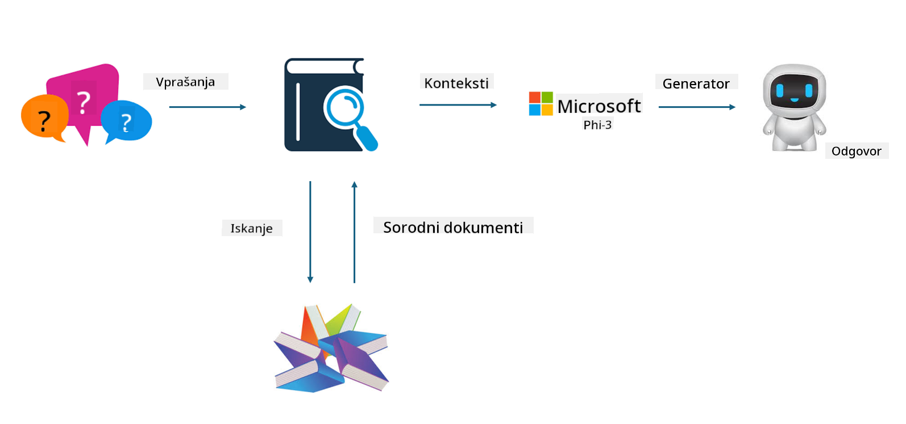

<!--
CO_OP_TRANSLATOR_METADATA:
{
  "original_hash": "e4e010400c2918557b36bb932a14004c",
  "translation_date": "2025-05-09T22:17:44+00:00",
  "source_file": "md/03.FineTuning/FineTuning_vs_RAG.md",
  "language_code": "sl"
}
-->
## Finetuning vs RAG

## Retrieval Augmented Generation

RAG je kombinacija iskanja podatkov in generiranja besedila. Strukturirani in nestrukturirani podatki podjetja so shranjeni v vektorski bazi podatkov. Pri iskanju relevantne vsebine se najde ustrezno povzetek in vsebina, ki tvorita kontekst, nato pa se združi z zmogljivostjo dopolnjevanja besedila LLM/SLM za generiranje vsebine.

## RAG Proces

## Fine-tuning
Fine-tuning temelji na izboljšavi določenega modela. Ni ga treba začeti pri algoritmu modela, vendar je potrebno nenehno zbiranje podatkov. Če želite natančnejšo terminologijo in jezikovni izraz v industrijskih aplikacijah, je fine-tuning boljša izbira. Če pa se vaši podatki pogosto spreminjajo, je fine-tuning lahko zapleten.

## Kako izbrati
Če naš odgovor zahteva vključitev zunanjih podatkov, je RAG najboljša izbira.

Če potrebujete stabilno in natančno industrijsko znanje, je fine-tuning dobra izbira. RAG daje prednost pridobivanju relevantne vsebine, vendar morda ne ujame vedno vseh specializiranih odtenkov.

Fine-tuning zahteva kakovosten nabor podatkov, in če gre za manjši obseg podatkov, to ne bo imelo velikega vpliva. RAG je bolj prilagodljiv.  
Fine-tuning je črna skrinjica, nekakšna metafizika, in je težko razumeti notranji mehanizem. RAG pa omogoča lažje iskanje vira podatkov, s čimer se učinkovito zmanjša pojav halucinacij ali napak v vsebini ter zagotovi boljša preglednost.

**Omejitev odgovornosti**:  
Ta dokument je bil preveden z uporabo storitve za prevajanje z umetno inteligenco [Co-op Translator](https://github.com/Azure/co-op-translator). Čeprav si prizadevamo za natančnost, vas opozarjamo, da avtomatizirani prevodi lahko vsebujejo napake ali netočnosti. Izvirni dokument v njegovem izvirnem jeziku velja za avtoritativni vir. Za kritične informacije priporočamo strokovni človeški prevod. Nismo odgovorni za morebitna nesporazumevanja ali napačne interpretacije, ki izhajajo iz uporabe tega prevoda.