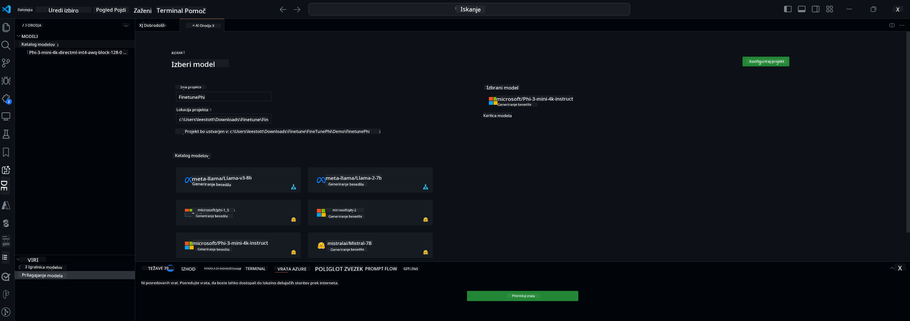

<!--
CO_OP_TRANSLATOR_METADATA:
{
  "original_hash": "c2bc0950f44919ac75a88c1a871680c2",
  "translation_date": "2025-07-17T09:23:36+00:00",
  "source_file": "md/03.FineTuning/Finetuning_VSCodeaitoolkit.md",
  "language_code": "sl"
}
-->
## Dobrodošli v AI Toolkit za VS Code

[AI Toolkit za VS Code](https://github.com/microsoft/vscode-ai-toolkit/tree/main) združuje različne modele iz Azure AI Studio kataloga in drugih katalogov, kot je Hugging Face. Orodje poenostavi običajne razvojne naloge za izdelavo AI aplikacij z generativnimi AI orodji in modeli preko:
- Začetek z iskanjem modelov in igralnim poljem.
- Prilagajanje modelov in sklepanje z uporabo lokalnih računalniških virov.
- Oddaljeno prilagajanje in sklepanje z uporabo Azure virov.

[Namestite AI Toolkit za VSCode](https://marketplace.visualstudio.com/items?itemName=ms-windows-ai-studio.windows-ai-studio)



**[Private Preview]** Enostavno zaganjanje Azure Container Apps za izvajanje prilagajanja modelov in sklepanje v oblaku.

Zdaj pa se lotimo razvoja vaše AI aplikacije:

- [Dobrodošli v AI Toolkit za VS Code](../../../../md/03.FineTuning)
- [Lokalni razvoj](../../../../md/03.FineTuning)
  - [Priprave](../../../../md/03.FineTuning)
  - [Aktivacija Conde](../../../../md/03.FineTuning)
  - [Samo prilagajanje osnovnega modela](../../../../md/03.FineTuning)
  - [Prilagajanje modela in sklepanje](../../../../md/03.FineTuning)
  - [Prilagajanje modela](../../../../md/03.FineTuning)
  - [Microsoft Olive](../../../../md/03.FineTuning)
  - [Primeri in viri za prilagajanje](../../../../md/03.FineTuning)
- [**\[Private Preview\]** Oddaljeni razvoj](../../../../md/03.FineTuning)
  - [Pogoji](../../../../md/03.FineTuning)
  - [Nastavitev oddaljenega razvojnega projekta](../../../../md/03.FineTuning)
  - [Provision Azure virov](../../../../md/03.FineTuning)
  - [\[Neobvezno\] Dodajanje Huggingface žetona v skrivnost Azure Container App](../../../../md/03.FineTuning)
  - [Zagon prilagajanja](../../../../md/03.FineTuning)
  - [Provision končne točke za sklepanje](../../../../md/03.FineTuning)
  - [Namestitev končne točke za sklepanje](../../../../md/03.FineTuning)
  - [Napredna uporaba](../../../../md/03.FineTuning)

## Lokalni razvoj
### Priprave

1. Prepričajte se, da je na gostitelju nameščen NVIDIA gonilnik.  
2. Zaženite `huggingface-cli login`, če uporabljate HF za delo z nabori podatkov.  
3. Razlage nastavitev ključa `Olive` za vse, kar vpliva na uporabo pomnilnika.

### Aktivacija Conde
Ker uporabljamo WSL okolje, ki je deljeno, morate ročno aktivirati conda okolje. Po tem koraku lahko zaženete prilagajanje ali sklepanje.

```bash
conda activate [conda-env-name] 
```

### Samo prilagajanje osnovnega modela
Če želite samo preizkusiti osnovni model brez prilagajanja, lahko po aktivaciji conde zaženete naslednji ukaz.

```bash
cd inference

# Web browser interface allows to adjust a few parameters like max new token length, temperature and so on.
# User has to manually open the link (e.g. http://0.0.0.0:7860) in a browser after gradio initiates the connections.
python gradio_chat.py --baseonly
```

### Prilagajanje modela in sklepanje

Ko je delovno okolje odprto v razvojni vsebniku, odprite terminal (privzeta pot je koren projekta) in zaženite spodnji ukaz za prilagoditev LLM na izbranem naboru podatkov.

```bash
python finetuning/invoke_olive.py 
```

Kontrolne točke in končni model bodo shranjeni v mapi `models`.

Nato zaženite sklepanje z prilagojenim modelom preko klepetov v `konzoli`, `spletni brskalnik` ali `prompt flow`.

```bash
cd inference

# Console interface.
python console_chat.py

# Web browser interface allows to adjust a few parameters like max new token length, temperature and so on.
# User has to manually open the link (e.g. http://127.0.0.1:7860) in a browser after gradio initiates the connections.
python gradio_chat.py
```

Za uporabo `prompt flow` v VS Code si oglejte ta [Hitri začetek](https://microsoft.github.io/promptflow/how-to-guides/quick-start.html).

### Prilagajanje modela

Nato prenesite naslednji model glede na razpoložljivost GPU na vaši napravi.

Za začetek lokalne seje prilagajanja z uporabo QLoRA izberite model, ki ga želite prilagoditi iz našega kataloga.  
| Platforma(e) | GPU na voljo | Ime modela | Velikost (GB) |
|---------|---------|--------|--------|
| Windows | Da | Phi-3-mini-4k-**directml**-int4-awq-block-128-onnx | 2.13GB |
| Linux | Da | Phi-3-mini-4k-**cuda**-int4-onnx | 2.30GB |
| Windows<br>Linux | Ne | Phi-3-mini-4k-**cpu**-int4-rtn-block-32-acc-level-4-onnx | 2.72GB |

**_Opomba_** Za prenos modelov ne potrebujete Azure računa.

Model Phi3-mini (int4) je velik približno 2GB-3GB. Glede na hitrost vaše povezave lahko prenos traja nekaj minut.

Začnite z izbiro imena in lokacije projekta.  
Nato izberite model iz kataloga. Pozvani boste k prenosu predloge projekta. Nato lahko kliknete "Configure Project" za prilagoditev različnih nastavitev.

### Microsoft Olive

Uporabljamo [Olive](https://microsoft.github.io/Olive/why-olive.html) za izvajanje QLoRA prilagajanja na PyTorch modelu iz našega kataloga. Vse nastavitve so privzeto nastavljene za optimizirano lokalno izvajanje prilagajanja z učinkovito uporabo pomnilnika, vendar jih lahko prilagodite glede na vaš primer.

### Primeri in viri za prilagajanje

- [Vodnik za začetek prilagajanja](https://learn.microsoft.com/windows/ai/toolkit/toolkit-fine-tune)  
- [Prilagajanje z uporabo HuggingFace nabora podatkov](https://github.com/microsoft/vscode-ai-toolkit/blob/main/archive/walkthrough-hf-dataset.md)  
- [Prilagajanje z enostavnim naborom podatkov](https://github.com/microsoft/vscode-ai-toolkit/blob/main/archive/walkthrough-simple-dataset.md)  

## **[Private Preview]** Oddaljeni razvoj

### Pogoji

1. Za izvajanje prilagajanja modela v vašem oddaljenem Azure Container App okolju poskrbite, da ima vaš naročniški račun dovolj GPU zmogljivosti. Oddajte [zahtevek za podporo](https://azure.microsoft.com/support/create-ticket/), da pridobite potrebno zmogljivost za vašo aplikacijo. [Več informacij o GPU zmogljivosti](https://learn.microsoft.com/azure/container-apps/workload-profiles-overview)  
2. Če uporabljate zasebni nabor podatkov na HuggingFace, poskrbite, da imate [HuggingFace račun](https://huggingface.co/?WT.mc_id=aiml-137032-kinfeylo) in [ustvarite dostopni žeton](https://huggingface.co/docs/hub/security-tokens?WT.mc_id=aiml-137032-kinfeylo)  
3. Omogočite funkcijo Remote Fine-tuning and Inference v AI Toolkit za VS Code  
   1. Odprite nastavitve VS Code preko *File -> Preferences -> Settings*.  
   2. Pojdite na *Extensions* in izberite *AI Toolkit*.  
   3. Izberite možnost *"Enable Remote Fine-tuning And Inference"*.  
   4. Ponovno zaženite VS Code, da sprememba začne veljati.

- [Oddaljeno prilagajanje](https://github.com/microsoft/vscode-ai-toolkit/blob/main/archive/remote-finetuning.md)

### Nastavitev oddaljenega razvojnega projekta
1. Zaženite ukazno paleto in izberite `AI Toolkit: Focus on Resource View`.  
2. Pojdite na *Model Fine-tuning* za dostop do kataloga modelov. Dodelite ime projektu in izberite lokacijo na vašem računalniku. Nato kliknite gumb *"Configure Project"*.  
3. Konfiguracija projekta  
    1. Ne omogočajte možnosti *"Fine-tune locally"*.  
    2. Prikažejo se nastavitve Olive s privzetimi vrednostmi. Prilagodite in izpolnite te nastavitve po potrebi.  
    3. Nadaljujte z *Generate Project*. Ta korak uporablja WSL in vzpostavi novo Conda okolje, pripravljeno za prihodnje posodobitve, ki vključujejo Dev Containers.  
4. Kliknite *"Relaunch Window In Workspace"*, da odprete vaš oddaljeni razvojni projekt.

> **Opomba:** Projekt trenutno deluje bodisi lokalno bodisi oddaljeno znotraj AI Toolkit za VS Code. Če med ustvarjanjem projekta izberete *"Fine-tune locally"*, bo deloval izključno v WSL brez možnosti oddaljenega razvoja. Če pa ne omogočite *"Fine-tune locally"*, bo projekt omejen na oddaljeno Azure Container App okolje.

### Provision Azure virov
Za začetek morate zagotoviti Azure vire za oddaljeno prilagajanje. To storite z ukazom `AI Toolkit: Provision Azure Container Apps job for fine-tuning` v ukazni paleti.

Napredek provisioniranja spremljajte preko povezave, prikazane v izhodnem kanalu.

### [Neobvezno] Dodajanje Huggingface žetona v skrivnost Azure Container App
Če uporabljate zasebni HuggingFace nabor podatkov, nastavite vaš HuggingFace žeton kot okoljsko spremenljivko, da se izognete ročnemu prijavljanju na Hugging Face Hub.  
To lahko storite z ukazom `AI Toolkit: Add Azure Container Apps Job secret for fine-tuning`. Pri tem lahko kot ime skrivnosti uporabite [`HF_TOKEN`](https://huggingface.co/docs/huggingface_hub/package_reference/environment_variables#hftoken) in kot vrednost skrivnosti vaš HuggingFace žeton.

### Zagon prilagajanja
Za začetek oddaljenega prilagajanja zaženite ukaz `AI Toolkit: Run fine-tuning`.

Za ogled sistemskih in konzolnih dnevnikov lahko obiščete Azure portal preko povezave v izhodnem panelu (več korakov na [Ogled in poizvedovanje dnevnikov na Azure](https://aka.ms/ai-toolkit/remote-provision#view-and-query-logs-on-azure)).  
Lahko pa si konzolne dnevnike ogledate neposredno v izhodnem panelu VSCode z ukazom `AI Toolkit: Show the running fine-tuning job streaming logs`.  
> **Opomba:** Naloga je lahko v čakalni vrsti zaradi pomanjkanja virov. Če dnevnik ni prikazan, zaženite ukaz `AI Toolkit: Show the running fine-tuning job streaming logs`, počakajte nekaj časa in ukaz ponovite za ponovno povezavo na tok dnevnikov.

Med tem postopkom bo za prilagajanje uporabljen QLoRA, ki bo ustvaril LoRA adapterje za model, ki se uporabljajo med sklepanjem.  
Rezultati prilagajanja bodo shranjeni v Azure Files.

### Provision končne točke za sklepanje
Ko so adapterji usposobljeni v oddaljenem okolju, uporabite preprosto Gradio aplikacijo za interakcijo z modelom.  
Podobno kot pri prilagajanju morate za oddaljeno sklepanje nastaviti Azure vire z ukazom `AI Toolkit: Provision Azure Container Apps for inference` v ukazni paleti.

Privzeto naj bi naročnina in skupina virov za sklepanje ustrezali tistim, ki se uporabljajo za prilagajanje. Sklepanje bo uporabljalo isto Azure Container App okolje in dostopalo do modela ter adapterja, shranjenih v Azure Files, ki so bili ustvarjeni med prilagajanjem.

### Namestitev končne točke za sklepanje
Če želite spremeniti kodo za sklepanje ali ponovno naložiti model za sklepanje, zaženite ukaz `AI Toolkit: Deploy for inference`. Ta ukaz bo sinhroniziral vašo najnovejšo kodo z Azure Container App in ponovno zagnal repliko.

Ko je namestitev uspešno zaključena, lahko do API-ja za sklepanje dostopate s klikom na gumb "*Go to Inference Endpoint*" v obvestilu VSCode.  
Spletni API endpoint najdete tudi pod `ACA_APP_ENDPOINT` v `./infra/inference.config.json` in v izhodnem panelu. Zdaj ste pripravljeni za ocenjevanje modela preko te končne točke.

### Napredna uporaba
Za več informacij o oddaljenem razvoju z AI Toolkit si oglejte dokumentacijo [Oddaljeno prilagajanje modelov](https://aka.ms/ai-toolkit/remote-provision) in [Sklepanje s prilagojenim modelom](https://aka.ms/ai-toolkit/remote-inference).

**Omejitev odgovornosti**:  
Ta dokument je bil preveden z uporabo AI prevajalske storitve [Co-op Translator](https://github.com/Azure/co-op-translator). Čeprav si prizadevamo za natančnost, vas opozarjamo, da avtomatizirani prevodi lahko vsebujejo napake ali netočnosti. Izvirni dokument v njegovem izvirnem jeziku velja za avtoritativni vir. Za ključne informacije priporočamo strokovni človeški prevod. Za morebitna nesporazume ali napačne interpretacije, ki izhajajo iz uporabe tega prevoda, ne odgovarjamo.