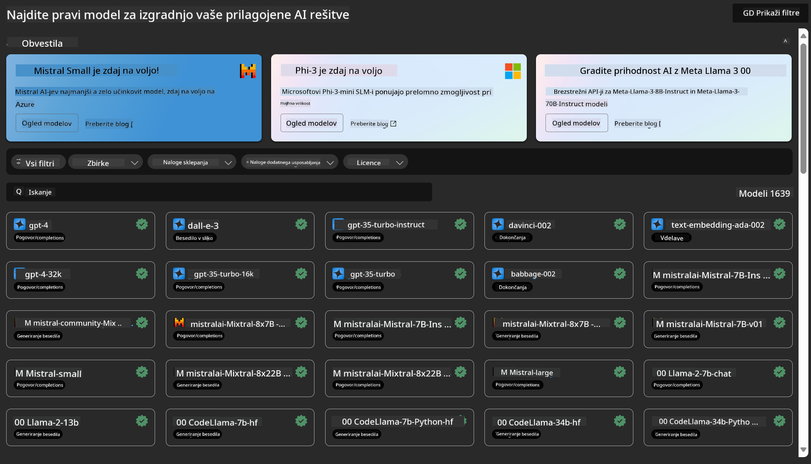
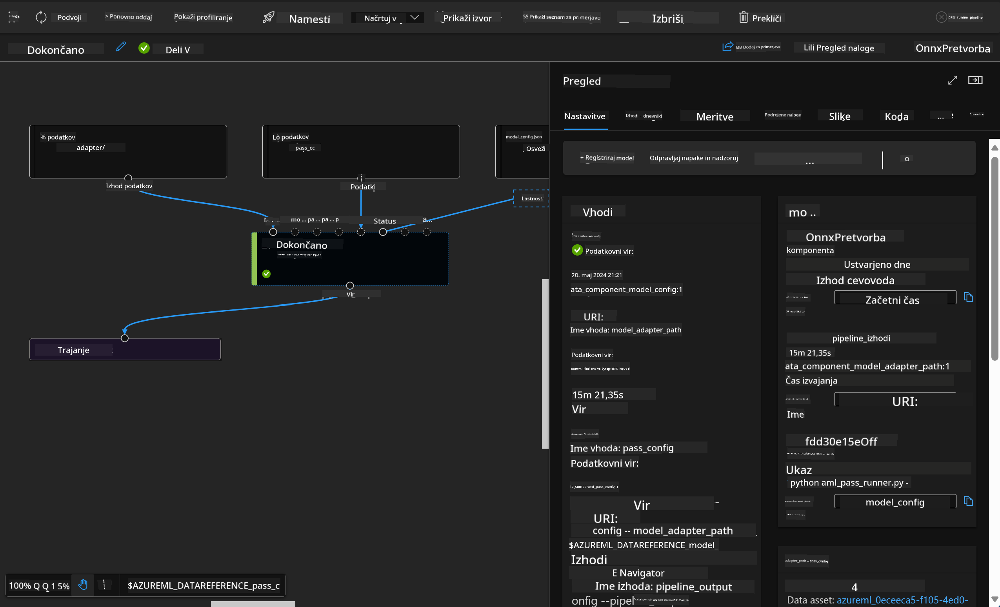

<!--
CO_OP_TRANSLATOR_METADATA:
{
  "original_hash": "7fe541373802e33568e94e13226d463c",
  "translation_date": "2025-05-09T22:24:51+00:00",
  "source_file": "md/03.FineTuning/Introduce_AzureML.md",
  "language_code": "sl"
}
-->
# **Predstavitev Azure Machine Learning Service**

[Azure Machine Learning](https://ml.azure.com?WT.mc_id=aiml-138114-kinfeylo) je oblačna storitev za pospeševanje in upravljanje življenjskega cikla projektov strojnega učenja (ML).

ML strokovnjaki, podatkovni znanstveniki in inženirji jo lahko uporabljajo v svojem vsakodnevnem delu za:

- Učenje in uvajanje modelov.
- Upravljanje operacij strojnega učenja (MLOps).
- V Azure Machine Learning lahko ustvarite model ali uporabite model, izdelan na odprtokodni platformi, kot so PyTorch, TensorFlow ali scikit-learn.
- Orodja MLOps vam pomagajo spremljati, ponovno usposobiti in ponovno uvajati modele.

## Komu je namenjen Azure Machine Learning?

**Podatkovni znanstveniki in ML inženirji**

Uporabljajo orodja za pospešitev in avtomatizacijo svojih vsakodnevnih opravil.  
Azure ML ponuja funkcije za pravičnost, razložljivost, sledenje in revizijsko sledljivost.

**Razvijalci aplikacij:**  
Lahko brez težav vključujejo modele v aplikacije ali storitve.

**Platformni razvijalci**

Imajo dostop do robustnega nabora orodij, podprtih z zanesljivimi Azure Resource Manager API-ji.  
Ta orodja omogočajo izdelavo naprednih ML orodij.

**Podjetja**

Delajo v Microsoft Azure oblaku in imajo koristi od poznanih varnostnih mehanizmov ter nadzora dostopa na podlagi vlog.  
Nastavijo lahko projekte za nadzor dostopa do zaščitenih podatkov in specifičnih operacij.

## Produktivnost za vse člane ekipe

ML projekti pogosto zahtevajo ekipo z raznolikimi znanji za razvoj in vzdrževanje.

Azure ML ponuja orodja, ki omogočajo:  
- Sodelovanje z ekipo prek skupnih zvezkov, računske moči, strežniško neodvisne računske moči, podatkov in okolij.  
- Razvoj modelov s poudarkom na pravičnosti, razložljivosti, sledenju in revizijski skladnosti.  
- Hitro in enostavno uvajanje ML modelov v velikem obsegu ter učinkovito upravljanje in nadzor z MLOps.  
- Izvajanje strojno učenih delovnih obremenitev kjerkoli z vgrajenim upravljanjem, varnostjo in skladnostjo.

## Orodja združljiva na različnih platformah

Kdor koli v ML ekipi lahko uporablja svoja priljubljena orodja za opravljanje nalog.  
Ne glede na to, ali izvajate hitre eksperimente, nastavite hiperparametre, gradite pipeline ali upravljate inferenco, lahko uporabljate znane vmesnike, kot so:  
- Azure Machine Learning Studio  
- Python SDK (v2)  
- Azure CLI (v2)  
- Azure Resource Manager REST API-ji

Med izboljševanjem modelov in sodelovanjem skozi razvojni cikel lahko delite in najdete vire, sredstva in metrike v uporabniškem vmesniku Azure Machine Learning studia.

## **LLM/SLM v Azure ML**

Azure ML je dodal številne funkcije povezane z LLM/SLM, ki združujejo LLMOps in SLMOps za ustvarjanje generativne umetne inteligence na ravni celotnega podjetja.

### **Katalog modelov**

Podjetniški uporabniki lahko prek Model Catalog uvajajo različne modele glede na poslovne primere in nudijo storitve kot Model as Service, ki so dostopne razvijalcem ali uporabnikom.

Katalog modelov v Azure Machine Learning studiu je središče za odkrivanje in uporabo širokega nabora modelov, ki omogočajo gradnjo generativnih AI aplikacij. Katalog vključuje stotine modelov različnih ponudnikov, kot so Azure OpenAI service, Mistral, Meta, Cohere, Nvidia, Hugging Face, vključno z modeli, ki jih je usposobil Microsoft. Modeli ponudnikov, ki niso Microsoft, so označeni kot Non-Microsoft Products in so predmet pogojev, določenih v Microsoftovih pogojih za izdelke ter pogojev, priloženih modelu.

### **Pipeline za opravila**

Jedro ML pipeline je razdelitev celotne naloge strojnega učenja na večstopenjski delovni tok. Vsak korak je obvladljiva enota, ki jo je mogoče razvijati, optimizirati, konfigurirati in avtomatizirati ločeno. Koraki so povezani z jasno opredeljenimi vmesniki. Pipeline storitev Azure Machine Learning samodejno usklajuje vse odvisnosti med koraki pipeline.

Pri finem nastavljanju SLM / LLM lahko upravljamo podatke, učenje in generiranje prek Pipeline.

### **Prompt flow**

Prednosti uporabe Azure Machine Learning prompt flow  
Azure Machine Learning prompt flow ponuja številne koristi, ki uporabnikom pomagajo preiti od ideje do eksperimentiranja in končno do produkcijsko pripravljenih LLM aplikacij:

**Agilnost pri oblikovanju pozivov**

Interaktivno ustvarjanje: Azure Machine Learning prompt flow prikazuje vizualno strukturo toka, kar uporabnikom olajša razumevanje in navigacijo po projektih. Prav tako nudi izkušnjo kodiranja podobno zvezku za učinkovito razvoj in odpravljanje napak toka.  
Različice za nastavitev pozivov: uporabniki lahko ustvarijo in primerjajo več različic pozivov, kar omogoča iterativno izboljševanje.

Vrednotenje: Vgrajeni evalvacijski tokovi omogočajo ocenjevanje kakovosti in učinkovitosti pozivov in tokov.

Celoviti viri: Azure Machine Learning prompt flow vključuje knjižnico vgrajenih orodij, vzorcev in predlog, ki služijo kot izhodišče za razvoj, spodbujajo ustvarjalnost in pospešujejo proces.

**Podjetniška pripravljenost za LLM aplikacije**

Sodelovanje: Azure Machine Learning prompt flow podpira timsko sodelovanje, omogoča več uporabnikom skupno delo na projektih oblikovanja pozivov, izmenjavo znanja in upravljanje verzij.

Vse-v-enem platforma: Azure Machine Learning prompt flow poenostavi celoten proces oblikovanja pozivov, od razvoja in vrednotenja do uvajanja in spremljanja. Uporabniki lahko enostavno uvajajo svoje tokove kot Azure Machine Learning končne točke in spremljajo njihovo delovanje v realnem času, kar zagotavlja optimalno delovanje in stalno izboljševanje.

Rešitve za podjetniško pripravljenost Azure Machine Learning: Prompt flow izkorišča robustne rešitve Azure Machine Learning za podjetja, ki zagotavljajo varno, razširljivo in zanesljivo osnovo za razvoj, eksperimentiranje in uvajanje tokov.

Z Azure Machine Learning prompt flow lahko uporabniki izkoristijo agilnost pri oblikovanju pozivov, učinkovito sodelujejo in uporabljajo rešitve na podjetniški ravni za uspešen razvoj in uvajanje aplikacij na osnovi LLM.

S kombinacijo računske moči, podatkov in različnih komponent Azure ML lahko podjetniški razvijalci enostavno ustvarijo lastne umetne inteligence aplikacije.

**Omejitev odgovornosti**:  
Ta dokument je bil preveden z uporabo storitve za avtomatski prevod [Co-op Translator](https://github.com/Azure/co-op-translator). Čeprav si prizadevamo za natančnost, vas opozarjamo, da lahko avtomatski prevodi vsebujejo napake ali netočnosti. Izvirni dokument v izvorni jezik je treba upoštevati kot avtoritativni vir. Za pomembne informacije priporočamo strokovni človeški prevod. Za morebitne nesporazume ali napačne interpretacije, ki izhajajo iz uporabe tega prevoda, ne prevzemamo odgovornosti.