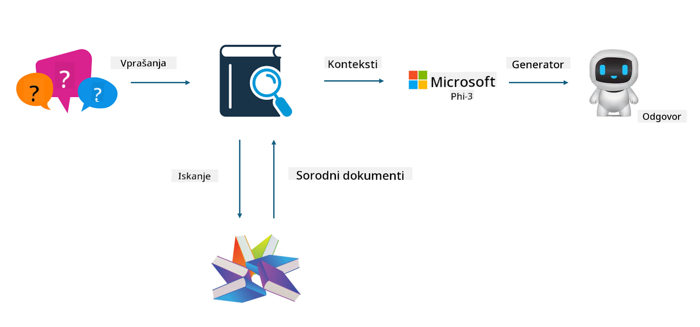
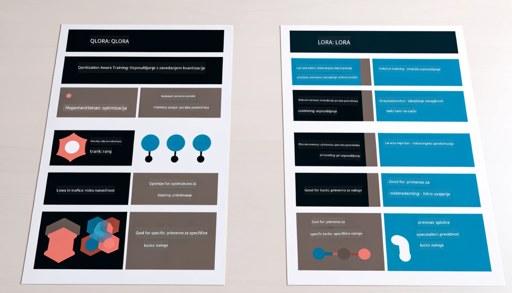

<!--
CO_OP_TRANSLATOR_METADATA:
{
  "original_hash": "743d7e9cb9c4e8ea642d77bee657a7fa",
  "translation_date": "2025-05-09T22:30:28+00:00",
  "source_file": "md/03.FineTuning/LetPhi3gotoIndustriy.md",
  "language_code": "sl"
}
-->
# **Dopusti Phi-3, da postane industrijski strokovnjak**

Da model Phi-3 uvedemo v industrijo, je treba modelu Phi-3 dodati industrijske poslovne podatke. Imamo dve različni možnosti, prva je RAG (Retrieval Augmented Generation), druga pa Fine Tuning.

## **RAG proti Fine-Tuning**

### **Retrieval Augmented Generation**

RAG pomeni pridobivanje podatkov + generiranje besedila. Strukturirani in nestrukturirani podatki podjetja so shranjeni v vektorski bazi podatkov. Pri iskanju relevantne vsebine se najde ustrezno povzetek in vsebina, ki tvorita kontekst, nato pa se združi zmožnost dopolnjevanja besedila LLM/SLM za generiranje vsebine.

### **Fine-tuning**

Fine-tuning temelji na izboljšavi določenega modela. Ni potrebno začeti z algoritmom modela, a podatki se morajo nenehno zbirati. Če želite natančnejšo terminologijo in jezikovni izraz v industrijskih aplikacijah, je fine-tuning boljša izbira. Če pa se vaši podatki pogosto spreminjajo, je fine-tuning lahko zapleten.

### **Kako izbrati**

1. Če naš odgovor zahteva vključitev zunanjih podatkov, je RAG najboljša izbira

2. Če potrebujete stabilno in natančno industrijsko znanje, je fine-tuning dobra izbira. RAG daje prednost pridobivanju relevantne vsebine, vendar morda ne zajame vedno vseh specializiranih odtenkov.

3. Fine-tuning zahteva kakovosten nabor podatkov, če gre le za majhen obseg podatkov, to ne bo prineslo velike razlike. RAG je bolj prilagodljiv.

4. Fine-tuning je črna skrinjica, metafizika, težko je razumeti notranji mehanizem. RAG pa olajša iskanje vira podatkov, s čimer učinkovito zmanjša halucinacije ali napake v vsebini in zagotavlja boljšo preglednost.

### **Scenariji**

1. Vertikalne industrije, ki zahtevajo specifično strokovno besedišče in izraze, ***Fine-tuning*** je najboljša izbira

2. QA sistem, ki vključuje sintezo različnih znanj, ***RAG*** je najboljša izbira

3. Kombinacija avtomatiziranega poslovnega toka ***RAG + Fine-tuning*** je najboljša izbira

## **Kako uporabljati RAG**

Vektorska baza podatkov je zbirka podatkov, shranjenih v matematični obliki. Vektorske baze podatkov olajšajo modelom strojnega učenja zapomnitev prejšnjih vhodov, kar omogoča uporabo strojnega učenja za podporo primerom, kot so iskanje, priporočila in generiranje besedila. Podatke je mogoče prepoznati na podlagi meril podobnosti, ne pa točnih ujemanj, kar računalniškim modelom omogoča razumevanje konteksta podatkov.

Vektorska baza podatkov je ključ do uresničitve RAG. Podatke lahko pretvorimo v vektorsko shrambo preko vektorskih modelov, kot so text-embedding-3, jina-ai-embedding itd.

Več o ustvarjanju RAG aplikacij si oglejte na [https://github.com/microsoft/Phi-3CookBook](https://github.com/microsoft/Phi-3CookBook?WT.mc_id=aiml-138114-kinfeylo)

## **Kako uporabljati Fine-tuning**

Pogosto uporabljeni algoritmi za Fine-tuning so Lora in QLora. Kako izbrati?
- [Več informacij v tem vzorčnem zvezku](../../../../code/04.Finetuning/Phi_3_Inference_Finetuning.ipynb)
- [Primer Python FineTuning vzorca](../../../../code/04.Finetuning/FineTrainingScript.py)

### **Lora in QLora**

LoRA (Low-Rank Adaptation) in QLoRA (Quantized Low-Rank Adaptation) sta tehniki za fine-tuning velikih jezikovnih modelov (LLM), ki uporabljata Parameter Efficient Fine Tuning (PEFT). PEFT tehnike so zasnovane za učinkovitejše treniranje modelov kot tradicionalne metode.  
LoRA je samostojna tehnika fine-tuninga, ki zmanjša porabo pomnilnika z uporabo nizkorangske aproksimacije na matriki posodobitev uteži. Omogoča hitro treniranje in ohranja zmogljivost blizu tradicionalnim metodam fine-tuninga.

QLoRA je razširjena različica LoRA, ki vključuje kvantizacijske tehnike za dodatno zmanjšanje porabe pomnilnika. QLoRA kvantizira natančnost utežnih parametrov v predhodno usposobljenem LLM na 4-bitno natančnost, kar je bolj učinkovito glede pomnilnika kot LoRA. Vendar je treniranje QLoRA približno 30 % počasnejše kot pri LoRA zaradi dodatnih korakov kvantizacije in dekvantizacije.

QLoRA uporablja LoRA kot dodatek za odpravo napak, ki jih uvaja kvantizacija. QLoRA omogoča fine-tuning ogromnih modelov z milijardami parametrov na razmeroma majhnih, široko dostopnih GPU-jih. Na primer, QLoRA lahko fine-tunira 70B parametrov model, ki sicer zahteva 36 GPU-jev, z le 2

**Omejitev odgovornosti**:  
Ta dokument je bil preveden z uporabo AI prevajalske storitve [Co-op Translator](https://github.com/Azure/co-op-translator). Čeprav si prizadevamo za natančnost, vas prosimo, da upoštevate, da avtomatizirani prevodi lahko vsebujejo napake ali netočnosti. Izvirni dokument v njegovem izvirnem jeziku velja za avtoritativni vir. Za pomembne informacije priporočamo strokovni človeški prevod. Za kakršne koli nesporazume ali napačne interpretacije, ki izhajajo iz uporabe tega prevoda, ne odgovarjamo.