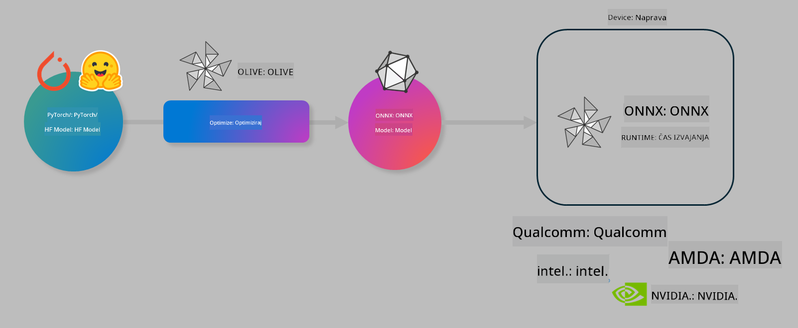

<!--
CO_OP_TRANSLATOR_METADATA:
{
  "original_hash": "6bbe47de3b974df7eea29dfeccf6032b",
  "translation_date": "2025-05-09T22:42:13+00:00",
  "source_file": "md/03.FineTuning/olive-lab/readme.md",
  "language_code": "sl"
}
-->
# Lab. Optimize AI models for on-device inference

## Introduction 

> [!IMPORTANT]
> Ta laboratorijska vaja zahteva **Nvidia A10 ali A100 GPU** z nameščenimi pripadajočimi gonilniki in CUDA orodji (verzija 12+).

> [!NOTE]
> To je **35-minutna** laboratorijska vaja, ki vam bo omogočila praktičen uvod v osnovne koncepte optimizacije modelov za izvajanje na napravah z uporabo OLIVE.

## Learning Objectives

Na koncu te vaje boste znali uporabiti OLIVE za:

- Kvantizacijo AI modela z metodo AWQ.
- Fino prilagajanje AI modela za specifično nalogo.
- Generiranje LoRA adapterjev (fino prilagojen model) za učinkovito izvajanje na napravah z ONNX Runtime.

### Kaj je Olive

Olive (*O*NNX *live*) je orodje za optimizacijo modelov z ukazno vrstico, ki omogoča pošiljanje modelov za ONNX runtime +++https://onnxruntime.ai+++ z visoko kakovostjo in zmogljivostjo.



Vhod v Olive je običajno PyTorch ali Hugging Face model, izhod pa optimiziran ONNX model, ki se izvaja na napravi (ciljna naprava) z ONNX runtime. Olive optimizira model za AI pospeševalnik ciljne naprave (NPU, GPU, CPU), ki ga zagotavlja proizvajalec strojne opreme, kot so Qualcomm, AMD, Nvidia ali Intel.

Olive izvaja *workflow*, kar je urejena zaporedna vrsta posameznih nalog optimizacije modela, imenovanih *passes* - primeri passes so: stiskanje modela, zajem grafa, kvantizacija, optimizacija grafa. Vsak pass ima niz parametrov, ki jih je mogoče nastaviti za dosego najboljših metrik, na primer natančnosti in zakasnitve, ki jih ocenjuje ustrezni evaluator. Olive uporablja strategijo iskanja, ki samodejno prilagaja vsak pass posamično ali skupino passov z algoritmom iskanja.

#### Prednosti Olive

- **Zmanjšanje frustracij in časa** zaradi ročnih poskusov in napak pri različnih tehnikah optimizacije grafa, stiskanja in kvantizacije. Določite svoje zahteve glede kakovosti in zmogljivosti, Olive pa bo samodejno našel najboljši model za vas.
- **Več kot 40 vgrajenih komponent za optimizacijo modelov**, ki zajemajo najnovejše tehnike kvantizacije, stiskanja, optimizacije grafa in fino nastavljanje.
- **Enostavna ukazna vrstica** za pogoste naloge optimizacije modelov. Na primer, olive quantize, olive auto-opt, olive finetune.
- Vgrajeno pakiranje in nameščanje modelov.
- Podpora za generiranje modelov za **Multi LoRA serviranje**.
- Sestavljanje workflowov z uporabo YAML/JSON za orkestracijo optimizacije in nameščanja modelov.
- Integracija s **Hugging Face** in **Azure AI**.
- Vgrajen mehanizem **predpomnjenja** za **znižanje stroškov**.

## Navodila za laboratorijsko vajo
> [!NOTE]
> Poskrbite, da ste pripravili svoj Azure AI Hub in projekt ter nastavili A100 računski vir, kot je opisano v Lab 1.

### Korak 0: Povežite se z vašim Azure AI Compute

Povezali se boste z Azure AI računalnikom preko oddaljene funkcije v **VS Code**.

1. Odprite namizno aplikacijo **VS Code**:
1. Odprite **ukazno paleto** s **Shift+Ctrl+P**
1. V ukazni paleti poiščite **AzureML - remote: Connect to compute instance in New Window**.
1. Sledite navodilom na zaslonu za povezavo z računalnikom. Izbrati boste morali svojo Azure naročnino, Resource Group, projekt in ime računalnika, ki ste ga nastavili v Lab 1.
1. Ko ste povezani z vašim Azure ML Compute vozliščem, bo to prikazano v **spodnjem levem kotu Visual Code** `><Azure ML: Compute Name`

### Korak 1: Klonirajte ta repozitorij

V VS Code lahko odprete nov terminal s **Ctrl+J** in klonirate ta repozitorij:

V terminalu boste videli poziv

```
azureuser@computername:~/cloudfiles/code$ 
```
Klonirajte rešitev

```bash
cd ~/localfiles
git clone https://github.com/microsoft/phi-3cookbook.git
```

### Korak 2: Odprite mapo v VS Code

Za odpiranje VS Code v ustrezni mapi zaženite naslednji ukaz v terminalu, ki bo odprl novo okno:

```bash
code phi-3cookbook/code/04.Finetuning/Olive-lab
```

Lahko pa mapo odprete tudi preko **File** > **Open Folder**.

### Korak 3: Odvisnosti

Odprite terminal v VS Code na vašem Azure AI računalniku (namig: **Ctrl+J**) in zaženite naslednje ukaze za namestitev odvisnosti:

```bash
conda create -n olive-ai python=3.11 -y
conda activate olive-ai
pip install -r requirements.txt
az extension remove -n azure-cli-ml
az extension add -n ml
```

> [!NOTE]
> Namestitev vseh odvisnosti bo trajala približno 5 minut.

V tej vaji boste prenašali modele v Azure AI Model katalog in iz njega. Za dostop do kataloga se morate prijaviti v Azure z:

```bash
az login
```

> [!NOTE]
> Med prijavo boste morali izbrati svojo naročnino. Poskrbite, da izberete naročnino, ki je dodeljena za to laboratorijsko vajo.

### Korak 4: Zaženite Olive ukaze

Odprite terminal v VS Code na vašem Azure AI računalniku (namig: **Ctrl+J**) in poskrbite, da je aktivirano conda okolje `olive-ai`:

```bash
conda activate olive-ai
```

Nato zaženite naslednje Olive ukaze v ukazni vrstici.

1. **Preverite podatke:** V tem primeru boste fino prilagodili model Phi-3.5-Mini, da bo specializiran za odgovarjanje na vprašanja povezana s potovanji. Spodnja koda prikaže prvih nekaj zapisov iz nabora podatkov, ki je v formatu JSON lines:

    ```bash
    head data/data_sample_travel.jsonl
    ```
1. **Kvantizirajte model:** Pred treniranjem modela ga najprej kvantizirajte z ukazom, ki uporablja tehniko imenovano Active Aware Quantization (AWQ) +++https://arxiv.org/abs/2306.00978+++. AWQ kvantizira uteži modela ob upoštevanju aktivacij, ki nastanejo med inferenco. To pomeni, da kvantizacijski postopek upošteva dejansko porazdelitev podatkov v aktivacijah, kar bolje ohranja natančnost modela v primerjavi s tradicionalnimi metodami kvantizacije uteži.

    ```bash
    olive quantize \
       --model_name_or_path microsoft/Phi-3.5-mini-instruct \
       --trust_remote_code \
       --algorithm awq \
       --output_path models/phi/awq \
       --log_level 1
    ```

    Postopek AWQ kvantizacije traja **približno 8 minut** in bo **zmanjšal velikost modela s približno 7.5 GB na 2.5 GB**.

    V tej vaji prikazujemo, kako vnesti modele iz Hugging Face (na primer: `microsoft/Phi-3.5-mini-instruct`). However, Olive also allows you to input models from the Azure AI catalog by updating the `model_name_or_path` argument to an Azure AI asset ID (for example:  `azureml://registries/azureml/models/Phi-3.5-mini-instruct/versions/4`). 

1. **Train the model:** Next, the `olive finetune` ukaz fino prilagodi kvantizirani model. Kvantizacija modela *pred* fino prilagoditvijo namesto po njej daje boljšo natančnost, saj fino prilagajanje delno povrne izgubo zaradi kvantizacije.

    ```bash
    olive finetune \
        --method lora \
        --model_name_or_path models/phi/awq \
        --data_files "data/data_sample_travel.jsonl" \
        --data_name "json" \
        --text_template "<|user|>\n{prompt}<|end|>\n<|assistant|>\n{response}<|end|>" \
        --max_steps 100 \
        --output_path ./models/phi/ft \
        --log_level 1
    ```

    Fino prilagajanje (100 korakov) traja **približno 6 minut**.

1. **Optimizirajte:** Ko je model treniran, ga optimizirajte z Olive ukazom `auto-opt` command, which will capture the ONNX graph and automatically perform a number of optimizations to improve the model performance for CPU by compressing the model and doing fusions. It should be noted, that you can also optimize for other devices such as NPU or GPU by just updating the `--device` and `--provider` - za namen te vaje pa bomo uporabili CPU.

    ```bash
    olive auto-opt \
       --model_name_or_path models/phi/ft/model \
       --adapter_path models/phi/ft/adapter \
       --device cpu \
       --provider CPUExecutionProvider \
       --use_ort_genai \
       --output_path models/phi/onnx-ao \
       --log_level 1
    ```

    Optimizacija traja **približno 5 minut**.

### Korak 5: Hiter test inferenciranja modela

Za testiranje inferenciranja modela ustvarite Python datoteko v vaši mapi z imenom **app.py** in prilepite naslednjo kodo:

```python
import onnxruntime_genai as og
import numpy as np

print("loading model and adapters...", end="", flush=True)
model = og.Model("models/phi/onnx-ao/model")
adapters = og.Adapters(model)
adapters.load("models/phi/onnx-ao/model/adapter_weights.onnx_adapter", "travel")
print("DONE!")

tokenizer = og.Tokenizer(model)
tokenizer_stream = tokenizer.create_stream()

params = og.GeneratorParams(model)
params.set_search_options(max_length=100, past_present_share_buffer=False)
user_input = "what is the best thing to see in chicago"
params.input_ids = tokenizer.encode(f"<|user|>\n{user_input}<|end|>\n<|assistant|>\n")

generator = og.Generator(model, params)

generator.set_active_adapter(adapters, "travel")

print(f"{user_input}")

while not generator.is_done():
    generator.compute_logits()
    generator.generate_next_token()

    new_token = generator.get_next_tokens()[0]
    print(tokenizer_stream.decode(new_token), end='', flush=True)

print("\n")
```

Kodo zaženite z:

```bash
python app.py
```

### Korak 6: Naložite model v Azure AI

Nalaganje modela v Azure AI repozitorij omogoča deljenje modela z ostalimi člani razvojne ekipe in upravljanje verzij modela. Za nalaganje modela zaženite naslednji ukaz:

> [!NOTE]
> Posodobite `{}` placeholders with the name of your resource group and Azure AI Project Name. 

To find your resource group `"resourceGroup"` in ime Azure AI projekta, nato zaženite ukaz

```
az ml workspace show
```

Lahko pa to storite tudi preko +++ai.azure.com+++ in izberete **management center** > **project** > **overview**

Posodobite `{}` z imenom vaše resource group in Azure AI projekta.

```bash
az ml model create \
    --name ft-for-travel \
    --version 1 \
    --path ./models/phi/onnx-ao \
    --resource-group {RESOURCE_GROUP_NAME} \
    --workspace-name {PROJECT_NAME}
```

Naloženi model lahko nato vidite in ga namestite na https://ml.azure.com/model/list

**Izjava o omejitvi odgovornosti**:  
Ta dokument je bil preveden z uporabo storitve za prevajanje z umetno inteligenco [Co-op Translator](https://github.com/Azure/co-op-translator). Čeprav si prizadevamo za natančnost, vas prosimo, da upoštevate, da avtomatizirani prevodi lahko vsebujejo napake ali netočnosti. Izvirni dokument v njegovem izvorni jezik je treba obravnavati kot avtoritativni vir. Za ključne informacije priporočamo strokovni človeški prevod. Nismo odgovorni za kakršne koli nesporazume ali napačne interpretacije, ki izhajajo iz uporabe tega prevoda.