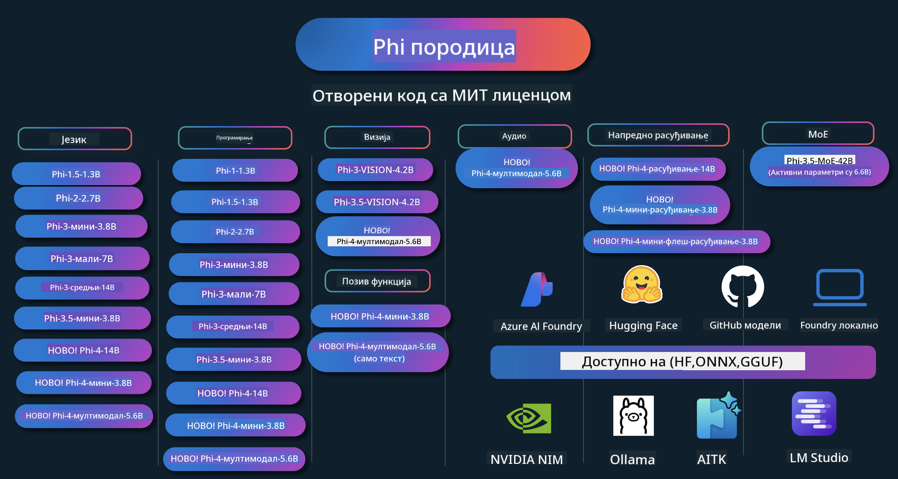

<!--
CO_OP_TRANSLATOR_METADATA:
{
  "original_hash": "ef3a50368712b1a7483d0def1f70c490",
  "translation_date": "2025-12-21T13:45:06+00:00",
  "source_file": "README.md",
  "language_code": "sr"
}
-->
# Phi Cookbook: Практични примери са Microsoft-овим Phi моделима

Phi је серија отворених AI модела које развија Microsoft.

Phi је тренутно најмоћнији и најисплативији мали језички модел (SLM), са веома добрим резултатима у мултијезичности, резоновању, генерисању текста/ћаскања, програмирању, сликама, аудију и другим сценаријима.

Можете распоредити Phi у облаку или на уређајима на ивици (edge), и лако градити генеративне AI апликације са ограниченом рачунарском снагом.

Следите ове кораке да бисте почели да користите ове ресурсе :
1. **Fork the Repository**: Click 
2. **Clone the Repository**:   `git clone https://github.com/microsoft/PhiCookBook.git`
3. [**Придружите се Microsoft AI Discord заједници и упознајте експерте и колеге програмере**](https://discord.com/invite/ByRwuEEgH4?WT.mc_id=aiml-137032-kinfeylo)

### 🌐 Подршка за више језика

#### Подржано кроз GitHub Action (Аутоматизовано и увек ажурно)

<!-- CO-OP TRANSLATOR LANGUAGES TABLE START -->
[Арапски](../ar/README.md) | [Бенгалски](../bn/README.md) | [Бугарски](../bg/README.md) | [Бирмански (Мјанмар)](../my/README.md) | [Кинески (поједностављени)](../zh/README.md) | [Кинески (традиционални, Хонг Конг)](../hk/README.md) | [Кинески (традиционални, Макао)](../mo/README.md) | [Кинески (традиционални, Тајван)](../tw/README.md) | [Хрватски](../hr/README.md) | [Чешки](../cs/README.md) | [Дански](../da/README.md) | [Холандски](../nl/README.md) | [Естонски](../et/README.md) | [Фински](../fi/README.md) | [Француски](../fr/README.md) | [Немачки](../de/README.md) | [Грчки](../el/README.md) | [Хебрејски](../he/README.md) | [Хинди](../hi/README.md) | [Мађарски](../hu/README.md) | [Индонежански](../id/README.md) | [Италијански](../it/README.md) | [Јапански](../ja/README.md) | [Каннада](../kn/README.md) | [Корејски](../ko/README.md) | [Литвански](../lt/README.md) | [Малајски](../ms/README.md) | [Малајалам](../ml/README.md) | [Марати](../mr/README.md) | [Непали](../ne/README.md) | [Нигеријски пидгин](../pcm/README.md) | [Норвешки](../no/README.md) | [Персијски (Фарси)](../fa/README.md) | [Пољски](../pl/README.md) | [Португалски (Бразил)](../br/README.md) | [Португалски (Португал)](../pt/README.md) | [Пенџаби (Гурмухи)](../pa/README.md) | [Румунски](../ro/README.md) | [Руски](../ru/README.md) | [Српски (ћирилица)](./README.md) | [Словачки](../sk/README.md) | [Словеначки](../sl/README.md) | [Шпански](../es/README.md) | [Свахили](../sw/README.md) | [Шведски](../sv/README.md) | [Тагалог (Филипински)](../tl/README.md) | [ТАмил](../ta/README.md) | [Телугу](../te/README.md) | [Тајландски](../th/README.md) | [Турски](../tr/README.md) | [Украјински](../uk/README.md) | [Урду](../ur/README.md) | [Вијетнамски](../vi/README.md)
<!-- CO-OP TRANSLATOR LANGUAGES TABLE END -->

## Табела садржаја

- Увод
  - [Добродошли у Phi породицу](./md/01.Introduction/01/01.PhiFamily.md)
  - [Подешавање вашег окружења](./md/01.Introduction/01/01.EnvironmentSetup.md)
  - [Разумевање кључних технологија](./md/01.Introduction/01/01.Understandingtech.md)
  - [AI безбедност за Phi моделе](./md/01.Introduction/01/01.AISafety.md)
  - [Подршка хардверу за Phi](./md/01.Introduction/01/01.Hardwaresupport.md)
  - [Phi модели и доступност на платформама](./md/01.Introduction/01/01.Edgeandcloud.md)
  - [Коришћење Guidance-ai и Phi](./md/01.Introduction/01/01.Guidance.md)
  - [GitHub Marketplace модели](https://github.com/marketplace/models)
  - [Azure AI Model Catalog](https://ai.azure.com)

- Извођење Phi у различитим окружењима
    -  [Hugging Face](./md/01.Introduction/02/01.HF.md)
    -  [GitHub Models](./md/01.Introduction/02/02.GitHubModel.md)
    -  [Azure AI Foundry Model Catalog](./md/01.Introduction/02/03.AzureAIFoundry.md)
    -  [Ollama](./md/01.Introduction/02/04.Ollama.md)
    -  [AI Toolkit VSCode (AITK)](./md/01.Introduction/02/05.AITK.md)
    -  [NVIDIA NIM](./md/01.Introduction/02/06.NVIDIA.md)
    -  [Foundry Local](./md/01.Introduction/02/07.FoundryLocal.md)

- Извођење Phi фамилије
    - [Извођење Phi на iOS](./md/01.Introduction/03/iOS_Inference.md)
    - [Извођење Phi на Android-у](./md/01.Introduction/03/Android_Inference.md)
    - [Извођење Phi на Jetson-у](./md/01.Introduction/03/Jetson_Inference.md)
    - [Извођење Phi на AI PC-ју](./md/01.Introduction/03/AIPC_Inference.md)
    - [Извођење Phi са Apple MLX оквиром](./md/01.Introduction/03/MLX_Inference.md)
    - [Извођење Phi на локалном серверу](./md/01.Introduction/03/Local_Server_Inference.md)
    - [Извођење Phi на удаљеном серверу користећи AI Toolkit](./md/01.Introduction/03/Remote_Interence.md)
    - [Извођење Phi са Rust-ом](./md/01.Introduction/03/Rust_Inference.md)
    - [Извођење Phi — Визија локално](./md/01.Introduction/03/Vision_Inference.md)
    - [Извођење Phi уз Kaito AKS, Azure Containers (званична подршка)](./md/01.Introduction/03/Kaito_Inference.md)
-  [Квантификација Phi фамилије](./md/01.Introduction/04/QuantifyingPhi.md)
    - [Квантизација Phi-3.5 / 4 коришћењем llama.cpp](./md/01.Introduction/04/UsingLlamacppQuantifyingPhi.md)
    - [Квантизација Phi-3.5 / 4 коришћењем Generative AI екстензија за onnxruntime](./md/01.Introduction/04/UsingORTGenAIQuantifyingPhi.md)
    - [Квантизација Phi-3.5 / 4 коришћењем Intel OpenVINO](./md/01.Introduction/04/UsingIntelOpenVINOQuantifyingPhi.md)
    - [Квантизација Phi-3.5 / 4 коришћењем Apple MLX оквира](./md/01.Introduction/04/UsingAppleMLXQuantifyingPhi.md)

- Евалуација Phi
    - [Одговорни AI](./md/01.Introduction/05/ResponsibleAI.md)
    - [Azure AI Foundry за евалуацију](./md/01.Introduction/05/AIFoundry.md)
    - [Коришћење Promptflow-а за евалуацију](./md/01.Introduction/05/Promptflow.md)
 
- RAG са Azure AI Search
    - [Како користити Phi-4-mini и Phi-4-multimodal (RAG) са Azure AI Search](https://github.com/microsoft/PhiCookBook/blob/main/code/06.E2E/E2E_Phi-4-RAG-Azure-AI-Search.ipynb)

- Примери развоја Phi апликација
  - Текст и ћаскање апликације
    - Phi-4 примери 🆕
      - [📓] [Ћаскање са Phi-4-mini ONNX моделом](./md/02.Application/01.TextAndChat/Phi4/ChatWithPhi4ONNX/README.md)
      - [Ћаскање са Phi-4 локалним ONNX моделом .NET](../../md/04.HOL/dotnet/src/LabsPhi4-Chat-01OnnxRuntime)
      - [Console .NET апликација за ћаскање са Phi-4 ONNX користећи Semantic Kernel](../../md/04.HOL/dotnet/src/LabsPhi4-Chat-02SK)
    - Phi-3 / 3.5 примери
      - [Локални ћатбот у прегледачу користећи Phi3, ONNX Runtime Web и WebGPU](https://github.com/microsoft/onnxruntime-inference-examples/tree/main/js/chat)
      - [OpenVINO ћаскање](./md/02.Application/01.TextAndChat/Phi3/E2E_OpenVino_Chat.md)
      - [Више модела — Интерактивни Phi-3-mini и OpenAI Whisper](./md/02.Application/01.TextAndChat/Phi3/E2E_Phi-3-mini_with_whisper.md)
      - [MLFlow — Прављење омотача и коришћење Phi-3 са MLFlow](./md//02.Application/01.TextAndChat/Phi3/E2E_Phi-3-MLflow.md)
      - [Оптимизација модела - Како оптимизовати Phi-3-min модел за ONNX Runtime Web помоћу Olive](https://github.com/microsoft/Olive/tree/main/examples/phi3)
      - [WinUI3 апликација са Phi-3 mini-4k-instruct-onnx](https://github.com/microsoft/Phi3-Chat-WinUI3-Sample/)
      -[WinUI3 пример апликације за белешке са више AI модела](https://github.com/microsoft/ai-powered-notes-winui3-sample)
      - [Фино подешавање и интеграција прилагођених Phi-3 модела са Prompt flow](./md/02.Application/01.TextAndChat/Phi3/E2E_Phi-3-FineTuning_PromptFlow_Integration.md)
      - [Фино подешавање и интеграција прилагођених Phi-3 модела са Prompt flow у Azure AI Foundry](./md/02.Application/01.TextAndChat/Phi3/E2E_Phi-3-FineTuning_PromptFlow_Integration_AIFoundry.md)
      - [Преиспитивање фино подешеног Phi-3 / Phi-3.5 модела у Azure AI Foundry са фокусом на принципе одговорне вештачке интелигенције компаније Microsoft](./md/02.Application/01.TextAndChat/Phi3/E2E_Phi-3-Evaluation_AIFoundry.md)
      - [📓] [Phi-3.5-mini-instruct пример предвиђања језика (кинески/енглески)](./md/02.Application/01.TextAndChat/Phi3/phi3-instruct-demo.ipynb)
      - [Phi-3.5-Instruct WebGPU RAG чатбот](./md/02.Application/01.TextAndChat/Phi3/WebGPUWithPhi35Readme.md)
      - [Коришћење Windows GPU за креирање Prompt flow решења са Phi-3.5-Instruct ONNX](./md/02.Application/01.TextAndChat/Phi3/UsingPromptFlowWithONNX.md)
      - [Коришћење Microsoft Phi-3.5 tflite за креирање Android апликације](./md/02.Application/01.TextAndChat/Phi3/UsingPhi35TFLiteCreateAndroidApp.md)
      - [Питања и одговори .NET пример који користи локални ONNX Phi-3 модел преко Microsoft.ML.OnnxRuntime](../../md/04.HOL/dotnet/src/LabsPhi301)
      - [Конзолна .NET апликација за чет са Semantic Kernel и Phi-3](../../md/04.HOL/dotnet/src/LabsPhi302)

  - Azure AI Inference SDK Code Based Samples 
    - Phi-4 примери 🆕
      - [📓] [Генеришите код пројекта користећи Phi-4-multimodal](./md/02.Application/02.Code/Phi4/GenProjectCode/README.md)
    - Phi-3 / 3.5 примери
      - [Изградите свој Visual Studio Code GitHub Copilot Chat са Microsoft Phi-3 породицом](./md/02.Application/02.Code/Phi3/VSCodeExt/README.md)
      - [Креирајте свог Visual Studio Code Chat Copilot агента са Phi-3.5 преко GitHub модела](/md/02.Application/02.Code/Phi3/CreateVSCodeChatAgentWithGitHubModels.md)

  - Напредни примери резонирања
    - Phi-4 примери 🆕
      - [📓] [Phi-4-mini-reasoning или Phi-4-reasoning примери](./md/02.Application/03.AdvancedReasoning/Phi4/AdvancedResoningPhi4mini/README.md)
      - [📓] [Фино подешавање Phi-4-mini-reasoning са Microsoft Olive](./md/02.Application/03.AdvancedReasoning/Phi4/AdvancedResoningPhi4mini/olive_ft_phi_4_reasoning_with_medicaldata.ipynb)
      - [📓] [Фино подешавање Phi-4-mini-reasoning са Apple MLX](./md/02.Application/03.AdvancedReasoning/Phi4/AdvancedResoningPhi4mini/mlx_ft_phi_4_reasoning_with_medicaldata.ipynb)
      - [📓] [Phi-4-mini-reasoning са GitHub моделима](./md/02.Application/02.Code/Phi4r/github_models_inference.ipynb)
      - [📓] [Phi-4-mini-reasoning са Azure AI Foundry моделима](./md/02.Application/02.Code/Phi4r/azure_models_inference.ipynb)
  - Демонстрације
      - [Phi-4-mini демонстрације хостоване на Hugging Face Spaces](https://huggingface.co/spaces/microsoft/phi-4-mini?WT.mc_id=aiml-137032-kinfeylo)
      - [Phi-4-multimodal демонстрације хостоване на Hugginge Face Spaces](https://huggingface.co/spaces/microsoft/phi-4-multimodal?WT.mc_id=aiml-137032-kinfeylo)
  - Визуелни примери
    - Phi-4 примери 🆕
      - [📓] [Користите Phi-4-multimodal за читање слика и генерисање кода](./md/02.Application/04.Vision/Phi4/CreateFrontend/README.md) 
    - Phi-3 / 3.5 примери
      -  [📓][Phi-3-vision - слика текст у текст](./md/02.Application/04.Vision/Phi3/E2E_Phi-3-vision-image-text-to-text-online-endpoint.ipynb)
      - [Phi-3-vision-ONNX](https://onnxruntime.ai/docs/genai/tutorials/phi3-v.html)
      - [📓][Phi-3-vision CLIP уграђивање](./md/02.Application/04.Vision/Phi3/E2E_Phi-3-vision-image-text-to-text-online-endpoint.ipynb)
      - [DEMO: Phi-3 рециклирање](https://github.com/jennifermarsman/PhiRecycling/)
      - [Phi-3-vision - визуелни језички асистент - са Phi3-Vision и OpenVINO](https://docs.openvino.ai/nightly/notebooks/phi-3-vision-with-output.html)
      - [Phi-3 Vision Nvidia NIM](./md/02.Application/04.Vision/Phi3/E2E_Nvidia_NIM_Vision.md)
      - [Phi-3 Vision OpenVino](./md/02.Application/04.Vision/Phi3/E2E_OpenVino_Phi3Vision.md)
      - [📓][Phi-3.5 Vision пример за више кадрова или више слика](./md/02.Application/04.Vision/Phi3/phi3-vision-demo.ipynb)
      - [Phi-3 Vision локални ONNX модел користећи Microsoft.ML.OnnxRuntime .NET](../../md/04.HOL/dotnet/src/LabsPhi303)
      - [Мени заснован Phi-3 Vision локални ONNX модел користећи Microsoft.ML.OnnxRuntime .NET](../../md/04.HOL/dotnet/src/LabsPhi304)

  - Математички примери
    -  Phi-4-Mini-Flash-Reasoning-Instruct примери 🆕 [Математички демо са Phi-4-Mini-Flash-Reasoning-Instruct](./md/02.Application/09.Math/MathDemo.ipynb)

  - Аудио примери
    - Phi-4 примери 🆕
      - [📓] [Извлачење транскрипата аудио записа користећи Phi-4-multimodal](./md/02.Application/05.Audio/Phi4/Transciption/README.md)
      - [📓] [Phi-4-multimodal аудио пример](./md/02.Application/05.Audio/Phi4/Siri/demo.ipynb)
      - [📓] [Phi-4-multimodal пример превода говора](./md/02.Application/05.Audio/Phi4/Translate/demo.ipynb)
      - [.NET конзолна апликација која користи Phi-4-multimodal Audio да анализира аудио фајл и генерише транскрипт](../../md/04.HOL/dotnet/src/LabsPhi4-MultiModal-02Audio)

  - MOE примери
    - Phi-3 / 3.5 примери
      - [📓] [Phi-3.5 Mixture of Experts модели (MoEs) пример за друштвене мреже](./md/02.Application/06.MoE/Phi3/phi3_moe_demo.ipynb)
      - [📓] [Изградња Retrieval-Augmented Generation (RAG) pipeline-а са NVIDIA NIM Phi-3 MOE, Azure AI Search и LlamaIndex](./md/02.Application/06.MoE/Phi3/azure-ai-search-nvidia-rag.ipynb)
      - 
  - Примери за позив функција
    - Phi-4 примери 🆕
      -  [📓] [Коришћење Function Calling са Phi-4-mini](./md/02.Application/07.FunctionCalling/Phi4/FunctionCallingBasic/README.md)
      -  [📓] [Коришћење Function Calling за креирање мулти-агената са Phi-4-mini](./md/02.Application/07.FunctionCalling/Phi4/Multiagents/Phi_4_mini_multiagent.ipynb)
      -  [📓] [Коришћење Function Calling са Ollama](./md/02.Application/07.FunctionCalling/Phi4/Ollama/ollama_functioncalling.ipynb)
      -  [📓] [Коришћење Function Calling са ONNX](./md/02.Application/07.FunctionCalling/Phi4/ONNX/onnx_parallel_functioncalling_ipynb.ipynb)
  - Примери мултимодалног мешања
    - Phi-4 примери 🆕
      -  [📓] [Коришћење Phi-4-multimodal као технолошког новинара](./md/02.Application/08.Multimodel/Phi4/TechJournalist/phi_4_mm_audio_text_publish_news.ipynb)
      - [.NET конзолна апликација која користи Phi-4-multimodal за анализу слика](../../md/04.HOL/dotnet/src/LabsPhi4-MultiModal-01Images)

- Фино подешавање Phi - примери
  - [Сценарији фино подешавања](./md/03.FineTuning/FineTuning_Scenarios.md)
  - [Фино подешавање против RAG](./md/03.FineTuning/FineTuning_vs_RAG.md)
  - [Фино подешавање: Нека Phi-3 постане индустријски експерт](./md/03.FineTuning/LetPhi3gotoIndustriy.md)
  - [Фино подешавање Phi-3 са AI Toolkit за VS Code](./md/03.FineTuning/Finetuning_VSCodeaitoolkit.md)
  - [Фино подешавање Phi-3 са Azure Machine Learning Service](./md/03.FineTuning/Introduce_AzureML.md)
  - [Фино подешавање Phi-3 са Lora](./md/03.FineTuning/FineTuning_Lora.md)
  - [Фино подешавање Phi-3 са QLora](./md/03.FineTuning/FineTuning_Qlora.md)
  - [Фино подешавање Phi-3 са Azure AI Foundry](./md/03.FineTuning/FineTuning_AIFoundry.md)
  - [Фино подешавање Phi-3 са Azure ML CLI/SDK](./md/03.FineTuning/FineTuning_MLSDK.md)
  - [Фино подешавање са Microsoft Olive](./md/03.FineTuning/FineTuning_MicrosoftOlive.md)
  - [Практична лабораторија Microsoft Olive за фино подешавање](./md/03.FineTuning/olive-lab/readme.md)
  - [Фино подешавање Phi-3-vision са Weights and Bias](./md/03.FineTuning/FineTuning_Phi-3-visionWandB.md)
  - [Фино подешавање Phi-3 са Apple MLX Framework](./md/03.FineTuning/FineTuning_MLX.md)
  - [Фино подешавање Phi-3-vision (званична подршка)](./md/03.FineTuning/FineTuning_Vision.md)
  - [Фино подешавање Phi-3 са Kaito AKS , Azure Containers(званична подршка)](./md/03.FineTuning/FineTuning_Kaito.md)
  - [Фино подешавање Phi-3 и 3.5 Vision](https://github.com/2U1/Phi3-Vision-Finetune)

- Практичне лабораторије
  - [Истраживање најсавременијих модела: LLMs, SLMs, локални развој и више](https://github.com/microsoft/aitour-exploring-cutting-edge-models)
  - [Отварање потенцијала NLP-а: фино подешавање са Microsoft Olive](https://github.com/azure/Ignite_FineTuning_workshop)

- Академски радови и публикације
  - [Textbooks Are All You Need II: phi-1.5 technical report](https://arxiv.org/abs/2309.05463)
  - [Phi-3 технички извештај: веома способан језички модел локално на вашем телефону](https://arxiv.org/abs/2404.14219)
  - [Phi-4 технички извештај](https://arxiv.org/abs/2412.08905)
  - [Phi-4-Mini технички извештај: компактни али моћни мултимодални језички модели путем Mixture-of-LoRAs](https://arxiv.org/abs/2503.01743)
  - [Оптимизација малих језичких модела за позивање функција у возилу](https://arxiv.org/abs/2501.02342)
  - [(WhyPHI) Фино подешавање PHI-3 за одговарање на питања са вишеструким избором: методологија, резултати и изазови](https://arxiv.org/abs/2501.01588)
  - [Phi-4-reasoning технички извештај](https://www.microsoft.com/en-us/research/wp-content/uploads/2025/04/phi_4_reasoning.pdf)
  - [Phi-4-mini-reasoning технички извештај](https://huggingface.co/microsoft/Phi-4-mini-reasoning/blob/main/Phi-4-Mini-Reasoning.pdf)

## Коришћење Phi модела

### Phi на Azure AI Foundry

Можете научити како да користите Microsoft Phi и како да изградите E2E решења на вашим различитим хардверским уређајима. Да бисте лично испробали Phi, почните тако што ћете се играти са моделима и прилагођавати Phi вашим сценаријима користећи [Azure AI Foundry Azure AI Model Catalog](https://aka.ms/phi3-azure-ai) можете сазнати више у водичу Почетак рада са [Azure AI Foundry](/md/02.QuickStart/AzureAIFoundry_QuickStart.md)

**Плејграунд**
Сваки модел има посебан посвећени плејграунд за тестирање модела [Azure AI Playground](https://aka.ms/try-phi3).

### Phi на GitHub Models

Можете научити како да користите Microsoft Phi и како да изградите E2E решења на вашим различитим хардверским уређајима. Да бисте сами испробали Phi, почните тако што ћете се играти са моделом и прилагођавати Phi вашим сценаријима користећи [GitHub Model Catalog](https://github.com/marketplace/models?WT.mc_id=aiml-137032-kinfeylo) можете сазнати више у водичу Почетак рада са [GitHub Model Catalog](/md/02.QuickStart/GitHubModel_QuickStart.md)

**Плејграунд**
Сваки модел има посвећени [плејграунд за тестирање модела](/md/02.QuickStart/GitHubModel_QuickStart.md).

### Phi на Hugging Face

Можете такође пронаћи модел на [Hugging Face](https://huggingface.co/microsoft)

**Плејграунд**
 [Hugging Chat плејграунд](https://huggingface.co/chat/models/microsoft/Phi-3-mini-4k-instruct)

 ## 🎒 Остали курсеви

Наш тим прави и друге курсеве! Погледајте:

<!-- CO-OP TRANSLATOR OTHER COURSES START -->
### LangChain

---

### Azure / Edge / MCP / Agents

---
 
### Серија генеративног AI

[-9333EA?style=for-the-badge&labelColor=E5E7EB&color=9333EA)](https://github.com/microsoft/Generative-AI-for-beginners-dotnet?WT.mc_id=academic-105485-koreyst)
[-C084FC?style=for-the-badge&labelColor=E5E7EB&color=C084FC)](https://github.com/microsoft/generative-ai-for-beginners-java?WT.mc_id=academic-105485-koreyst)
[-E879F9?style=for-the-badge&labelColor=E5E7EB&color=E879F9)](https://github.com/microsoft/generative-ai-with-javascript?WT.mc_id=academic-105485-koreyst)

---
 
### Основно учење

---
 
### Copilot серија

<!-- CO-OP TRANSLATOR OTHER COURSES END -->

## Одговорна вештачка интелигенција 

Microsoft је посвећен помагању нашим клијентима да одговорно користе наше AI производе, делећи наша сазнања и градећи партнерства заснована на поверењу кроз алате попут Transparency Notes и Impact Assessments. Многи од ових ресурса могу се наћи на [https://aka.ms/RAI](https://aka.ms/RAI).
Приступ компаније Microsoft одговорној AI заснован је на нашим AI принципима правичности, поузданости и безбедности, приватности и сигурности, инклузивности, транспарентности и одговорности.

Велики модели за природни језик, слике и говор — као они коришћени у овом примеру — потенцијално могу да се понашају на начине који су неправедни, непоуздани или увредљиви, што може изазвати штету. Молимо погледајте [Azure OpenAI service Transparency note](https://learn.microsoft.com/legal/cognitive-services/openai/transparency-note?tabs=text) да бисте били информисани о ризицима и ограничењима.

Препоручени приступ смањењу ових ризика је укључивање безбедносног система у вашу архитектуру који може да открије и спречи штетно понашање. [Azure AI Content Safety](https://learn.microsoft.com/azure/ai-services/content-safety/overview) пружа независни слој заштите, способан да открије штетни садржај генерисан од корисника и AI-јем у апликацијама и сервисима. Azure AI Content Safety укључује текстуалне и сликовне API-је који вам омогућавају да откријете материјал који је штетан. У оквиру Azure AI Foundry, услуга Content Safety омогућава вам да прегледате, истражите и испробате примере кода за откривање штетног садржаја у различитим модалитетима. Следећа [документација за брзи почетак](https://learn.microsoft.com/azure/ai-services/content-safety/quickstart-text?tabs=visual-studio%2Clinux&pivots=programming-language-rest) води вас кроз прављење захтева ка услузи.

Још један аспект који треба узети у обзир је укупна перформанса апликације. Код мултимодалних и мулти-модел апликација, перформансе сматрамо тиме да систем функционише како ви и ваши корисници очекујете, укључујући и то да не генерише штетне излазе. Важно је оценити перформансе ваше целокупне апликације користећи [Performance and Quality and Risk and Safety evaluators](https://learn.microsoft.com/azure/ai-studio/concepts/evaluation-metrics-built-in). Такође имате могућност да креирате и оцењујете са [прилагођеним оцењивачима](https://learn.microsoft.com/azure/ai-studio/how-to/develop/evaluate-sdk#custom-evaluators).

Можете оценити вашу AI апликацију у развојном окружењу користећи [Azure AI Evaluation SDK](https://microsoft.github.io/promptflow/index.html). Са било којим тест скупом података или циљем, генерације ваше генеративне AI апликације се квантитативно мере уграђеним оцењивачима или прилагођеним оцењивачима по вашем избору. Да бисте почели са Azure AI Evaluation SDK-ом за оцену вашег система, можете пратити [брзи водич](https://learn.microsoft.com/azure/ai-studio/how-to/develop/flow-evaluate-sdk). Када извршите покретање евалуације, можете [визуализовати резултате у Azure AI Foundry](https://learn.microsoft.com/azure/ai-studio/how-to/evaluate-flow-results). 

## Трговачке марке
Овај пројекат може да садржи жигове или логотипе за пројекте, производе или услуге. Ауторизовано коришћење Microsoft жигова или логотипа подлеже и мора се придржавати [Microsoft-ових смерница за жигове и бренд](https://www.microsoft.com/legal/intellectualproperty/trademarks/usage/general).
Коришћење Microsoft жигова или логотипа у модификованим верзијама овог пројекта не сме стварати забуну нити указивати на спонзорство од стране Microsoft-а. Свака употреба жигова или логотипа трећих страна подлеже политикама тих трећих страна.

## Како добити помоћ

Ако запнете или имате било каквих питања у вези са развоjem AI апликација, придружите се:

Ако имате повратне информације о производу или наиђете на грешке током развоја, посетите:

---

<!-- CO-OP TRANSLATOR DISCLAIMER START -->
**Ограничење одговорности**:
Овај документ је преведен помоћу услуге за превођење засноване на вештачкој интелигенцији [Co-op Translator](https://github.com/Azure/co-op-translator). Иако се трудимо да обезбедимо тачност, имајте у виду да аутоматски преводи могу да садрже грешке или нетачности. Оригинални документ на његовом изворном језику треба сматрати званичним извором. За критичне информације препоручује се професионални превод од стране стручног преводиоца. Не сносимо одговорност за било какве неспоразуме или погрешне тумачења која проистекну из коришћења овог превода.
<!-- CO-OP TRANSLATOR DISCLAIMER END -->