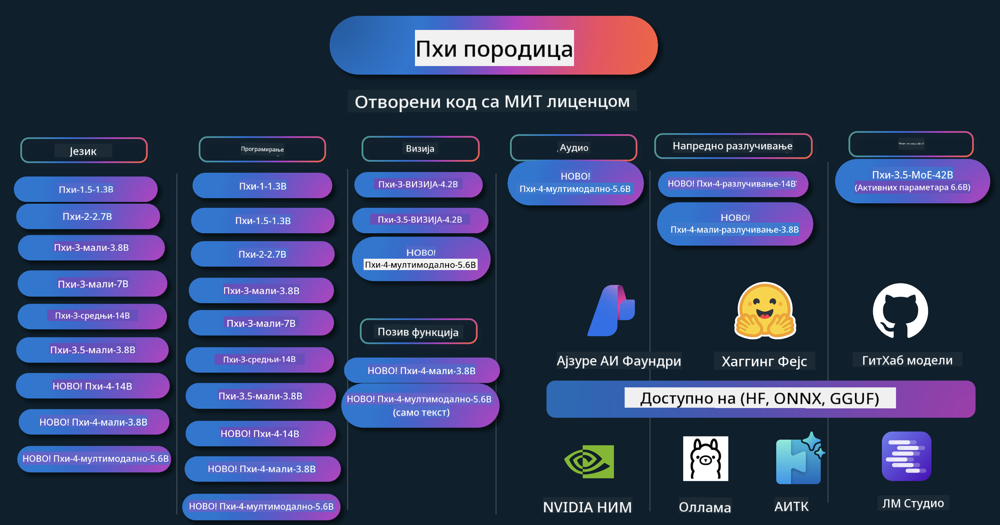

<!--
CO_OP_TRANSLATOR_METADATA:
{
  "original_hash": "1cab9282e04f2e1c388a38dca7763c16",
  "translation_date": "2025-05-09T04:14:31+00:00",
  "source_file": "README.md",
  "language_code": "sr"
}
-->
# Phi Cookbook: Praktični primeri sa Microsoftovim Phi modelima

  

  
  
  

  
  

Phi je serija open source AI modela koje je razvio Microsoft.

Phi je trenutno najsnažniji i najisplativiji mali jezički model (SLM), sa odličnim rezultatima u višejezičnosti, rezonovanju, generisanju teksta/četa, kodiranju, obradi slika, zvuka i drugim scenarijima.

Možete da implementirate Phi u oblaku ili na edge uređajima, i lako pravite generativne AI aplikacije čak i sa ograničenim računarstvom.

Pratite ove korake da biste počeli da koristite ove resurse:  
1. **Fork-ujte repozitorijum**: Kliknite   
2. **Klonirajte repozitorijum**: `git clone https://github.com/microsoft/PhiCookBook.git`  
3. [**Pridružite se Microsoft AI Discord zajednici i upoznajte eksperte i druge developere**](https://discord.com/invite/ByRwuEEgH4?WT.mc_id=aiml-137032-kinfeylo)

## 🌐 Višejezična podrška

### Podržano putem GitHub Action (Automatski i uvek ažurirano)

[French](../fr/README.md) | [Spanish](../es/README.md) | [German](../de/README.md) | [Russian](../ru/README.md) | [Arabic](../ar/README.md) | [Persian (Farsi)](../fa/README.md) | [Urdu](../ur/README.md) | [Chinese (Simplified)](../zh/README.md) | [Chinese (Traditional, Macau)](../mo/README.md) | [Chinese (Traditional, Hong Kong)](../hk/README.md) | [Chinese (Traditional, Taiwan)](../tw/README.md) | [Japanese](../ja/README.md) | [Korean](../ko/README.md) | [Hindi](../hi/README.md)

### Podržano putem CLI
[Bengali](../bn/README.md) | [Marathi](../mr/README.md) | [Nepali](../ne/README.md) | [Punjabi (Gurmukhi)](../pa/README.md) | [Portuguese (Portugal)](../pt/README.md) | [Portuguese (Brazil)](../br/README.md) | [Italian](../it/README.md) | [Polish](../pl/README.md) | [Turkish](../tr/README.md) | [Greek](../el/README.md) | [Thai](../th/README.md) | [Swedish](../sv/README.md) | [Danish](../da/README.md) | [Norwegian](../no/README.md) | [Finnish](../fi/README.md) | [Dutch](../nl/README.md) | [Hebrew](../he/README.md) | [Vietnamese](../vi/README.md) | [Indonesian](../id/README.md) | [Malay](../ms/README.md) | [Tagalog (Filipino)](../tl/README.md) | [Swahili](../sw/README.md) | [Hungarian](../hu/README.md) | [Czech](../cs/README.md) | [Slovak](../sk/README.md) | [Romanian](../ro/README.md) | [Bulgarian](../bg/README.md) | [Serbian (Cyrillic)](./README.md) | [Croatian](../hr/README.md) | [Slovenian](../sl/README.md)

## Садржај

- Увод
- [Dobrodošli u Phi porodicu](./md/01.Introduction/01/01.PhiFamily.md)
  - [Podešavanje vašeg okruženja](./md/01.Introduction/01/01.EnvironmentSetup.md)
  - [Razumevanje ključnih tehnologija](./md/01.Introduction/01/01.Understandingtech.md)
  - [AI bezbednost za Phi modele](./md/01.Introduction/01/01.AISafety.md)
  - [Podrška za Phi hardver](./md/01.Introduction/01/01.Hardwaresupport.md)
  - [Phi modeli i dostupnost na različitim platformama](./md/01.Introduction/01/01.Edgeandcloud.md)
  - [Korišćenje Guidance-ai i Phi](./md/01.Introduction/01/01.Guidance.md)
  - [GitHub Marketplace modeli](https://github.com/marketplace/models)
  - [Azure AI katalog modela](https://ai.azure.com)

- Inference Phi u različitim okruženjima
    -  [Hugging face](./md/01.Introduction/02/01.HF.md)
    -  [GitHub modeli](./md/01.Introduction/02/02.GitHubModel.md)
    -  [Azure AI Foundry katalog modela](./md/01.Introduction/02/03.AzureAIFoundry.md)
    -  [Ollama](./md/01.Introduction/02/04.Ollama.md)
    -  [AI Toolkit VSCode (AITK)](./md/01.Introduction/02/05.AITK.md)
    -  [NVIDIA NIM](./md/01.Introduction/02/06.NVIDIA.md)

- Inference Phi porodice
    - [Inference Phi na iOS-u](./md/01.Introduction/03/iOS_Inference.md)
    - [Inference Phi na Androidu](./md/01.Introduction/03/Android_Inference.md)
    - [Inference Phi na Jetson-u](./md/01.Introduction/03/Jetson_Inference.md)
    - [Inference Phi na AI PC-u](./md/01.Introduction/03/AIPC_Inference.md)
    - [Inference Phi sa Apple MLX Framework-om](./md/01.Introduction/03/MLX_Inference.md)
    - [Inference Phi na lokalnom serveru](./md/01.Introduction/03/Local_Server_Inference.md)
    - [Inference Phi na udaljenom serveru koristeći AI Toolkit](./md/01.Introduction/03/Remote_Interence.md)
    - [Inference Phi sa Rust-om](./md/01.Introduction/03/Rust_Inference.md)
    - [Inference Phi--Vision lokalno](./md/01.Introduction/03/Vision_Inference.md)
    - [Inference Phi sa Kaito AKS, Azure Containers (zvanična podrška)](./md/01.Introduction/03/Kaito_Inference.md)
-  [Kvantifikacija Phi porodice](./md/01.Introduction/04/QuantifyingPhi.md)
    - [Kvantizacija Phi-3.5 / 4 koristeći llama.cpp](./md/01.Introduction/04/UsingLlamacppQuantifyingPhi.md)
    - [Kvantizacija Phi-3.5 / 4 koristeći Generative AI ekstenzije za onnxruntime](./md/01.Introduction/04/UsingORTGenAIQuantifyingPhi.md)
    - [Kvantizacija Phi-3.5 / 4 koristeći Intel OpenVINO](./md/01.Introduction/04/UsingIntelOpenVINOQuantifyingPhi.md)
    - [Kvantizacija Phi-3.5 / 4 koristeći Apple MLX Framework](./md/01.Introduction/04/UsingAppleMLXQuantifyingPhi.md)

-  Evaluacija Phi
- [Response AI](./md/01.Introduction/05/ResponsibleAI.md)
    - [Azure AI Foundry за процену](./md/01.Introduction/05/AIFoundry.md)
    - [Коришћење Promptflow за процену](./md/01.Introduction/05/Promptflow.md)
 
- RAG са Azure AI Search
    - [Како користити Phi-4-mini и Phi-4-multimodal (RAG) са Azure AI Search](https://github.com/microsoft/PhiCookBook/blob/main/code/06.E2E/E2E_Phi-4-RAG-Azure-AI-Search.ipynb)

- Примери развоја Phi апликација
  - Текст и чет апликације
    - Phi-4 примери 🆕
      - [📓] [Ћаскање са Phi-4-mini ONNX моделом](./md/02.Application/01.TextAndChat/Phi4/ChatWithPhi4ONNX/README.md)
      - [Ћаскање са Phi-4 локалним ONNX моделом у .NET](../../md/04.HOL/dotnet/src/LabsPhi4-Chat-01OnnxRuntime)
      - [Конзолна .NET апликација за ћаскање са Phi-4 ONNX користећи Semantic Kernel](../../md/04.HOL/dotnet/src/LabsPhi4-Chat-02SK)
    - Phi-3 / 3.5 примери
      - [Локални чатбот у прегледачу користећи Phi3, ONNX Runtime Web и WebGPU](https://github.com/microsoft/onnxruntime-inference-examples/tree/main/js/chat)
      - [OpenVino чет](./md/02.Application/01.TextAndChat/Phi3/E2E_OpenVino_Chat.md)
      - [Мулти модел - интерактивни Phi-3-mini и OpenAI Whisper](./md/02.Application/01.TextAndChat/Phi3/E2E_Phi-3-mini_with_whisper.md)
      - [MLFlow - креирање wrapper-а и коришћење Phi-3 са MLFlow](./md//02.Application/01.TextAndChat/Phi3/E2E_Phi-3-MLflow.md)
      - [Оптимизација модела - како оптимизовати Phi-3-min модел за ONNX Runtime Web помоћу Olive](https://github.com/microsoft/Olive/tree/main/examples/phi3)
      - [WinUI3 апликација са Phi-3 mini-4k-instruct-onnx](https://github.com/microsoft/Phi3-Chat-WinUI3-Sample/)
      - [WinUI3 мулти модел AI апликација за белешке](https://github.com/microsoft/ai-powered-notes-winui3-sample)
      - [Фино подешавање и интеграција прилагођених Phi-3 модела са Prompt flow](./md/02.Application/01.TextAndChat/Phi3/E2E_Phi-3-FineTuning_PromptFlow_Integration.md)
      - [Фино подешавање и интеграција прилагођених Phi-3 модела са Prompt flow у Azure AI Foundry](./md/02.Application/01.TextAndChat/Phi3/E2E_Phi-3-FineTuning_PromptFlow_Integration_AIFoundry.md)
      - [Процена фино подешеног Phi-3 / Phi-3.5 модела у Azure AI Foundry са фокусом на Microsoft-ове принципе одговорног AI](./md/02.Application/01.TextAndChat/Phi3/E2E_Phi-3-Evaluation_AIFoundry.md)
      - [📓] [Пример језичке предикције Phi-3.5-mini-instruct (кинески/енглески)](../../md/02.Application/01.TextAndChat/Phi3/phi3-instruct-demo.ipynb)
      - [Phi-3.5-Instruct WebGPU RAG четбот](./md/02.Application/01.TextAndChat/Phi3/WebGPUWithPhi35Readme.md)
      - [Коришћење Windows GPU за креирање Prompt flow решења са Phi-3.5-Instruct ONNX](./md/02.Application/01.TextAndChat/Phi3/UsingPromptFlowWithONNX.md)
      - [Коришћење Microsoft Phi-3.5 tflite за креирање Android апликације](./md/02.Application/01.TextAndChat/Phi3/UsingPhi35TFLiteCreateAndroidApp.md)
      - [Q&A .NET пример користећи локални ONNX Phi-3 модел и Microsoft.ML.OnnxRuntime](../../md/04.HOL/dotnet/src/LabsPhi301)
      - [Конзолна чет .NET апликација са Semantic Kernel и Phi-3](../../md/04.HOL/dotnet/src/LabsPhi302)

  - Azure AI Inference SDK пример кода
    - Phi-4 примери 🆕
      - [📓] [Генерисање кода пројекта користећи Phi-4-multimodal](./md/02.Application/02.Code/Phi4/GenProjectCode/README.md)
    - Phi-3 / 3.5 примери
      - [Креирај свој Visual Studio Code GitHub Copilot чет са Microsoft Phi-3 породицом](./md/02.Application/02.Code/Phi3/VSCodeExt/README.md)
      - [Креирај свог Visual Studio Code Chat Copilot агента са Phi-3.5 користећи GitHub моделе](/md/02.Application/02.Code/Phi3/CreateVSCodeChatAgentWithGitHubModels.md)

  - Примери напредног размишљања
    - Phi-4 примери 🆕
      - [📓] [Phi-4-mini-reasoning или Phi-4-reasoning примери](./md/02.Application/03.AdvancedReasoning/Phi4/AdvancedResoningPhi4mini/README.md)
      - [📓] [Фино подешавање Phi-4-mini-reasoning са Microsoft Olive](../../md/02.Application/03.AdvancedReasoning/Phi4/AdvancedResoningPhi4mini/olive_ft_phi_4_reasoning_with_medicaldata.ipynb)
      - [📓] [Фино подешавање Phi-4-mini-reasoning са Apple MLX](../../md/02.Application/03.AdvancedReasoning/Phi4/AdvancedResoningPhi4mini/mlx_ft_phi_4_reasoning_with_medicaldata.ipynb)
      - [📓] [Phi-4-mini-reasoning са GitHub моделима](../../md/02.Application/02.Code/Phi4r/github_models_inference.ipynb)
- [📓] [Phi-4-mini rezonovanje sa Azure AI Foundry modelima](../../md/02.Application/02.Code/Phi4r/azure_models_inference.ipynb)
  - Demo primeri
      - [Phi-4-mini demo primeri na Hugging Face Spaces](https://huggingface.co/spaces/microsoft/phi-4-mini?WT.mc_id=aiml-137032-kinfeylo)
      - [Phi-4-multimodal demo primeri na Hugging Face Spaces](https://huggingface.co/spaces/microsoft/phi-4-multimodal?WT.mc_id=aiml-137032-kinfeylo)
  - Primeri za vid
    - Phi-4 primeri 🆕
      - [📓] [Koristite Phi-4-multimodal za čitanje slika i generisanje koda](./md/02.Application/04.Vision/Phi4/CreateFrontend/README.md) 
    - Phi-3 / 3.5 primeri
      -  [📓][Phi-3-vision - tekst sa slike u tekst](../../md/02.Application/04.Vision/Phi3/E2E_Phi-3-vision-image-text-to-text-online-endpoint.ipynb)
      - [Phi-3-vision-ONNX](https://onnxruntime.ai/docs/genai/tutorials/phi3-v.html)
      - [📓][Phi-3-vision CLIP ugradnja](../../md/02.Application/04.Vision/Phi3/E2E_Phi-3-vision-image-text-to-text-online-endpoint.ipynb)
      - [DEMO: Phi-3 reciklaža](https://github.com/jennifermarsman/PhiRecycling/)
      - [Phi-3-vision - Vizuelni jezički asistent - sa Phi3-Vision i OpenVINO](https://docs.openvino.ai/nightly/notebooks/phi-3-vision-with-output.html)
      - [Phi-3 Vision Nvidia NIM](./md/02.Application/04.Vision/Phi3/E2E_Nvidia_NIM_Vision.md)
      - [Phi-3 Vision OpenVino](./md/02.Application/04.Vision/Phi3/E2E_OpenVino_Phi3Vision.md)
      - [📓][Phi-3.5 Vision višekadrovski ili višeslikovni primer](../../md/02.Application/04.Vision/Phi3/phi3-vision-demo.ipynb)
      - [Phi-3 Vision lokalni ONNX model koristeći Microsoft.ML.OnnxRuntime .NET](../../md/04.HOL/dotnet/src/LabsPhi303)
      - [Meni bazirani Phi-3 Vision lokalni ONNX model koristeći Microsoft.ML.OnnxRuntime .NET](../../md/04.HOL/dotnet/src/LabsPhi304)

  - Audio primeri
    - Phi-4 primeri 🆕
      - [📓] [Ekstrakcija audio transkripata koristeći Phi-4-multimodal](./md/02.Application/05.Audio/Phi4/Transciption/README.md)
      - [📓] [Phi-4-multimodal audio primer](../../md/02.Application/05.Audio/Phi4/Siri/demo.ipynb)
      - [📓] [Phi-4-multimodal primer prevoda govora](../../md/02.Application/05.Audio/Phi4/Translate/demo.ipynb)
      - [.NET konzolna aplikacija koristeći Phi-4-multimodal Audio za analizu audio fajla i generisanje transkripta](../../md/04.HOL/dotnet/src/LabsPhi4-MultiModal-02Audio)

  - MOE primeri
    - Phi-3 / 3.5 primeri
      - [📓] [Phi-3.5 Mixture of Experts modeli (MoEs) primer za društvene mreže](../../md/02.Application/06.MoE/Phi3/phi3_moe_demo.ipynb)
      - [📓] [Izgradnja Retrieval-Augmented Generation (RAG) pipeline-a sa NVIDIA NIM Phi-3 MOE, Azure AI Search i LlamaIndex](../../md/02.Application/06.MoE/Phi3/azure-ai-search-nvidia-rag.ipynb)
  - Primeri poziva funkcija
    - Phi-4 primeri 🆕
      -  [📓] [Korišćenje Function Calling sa Phi-4-mini](./md/02.Application/07.FunctionCalling/Phi4/FunctionCallingBasic/README.md)
      -  [📓] [Korišćenje Function Calling za kreiranje multi-agenta sa Phi-4-mini](../../md/02.Application/07.FunctionCalling/Phi4/Multiagents/Phi_4_mini_multiagent.ipynb)
      -  [📓] [Korišćenje Function Calling sa Ollama](../../md/02.Application/07.FunctionCalling/Phi4/Ollama/ollama_functioncalling.ipynb)
  - Primeri mešanja multimodala
    - Phi-4 primeri 🆕
      -  [📓] [Korišćenje Phi-4-multimodal kao tehnološki novinar](../../md/02.Application/08.Multimodel/Phi4/TechJournalist/phi_4_mm_audio_text_publish_news.ipynb)
      - [.NET konzolna aplikacija koristeći Phi-4-multimodal za analizu slika](../../md/04.HOL/dotnet/src/LabsPhi4-MultiModal-01Images)

- Fine-tuning Phi primeri
  - [Scenariji fine-tuninga](./md/03.FineTuning/FineTuning_Scenarios.md)
  - [Fine-tuning naspram RAG](./md/03.FineTuning/FineTuning_vs_RAG.md)
  - [Fine-tuning: Neka Phi-3 postane industrijski ekspert](./md/03.FineTuning/LetPhi3gotoIndustriy.md)
  - [Fine-tuning Phi-3 sa AI Toolkit za VS Code](./md/03.FineTuning/Finetuning_VSCodeaitoolkit.md)
  - [Fine-tuning Phi-3 sa Azure Machine Learning servisom](./md/03.FineTuning/Introduce_AzureML.md)
- [Fino podešavanje Phi-3 sa Lora](./md/03.FineTuning/FineTuning_Lora.md)
  - [Fino podešavanje Phi-3 sa QLora](./md/03.FineTuning/FineTuning_Qlora.md)
  - [Fino podešavanje Phi-3 sa Azure AI Foundry](./md/03.FineTuning/FineTuning_AIFoundry.md)
  - [Fino podešavanje Phi-3 sa Azure ML CLI/SDK](./md/03.FineTuning/FineTuning_MLSDK.md)
  - [Fino podešavanje sa Microsoft Olive](./md/03.FineTuning/FineTuning_MicrosoftOlive.md)
  - [Fino podešavanje sa Microsoft Olive Hands-On Lab](./md/03.FineTuning/olive-lab/readme.md)
  - [Fino podešavanje Phi-3-vision sa Weights and Bias](./md/03.FineTuning/FineTuning_Phi-3-visionWandB.md)
  - [Fino podešavanje Phi-3 sa Apple MLX Framework](./md/03.FineTuning/FineTuning_MLX.md)
  - [Fino podešavanje Phi-3-vision (zvanična podrška)](./md/03.FineTuning/FineTuning_Vision.md)
  - [Fino podešavanje Phi-3 sa Kaito AKS, Azure Containers (zvanična podrška)](./md/03.FineTuning/FineTuning_Kaito.md)
  - [Fino podešavanje Phi-3 i 3.5 Vision](https://github.com/2U1/Phi3-Vision-Finetune)

- Hands on Lab
  - [Istraživanje najnovijih modela: LLM, SLM, lokalni razvoj i više](https://github.com/microsoft/aitour-exploring-cutting-edge-models)
  - [Otključavanje NLP potencijala: Fino podešavanje sa Microsoft Olive](https://github.com/azure/Ignite_FineTuning_workshop)

- Akademski istraživački radovi i publikacije
  - [Textbooks Are All You Need II: phi-1.5 tehnički izveštaj](https://arxiv.org/abs/2309.05463)
  - [Phi-3 tehnički izveštaj: Izuzetno sposoban jezički model lokalno na vašem telefonu](https://arxiv.org/abs/2404.14219)
  - [Phi-4 tehnički izveštaj](https://arxiv.org/abs/2412.08905)
  - [Phi-4-Mini tehnički izveštaj: Kompaktni, ali moćni multimodalni jezički modeli putem Mešavine LoRA](https://arxiv.org/abs/2503.01743)
  - [Optimizacija malih jezičkih modela za pozivanje funkcija u vozilu](https://arxiv.org/abs/2501.02342)
  - [(WhyPHI) Fino podešavanje PHI-3 za odgovaranje na pitanja sa višestrukim izborom: Metodologija, rezultati i izazovi](https://arxiv.org/abs/2501.01588)
  - [Phi-4-reasoning tehnički izveštaj](https://www.microsoft.com/en-us/research/wp-content/uploads/2025/04/phi_4_reasoning.pdf)
  - [Phi-4-mini-reasoning tehnički izveštaj](https://huggingface.co/microsoft/Phi-4-mini-reasoning/blob/main/Phi-4-Mini-Reasoning.pdf)

## Korišćenje Phi modela

### Phi na Azure AI Foundry

Možete naučiti kako da koristite Microsoft Phi i kako da pravite E2E rešenja na različitim hardverskim uređajima. Da biste iskusili Phi, počnite tako što ćete se igrati sa modelima i prilagoditi Phi za vaše scenarije koristeći [Azure AI Foundry Azure AI Model Catalog](https://aka.ms/phi3-azure-ai). Više informacija možete pronaći u Uputstvu za početak rada sa [Azure AI Foundry](/md/02.QuickStart/AzureAIFoundry_QuickStart.md)

**Playground**  
Svaki model ima svoj prostor za testiranje modela [Azure AI Playground](https://aka.ms/try-phi3).

### Phi na GitHub modelima

Možete naučiti kako da koristite Microsoft Phi i kako da pravite E2E rešenja na različitim hardverskim uređajima. Da biste iskusili Phi, počnite tako što ćete se igrati sa modelom i prilagoditi Phi za vaše scenarije koristeći [GitHub Model Catalog](https://github.com/marketplace/models?WT.mc_id=aiml-137032-kinfeylo). Više informacija možete pronaći u Uputstvu za početak rada sa [GitHub Model Catalog](/md/02.QuickStart/GitHubModel_QuickStart.md)

**Playground**  
Svaki model ima svoj [prostor za testiranje modela](/md/02.QuickStart/GitHubModel_QuickStart.md).

### Phi na Hugging Face

Model takođe možete pronaći na [Hugging Face](https://huggingface.co/microsoft)

**Playground**  
[Hugging Chat playground](https://huggingface.co/chat/models/microsoft/Phi-3-mini-4k-instruct)

## Odgovorni AI

Microsoft je posvećen tome da pomogne korisnicima da koriste naše AI proizvode na odgovoran način, deleći svoja iskustva i gradeći poverenje kroz alate poput Transparency Notes i Impact Assessments. Mnogi od ovih resursa dostupni su na [https://aka.ms/RAI](https://aka.ms/RAI).  
Pristup Microsofta odgovornom AI zasniva se na našim AI principima: pravičnost, pouzdanost i bezbednost, privatnost i sigurnost, inkluzivnost, transparentnost i odgovornost.
Veliki modeli za obradu prirodnog jezika, slika i govora – kao oni korišćeni u ovom primeru – mogu potencijalno da se ponašaju na načine koji su nepravedni, nepouzdani ili uvredljivi, što može izazvati štetu. Molimo vas da pogledate [Azure OpenAI service Transparency note](https://learn.microsoft.com/legal/cognitive-services/openai/transparency-note?tabs=text) kako biste bili informisani o rizicima i ograničenjima.

Preporučeni pristup za ublažavanje ovih rizika je uključivanje sigurnosnog sistema u vašu arhitekturu koji može da detektuje i spreči štetno ponašanje. [Azure AI Content Safety](https://learn.microsoft.com/azure/ai-services/content-safety/overview) pruža nezavisni sloj zaštite, sposoban da prepozna štetan sadržaj koji generišu korisnici ili AI u aplikacijama i uslugama. Azure AI Content Safety uključuje API-je za tekst i slike koji vam omogućavaju da detektujete štetan materijal. Unutar Azure AI Foundry, Content Safety servis omogućava vam da pregledate, istražite i isprobate uzorke koda za detekciju štetnog sadržaja u različitim modalitetima. Sledeća [quickstart dokumentacija](https://learn.microsoft.com/azure/ai-services/content-safety/quickstart-text?tabs=visual-studio%2Clinux&pivots=programming-language-rest) vodi vas kroz proces slanja zahteva ovom servisu.

Još jedan aspekt koji treba uzeti u obzir je ukupna performansa aplikacije. Kod multimodalnih i multimodelskih aplikacija, performansa znači da sistem radi onako kako vi i vaši korisnici očekujete, uključujući i to da ne generiše štetne rezultate. Važno je proceniti performanse vaše celokupne aplikacije koristeći [Performance and Quality and Risk and Safety evaluators](https://learn.microsoft.com/azure/ai-studio/concepts/evaluation-metrics-built-in). Takođe imate mogućnost da kreirate i ocenjujete pomoću [custom evaluators](https://learn.microsoft.com/azure/ai-studio/how-to/develop/evaluate-sdk#custom-evaluators).

Možete evaluirati vašu AI aplikaciju u razvojnom okruženju koristeći [Azure AI Evaluation SDK](https://microsoft.github.io/promptflow/index.html). Sa test skupom podataka ili ciljem, generisani rezultati vaše generativne AI aplikacije se kvantitativno mere ugrađenim evaluatorima ili custom evaluatorima po vašem izboru. Da biste započeli sa azure ai evaluation sdk za evaluaciju vašeg sistema, možete pratiti [quickstart vodič](https://learn.microsoft.com/azure/ai-studio/how-to/develop/flow-evaluate-sdk). Nakon što izvršite evaluaciju, možete [vizualizovati rezultate u Azure AI Foundry](https://learn.microsoft.com/azure/ai-studio/how-to/evaluate-flow-results).

## Trademarks

Ovaj projekat može sadržavati zaštitne znakove ili logoe za projekte, proizvode ili usluge. Ovlašćena upotreba Microsoft zaštitnih znakova ili logoa podleže i mora se pridržavati [Microsoft's Trademark & Brand Guidelines](https://www.microsoft.com/legal/intellectualproperty/trademarks/usage/general). Korišćenje Microsoft zaštitnih znakova ili logoa u modifikovanim verzijama ovog projekta ne sme izazvati zabunu niti sugerisati da Microsoft sponzoriše projekat. Svaka upotreba zaštitnih znakova ili logoa trećih strana podleže politikama tih trećih strana.

**Одрицање од одговорности**:  
Овај документ је преведен коришћењем AI услуге за превођење [Co-op Translator](https://github.com/Azure/co-op-translator). Иако тежимо тачности, молимо вас да имате у виду да аутоматски преводи могу садржати грешке или нетачности. Изворни документ на његовом оригиналном језику треба сматрати ауторитетним извором. За критичне информације препоручује се професионални људски превод. Нисмо одговорни за било каква неспоразума или погрешне тумачења која произлазе из коришћења овог превода.